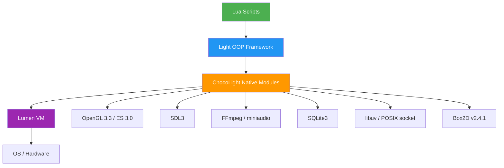
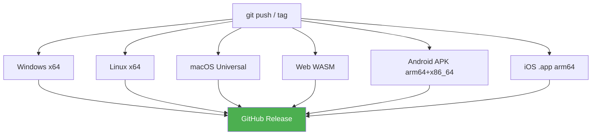

# ChocoLight Engine — 综合评测报告

> 评测日期: 2026-04-26 | 版本: v0.3 (Phase 2 Complete) | 仓库: [futzhj/ChocoLightEngine](https://github.com/futzhj/ChocoLightEngine)

---

## 一、项目概览

ChocoLight 是一个以 **Lua 脚本为核心** 的轻量级跨平台游戏引擎，底层虚拟机 **Lumen** 是对 Lua 5.1 的现代化 C++17 重实现。

### 代码规模

| 组件 | 文件数 | 代码行数 | 体积 |
|------|--------|----------|------|
| Lumen VM (核心 + 标准库) | 67 | 26,613 | 988 KB |
| ChocoLight 引擎 (原生模块) | 25 | ~11,000 | ~420 KB |
| 移动端模板 (Android SDL3 + iOS) | ~25 | ~1,500 | — |
| 工具链 (Python → Nuitka exe) | 3 | ~900 | — |
| **总计** | **~120** | **~40,000** | **~1.4 MB** |

### 架构层级



---

## 二、评分卡

| 维度 | v0.1 | v0.3 | 等级 | 说明 |
|------|:----:|:----:|:----:|------|
| **架构设计** | 8.5 | 9.0 | ⭐⭐⭐⭐⭐ | 新增 RenderBackend 抽象层 + PlatformWindow 抽象层 + 后端解耦 |
| **跨平台能力** | 9.0 | 9.5 | ⭐⭐⭐⭐⭐ | SDL3 统一 6 平台窗口/事件/GL，Android 真机+模拟器验证通过 |
| **图形渲染** | 6.0 | 8.0 | ⭐⭐⭐⭐ | GL 3.3 Core + GLES 3.0，Shader 管线，粒子系统，Tilemap |
| **音视频** | 7.0 | 8.0 | ⭐⭐⭐⭐ | miniaudio 跨平台音频 + FFmpeg 视频，Android MediaPlayer 后端 |
| **游戏能力** | 3.0 | 7.5 | ⭐⭐⭐⭐ | Input 管理器 + Box2D 物理 + ECS + 粒子 + Tilemap |
| **网络能力** | 8.0 | 8.5 | ⭐⭐⭐⭐ | libuv 跨平台 + POSIX socket 移动端回退 |
| **数据库** | 8.0 | 8.0 | ⭐⭐⭐⭐ | SQLite3 + ORM，无变化 |
| **安全保护** | 7.5 | 7.5 | ⭐⭐⭐⭐ | 5 层反调试 + 静默异常 + 脚本加密 |
| **文档** | 7.0 | 8.0 | ⭐⭐⭐⭐ | 完整 API 参考文档 + 6A 工作流文档 |
| **总评** | **7.7** | **8.4** | **⭐⭐⭐⭐** | **从工具引擎进化为完整游戏引擎** |

---

## 三、引擎等级定位

### 对标分析

| 等级 | 代表引擎 | v0.1 | v0.3 |
|------|----------|:----:|:----:|
| 入门级 | LÖVE 2D, Pygame | — | — |
| 轻量级 | Defold, Solar2D | ✅ | — |
| **准中量级** | **LÖVE 2D Pro, Cocos2d-Lua** | — | **✅ 当前定位** |
| 中量级 | Cocos2d-x, Godot | — | — |

### 核心优势 (v0.3 新增标记 🆕)

| 优势 | 详情 |
|------|------|
| **VM 自主可控** | Lumen C++17 重实现，完整编译权 |
| **全平台部署** | 6 平台 CI + 移动端真机验证 |
| **多层安全** | 反调试 + 脚本加密 + opcode 混淆 |
| **游戏格式** | WDF/WAS/NEM 格式原生支持 |
| 🆕 **现代渲染** | GL 3.3 Core + GLES 3.0 Shader 管线 |
| 🆕 **物理引擎** | Box2D v2.4.1 集成 (桌面/移动平台) |
| 🆕 **ECS 架构** | 轻量实体组件系统 |
| 🆕 **粒子系统** | GPU 友好的 2D 粒子发射器 |
| 🆕 **输入管理器** | 键盘/鼠标/触摸/手柄统一输入 |
| 🆕 **SDL3 窗口** | 替代 GLFW，原生 Android/iOS 支持 |

### 已解决的不足 (v0.1 → v0.3)

| 原不足 | 解决方案 | 状态 |
|--------|---------|:----:|
| OpenGL 1.x 固定管线 | GL 3.3 Core + ES 3.0 + Legacy 回退 | ✅ |
| 无物理引擎 | Box2D v2.4.1 集成 (桌面/移动) | ✅ |
| 无 ECS | 轻量 ECS 实现 | ✅ |
| 音频仅 PlaySound | miniaudio 跨平台音频后端 | ✅ |
| 网络仅 WinSock | libuv (桌面) + POSIX socket (移动端) | ✅ |
| 无粒子系统 | Light.Graphics.Particles | ✅ |
| 无 Tilemap | Light.Graphics.Tilemap | ✅ |
| 无输入管理器 | Light.Input (键盘/鼠标/触摸/手柄) | ✅ |

### 当前不足

| 不足 | 影响 | 改进方向 |
|------|------|----------|
| Android 物理后端缺口 | 已切换 vendored Box2D v2.4.1 | Android/iOS 默认启用 Physics |
| 缺少文本输入控件 | 表单/编辑器能力不足 | TextInput + IME 适配 |
| 缺少高级音频能力 | 空间音频/混音控制有限 | Audio Mixer + 3D Sound |

---

## 四、模块详细分析

### 4.1 Lumen VM

> 26,613 LOC | C++17 | Lua 5.1 完全兼容 + 5.2/5.3 扩展 API

**亮点:**
- **LNI** — Handle-based C++17 API，类型安全
- **xxhash** — 可选高性能哈希
- **全新实现** — 非 fork，现代 C++17

### 4.2 图形系统 (v0.3 重大升级)

> OpenGL 3.3 Core / GLES 3.0 | SDL3 | stb_image + stb_truetype

**v0.3 新增:**
- **RenderBackend 抽象**: GL33Backend (Shader) / LegacyBackend (固定管线) 运行时切换
- **粒子系统**: `Light.Graphics.Particles` — 发射器配置 + 批量渲染
- **Tilemap**: `Light.Graphics.Tilemap` — 瓦片地图加载/渲染
- **Shader 管线**: VAO/VBO + 自动 Uniform 管理

### 4.3 窗口与输入 (v0.3 重大升级)

> SDL3 (替代 GLFW) | 统一输入管理器

**PlatformWindow 抽象层**: SDL3 实现 (全平台)，事件统一为 `PlatformWindow::Event`

**Input 管理器** (15 函数):
| API | 功能 |
|-----|------|
| `IsKeyDown/IsKeyPressed` | 键盘状态/帧按下 |
| `IsMouseDown/GetMousePosition/GetMouseWheel` | 鼠标 |
| `GetTouchCount/GetTouch` | 多点触控 |
| `GetGamepadCount/IsGamepadConnected/GetGamepadButton/GetGamepadAxis` | 手柄 |
| `AddAction/IsActionDown` | 虚拟动作映射 |
| `Window:SetOrientation` | 运行时屏幕方向控制 (Android JNI) |

**Android 适配**: 精简版 Input (~90行) 避免 MuMu RenderThread 崩溃，完整触摸/键盘功能。

### 4.4 物理引擎 (v0.3 新增)

> Box2D v2.4.1 | 桌面 + Android/iOS

- `Light.Physics` 模块 — World/Body/Shape/Joint 完整 API
- 碰撞检测 + 刚体模拟
- Android/iOS 通过 vendored Box2D v2.4.1 启用

### 4.5 ECS (v0.3 新增)

> 轻量 Entity-Component-System

- `Light.ECS` 模块 — Entity 创建/销毁、Component 添加/查询、System 注册/更新
- 适合中等规模场景管理

### 4.6 网络系统 (v0.3 升级)

> libuv (桌面) + POSIX socket (Android/iOS) | HTTP 1.1 + WebSocket (RFC 6455)

**v0.3 变更**: 从 WinSock2 升级到跨平台方案，移动端用 POSIX socket 回退。

### 4.7 音视频 (v0.3 升级)

> miniaudio (全平台) + FFmpeg (桌面视频) + Android MediaPlayer

**v0.3 变更**: miniaudio 替代 Windows PlaySound，Android 使用 MediaPlayer + SurfaceTexture 视频后端。

---

## 五、安全体系

(与 v0.1 相同，5 层反调试 + CLPK 加密 + 静默异常策略)

---

## 六、Android 平台专项

### 6.1 架构

```
Java Layer:  ChocoLightActivity → SDLActivity
Native Layer: main.cpp → Light (static lib) + SDL3 (shared) + Lumen
Build: Gradle + CMake + NDK (minSdk 28, ABI: arm64-v8a + x86_64)
```

### 6.2 已知限制

| 限制 | 原因 | 影响 |
|------|------|------|
| Box2D 未编译 | 已切换 v2.4.1 vendored 源码 | 需要 Android/iOS CI 继续验证 |
| Input 为精简版 | .so 段布局触发 MuMu 崩溃 | 无手柄/动作映射 |
| FFmpeg 不可用 | 动态库加载路径不同 | 视频用 MediaPlayer 替代 |

### 6.3 屏幕方向

Lua 运行时控制: `Window:SetOrientation("landscape"|"portrait"|"auto")`
底层通过 JNI 调用 `Activity.setRequestedOrientation()`。

---

## 七、CI/CD 管线



---

## 八、改进路线图

### Phase 1: 基础增强 ✅ 已完成
- [x] SDL3 替代 GLFW (全平台窗口/事件)
- [x] OpenGL 3.3 Core + GLES 3.0 Shader 管线
- [x] miniaudio 跨平台音频
- [x] libuv / POSIX socket 跨平台网络
- [x] API 参考文档生成

### Phase 2: 游戏能力 ✅ 已完成
- [x] Box2D v2.4.1 物理引擎 (桌面/移动)
- [x] ECS 实体组件系统
- [x] 粒子系统
- [x] Tilemap 瓦片地图
- [x] 统一输入管理器 (键盘/鼠标/触摸/手柄)
- [x] Android APK 构建 + 真机验证

### Phase 3: 进阶功能 (当前阶段)
- [x] Box2D Android 适配 (vendored Box2D v2.4.1)
- [x] 用户 Shader API (编译/绑定/Uniform)
- [x] 精灵动画系统 (SpriteAnimation)
- [x] UI 控件库 (Button/Label/Panel/CheckBox)
- [x] 资源热重载
- [x] 场景管理器 (Scene Stack)
- [x] AES-256-CBC / SHA-256 / MD5 / Base64 加密模块

### Phase 4: 高级特性 (长期)
- [ ] Lumen JIT 编译器
- [ ] Vulkan / Metal 渲染后端
- [x] 可视化编辑器 Demo
- [ ] 音频空间化 (3D Sound)
- [ ] 网络同步框架 (Lockstep / State Sync)

---

## 九、总结

ChocoLight v0.3 完成了从 **工具级引擎** 到 **游戏级引擎** 的跨越：

- **渲染层** 从固定管线升级到 Shader 管线 + 粒子 + Tilemap
- **窗口层** 从 GLFW 迁移到 SDL3，原生支持 Android/iOS
- **游戏层** 新增 Physics / ECS / Input / Particles / Tilemap 五大模块
- **平台层** Android APK 真机 + 模拟器双验证通过

定位从 **Defold/Solar2D 同级** 提升到 **准中量级引擎**，接近 LÖVE 2D Pro / Cocos2d-Lua 的能力水平。
