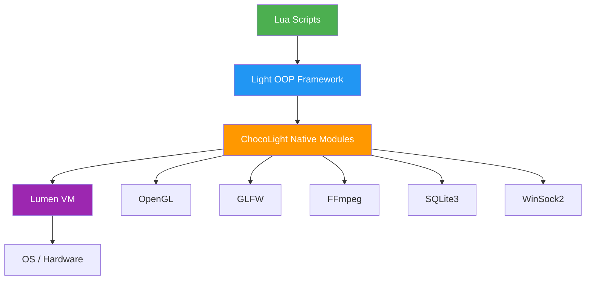
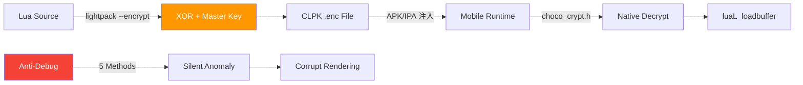
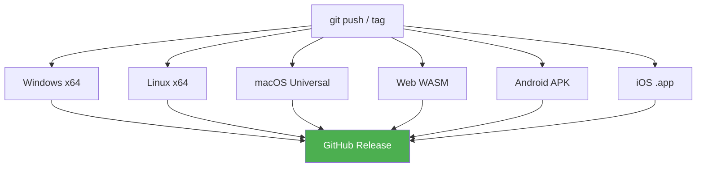

# ChocoLight Engine — 综合评测报告

> 评测日期: 2026-04-25 | 版本: v0.1 | 仓库: [futzhj/ChocoLightEngine](https://github.com/futzhj/ChocoLightEngine)

---

## 一、项目概览

ChocoLight 是一个以 **Lua 脚本为核心** 的轻量级跨平台游戏引擎，底层虚拟机 **Lumen** 是对 Lua 5.1 的现代化 C++17 重实现。

### 代码规模

| 组件 | 文件数 | 代码行数 | 体积 |
|------|--------|----------|------|
| Lumen VM (核心 + 标准库) | 67 | 26,613 | 988 KB |
| ChocoLight DLL (原生模块) | 16 | 6,554 | 250 KB |
| 移动端模板 (Android + iOS) | ~20 | ~1,200 | — |
| 工具链 (Python → Nuitka exe) | 3 | ~900 | — |
| **总计** | **~106** | **~35,000** | **~1.2 MB** |

### 架构层级



---

## 二、评分卡

| 维度 | 评分 | 等级 | 说明 |
|------|:----:|:----:|------|
| **架构设计** | 8.5/10 | ⭐⭐⭐⭐ | VM + 原生模块分层清晰，LNI handle-based API 设计超越原版 Lua stack API |
| **跨平台能力** | 9/10 | ⭐⭐⭐⭐⭐ | 6 平台全覆盖 (Win/Linux/macOS/Android/iOS/Web)，CI 自动构建 |
| **图形渲染** | 6/10 | ⭐⭐⭐ | OpenGL 1.x/2.x 固定管线，足够 2D，3D 能力有限 |
| **音视频** | 7/10 | ⭐⭐⭐⭐ | FFmpeg 动态加载全格式解码，但仅 Windows PlaySound 播放 |
| **网络能力** | 8/10 | ⭐⭐⭐⭐ | HTTP + WebSocket 客户端/服务器全栈，RFC 6455 完整实现 |
| **数据库** | 8/10 | ⭐⭐⭐⭐ | SQLite3 + 纯 Lua ORM (Record)，支持事务、分页、Where 链式查询 |
| **工具链** | 8.5/10 | ⭐⭐⭐⭐ | Nuitka 编译保护、XOR 加密打包、opcode 重映射、CI 全自动 |
| **安全保护** | 7.5/10 | ⭐⭐⭐⭐ | 5 层反调试 + 静默异常 + 脚本加密 + 二进制名校验 |
| **文档 / 可维护性** | 7/10 | ⭐⭐⭐⭐ | 每个函数标注 IDA 地址还原，注释详尽。缺少用户文档和 API 手册 |
| **性能** | 7.5/10 | ⭐⭐⭐⭐ | xxhash 高性能哈希、FNV-1a 索引查找、懒加载策略��UTF-8 动态字形缓存 |
| **总评** | **7.7/10** | **⭐⭐⭐⭐** | **专业级轻量引擎，适合 2D 游戏和工具开发** |

---

## 三、引擎等级定位

### 对标分析

| 等级 | 代表引擎 | ChocoLight |
|------|----------|:----------:|
| 入门级 | LÖVE 2D, Pygame | — |
| 轻量级 | Defold, Solar2D | ✅ **当前定位** |
| 中量级 | Cocos2d-x, Godot | — |
| 重量级 | Unity, Unreal | — |

### 核心优势

| 优势 | 详情 |
|------|------|
| 🔧 **VM 自主可控** | Lumen 不是 fork，是从零 C++17 重实现，拥有完整编译权 |
| 🌐 **全平台一键部署** | 6 平台 CI + 移动端热注入，无需重新编译原生层 |
| 🔒 **多层保护** | 反调试 + 脚本加密 + opcode 混淆 + 二进制校验 |
| 🎮 **游戏格式原生支持** | WDF/WAS/NEM 格式解析（网易系引擎资源）|
| 🗄️ **内建数据库** | SQLite + ORM 开箱即用，适合单机存档 |
| 📡 **全栈网络** | HTTP + WS + Web 路由框架，可做联网游戏 |

### 当前不足

| 不足 | 影响 | 改进方向 |
|------|------|----------|
| OpenGL 1.x 固定管线 | 不支持着色器、粒子、后处理 | 升级到 OpenGL 3.3 / ES 3.0 |
| 无物理引擎 | 无碰撞检测、刚体模拟 | 集成 Box2D / Chipmunk |
| 无场景图 / ECS | 大型项目难以管理 | 增加场景管理器 |
| 音频仅 PlaySound | 无混音、音量控制、3D 音效 | 集成 OpenAL / miniaudio |
| 缺少用户文档 | 上手门槛高 | 生成 API 手册 + 示例项目 |
| 网络仅 WinSock | 非 Windows 平台网络不可用 | 使用 POSIX socket / libuv |

---

## 四、模块详细分析

### 4.1 Lumen VM

> 26,613 LOC | C++17 | Lua 5.1 完全兼容 + 5.2/5.3 扩展 API

**亮点:**

- **LNI (Lumen Native Interface)** — JNI 风格的 handle-based API，替代原版 stack-based 操作，类型安全、跨函数传递
- **xxhash 高性能哈希** — 可选编译 `LUA_USE_HP_HASH`，提升 table 查找性能
- **C++17 重实现** — 不是 Lua 5.1 fork, 是全新实现，代码更现代
- **Lua 5.1 兼容模式** — `LUA_USE_COMPAT=ON` 生成 `lua51.dll`，可替换 LuaJIT

**改进建议:**

- GC 目前是标准 mark-sweep，考虑增量 GC 或分代 GC
- 缺少 JIT 编译，纯解释执行性能上限受限

### 4.2 图形系统

> OpenGL 1.x/2.x | GLFW 3.4 | stb_image + stb_truetype

**支持的绘制原语:**

| API | 功能 |
|-----|------|
| `Draw(img, x,y,z)` | 纹理绘制 (支持 9 参变换) |
| `DrawQuad(img, ...)` | 子区域绘制 (Atlas/SpriteSheet) |
| `Rectangle/Triangle/Circle/Line` | 几何基元 |
| `RoundedRectangle` | 圆角矩形 |
| `Print(text, font, ...)` | UTF-8 文��渲染 (CJK 动态缓存) |
| `SetCanvas/GetCanvas` | FBO 离屏渲染 |
| `Push/Pop/Translate/Rotate/Scale` | 矩阵变换栈 |

**字体系统:** 动态字形缓存 (BakeGlyph)，支持 Unicode/CJK，128×128~2048×2048 自动扩展图集

### 4.3 网络系统

> WinSock2 | HTTP 1.1 + WebSocket (RFC 6455)

```
HTTP Client → Open/SendRequest/OnHttp
HTTP Server → Bind/Listen/Accept/Route
WebSocket   → Upgrade/SendMessage/OnMessage
Web Framework → Get/Post/Put/Delete 路由 + Session
```

内嵌完整 Web 微框架（纯 Lua），支持路由绑定、模板渲染、WebSocket 聊天。

### 4.4 音视频

> FFmpeg 59/57/4 动态加载 | Windows PlaySound | OpenGL 纹理视频

- **Audio**: FFmpeg 解码全格式 → PCM → PlaySound 播放
- **Video**: FFmpeg 解码 → RGBA 帧 → GL 纹理逐帧更新
- **AudioData**: 支持从文件/内存/参数三种方式创建

### 4.5 数据与存储

> SQLite3 amalgamation | Light.Record ORM

**ORM 完整功能:**
- `Table()` 自动建表
- `Create/Insert/Update/Delete` CRUD
- `Where/Find/Fetch/FetchPage` 查询
- `Begin/Commit/RollBack` 事务
- `Escape/Blob` SQL 安全
- SQLite 扩展: carray, fileio, regexp, series, sha3, uuid

### 4.6 游戏格式插件

> WDF (网易 PFDW) | WAS (精灵帧) | NEM

- **WDF 解析**: FNV-1a 哈希桶 O(1) ���找、byte-reversal + XOR 0x5A 解码
- **WAS 精灵**: 16B 头 + 256色 RGB565 调色板 + RLE 解压 + 帧索引
- 提供 `GetData`, `GetImageData`, `GetTGAData`, `GetAudioData`, `GetSpriteImagesData`

---

## 五、安全体系



| 层级 | 手段 | 强度 |
|------|------|:----:|
| 源码保护 | Nuitka C 编译工具，无 .pyc 可反编译 | 🟢 高 |
| 脚本加密 | XOR + CLPK 格式 + 混淆 master key | 🟡 中 |
| 运行时反调试 | IsDebuggerPresent + DebugPort + Timing + HW BP | 🟢 高 |
| 反篡改 | 二进制名校验 (禁止 light/luajit 命名) | 🟡 中 |
| 渐进惩罚 | 检测到调试器不崩溃，而是逐步破坏渲染/音频 | 🟢 高 |

---

## 六、CI/CD 管线



tag 推送自动触发 6 平台构建 + GitHub Release 发布，含打包工具。

---

## 七、改进路线图

### Phase 1: 基础增强 (短期)
- [ ] 升级 OpenGL 3.3 core profile + shader pipeline
- [ ] 跨平台网络 (POSIX socket / libuv)
- [ ] 集成 miniaudio 替代 PlaySound
- [ ] 自动生成 API 文档 (从代码注释)

### Phase 2: 游戏能力 (中期)
- [ ] 集成 Box2D 物理引擎
- [ ] 场景图 / ECS 实体系统
- [ ] 粒子系统
- [ ] Tilemap 支持
- [ ] 输入管理器 (手柄 / 触摸)

### Phase 3: 高级特性 (长期)
- [ ] Lumen JIT 编译器
- [ ] Vulkan / Metal 渲染后端
- [ ] 可视化编辑器
- [ ] 热重载开发工具
- [ ] AES-256 加密替代 XOR

---

## 八、总结

ChocoLight 是一个 **设计精良的轻量级 Lua 游戏引擎**：

- **VM 层** 是最大亮点 — LNI handle-based API 是对 Lua 生态的真正创新
- **工具链** 完备且安全 — 全 Nuitka 原生编译 + XOR 脚本加密 + 5 层反调试
- **跨平台** 覆盖全面 — 6 平台 CI，移动端热注入无需重新编译
- **功能模块** 齐全 — 图形、网络、数据库、��视频、游戏格式一应俱全

定位在 **Defold / Solar2D 同级别** 的轻量引擎，但拥有更高的 VM 自主权和安全保护能力。适合 2D 游戏、工具开发、游戏逆向研究等场景。
