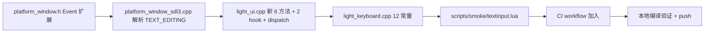

# Phase AQ — TextInput + IME — 共识文档

> 用户已确认 **全部采用推荐方案**。本文档锁定决策,作为后续实施的输入。

---

## 一、最终决策

| 决策 | 方案 | 实现要点 |
|---|---|---|
| **Q1** API 归属 | **A** `window:StartTextInput()` 等 6 个方法挂在 `Light.UI.Window` userdata 上 | 在 `light_ui.cpp` 中找到 `LightWindow` userdata 的 method 表添加 |
| **Q2** Event 缓冲区 | **A** 扩容 `Event::text[128]` | `platform_window.h:69` 改 32 → 128 |
| **Q3** TextEditing 回调签名 | **A** `OnTextEditing(fn)` 触发 `fn(text, start, length)` | 与 `OnKey(key,scancode,action,mods)` 风格一致 |
| **Q4** Properties 形式 | **A** Lua table `{type="email", capitalization="sentences", ...}` 内部转 SDL_PropertiesID | C++ 内 SDL_CreateProperties → SetXxxProperty → StartTextInputWithProperties → DestroyProperties |
| **Q5** SetTextInputArea 坐标 | **A** `(x, y, w, h, cursor?)` 像素 | 与 `Light.Graphics.DrawRect` 风格一致 |

---

## 二、最终交付清单

### 2.1 C++ 修改 (按文件)

#### `ChocoLight/include/platform_window.h`
- 新增 `Event::Type::TextEditing = 17` (TextInput=12, GamepadConnect=16 已占,17 新)
- 新增字段 `int text_start = 0` / `int text_length = 0` (TextEditing 专用)
- `char text[32]` → `char text[128]`

#### `ChocoLight/src/platform_window_sdl3.cpp`
- 新增 `SDL_EVENT_TEXT_EDITING` case → `Event::TextEditing`,填 `text` / `text_start` / `text_length`
- `SDL_EVENT_TEXT_INPUT` case 用 `sizeof(out->text) - 1 = 127` (现有写法已通用)

#### `ChocoLight/src/light_ui.cpp`
- 在 `LightWindow` userdata 上新增 6 个方法:
  - `window:StartTextInput()` / `:StartTextInput(props_table)`
  - `window:StopTextInput()`
  - `window:IsTextInputActive() -> bool`
  - `window:SetTextInputArea(x, y, w, h, [cursor])`
  - `window:ClearComposition()`
  - `window:IsScreenKeyboardShown() -> bool`
- 新增 hook 注册: `Light.UI.OnTextInput(fn)` / `Light.UI.OnTextEditing(fn)`
- 新增 dispatch: `DispatchOnTextInput` / `DispatchOnTextEditing`
- 在 `DispatchEvents` 中加 2 个 case 调用 dispatch

#### `ChocoLight/src/light_keyboard.cpp`
- 新增常量 (只读字符串/整数,挂模块表):
  - `TEXTINPUT_TYPE_TEXT` / `TEXT_NAME` / `TEXT_EMAIL` / `TEXT_USERNAME` / `TEXT_PASSWORD_HIDDEN` / `TEXT_PASSWORD_VISIBLE` / `NUMBER` / `NUMBER_PASSWORD_HIDDEN` / `NUMBER_PASSWORD_VISIBLE`  
  - `CAPITALIZATION_NONE` / `SENTENCES` / `WORDS` / `LETTERS`

### 2.2 Smoke 测试 `scripts/smoke/textinput.lua`

阶段 (~5):
1. **API 注册检查**: `window:StartTextInput`/`StopTextInput`/`IsTextInputActive`/`SetTextInputArea`/`ClearComposition`/`IsScreenKeyboardShown` 都是 function;`Light.UI.OnTextInput`/`OnTextEditing` 是 function
2. **常量存在**: `TEXTINPUT_TYPE_*` 12 个常量已挂
3. **无窗口边界**: 无 window 创建时调用,优雅返回 nil/false 或者 sandbox skip (因 light_ui.cpp 处于无 GL 模式)
4. **窗口创建后 lifecycle**: `IsTextInputActive()` 默认 false → `StartTextInput()` → 仍为 `false` 或 `true` 取决于平台 (smoke 仅断言不 crash)
5. **Properties 分支不崩**: `win:StartTextInput({type="email", capitalization="sentences"})` 调用不 crash

### 2.3 CI

- `.github/workflows/build-templates.yml` Windows runtime smoke 串末尾加 `textinput.lua`
- 6 平台编译 + Windows runtime smoke 全绿

---

## 三、技术约束

1. **不破坏现有 Event POD**: 仅在末尾追加字段,保持 layout 兼容
2. **不引入新模块**: 全部挂载到现有 `Light.UI.Window` 和 `Light.Keyboard`,不新建 `Light.TextInput`
3. **不阻塞**: `StartTextInput*` 在无 SDL_INIT_VIDEO/无 window 时优雅返回 false,不 crash
4. **Lazy props**: 仅当 Lua 传入 props table 时才 `SDL_CreateProperties`,普通 `StartTextInput()` 走纯净路径

---

## 四、验收标准 (DoD)

- [ ] `platform_window.h` Event 扩展不破坏现有事件类型枚举
- [ ] `light_ui.cpp` 新 6 方法都注册到 `LightWindow` 元表
- [ ] `Light.UI.OnTextInput(fn)` / `OnTextEditing(fn)` 触发后回调有 UTF-8 text
- [ ] `Light.Keyboard.TEXTINPUT_TYPE_*` 12 个常量可读
- [ ] `scripts/smoke/textinput.lua` 5 阶段全部通过 `lightc -p` 和运行时
- [ ] 6 平台 CI 全绿,Windows runtime smoke 通过

---

## 五、实施顺序

