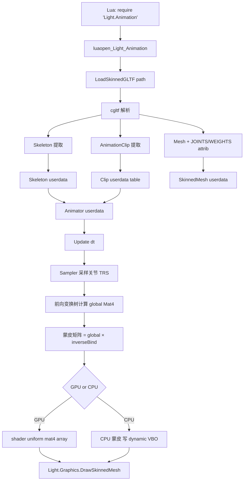
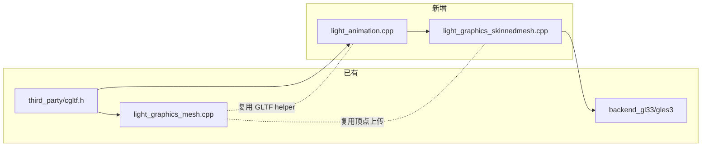
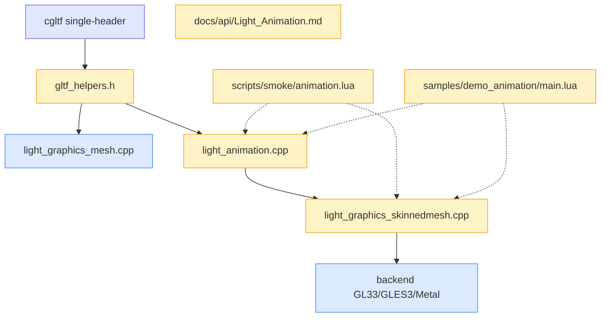

# Phase AV — 骨骼动画 + 状态机 — 架构设计文档

> **6A Stage 2: Architect**
>
> 来源：CONSENSUS_PhaseAV.md 已锁定 5 决策点。本文档定义系统分层、模块依赖、接口契约、数据流、异常处理。

---

## 1. 整体架构



---

## 2. 分层设计

### 2.1 数据层（静态，加载后只读）

| 类型 | 文件 | 职责 |
|------|------|------|
| `Skeleton` | `light_animation.cpp` | 关节层级 + 反向绑定矩阵 + jointName→idx |
| `AnimationClip` | `light_animation.cpp` | 时间轴 + sampler 数组 |
| `Sampler` | `light_animation.cpp` | 单关节单通道（T/R/S）的 keyframe + 插值类型 |
| `SkinnedMeshAsset` | `light_graphics_skinnedmesh.cpp` | Mesh GL handle + Skeleton ref + JOINTS/WEIGHTS attribute layout |

### 2.2 运行时层（每帧推进）

| 类型 | 文件 | 职责 |
|------|------|------|
| `Animator` | `light_animation.cpp` | currentState / params / events / 当前播放 clip + 时间 / Crossfade 状态 |
| `JointMatrices` | `light_animation.cpp` | float[64*16] 每帧重算的蒙皮矩阵缓冲 |

### 2.3 渲染层（与 Phase AS 衔接）

| 函数 | 文件 | 职责 |
|------|------|------|
| `Light.Graphics.DrawSkinnedMesh(skinnedMesh, animator, transform, material)` | `light_graphics_skinnedmesh.cpp` | 上传 jointMatrices uniform + 调 backend draw |
| Skinning vertex shader | backend 内嵌字符串 | 对 v_position 做 4-mat 加权变换 |

### 2.4 模块依赖图



---

## 3. 核心数据结构（C++）

### 3.1 Skeleton

```cpp
namespace LT { namespace Anim {

struct JointNode {
    std::string name;
    int parent = -1;            // 索引到 Skeleton::joints；-1 = 根
    std::vector<int> children;  // 子关节索引

    // 静态本地变换（绑定姿态时的 TRS，作为采样器没覆盖时的回退）
    float local_t[3]   = {0, 0, 0};
    float local_r[4]   = {0, 0, 0, 1};   // 四元数 wxyz 顺序遵循 cgltf
    float local_s[3]   = {1, 1, 1};
};

struct Skeleton {
    std::vector<JointNode> joints;
    std::vector<float>     inverseBindMatrices;  // 16 floats per joint
    int                    rootJoint = -1;       // 第一个 parent==-1 的关节
    std::unordered_map<std::string, int> nameToIndex;

    // Lua: __gc + __tostring + IsAlive 标志
    bool alive = true;
};

} } // namespace LT::Anim
```

### 3.2 AnimationClip

```cpp
enum class InterpMode : uint8_t {
    LINEAR = 0,
    STEP = 1,
    CUBICSPLINE = 2,    // glTF 2.0 三种法定模式
};

enum class ChannelTarget : uint8_t {
    TRANSLATION = 0,
    ROTATION = 1,
    SCALE = 2,
    WEIGHTS = 3,         // morph target 权重，本 Phase 不做
};

struct Sampler {
    int                jointIndex;        // -1 = 无效
    ChannelTarget      target;
    InterpMode         mode;
    std::vector<float> times;             // keyframe 时间（升序）
    std::vector<float> values;            // 对应 TRS 数据；CUBICSPLINE 每点 3 倍数据 (in/v/out)
};

struct AnimationClip {
    std::string           name;
    float                 duration = 0.0f;     // 自动取所有 sampler max time
    std::vector<Sampler>  samplers;
    bool                  alive = true;
};
```

### 3.3 SkinnedMeshAsset

```cpp
struct SkinnedMeshAsset {
    uint32_t vboPos;         // POSITION   (vec3 attrib 0)
    uint32_t vboNorm;        // NORMAL     (vec3 attrib 1)
    uint32_t vboUV;          // TEXCOORD_0 (vec2 attrib 2)
    uint32_t vboJoints;      // JOINTS_0   (uvec4 attrib 5) — 新加
    uint32_t vboWeights;     // WEIGHTS_0  (vec4  attrib 6) — 新加
    uint32_t ibo;
    uint32_t vao;            // GL 3.3 Core 路径
    uint32_t indexCount;
    uint32_t vertexCount;

    // 关联 Skeleton（强引用）
    Skeleton* skeletonPtr;
    int       skeletonRef;   // Lua registry ref，防 GC

    // CPU fallback 路径专用
    std::vector<RenderVertex3D>   cpuOriginalVertices;  // 蒙皮前的位置/法线
    std::vector<uint32_t>         cpuJointIndices;      // 4 关节 / 顶点 (小端 packed)
    std::vector<float>            cpuWeights;           // 4 weight / 顶点

    bool alive = true;
};
```

### 3.4 Animator

```cpp
struct AnimatorState {
    std::string  name;
    AnimationClip* clip;
    int          clipRef;           // Lua registry ref
    bool         loop = true;
    float        currentTime = 0.0f;
};

struct AnimatorTransition {
    int    fromStateIdx;            // -1 = "any state"
    int    toStateIdx;
    int    conditionFnRef;          // Lua function registry ref：fn(animator) -> bool
    float  fadeTime = 0.2f;
};

struct AnimatorEvent {
    int    stateIdx;
    float  triggerTime;             // 在 clip 时间轴上的时刻
    int    callbackRef;             // Lua function registry ref：fn(animator)
    bool   triggeredThisCycle;      // 防本帧重复触发
};

struct Animator {
    Skeleton* skeletonPtr;
    int       skeletonRef;

    std::vector<AnimatorState>      states;
    std::vector<AnimatorTransition> transitions;
    std::vector<AnimatorEvent>      events;
    std::unordered_map<std::string, float> params;     // 状态机参数

    int   currentStateIdx = -1;
    int   crossfadeTargetIdx = -1;       // -1 = 不在 crossfade
    float crossfadeTime = 0.0f;          // 当前 crossfade 已用时间
    float crossfadeDuration = 0.0f;

    // 缓存输出
    std::vector<float> jointMatrices;    // 64 * 16 floats

    bool alive = true;
};
```

---

## 4. Lua API 完整签名

### 4.1 Light.Animation 顶层

```lua
local Anim = require 'Light.Animation'

-- 加载 skinned glTF（一次性产出 Skeleton + Clips + SkinnedMesh）
local pack = Anim.LoadSkinnedGLTF(path) -- -> {skeleton, clips, mesh}, err
-- pack.skeleton: Skeleton userdata
-- pack.clips:    table<string, AnimationClip>
-- pack.mesh:     SkinnedMesh userdata (nil 如果 glTF 无 skin)

-- 直接构造空 Animator
local animator = Anim.NewAnimator(skeleton)  -- -> Animator
```

### 4.2 Skeleton

```lua
sk:GetJointCount()                    -- -> int
sk:GetJointName(idx)                  -- -> string (1-based; 越界 -> nil)
sk:FindJoint(name)                    -- -> idx, err  (1-based; 找不到 -> nil)
sk:GetJointParent(idx)                -- -> parent_idx (0=无 parent)
sk:GetRootJoint()                     -- -> idx
sk:GetBindLocalTRS(idx)               -- -> tx,ty,tz, qw,qx,qy,qz, sx,sy,sz
sk:GetInverseBindMatrix(idx)          -- -> 16 floats (列主序)
sk:IsAlive()
sk:Delete() / sk:__gc / sk:__tostring
```

### 4.3 AnimationClip

```lua
clip:GetName()                        -- -> string
clip:GetDuration()                    -- -> seconds
clip:GetSamplerCount()                -- -> int
clip:GetSamplerInfo(idx)              -- -> {jointIndex, target('translation'|'rotation'|'scale'), mode('linear'|'step'|'cubicspline'), keyframes}
clip:Sample(t, jointIndex, target)    -- -> tx,ty,tz / qw,qx,qy,qz / sx,sy,sz  (按 target 类型不同返回 3 或 4 个 float)
clip:IsAlive()
clip:Delete() / clip:__gc / clip:__tostring
```

### 4.4 SkinnedMesh

```lua
sm:GetVertexCount() / sm:GetIndexCount()
sm:GetSkeleton()                      -- -> Skeleton userdata
sm:GetCPUSkinningEnabled() / sm:SetCPUSkinningEnabled(bool)  -- 强制走 CPU 路径（debug 用）
sm:IsAlive()
sm:Delete() / sm:__gc / sm:__tostring
```

### 4.5 Animator

```lua
-- 状态注册
animator:AddState(name, clip, [{loop=bool}])     -- 默认 loop=true
animator:GetStateCount() / animator:GetStateNames()
animator:RemoveState(name)

-- 直接控制
animator:Play(name)                                  -- 立即切换（无 crossfade）
animator:Crossfade(name, fadeTime)                   -- 显式 crossfade
animator:Pause() / animator:Resume() / animator:IsPaused()
animator:GetCurrentState() / animator:GetCurrentTime()
animator:SetCurrentTime(t)
animator:SetSpeed(scale)                            -- 全局时间缩放

-- 状态机
animator:AddTransition(from, to, condition_fn, [fadeTime])
                                                    -- from='*' or nil 表示 "any state"
animator:RemoveTransition(idx)
animator:GetTransitionCount()

-- 参数
animator:SetParam(name, number)
animator:GetParam(name)                              -- -> number, err
animator:HasParam(name)                              -- -> bool

-- 事件帧
animator:AddEvent(stateName, triggerTime, callback_fn)
                                                    -- callback_fn(animator)
animator:RemoveEvent(idx)
animator:ClearEvents()

-- 主循环
animator:Update(dt)                                  -- 推进 + 触发 transition + 触发 event
animator:GetJointMatrices()                          -- -> array<float> 16*N (蒙皮用)
animator:GetSkeleton()                               -- -> Skeleton userdata

-- 生命周期
animator:IsAlive()
animator:Delete() / animator:__gc / animator:__tostring
```

### 4.6 Light.Graphics 扩展（在 light_graphics_skinnedmesh.cpp 注册到 `Light.Graphics`）

```lua
Light.Graphics.DrawSkinnedMesh(mesh, animator, transform_mat4, material_table)
-- transform_mat4: 16-element table (列主序), nil 视作单位矩阵
-- material_table: 同 Phase AS.4 PBR 材质表
-- 返回值: ok (bool), err (string)
```

---

## 5. GPU Skinning Vertex Shader（关键代码）

### 5.1 GL 3.3 Core / GLES 3.0

```glsl
#version 330 core
layout(location = 0) in vec3 a_position;
layout(location = 1) in vec3 a_normal;
layout(location = 2) in vec2 a_uv;
layout(location = 5) in uvec4 a_joints;     // JOINTS_0  (4 关节索引/顶点)
layout(location = 6) in vec4  a_weights;    // WEIGHTS_0 (4 权重，应归一化)

uniform mat4 u_view;
uniform mat4 u_proj;
uniform mat4 u_model;
uniform mat4 u_jointMatrices[64];           // 蒙皮矩阵数组

out vec3 v_normal;
out vec2 v_uv;
out vec3 v_worldPos;

void main() {
    // 4 关节加权混合
    mat4 skin =
        u_jointMatrices[a_joints.x] * a_weights.x +
        u_jointMatrices[a_joints.y] * a_weights.y +
        u_jointMatrices[a_joints.z] * a_weights.z +
        u_jointMatrices[a_joints.w] * a_weights.w;

    vec4 skinnedPos = skin * vec4(a_position, 1.0);
    vec4 worldPos   = u_model * skinnedPos;

    // 法线变换（忽略缩放假设，速度优先）
    vec3 skinnedNorm = mat3(skin) * a_normal;
    v_normal = mat3(u_model) * skinnedNorm;

    v_uv       = a_uv;
    v_worldPos = worldPos.xyz;
    gl_Position = u_proj * u_view * worldPos;
}
```

### 5.2 Fragment Shader（复用 Phase AS.4 PBR / Unlit，无需改动）

`a_color` 通道在 skinned 路径下被 JOINTS_0 占用（attribute slot 5），但 PBR 材质走 baseColor uniform，不依赖 vertex color。

### 5.3 GLES 2.0 / WebGL 1.0 Fallback（CPU Skinning）

不修改 shader（继续走 Phase AS.2/AS.4 已有的 GLES 2.0 shader），CPU 端每帧：

```cpp
// 伪代码
for (size_t i = 0; i < vertexCount; ++i) {
    Mat4 skin = jointMat[ji.x]*w.x + jointMat[ji.y]*w.y + ...;
    cpuVertices[i].pos  = skin.MulPoint(originalPos[i]);
    cpuVertices[i].norm = skin.MulVector(originalNorm[i]);
}
glBufferSubData(...)  // 重传 dynamic VBO
```

---

## 6. 关键算法

### 6.1 Sampler 采样（线性查找 + 三种插值）

```cpp
void Sampler::Evaluate(float t, float* out, int components) const {
    if (times.empty()) {
        // 回退到 bind pose（外层处理）
        return;
    }
    // 边界回退（不外推）
    if (t <= times.front()) {
        copyAt(0, out, components);
        return;
    }
    if (t >= times.back()) {
        copyAt(times.size() - 1, out, components);
        return;
    }
    // 线性查找（小数据量足够）
    size_t i = 0;
    while (i + 1 < times.size() && times[i + 1] < t) ++i;
    float t0 = times[i], t1 = times[i + 1];
    float u  = (t - t0) / (t1 - t0);

    switch (mode) {
        case InterpMode::STEP:
            copyAt(i, out, components);
            break;

        case InterpMode::LINEAR: {
            const float* a = &values[i * components];
            const float* b = &values[(i + 1) * components];
            if (components == 4) {
                // Quaternion: slerp（含最短路径翻转）
                Slerp(a, b, u, out);
            } else {
                for (int k = 0; k < components; ++k)
                    out[k] = a[k] * (1.0f - u) + b[k] * u;
            }
            break;
        }

        case InterpMode::CUBICSPLINE: {
            // 每点存 (in_tangent, value, out_tangent)，每组 3 倍 components
            const float* p0 = &values[i * components * 3 + components * 1];      // value of i
            const float* m0 = &values[i * components * 3 + components * 2];      // out_tangent of i
            const float* m1 = &values[(i + 1) * components * 3 + components * 0];// in_tangent of i+1
            const float* p1 = &values[(i + 1) * components * 3 + components * 1];// value of i+1
            float dt = t1 - t0;
            float u2 = u * u, u3 = u2 * u;
            float h00 = 2*u3 - 3*u2 + 1;
            float h10 = u3 - 2*u2 + u;
            float h01 = -2*u3 + 3*u2;
            float h11 = u3 - u2;
            for (int k = 0; k < components; ++k) {
                out[k] = h00*p0[k] + h10*dt*m0[k] + h01*p1[k] + h11*dt*m1[k];
            }
            // 旋转额外归一化
            if (components == 4) NormalizeQuat(out);
            break;
        }
    }
}
```

### 6.2 关节变换树前向计算

```cpp
void Animator::ComputeJointMatrices(float* outMatrices /* 64*16 */) {
    Skeleton* sk = this->skeletonPtr;
    int N = (int)sk->joints.size();

    // 临时数组：每关节当前 local TRS（采样器覆盖优先，否则用绑定姿态）
    std::vector<float> localT(N * 3), localS(N * 3);
    std::vector<float> localR(N * 4);
    for (int j = 0; j < N; ++j) {
        const auto& jn = sk->joints[j];
        memcpy(&localT[j*3], jn.local_t, sizeof(float)*3);
        memcpy(&localR[j*4], jn.local_r, sizeof(float)*4);
        memcpy(&localS[j*3], jn.local_s, sizeof(float)*3);
    }

    // 采样当前 state（如果在 crossfade，sampleA/sampleB 加权混合）
    SampleAndBlend(currentStateIdx, currentTime,
                   crossfadeTargetIdx, crossfadeTime, crossfadeDuration,
                   localT, localR, localS);

    // 前向遍历（按拓扑序：保证父先于子）
    std::vector<float> globalMatrices(N * 16);
    std::vector<bool> computed(N, false);
    std::function<void(int)> compute = [&](int idx) {
        if (computed[idx]) return;
        const auto& jn = sk->joints[idx];

        float localMat[16];
        ComposeMat(localMat, &localT[idx*3], &localR[idx*4], &localS[idx*3]);

        if (jn.parent < 0) {
            memcpy(&globalMatrices[idx*16], localMat, sizeof(localMat));
        } else {
            compute(jn.parent);
            MulMat(&globalMatrices[idx*16], &globalMatrices[jn.parent*16], localMat);
        }
        computed[idx] = true;
    };
    for (int j = 0; j < N; ++j) compute(j);

    // 蒙皮矩阵 = global × inverseBind
    int M = std::min(N, 64);
    for (int j = 0; j < M; ++j) {
        MulMat(&outMatrices[j*16], &globalMatrices[j*16], &sk->inverseBindMatrices[j*16]);
    }
    // 关节数 > 64 由上层 luaL_error
}
```

### 6.3 Crossfade 混合

```cpp
// 在采样阶段进行：sampleA 用 currentStateIdx, sampleB 用 crossfadeTargetIdx
void Animator::SampleAndBlend(...) {
    if (crossfadeTargetIdx < 0) {
        SampleClipInto(currentStateIdx, currentTime, localT, localR, localS);
        return;
    }
    float w = std::clamp(crossfadeTime / crossfadeDuration, 0.0f, 1.0f);
    std::vector<float> aT(N*3), bT(N*3);
    std::vector<float> aR(N*4), bR(N*4);
    std::vector<float> aS(N*3), bS(N*3);
    SampleClipInto(currentStateIdx,    currentTimeA, aT, aR, aS);
    SampleClipInto(crossfadeTargetIdx, currentTimeB, bT, bR, bS);
    for (int j = 0; j < N; ++j) {
        Lerp3(&localT[j*3], &aT[j*3], &bT[j*3], w);
        Slerp(&aR[j*4], &bR[j*4], w, &localR[j*4]);
        Lerp3(&localS[j*3], &aS[j*3], &bS[j*3], w);
    }
}
```

---

## 7. 数据流图（每帧）

```
[Lua 主循环]
    │
    ▼
animator:Update(dt)                          ── 推进 currentTime / crossfadeTime
    │
    ▼
检测 Transition 条件                          ── 满足则触发 Crossfade
    │
    ▼
SampleAndBlend()                             ── 采样 currentClip + crossfadeClip
    │  ├─ 每关节 Sampler.Evaluate(t)
    │  └─ Crossfade 加权混合 TRS
    ▼
ComputeJointMatrices()                       ── 前向变换树 + ×inverseBind
    │
    ▼
触发到点的 AnimatorEvent                       ── Lua callback
    │
    ▼
返回控制权 → Lua: Light.Graphics.DrawSkinnedMesh(...)
    │
    ▼
SkinnedMesh 路径选择
    ├─ GPU: glUniformMatrix4fv(u_jointMatrices, 64) → backend Draw
    └─ CPU: 遍历 vertex 做加权变换 → glBufferSubData → backend Draw
```

---

## 8. 异常处理策略

| 异常 | 检测点 | 处理 |
|------|--------|------|
| glTF 文件不存在 | LoadSkinnedGLTF | 返回 `nil, "file not found: ..."` |
| glTF 解析失败 | cgltf_parse_file | 返回 `nil, "cgltf err N"` |
| glTF 无 skin / 无 animation | LoadSkinnedGLTF | mesh=nil 但 skeleton/clips 仍返回（允许加载非 skinned glTF） |
| 关节数 > 64 | LoadSkinnedGLTF | `luaL_error("skeleton joint count %d exceeds limit 64")` |
| Skeleton/Clip 已 Delete | 任意成员方法 | 返回 `nil, "object is dead"` |
| Animator clip 与 skeleton 不匹配 | AddState | 返回 `nil, "clip joint count mismatch"` |
| Sampler keyframes 为空 | Evaluate | 用 bind pose（不抛错） |
| Sampler t 越界 | Evaluate | 边界回退（不外推） |
| Quaternion 长度 ≈ 0 | NormalizeQuat | 回退 (0,0,0,1) |
| 渲染时 GL 不可用 | DrawSkinnedMesh | 返回 `false, "graphics not initialized"` |
| 状态机循环条件 | Update 内 Transition 检测 | 同帧最多一次 transition（防无限切换） |
| Event callback 抛错 | pcall 包裹 | 打印 warning 不中断 Update |

---

## 9. 与现有系统对齐

### 9.1 复用 light_graphics_mesh.cpp 的 GLTF helper

将 `GLTF_ParseAndLoad` / `GLTF_TotalPrimitives` / `GLTF_FindPrimitive` / `LoadGLTFImage` 的签名暴露到头文件（新建 `ChocoLight/include/gltf_helpers.h`），使 light_animation.cpp 与 light_graphics_mesh.cpp 共用。

### 9.2 backend 抽象层

`RenderBackend` 接口已就位（Phase AS）。新增虚方法：

```cpp
class RenderBackend {
public:
    // 新增（Phase AV）
    virtual uint32_t CreateSkinnedVAO(uint32_t vboPos, uint32_t vboNorm, uint32_t vboUV,
                                      uint32_t vboJoints, uint32_t vboWeights, uint32_t ibo) = 0;
    virtual void     DrawSkinnedMesh(const SkinnedMeshAsset& mesh,
                                     const float* jointMatrices /* 64*16 */,
                                     const float* modelMat,
                                     const MaterialDesc& mat) = 0;
    virtual bool     SupportsGPUSkinning() const = 0;       // GLES 2.0 -> false
};
```

GL 3.3 / GLES 3.0 / Metal 各自实现。

### 9.3 Lua 5.1 兼容

- 模块用 `LIGHT_API luaopen_*` 导出（5 项规则）
- smoke 用 `string.char(0)` 不用 `\xNN`（[`MEMORY[f9b3da22]`]）
- `unpack` 直接用（Lua 5.1 全局）

---

## 10. Mermaid 模块依赖完整图



---

## 11. 设计可行性自检

| 项 | 检查 | 状态 |
|----|------|------|
| 第三方依赖 | cgltf 已在仓库 | ✅ |
| Backend 接口扩展 | 仅追加虚方法，不破坏现有 | ✅ |
| Shader 兼容 | GL 3.3 + GLES 3.0 主路径，GLES 2.0 fallback | ✅ |
| Lua 5.1 兼容 | 模块注册 5 项规则 + 二进制安全 | ✅ |
| 6 平台 CI | Web 走 GLES 3.0 / WebGL 2.0 主路径 | ✅ |
| 关节数上限 64 | 主流游戏角色 < 60 | ✅ |
| 与 Phase AU 冲突 | 无（Animation 不动 Bullet） | ✅ |
| 性能 | GPU skinning 开销可忽略；CPU fallback 1k 顶点 30 FPS | ✅ |

---

## 12. 下一步

进入 **Stage 3 Atomize**，生成 `TASK_PhaseAV.md`，按 4 step 拆分原子任务 + 依赖图。
