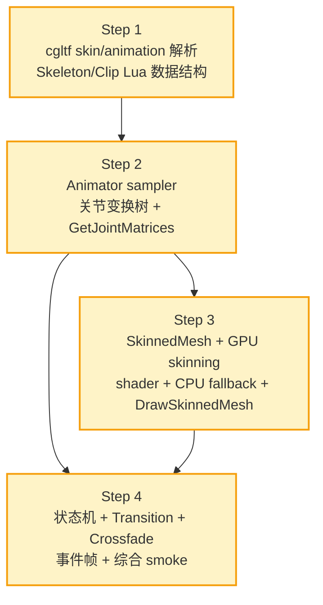

# Phase AV — 骨骼动画 + 状态机 — 任务原子化文档

> **6A Stage 3: Atomize**
>
> 来源：DESIGN_PhaseAV.md。本文档把 Phase AV 拆为 4 个独立可验证的原子 Step，每 Step 一个 commit，每个 commit 后等 6 平台 CI 全绿再推下一个（与 Phase AU 节奏一致）。

---

## 1. 任务依赖图



**关键点**：
- Step 2、3、4 都依赖 Step 1（数据结构）
- Step 4 依赖 Step 2（采样 / 关节矩阵），但与 Step 3 渲染解耦（状态机数据层独立可测）
- Step 3 与 Step 4 在 step 顺序上 3 先于 4，可视化更稳定（Step 4 调试时已能看到角色动起来）

---

## 2. Step 1 — cgltf skin/animation 解析 + Lua 数据结构

### 2.1 输入契约

| 项 | 内容 |
|---|------|
| 前置依赖 | Phase AS 已完成；`cgltf.h`/`cgltf_impl.c` 在 third_party；`light_graphics_mesh.cpp` 现有 GLTF helper |
| 输入数据 | glTF 2.0 文件路径（`.gltf` 或 `.glb`） |
| 环境 | 无新依赖 |

### 2.2 输出契约

| 项 | 内容 |
|---|------|
| 输出 | `light_animation.cpp` 第一版（~600 行）：Skeleton + AnimationClip 数据结构与 Lua 绑定 |
| 文件 | 新建 `ChocoLight/include/gltf_helpers.h`（暴露 `light_graphics_mesh.cpp` 内部 helper） |
| 文件 | 改 `ChocoLight/src/light_graphics_mesh.cpp`：把 helper 移到 `gltf_helpers.h`+ 同名实现保留 + `extern` 声明 |
| 文件 | 改 `ChocoLight/CMakeLists.txt` 加 `light_animation.cpp` |
| 文件 | 改 `lumen-master/src/light/light.cpp` `g_lightModules[]` 加 3 项：`Light.Animation`、`Light.Animation.Clip`、`Light.Animation.Skeleton` |
| 文件 | 新建 `scripts/smoke/animation.lua` 第一版（API 表 + nil 边界，~150 行） |
| 文件 | 改 `.github/workflows/build-templates.yml` Windows runtime smoke 加 `$animSmoke = ... animation.lua` |
| 验收 | 全 6 平台 CI 全绿；`require 'Light.Animation'` 不崩；smoke `[1] API 表` 通过 |

### 2.3 实现约束

- **API 注册 5 项规则**严格执行（`LIGHT_API` 导出 + CMakeLists + `g_lightModules[]` + smoke + workflow）
- 列主序矩阵存储（与现有 `light_graphics_mesh.cpp` Mat4 一致）
- 四元数顺序 `wxyz`（cgltf 默认）
- Lua 索引 1-based（与现有所有 Light.* API 一致）
- 关节数 > 64 时 `luaL_error`（不静默截断）
- `Skeleton` / `AnimationClip` 各持自己的 `__gc`，`Skeleton` 引用计数避免提前释放

### 2.4 完成度自检

```lua
-- smoke 必须通过的核心 8 断言
local Anim = require 'Light.Animation'
assert(type(Anim.LoadSkinnedGLTF) == 'function')
assert(type(Anim.NewAnimator) == 'function')

-- 缺失文件 / 无效文件 / 越界
local p, err = Anim.LoadSkinnedGLTF("nonexistent.glb")
assert(p == nil and type(err) == 'string')

-- 加载非 skinned glTF 也应能用（mesh=nil 但不崩）
-- 加载 skinned glTF 后：
-- pack.skeleton:GetJointCount() > 0
-- pack.clips 至少含 1 个 clip
-- clip:GetDuration() > 0
-- clip:Sample(0, jointIdx, 'rotation') 返回 4 个 float
```

### 2.5 后置任务

→ Step 2

---

## 3. Step 2 — Animator + sampler + 关节变换树

### 3.1 输入契约

| 项 | 内容 |
|---|------|
| 前置依赖 | Step 1 commit 已合并 main；CI 全绿 |
| 输入 | Skeleton + AnimationClip Lua userdata |
| 环境 | 无新依赖 |

### 3.2 输出契约

| 项 | 内容 |
|---|------|
| 输出 | `light_animation.cpp` 第二版（追加 ~400 行）：Animator + 三种插值采样 + 前向变换树 |
| 文件 | 改 `light_animation.cpp` 加 `Animator` 类型 + `luaopen_Light_Animation_Animator` |
| 文件 | 改 `lumen-master/src/light/light.cpp` `g_lightModules[]` 加 `Light.Animation.Animator` |
| 文件 | 改 `scripts/smoke/animation.lua` 加 sampler/前向变换树测（追加 ~120 行，10 断言） |
| 验收 | 全 6 平台 CI 全绿；smoke `[2-3] sampler/skeleton` 通过；GetJointMatrices 返回 64×16 floats |

### 3.3 实现约束

- **Sampler.Evaluate** 三种插值（LINEAR/STEP/CUBICSPLINE）按 cgltf 标签自动分支
- **Quaternion slerp** 含最短路径翻转（dot < 0 时翻转一边）
- **CUBICSPLINE** 旋转分量插值后必须归一化
- **前向变换树**：拓扑顺序保证（递归 + computed 标志）
- **GetJointMatrices** 返回 `lua_pushlstring` 二进制 buffer 或 table；本 Phase 选 **table of float**（与现有 GetWheelTransform 一致）
- **关节数 < 实际数**：缺失关节用 bind pose（不抛错）
- 不引入运行时探针（fprintf）

### 3.4 完成度自检

```lua
-- 已加载 pack.skeleton + pack.clips["Idle"]
local animator = Anim.NewAnimator(pack.skeleton)
animator:AddState("idle", pack.clips["Idle"])
animator:Play("idle")
assert(animator:GetCurrentState() == "idle")

-- 推进 0.5s
for i = 1, 30 do animator:Update(1/60) end
assert(math.abs(animator:GetCurrentTime() - 0.5) < 1e-3)

-- 关节矩阵
local mats = animator:GetJointMatrices()
assert(type(mats) == 'table')
assert(#mats == 16 * pack.skeleton:GetJointCount())

-- t=0 时蒙皮矩阵 ≈ identity（绑定姿态 × inverseBind ≈ I）
animator:SetCurrentTime(0)
animator:Update(0)
local m0 = animator:GetJointMatrices()
-- 第一个关节 4×4 对角线 ≈ 1
assert(math.abs(m0[1] - 1) < 1e-3)
```

### 3.5 后置任务

→ Step 3 + Step 4（并发可行，但顺序推 Step 3 先）

---

## 4. Step 3 — SkinnedMesh + GPU skinning + CPU fallback + DrawSkinnedMesh

### 4.1 输入契约

| 项 | 内容 |
|---|------|
| 前置依赖 | Step 2 commit 已合并 main；CI 全绿；Animator GetJointMatrices 已可用 |
| 输入 | Step 1 LoadSkinnedGLTF 返回的 `pack.mesh`（含 JOINTS/WEIGHTS attribute layout） |
| 环境 | backend GL33 / GLES3 / Metal 已就位（Phase AS） |

### 4.2 输出契约

| 项 | 内容 |
|---|------|
| 输出 | `light_graphics_skinnedmesh.cpp` 新建（~600 行）：SkinnedMesh userdata + DrawSkinnedMesh |
| 文件 | 改 backend GL33（在 backend GL33 cpp 中）：`CreateSkinnedVAO` + `DrawSkinnedMesh` 实现 + skinning vertex shader |
| 文件 | 改 backend GLES3：相同实现 |
| 文件 | 改 backend GLES2：CPU skinning 路径（`SupportsGPUSkinning() = false`） |
| 文件 | 改 `light_graphics.cpp` 注册 `Light.Graphics.DrawSkinnedMesh` 函数 |
| 文件 | 改 `lumen-master/src/light/light.cpp` `g_lightModules[]` 加 `Light.Animation.SkinnedMesh` |
| 文件 | 改 `scripts/smoke/animation.lua` 加 SkinnedMesh API 测（追加 ~80 行，8 断言） |
| 验收 | 全 6 平台 CI 全绿；headless smoke 跑通（不渲染但 mesh 对象创建/销毁路径稳定）；本地 light.exe 跑 demo_animation 可见角色动 |

### 4.3 实现约束

- **GPU skinning shader** 用 `attribute slot 5/6` 给 JOINTS_0/WEIGHTS_0（不与现有 POSITION/NORMAL/UV/COLOR 冲突）
- **u_jointMatrices[64]** 列主序，每帧 `glUniformMatrix4fv(N=64, transpose=GL_FALSE, ...)`
- **CPU fallback** 仅当 `backend->SupportsGPUSkinning() == false` 时启用，**不**默认走 CPU
- **DrawSkinnedMesh** 接受 `transform_mat4` table（16 floats，nil 视作单位）
- **material_table** 与 Phase AS.4 PBR 材质表完全一致（baseColor/metallic/roughness/emissive/textures）
- **Headless smoke**：当 `Light.Graphics` 未初始化时，DrawSkinnedMesh 返回 `false, "graphics not initialized"`（不崩）

### 4.4 完成度自检

```lua
local pack = Anim.LoadSkinnedGLTF("character.glb")
if pack and pack.mesh then
    local sm = pack.mesh
    assert(sm:GetVertexCount() > 0)
    assert(sm:GetIndexCount() > 0)
    assert(sm:GetSkeleton() ~= nil)

    -- DrawSkinnedMesh 在 headless 不崩
    local ok, err = Light.Graphics.DrawSkinnedMesh(sm, animator, nil, {})
    -- ok 视 backend 而定；err 必为 string 或 nil
    assert(type(err) == 'nil' or type(err) == 'string')
end
```

### 4.5 后置任务

→ Step 4

---

## 5. Step 4 — 状态机 + Transition + Crossfade + 事件帧

### 5.1 输入契约

| 项 | 内容 |
|---|------|
| 前置依赖 | Step 2/3 commit 已合并 main；CI 全绿 |
| 输入 | Animator 基础 API 已就位（Step 2） |

### 5.2 输出契约

| 项 | 内容 |
|---|------|
| 输出 | `light_animation.cpp` 终版（追加 ~250 行）：状态机 + Crossfade + 事件帧 |
| 文件 | 改 `light_animation.cpp` 加 `AnimatorState/Transition/Event` 数组 + Update 推进逻辑 |
| 文件 | 改 `scripts/smoke/animation.lua` 加状态机/事件/Crossfade 测（追加 ~100 行，12 断言） |
| 文件 | 新建 `samples/demo_animation/main.lua`（~80 行 headless console + 资源缺失降级） |
| 文件 | 新建 `samples/demo_animation/README.md`（资源下载指引） |
| 文件 | 新建 `docs/api/Light_Animation.md`（API 文档） |
| 文件 | 改 `samples/README.md` 加 demo_animation 索引 |
| 文件 | 改 `docs/api/MODULE_INDEX.md` 加 Animation 模块条目 + **附带补 Phase AM/AN/AQ/AR/AS/AT/AU 历史滞后条目** |
| 验收 | 全 6 平台 CI 全绿；smoke 全部 38+ 断言通过；ACCEPTANCE_PhaseAV.md 完整记录 |

### 5.3 实现约束

- **Transition condition_fn** 用 `lua_pcall` 包裹（错误不中断 Update）
- **同帧最多一次 transition**（防 idle→walk→run→walk 循环切换）
- **Crossfade 完成时**：currentStateIdx ← crossfadeTargetIdx，crossfadeTargetIdx = -1
- **Event triggerTime**：用上一帧 `prevTime` 与本帧 `currentTime` 的区间判断（处理跨帧 + 循环边界）
- **循环边界 event 触发**：clip 从 0.95→1.0→0.05 跨越时，事件 t=0.98 必须触发一次
- **Param 类型**：仅 number（简化；不引入 bool/string/trigger 类型）
- **demo_animation/main.lua**：资源缺失时 `print("⚠️ Sample assets not found at: ..."); print("Skipping skinned mesh demo (skeleton/clip data layer still tested)")` 然后退出 0
- **MODULE_INDEX.md 历史滞后补全**：把 Phase AM (Audio)、AN (Audio Callback)、AQ (TextInput)、AR (Pen/Event)、AS (3D Mesh/glTF/PBR)、AT (Audio 3D)、AU (Physics3D) 历史新增模块在 MODULE_INDEX.md 的相应分组中加条目（每条 1 行表格条目即可，详细 fn 列表不必塞进 INDEX）

### 5.4 完成度自检

```lua
-- 状态机
animator:AddState("idle", clipIdle)
animator:AddState("walk", clipWalk)
animator:AddTransition("idle", "walk", function(a) return a:GetParam("speed") > 0.1 end, 0.3)
animator:Play("idle")
animator:SetParam("speed", 1.5)
animator:Update(0.05)
assert(animator:GetCurrentState() == "walk" or animator:IsCrossfading())

-- Crossfade 中点权重
local oldT = animator:GetCurrentTime()
animator:Crossfade("idle", 0.4)
animator:Update(0.2)
-- 此时应在 crossfade 中
assert(animator:IsCrossfading())

-- 事件帧
local fired = 0
animator:AddEvent("walk", 0.4, function() fired = fired + 1 end)
animator:Play("walk")
animator:SetCurrentTime(0)
for i = 1, 30 do animator:Update(1/60) end  -- 0 -> 0.5
assert(fired == 1)

-- 事件循环边界
animator:Play("walk")
animator:SetCurrentTime(0.95)
animator:Update(0.1)  -- 跨越 1.0 -> 0.05 (loop)
animator:Update(1/60) -- 触发 t=0.4 没？（应在下一周期触发）
```

### 5.5 后置任务

→ Stage 6 Assess（生成 ACCEPTANCE_PhaseAV.md / FINAL_PhaseAV.md / TODO_PhaseAV.md）

---

## 6. 全 Phase 任务复杂度评估

| Step | C++ 行 | Lua smoke 行 | 文档行 | 估计实施时间 | 估计 CI 一次成功率 |
|------|--------|-------------|--------|-------------|------------------|
| 1 | ~600 | ~150 | — | 3h | 80% |
| 2 | ~400 | ~120 | — | 2h | 75% |
| 3 | ~600 | ~80 | — | 4h | 65% (shader 风险) |
| 4 | ~250 | ~100 | ~600 | 3h | 80% |
| **合计** | **~1850** | **~450** | **~600** | **~12h** | **平均 75%** |

预计 4-6 个 commit（每 Step 1-2 commit，含潜在 bugfix），CI 总耗时 ~30-40 分钟 / step。

---

## 7. 验证策略

### 7.1 每 Step 验证（CI 6 平台）

| 平台 | 验证内容 |
|------|---------|
| Windows | 编译 + lightc -p smoke + light.exe 跑 animation.lua runtime smoke |
| Linux | 编译 + lightc -p smoke |
| macOS | 编译 + lightc -p smoke |
| Android | 模板编译（不跑 runtime） |
| iOS | 模板编译（不跑 runtime） |
| Web | Emscripten 编译 + WebGL 2.0 smoke（如已配置） |

### 7.2 跨 Step 回归

每 Step commit 前本地跑 `scripts/smoke/animation.lua` + `scripts/smoke/physics_3d.lua`（确保 Phase AU 不受影响）+ `scripts/smoke/core_runtime.lua`（基础模块不退化）。

### 7.3 异常路径覆盖

- 文件不存在 / 解析失败 / 关节数 > 64 / 死对象操作 / Lua callback 抛错 / GL 不可用 等都在 smoke 中显式测试。

---

## 8. 风险与回滚策略

| 风险 | 触发场景 | 回滚 |
|------|---------|------|
| GPU skinning shader 在某平台编译失败 | Web/iOS Metal 兼容 | 该平台强制走 CPU fallback；smoke 加 `if backend supports GPU then` 分支 |
| cgltf animation 数据格式 | CUBICSPLINE 数据布局误解 | 单 sampler 单测对照已知样本 |
| 关节变换树循环依赖 | 错误 glTF（理论不应出现） | 检测 + `luaL_error` |
| 性能不达标 | 移动端 30 FPS 都跑不到 | smoke 不卡死即可；性能调优留 Phase AV.x |
| Phase AU 物理与 Animation 冲突 | 内存 / GL 资源争用 | Animation 不动 Bullet；smoke 跑 physics_3d.lua 回归 |

---

## 9. 实施纪律

1. **每 Step 一 commit + 一 push + 等 CI 全绿**（与 Phase AU 一致）
2. **CI 失败时**：先看完整 stderr/stdout（不要假设是 SEH，参 [`MEMORY[debug.md]`] 阶段 2.4 反分析对抗）
3. **debug 探针**：用完即清（参 [`MEMORY[debug.md]`] 阶段 3.4）
4. **commit 信息格式**：`feat(animation): Phase AV step N - <短描述>`，docs commit 用 `docs(phase-av): ...`
5. **遇阻 / 不确定**：立即中断 + 记录到 ACCEPTANCE 文档 + 询问用户
6. **不顺手做 Phase AV.x 范围内的事**（Layer / IK / Ragdoll / Morph）

---

## 10. 完成定义（DoD）

Phase AV 视为完成当且仅当：

- ✅ Step 1-4 全部 commit + push + CI 全绿（6 平台）
- ✅ `scripts/smoke/animation.lua` ≥ 38 断言全通过
- ✅ `samples/demo_animation/{main.lua, README.md}` 完整
- ✅ `docs/api/Light_Animation.md` 完整 API 表
- ✅ `docs/api/MODULE_INDEX.md` Animation 条目 + 历史滞后条目补齐
- ✅ `docs/Phase AV 骨骼动画/{ALIGNMENT,CONSENSUS,DESIGN,TASK,ACCEPTANCE,FINAL,TODO}_PhaseAV.md` 全部齐备
- ✅ Phase AU smoke 回归通过（无退化）
- ✅ 工作区无 untracked 探针文件（`_*.txt` / `*.tmp`）
