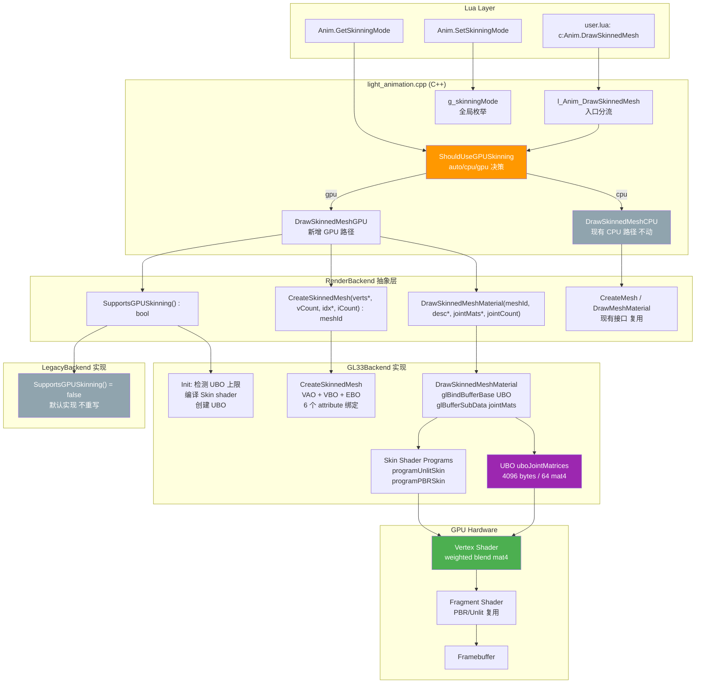
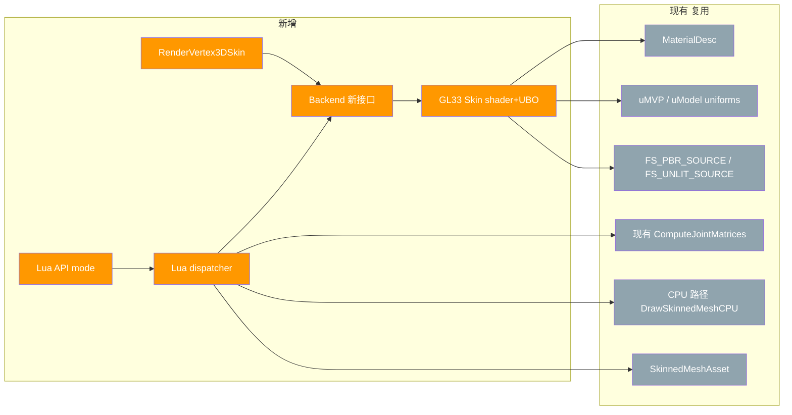
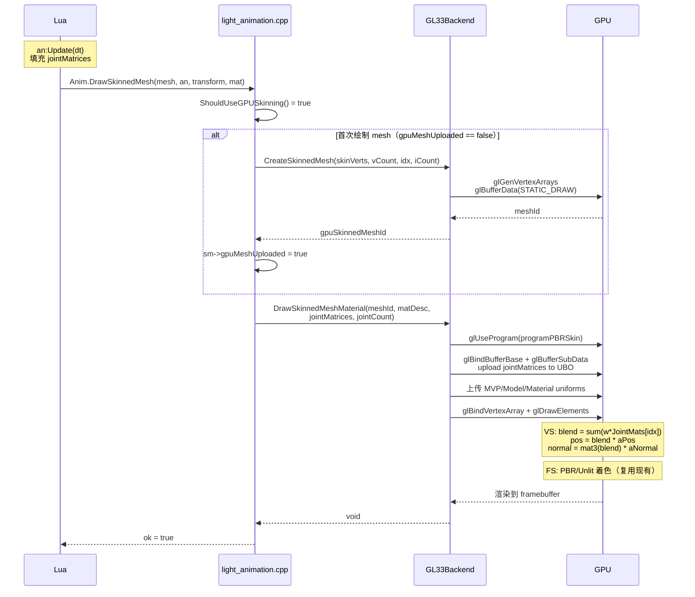
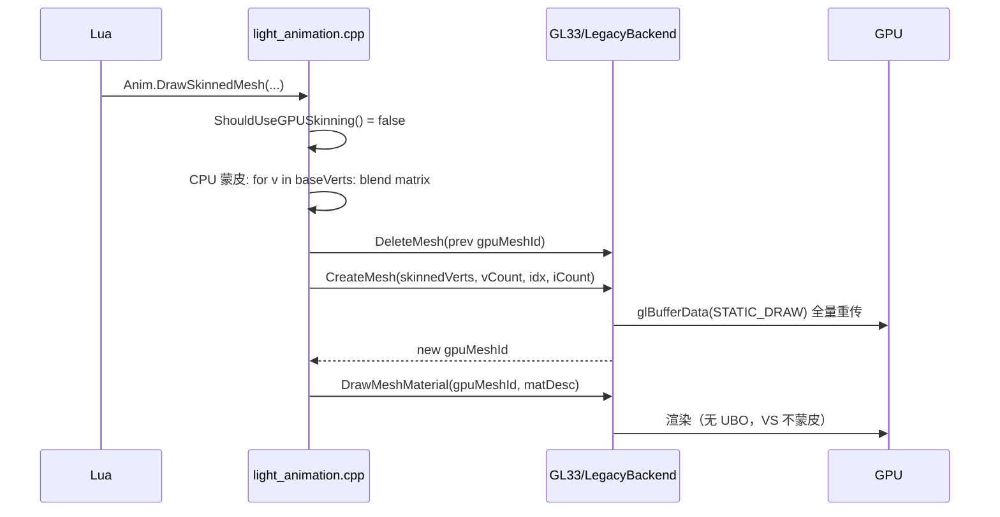
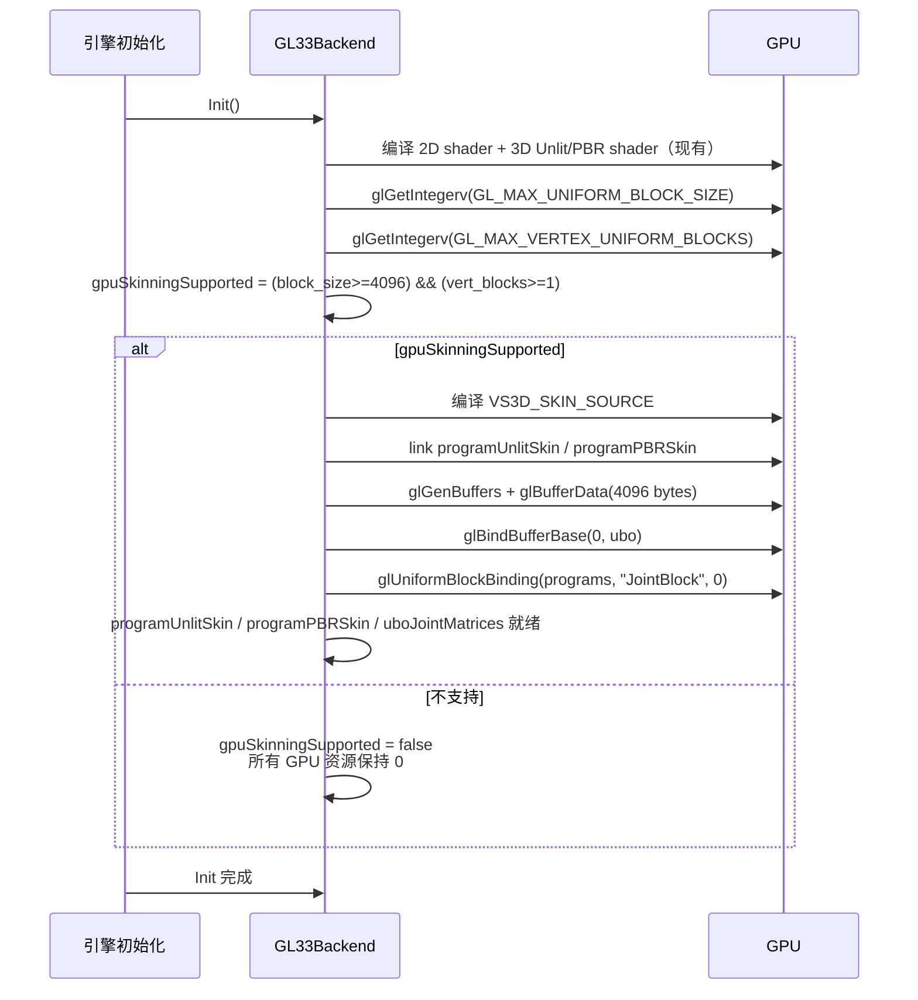

# Phase AW — GPU Skinning 架构设计（DESIGN_PhaseAW.md）

> 6A 工作流 Stage 2（Architect）：基于 `CONSENSUS_PhaseAW.md` 生成系统架构、模块依赖、接口契约、数据流和异常处理策略。

---

## 1. 整体架构图



> 灰色节点表示 **不动的现有代码**；橙色 = 新增分流；紫色 = 新增 UBO 资源；绿色 = 新增 vertex shader 计算。

---

## 2. 分层设计与核心组件

### 2.1 五层架构

| 层 | 职责 | 文件 |
|----|------|------|
| **Lua API 层** | 用户调用入口；模式查询/设置 | `light_animation.cpp` |
| **调度决策层** | 根据 `g_skinningMode` + `SupportsGPUSkinning` 分流 CPU/GPU | `light_animation.cpp` |
| **GPU 路径实现层** | 上传 UBO + 触发 backend 渲染 | `light_animation.cpp` |
| **Backend 抽象层** | 接口契约（不变 + 新增） | `render_backend.h` |
| **GL33 实现层** | UBO + Skin shader + skinned VAO/VBO | `render_gl33.cpp` |

### 2.2 核心组件清单

| 组件 | 类型 | 文件 | 行数估算 |
|------|------|------|---------|
| `RenderVertex3DSkin` | struct | `render_backend.h` | +12 |
| `SupportsGPUSkinning` / `CreateSkinnedMesh` / `DrawSkinnedMeshMaterial` | RenderBackend 接口 | `render_backend.h` | +6 |
| `g_skinningMode` enum + dispatcher | 全局状态 + 分流函数 | `light_animation.cpp` | +30 |
| `DrawSkinnedMeshGPU` | static C++ 函数 | `light_animation.cpp` | +60 |
| `l_Anim_SetSkinningMode` / `l_Anim_GetSkinningMode` | Lua C function | `light_animation.cpp` | +40 |
| `gpuSkinningSupported` 检测 + `programUnlitSkin/PBRSkin` 编译 + UBO 创建 | GL33Backend init 扩展 | `render_gl33.cpp` | +60 |
| `VS3D_SKIN_SOURCE` (×2: 桌面/GLES) | const char* shader | `render_gl33.cpp` | +50 |
| GL33Backend `CreateSkinnedMesh` 实现 | C++ 方法 | `render_gl33.cpp` | +50 |
| GL33Backend `DrawSkinnedMeshMaterial` 实现 | C++ 方法 | `render_gl33.cpp` | +50 |
| smoke 段（`[15] Phase AW`）| Lua | `scripts/smoke/animation.lua` | +60 |
| API 文档 | markdown | `docs/api/Light_Animation.md` | +40 |
| **合计** | | | **~458 行** |

---

## 3. 模块依赖关系图



**无循环依赖**；新增组件只依赖现有 + 自身，不修改现有组件接口。

---

## 4. 接口契约定义

### 4.1 RenderBackend 新增三接口

```cpp
class RenderBackend {
public:
    /**
     * @brief 当前后端是否支持 GPU skinning
     *
     * 判定标准（GL33Backend）：
     *   GL_MAX_UNIFORM_BLOCK_SIZE   >= 4096 bytes (= 64 mat4)
     *   GL_MAX_VERTEX_UNIFORM_BLOCKS >= 1
     *   programUnlitSkin / programPBRSkin 至少一个 link 成功
     *
     * LegacyBackend 默认返回 false（不重写）。
     */
    virtual bool SupportsGPUSkinning() const { return false; }

    /**
     * @brief 创建 GPU skinned mesh（一次上传，永不重传）
     *
     * @param verts   含 pos/normal/uv/color/joints/weights 的顶点数组
     * @param vCount  顶点数（> 0）
     * @param indices uint32 三角形索引
     * @param iCount  索引数（必须为 3 的倍数）
     *
     * @return meshId（高位 0x80000000 区分普通 mesh ID）；失败返回 0
     *
     * 失败条件：!verts / vCount<=0 / !indices / iCount<=0 / !SupportsGPUSkinning()
     */
    virtual uint32_t CreateSkinnedMesh(const RenderVertex3DSkin* verts, int vCount,
                                        const uint32_t* indices, int iCount) { return 0; }

    /**
     * @brief 用 jointMatrices 调色板渲染 GPU skinned mesh
     *
     * @param meshId        必须是 CreateSkinnedMesh 返回的 ID
     * @param desc          MaterialDesc（mode = 0 unlit / 1 PBR）
     * @param jointMatrices 16 floats × jointCount，列主序，CPU 侧 jointMatrices.data()
     * @param jointCount    实际关节数（≤ 64；超过将被截断到 64）
     *
     * 内部行为：
     *   1. glUseProgram(programUnlitSkin or programPBRSkin)
     *   2. glBindBuffer + glBufferSubData 上传 jointMatrices 到 UBO
     *   3. 上传 MVP/Model/Material/Lighting uniforms（复用 helper）
     *   4. glBindVertexArray + glDrawElements
     *   5. 切回默认 2D shader
     */
    virtual void DrawSkinnedMeshMaterial(uint32_t meshId, const MaterialDesc* desc,
                                          const float* jointMatrices, int jointCount) {}
};
```

### 4.2 SkinningMode dispatcher 接口（C++ 内部）

```cpp
namespace LT { namespace Anim {

enum class SkinningMode : uint8_t {
    AUTO = 0,    // 默认；按平台决策
    CPU  = 1,    // 强制 CPU
    GPU  = 2,    // 强制 GPU（不支持时自动 fallback CPU）
};

// 全局状态（仅在 l_Anim_SetSkinningMode 中修改；线程安全：单线程渲染前提）
extern SkinningMode g_skinningMode;

/**
 * @brief 当前是否应使用 GPU skinning 路径
 *
 * 决策表：
 *   g_skinningMode == CPU  → false
 *   g_skinningMode == GPU  → backend 是否支持
 *   g_skinningMode == AUTO →
 *     - Web (Emscripten)        → false（Q7 决策）
 *     - LegacyBackend           → false
 *     - GL33Backend supportsGPU → true
 *     - 其他                     → false
 */
bool ShouldUseGPUSkinning();

}}
```

### 4.3 Lua API 契约

| API | 签名 | 返回 | 失败 |
|-----|------|------|------|
| `Anim.GetSkinningMode()` | `() → string` | `"cpu"` 或 `"gpu"`（实际生效）| 无失败路径 |
| `Anim.SetSkinningMode(mode)` | `(string) → bool 或 nil+err` | `true` | 非 "auto"/"cpu"/"gpu" 时返回 `nil + err` |
| `Anim.DrawSkinnedMesh(...)` | 不变 | 不变 | 不变 |

**注意**：`GetSkinningMode` 返回**实际生效**而非用户设置：例如设了 "gpu" 但 backend 不支持，返回 "cpu"。

---

## 5. 数据流向图

### 5.1 GPU 路径数据流（一帧）



### 5.2 CPU 路径数据流（保持现状不变）



### 5.3 启动时数据流



---

## 6. 异常处理策略

### 6.1 启动时异常

| 异常 | 行为 | 用户可见性 |
|------|------|-----------|
| Skin shader 编译失败 | `gpuSkinningSupported = false`；log warning；不影响 CPU 路径 | `Anim.GetSkinningMode()` 返回 `"cpu"` |
| UBO 创建失败 | `gpuSkinningSupported = false`；log warning | 同上 |
| 不支持 UBO（极罕见 GLES3）| `gpuSkinningSupported = false`；log warning | 同上 |
| VS link 失败 | `gpuSkinningSupported = false`；log warning | 同上 |

**核心策略**：**任何 GPU 路径异常均自动 fallback CPU 路径**，永不让用户在 Lua 层看到 GPU 失败。

### 6.2 运行时异常

| 异常 | 行为 |
|------|------|
| `Anim.SetSkinningMode("invalid")` | 返回 `nil, "mode must be auto/cpu/gpu"` |
| `Anim.SetSkinningMode("gpu")` 但 backend 不支持 | 接受设置但 `GetSkinningMode()` 仍返回 `"cpu"`（实际行为） |
| GPU 路径 jointCount > 64 | 截断到 64（log debug）|
| `CreateSkinnedMesh` 返回 0（失败）| `DrawSkinnedMeshGPU` push `false + err`，不崩溃 |
| `DrawSkinnedMeshMaterial` 内 `glGetError()` 报错 | log error，但不中断渲染（与现有 CPU 路径一致）|

### 6.3 类型/参数校验

复用现有 `CheckSkinnedMesh` / `CheckAnimator` / `ReadMat4FromTable` 等 helper，签名与 CPU 路径保持一致。

### 6.4 错误返回模式

按 Phase AV.x 经验（`SKILLS.md` S21），新 Lua API 一律采用 **`return nil + err` 模式**，不用 `luaL_error`：

```cpp
static int l_Anim_SetSkinningMode(lua_State* L) {
    const char* s = luaL_checkstring(L, 1);
    if (strcmp(s, "auto") == 0)      g_skinningMode = SkinningMode::AUTO;
    else if (strcmp(s, "cpu") == 0)  g_skinningMode = SkinningMode::CPU;
    else if (strcmp(s, "gpu") == 0)  g_skinningMode = SkinningMode::GPU;
    else {
        lua_pushnil(L);
        lua_pushstring(L, "mode must be 'auto', 'cpu', or 'gpu'");
        return 2;
    }
    lua_pushboolean(L, 1);
    return 1;
}
```

---

## 7. 性能与内存预算

### 7.1 GPU 内存

| 资源 | 大小 | 频率 |
|------|------|------|
| `programUnlitSkin` | ~2KB shader binary | 启动一次 |
| `programPBRSkin` | ~3KB shader binary | 启动一次 |
| `uboJointMatrices` | 4096 bytes | 启动一次（每帧 SubData）|
| 每个 SkinnedMesh VBO | `vCount × 68 bytes` | 创建一次 |
| 每个 SkinnedMesh EBO | `iCount × 4 bytes` | 创建一次 |

### 7.2 每帧 GPU bus 流量

| 操作 | 字节 | 备注 |
|------|------|------|
| `jointMatrices` UBO 上传 | ≤ 4096 bytes | `glBufferSubData` |
| Material uniforms | ~200 bytes | 与 CPU 路径相同 |
| Light uniforms | ~150 bytes | 与 CPU 路径相同 |
| Vertex buffer 上传 | **0**（一次性预上传）| 对比 CPU 每帧 vCount × 48 bytes |

**对比**：5000 顶点 mesh，CPU 路径每帧上传 240KB，GPU 路径每帧上传 4KB（**60x 降低**）。

### 7.3 CPU 端开销

| 路径 | 5000 顶点 mesh 单帧 |
|------|-------------------|
| CPU 蒙皮 + DeleteMesh + CreateMesh | ~1.5ms |
| GPU 路径 jointMatrices upload + draw call | ~0.05ms |

**CPU 减负 30x**。

---

## 8. 平台兼容矩阵

| 平台 | GLSL 版本 | UBO 上限 | 64 mat4 容量 | GPU 路径默认 |
|------|----------|---------|------------|------------|
| Windows | `#version 330 core` | ≥ 16KB | ✅ | ✅ |
| Linux | `#version 330 core` | ≥ 16KB | ✅ | ✅ |
| macOS | `#version 330 core` | ≥ 16KB | ✅ | ✅ |
| Android | `#version 300 es` | ≥ 16KB | ✅ | ✅ |
| iOS | `#version 300 es` | ≥ 16KB | ✅ | ✅ |
| Web (WebGL2) | `#version 300 es` | ≥ 16KB | ✅ | ⚠️ **默认禁用**（Q7） |

> Web 实测后可移除 `__EMSCRIPTEN__` 禁用判断。

---

## 9. 测试策略

### 9.1 编译期测试

- 6 平台 CI 必须全绿
- Skin shader 在桌面 + GLES 平台均要 compile + link 成功
- UBO `std140` 布局对齐：64 个连续 mat4，C++ 一次 4096 bytes 上传

### 9.2 Runtime smoke

新增 `[15] Phase AW: GPU Skinning` 段：

```lua
print('[15] Phase AW: GPU Skinning')

-- 15.1 模式查询
local mode = Anim.GetSkinningMode()
CHECK(type(mode) == 'string' and (mode == 'cpu' or mode == 'gpu'),
      'GetSkinningMode 返回 cpu 或 gpu')

-- 15.2 模式设置
local r, e = Anim.SetSkinningMode('cpu')
CHECK(r == true, 'SetSkinningMode("cpu") 成功')
CHECK(Anim.GetSkinningMode() == 'cpu', '模式切换到 cpu 后查询一致')

r, e = Anim.SetSkinningMode('gpu')
CHECK(r == true, 'SetSkinningMode("gpu") 接受设置')
-- 不强制断言 GetSkinningMode == "gpu"（设备可能不支持）

r, e = Anim.SetSkinningMode('auto')
CHECK(r == true, 'SetSkinningMode("auto") 成功')

-- 15.3 错误参数
r, e = Anim.SetSkinningMode('invalid')
CHECK(r == nil and type(e) == 'string', '非法 mode 返回 nil+err')

r, e = Anim.SetSkinningMode(123)
CHECK(r == nil and type(e) == 'string', 'int 类型返回 nil+err')

-- 15.4 mode 切换不破坏 DrawSkinnedMesh
-- (依赖 demo_animation 的 mesh + animator，可跳过 if 不可用)
```

### 9.3 回归保护

- `[Phase AV Step 1+2+3+4 + Phase AV.x] 通过 157 / 失败 0` 必须保持
- `Phase AS / AT / AU` 全部 smoke 不退化

### 9.4 性能验证（可选，非阻塞）

如果用户提供 5000+ 顶点的 mesh asset（Phase AV TODO A.1），可加：

```lua
-- 可选：性能对比
if AnimPerf and AnimPerf.MeasureFrameTime then
    Anim.SetSkinningMode('cpu')
    local cpu_ms = AnimPerf.MeasureFrameTime(1.0)
    Anim.SetSkinningMode('gpu')
    local gpu_ms = AnimPerf.MeasureFrameTime(1.0)
    CHECK(gpu_ms < cpu_ms, 'GPU 路径性能优于 CPU')
end
```

---

## 10. 设计原则验证

按 6A 工作流 Stage 2 验证清单：

- [x] **不过度设计**：仅实现 GPU skinning + mode dispatch；不做 IK / Layer / 性能 profiling
- [x] **复用现有组件**：FS_PBR/FS_UNLIT shader 不动；MaterialDesc 不动；ComputeJointMatrices 不动；CPU 路径不动
- [x] **与现有架构一致**：RenderBackend 接口扩展默认实现，LegacyBackend 不重写；与 Phase AS RenderBackend 风格一致
- [x] **架构清晰**：5 层分离，无循环依赖，每层职责单一
- [x] **接口完整**：3 个 backend 接口 + 2 个 Lua API + 1 个 vertex format struct
- [x] **数据流闭环**：从 Lua 调用 → 决策 → backend → GL → GPU → framebuffer，每一步都有明确契约
- [x] **异常 fallback**：任何 GPU 路径异常均自动回退 CPU
- [x] **性能符合预期**：每帧上传 4KB UBO + 0 vertex 数据（vs CPU 路径 240KB）
- [x] **平台兼容**：6 平台全支持，Web 默认禁用按 Q7

---

## 11. 下一步

- **Stage 3 Atomize**：基于本设计文档生成 `TASK_PhaseAW.md`，拆分为 ~6-8 个原子任务，每个任务有独立的输入契约 / 输出契约 / 验收标准
- **任务列表预览**：
  1. `T1` 新增 `RenderVertex3DSkin` + RenderBackend 接口扩展
  2. `T2` GL33Backend Init 扩展（UBO + 检测 + Skin shader 编译）
  3. `T3` GL33Backend `CreateSkinnedMesh` + `DrawSkinnedMeshMaterial` 实现
  4. `T4` light_animation.cpp 调度逻辑（`g_skinningMode` + `ShouldUseGPUSkinning` + `DrawSkinnedMeshGPU`）
  5. `T5` Lua API（`SetSkinningMode` / `GetSkinningMode`）
  6. `T6` smoke `[15]` 段
  7. `T7` API 文档更新
  8. `T8` CI 回归 + 性能验证（可选）
