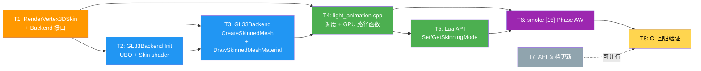

# Phase AW — GPU Skinning 原子任务清单（TASK_PhaseAW.md）

> 6A 工作流 Stage 3（Atomize）：基于 `DESIGN_PhaseAW.md` 拆分为可独立验收的原子任务。
>
> 每个任务有明确的输入契约（前置依赖 / 输入数据 / 环境）、输出契约（输出 / 交付物 / 验收标准）和实现约束（技术栈 / 接口规范 / 质量要求）。

---

## 任务依赖图

颜色：橙=接口/数据结构；蓝=Backend 实现；绿=Lua/Anim 层；紫=测试；灰=文档；黄=CI。

---

## T1 — `RenderVertex3DSkin` 结构 + RenderBackend 接口扩展

### 输入契约

- **前置依赖**：无
- **输入数据**：现有 `render_backend.h` 文件
- **环境依赖**：C++17 编译器

### 输出契约

- **输出数据**：扩展后的 `render_backend.h`
- **交付物**：
  - 新增 `struct RenderVertex3DSkin`（68 bytes / 顶点）
  - 在 `RenderBackend` 类中添加 3 个 virtual 方法（默认实现 returns false / 0 / no-op）
- **验收标准**：
  - 编译通过（仅头文件改动，影响 `render_gl33.cpp` / `render_legacy.cpp` / `light_animation.cpp` 都应不需任何改动即可继续编译）
  - struct 字段顺序：pos(3) + normal(3) + uv(2) + color(4) + joints_packed(uint32) + weights(4)
  - sizeof 检查：`static_assert(sizeof(RenderVertex3DSkin) == 68)`

### 实现约束

- **技术栈**：C++17 standard layout struct
- **接口规范**：与现有 `RenderVertex3D` 平级；新接口与现有方法一致风格（`override` 模式）
- **质量要求**：每个 virtual 方法配 `@brief` 注释说明语义、参数、失败条件

### 依赖关系

- **后置任务**：T2 / T3 / T4 都依赖 T1
- **并行任务**：无（首个任务）

### 工作量估算

~30 分钟（仅声明，无实现）

---

## T2 — GL33Backend `Init` 扩展（UBO + Skin shader 编译）

### 输入契约

- **前置依赖**：T1（需要 `RenderVertex3DSkin` + 接口声明）
- **输入数据**：现有 `render_gl33.cpp`，特别是 `Init()` 方法
- **环境依赖**：OpenGL 3.3 Core / GLES 3.0+ headers

### 输出契约

- **输出数据**：扩展后的 `Init()` 方法 + 新增成员变量
- **交付物**：
  - 新成员：`programUnlitSkin / programPBRSkin / uboJointMatrices / uniformBlockBindingPoint(=0) / gpuSkinningSupported`
  - `Init()` 内：检测 UBO 上限 → 编译 `VS3D_SKIN_SOURCE` → link → 创建 UBO → bind block index
  - `Shutdown()` 内：清理新资源（`glDeleteProgram` × 2 + `glDeleteBuffers` × 1）
  - 新增 `VS3D_SKIN_SOURCE`（桌面 + GLES 两版，仿现有 `VS3D_SOURCE` 的 `#ifdef` 模式）
  - 新增 `SupportsGPUSkinning() override` 方法
- **验收标准**：
  - 桌面 + GLES 平台编译均通过
  - Skin shader 在 6 平台 link 成功（CI 可见 `Light.Animation 模块加载` log）
  - UBO 创建 + bind block 无 GL error

### 实现约束

- **技术栈**：OpenGL 3.3 / GLES 3.0 UBO API
- **接口规范**：
  - UBO binding point = 0（固定，不参数化）
  - UBO 大小 = `64 * 16 * sizeof(float) = 4096 bytes`
  - `glBufferData(GL_UNIFORM_BUFFER, 4096, nullptr, GL_DYNAMIC_DRAW)` 预分配
  - `glUniformBlockBinding(program, blockIdx, 0)` 把 program 的 "JointBlock" 绑到 binding point 0
- **shader 内容契约**（VS3D_SKIN_SOURCE）：
  - 输入 attributes: `aPos(0) aNormal(1) aUV(2) aColor(3) aJoints(4, uvec4) aWeights(5, vec4)`
  - UBO: `layout(std140) uniform JointBlock { mat4 uJointMats[64]; }`
  - uniforms: `uMVP, uModel`（与现有 VS3D 一致）
  - 输出 varyings: `vNormalW, vWorldPos, vTexCoord, vColor`（与 FS_PBR/FS_UNLIT 一致）
- **质量要求**：UBO 检测 fail → log warning + `gpuSkinningSupported = false`，不抛错
- **现有代码不动**：`programUnlit / programPBR / VS3D_SOURCE / FS_PBR_SOURCE / FS_UNLIT_SOURCE` 不修改

### 依赖关系

- **后置任务**：T3（需要 program / UBO 句柄）
- **并行任务**：无

### 工作量估算

~3 小时

---

## T3 — GL33Backend `CreateSkinnedMesh` + `DrawSkinnedMeshMaterial`

### 输入契约

- **前置依赖**：T1 + T2
- **输入数据**：T2 完成的 GL33Backend
- **环境依赖**：现有 `MeshGPU` 结构 + `BindMaterialTexture / UploadCommonMatUniforms / UploadPBRLightingUniforms` helpers

### 输出契约

- **输出数据**：两个新方法实现
- **交付物**：
  - `CreateSkinnedMesh(verts, vCount, indices, iCount) → meshId`：新建 VAO + VBO（68 bytes/顶点）+ EBO；6 个 attribute 绑定（含 `glVertexAttribIPointer` for joints）；存入 `skinnedMeshes` map
  - `DrawSkinnedMeshMaterial(meshId, desc, jointMats, jointCount)`：选 program → upload UBO → upload uniforms → bind VAO → draw → 切回 2D shader
  - `DeleteMesh` 扩展：检测 meshId 高位 `0x80000000`，分流到 `skinnedMeshes` map
  - 新成员：`std::unordered_map<uint32_t, MeshGPU> skinnedMeshes; uint32_t nextSkinnedMeshId = 0x80000001;`
  - `Shutdown()` 内：清理 `skinnedMeshes` 所有资源
- **验收标准**：
  - 6 平台 CI 编译 + link 通过
  - `DrawSkinnedMeshMaterial` 调用后 `glGetError() == GL_NO_ERROR`
  - jointCount > 64 时安全截断为 64
  - jointMats 为 nullptr 时早返回，不崩溃

### 实现约束

- **技术栈**：与 T2 一致
- **接口规范**：
  - `CreateSkinnedMesh` 参数检查：`!verts || vCount<=0 || !indices || iCount<=0 || !gpuSkinningSupported` → return 0
  - `DrawSkinnedMeshMaterial` 参数检查：`!desc || !jointMats || jointCount<=0` → 早返回
  - VAO attribute 绑定顺序严格按 layout location（与 shader 一致）
  - `aJoints` 用 `glVertexAttribIPointer(4, 4, GL_UNSIGNED_BYTE, sizeof(...), offsetof(joints_packed))` —— **注意是 `IPointer` 而非 `Pointer`**（整数类型）
- **质量要求**：
  - UBO 上传用 `glBufferSubData(GL_UNIFORM_BUFFER, 0, n*64, jointMats)` 而非 `glBufferData`（避免重新分配）
  - 每个新方法 ≤ 70 行代码

### 依赖关系

- **后置任务**：T4（需要 backend 接口可用）
- **并行任务**：无

### 工作量估算

~4 小时

---

## T4 — light_animation.cpp 调度逻辑 + `DrawSkinnedMeshGPU`

### 输入契约

- **前置依赖**：T1 + T3（接口完整可用）
- **输入数据**：现有 `l_Anim_DrawSkinnedMesh`（CPU 路径）
- **环境依赖**：现有 `SkinnedMeshAsset` + `Animator::jointMatrices`

### 输出契约

- **输出数据**：扩展后的 light_animation.cpp
- **交付物**：
  - `enum class SkinningMode { AUTO, CPU, GPU };` + 全局 `g_skinningMode = AUTO`
  - `bool ShouldUseGPUSkinning()` 函数（按 DESIGN §4.2 决策表）
  - `static int DrawSkinnedMeshGPU(L, sm, an, modelMat, matDesc)` 函数
  - `SkinnedMeshAsset` 加 2 字段：`uint32_t gpuSkinnedMeshId = 0; bool gpuMeshUploaded = false;`
  - 扩展 `__gc` 路径：释放 `gpuSkinnedMeshId`（`g_render->DeleteMesh`）
  - 修改 `l_Anim_DrawSkinnedMesh` 入口：`if (ShouldUseGPUSkinning()) return DrawSkinnedMeshGPU(...)`
  - **CPU 路径函数零改动**：把现有 `l_Anim_DrawSkinnedMesh` 主体抽到 `DrawSkinnedMeshCPU`，调用方分流
- **验收标准**：
  - 6 平台编译通过
  - Phase AV smoke 仍 PASS（CPU 路径无回归）
  - `ShouldUseGPUSkinning()` 对各种 g_skinningMode + Web 平台返回正确
  - SkinnedMesh 释放时 GPU 资源完整清理

### 实现约束

- **技术栈**：C++17
- **接口规范**：
  - `DrawSkinnedMeshGPU` 与 `DrawSkinnedMeshCPU` 签名一致：`int(lua_State*, SkinnedMeshAsset*, Animator*, const float*, const MaterialDesc*)`
  - 失败路径用 Phase AV.x S21 的 `nil + err` 模式（不用 `luaL_error`）
- **质量要求**：
  - `DrawSkinnedMeshGPU` ≤ 80 行
  - 把 CPU 路径主体抽函数时**严格保持原逻辑** —— 仅调整函数签名，不动算法
  - 所有 `g_render->...` 调用都做空检查

### 依赖关系

- **后置任务**：T5 / T6
- **并行任务**：T5 可启动（仅依赖 g_skinningMode）

### 工作量估算

~3 小时（重点是抽函数 + 不动 CPU 逻辑）

---

## T5 — Lua API：`Anim.SetSkinningMode` / `Anim.GetSkinningMode`

### 输入契约

- **前置依赖**：T4（需要 `g_skinningMode` 全局）
- **输入数据**：现有 `kAnimationModule[]` 注册表
- **环境依赖**：Lua 5.1 / Lumen

### 输出契约

- **输出数据**：扩展后的 light_animation.cpp Lua 注册
- **交付物**：
  - `static int l_Anim_SetSkinningMode(lua_State* L)`：解析 string 参数；非法返回 `nil + err`；合法返回 `true`
  - `static int l_Anim_GetSkinningMode(lua_State* L)`：调用 `ShouldUseGPUSkinning()` 返回 `"gpu"` 或 `"cpu"`
  - 注册到 `kAnimationModule[]`
- **验收标准**：
  - `Anim.GetSkinningMode()` 返回 `"cpu"` 或 `"gpu"`（实际生效）
  - `Anim.SetSkinningMode("auto"/"cpu"/"gpu")` 返回 `true`
  - `Anim.SetSkinningMode("invalid"/123/nil)` 返回 `nil + string err`

### 实现约束

- **技术栈**：与 Phase AV.x ErrorReturn 风格一致
- **接口规范**：
  - 参数仅接受 lua string（非 string 时 `luaL_checkstring` 会自动转 → 但若是 nil/userdata，按现有 ChocoLight 风格用 `luaL_optstring(L, 1, "")` 兜底，再判 strcmp）
  - 失败用 `nil + err`，不用 `luaL_error`（按 S21）
- **质量要求**：每个函数 ≤ 30 行

### 依赖关系

- **后置任务**：T6（smoke 需要这两个 API）
- **并行任务**：无（依赖 T4）

### 工作量估算

~1 小时

---

## T6 — smoke 段 `[15] Phase AW: GPU Skinning`

### 输入契约

- **前置依赖**：T4 + T5
- **输入数据**：现有 `scripts/smoke/animation.lua`
- **环境依赖**：Lumen runtime

### 输出契约

- **输出数据**：扩展后的 animation.lua
- **交付物**：
  - 新增 `[15]` 段，~50-60 行 Lua
  - 验证 GetSkinningMode 返回类型 + 值
  - 验证 SetSkinningMode 三个合法值（"auto" / "cpu" / "gpu"）
  - 验证 SetSkinningMode 错误参数（"invalid" / 123 / nil）
  - 验证模式切换不影响 `Anim.DrawSkinnedMesh` 接口（mock 调用 + ok+err 检查；不要求实际渲染）
- **验收标准**：
  - 新增至少 6 个 CHECK，全 PASS
  - 总体 smoke 应达 `[Phase AV ... + Phase AV.x + Phase AW] 通过 ≥ 165 / 失败 0`
  - Web 平台特殊断言：CI 在 Web 上 `GetSkinningMode()` 应返回 `"cpu"`（Q7 默认禁用）

### 实现约束

- **技术栈**：Lua 5.1
- **接口规范**：复用现有 `CHECK` helper
- **质量要求**：
  - 每个 CHECK 描述清晰
  - print 探针不留 commit（与 Phase AV.x 经验一致）
  - 错误参数测试用 `pcall` 容错（即使 SetSkinningMode 实现有 bug 也不让整个 smoke 崩）

### 依赖关系

- **后置任务**：T8（CI 回归）
- **并行任务**：T7

### 工作量估算

~1.5 小时

---

## T7 — API 文档更新（`docs/api/Light_Animation.md`）

### 输入契约

- **前置依赖**：T5（API 已 finalize）
- **输入数据**：现有 `docs/api/Light_Animation.md`
- **环境依赖**：无

### 输出契约

- **交付物**：
  - 新增 "Skinning Mode" 节：`SetSkinningMode` / `GetSkinningMode` 签名 + 示例 + 平台行为表
  - 在 `DrawSkinnedMesh` 节加备注：内部按 mode 自动选 CPU/GPU 路径
  - 加 "性能特征对比" 表（CPU vs GPU 路径开销）
- **验收标准**：
  - 文档结构与现有节一致（Anchor / 签名 / 参数 / 返回 / 示例 / 备注）
  - 包含 6 平台默认 mode 表

### 实现约束

- **技术栈**：markdown
- **质量要求**：示例代码可直接 copy-paste 运行

### 依赖关系

- **后置任务**：T8（CI 不强制等文档）
- **并行任务**：T6（互不影响）

### 工作量估算

~1 小时

---

## T8 — CI 回归 + 验证

### 输入契约

- **前置依赖**：T1-T6（全部代码 + smoke）；T7 可后补
- **输入数据**：commit 后的代码
- **环境依赖**：GitHub Actions

### 输出契约

- **交付物**：
  - 6 平台 CI 全绿
  - Windows / Linux / macOS / Android / iOS / Web 编译通过
  - Windows runtime smoke 通过：Phase AV + AV.x + AW 总计 ≥ 165 PASS
- **验收标准**：
  - run id 记录到 `ACCEPTANCE_PhaseAW.md`
  - 0 失败
  - 任何 GL warning 但 0 error

### 实现约束

- **技术栈**：用户要求"不本地编译，全 CI 验证"
- **失败处理**：
  - 编译失败 → 看 build log 第一条 error，按 6A Stage 5 异常协议处理
  - smoke 失败 → 用 Phase AV.x 经验：加 print 探针 → bisect → 修复 → 推送
  - GL error → 用 `glGetError()` 在关键节点检查 + log

### 依赖关系

- **后置任务**：Stage 6 Assess（生成 `ACCEPTANCE_PhaseAW.md` / `FINAL_PhaseAW.md` / `TODO_PhaseAW.md`）

### 工作量估算

~2-3 小时（含可能的 bisect）

---

## 总体工作量

| 任务 | 工作量 | 依赖 | 串/并行 |
|------|-------|------|---------|
| T1 | 30min | — | 串 |
| T2 | 3h | T1 | 串 |
| T3 | 4h | T1 + T2 | 串 |
| T4 | 3h | T1 + T3 | 串 |
| T5 | 1h | T4 | 串 |
| T6 | 1.5h | T4 + T5 | 串 |
| T7 | 1h | T5 | **可与 T6 并行** |
| T8 | 2-3h | T1-T6 | 串 |
| **合计** | **15-17h** | | |

---

## 复杂度评估

按 6A Stage 3 验收清单：

- [x] **任务覆盖完整需求**：T1-T8 完整对应 CONSENSUS §4 的 7 个验收项
- [x] **依赖关系无循环**：参见任务依赖图（DAG）
- [x] **每个任务可独立验证**：T1-T8 各自有"验收标准"小节
- [x] **复杂度评估合理**：单任务 ≤ 4h，串行总长 ~15h，对应 GPU Skinning 中等复杂度功能合理
- [x] **AI 高成功率交付**：每任务接口契约清晰；T2/T3/T4 的关键代码片段已在 DESIGN 文档给出参考实现

---

## 风险与缓解策略

| 风险 | 影响任务 | 缓解 |
|------|---------|------|
| GLES 平台 `glVertexAttribIPointer` 兼容 | T3 | CI 直接验证；如 fail → 备选用 `glVertexAttribPointer` + normalized=false 转 float（性能略损但兼容） |
| Skin shader 在某些设备 link fail | T2 | `gpuSkinningSupported=false` fallback；不影响其他流程 |
| UBO `std140` 布局误解 | T2 / T3 | 严格 `mat4` 数组（每元素 64 bytes 对齐自然），C++ 一次连续上传无 padding |
| MSVC `lua_error` 风险（S21）| T5 | 一律用 `nil + err` 模式 |
| Phase AV CPU 路径回归 | T4 | T4 严格"抽函数不动算法"；smoke 必跑现有 [12]-[14] 段 |

---

## 下一步

进入 **Stage 4 Approve**：用户审查本任务清单是否：
1. 覆盖完整需求？
2. 任务粒度合适？
3. 风险评估到位？
4. 工作量预算可接受？

审查通过后进入 **Stage 5 Automate**：按 T1 → T8 顺序执行，每完成一个任务立即推 CI 验证。
