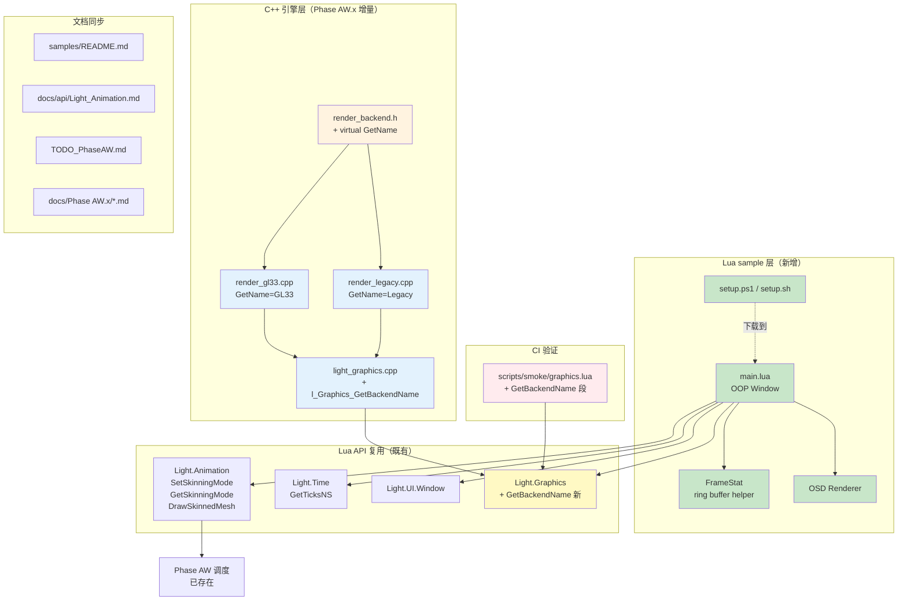
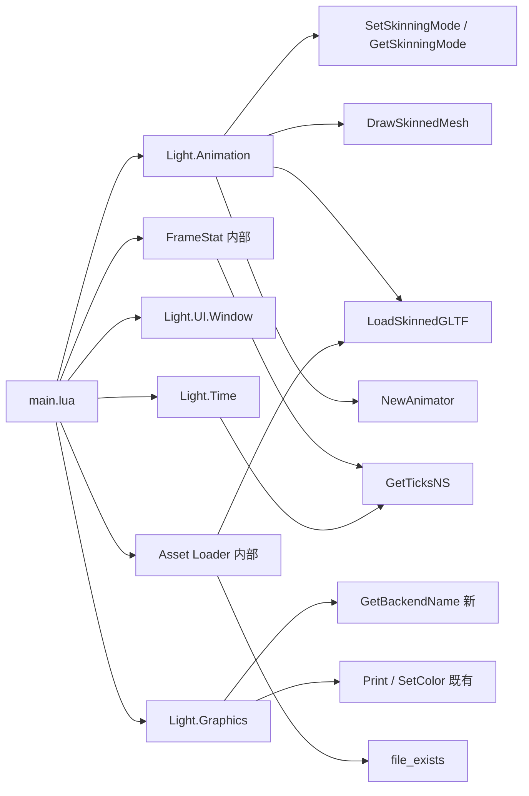
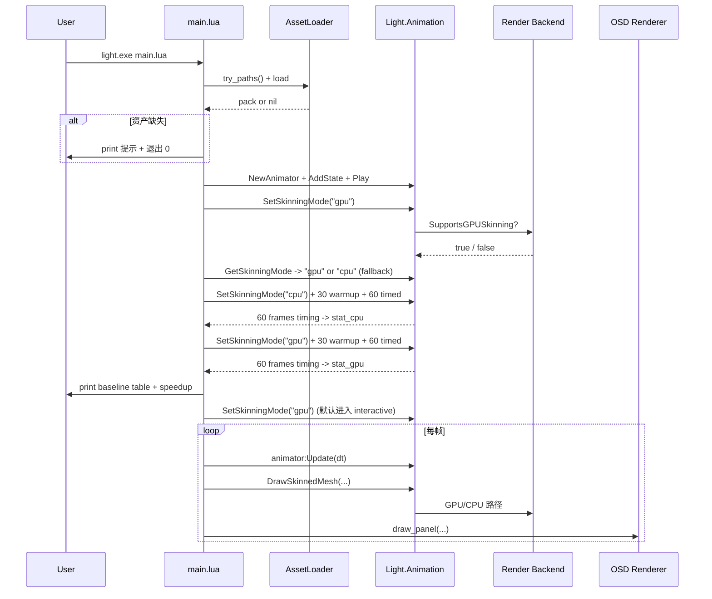
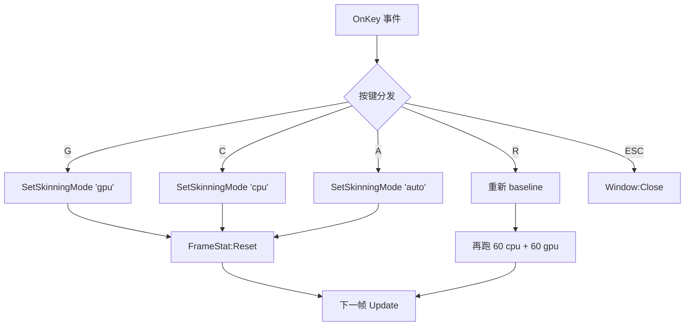

# DESIGN — Phase AW.x（GPU Skinning 真机验证工具链）

> **6A 工作流 Stage 2 — Architect §系统设计**：共识 → 系统架构 → 模块设计 → 接口规范

**生成时间**: 2026-05-10
**前置文档**: `CONSENSUS_PhaseAWx.md`

---

## 1. 整体架构图



**色块语义**：
- 🟧 **橙色**：接口扩展（render_backend.h）
- 🔵 **蓝色**：C++ 实现增量
- 🟢 **绿色**：新建 Lua sample
- 🟡 **黄色**：Lua API 增量
- 🔴 **红色**：测试增量

---

## 2. 分层设计

### 2.1 Layer 1: 接口层（render_backend.h）

```cpp
class RenderBackend {
public:
    // ===== 既有 API（不变） =====
    virtual ~RenderBackend() = default;
    virtual bool SupportsGPUSkinning() const = 0;
    virtual uint32_t CreateSkinnedMesh(...) = 0;
    virtual void DrawSkinnedMeshMaterial(...) = 0;
    // ... 其他既有 API

    // ===== Phase AW.x 新增 =====
    /**
     * @brief 返回 backend 静态名称（"GL33" / "Legacy" / "Software" 等）
     * @return 非空静态字符串；不需要 caller free
     * @note 所有 backend 必须实现；用于 Lua 端 Light.Graphics.GetBackendName()
     */
    virtual const char* GetName() const = 0;
};
```

**约束**：
- 所有现有 backend 子类（GL33Backend / LegacyBackend / 等）必须实现，**否则编译失败**
- 返回静态字面量 / 内存 longevity 与 backend 实例相同
- 命名约定：单词字母（无空格 / 特殊字符），方便 Lua 端 string 比较

### 2.2 Layer 2: C++ 实现层

#### 2.2.1 GL33Backend (`render_gl33.cpp`)

```cpp
class GL33Backend : public RenderBackend {
    // ... 既有成员
public:
    const char* GetName() const override { return "GL33"; }
    // ... 既有 override
};
```

#### 2.2.2 LegacyBackend (`render_legacy.cpp`)

```cpp
class LegacyBackend : public RenderBackend {
    // ... 既有成员
public:
    const char* GetName() const override { return "Legacy"; }
    // ... 既有 override
};
```

#### 2.2.3 其他 backend（如 SoftwareBackend）

按需补全 `GetName()`，返回唯一名称字符串。

### 2.3 Layer 3: Lua API 绑定层（light_graphics.cpp）

```cpp
// Light.Graphics.GetBackendName() -> string
static int l_Graphics_GetBackendName(lua_State* L) {
    if (!g_render) {
        lua_pushliteral(L, "None");
        return 1;
    }
    const char* name = g_render->GetName();
    lua_pushstring(L, (name && *name) ? name : "Unknown");
    return 1;
}

// 注册（在既有 kGraphicsModule[] 末尾添加）
static const luaL_Reg kGraphicsModule[] = {
    // ... 既有项
    { "GetBackendName", l_Graphics_GetBackendName },   // Phase AW.x
    { nullptr, nullptr },
};
```

**特性**：
- 永远不返回 nil（即使 g_render 未初始化也返回 "None"）
- 永远不 raise（无 luaL_check*）
- 与 Phase AW 的 nil+err 模式不同 — 这是查询 API，不会失败

### 2.4 Layer 4: smoke 验证层

`scripts/smoke/graphics.lua`（或新建）增量段：

```lua
-- ==================== [N] Phase AW.x: GetBackendName ====================

print('[N] Phase AW.x: Light.Graphics.GetBackendName')

CHECK(type(Gfx.GetBackendName) == 'function',
      'Gfx.GetBackendName 存在 (Phase AW.x)')

local name = Gfx.GetBackendName()
CHECK(type(name) == 'string', 'GetBackendName 返回 string')
CHECK(#name > 0,              'GetBackendName 返回非空')
print('  当前 backend = "' .. name .. '"')

-- 已知 backend 名称白名单（headless / runtime 都应该返回这些之一）
local known = { GL33=true, Legacy=true, Software=true, None=true }
CHECK(known[name] ~= nil,
      'GetBackendName 返回已知名称 (GL33/Legacy/Software/None)')
```

**注意**：如果 `scripts/smoke/graphics.lua` 不存在，需要决策是新建还是扩展 `init.lua` 的 graphics 段。**待 Stage 3 Atomize 时勘察现有 smoke 结构后决定**。

### 2.5 Layer 5: Lua sample 层（核心）

#### 2.5.1 main.lua 模块设计

```
main.lua 内部 5 个虚拟模块（单文件）：
┌─────────────────────────────────────────────────────┐
│ § 1. FrameStat (ring buffer helper)                 │
│   - new(window_size: int) -> FrameStat              │
│   - :Push(ms: number)                               │
│   - :Avg() / :Min() / :Max() / :Count() -> number   │
│   - :Reset()                                        │
├─────────────────────────────────────────────────────┤
│ § 2. AssetLoader (资产探测 + 加载)                   │
│   - try_paths(): table of candidate paths           │
│   - load_or_nil(): pack? + err?                     │
│   - print_setup_hint(): 打印 setup.ps1 引导          │
├─────────────────────────────────────────────────────┤
│ § 3. Baseline (启动时自动测速)                       │
│   - run_baseline(mode_name, frames) -> stats        │
│   - print_baseline_table(cpu_stats, gpu_stats)      │
├─────────────────────────────────────────────────────┤
│ § 4. OSD (屏上文字渲染)                              │
│   - draw_panel(stats, mode, fps_cap, hint)          │
├─────────────────────────────────────────────────────┤
│ § 5. Game (OOP Window 主体)                         │
│   - OnOpen / OnKey / Update / Draw                  │
└─────────────────────────────────────────────────────┘
```

#### 2.5.2 FrameStat 详细接口

```lua
local FrameStat = {}
FrameStat.__index = FrameStat

function FrameStat.new(window_size)
    return setmetatable({
        size = window_size or 60,
        buf  = {},          -- circular buffer
        idx  = 1,
        cnt  = 0,
    }, FrameStat)
end

function FrameStat:Push(ms)
    self.buf[self.idx] = ms
    self.idx = self.idx + 1
    if self.idx > self.size then self.idx = 1 end
    if self.cnt < self.size then self.cnt = self.cnt + 1 end
end

function FrameStat:Avg()
    if self.cnt == 0 then return 0 end
    local sum = 0
    for i = 1, self.cnt do sum = sum + self.buf[i] end
    return sum / self.cnt
end

function FrameStat:Min()
    if self.cnt == 0 then return 0 end
    local m = self.buf[1]
    for i = 2, self.cnt do if self.buf[i] < m then m = self.buf[i] end end
    return m
end

function FrameStat:Max()
    if self.cnt == 0 then return 0 end
    local m = self.buf[1]
    for i = 2, self.cnt do if self.buf[i] > m then m = self.buf[i] end end
    return m
end

function FrameStat:Count() return self.cnt end
function FrameStat:Reset()
    self.idx, self.cnt = 1, 0
    self.buf = {}
end
```

#### 2.5.3 Baseline 算法

```
输入: mode_name ("cpu" / "gpu"), frames (int = 60)
输出: { avg, min, max, count }

1. Anim.SetSkinningMode(mode_name)
2. local actual = Anim.GetSkinningMode()
   if actual ~= mode_name then warn "Mode setting not effective; got actual"
3. // 预热 30 帧（首次 GPU 上传 + shader JIT）
   for i = 1, 30 do
       _ = render_one_frame_dryrun()  -- 不计时
   end
4. local stat = FrameStat.new(frames)
5. for i = 1, frames do
       local t0 = Light.Time.GetTicksNS()
       render_one_frame()              -- DrawSkinnedMesh + present
       local t1 = Light.Time.GetTicksNS()
       stat:Push((t1 - t0) / 1e6)      -- ns -> ms
   end
6. return stat
```

> **注意**：sample 在 baseline 期间会**冻结 UI 1-2 秒**（取决于帧率）。OnOpen 中执行；用户感知为启动加载。

#### 2.5.4 baseline 输出格式

```
==== Phase AW Skinning Performance Baseline ====
Backend     : GL33
GPU support : true (Anim.SetSkinningMode("gpu") -> actual=gpu)
Asset       : samples/demo_skinning_perf/assets/character.glb
Mesh        : 5234 vertices, 28 joints

[Calibrating CPU baseline (60 frames + 30 warmup) ...]
  CPU: avg=1.482ms  min=1.31ms  max=1.94ms

[Calibrating GPU baseline (60 frames + 30 warmup) ...]
  GPU: avg=0.063ms  min=0.05ms  max=0.11ms

Speedup     : 23.5x
================================================

Entering interactive mode (default = GPU). Keys:
  G/C/A : switch to GPU/CPU/AUTO
  R     : re-baseline
  ESC   : quit
```

#### 2.5.5 OSD 设计

```
左上角 panel (10 行内):
  Backend: GL33
  Mode:    GPU         (颜色: green=gpu, yellow=cpu, gray=auto)
  Frame:   0.06ms      (rolling 60-frame avg)
  Min/Max: 0.05/0.11ms
  FPS:     ~16666 (cap)
  ──────────────────
  G/C/A : mode | R: re-baseline | ESC: quit

右下角:
  CPU baseline: 1.48ms
  GPU baseline: 0.06ms
  Current speedup: 24.7x   (vs CPU baseline)
```

实现方式：`Light.Graphics.SetColor + Print` 多行（参考 perf_benchmark line 105-128）。

#### 2.5.6 资产探测路径优先级

```lua
local CANDIDATES = {
    -- 1. 本 sample 自带 assets/ (setup.ps1 下载位置)
    "samples/demo_skinning_perf/assets/character.glb",
    -- 2. 与 demo_animation 共享
    "samples/demo_animation/assets/character.glb",
    "samples/demo_animation/character.glb",
    -- 3. 项目根 assets/
    "assets/character.glb",
    "Light-0.2.3/assets/character.glb",
    -- 4. 与 demo_animation candidates 完全一致 (兼容用户已有路径)
}
```

### 2.6 Layer 6: setup 脚本设计

#### 2.6.1 setup.ps1 (Windows)

```powershell
# samples/demo_skinning_perf/setup.ps1
# Downloads Khronos RiggedSimple.glb to assets/character.glb
# Source: glTF-Sample-Models repository (MIT/CC0 license)

$ErrorActionPreference = 'Stop'
$scriptDir  = Split-Path -Parent $MyInvocation.MyCommand.Path
$assetsDir  = Join-Path $scriptDir 'assets'
$targetFile = Join-Path $assetsDir 'character.glb'

if (Test-Path $targetFile) {
    Write-Host "Asset already exists: $targetFile"
    Write-Host "Delete the file if you want to re-download."
    exit 0
}

if (-not (Test-Path $assetsDir)) {
    New-Item -ItemType Directory -Path $assetsDir | Out-Null
}

$url = 'https://raw.githubusercontent.com/KhronosGroup/glTF-Sample-Models/master/2.0/RiggedSimple/glTF-Binary/RiggedSimple.glb'
Write-Host "Downloading from $url ..."
Invoke-WebRequest -Uri $url -OutFile $targetFile
Write-Host "Downloaded $((Get-Item $targetFile).Length) bytes -> $targetFile"
Write-Host ""
Write-Host "Now run:"
Write-Host "  ..\..\Light-0.2.3\windows-x64\light.exe samples\demo_skinning_perf\main.lua"
```

#### 2.6.2 setup.sh (Linux/macOS)

```bash
#!/usr/bin/env bash
# samples/demo_skinning_perf/setup.sh
set -e
SCRIPT_DIR="$(cd "$(dirname "${BASH_SOURCE[0]}")" && pwd)"
ASSETS_DIR="$SCRIPT_DIR/assets"
TARGET="$ASSETS_DIR/character.glb"

if [ -f "$TARGET" ]; then
    echo "Asset already exists: $TARGET"
    echo "Delete the file if you want to re-download."
    exit 0
fi

mkdir -p "$ASSETS_DIR"
URL='https://raw.githubusercontent.com/KhronosGroup/glTF-Sample-Models/master/2.0/RiggedSimple/glTF-Binary/RiggedSimple.glb'
echo "Downloading from $URL ..."

if command -v curl >/dev/null 2>&1; then
    curl -fL -o "$TARGET" "$URL"
elif command -v wget >/dev/null 2>&1; then
    wget -O "$TARGET" "$URL"
else
    echo "Error: neither curl nor wget is available." >&2
    exit 1
fi

echo "Downloaded $(stat -c%s "$TARGET" 2>/dev/null || stat -f%z "$TARGET") bytes -> $TARGET"
```

#### 2.6.3 .gitignore

```
# samples/demo_skinning_perf/.gitignore
assets/
```

防止下载的 .glb 进入 git。

### 2.7 Layer 7: 文档同步

#### 2.7.1 `samples/README.md` 增量行

```markdown
| `demo_skinning_perf/` | Phase AW GPU Skinning 真机性能测试 — 一键 setup 脚本下载资产，自动 baseline + OSD 实时切换 GPU/CPU |
```

#### 2.7.2 `docs/api/Light_Animation.md` Phase AW 章节末尾追加

```markdown
### 真机验证 GPU Skinning 收益

桌面 GPU 机器（Windows / Linux / macOS）上：

#### Windows

\`\`\`powershell
cd <ChocoLight 根目录>
.\samples\demo_skinning_perf\setup.ps1                                 # 下载资产 (~80KB)
.\Light-0.2.3\windows-x64\light.exe samples\demo_skinning_perf\main.lua # 启动
\`\`\`

#### Linux/macOS

\`\`\`bash
cd <ChocoLight 根目录>
chmod +x samples/demo_skinning_perf/setup.sh
./samples/demo_skinning_perf/setup.sh
./Light-0.2.3/<platform>/light samples/demo_skinning_perf/main.lua
\`\`\`

启动后会自动跑 60 帧 CPU + 60 帧 GPU baseline 并打印对比表（典型 5000 顶点模型在桌面 GL3.3 上能看到 20-30x 提升）。

详见 `samples/demo_skinning_perf/README.md`。
```

#### 2.7.3 `TODO_PhaseAW.md` 标记完成

```markdown
## 一、强烈建议跟进（P0）

### ✅ 1.1 真机性能 baseline 测量

**已完成**: 见 `samples/demo_skinning_perf/`
**完成日期**: 2026-05-10 (Phase AW.x)

### ✅ 1.2 GPU vs CPU 数值一致性验证

**已完成**: Phase AW.x sample 提供 G/C 键运行时切换，用户视觉对比即可
**完成日期**: 2026-05-10 (Phase AW.x)
```

---

## 3. 模块依赖关系图



**依赖深度**：sample 仅依赖 Light.* 公开 API；不调引擎内部。

**关键依赖增量**：`Light.Graphics.GetBackendName` 是 Phase AW.x 唯一新增 C++ Lua API。

---

## 4. 数据流图

### 4.1 启动 + baseline 流程



### 4.2 用户键盘交互流程



---

## 5. 接口契约定义

### 5.1 C++ Lua API：`Light.Graphics.GetBackendName`

**签名**: `Light.Graphics.GetBackendName() -> string`

**前置条件**: 无（任何阶段调用都安全）

**后置条件**:
- 返回值类型: `string`
- 返回值长度: ≥ 1（不会返回空串）
- 返回值集合: `{"GL33", "Legacy", "Software", "None", "Unknown"}` 或后续新 backend 名称

**异常**: 永远不抛异常 / 不返回 nil

**示例**:
```lua
local Gfx = require 'Light.Graphics'
print('Backend:', Gfx.GetBackendName())   -- "GL33"
```

### 5.2 Lua sample API：`samples/demo_skinning_perf/main.lua`

**入口**: 直接 `require()` 或 `light.exe main.lua` 启动

**参数**: 无（命令行 / 配置）

**输出**:
- 控制台: baseline 表 + 状态消息
- 屏幕: OSD panel

**退出码**:
- `0`: 资产缺失（friendly fallback）/ 正常退出 / headless 检测
- `≠0`: 不期望（异常 raise 才会发生；防御编程已避免）

**键盘交互**: G/C/A/R/ESC（详见 §2.5.5）

---

## 6. 异常处理策略

| 异常 | 处理方式 |
|------|---------|
| 资产文件不存在 | 控制台提示候选路径 + setup 脚本提示 + 退出 0 |
| `Anim.LoadSkinnedGLTF` 返回 nil | 同资产缺失分支 |
| `Anim.SetSkinningMode("gpu")` 后 `GetSkinningMode() == "cpu"` | 警告 backend 不支持 GPU skinning，但仍跑 baseline (得到 cpu 结果两次 — 仍有诊断价值) |
| `Anim.DrawSkinnedMesh` 返回 false + err | 不退出；OSD 显示红色 ERROR 文字 + 控制台 print 一次 (rate-limit) |
| `Light.Time.GetTicksNS()` 异常 | 用 0 兜底；FrameStat 的 0 ms 显示能让用户察觉异常 |
| Window 创建失败（headless）| 不能进入主循环；sample 检测后退出 0 |

---

## 7. 设计决策记录

| # | 决策点 | 选择 | 理由 |
|---|-------|------|------|
| D1 | sample 单文件 vs 多文件 | **单 main.lua + 内部分段** | 与 perf_benchmark 一致；< 400 行无需拆分 |
| D2 | FrameStat 实现位置 | sample 内部 | 单 sample 复用；不抽离引擎层 |
| D3 | baseline 在 OnOpen 同步执行 vs 异步 | **同步** | 简单；用户感知为启动加载（1-2 秒）|
| D4 | baseline 期间是否渲染 | **是（dt=1/60 模拟）** | 真实测量 DrawSkinnedMesh 完整路径 |
| D5 | warmup 帧数 | **30 帧（500ms@60fps）** | 首次 GPU mesh 上传 + shader compile JIT 在前 1-2 帧；30 帧充分稳定 |
| D6 | OSD 字体 | **默认字体 Print** | 不引入字体资源；perf_benchmark 同款 |
| D7 | OSD 位置 | 左上 + 右下 | 不遮挡角色模型 |
| D8 | 资产路径优先级 | 本 sample > demo_animation > assets/ | 最直接路径优先；与现有 demo_animation 共享路径作为 fallback |
| D9 | setup 脚本下载源 | KhronosGroup glTF-Sample-Models 官方 | 公开 / 稳定 / CC0 协议 |
| D10 | 默认资产 | `RiggedSimple.glb` (~80KB) | 最小可用 skinned mesh 样本；CI 不需要 |
| D11 | smoke 段位置 | `scripts/smoke/graphics.lua` 或 `init.lua` | Stage 3 勘察后决定 |

---

## 8. 风险评估与缓解

| 风险 | 概率 | 影响 | 缓解 |
|------|------|------|------|
| Khronos repo 改路径导致 setup 脚本下载失败 | 低 | 中 | URL 写在脚本顶部常量；用户可手动改；README 也提供替代下载来源 |
| 用户机器 SDL Window 创建失败（远程桌面 / 无 GPU 笔记本）| 中 | 低 | sample 检测 Window 创建失败 → friendly exit 0 |
| 不同显卡 GPU 性能差异巨大 | 高 | 低 | sample 输出 backend 名称 + 用户自行解读；不强加期望值 |
| baseline 期间 OS 后台任务干扰 | 中 | 低 | 提供 R 键重新 baseline；min/max 报告异常波动 |
| `Light.Time.GetTicksNS` 在某些平台精度不足 | 低 | 中 | 已知 SDL3 GetTicksNS 在所有 6 平台都是 ns 精度 |

---

## 9. 验证可行性

### 9.1 已验证

- ✅ `Light.Time.GetTicksNS()` API 存在（`light_time.cpp:148`）
- ✅ `samples/perf_benchmark/main.lua` OOP Window 框架可用（已通过 6 平台 CI）
- ✅ Phase AW `Anim.SetSkinningMode/GetSkinningMode` 可用（`light_animation.cpp:2733`）
- ✅ Khronos `RiggedSimple.glb` 公开可下载（GitHub raw URL 稳定）
- ✅ 不引入 git 二进制（`.gitignore` + setup 脚本下载）

### 9.2 待 Stage 3 Atomize 阶段勘察

- ⚠️ `scripts/smoke/graphics.lua` 是否存在？如果不存在，是否扩展 `init.lua`？
- ⚠️ `light_graphics.cpp` 中 `kGraphicsModule[]` 注册位置（确认 GetBackendName 加在哪里）
- ⚠️ `RenderBackend` 是否还有 SoftwareBackend / HeadlessBackend 等 — 全部需要补 GetName

---

## 10. 阶段过渡

✅ DESIGN 完成 → 进入 **Stage 3 Atomize**：把本设计拆分为可独立交付的原子任务，生成 `TASK_PhaseAWx.md` + 任务依赖图。

预计原子任务数：**6-8 个**（C++ 接口 / 各 backend 实现 / Lua API / sample 主体 / setup 脚本 / smoke / 文档同步）。
