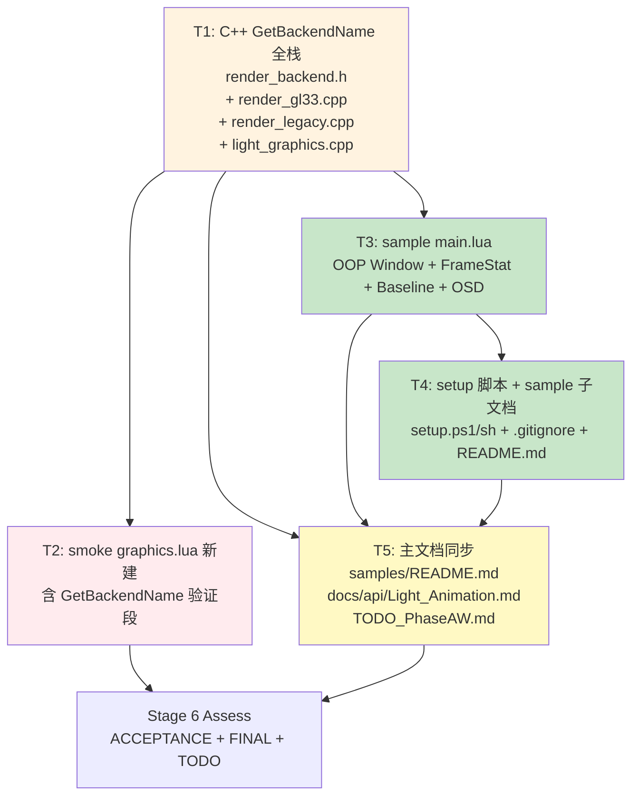

# TASK — Phase AW.x（GPU Skinning 真机验证工具链）

> **6A 工作流 Stage 3 — Atomize**：架构设计 → 拆分任务 → 明确接口 → 依赖关系

**生成时间**: 2026-05-10
**前置文档**: `CONSENSUS_PhaseAWx.md` + `DESIGN_PhaseAWx.md`

---

## 0. 勘察补充事实（Stage 3 新增）

| 事实 | 影响 |
|------|------|
| Backend 实现仅 2 个：`GL33Backend` (render_gl33.cpp:526) + `LegacyGLBackend` (render_legacy.cpp:53) | T1 只需 override 2 个；命名修正：`LegacyGLBackend` 而非 ALIGNMENT 写的 `LegacyBackend` |
| `light_graphics.cpp` 数组名 `graphics_funcs` (line 1322-1325)，结构 `{NULL, NULL}` 结尾 | T1 在末尾 `{NULL, NULL}` 前插入新 entry |
| `scripts/smoke/graphics.lua` **不存在** | T2 需**新建**该文件（与 audio.lua / animation.lua 等同级） |
| 项目有 `smoke/time.lua` 已存在 | 表明 smoke 目录按模块独立；新建 graphics.lua 符合既有约定 |
| 项目使用 `luaL_setfuncs(L, graphics_funcs, 0)` 注册 (line 1341) | 命名风格不同于 light_animation 的 `kAnimationModule[]`；T1 须遵循该文件局部风格 |

---

## 1. 任务依赖图



**色块语义**：橙=C++核心 / 红=测试 / 绿=Lua/资源 / 黄=文档同步

**关键路径**: T1 → T3 → T4 → T5 → S6（≥ 4 个 commit）

---

## 2. 原子任务清单

### **T1: C++ Backend GetName + Lua Graphics.GetBackendName**

#### 输入契约

| 项 | 说明 |
|----|------|
| 前置依赖 | 无（首个任务）|
| 输入文件 | `render_backend.h` / `render_gl33.cpp` / `render_legacy.cpp` / `light_graphics.cpp` |
| 环境依赖 | C++17 编译器 + 现有 RenderBackend 类层级 |

#### 输出契约

| 文件 | 改动 |
|------|------|
| `ChocoLight/include/render_backend.h` | 在 `class RenderBackend` 新增 `virtual const char* GetName() const = 0;` |
| `ChocoLight/src/render_gl33.cpp` | `GL33Backend` 添加 override：`const char* GetName() const override { return "GL33"; }` |
| `ChocoLight/src/render_legacy.cpp` | `LegacyGLBackend` 添加 override：`const char* GetName() const override { return "LegacyGL"; }` |
| `ChocoLight/src/light_graphics.cpp` | 新增 static `l_Graphics_GetBackendName(lua_State*)`；在 `graphics_funcs[]` 末尾 `{NULL, NULL}` 前插入 `{"GetBackendName", l_Graphics_GetBackendName}` |

#### 实现约束

- `GetBackendName` 永远不返回 nil；`g_render` 为空返回 `"None"`；`GetName()` 返回空时返回 `"Unknown"`
- 不调用 `luaL_check*`（不会 raise）
- 静态字符串字面量；不分配内存
- LegacyGL 命名: 用 `"LegacyGL"`（区分于纯 "Legacy"，反映其 GL 1.x 性质）

#### 验收标准

- 6 平台编译通过（`render_backend.h` 是 `pure virtual`，所有 backend 必须 override 否则编译错误 → 强约束保护）
- Lua 端 `Light.Graphics.GetBackendName()` 可调用并返回 string

#### 依赖关系

- **后置**: T2 (smoke 验证), T3 (sample 调用), T5 (文档示例)
- **并行**: 无（首个任务）

#### 复杂度

低（< 30 行 C++ 增量；纯增量无 refactor）

---

### **T2: smoke graphics.lua 新建 + GetBackendName 验证段**

#### 输入契约

| 项 | 说明 |
|----|------|
| 前置依赖 | T1（GetBackendName API 注册）|
| 输入文件 | 新建 `scripts/smoke/graphics.lua` |
| 参考样式 | `scripts/smoke/animation.lua` 头部结构（CHECK / PASS / FAIL 计数器） |

#### 输出契约

| 文件 | 改动 |
|------|------|
| `scripts/smoke/graphics.lua` | **新建**；包含 [1] API 注册 / [2] GetBackendName 段（≥ 4 个 CHECK）|

#### 实现细节（伪代码）

```lua
-- scripts/smoke/graphics.lua
local PASS, FAIL = 0, 0
local function CHECK(cond, msg)
    if cond then PASS = PASS + 1; print('  PASS: ' .. msg)
    else FAIL = FAIL + 1; print('  FAIL: ' .. msg) end
end

local Gfx = require 'Light.Graphics'

print('[1] Light.Graphics 顶层 API')
CHECK(type(Gfx) == 'table', 'Light.Graphics is table')

print('[2] Phase AW.x: GetBackendName')
CHECK(type(Gfx.GetBackendName) == 'function',
      'Gfx.GetBackendName 存在 (Phase AW.x)')

local name = Gfx.GetBackendName()
CHECK(type(name) == 'string', 'GetBackendName 返回 string')
CHECK(#name > 0,              'GetBackendName 返回非空')

local known = { GL33=true, LegacyGL=true, None=true, Unknown=true }
CHECK(known[name] ~= nil,
      'GetBackendName 返回已知名称 (GL33/LegacyGL/None/Unknown), 实际=' .. name)

print(string.format('[graphics smoke] 通过 %d / 失败 %d', PASS, FAIL))
if FAIL > 0 then error('graphics smoke 失败: ' .. FAIL) end
```

#### 验收标准

- Windows runtime smoke step 中包含 `[graphics smoke] 通过 N / 失败 0`
- 与现有 smoke 总数累加（不打破 170 PASS 既有数）
- 6 平台 build 通过（Lua 文件 syntactic 校验）

#### 依赖关系

- **前置**: T1
- **后置**: Stage 6 ACCEPTANCE
- **并行**: T3, T4 可并行（不互依赖）

#### 复杂度

极低（< 40 行 Lua）

---

### **T3: samples/demo_skinning_perf/main.lua 主体**

#### 输入契约

| 项 | 说明 |
|----|------|
| 前置依赖 | T1（GetBackendName 可用）|
| 输入文件 | 新建 `samples/demo_skinning_perf/main.lua` |
| 参考样式 | `samples/perf_benchmark/main.lua` (OOP Window) + `samples/demo_animation/main.lua` (资产探测) |

#### 输出契约

| 文件 | 改动 |
|------|------|
| `samples/demo_skinning_perf/main.lua` | **新建**；含 5 个内部段（FrameStat / AssetLoader / Baseline / OSD / Game）|

#### 实现要点

按 DESIGN §2.5 五段：

1. **FrameStat** ring buffer（new / Push / Avg / Min / Max / Count / Reset）
2. **AssetLoader** 多路径探测 + load_or_nil + print_setup_hint
3. **Baseline** run_baseline(mode_name, frames) + print_baseline_table
4. **OSD** Light.Graphics.Print 多行 panel（左上 + 右下）
5. **Game** OOP Window: OnOpen / OnKey(G/C/A/R/ESC) / Update / Draw

#### 关键边界处理

- 资产缺失 → friendly print + `Game:Close` + 退出 0
- `Anim.SetSkinningMode("gpu")` 后 `GetSkinningMode() != "gpu"` → 警告但仍跑 baseline
- DrawSkinnedMesh 返回 false → OSD 显示 ERROR 但不崩
- 行数控制：≤ 400 行（参考 perf_benchmark 149 行 + 复杂功能）

#### 验收标准

- 6 平台 Lua syntactic 通过（CI build 阶段会 luac 校验）
- 资产存在时本地真机能跑 + baseline 输出 + 键盘交互
- 资产缺失时优雅提示 + 退出 0

#### 依赖关系

- **前置**: T1
- **后置**: T4（setup 脚本说明）, T5（文档引用）
- **并行**: T2

#### 复杂度

中（~ 350 行 Lua；多个独立逻辑段；OOP 框架已有范例）

---

### **T4: setup 脚本 + sample 子文档**

#### 输入契约

| 项 | 说明 |
|----|------|
| 前置依赖 | T3（main.lua 路径稳定后才能写 setup 脚本说明）|
| 输入文件 | 新建 `samples/demo_skinning_perf/{setup.ps1, setup.sh, .gitignore, README.md}` |

#### 输出契约

| 文件 | 改动 |
|------|------|
| `samples/demo_skinning_perf/setup.ps1` | **新建**；PowerShell 下载 RiggedSimple.glb |
| `samples/demo_skinning_perf/setup.sh` | **新建**；Bash 下载（curl/wget fallback）|
| `samples/demo_skinning_perf/.gitignore` | **新建**；忽略 `assets/` |
| `samples/demo_skinning_perf/README.md` | **新建**；usage / setup / troubleshooting |

#### 实现要点（setup.ps1 / setup.sh）

按 DESIGN §2.6.1 / §2.6.2 完整实现：
- URL: `https://raw.githubusercontent.com/KhronosGroup/glTF-Sample-Models/master/2.0/RiggedSimple/glTF-Binary/RiggedSimple.glb`
- 目标: `samples/demo_skinning_perf/assets/character.glb`
- 已存在则跳过
- 失败时打印 URL 让用户手动下载

#### README 内容大纲

```
# demo_skinning_perf — Phase AW GPU Skinning 真机性能测试

## 一句话
启动后自动跑 60 帧 CPU + 60 帧 GPU baseline，打印 speedup。
键盘 G/C/A 运行时切换模式，OSD 实时显示 frame ms。

## 快速开始
### Windows
.\setup.ps1
..\..\Light-0.2.3\windows-x64\light.exe samples\demo_skinning_perf\main.lua

### Linux/macOS
chmod +x setup.sh && ./setup.sh
../../Light-0.2.3/<platform>/light samples/demo_skinning_perf/main.lua

## 键盘
G/C/A: switch GPU/CPU/AUTO
R    : re-baseline
ESC  : quit

## 期望输出
（baseline 表 + speedup 数字示例）

## 故障排查
- "GPU support: false"  → backend 不支持 GPU skinning（如 headless / GL1.x）
- 下载失败 → 手动下载 RiggedSimple.glb 到 assets/character.glb
- 资产路径优先级 → 见 main.lua 头部 CANDIDATES 表

## 自定义资产
任何 glTF 2.0 skinned mesh 都可用；放到 assets/character.glb 即可。
```

#### 验收标准

- setup.ps1 在 Windows 能跑通（用户报告或本地实测）
- setup.sh 至少 syntactic 正确（POSIX shell）
- README 中所有命令 copy-pastable

#### 依赖关系

- **前置**: T3
- **后置**: T5
- **并行**: 无

#### 复杂度

低（< 200 行总 + Markdown 文档）

---

### **T5: 主文档同步**

#### 输入契约

| 项 | 说明 |
|----|------|
| 前置依赖 | T3 + T4（sample 路径稳定）|
| 输入文件 | 修改 `samples/README.md` / `docs/api/Light_Animation.md` / `docs/Phase AW GPU Skinning/TODO_PhaseAW.md` |

#### 输出契约

| 文件 | 改动 |
|------|------|
| `samples/README.md` | 表格新增一行登记 `demo_skinning_perf/` |
| `docs/api/Light_Animation.md` | Phase AW 章节末尾追加"### 真机验证 GPU Skinning 收益"段 |
| `docs/Phase AW GPU Skinning/TODO_PhaseAW.md` | §1.1 §1.2 §3.3 标记 ✅ + 完成日期 + 跨阶段引用 |

#### 实现要点

- 严格按 DESIGN §2.7 模板填充
- 操作命令保留英文，说明文字中文
- 引用路径使用 absolute 风格便于 IDE 跳转

#### 验收标准

- 三处文档 commit 后内容协调（无信息冲突）
- TODO 文档完成日志区域有新行

#### 依赖关系

- **前置**: T3 + T4
- **后置**: Stage 6 Assess
- **并行**: 无

#### 复杂度

极低（纯文档；< 100 行新增）

---

## 3. 任务执行顺序（推荐）

| 顺序 | 任务 | 阶段产物 | 备注 |
|------|------|---------|------|
| 1 | T1 | C++ commit + push CI | 解锁所有后续 |
| 2 | T2 | smoke commit + push CI | 可与 T3 并行 |
| 3 | T3 | sample main.lua commit + push CI | 主体工作量 |
| 4 | T4 | setup + 子文档 commit | 必须 T3 后 |
| 5 | T5 | 文档同步 commit | 闭环 |
| 6 | Stage 6 | ACCEPTANCE + FINAL + TODO_PhaseAWx | 验收文档 |

> 推荐每任务独立 commit + push CI（保持每次变更可定位、可回滚）

---

## 4. 任务粒度评估

| 维度 | 评估 |
|------|------|
| 复杂度可控 | ✅ 单 commit ≤ 500 行；T3 最大 ~350 行 |
| 任务原子性 | ✅ 每任务可独立编译/测试，T1 是 C++ 增量；T2-T5 都是文件新增 |
| 验收清晰 | ✅ 每任务有具体可测试标准 |
| 依赖关系无循环 | ✅ DAG（T1 ← T2/T3/T5；T3 ← T4/T5；T4 ← T5）|
| AI 高成功率 | ✅ 单任务平均 < 30min；都是已知模式（参考既有 sample / smoke）|

---

## 5. 中断点（提前识别）

| 点位 | 触发条件 | 处理 |
|------|---------|------|
| C1 | T1 编译失败（如 `LegacyGLBackend` 实际命名与勘察不符）| 中断；先 grep 实际类名再修复 |
| C2 | T2 smoke runtime 失败（如 GetBackendName 返回非预期值）| 中断；查 g_render 初始化流程 |
| C3 | T3 sample 资产路径相对路径解析与 demo_animation 不一致 | 中断；用 io.open 实测确定 cwd 行为 |
| C4 | setup.sh 在 macOS BSD 与 Linux GNU 的 stat 命令差异 | 已规避（`stat -c%s 2>/dev/null \|\| stat -f%z`）|
| C5 | Khronos repo URL 变化 | 文档明确给出备选下载链接 |

---

## 6. 与 Phase AW 的对照（确保零回归）

| Phase AW 文件 | T1-T5 是否触碰 | 影响评估 |
|--------------|---------------|---------|
| `light_animation.cpp` | ❌ 不触碰 | Phase AW.x 仅外部测试 |
| `render_gl33.cpp` Phase AW 部分 | ✅ 仅追加 GetName override（不改 GPU skinning 逻辑）| 零风险 |
| `render_backend.h` Phase AW 接口 | ✅ 仅追加 GetName 虚函数（CRITICAL: pure virtual 强制所有 backend 实现）| **风险点 1** |
| `scripts/smoke/animation.lua` [15] 段 | ❌ 不触碰 | 既有 170 PASS 不变 |

**风险点 1 缓解**: T1 同时 override `GL33Backend` + `LegacyGLBackend` 两处，编译保证全覆盖；如有遗漏 backend 编译失败立即可见。

---

## 7. 阶段过渡

✅ TASK 完成 → 进入 **Stage 4 Approve**：人工审批清单 + 最终确认。

预计 Stage 5 Automate 总耗时：**1 个工作单元**（5 个 commit + 5 次 CI 验证）。
