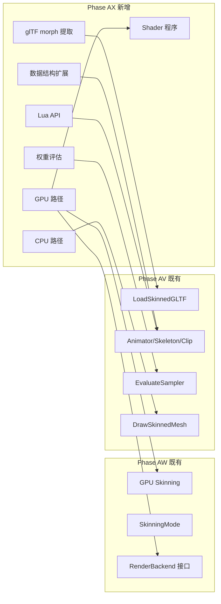
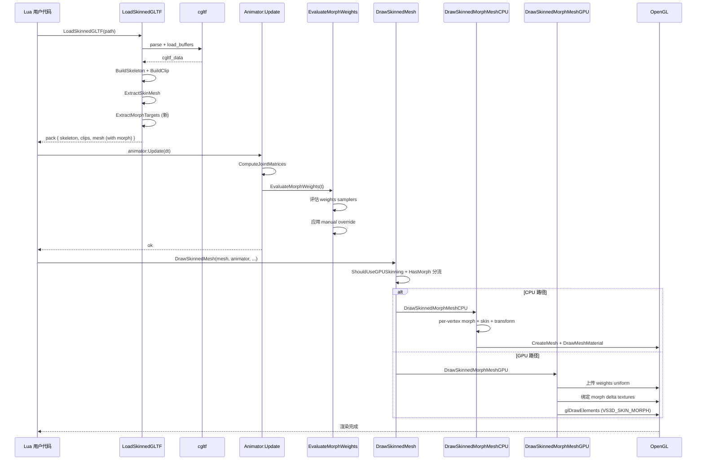

# DESIGN — Phase AX（Morph Target 表情/形状变形）

> **6A 工作流 Stage 2 — Architect §设计阶段产物**
> 系统架构 / 模块依赖 / 接口实现细节 / 数据流。一切代码以本文件为准。

---

## 一、整体架构图

```mermaid
flowchart TD
    subgraph Lua_Layer["Lua 层 (Light.Animation)"]
        L1["LoadSkinnedGLTF(path)"]
        L2["NewAnimator(skeleton)"]
        L3["DrawSkinnedMesh(...)"]
        L4["Animator:SetMorphWeight(idx_or_name, val)"]
        L5["Animator:GetMorphWeight(idx_or_name)"]
        L6["Animator:ClearMorphWeights()"]
        L7["Mesh:GetMorphTargetCount/Name()"]
    end

    subgraph CPP_Anim["C++ light_animation.cpp"]
        C1["ExtractMorphTargets()"]
        C2["BuildClip(weights channels)"]
        C3["EvaluateMorphWeights(animator, t)"]
        C4["DrawSkinnedMeshDispatcher()"]
        C5["DrawSkinnedMorphMeshCPU()"]
        C6["DrawSkinnedMorphMeshGPU()"]
        C7["CpuMorphVertex(base, deltas, weights)"]
    end

    subgraph CPP_Backend["C++ render_backend.h"]
        B1["CreateMorphMesh()"]
        B2["DrawMorphMeshMaterial()"]
        B3["CreateSkinnedMorphMesh()"]
        B4["DrawSkinnedMorphMeshMaterial()"]
        B5["SupportsMorphTargets()"]
    end

    subgraph CPP_GL33["C++ render_gl33.cpp"]
        G1["VS3D_MORPH program"]
        G2["VS3D_SKIN_MORPH program"]
        G3["UploadMorphDeltaTexture()"]
        G4["UploadMorphWeightsUniform()"]
    end

    subgraph CPP_Legacy["C++ render_legacy.cpp"]
        Lg1["默认 stub: 返回 0 / SupportsMorphTargets=false"]
    end

    subgraph cgltf["third_party/cgltf.h"]
        T1["cgltf_morph_target"]
        T2["prim.targets[]"]
        T3["mesh.weights/target_names[]"]
        T4["target_path_type_weights"]
    end

    L1 --> C1
    C1 --> T1
    C1 --> T2
    C1 --> T3
    L2 --> C3
    L3 --> C4
    C4 --> C5
    C4 --> C6
    C5 --> C7
    C6 --> B3
    C6 --> B4
    B1 -.implements.-> G1
    B3 -.implements.-> G2
    B1 -.stub.-> Lg1
    B2 --> G3
    B2 --> G4
    L4 --> C3
    L5 --> C3
    L6 --> C3
    L7 --> C1
```



---

## 二、模块依赖关系图



---

## 三、详细接口契约

### 3.1 Animator 内部状态机

**morphWeights 解析顺序**（每帧 `Animator:Update(dt)` 末尾）：

```
1. evalAnimWeights[i] = 0.0    (全清零)
2. for each Sampler s in activeClip:
       if s.target == MORPH_WEIGHTS:
           # 按 currentTime 评估，输出 N 个值到 evalAnimWeights[0..N-1]
           EvaluateSampler(s, currentTime, evalAnimWeights.data())
3. for i = 0..N-1:
       if !isnan(morphWeightsManual[i]):
           morphWeights[i] = morphWeightsManual[i]   (手动覆盖优先)
       else:
           morphWeights[i] = evalAnimWeights[i]
```

> **关键**：crossfade 期间，两个 clip 各自的 weights 按 `crossfadeProgress` 加权混合（与 joint 矩阵 crossfade 同模式）。

### 3.2 Lua 方法签名

```cpp
// idx_or_name 接受 number(1-based) 或 string；越界 → 返回 nil + err
static int l_Anim_Animator_SetMorphWeight(lua_State* L);
static int l_Anim_Animator_GetMorphWeight(lua_State* L);
static int l_Anim_Animator_ClearMorphWeights(lua_State* L);
static int l_Anim_Animator_GetMorphTargetCount(lua_State* L);
static int l_Anim_Animator_GetMorphTargetName(lua_State* L);
static int l_Anim_Animator_GetMorphWeights(lua_State* L);
static int l_Anim_SkinnedMesh_HasMorphTargets(lua_State* L);
static int l_Anim_SkinnedMesh_GetMorphTargetCount(lua_State* L);
static int l_Anim_SkinnedMesh_GetMorphTargetName(lua_State* L);
```

### 3.3 cgltf 提取算法（`ExtractMorphTargets`）

```cpp
static bool ExtractMorphTargets(const cgltf_primitive* prim,
                                  const cgltf_mesh* mesh,
                                  SkinnedMeshAsset* outMesh,
                                  std::string& errOut) {
    if (!prim || !mesh) return false;

    cgltf_size N = prim->targets_count;
    if (N == 0) {
        outMesh->morphTargetCount = 0;
        return true;  // 不视为错误：没有 morph 也是合法 mesh
    }

    // 截断到 MORPH_TARGET_MAX = 8
    if (N > MORPH_TARGET_MAX) {
        std::fprintf(stderr, "[Phase AX] glTF mesh has %zu morph targets, truncating to %d\n",
                     N, MORPH_TARGET_MAX);
        N = MORPH_TARGET_MAX;
    }

    cgltf_size vCount = outMesh->baseVertices.size();
    outMesh->morphTargets.resize(N);

    for (cgltf_size t = 0; t < N; ++t) {
        const cgltf_morph_target& mt = prim->targets[t];
        MorphTarget& dst = outMesh->morphTargets[t];

        for (cgltf_size a = 0; a < mt.attributes_count; ++a) {
            const cgltf_attribute& attr = mt.attributes[a];
            if (!attr.name || !attr.data) continue;

            // 验证 vertex count 一致
            if (attr.data->count != vCount) continue;

            std::vector<float>* dstVec = nullptr;
            if      (std::strcmp(attr.name, "POSITION") == 0) dstVec = &dst.posDelta;
            else if (std::strcmp(attr.name, "NORMAL")   == 0) dstVec = &dst.nrmDelta;
            else if (std::strcmp(attr.name, "TANGENT")  == 0) dstVec = &dst.tanDelta;
            else continue;

            dstVec->resize(vCount * 3);
            cgltf_accessor_unpack_floats(attr.data, dstVec->data(), dstVec->size());
        }
    }

    outMesh->morphTargetCount = (int)N;

    // 默认权重
    outMesh->morphDefaultWeights.resize(N, 0.0f);
    if (mesh->weights && mesh->weights_count > 0) {
        cgltf_size wN = (mesh->weights_count < N) ? mesh->weights_count : N;
        for (cgltf_size i = 0; i < wN; ++i) {
            outMesh->morphDefaultWeights[i] = mesh->weights[i];
        }
    }

    // 名称
    outMesh->morphTargetNames.resize(N);
    for (cgltf_size i = 0; i < N; ++i) {
        if (mesh->target_names && i < mesh->target_names_count && mesh->target_names[i]) {
            outMesh->morphTargetNames[i] = mesh->target_names[i];
        } else {
            char buf[32];
            std::snprintf(buf, sizeof(buf), "target_%zu", i);
            outMesh->morphTargetNames[i] = buf;
        }
    }
    return true;
}
```

### 3.4 BuildClip 改动（处理 weights channel）

```cpp
// 在 ConvertChannelTarget 后添加：
case cgltf_animation_path_type_weights: return ChannelTarget::MORPH_WEIGHTS;

// 在 BuildClip 内部循环中：
//   if (s.target == MORPH_WEIGHTS) {
//       s.meshNodeIdx = (channel.target_node ? <find_node_index> : -1);
//       s.components = (int)<find_target_count_for_node>;
//   }
```

### 3.5 EvaluateMorphWeights（Animator 每帧）

```cpp
static void EvaluateMorphWeights(Animator* an, float t,
                                   const SkinnedMeshAsset* mesh) {
    if (!mesh || mesh->morphTargetCount == 0) return;
    int N = mesh->morphTargetCount;

    // 1. 清零
    if ((int)an->morphWeights.size() < N) an->morphWeights.assign(N, 0.0f);
    std::vector<float> evalAnim(N, 0.0f);

    // 2. 评估动画通道（如果有）
    if (an->activeClip) {
        for (const Sampler& s : an->activeClip->samplers) {
            if (s.target != ChannelTarget::MORPH_WEIGHTS) continue;
            // EvaluateSampler 写 N 个值到 evalAnim
            EvaluateSampler(s, t, evalAnim.data(), N);
        }
    }
    // crossfade clip 处理（同 joint matrix crossfade 模式）...

    // 3. 应用手动覆盖
    for (int i = 0; i < N; ++i) {
        float manual = (i < (int)an->morphWeightsManual.size()) ?
                       an->morphWeightsManual[i] : std::nanf("");
        an->morphWeights[i] = std::isnan(manual) ? evalAnim[i] : manual;
    }
}
```

### 3.6 CPU 蒙皮 + Morph（核心算法）

```cpp
// 应用 morph delta 到单顶点 (在蒙皮变换前)
static inline void ApplyMorphToVertex(const RenderVertex3D& base,
                                        const std::vector<MorphTarget>& targets,
                                        const float* weights, int N,
                                        float posOut[3], float nrmOut[3], int vIdx) {
    posOut[0] = base.x;  posOut[1] = base.y;  posOut[2] = base.z;
    nrmOut[0] = base.nx; nrmOut[1] = base.ny; nrmOut[2] = base.nz;
    for (int i = 0; i < N; ++i) {
        float w = weights[i];
        if (w == 0.0f) continue;
        const MorphTarget& t = targets[i];
        if (!t.posDelta.empty()) {
            posOut[0] += w * t.posDelta[vIdx*3 + 0];
            posOut[1] += w * t.posDelta[vIdx*3 + 1];
            posOut[2] += w * t.posDelta[vIdx*3 + 2];
        }
        if (!t.nrmDelta.empty()) {
            nrmOut[0] += w * t.nrmDelta[vIdx*3 + 0];
            nrmOut[1] += w * t.nrmDelta[vIdx*3 + 1];
            nrmOut[2] += w * t.nrmDelta[vIdx*3 + 2];
        }
    }
}

// CPU 路径全函数
static int DrawSkinnedMorphMeshCPU(lua_State* L, SkinnedMeshAsset* sm, Animator* an,
                                      const float* modelMat, const MaterialDesc* matDesc) {
    int N = (int)sm->baseVertices.size();
    if (sm->skinnedVertices.size() != (size_t)N) sm->skinnedVertices.resize(N);

    int morphN = sm->morphTargetCount;
    const float* weights = an->morphWeights.empty() ? nullptr : an->morphWeights.data();

    int jCnt = (int)(an->jointMatrices.size() / 16);
    for (int i = 0; i < N; ++i) {
        const RenderVertex3D& vBase = sm->baseVertices[i];
        RenderVertex3D&       vOut  = sm->skinnedVertices[i];
        vOut.u = vBase.u; vOut.v = vBase.v;
        vOut.r = vBase.r; vOut.g = vBase.g; vOut.b = vBase.b; vOut.a = vBase.a;

        // 1. Morph
        float posM[3], nrmM[3];
        if (morphN > 0 && weights) {
            ApplyMorphToVertex(vBase, sm->morphTargets, weights, morphN, posM, nrmM, i);
        } else {
            posM[0] = vBase.x;  posM[1] = vBase.y;  posM[2] = vBase.z;
            nrmM[0] = vBase.nx; nrmM[1] = vBase.ny; nrmM[2] = vBase.nz;
        }

        // 2. Skin
        uint32_t packed = sm->jointIndicesPacked[i];
        uint8_t joints[4] = {
            (uint8_t)(packed & 0xFF),       (uint8_t)((packed >> 8)  & 0xFF),
            (uint8_t)((packed >> 16) & 0xFF), (uint8_t)((packed >> 24) & 0xFF),
        };
        const float* w = &sm->weights[(size_t)i * 4];
        float posOut[3], nrmOut[3];
        CpuSkinVertex(an->jointMatrices.data(), jCnt, joints, w, posM, nrmM, posOut, nrmOut);

        // 3. Model transform
        vOut.x = modelMat[0]*posOut[0] + modelMat[4]*posOut[1] + modelMat[8]*posOut[2] + modelMat[12];
        vOut.y = modelMat[1]*posOut[0] + modelMat[5]*posOut[1] + modelMat[9]*posOut[2] + modelMat[13];
        vOut.z = modelMat[2]*posOut[0] + modelMat[6]*posOut[1] + modelMat[10]*posOut[2] + modelMat[14];
        vOut.nx = modelMat[0]*nrmOut[0] + modelMat[4]*nrmOut[1] + modelMat[8]*nrmOut[2];
        vOut.ny = modelMat[1]*nrmOut[0] + modelMat[5]*nrmOut[1] + modelMat[9]*nrmOut[2];
        vOut.nz = modelMat[2]*nrmOut[0] + modelMat[6]*nrmOut[1] + modelMat[10]*nrmOut[2];
    }

    // 重建 GPU mesh + DrawMeshMaterial（与 Phase AV CPU 路径一致）
    if (sm->gpuMeshId) g_render->DeleteMesh(sm->gpuMeshId);
    sm->gpuMeshId = g_render->CreateMesh(sm->skinnedVertices.data(), N,
                                           sm->indices.data(), (int)sm->indices.size());
    if (!sm->gpuMeshId) {
        lua_pushboolean(L, 0);
        lua_pushstring(L, "CreateMesh failed");
        return 2;
    }
    g_render->DrawMeshMaterial(sm->gpuMeshId, matDesc);
    lua_pushboolean(L, 1);
    return 1;
}
```

### 3.7 GPU 路径（GL33 backend）

```cpp
// CreateSkinnedMorphMesh: 创建顶点 VAO/VBO/EBO + 上传 morph delta 到 2D texture
uint32_t CreateSkinnedMorphMesh(const RenderVertex3DSkin* verts, int vCount,
                                  const uint32_t* indices, int iCount,
                                  const float* posDeltas,    // vCount × 3 × N
                                  const float* nrmDeltas,
                                  const float* tanDeltas,
                                  int morphTargetCount) override {
    if (!gpuSkinningSupported || !programPBRSkinMorph) return 0;
    if (morphTargetCount > 8) morphTargetCount = 8;

    // 1. 与 CreateSkinnedMesh 相同：VAO/VBO/EBO
    MeshGPU m;
    glGenVertexArrays(1, &m.vao);
    glGenBuffers(1, &m.vbo);
    glGenBuffers(1, &m.ebo);
    glBindVertexArray(m.vao);
    glBindBuffer(GL_ARRAY_BUFFER, m.vbo);
    glBufferData(GL_ARRAY_BUFFER, vCount * sizeof(RenderVertex3DSkin), verts, GL_STATIC_DRAW);
    glBindBuffer(GL_ELEMENT_ARRAY_BUFFER, m.ebo);
    glBufferData(GL_ELEMENT_ARRAY_BUFFER, iCount * sizeof(uint32_t), indices, GL_STATIC_DRAW);
    SetupSkinVertexAttribs();   // location 0-5

    glBindVertexArray(0);

    // 2. 创建 morph delta textures (RGBA32F, width=vCount, height=morphTargetCount)
    GLuint texPos = 0, texNrm = 0, texTan = 0;
    glGenTextures(1, &texPos);
    glBindTexture(GL_TEXTURE_2D, texPos);
    UploadMorphDeltaToTex(posDeltas, vCount, morphTargetCount);

    if (nrmDeltas) {
        glGenTextures(1, &texNrm);
        glBindTexture(GL_TEXTURE_2D, texNrm);
        UploadMorphDeltaToTex(nrmDeltas, vCount, morphTargetCount);
    }
    if (tanDeltas) {
        glGenTextures(1, &texTan);
        glBindTexture(GL_TEXTURE_2D, texTan);
        UploadMorphDeltaToTex(tanDeltas, vCount, morphTargetCount);
    }

    m.indexCount        = iCount;
    m.morphPosTex       = texPos;
    m.morphNrmTex       = texNrm;
    m.morphTanTex       = texTan;
    m.morphCount        = morphTargetCount;
    m.hasMorphNormal    = (nrmDeltas != nullptr);

    uint32_t id = nextSkinnedMorphMeshId++;
    skinnedMorphMeshes[id] = m;
    return id;
}

// DrawSkinnedMorphMeshMaterial: 上传 weights uniform + 绑定 textures + DrawElements
void DrawSkinnedMorphMeshMaterial(uint32_t meshId, const MaterialDesc* desc,
                                     const float* jointMatrices, int jointCount,
                                     const float* morphWeights, int morphTargetCount) override {
    auto it = skinnedMorphMeshes.find(meshId);
    if (it == skinnedMorphMeshes.end()) return;
    const MeshGPU& m = it->second;

    GLuint program = (desc->mode == 0) ? programUnlitSkinMorph : programPBRSkinMorph;
    if (!program) return;
    glUseProgram(program);

    // joint matrices UBO（与 Phase AW 一致）
    glBindBuffer(GL_UNIFORM_BUFFER, uboJointMatrices);
    glBufferSubData(GL_UNIFORM_BUFFER, 0, jointCount*16*4, jointMatrices);

    // morph weights uniform array
    GLint locWeights = glGetUniformLocation(program, "uMorphWeights");
    if (locWeights >= 0) glUniform1fv(locWeights, morphTargetCount, morphWeights);
    GLint locCount = glGetUniformLocation(program, "uMorphCount");
    if (locCount >= 0) glUniform1i(locCount, morphTargetCount);

    // bind morph delta textures (texture units 5/6/7)
    GLint locPosTex = glGetUniformLocation(program, "uMorphPosDelta");
    if (locPosTex >= 0) {
        glActiveTexture(GL_TEXTURE5);
        glBindTexture(GL_TEXTURE_2D, m.morphPosTex);
        glUniform1i(locPosTex, 5);
    }
    if (m.hasMorphNormal) {
        glActiveTexture(GL_TEXTURE6);
        glBindTexture(GL_TEXTURE_2D, m.morphNrmTex);
        GLint l = glGetUniformLocation(program, "uMorphNrmDelta");
        if (l >= 0) glUniform1i(l, 6);
    }
    GLint locHasNrm = glGetUniformLocation(program, "uHasMorphNormal");
    if (locHasNrm >= 0) glUniform1i(locHasNrm, m.hasMorphNormal ? 1 : 0);

    // ... MVP / Material / 绘制（与 DrawSkinnedMeshMaterial 一致）...
    glBindVertexArray(m.vao);
    glDrawElements(GL_TRIANGLES, m.indexCount, GL_UNSIGNED_INT, 0);
    glBindVertexArray(0);
}
```

---

## 四、数据流向图



---

## 五、异常处理策略

| 场景 | 检测点 | 应对 |
|------|--------|------|
| morphTargetCount > 8 | `ExtractMorphTargets` | 截断 + warning print；继续 |
| morph delta accessor count != vCount | `ExtractMorphTargets` 内部 | 跳过该 attribute；不 fail（仍可用其他 attr）|
| `SetMorphWeight(idx, val)` 越界 | Lua API 入口 | `lua_pushnil + pushstring("morph index out of range")` |
| `SetMorphWeight(name, val)` 名称不存在 | Lua API 入口 | `lua_pushnil + pushstring("morph target name not found: <name>")` |
| Animator mesh 关联缺失 | `EvaluateMorphWeights` | 跳过；不 raise |
| `glCreateShader` / `glLinkProgram` 失败 | render_gl33 init | 标记 `programUnlitSkinMorph = 0`；morph 路径不可用，自动 fallback CPU |
| morph delta texture 上传失败 | `UploadMorphDeltaToTex` | 返回 0；`gpuMorphMeshUploaded = false`；fallback CPU |
| Web 平台 morph | `ShouldUseGPUMorph` | 返回 false；走 CPU |
| `DrawSkinnedMesh` 在 LegacyBackend + morph mesh | LegacyBackend | `SupportsMorphTargets = false` → 自动走 CPU |

---

## 六、与 Phase AV/AW 的兼容性矩阵

| 场景 | mesh 有 skin？ | mesh 有 morph？ | backend GPU skin？ | backend GPU morph？ | 实际路径 |
|------|---------------|----------------|--------------------|---------------------|---------|
| 1 | ❌ | ❌ | - | - | 不进 DrawSkinnedMesh（用 DrawMeshMaterial）|
| 2 | ✅ | ❌ | ✅ | - | DrawSkinnedMeshGPU（Phase AW 既有）|
| 3 | ✅ | ❌ | ❌ | - | DrawSkinnedMeshCPU（Phase AV 既有）|
| 4 | ❌ | ✅ | - | ✅ | DrawMorphMeshGPU（**本阶段新增**）|
| 5 | ❌ | ✅ | - | ❌ | DrawMorphMeshCPU（**本阶段新增**）|
| 6 | ✅ | ✅ | ✅ | ✅ | DrawSkinnedMorphMeshGPU（**本阶段新增**）|
| 7 | ✅ | ✅ | ✅ | ❌ | DrawSkinnedMorphMeshCPU（GPU skin + GPU morph 不可用 → 整体 CPU）|
| 8 | ✅ | ✅ | ❌ | - | DrawSkinnedMorphMeshCPU |

> **关键设计**：场景 4-5（无 skin 仅 morph）虽然支持，但 Phase AX 优先级是 **2-3-6-7-8**（与 skinned mesh 集成）。无 skin morph 留给后续阶段（用户场景需要时再做）。

---

## 七、Stage 2 完成判据

- [x] 整体架构图（mermaid）
- [x] 模块依赖关系图
- [x] 接口契约（Lua + C++ Backend + cgltf）
- [x] 关键算法详解（morph 提取 / weights 评估 / CPU 路径 / GPU 路径）
- [x] 数据流向图（mermaid sequence）
- [x] 异常处理策略矩阵
- [x] 与 Phase AV/AW 兼容性矩阵（8 种场景）

下一步：写 `TASK_PhaseAX.md`（原子任务拆分 + DAG）。
