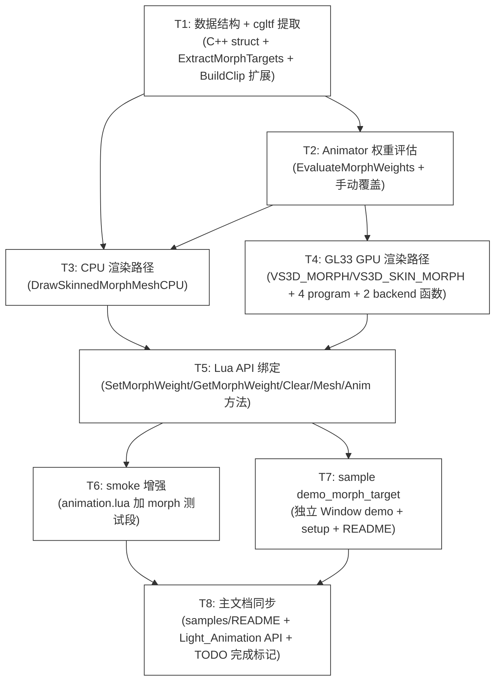

# TASK — Phase AX（Morph Target 表情/形状变形）

> **6A 工作流 Stage 3 — Atomize §原子化阶段产物**
> 把 DESIGN 拆分成可独立验证的原子任务 + 依赖关系图。

---

## 一、任务依赖图



**关键路径**: T1 → T2 → T3 + T4 → T5 → T6 + T7 → T8（顺序执行）。

---

## 二、原子任务详细规范

### T1 — 数据结构 + cgltf 提取

**输入契约**：
- ChocoLight Phase AV/AW 已交付（commit `<current main>`）
- cgltf v1.13 在 `third_party/cgltf.h`
- DESIGN_PhaseAX.md §3.1 / §3.3 已锁定

**输出契约**：
- 文件改动：`ChocoLight/src/light_animation.cpp` 仅文件扩展
- 新增结构体：`MorphTarget`
- 扩展 `enum ChannelTarget` 增加 `MORPH_WEIGHTS = 3`
- 扩展 `struct Sampler`：增加 `meshNodeIdx` 字段
- 扩展 `struct SkinnedMeshAsset`：增加 `morphTargets[]/morphTargetCount/morphDefaultWeights[]/morphTargetNames[]/gpuMorphMeshId/gpuSkinnedMorphMeshId/...`
- 扩展 `struct Animator`：增加 `morphWeights[]/morphWeightsManual[]`
- 新增静态函数：`ExtractMorphTargets`
- 修改：`ConvertChannelTarget` 处理 `cgltf_animation_path_type_weights`
- 修改：`BuildClip` 处理 weights channel（components = N，sampler.values 布局调整）
- 修改：`l_Anim_LoadSkinnedGLTF` 调用 `ExtractMorphTargets`

**实现约束**：
- 严格遵循 `light_animation.cpp` 既有命名风格（`Build*` / `Extract*` / 静态 helper）
- `MORPH_TARGET_MAX = 8` 常量，硬编码上限
- 截断时 `std::fprintf(stderr, ...)` warning（不抛异常）
- vCount 验证失败时跳过该 attribute（不 fail mesh 加载）

**质量要求**：
- 6 平台编译通过（ninja 构建）
- 既有 smoke 不退化（181 PASS 维持）
- 加载非 morph glTF 时 `morphTargetCount == 0`（兼容性）

**验收标准**：
- [ ] 编译通过（cgltf API 调用语法正确）
- [ ] 加载 RiggedSimple.glb 时 `morphTargetCount == 0`（无 morph）
- [ ] 加载 AnimatedMorphCube.glb 时 `morphTargetCount > 0`
- [ ] 6 平台 CI 全绿

**预估工作量**：~280 行（数据结构 80 + ExtractMorphTargets 130 + BuildClip 改动 40 + LoadSkinnedGLTF 改动 30）

---

### T2 — Animator 权重评估

**输入契约**：
- T1 已合并
- `EvaluateSampler` 函数签名已知（Phase AV）

**输出契约**：
- 新增静态函数：`EvaluateMorphWeights(Animator*, t, mesh)`
- 修改 `EvaluateSampler` 签名扩展（如需要支持 N components 输出）— 或新建 `EvaluateMorphSampler`
- 修改 `Animator:Update`：在 `ComputeJointMatrices` 之后调用 `EvaluateMorphWeights`
- 新增 helper：`AnimatorInitMorphState(animator, mesh)` — 在关联 mesh 时初始化 `morphWeights = morphDefaultWeights, morphWeightsManual = NaN`

**实现约束**：
- 评估顺序严格按 DESIGN §3.1：清零 → 动画评估 → 手动覆盖
- crossfade 期间两 clip morph weights 按 `crossfadeProgress` 加权混合
- 手动 sentinel = `std::nanf("")`，用 `std::isnan` 判断

**质量要求**：
- 既有动画 + skin 测试不受影响
- N=0（无 morph mesh）时函数早 return，零开销

**验收标准**：
- [ ] 编译通过
- [ ] smoke 验证：set t=0.5s → Update → weight 推进
- [ ] 6 平台 CI 全绿

**预估工作量**：~120 行（EvaluateMorphWeights 60 + Update 改动 20 + Sampler 处理 40）

---

### T3 — CPU 渲染路径

**输入契约**：
- T1 + T2 已合并
- DESIGN §3.6 完整算法

**输出契约**：
- 新增静态函数：`DrawSkinnedMorphMeshCPU`
- 新增静态函数：`ApplyMorphToVertex`（per-vertex helper）
- 修改 `l_Anim_DrawSkinnedMesh`：分流逻辑增加 morph 判定
  ```cpp
  bool hasMorph = (sm->morphTargetCount > 0);
  bool useGPU = ShouldUseGPUSkinning() && (!hasMorph || g_render->SupportsMorphTargets());
  if (useGPU && hasMorph) return DrawSkinnedMorphMeshGPU(...);   // T4
  if (useGPU)             return DrawSkinnedMeshGPU(...);         // 既有
  if (hasMorph)           return DrawSkinnedMorphMeshCPU(...);    // T3
  return DrawSkinnedMeshCPU(...);                                  // 既有
  ```

**实现约束**：
- CPU morph 在 skin 之前应用（与 GPU shader 顺序一致）
- 复用 `CpuSkinVertex`（不新建）
- weight == 0 时 short-circuit 跳过该 morph target（性能优化）

**质量要求**：
- N=0（无 morph）时不进入 morph 路径
- 既有 Phase AV/AW CPU/GPU 路径不退化

**验收标准**：
- [ ] 编译通过
- [ ] CPU 路径在 LegacyBackend 实际渲染（视觉验证）
- [ ] 既有 demo_animation 仍能正常运行（兼容性）
- [ ] 6 平台 CI 全绿

**预估工作量**：~150 行（DrawSkinnedMorphMeshCPU 120 + ApplyMorphToVertex 30）

---

### T4 — GL33 GPU 渲染路径（最大子任务）

**输入契约**：
- T1 + T2 已合并
- DESIGN §3.7 完整代码草稿

**输出契约**：
- 文件改动：
  - `ChocoLight/src/render_gl33.cpp` — 新增 4 个 program / 4 个新方法
  - `ChocoLight/src/render_backend.h` — 新增 4 个虚函数 + `SupportsMorphTargets`
- shader 字符串：
  - `VS3D_MORPH_SOURCE`（~40 行）
  - `VS3D_SKIN_MORPH_SOURCE`（~50 行）
- program 编译：
  - `programUnlitMorph` / `programPBRMorph`
  - `programUnlitSkinMorph` / `programPBRSkinMorph`
- 数据结构 `MeshGPU` 扩展：增加 `morphPosTex / morphNrmTex / morphTanTex / morphCount / hasMorphNormal`
- 新建 hashmap：`morphMeshes` / `skinnedMorphMeshes`
- 新增 backend 方法：
  - `CreateMorphMesh` / `DrawMorphMeshMaterial`
  - `CreateSkinnedMorphMesh` / `DrawSkinnedMorphMeshMaterial`
  - `SupportsMorphTargets() override return true`
- helper：`UploadMorphDeltaToTex` 上传 RGBA32F 2D texture
- 新建 `DrawSkinnedMorphMeshGPU`（在 light_animation.cpp 中）调用上述 backend 接口

**实现约束**：
- shader 编译失败时打印 GL info log + 标记 program=0（自动 fallback CPU）
- 4 个新 program 共享 FS_UNLIT/FS_PBR（不新建 FS）
- texture unit 分配：base=0, baseColor=1, MR=1, normal=2, emissive=3, occlusion=4, **morphPos=5, morphNrm=6, morphTan=7**
- LegacyBackend 默认实现保持 stub（`SupportsMorphTargets() return false`）

**质量要求**：
- shader 编译错误日志清晰（行号 + 错误信息）
- 6 平台 CI 全绿（Web 也要编译过 — 但运行时走 CPU）
- 既有 GPU skinning 不退化

**验收标准**：
- [ ] 6 平台编译通过
- [ ] GL33Core 真机测试：morph + skin 同时启用渲染正确
- [ ] LegacyBackend 自动 fallback CPU 路径

**预估工作量**：~450 行（shader 90 + program 编译 80 + Create/Draw 函数 200 + helper 80）

---

### T5 — Lua API 绑定

**输入契约**：
- T1-T4 已合并

**输出契约**：
- 文件改动：`ChocoLight/src/light_animation.cpp` 仅扩展
- 新增 9 个 Lua 函数：
  - `l_Anim_Animator_SetMorphWeight`
  - `l_Anim_Animator_GetMorphWeight`
  - `l_Anim_Animator_ClearMorphWeights`
  - `l_Anim_Animator_GetMorphTargetCount`
  - `l_Anim_Animator_GetMorphTargetName`
  - `l_Anim_Animator_GetMorphWeights`
  - `l_Anim_SkinnedMesh_HasMorphTargets`
  - `l_Anim_SkinnedMesh_GetMorphTargetCount`
  - `l_Anim_SkinnedMesh_GetMorphTargetName`
- 注册到对应 metatable 方法表
- 模块常量：`Light.Animation.MORPH_TARGET_MAX = 8`

**实现约束**：
- 完全错误安全（idx 越界 / 名称不存在 / NaN value 都用 nil + err 返回）
- 名称解析：`SetMorphWeight(string, val)` 在 `mesh.morphTargetNames` 线性查找（N≤8 不必哈希）
- `GetMorphWeights()` 返回新建 Lua 数组 table

**质量要求**：
- 不破坏既有 Animator/SkinnedMesh metatable 方法
- 错误信息用户友好

**验收标准**：
- [ ] 编译通过
- [ ] T6 smoke 12 个 CHECK 全部 PASS

**预估工作量**：~180 行（9 个函数 × ~20 行 + 注册 × 10 行）

---

### T6 — smoke 增强

**输入契约**：
- T5 已合并

**输出契约**：
- 文件改动：`scripts/smoke/animation.lua` 末尾新增 `[16]` 段
- 新增 ~12 个 CHECK：
  1. `Anim.MORPH_TARGET_MAX == 8`
  2. `mesh:HasMorphTargets()` 返回 boolean
  3. `mesh:GetMorphTargetCount()` 返回 number ≥ 0
  4. `mesh:GetMorphTargetName(idx)` 返回 string 或 nil
  5. `animator:GetMorphTargetCount()` 与 mesh 一致
  6. `animator:SetMorphWeight(1, 0.5)` 不 raise
  7. `animator:GetMorphWeight(1)` 返回 0.5
  8. `animator:SetMorphWeight("name", 0.3)` 通过名称设置（如有）
  9. `animator:ClearMorphWeights()` 后 GetMorphWeight 返回默认值
  10. `animator:GetMorphWeights()` 返回 table
  11. 越界 SetMorphWeight 返回 nil + err
  12. 不存在的 name 返回 nil + err

**实现约束**：
- 沿用 animation.lua 既有 PASS/FAIL/CHECK helper
- 防 lightc -p 用 safe_require + early return
- 加载非 morph mesh 时仍能跑（用 morphTargetCount == 0 的分支测）

**质量要求**：
- smoke 净增 12 PASS（181 → 193）
- 无 FAIL

**验收标准**：
- [ ] 6 平台 windows runtime smoke 全 PASS

**预估工作量**：~120 行

---

### T7 — sample demo_morph_target

**输入契约**：
- T5 + T6 已合并
- DESIGN_PhaseAX.md 完整

**输出契约**：
- 新建目录：`samples/demo_morph_target/`
- 新文件 5 个：
  - `main.lua`（OOP Window，与 demo_skinning_perf 风格一致）
  - `setup.ps1` / `setup.sh`（下载 AnimatedMorphCube.glb 或类似）
  - `.gitignore`（assets/ 排除）
  - `README.md`（quickstart + keys + 资产链接）
- main.lua 功能：
  - 加载带 morph target 的 glTF
  - 启动后自动播放动画 channel weights
  - 屏幕上 OSD：每个 morph target 一行（name + 当前 weight 进度条）
  - 键盘：1-8 = 切换激活的 morph target，方向键 = 调整 weight，C = ClearMorphWeights，ESC = 退出
- README 包含 3 个推荐资产：AnimatedMorphCube / AnimatedMorphSphere / 自定义

**实现约束**：
- 与 demo_skinning_perf 平行风格
- headless / 无资产 / 无 GUI 时退出码 0
- 不依赖 demo_animation（独立 demo）

**质量要求**：
- 6 平台 lightc -p 语法检查通过
- 桌面 GPU 真机视觉演示正常

**验收标准**：
- [ ] 6 平台 CI 全绿
- [ ] 用户可在 Windows 5 分钟内完成 setup + 运行 demo + 看到 morph 表情变化

**预估工作量**：~350 行（main 250 + setup 50 + README 50）

---

### T8 — 主文档同步

**输入契约**：
- T1-T7 已合并

**输出契约**：
- `samples/README.md` 表格新增 `demo_morph_target/` 一行
- `docs/api/Light_Animation.md` 新增 morph target 章节（API 表 + 示例代码 + 数据流）
- `docs/Phase AV 骨骼动画/TODO_PhaseAV.md` §C.2 标记 ✅ + 完成日志

**实现约束**：
- 与 Phase AV/AW 章节风格一致
- 表格 / 代码块 / 注释完整

**质量要求**：
- 文档结构清晰，新用户能从 Light_Animation.md 上手 morph

**验收标准**：
- [ ] 文档审查（自检）
- [ ] CI 全绿（不影响构建）

**预估工作量**：~250 行

---

## 三、汇总

| ID | 任务 | 预估行 | 关键依赖 | 风险 |
|----|------|-------|---------|------|
| **T1** | 数据结构 + cgltf 提取 | ~280 | - | 低（cgltf API 稳定）|
| **T2** | Animator 权重评估 | ~120 | T1 | 低 |
| **T3** | CPU 渲染路径 | ~150 | T1 + T2 | 低（基本沿用 Phase AV CPU）|
| **T4** | GL33 GPU 渲染路径 | ~450 | T1 + T2 | **高**（shader 复杂、需真机测试）|
| **T5** | Lua API 绑定 | ~180 | T1-T4 | 低 |
| **T6** | smoke 增强 | ~120 | T5 | 低 |
| **T7** | sample demo | ~350 | T5 | 中（资产可获得性）|
| **T8** | 主文档同步 | ~250 | T6 + T7 | 低 |
| **总计** | | **~1900 行** | 总耗时预计 6-8 个工作单元 | |

> **关键路径**：T1 → T4（GPU 路径是最大风险点）。建议在 T4 完成后立即在桌面机器测试 shader，避免风险后期累积。

---

## 四、Stage 3 完成判据

- [x] 8 个原子任务定义清晰，输入/输出/约束/验收齐全
- [x] 依赖图（mermaid）+ 关键路径标注
- [x] 工作量预估每任务有数字
- [x] 风险等级标注（T4 = 高，其他低/中）

下一步：进入 6A Stage 4（人工审批中间检查点）— 用户确认是否启动 Stage 5 实施。
