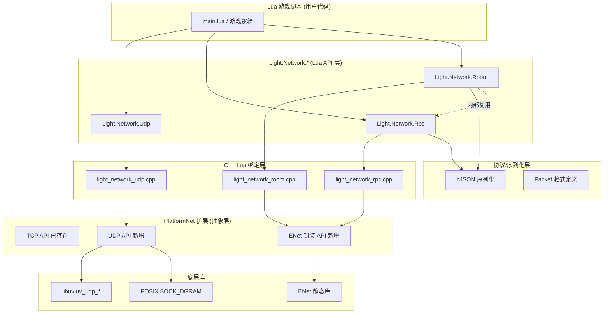
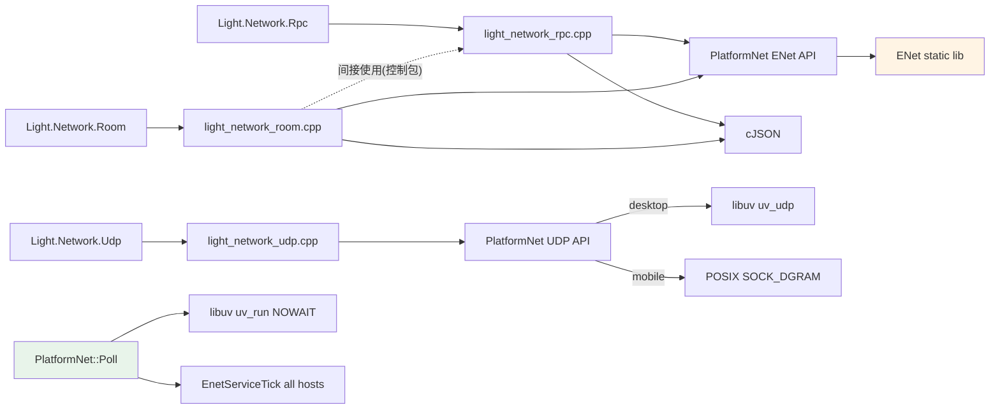

# DESIGN — Phase BC（网络高级）系统架构设计

> **6A 工作流 Stage 2 — Architect 阶段产物 (第二部分)**
> 输入: CONSENSUS_PhaseBC.md 锁定决策
> 输出: 整体架构图 / 分层设计 / 接口契约 / 数据流 / 异常处理策略

---

## 一、整体架构图



---

## 二、分层设计

### Layer 1: Lua API (游戏脚本接口)

| 模块 | 类型 | 职责 |
|------|------|------|
| `Light.Network.Udp` | table | raw UDP Send/Receive socket 封装 |
| `Light.Network.Rpc` | table | Server + Client 类方法, JSON-RPC 2.0 兼容语义 |
| `Light.Network.Room` | table | Create/Join 房间, state 同步, event broadcast |

### Layer 2: C++ Lua 绑定 (新增 3 个 .cpp)

| 文件 | 行数估算 | 核心职责 |
|------|---------|---------|
| `light_network_udp.cpp` | ~300 | UdpSocket userdata + Lua 方法表 + GC |
| `light_network_rpc.cpp` | ~400 | RpcServer + RpcClient userdata + id 管理 + timeout |
| `light_network_room.cpp` | ~500 | RoomHost + RoomClient userdata + state diff + master migration |

### Layer 3: 协议/序列化

**包格式规范** (所有 Rpc/Room 消息统一通过 ENet channel 传输):

```
┌────────┬────────┬──────────┬─────────────────────────┐
│ MAGIC  │ TYPE   │ LEN      │ PAYLOAD (JSON)          │
│ 2 byte │ 1 byte │ 4 byte   │ ≤ 64KB                  │
└────────┴────────┴──────────┴─────────────────────────┘

MAGIC = 0x4243 ('BC')          // Phase BC 标记, 防止乱包
TYPE:
  0x01 = RPC_REQUEST
  0x02 = RPC_RESPONSE
  0x03 = ROOM_STATE
  0x04 = ROOM_EVENT
  0x05 = ROOM_INPUT
  0x06 = ROOM_HELLO
  0x07 = ROOM_KICK
LEN   = network byte order uint32 (JSON 长度)
```

**JSON 负载示例**:

```json
// RPC_REQUEST
{"id": 42, "method": "spawn_bullet", "params": {"x": 100, "y": 200}}

// RPC_RESPONSE (success)
{"id": 42, "result": {"bullet_id": 7}}

// RPC_RESPONSE (error)
{"id": 42, "error": {"code": -32601, "message": "method not found"}}

// ROOM_STATE (full sync)
{"rev": 128, "data": {"players": {...}, "boss": {...}, "bullets": [...]}}

// ROOM_EVENT
{"name": "player_join", "args": {"id": 3, "name": "Alice"}}

// ROOM_INPUT (client → master)
{"kind": "move", "data": {"x": 100, "y": 200}}

// ROOM_HELLO (player handshake)
{"name": "Alice", "version": "1.0"}

// ROOM_KICK
{"reason": "room_full"}
```

### Layer 4: PlatformNet 扩展

**新增 API** (`light_platform_net.h`):

```cpp
namespace PlatformNet {

// ============ 现有 TCP API 不变 ============
uv_tcp_s* CreateClient();
bool Connect(uv_tcp_s*, const char*, uint16_t, OnConnectCb);
// ...

// ============ Raw UDP (新增) ============
struct UdpSocket;  // forward decl, 隐藏 libuv/POSIX 细节

typedef std::function<void(const char* fromHost, uint16_t fromPort,
                            const char* data, int len)> OnUdpRecvCb;

UdpSocket* CreateUdpSocket();
bool       BindUdp(UdpSocket*, const char* ip, uint16_t port);  // port=0 = 随机
bool       SendUdp(UdpSocket*, const char* host, uint16_t port,
                    const char* data, size_t len);
bool       StartUdpRecv(UdpSocket*, OnUdpRecvCb cb);
void       CloseUdp(UdpSocket*);
// GetLocalAddr, GetPeerCount 等辅助 API 按需添加

// ============ ENet 封装 (新增) ============
struct EnetHost;
struct EnetPeer;

enum class EnetEventType : int {
    NONE       = 0,
    CONNECT    = 1,
    DISCONNECT = 2,
    RECEIVE    = 3,
};

struct EnetEvent {
    EnetEventType type;
    EnetPeer*     peer;
    int           channel;
    const char*   data;
    int           len;
};

typedef std::function<void(const EnetEvent&)> OnEnetEventCb;

// Host (server 或 client 均可)
EnetHost* EnetCreateHost(const char* ip,         // nullptr = ANY
                          uint16_t port,          // 0 = client only (不监听)
                          int maxPeers,
                          int channels);          // 默认 2
void      EnetDestroyHost(EnetHost*);

// Peer 操作
EnetPeer* EnetConnect(EnetHost* local,
                       const char* host,
                       uint16_t port,
                       int channels);
void      EnetDisconnect(EnetPeer*, uint32_t data = 0);
bool      EnetSend(EnetPeer*,
                    int channel,
                    const char* data, int len,
                    bool reliable);

// 事件循环 (在 PlatformNet::Poll 中统一驱动)
void      EnetServiceTick(EnetHost*, OnEnetEventCb cb);

// 辅助
const char* EnetPeerAddress(EnetPeer*);  // "192.168.1.100:9000"
uint32_t    EnetPeerID(EnetPeer*);
int         EnetPeerChannelCount(EnetPeer*);

}  // namespace PlatformNet
```

### Layer 5: 底层

- **桌面 libuv**: `uv_udp_t` / `uv_udp_init` / `uv_udp_bind` / `uv_udp_send` / `uv_udp_recv_start`
- **移动 POSIX**: `socket(AF_INET, SOCK_DGRAM, 0)` + `sendto/recvfrom` + 非阻塞 fd
- **ENet 静态库**: 跨平台原生 BSD socket 实现, 无需特殊适配

---

## 三、模块依赖关系



**依赖规则**:
- `light_network_udp.cpp` 不依赖 ENet
- `light_network_rpc.cpp` 依赖 ENet 但不依赖 Room
- `light_network_room.cpp` 依赖 ENet, 内部使用 RPC 格式但**不**依赖 RpcServer/RpcClient userdata
- 无循环依赖

---

## 四、接口契约 (Lua API 详细签名)

### 4.1 `Light.Network.Udp`

```lua
-- 创建 UDP socket (port=0 表示随机端口)
Light.Network.Udp.Open(port)  -- → UdpSocket | nil, err

-- UdpSocket 方法 (metatable)
socket:Bind(ip, port)         -- → true | nil, err
socket:Send(host, port, data) -- → true | nil, err   -- data 可 string 或 bytes
socket:OnReceive(callback)    -- callback(host, port, data)
socket:GetLocalPort()         -- → number
socket:Close()                -- → ()
-- __gc: 自动 Close + 释放回调 ref
```

### 4.2 `Light.Network.Rpc`

```lua
-- Server
local server = Light.Network.Rpc.Server({
    port      = 9000,
    maxPeers  = 32,
})
server:Register(method, handler)  -- handler(peer, ...params) → result | error
server:Start()                    -- → true | nil, err
server:Stop()
server:OnConnect(fn)              -- fn(peer)
server:OnDisconnect(fn)           -- fn(peer, reason)

-- Client
local client = Light.Network.Rpc.Client(host, port)
client:Connect(timeoutMs)         -- 默认 5000
client:Call(method, params, callback)  -- callback(err, result)
client:Call(method, params, callback, timeoutMs)  -- 每次调用可覆盖
client:OnDisconnect(fn)           -- fn(reason)
client:Close()

-- 错误码 (JSON-RPC 2.0 兼容)
-- -32700 Parse error
-- -32600 Invalid Request
-- -32601 Method not found
-- -32602 Invalid params
-- -32603 Internal error
-- -32000 Timeout (ChocoLight 扩展)
-- -32001 Connection closed
```

### 4.3 `Light.Network.Room`

```lua
-- Host (服务端)
local room = Light.Network.Room.Create({
    port        = 9000,
    maxPlayers  = 32,
    initialState = { players = {}, boss = { hp = 1000 } },
    tickRate    = 20,             -- 状态广播频率
})
room:OnPlayerJoin(fn)             -- fn(playerId, helloData)
room:OnPlayerLeave(fn)            -- fn(playerId, reason)
room:OnInput(fn)                  -- fn(playerId, input) → 用户处理
room:SetState(newState)           -- 变更 state, 自动 broadcast
room:GetState()                   -- 只读拷贝
room:BroadcastEvent(name, args)   -- 非状态事件广播
room:KickPlayer(playerId, reason)
room:Close()

-- Client (玩家端)
local client = Light.Network.Room.Join({
    host = '127.0.0.1',
    port = 9000,
    name = 'Alice',
    meta = { avatar = 1 },        -- 附加 hello 数据
})
client:OnJoined(fn)               -- fn(myId, state)
client:OnState(fn)                -- fn(newState, oldState)
client:OnEvent(fn)                -- fn(name, args)
client:SendInput(kind, data)      -- kind='move'|'attack'|...
client:Leave()

-- 辅助常量
Light.Network.Room.MAX_PLAYERS = 32
Light.Network.Room.DEFAULT_TICK_RATE = 20
```

---

## 五、数据流图

### 5.1 RPC 调用

```
Client                              Server
  │ client:Call('greet', 'world', cb)    │
  │ ├ 分配 id=7                           │
  │ ├ 存 pendingCalls[7] = {cb, timeout}  │
  │ ├ JSON 序列化                         │
  │ ├ ENet send (ch=0 reliable)          │
  │────────────────────────────────────>│ ENet Event CONNECT 后 RECEIVE
  │                                      │ ├ 解析 header + JSON
  │                                      │ ├ 找 registry[method]
  │                                      │ ├ 调用 handler(peer, params)
  │                                      │ ├ 封装 response{id:7, result:...}
  │<────────────────────────────────────│ ENet send (ch=0 reliable)
  │ ├ JSON 解析                          │
  │ ├ 找 pendingCalls[7]                  │
  │ ├ 清 timeout                          │
  │ ├ cb(nil, result)  ← Lua callback    │
```

### 5.2 Room State 广播

```
Master Client       Room Host (Server)         Other Clients
     │                     │                         │
     │ client:SendInput('move', {x,y})                │
     │────────────────────>│  ROOM_INPUT                │
     │                     │ ├ OnInput(playerId, in) ← Lua handler
     │                     │ ├ Lua 修改 state.players[id]
     │                     │ ├ room:SetState(newState)
     │                     │ ├ 下次 tick: JSON 序列化
     │                     │ ├ ENet broadcast (ch=1 unreliable seq)
     │<────────────────────│────────────────────────>│
     │                     │                         │ ├ ENet RECEIVE
     │ cli:OnState(new,old)│                         │ │ ├ JSON 解析
     │                     │                         │ │ ├ OnState(new,old)

约束:
  - tick 间至少 1 次 SetState 才触发广播 (dedup)
  - 连续多次 SetState 只发最后一次 (rate limit to tickRate)
  - ENet auto throttle congestion control
```

### 5.3 Master Migration

```
初始: [A master][B][C]    A 离开

1. ENet DISCONNECT 触发 on host
2. host 清 players[A]
3. 检测到 master 空缺 → 选举
   候选 = 按 join 顺序: [B, C] → 选 B
4. 更新 state.masterId = B
5. 广播 ROOM_EVENT{name:'master_migrate', args:{new:B}}
6. 下次 SetState 由 B 的 Lua 脚本处理
```

---

## 六、关键实现决策

### 6.1 ENet event loop 协同

**问题**: ENet 有独立 `enet_host_service(host, event, timeout)`, 与 libuv `uv_run(UV_RUN_NOWAIT)` 如何协同?

**方案**:
```cpp
// PlatformNet::Poll() 在现有 libuv tick 后加 ENet tick
void Poll() {
    // libuv tick (TCP/HTTP/WS)
    if (s_loop) uv_run(s_loop, UV_RUN_NOWAIT);

    // ENet tick (UDP reliable)
    for (auto* host : g_enetHosts) {
        EnetServiceTick(host, DispatchEvent);
    }
}
```

- timeout = 0 非阻塞, 交错调用不会互相卡
- ENet 内部 select() timeout=0 = 单次 poll 所有 fd

### 6.2 UdpSocket / EnetHost lifetime

**问题**: userdata GC 时机与 Poll 线程时序?

**方案**:
- ChocoLight 单线程 (Phase AU 确认), 所有 Lua 回调 + Poll 在主线程顺序执行
- `__gc` 时: 先 `CloseUdp/EnetDestroyHost` (阻止后续 event dispatch), 再 unref callback
- GC 回调可能在 `Poll` 结束后触发, 安全

### 6.3 RPC id 冲突

**方案**:
```cpp
struct RpcClient {
    uint32_t nextId = 1;      // 单调递增, 2^32 条调用才绕
    std::unordered_map<uint32_t, PendingCall> pending;
};
```

- id=0 保留表示 notification (不需响应, 留未来扩展)
- 绕回时检查 pending 是否存在 (不存在才复用)

### 6.4 State diff 优化 (留 Phase BC.x)

当前 CONSENSUS 锁定 full sync. 但 `light_network_room.cpp` 预留 hook:
```cpp
// 未来扩展点
std::string SerializeState(const LuaTable& state, int sinceRev);  // 传 rev=-1 则 full
```

### 6.5 JSON 序列化性能

**问题**: 每 tick 20 Hz × 32 人 × N KB = 潜在 CPU 热点.

**缓解**:
- cJSON_PrintUnformatted (省 whitespace)
- SetState 后 cache json 字符串, 下 tick 复用除非 state 变更
- 未来如热点: 换 msgpack / FlatBuffers (留 BC.x)

---

## 七、异常处理策略

| 异常 | 触发点 | 处理 |
|------|--------|------|
| ENet init 失败 | `EnetCreateHost` | 返回 nullptr → Lua `Light.Network.Rpc.Server` 返回 `nil, 'enet init failed'` |
| UDP bind 失败 | 端口占用 | Lua `Udp.Open` 返回 `nil, 'bind failed: ...'` |
| Peer connect timeout | ENet timeout > 5s 无 CONNECT 事件 | `client:Connect` 触发 `OnDisconnect('timeout')` |
| RPC method 不存在 | Server 端 Registry 查不到 | 返回 error{-32601, 'method not found'} |
| JSON parse 失败 | 乱包 / 旧版本包 | LOG_WARN, 丢弃该包, 不 disconnect |
| Magic 不匹配 | 包头 ≠ 0x4243 | 同上, 防止垃圾 UDP 流量 |
| 房间满 | maxPlayers 达到 | `ROOM_KICK{reason:'room_full'}` + `EnetDisconnect` |
| Master 离开 | Host 检测到 master peer disconnect | 自动 migration, 日志 LOG_INFO |
| Client 断线 | ENet DISCONNECT 事件 | `client:OnDisconnect('connection lost')` |
| Web 平台调用 | Emscripten build | 编译期报错 (header static_assert) |

---

## 八、可行性验证

### 8.1 技术栈可行性

| 技术 | 成熟度 | 风险 |
|------|--------|------|
| libuv uv_udp_* | 高 (libuv 1.x 稳定) | 低 |
| POSIX SOCK_DGRAM | 最高 (UNIX 30 年标准) | 低 |
| ENet 1.3.18 | 高 (多款商业游戏使用) | 低 |
| cJSON 序列化 | 高 (已在项目使用) | 低 |

### 8.2 性能预估 (保守)

- RPC 单次往返 (loopback): < 1ms
- 32 人房间 20Hz full sync, state ~2KB: ~1.3 MB/s 总流量, 局域网可承受
- ENet service tick 32 peer: ~100μs (select + parse)
- libuv + ENet 交错 Poll: 单帧 < 0.5ms 开销

---

## 九、与既有模块无冲突验证

| 模块 | 影响 | 冲突检查 |
|------|------|---------|
| `Light.Network.Http*` | 零改动 | 独立 TCP 路径 |
| `Light.Network.HttpServer` | 零改动 | 独立 TCP 路径 |
| `Light.Network.Web` | 零改动 | Lua 脚本层 |
| `PlatformNet::Poll` | 扩展 (加 ENet tick) | 兼容, 现有 libuv 调用不变 |
| CMake | 扩展 (加 ENet subdir) | 条件编译, Web 跳过 |
| `Light.dll` 符号表 | +N 个 luaopen_Light_Network_* | 不破坏现有 |

---

## 十、Stage 2 完成定义

✅ 已完成:
- 整体架构图 (mermaid) + 分层设计
- 模块依赖关系图
- PlatformNet 扩展 API 签名
- Lua API 详细契约 (Udp / Rpc / Room)
- 协议包格式 + JSON 负载 schema
- RPC/State 数据流图
- 异常处理策略表
- 关键实现决策 (ENet↔libuv 协同 / lifetime / id 冲突 / 序列化性能)
- 技术栈可行性验证
- 与既有模块无冲突验证

**Stage 2 Architect 完成. 进入 Stage 3 Atomize — 起草 TASK_PhaseBC.md 按依赖图拆分原子任务.**
