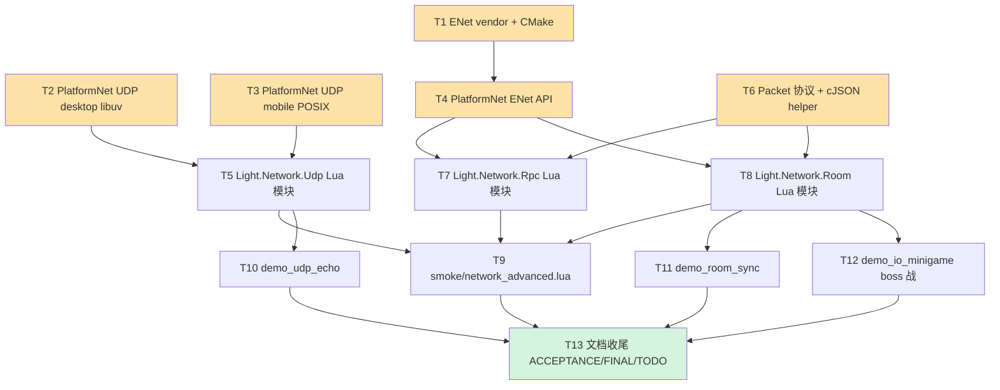

# TASK — Phase BC（网络高级）原子任务拆分

> **6A 工作流 Stage 3 — Atomize 阶段产物**
> 输入: CONSENSUS_PhaseBC.md + DESIGN_PhaseBC.md
> 输出: 13 个原子任务 + 任务依赖 DAG + 每任务完整契约

---

## 一、任务依赖图



**关键路径**: T1 → T4 → T7/T8 → T9 → T13 (≈ 60h 顺序上限)
**并行机会**: T2 与 T3 并行 (同时开工不冲突), T6 与 T1-T4 并行 (纯协议定义)

---

## 二、任务清单总览

| # | 任务 | 预估工时 | 依赖 | 并行可能 | 验收 |
|---|------|---------|------|---------|------|
| **T1** | ENet vendor + CMake 条件编译 | 2-3h | — | 与 T2/T3/T6 并行 | 构建通过 (Windows/Linux/macOS) |
| **T2** | PlatformNet UDP 桌面 (libuv) | 4h | — | 与 T1/T3/T6 并行 | 单元测试: bind + send + recv |
| **T3** | PlatformNet UDP 移动 (POSIX) | 3h | — | 与 T1/T2/T6 并行 | 单元测试: Android/iOS build 通过 |
| **T4** | PlatformNet ENet API 封装 | 6h | T1 | — | 单元测试: 双 host peer 连接 + send/recv |
| **T5** | `Light.Network.Udp` Lua 模块 | 5h | T2, T3 | 与 T6/T7 并行 | loopback send/recv Lua 端验证 |
| **T6** | Packet 协议 + cJSON helper | 2h | — | 与 T1-T4 并行 | 单测: serialize + deserialize 对称 |
| **T7** | `Light.Network.Rpc` Lua 模块 | 10h | T4, T6 | — | loopback RPC Call 成功 + timeout |
| **T8** | `Light.Network.Room` Lua 模块 | 15h | T4, T6 | — | loopback 32 peer + state 同步 + migration |
| **T9** | smoke `network_advanced.lua` | 5h | T5, T7, T8 | — | 30+ 断言全绿 |
| **T10** | sample `demo_udp_echo` | 3h | T5 | 与 T9/T11 并行 | 双端脚本 README 完整 |
| **T11** | sample `demo_room_sync` | 5h | T8 | 与 T9/T10 并行 | 位置广播可视化 |
| **T12** | sample `demo_io_minigame` (boss 战) | 20h | T8 | — | 4 人协作 + 2D sprite + 动画 + 特效 |
| **T13** | Stage 6 文档 (ACCEPTANCE/FINAL/TODO) | 8h | T9-T12 | — | 3 个文档齐全 + push |

**合计工时**: ~88h ≈ **2.5 周** (全职) / **4-5 周** (兼职).

---

## 三、每任务详细契约

---

### T1 — ENet vendor + CMake 集成

**输入契约**:
- **前置依赖**: 无
- **输入数据**: ENet 1.3.18 源码 tarball (`enet-1.3.18.tar.gz` from `http://enet.bespin.org/SourceDistro.html`)
- **环境依赖**: CMake 3.15+, 各平台 toolchain

**输出契约**:
- **交付物**:
  - `ChocoLight/third_party/enet/` 目录 (源码 + CMakeLists.txt)
  - `ChocoLight/third_party/enet/LICENSE` (MIT)
  - `ChocoLight/CMakeLists.txt` 条件 `add_subdirectory(third_party/enet)` + `target_link_libraries`
  - `ChocoLight/CMakeLists.txt` 添加 `target_compile_definitions(Light PRIVATE CHOCO_NET_ENET_ENABLED)` (非 Emscripten)
- **验收标准**:
  - Windows MSVC Release 构建通过, `enet.lib` 生成
  - Linux GCC 构建通过
  - macOS Clang 构建通过
  - Android NDK 构建通过
  - iOS Xcode 构建通过 (手动验证, 非 CI)
  - Emscripten 构建仍通过 (ENet 跳过)

**实现约束**:
- 不修改 ENet 源码 (零 patch, 全靠 CMake 旗标)
- 静态链接 (与 libuv/box2d 一致)
- ENet 的 `ENET_DEBUG` 在 Release 下关闭

**依赖关系**:
- 后置: T4 (PlatformNet ENet API 依赖此构建产物)
- 并行: T2, T3, T6

---

### T2 — PlatformNet UDP API 桌面实现 (libuv)

**输入契约**:
- **前置依赖**: 无 (现有 libuv)
- **输入数据**: libuv `uv_udp_*` API
- **环境依赖**: Windows/Linux/macOS toolchain

**输出契约**:
- **交付物**:
  - `light_platform_net.h`: 新增 `struct UdpSocket`, `CreateUdpSocket/BindUdp/SendUdp/StartUdpRecv/CloseUdp` 前向声明
  - `light_platform_net.cpp` 桌面分支: 上述 API 基于 `uv_udp_t` 实现
- **验收标准**:
  - loopback 单端测试: Bind(127.0.0.1, 0) → Send(self) → Recv 回调收到
  - 端口占用 Bind 返回 false, 日志 LOG_WARN
  - Close 后再 Send 不崩溃 (返回 false)
  - `__gc` 路径: userdata 释放不导致 libuv 回调悬空 (参考 HttpContext 模式)

**实现约束**:
- `UdpSocket` 内部结构对 Lua 不透明 (隐藏在 .cpp)
- 回调在 `PlatformNet::Poll` 主线程触发 (非 libuv worker)
- 包大小上限 64KB (UDP 协议上限), 超限日志 + 丢弃

**依赖关系**:
- 后置: T5 (Light.Network.Udp 依赖)
- 并行: T1, T3, T6

---

### T3 — PlatformNet UDP API 移动实现 (POSIX)

**输入契约**:
- **前置依赖**: 无 (现有 `light_platform_net_mobile.cpp` 模式)
- **输入数据**: POSIX `socket(AF_INET, SOCK_DGRAM, 0)` + `sendto/recvfrom`
- **环境依赖**: Android NDK / iOS Xcode

**输出契约**:
- **交付物**:
  - `light_platform_net_mobile.cpp`: 新增 `UdpSocket` 实现, 非阻塞 fd + select-based poll
  - 与 T2 API 签名 100% 一致 (header 共享)
- **验收标准**:
  - Android NDK 构建通过
  - iOS build 通过 (手动)
  - 与 T2 单端测试相同脚本均通过
  - 不引入新 POSIX 依赖 (使用已有 socket/fcntl/select)

**实现约束**:
- 与 T2 行为一致 (包含错误码、回调时序)
- mobile 单独存放 `s_udpHandles`, 与 `s_handles` (TCP) 隔离

**依赖关系**:
- 后置: T5
- 并行: T1, T2, T6

---

### T4 — PlatformNet ENet API 封装

**输入契约**:
- **前置依赖**: T1 (ENet 静态库已构建)
- **输入数据**: ENet `enet_host_create/enet_host_service/enet_peer_send` 等 API
- **环境依赖**: `CHOCO_NET_ENET_ENABLED` 宏

**输出契约**:
- **交付物**:
  - `light_platform_net.h`: `struct EnetHost/EnetPeer`, `EnetEvent`, 全套 API 前向声明 (见 DESIGN §4.2)
  - `light_platform_net.cpp` 桌面 / `_mobile.cpp` 移动: 实现
  - Emscripten 分支: 空存根 + LOG_ERROR("ENet not supported on Web")
- **验收标准**:
  - 单进程内双 EnetHost (server + client) 连接成功, CONNECT 事件触发
  - reliable channel 送收验证 (大小 1KB)
  - unreliable channel 送收验证
  - DISCONNECT 事件触发 (peer 端 EnetDisconnect)
  - EnetServiceTick 在 Poll 中调, 不阻塞

**实现约束**:
- 所有 `EnetHost*` 登记到 `g_enetHosts` vector, Poll 统一 tick
- 事件回调同步触发 (Poll 主线程)
- EnetHost 销毁时自动从 g_enetHosts 摘除

**依赖关系**:
- 前置: T1
- 后置: T7, T8
- 并行: T2, T3, T5 (不包括 T4 本身, 但 T2/T3 可并行完成)

---

### T5 — Light.Network.Udp Lua 模块

**输入契约**:
- **前置依赖**: T2, T3 (UDP API 跨平台可用)
- **输入数据**: 无
- **环境依赖**: Lua 5.1 + `light.h`

**输出契约**:
- **交付物**:
  - `ChocoLight/src/light_network_udp.cpp` (~300 行)
  - Lua API: `Light.Network.Udp.Open(port)` → UdpSocket userdata
  - UdpSocket 方法: `Send / OnReceive / GetLocalPort / Close / __gc / __tostring`
  - 注册到 `Light.dll` (`luaopen_Light_Network_Udp`)
- **验收标准**:
  - Lua: `sock1 = Open(9001); sock2 = Open(9002); sock1:Send('127.0.0.1', 9002, 'hello'); sock2:OnReceive(cb); Poll() → cb('127.0.0.1', 9001, 'hello')`
  - OnReceive 回调 5ms 内触发 (loopback)
  - GC 路径: userdata 失引用 → __gc → CloseUdp → libuv close → callback ref 释放

**实现约束**:
- UdpSocket userdata 元表名 `Light.Network.Udp.Userdata`
- 回调 ref 用 `luaL_ref(L, LUA_REGISTRYINDEX)`, `__gc` 时 unref
- 回调失败 (Lua error) 用 pcall 捕获 + LOG_WARN, 不传染后续

**依赖关系**:
- 前置: T2, T3
- 后置: T9, T10
- 并行: T6, T7

---

### T6 — Packet 协议 + cJSON helper

**输入契约**:
- **前置依赖**: 无 (cJSON 已 link)
- **输入数据**: DESIGN §3 包格式规范
- **环境依赖**: cJSON

**输出契约**:
- **交付物**:
  - `ChocoLight/src/light_network_packet.h` (新文件, ~80 行):
    ```cpp
    namespace NetProto {
        constexpr uint16_t MAGIC = 0x4243;
        enum PacketType : uint8_t {
            RPC_REQUEST = 1, RPC_RESPONSE = 2,
            ROOM_STATE = 3, ROOM_EVENT = 4, ROOM_INPUT = 5,
            ROOM_HELLO = 6, ROOM_KICK = 7,
        };
        // Packet 头 7 bytes (2+1+4), 网络字节序
        struct PacketHeader { uint16_t magic; uint8_t type; uint32_t len; };

        // 打包 / 解包 helper
        std::string Pack(PacketType type, const char* json, size_t jsonLen);
        bool Unpack(const char* data, size_t len,
                    PacketType& outType, std::string& outJson);

        // cJSON 便利 helper (RAII 释放 + error-safe)
        struct JsonScope { cJSON* root; ~JsonScope(); };
    }
    ```
  - `ChocoLight/src/light_network_packet.cpp` (~120 行)
- **验收标准**:
  - 单测 (可加在 smoke): Pack + Unpack 对称, 随机 1000 轮无失败
  - Unpack 错 magic 返回 false + 保持 outType/outJson 不动
  - cJSON 释放零泄漏

**实现约束**:
- 纯内部 C++ 模块, 不暴露 Lua
- `htonl/ntohl` 跨平台 (Windows `winsock2.h`, POSIX `arpa/inet.h`)
- `JsonScope` RAII 包 cJSON_Delete

**依赖关系**:
- 前置: 无
- 后置: T7, T8
- 并行: T1-T5 全部

---

### T7 — Light.Network.Rpc Lua 模块

**输入契约**:
- **前置依赖**: T4 (ENet), T6 (Packet protocol)
- **输入数据**: DESIGN §4.2 Lua API 签名
- **环境依赖**: `CHOCO_NET_ENET_ENABLED`

**输出契约**:
- **交付物**:
  - `ChocoLight/src/light_network_rpc.cpp` (~400 行)
  - Lua API:
    - `Light.Network.Rpc.Server({port, maxPeers})` → RpcServer ud
    - `Light.Network.Rpc.Client(host, port)` → RpcClient ud
    - RpcServer: `Register/Start/Stop/OnConnect/OnDisconnect/Close`
    - RpcClient: `Connect/Call/OnDisconnect/Close`
- **验收标准**:
  - loopback 单进程: server Register('add', fn) + client Call('add', {1,2}, cb) → cb(nil, 3)
  - Method not found: cb receives `{ code=-32601, message='method not found' }`
  - Timeout (cb 5s 未返回): cb receives `{ code=-32000, message='timeout' }`
  - 并发 1000 Call: 所有 id 无冲突, 无 cb 漏调
  - 未 Connect 调 Call: 返回 `nil, 'not connected'`

**实现约束**:
- 内部用 ENet channel 0 (reliable ordered) 发 RPC
- `pendingCalls[id] = {cb_ref, timeoutTick, origin_time}`
- 每次 Poll 检查 timeout, 过期 cb(err='timeout') + 清 pending
- 错误码遵循 JSON-RPC 2.0 标准

**依赖关系**:
- 前置: T4, T6
- 后置: T9
- 并行: T8 (两个独立模块)

---

### T8 — Light.Network.Room Lua 模块

**输入契约**:
- **前置依赖**: T4 (ENet), T6 (Packet protocol)
- **输入数据**: DESIGN §4.3 Lua API + §6 关键实现决策
- **环境依赖**: `CHOCO_NET_ENET_ENABLED`

**输出契约**:
- **交付物**:
  - `ChocoLight/src/light_network_room.cpp` (~500 行)
  - Lua API:
    - `Light.Network.Room.Create({port, maxPlayers, initialState, tickRate})` → RoomHost ud
    - `Light.Network.Room.Join({host, port, name, meta})` → RoomClient ud
    - RoomHost: `OnPlayerJoin/OnPlayerLeave/OnInput/SetState/GetState/BroadcastEvent/KickPlayer/Close`
    - RoomClient: `OnJoined/OnState/OnEvent/SendInput/Leave`
- **验收标准**:
  - loopback: 1 host + 3 client 全部连入, OnPlayerJoin 触发 3 次
  - client:SendInput + host:OnInput 双向触发
  - host:SetState + client:OnState 广播链路工作 (50ms 内)
  - host 选举: master=第一个 join; master disconnect → 自动选次连入者
  - 房间满: 第 (maxPlayers+1) 个 client connect 收到 KICK{reason='room_full'}
  - 无效 JSON 包: LOG_WARN 丢弃, 不 disconnect

**实现约束**:
- tick 驱动: Poll 内部积累时间, 达到 1/tickRate 秒后 broadcast 一次
- State full sync: `cJSON_PrintUnformatted(state)` → Packet → broadcast
- State dedup: 连续 SetState 在同 tick 内只发最后一次
- master migration 纯 host 内部逻辑, 不通知 client (client 无 master 概念, 仅接收 state)
- 所有 Lua 回调 pcall 保护

**依赖关系**:
- 前置: T4, T6
- 后置: T9, T11, T12
- 并行: T7

---

### T9 — smoke `scripts/smoke/network_advanced.lua`

**输入契约**:
- **前置依赖**: T5, T7, T8
- **输入数据**: 现有 smoke 风格 (`animation.lua` / `physics_3d.lua`)
- **环境依赖**: `light.exe` + 新 Light.dll

**输出契约**:
- **交付物**:
  - `scripts/smoke/network_advanced.lua` (~250 行)
  - `.github/workflows/build-templates.yml` 追加跑此 smoke
- **验收标准**:
  - 30+ 断言全部 PASS:
    - [1] `Light.Network.Udp` 模块加载 + API 表面 (5 断言)
    - [2] UDP loopback send/recv (5 断言)
    - [3] `Light.Network.Rpc` 模块加载 + API 表面 (5 断言)
    - [4] RPC Call 成功路径 (3 断言)
    - [5] RPC 错误路径 (method not found / timeout) (4 断言)
    - [6] `Light.Network.Room` 模块加载 + API 表面 (5 断言)
    - [7] Room Create + Join (3 断言)
    - [8] Room SetState 广播 (3 断言)
    - [9] Room master migration (2 断言)
    - [10] Room 满拒绝 (2 断言)
  - 0 回归 (现有 smoke 全部保持绿)

**实现约束**:
- 单进程 loopback, 不依赖外部网络
- Poll 驱动: 每测循环 `for i=1,100 do Network.Resume(); Sleep(10ms) end`
- 测完 Close 所有 host/client (避免端口占用下次 smoke)

**依赖关系**:
- 前置: T5, T7, T8
- 后置: T13

---

### T10 — sample `demo_udp_echo`

**输入契约**:
- **前置依赖**: T5
- **输入数据**: `samples/` 目录现有 README 风格

**输出契约**:
- **交付物**:
  - `samples/demo_udp_echo/main.lua` — server 端 (OnReceive 回显)
  - `samples/demo_udp_echo/client.lua` — client 端 (Send + print 响应)
  - `samples/demo_udp_echo/README.md` — 启动步骤 (两个 `light.exe` 进程)
- **验收标准**:
  - 在两个独立 `light.exe` 进程跑, client 发送消息, server 回显, client 收到并 print

**实现约束**:
- 纯教学示例, 代码 < 80 行/端
- 支持自定义 host/port (命令行参数 或 硬编码)

**依赖关系**:
- 前置: T5
- 后置: T13
- 并行: T11, T12

---

### T11 — sample `demo_room_sync`

**输入契约**:
- **前置依赖**: T8
- **输入数据**: DESIGN §4.3 Room API

**输出契约**:
- **交付物**:
  - `samples/demo_room_sync/server.lua` — 起房, 维护 `state.players[id] = {x, y}`
  - `samples/demo_room_sync/client.lua` — 接键盘 WASD, SendInput + OnState 刷新
  - `samples/demo_room_sync/README.md`
- **验收标准**:
  - 2 client 连入同一 server, 各自移动可见对方位置
  - ctrl+c 退出某 client, 另一 client 的 state 会 skip 该 id

**实现约束**:
- 用 Light.Graphics 画 2D 圆点 + 名字 + 颜色区分玩家
- 20Hz 广播, 视觉无肉眼可见延迟

**依赖关系**:
- 前置: T8
- 后置: T13
- 并行: T10, T12

---

### T12 — sample `demo_io_minigame` 协作 boss 战

**输入契约**:
- **前置依赖**: T8
- **输入数据**: CONSENSUS 决议 (协作 boss + 2D sprite + 动画 + 特效)

**输出契约**:
- **交付物**:
  - `samples/demo_io_minigame/server.lua` — boss AI + state 维护 (玩家 HP / boss HP / 技能 cooldown / 子弹表)
  - `samples/demo_io_minigame/client.lua` — 玩家控制 + 技能释放 + 特效渲染
  - `samples/demo_io_minigame/assets/` — sprite 资源 (玩家 + boss + 特效)
  - `samples/demo_io_minigame/README.md`
- **验收标准**:
  - 4 client 同时连入, 共同打 boss
  - 每个 player 可施放技能 (普攻 + 大招 + 治疗)
  - boss 有 3 阶段 (HP 100%/66%/33% 切行为)
  - boss 技能预警 (圈标 + 倒计时 + 伤害判定)
  - 团灭 / 胜利 判定 + 结算面板
  - 视觉: 2D sprite + 骨骼动画 (Phase AV) + 粒子特效 (Light.Graphics) + UI 血条

**实现约束**:
- 纯 Lua, 不引入 C++ 变更
- 资产来自 OpenGameArt / 自制 (CC0 或自有 license)
- 代码分层: server.lua 仅逻辑, client.lua 含渲染
- 可单人测试 (起 server + 单 client 打简化 boss)

**依赖关系**:
- 前置: T8 (Room 完整可用)
- 后置: T13
- 并行: T10, T11

---

### T13 — Stage 6 文档 (ACCEPTANCE + FINAL + TODO)

**输入契约**:
- **前置依赖**: T9, T10, T11, T12 全完成
- **输入数据**: 各任务 commit + smoke 结果

**输出契约**:
- **交付物**:
  - `docs/Phase BC 网络高级/ACCEPTANCE_PhaseBC.md` (逐任务验收记录)
  - `docs/Phase BC 网络高级/FINAL_PhaseBC.md` (项目总结)
  - `docs/Phase BC 网络高级/TODO_PhaseBC.md` (延后项 + BC.x 候选)
  - 项目根 `CHANGELOG.md` / README (如存在) 同步 Phase BC 条目
- **验收标准**:
  - 3 个文档结构与 `docs/Phase AY 收尾/*` 一致
  - 所有任务 commit hash 可追溯
  - smoke 断言数字 + 工时实际记录准确

**依赖关系**:
- 前置: T9-T12
- 后置: 无 (Phase BC 最终收尾)

---

## 四、工时与里程碑

| 里程碑 | 包含任务 | 预计完成 |
|-------|---------|---------|
| **M1 基建** | T1 + T2 + T3 + T6 | Day 3 (~12h 可并行) |
| **M2 传输可用** | M1 + T4 + T5 | Day 5 (~+11h) |
| **M3 协议可用** | M2 + T7 | Day 7 (~+10h) |
| **M4 房间可用** | M3 + T8 | Day 10 (~+15h) |
| **M5 smoke 通过** | M4 + T9 | Day 12 (~+5h) |
| **M6 sample 交付** | M5 + T10 + T11 + T12 | Day 18 (~+28h, 其中 T12 20h 独占) |
| **M7 Phase 关闭** | M6 + T13 | Day 20 (~+8h) |

合计 ≈ 88h, 全职 2.5 周, 兼职 4-5 周.

---

## 五、复杂度评估

| 任务 | 风险等级 | 风险点 | 缓解 |
|------|---------|--------|------|
| T1 | 低 | ENet CMake 在 Android/iOS 交叉编译 | 先桌面跑通, mobile 分开验证 |
| T2 | 低 | libuv 回调与 UdpSocket lifetime | 参考现有 HttpContext 模式 |
| T3 | 低 | select() 在 iOS 的限制 | POSIX 标准, 历史稳定 |
| T4 | 中 | ENet 与 libuv Poll 协同 | DESIGN §6.1 已设计 |
| T5 | 低 | userdata GC 与 callback ref 释放 | T01 加固模式复用 |
| T6 | 低 | 字节序 / magic 校验 | 使用标准 htonl/ntohl |
| T7 | 中 | 并发 RPC id 管理, timeout 精度 | 单线程 + per-tick check |
| T8 | 高 | state 同步语义, master migration 边界 | CONSENSUS 锁定 full sync + 第二选举 |
| T9 | 中 | loopback timing 可靠性 | 每步 sleep + poll 循环 100+ 次 |
| T10 | 低 | — | 教学级简单 |
| T11 | 中 | Light.Graphics 集成 + 键盘输入 | 复用现有 demo 模式 |
| T12 | 高 | 玩法完整性 + 资产准备 + 动画集成 | 可拆子任务分周实施 |
| T13 | 低 | 文档工作量 | 参考 Phase AY 模板 |

---

## 六、实施顺序建议 (Stage 5 Automate 预演)

**阶段 1 (基建, 可并行)**:
- T1, T2, T3, T6 同时推进 (4 个并行 branch 或单线顺序)

**阶段 2 (传输)**:
- T4 (依赖 T1)
- T5 (依赖 T2+T3)

**阶段 3 (协议)**:
- T7 (依赖 T4+T6)
- T8 (依赖 T4+T6, 与 T7 并行)

**阶段 4 (验证)**:
- T9 (smoke, 依赖 T5+T7+T8)

**阶段 5 (示例)**:
- T10 (小, 早出)
- T11 (中)
- T12 (大, 最后做, 可拆子任务周迭代)

**阶段 6 (收尾)**:
- T13

---

## 七、Stage 3 完成定义

✅ 已完成:
- 13 个原子任务逐一契约化
- 任务依赖 DAG (mermaid)
- 工时估算 + 里程碑 + 并行机会
- 风险矩阵 + 缓解策略
- 实施顺序建议

**Stage 3 Atomize 完成. 进入 Stage 4 Approve — 人工审批清单.**
