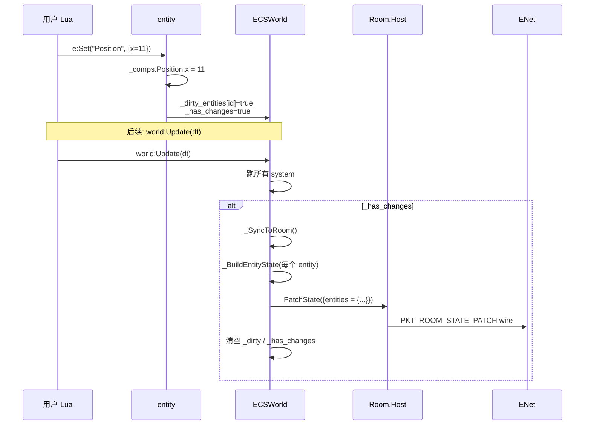
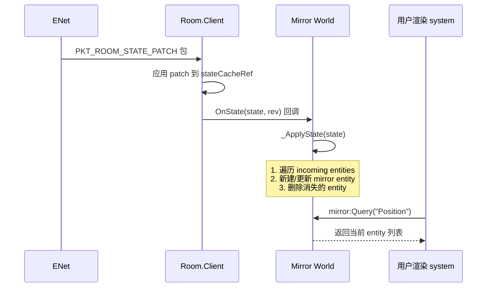

# DESIGN — Phase C ECS 网络化

> **6A 工作流 · Stage 2 (Architect)**
> 系统架构 → 模块设计 → 接口规范. 输入是 `CONSENSUS_PhaseC.md`, 输出是本文档.

---

## 1. 整体架构图

```mermaid
flowchart TB
    subgraph SERVER["Server 进程"]
        WS["ECSWorld (server)<br/>世界对象"]
        E1["entity 1"]
        E2["entity 2"]
        DH["_dirty hook<br/>(networked 标记驱动)"]
        ST["_BuildState():<br/>state.entities"]
        RH["Room.Host"]
        WS --> E1 & E2
        E1 -->|Add/Set| DH
        E2 -->|Destroy| DH
        DH -->|_has_changes=true| ST
        ST -->|PatchState{entities=...}| RH
    end

    subgraph WIRE["Wire (PKT_ROOM_STATE_PATCH)"]
        WP["{rev, set:{entities:{1:..,2:..}}, delete:[]}"]
    end

    RH -->|"channel 0 reliable<br/>(Phase BC v2)"| WP

    subgraph CLIENT["Client 进程"]
        RC["Room.Client"]
        OS["OnState(state, rev) 回调"]
        MR["Mirror ECSWorld<br/>(client)"]
        ME1["mirror entity 1"]
        ME2["mirror entity 2"]
        UR["用户渲染 system<br/>(纯 Query, 无网络)"]
        RC -->|state 表| OS
        OS -->|reconcile| MR
        MR --> ME1 & ME2
        UR -->|Query Position| MR
    end

    WP -->|ENet| RC
```

---

## 2. 分层设计

```
┌────────────────────────────────────────────────────────┐
│            用户 Lua (game logic / render)               │
│   server: world:Update, e:Set("Pos", {x=10})           │
│   client: mirror:Query("Pos"), 渲染                     │
└────────────────────┬───────────────────────────────────┘
                     │ Lua API
┌────────────────────▼───────────────────────────────────┐
│               Light.ECS (本 Phase 扩展)                 │
│   - ECSWorld (existing) + dirty hook + NetworkSync     │
│   - MirrorWorld (NEW) — client 专用, 由 OnState 驱动    │
└────────────────────┬───────────────────────────────────┘
                     │ Lua state table
┌────────────────────▼───────────────────────────────────┐
│           Light.Network.Room (Phase BC, 不改)           │
│   - PatchState (v2)  → server 序列化 → 广播             │
│   - OnState          → client 反序列化 → 触发回调       │
└────────────────────┬───────────────────────────────────┘
                     │ JSON wire (cJSON)
┌────────────────────▼───────────────────────────────────┐
│         PlatformNet ENet (Phase BC, 不改)              │
│   PKT_ROOM_STATE_PATCH 包, channel 0 reliable          │
└────────────────────────────────────────────────────────┘
```

**核心原则**:
- Phase C 不改 Phase BC 任何代码 (零侵入)
- 所有变更都在 `light_ecs.cpp` 内嵌 Lua 脚本中 (零新增 C++ 文件)
- ECS 模块对 Network 模块的依赖通过 **Lua duck typing** (传入的 room 对象只要有 `:PatchState` 方法即可, 测试用 mock)

---

## 3. 核心组件

### 3.1 ECSWorld 扩展 (server 视角)

新增字段:

```lua
world._networked_comps   = {}      -- {[name] = true}, 标记哪些 component 网络化
world._dirty_entities    = {}      -- {[id] = true}, 待同步的 entity ID
world._destroyed_ids     = {}      -- {[id] = true}, 待广播的销毁 ID
world._sync_room         = nil     -- NetworkSync 绑定的 Room.Host
world._has_changes       = false   -- 总开关
```

新增/扩展方法:

```lua
function ECSWorld:RegisterComponent(name, defaults, opts)
    -- opts = {networked = true|false}, 默认 false
    self._components[name] = defaults or {}
    if opts and opts.networked then
        self._networked_comps[name] = true
    end
end

function ECSWorld:NetworkSync(room)
    -- 绑定 Room.Host. 调用后 entity 的 networked component 修改自动 dirty.
    -- 解绑: NetworkSync(nil)
    self._sync_room = room
end

function ECSWorld:Update(dt)
    -- 现有 system 调度 (不变)
    for _, sys in ipairs(self._systems) do
        local entities = self:Query(table.unpack(sys.required))
        sys.func(entities, dt)
    end
    -- 末尾自动同步 (Q4 推迟决策, MVP 跟 Update)
    if self._sync_room and self._has_changes then
        self:_SyncToRoom()
    end
end

function ECSWorld:_SyncToRoom()
    -- 私有: 把当前 networked entity 全量打包通过 PatchState 广播
    -- MVP 简化: 全量 entities 表整个 set (不区分 dirty)
    local entitiesTable = {}
    for _, e in ipairs(self._entities) do
        local row = self:_BuildEntityState(e)
        if row and next(row) then          -- 有任何 networked component 才上 wire
            entitiesTable[tostring(e._id)] = row
        end
    end
    self._sync_room:PatchState({entities = entitiesTable})
    self._dirty_entities = {}
    self._destroyed_ids = {}
    self._has_changes = false
end

function ECSWorld:_BuildEntityState(entity)
    -- 私有: 把单个 entity 的 networked component 打成 wire 表
    local row = {}
    for compName, _ in pairs(self._networked_comps) do
        local comp = entity._comps[compName]
        if comp then
            -- 浅拷贝 (避免后续 mutate 影响序列化)
            local copy = {}
            for k, v in pairs(comp) do copy[k] = v end
            row[compName] = copy
        end
    end
    return row
end
```

### 3.2 Entity hook (server 视角)

`CreateEntity` 内部的 `Add/Remove` 方法扩展:

```lua
function e:Add(compName, data)
    local world = self._world
    local defaults = world._components[compName]
    local comp = defaults and deepcopy(defaults) or {}
    if data then
        for k, v in pairs(data) do comp[k] = v end
    end
    self._comps[compName] = comp
    self[compName] = comp

    -- NEW: 若 networked, 标记 dirty
    if world._networked_comps[compName] then
        world._dirty_entities[self._id] = true
        world._has_changes = true
    end
    return self
end

function e:Remove(compName)
    -- NEW: 同上
    if self._world._networked_comps[compName] then
        self._world._dirty_entities[self._id] = true
        self._world._has_changes = true
    end
    self._comps[compName] = nil
    self[compName] = nil
    return self
end

function e:Set(compName, data)
    -- NEW: 显式语义清晰的"修改 component"接口
    -- 等价于 Add 但要求 component 已存在 (强制约束, 减少错误)
    if not self._comps[compName] then
        error("Set: component '"..compName.."' not added on entity "..self._id)
    end
    for k, v in pairs(data) do
        self._comps[compName][k] = v
    end
    if self._world._networked_comps[compName] then
        self._world._dirty_entities[self._id] = true
        self._world._has_changes = true
    end
    return self
end
```

`DestroyEntity` 扩展:

```lua
function ECSWorld:DestroyEntity(entity)
    for i, e in ipairs(self._entities) do
        if e._id == entity._id then
            -- NEW: 标记 destroyed
            self._destroyed_ids[entity._id] = true
            self._has_changes = true
            table.remove(self._entities, i)
            return
        end
    end
end
```

### 3.3 MirrorWorld (client 视角)

新增 module-level 函数 `Light.ECS.MirrorFromRoom(room)`:

```lua
function ECSModule.MirrorFromRoom(room)
    local mirror = ECSWorld.new()       -- 复用现有构造
    mirror._is_mirror = true
    mirror._mirror_by_id = {}            -- {[id] = entity}, O(1) 查找
    mirror._source_room = room

    room:OnState(function(state, rev)
        mirror:_ApplyState(state)
    end)

    return mirror
end

function ECSWorld:_ApplyState(state)
    if not self._is_mirror then
        error("_ApplyState only valid on mirror world")
    end

    local incoming = state and state.entities or {}
    local seen = {}

    -- 1. 新增 / 更新
    for keyStr, row in pairs(incoming) do
        local id = tonumber(keyStr) or keyStr     -- JSON key 是 string
        seen[id] = true

        local e = self._mirror_by_id[id]
        if not e then
            -- 新建 (用 server 提供的 ID, 不走 _nextId)
            e = self:_CreateMirrorEntity(id)
            self._mirror_by_id[id] = e
        end

        -- 同步 component
        for compName, compData in pairs(row) do
            if e._comps[compName] then
                -- 已有: 浅覆盖 (保持 table 引用稳定, 用户可缓存 entity.Position)
                local target = e._comps[compName]
                for k, v in pairs(compData) do target[k] = v end
                -- 删除 incoming 没有但本地有的字段
                for k, _ in pairs(target) do
                    if compData[k] == nil then target[k] = nil end
                end
            else
                -- 新增 component (浅拷贝)
                local copy = {}
                for k, v in pairs(compData) do copy[k] = v end
                e._comps[compName] = copy
                e[compName] = copy
            end
        end

        -- 删除本地有但 incoming 没有的 component
        for compName, _ in pairs(e._comps) do
            if not row[compName] then
                e._comps[compName] = nil
                e[compName] = nil
            end
        end
    end

    -- 2. 销毁: 本地有但 incoming 没有的 entity
    local to_remove = {}
    for id, _ in pairs(self._mirror_by_id) do
        if not seen[id] then
            table.insert(to_remove, id)
        end
    end
    for _, id in ipairs(to_remove) do
        local e = self._mirror_by_id[id]
        self._mirror_by_id[id] = nil
        for i, ent in ipairs(self._entities) do
            if ent._id == e._id then
                table.remove(self._entities, i)
                break
            end
        end
    end
end

function ECSWorld:_CreateMirrorEntity(id)
    -- 类似 CreateEntity 但 ID 由参数指定, 不走 _nextId
    local e = { _id = id, _comps = {} }
    -- ... 复用 CreateEntity 内部的方法定义 (Add/Remove/Get/Has) ...
    e._world = self
    table.insert(self._entities, e)
    return e
end
```

---

## 4. 接口契约 (Lua API 详细签名)

### 4.1 公开 API

| 函数 | 签名 | 行为 |
|------|------|------|
| `world:RegisterComponent(name, defaults, opts?)` | `(string, table?, {networked?:bool}?) -> nil` | 注册 component. opts.networked 决定是否参与同步. 默认 false (本地). |
| `world:NetworkSync(room)` | `(Room.Host?) -> nil` | 绑定/解绑 Room. 必须在 RegisterComponent 后调用. 传 nil 解绑. |
| `entity:Set(compName, data)` | `(string, table) -> entity` | 修改已存在 component. 若不存在抛错. networked → dirty. |
| `Light.ECS.MirrorFromRoom(room)` | `(Room.Client) -> mirror_world` | 创建 client mirror. 自动 hook OnState. |

### 4.2 行为规约

**R1**: `NetworkSync(room)` 调用前的所有 entity 修改 **不会** 被同步. 用户应先 `RegisterComponent` → `NetworkSync` → 再创建 entity.

**R2**: 非 networked component 的修改 **不触发** PatchState. 例: `RegisterComponent("Debug", {})` (默认非 networked), `e:Set("Debug", {x=1})` 不上行.

**R3**: `world:Update(dt)` 末尾若有 `_has_changes=true`, 自动 sync. 用户也可手动调 `world:_SyncToRoom()` (private 但允许测试 / 高频场景使用, 文档建议优先 `Update`).

**R4**: Mirror world 的 entity ID 与 server **完全一致**. 用户可用 ID 跨进程引用 (例 RPC 中传 entity_id).

**R5**: Mirror world 的 entity table 引用稳定. `local pos = e.Position; -- 多帧后 pos 仍是同一 table` 成立 (浅覆盖语义).

**R6**: 旧 API 完全向后兼容:
- `RegisterComponent(name, defaults)` 不传 opts 仍合法
- `e:Add / Remove / Get / Has` 签名不变
- 已有 demo (samples/) 不需修改

### 4.3 错误处理

| 场景 | 行为 |
|------|------|
| `Set` 一个未 Add 的 component | `error()` 抛 Lua 错误, 用户必须先 Add |
| `NetworkSync(room)` 但 room 没 PatchState 方法 | 第一次 `_SyncToRoom` 时 Lua 自然抛错 ("attempt to call method 'PatchState' (a nil value)"). MVP 不前置校验 |
| `MirrorFromRoom(room)` 但 room 没 OnState | 同上, 调用时抛错 |
| Component 数据含 function/userdata | `cJSON_PrintUnformatted` 跳过 (PushLuaAsCJson 行为). MVP 不警告. 用户责任. |
| Server 重连导致 ID 复用 | rejoin 时 server 把整个 state 重发 (PKT_ROOM_STATE 全量), client mirror reconcile 自然处理 — 旧 entity 被清, 新 entity 按新 ID 建立 |

---

## 5. 数据流向图

### 5.1 Server 端: entity 修改 → 广播



### 5.2 Client 端: 收到 patch → mirror reconcile



---

## 6. 异常 / 边界处理

### 6.1 OnState 重入

`OnState` 在 ENet poll 期间触发. 用户 system 若在 mirror reconcile 时直接修改 mirror world (例如 `mirror:DestroyEntity(e)` 在 OnState 内调), 会破坏 `_ApplyState` 的迭代.

**MVP 策略**: 文档警告"不要在 OnState 用户回调内修改 mirror world". client mirror world 不暴露 OnState 给用户 (用户用自己的 system 在 Update 阶段读 mirror 即可).

### 6.2 序列化失败

`PushLuaAsCJson` 遇 function/userdata 会插入 `null`. wire 上仍合法, client 反序列化拿到 nil. 用户 Set 一个含 function 的 component data 是错误用法, MVP 不强制校验, 文档建议用 `RegisterComponent` 的 defaults 约束 schema.

### 6.3 大 patch (> ENet 64KB)

> 100 entity × 5 component × 100 字节 ≈ 50KB, 接近 ENet 包上限. MVP 不分片.
ENet 内部对 reliable 包支持自动分片到多 fragment, 一般不会丢. 但如果用户加了大 string component (例 sprite 路径长), 可能超限.

**MVP 策略**: 文档说明"建议单 entity ≤ 1KB, 房间总 entity ≤ 100 个". 超出范围属"性能优化" 后续 phase.

### 6.4 Server 关闭 + Client 不知道

`Room.Client:OnEvent("disconnect")` 已在 Phase BC 实现. 用户 mirror world 不再收 OnState, 但已有的 mirror entity 仍在内存中. 这是正确行为 (用户决定是否清空 mirror, 例显示 "lost connection").

### 6.5 Component data 类型变更

例: server 把 `Position` 从 `{x, y}` 升级到 `{x, y, z}`. server 推送了 z 字段, client mirror 已有的 entity 应该获得 z. `_ApplyState` 的浅覆盖 + "删除 incoming 没有的字段" 逻辑保证了这点 — 旧字段被新字段替换, 多余字段被清.

---

## 7. 与现有架构的兼容性

### 7.1 不破坏 Phase BC

- Room API 完全不改. ECS 用 `room:PatchState({entities=...})` 这个已暴露的方法.
- PatchState 的子表整个替换语义在 MVP 下满足需要 (整个 entities 表替换 = 全量 entity sync).

### 7.2 不破坏现有 Light.ECS

- `RegisterComponent(name, defaults)` 不传第 3 参数仍 OK (opts 默认 nil → 非 networked).
- `entity:Add/Remove/Get/Has` 接口签名不变.
- 现有 samples 完全不需改.

### 7.3 与 Phase BC v2 PatchState 的交互

- v2 PatchState 顶层 set: `entities` 字段 → 子表整个替换. 完美匹配 MVP "全量 entities 重发" 语义.
- v2 PatchState delete: MVP 不用 (因为 entities 整个被 set 替换, 旧的自然清).
- v2 空 patch no-op: 若一帧没有 networked 修改, 不调 PatchState (`_has_changes` 为 false).

---

## 8. 待 Stage 3 (Atomize) 细化的内容

- [ ] 把上述设计拆成 atomic task (估每个 ≤ 2h)
- [ ] 每个 task 的输入契约 / 输出契约 / 验收标准
- [ ] 任务依赖图 (mermaid)
- [ ] commit 切片建议

---

## 9. 进入 Stage 3 (Atomize)

下一步: 创建 `TASK_PhaseC.md`, 拆 atomic task. 预估 4-6 个 task, 每个 1-3h.

候选拆分:
1. **C-T1**: `RegisterComponent` opts 扩展 + `_networked_comps` 数据结构 (1h)
2. **C-T2**: Entity Add/Remove/Set hook + dirty 跟踪 (1.5h)
3. **C-T3**: `NetworkSync` + `_SyncToRoom` + `_BuildEntityState` (2h)
4. **C-T4**: `MirrorFromRoom` + `_ApplyState` (3h)
5. **C-T5**: smoke 脚本 + CI 集成 (1.5h)
6. **C-T6** (可选): demo_ecs_sync 双进程 + README (3-4h)

总估 12-14h, 留 2-4h buffer = 16h 上限, 符合 ALIGNMENT 验收标准.
