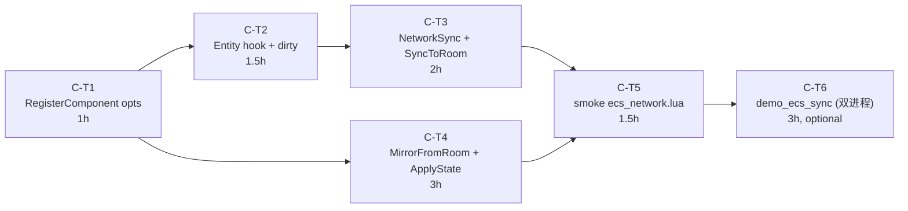

# TASK — Phase C ECS 网络化

> **6A 工作流 · Stage 3 (Atomize)**
> 架构 → 拆分原子任务 → 明确依赖. 输入是 `DESIGN_PhaseC.md`, 输出是本文档.

---

## 1. 拆分原则

- **粒度**: 每个 task ≤ 2h, 单 commit 可交付
- **可独立测试**: 每个 task 完成后能 `lightc -p` 通过 + smoke 验证当前层 API
- **依赖清晰**: 不形成循环依赖, 拓扑序唯一
- **可独立 rollback**: 一个 task 失败不影响前序 task

---

## 2. 任务依赖图



**关键路径**: T1 → T2 → T3 → T5 → T6 (12h)
**总估**: 12-14h, 留 2-4h buffer = 16h 上限符合 ALIGNMENT 约束.

---

## 3. 原子任务详细规约

---

### C-T1: RegisterComponent opts 扩展

**输入契约**:
- 前置依赖: 无
- 文件: `@/e:/jinyiNew/Light/ChocoLight/src/light_ecs.cpp` (内嵌 Lua 脚本)
- 现状: `RegisterComponent(name, defaults)` 仅 2 参数

**输出契约**:
- 函数签名变为 `RegisterComponent(name, defaults, opts?)`, opts 为 `{networked?:bool}` 或 nil
- 新增 `world._networked_comps = {}` 字段, 在 `ECSWorld.new()` 中初始化
- opts.networked == true 时, `world._networked_comps[name] = true`

**实现约束**:
- **向后兼容**: 不传 opts (旧用法) 仍合法, networked 默认 false
- 不修改 `_components[name]` 写入逻辑
- opts 类型校验: 若 opts 非 nil 且非 table, error

**验收标准** (单元测试或 smoke):
```lua
local w = Light(Light.ECS.World):New()
w:RegisterComponent("A", {x=0})                      -- 旧用法, OK
w:RegisterComponent("B", {y=0}, {networked=true})    -- 新用法, OK
w:RegisterComponent("C", {z=0}, {})                  -- 空 opts, networked=false
assert(w._networked_comps["A"] == nil)
assert(w._networked_comps["B"] == true)
assert(w._networked_comps["C"] == nil)
```

**估时**: 1h

**依赖**: 无

**后置任务**: C-T2, C-T4

---

### C-T2: Entity hook + dirty 跟踪

**输入契约**:
- 前置依赖: C-T1 完成 (`_networked_comps` 存在)
- 文件: `@/e:/jinyiNew/Light/ChocoLight/src/light_ecs.cpp`
- 现状: `e:Add / Remove`, `world:DestroyEntity` 不知道 networked

**输出契约**:
- `ECSWorld.new()` 新增字段:
  - `_dirty_entities = {}` (set: id → true)
  - `_destroyed_ids = {}` (set: id → true)
  - `_has_changes = false` (bool)
- `e:Add(name, data)` 末尾, 若 `world._networked_comps[name]`, 设 dirty + has_changes
- `e:Remove(name)` 同上
- 新增 `e:Set(name, data)` 方法 (修改已有 component, 错误时 抛错)
- `world:DestroyEntity(entity)` 设 `_destroyed_ids[id] = true` + has_changes

**实现约束**:
- `e:Set` 必须先校验 component 已存在
- 不引入新的 deepcopy (Set 用浅 merge 即可, 因为 component data 通常是 1 层 numbers)
- dirty 标记不应在 networked component 不存在时触发 (省一次 set 调用)

**验收标准**:
```lua
local w = Light(Light.ECS.World):New()
w:RegisterComponent("Pos", {x=0}, {networked=true})
w:RegisterComponent("Local", {n=0})    -- 非 networked
local e = w:CreateEntity()
e:Add("Pos", {x=10})
assert(w._has_changes == true)            -- networked 触发 dirty
assert(w._dirty_entities[e._id] == true)

w._has_changes = false
e:Add("Local", {n=1})
assert(w._has_changes == false)            -- 非 networked 不触发

e:Set("Pos", {x=20})
assert(w._has_changes == true)
assert(e.Pos.x == 20)

local ok, err = pcall(function() e:Set("Missing", {x=1}) end)
assert(not ok and err:match("not added"))

w._has_changes = false
w:DestroyEntity(e)
assert(w._has_changes == true)
assert(w._destroyed_ids[e._id] == true)
```

**估时**: 1.5h

**依赖**: C-T1

**后置任务**: C-T3

---

### C-T3: NetworkSync + _SyncToRoom + _BuildEntityState

**输入契约**:
- 前置依赖: C-T2 完成 (dirty 跟踪可用)
- 文件: `@/e:/jinyiNew/Light/ChocoLight/src/light_ecs.cpp`

**输出契约**:
- 新增 `world:NetworkSync(room)` 方法 — 设 `world._sync_room = room` (传 nil 解绑)
- 新增 `world:_SyncToRoom()` 私有方法
  - 遍历所有 entity, 调 `_BuildEntityState`
  - 调 `room:PatchState({entities = entitiesTable})`
  - 清空 `_dirty_entities` / `_destroyed_ids` / `_has_changes`
- 新增 `world:_BuildEntityState(entity)` 私有方法
  - 仅打包 networked component (查 `_networked_comps`)
  - 浅拷贝 component data
  - 返回 row 表 (空 row 时返回 nil 让调用方跳过)
- 修改 `world:Update(dt)`: 末尾若 `_sync_room ~= nil and _has_changes` 自动 `_SyncToRoom`

**实现约束**:
- **零 Phase BC 改动**: `room:PatchState` 是 Phase BC v2 已暴露 API, 直接调用
- entity ID 序列化为 string key (JSON 不支持 number key in object)
- 跳过没有任何 networked component 的 entity (省带宽)
- 即使 `_has_changes=true` 但 `_sync_room=nil` 也不应崩 (用户可能注册了 networked component 但没绑 room)

**验收标准**:
```lua
-- mock room
local mock_room = {
    last_patch = nil,
    PatchState = function(self, set, del)
        self.last_patch = {set = set, del = del}
    end,
}

local w = Light(Light.ECS.World):New()
w:RegisterComponent("Pos", {x=0}, {networked=true})
w:RegisterComponent("Debug", {})    -- 非 networked
w:NetworkSync(mock_room)

local e = w:CreateEntity()
e:Add("Pos", {x=5}):Add("Debug", {tag="hello"})

w:Update(0)
assert(mock_room.last_patch ~= nil)
assert(mock_room.last_patch.set.entities ~= nil)
local row = mock_room.last_patch.set.entities[tostring(e._id)]
assert(row.Pos.x == 5)
assert(row.Debug == nil)              -- Debug 非 networked, 不上 wire
assert(w._has_changes == false)       -- sync 后清

-- 解绑
w:NetworkSync(nil)
mock_room.last_patch = nil
e:Set("Pos", {x=99})
w:Update(0)
assert(mock_room.last_patch == nil)   -- 解绑后不发
```

**估时**: 2h

**依赖**: C-T2

**后置任务**: C-T5

---

### C-T4: MirrorFromRoom + _ApplyState

**输入契约**:
- 前置依赖: C-T1 完成 (RegisterComponent 签名稳定)
- 注意: **不依赖 C-T2/C-T3** (mirror 不发出 wire, 只接收), 但因 entity 内部方法在 C-T2 修改, 实际并行开发应基于 C-T2 之后的 codebase
- 文件: `@/e:/jinyiNew/Light/ChocoLight/src/light_ecs.cpp`

**输出契约**:
- 新增 module-level `Light.ECS.MirrorFromRoom(room)` 函数
  - 创建 ECSWorld 实例 (复用 `ECSWorld.new()`)
  - 设 `mirror._is_mirror = true`, `mirror._mirror_by_id = {}`, `mirror._source_room = room`
  - 调 `room:OnState(function(state, rev) mirror:_ApplyState(state) end)`
  - 返回 mirror world
- 新增 `world:_ApplyState(state)` 私有方法
  - 遍历 `state.entities`, 新增/更新本地 entity (用 server ID, 不走 _nextId)
  - 浅覆盖现有 component table (保持引用稳定)
  - 删除 incoming 没有的 component / entity
- 新增 `world:_CreateMirrorEntity(id)` 私有方法
  - 类似 CreateEntity, 但 ID 由参数指定

**实现约束**:
- mirror entity 的 `Add/Remove/Get/Has` 方法仍可用 (复用 CreateEntity 内部定义)
- mirror entity 的 ID 不与 server ID 冲突 (`_nextId` 不递增, 直接用 server ID)
- `_ApplyState` 必须 idempotent (同一 state 重发 2 次结果相同)
- JSON object key 是 string, `tonumber(key)` 转换 (失败时回退用 string 作 ID)

**验收标准**:
```lua
-- mock room with OnState
local mock_room = {
    on_state_cb = nil,
    OnState = function(self, cb) self.on_state_cb = cb end,
}

local mirror = Light.ECS.MirrorFromRoom(mock_room)
assert(mirror._is_mirror == true)
assert(mock_room.on_state_cb ~= nil)

-- 模拟收到 state (server 创建 entity 1 with Pos)
mock_room.on_state_cb({
    entities = {
        ["1"] = { Pos = {x=10, y=20} },
        ["2"] = { Pos = {x=30, y=40}, Sprite = {img="hero"} },
    }
}, 1)

local e1 = mirror._mirror_by_id[1]
assert(e1 ~= nil)
assert(e1.Pos.x == 10)
assert(e1.Pos.y == 20)

local e2 = mirror._mirror_by_id[2]
assert(e2.Sprite.img == "hero")

-- query 接口正常工作
local result = mirror:Query("Pos")
assert(#result == 2)

-- 模拟 server 修改 entity 1
local pos1_ref = e1.Pos    -- 用户缓存引用
mock_room.on_state_cb({
    entities = {
        ["1"] = { Pos = {x=99, y=20} },
        -- entity 2 消失
    }
}, 2)

assert(e1.Pos.x == 99)            -- 浅覆盖
assert(pos1_ref == e1.Pos)         -- 引用稳定 (R5)
assert(mirror._mirror_by_id[2] == nil)    -- entity 2 被销毁
```

**估时**: 3h

**依赖**: C-T1 (实际 C-T2 之后并行)

**后置任务**: C-T5

---

### C-T5: smoke 脚本 + CI 集成

**输入契约**:
- 前置依赖: C-T3 + C-T4 完成
- 现有: `scripts/smoke/network_room.lua` (Phase BC), 类似模板
- 新建: `scripts/smoke/ecs_network.lua`

**输出契约**:
- `scripts/smoke/ecs_network.lua` 涵盖:
  - C-T1 验收: opts 参数行为
  - C-T2 验收: dirty 跟踪
  - C-T3 验收: NetworkSync + _SyncToRoom (mock room)
  - C-T4 验收: MirrorFromRoom + _ApplyState (mock room)
- CI workflow `.github/workflows/build-templates.yml` 自动 glob `scripts/smoke/*.lua`, 无需改 workflow

**实现约束**:
- 所有断言用 `assert(cond, msg)` 形式, 失败时 lightc / light.exe 抛错触发 CI 失败
- 使用与 `network_room.lua` 一致的 pass/fail helper 风格
- 不跑实际网络 (mock room)

**验收标准**:
- `lightc -p scripts/smoke/ecs_network.lua` 返回 0
- 6A Stage 5 实施时, CI 全平台 6/6 绿

**估时**: 1.5h

**依赖**: C-T3, C-T4

**后置任务**: C-T6 (可选)

---

### C-T6 (可选): demo_ecs_sync 双进程

**输入契约**:
- 前置依赖: C-T5 完成 (API 已稳定)
- 参考: `samples/demo_udp_echo/main.lua` (本会话刚交付的双模式 demo 模板)

**输出契约**:
- `samples/demo_ecs_sync/main.lua` — 单文件 + arg[1] 切换 server/client
- `samples/demo_ecs_sync/README.md` — 用法 + 预期输出
- 演示场景:
  - server 创建 5 个 entity, 每个有 Position + Sprite (networked)
  - server `Update` 中模拟 random walk (每帧 entity 移动)
  - server 5 秒后销毁 entity 1
  - client 连接后 mirror world 同步, 每秒打印 `mirror:Query("Position")` 结果

**实现约束**:
- 与 demo_udp_echo 同风格 (端口 P=9001)
- 不依赖 GUI (纯文本输出)
- 双进程必须可独立运行 (server 不依赖 client 启动)

**验收标准**:
- `lightc -p` 通过
- 用户手动跑双终端能看到 entity 同步序列 (smoke 不覆盖, 文档说明)

**估时**: 3h

**依赖**: C-T5

**后置任务**: 无

---

## 4. 实施顺序与切片建议

### 切片 A: 核心 server (C-T1 + C-T2 + C-T3 = 4.5h)
- 单 commit: `feat(phase-c): ECS networked component + dirty tracking + NetworkSync`
- 交付: server 端完整, 但无 smoke (只能 manual test 确认 mock room 行为)

### 切片 B: client mirror (C-T4 = 3h)
- 单 commit: `feat(phase-c): ECS MirrorFromRoom client world`

### 切片 C: 验证 (C-T5 = 1.5h)
- 单 commit: `test(phase-c): smoke for ECS networked + mirror`
- 此时 CI 应全过

### 切片 D: 可选 demo (C-T6 = 3h)
- 单 commit: `feat(phase-c): demo_ecs_sync end-to-end`

**总切片**: 3 必做 + 1 可选, 约 9h-12h. 6A Stage 4 (Approve) 通过后开始 Stage 5 实施.

---

## 5. 进入 Stage 4 (Approve)

下一步是 6A Stage 4 — 人工审查检查清单:

- [ ] **完整性**: 6 个 task 是否覆盖 CONSENSUS 中所有验收标准?
- [ ] **一致性**: 任务接口与 DESIGN 文档对齐?
- [ ] **可行性**: 每个 task 在估时内完成?
- [ ] **可控性**: 风险点 (如 Lua hook 副作用) 是否可控?
- [ ] **可测性**: 验收标准明确可执行?

用户审查通过后, 我进 Stage 5 (Automate) 按 task 顺序实施.
