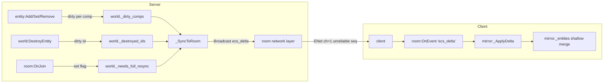
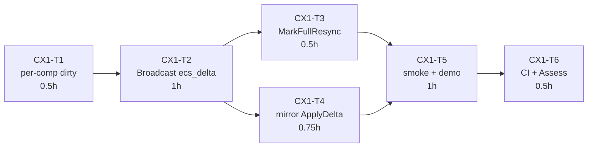

# PLAN — Phase C.x.1 per-component dirty 优化

> **6A 工作流 · Stage 2-3 合并 (Architect + Atomize)**
> 小型优化 (~3-4h), 合并设计 + 任务拆分. Stage 1 决策: Q1=A, Q2=A, Q3=D.

---

## 1. 固化决策 (Consensus)

| Q | 决策 | 影响 |
|---|------|------|
| Q1 | **A**: `_dirty_comps[id] = {[comp_name] = true}` per-entity comp set | server dirty 跟踪 component 粒度 |
| Q2 | **A**: `room:Broadcast('ecs_delta', {set, del})` event 通道 | 不动 PatchState; mirror 端 hook OnEvent |
| Q3 | **D**: OnJoin full-resync hook | 新 peer join 时 server 标记所有 entity dirty, 下帧全量重发 (走 delta 通道) |

---

## 2. 系统分层



---

## 3. Wire 格式

### 3.1 ecs_delta 事件

```json
{
  "set": {
    "1": {
      "Position": {"x": 10, "y": 20}
    },
    "5": {
      "Position": {"x": 50, "y": 60},
      "Velocity": {"vx": 1, "vy": 0}
    }
  },
  "del": ["3", "7"]
}
```

**语义**:
- `set[id][comp]` = 该 entity 该 component 的**完整**新状态 (浅 merge 到 mirror)
- `set` 中未列出的 component 表示"未变化", mirror 保留原值 (不删除)
- `del` = 销毁的 entity ID 列表
- `set` 和 `del` 均可省略 (nil). 二者都空 → 本帧无变化, 不应发送

### 3.2 与 Phase C v1 `_ApplyState` 语义差异

| 行为 | v1 (OnState 全量) | v1.1 (ecs_delta 增量) |
|------|------------------|----------------------|
| incoming entities 缺某 id | 销毁本地该 entity | **不**销毁 (只有 del 列表才销毁) |
| incoming entity 缺某 component | 删除本地该 component | **不**删除 (component 删除需显式 ~~ 留作 C.x.2~~) |
| 同 incoming component 的字段 | 浅 merge + 删除 incoming 没有的字段 | 浅 merge, **保留** mirror 已有字段 (因为 set 是 "完整 component" 语义) |

**重要**: Phase C.x.1 不处理 "某 component 被 Remove" 的语义. 原因:
- `entity:Remove(compName)` 目前在 Phase C v1 也只是把该 entity 整体标 dirty, 下次 sync 时该 entity row 不含此 component → mirror `_ApplyState` 删除
- 切换到 delta 后, mirror 看到 set 里该 entity 没提此 component, 不会知道是"未变化"还是"被 Remove"
- 解决方案: **遵循 Q3 + 扩展**: `entity:Remove` 触发 dirty 时, 额外记一个 `_removed_comps[id][comp] = true`, wire 里用特殊标记 (null / "__removed") 表示删除. 实现见 §6

### 3.3 组件删除 wire 扩展

```json
{
  "set": {
    "1": {
      "Position": {"x": 10},
      "Velocity": null         // null 表示该 component 从 entity 上删除
    }
  }
}
```

**Lua-cJSON 约定**: `cJSON null` ↔ Lua `nil`/`cjson.null`. 因 Lua table `{x = nil}` 等价于不存在, 我们用字符串常量 `"__removed__"` 作为显式删除标记, 更可靠.

**最终 wire**:

```json
{
  "set": {
    "1": {
      "Position": {"x": 10},
      "Velocity": "__removed__"
    }
  },
  "del": ["3"]
}
```

---

## 4. Server 端设计 (ECSWorld 扩展)

### 4.1 状态字段变更

```lua
-- 新增
w._dirty_comps       = {}      -- {[id] = {[comp_name] = true}}
w._removed_comps     = {}      -- {[id] = {[comp_name] = true}} (Remove 触发)
w._needs_full_resync = false   -- OnJoin 置 true, 下帧 _SyncToRoom 消费

-- 保留 (用于兼容性 / 调试)
w._dirty_entities    = {}      -- 仍更新, 但不再是同步源. 保留以防 TODO §2.1 后续方案
w._destroyed_ids     = {}      -- 继续使用
w._has_changes       = false   -- 保留
```

### 4.2 内部辅助函数

```lua
-- 标记 component dirty (新/改)
local function _markDirtyComp(world, id, compName)
    local set = world._dirty_comps[id]
    if not set then
        set = {}
        world._dirty_comps[id] = set
    end
    set[compName] = true
    world._dirty_entities[id] = true    -- 保留旧字段兼容
    world._has_changes = true
end

-- 标记 component 被 Remove
local function _markRemovedComp(world, id, compName)
    local set = world._removed_comps[id]
    if not set then
        set = {}
        world._removed_comps[id] = set
    end
    set[compName] = true
    -- 同时清 dirty (避免既 dirty 又 removed)
    local dirtySet = world._dirty_comps[id]
    if dirtySet then dirtySet[compName] = nil end
    world._has_changes = true
end
```

### 4.3 Entity hook 改造

```lua
function e:Add(compName, data)
    -- ... 原有逻辑 ...
    if world._networked_comps[compName] then
        _markDirtyComp(world, self._id, compName)
        -- 取消可能残留的 removed 标记 (e.g. Remove 后又 Add)
        local rmSet = world._removed_comps[self._id]
        if rmSet then rmSet[compName] = nil end
    end
    return self
end

function e:Set(compName, data)
    -- ... 原有逻辑 ...
    if world._networked_comps[compName] then
        _markDirtyComp(world, self._id, compName)
    end
    return self
end

function e:Remove(compName)
    -- Phase C.x.1: Remove 前记录 removed (在数据还在时)
    if self._world._networked_comps[compName] and self._comps[compName] then
        _markRemovedComp(self._world, self._id, compName)
    end
    self._comps[compName] = nil
    self[compName] = nil
    return self
end
```

### 4.4 `_SyncToRoom` 核心重写

```lua
function ECSWorld:_SyncToRoom()
    -- 若需要 full resync (OnJoin 触发), 把所有 networked component 标 dirty
    if self._needs_full_resync then
        for _, e in ipairs(self._entities) do
            for compName, _ in pairs(self._networked_comps) do
                if e._comps[compName] then
                    _markDirtyComp(self, e._id, compName)
                end
            end
        end
        self._needs_full_resync = false
    end

    -- 1) 构造 set (新增/更新)
    local set_patch = nil
    for id, dirtySet in pairs(self._dirty_comps) do
        local entity = self:_FindById(id)
        if entity then
            local row = {}
            for compName, _ in pairs(dirtySet) do
                local comp = entity._comps[compName]
                if comp then
                    local copy = {}
                    for k, v in pairs(comp) do copy[k] = v end
                    row[compName] = copy
                end
            end
            -- 额外: removed component 在 row 里用 "__removed__" 标记
            local rmSet = self._removed_comps[id]
            if rmSet then
                for compName, _ in pairs(rmSet) do
                    row[compName] = "__removed__"
                end
            end
            if next(row) then
                set_patch = set_patch or {}
                set_patch[tostring(id)] = row
            end
        end
    end

    -- 2) 处理 _removed_comps 中那些 id 没进 dirty 的情况
    --    (entity 本身没有其他 dirty, 仅有 component 被 Remove)
    for id, rmSet in pairs(self._removed_comps) do
        if not self._dirty_comps[id] then
            local row = {}
            for compName, _ in pairs(rmSet) do
                row[compName] = "__removed__"
            end
            if next(row) then
                set_patch = set_patch or {}
                set_patch[tostring(id)] = row
            end
        end
    end

    -- 3) 构造 del
    local del_patch = nil
    for id, _ in pairs(self._destroyed_ids) do
        del_patch = del_patch or {}
        table.insert(del_patch, tostring(id))
    end

    -- 4) 广播 (仅当有变化)
    if set_patch or del_patch then
        self._sync_room:Broadcast('ecs_delta', {
            set = set_patch,
            del = del_patch,
        })
    end

    -- 5) 清空跟踪
    self._dirty_comps = {}
    self._removed_comps = {}
    self._destroyed_ids = {}
    self._dirty_entities = {}
    self._has_changes = false
end

-- 辅助: 按 id 查找 entity (O(n) 实现, MVP 够用)
function ECSWorld:_FindById(id)
    for _, e in ipairs(self._entities) do
        if e._id == id then return e end
    end
    return nil
end
```

### 4.5 `NetworkSync` hook OnJoin

```lua
function ECSWorld:NetworkSync(room)
    -- 解绑旧 room 的 OnJoin (若之前 hook 过)
    -- ... (MVP 简化: 假设用户不重复调)

    self._sync_room = room
    if room and type(room.OnJoin) == 'function' then
        -- 新 peer join → 下一帧 _SyncToRoom 全量重发
        -- 注意: OnJoin callback 必须返回 true/false (accept/reject).
        -- 我们 chain 用户可能已注册的原始回调.
        local orig = room._user_on_join   -- 约定字段, MVP 简化
        room:OnJoin(function(pid, hello)
            self._needs_full_resync = true
            -- chain 原始回调
            if orig then return orig(pid, hello) end
            return true
        end)
    end
end
```

**简化决策**: Phase C.x.1 MVP 假设用户在调 `world:NetworkSync(room)` **之前** 或 **之后** 都不直接 hook `room:OnJoin` (即完全委托给 ECS). 若需要自定义 OnJoin, 用户调 `world:OnPeerJoin(cb)` 我们再转发. 但 MVP 不做这层封装.

**对 `@e:\jinyiNew\Light\samples\demo_ecs_network\main.lua` 的影响**:
- server 代码目前既有 `world:NetworkSync(room)` 又有 `room:OnJoin(...)`. 后调的 OnJoin 会覆盖前者的 hook, 导致 full-resync 失效.
- 解决: 调整顺序, 让 `world:NetworkSync(room)` **最后**调, 或 ECS 在 hook 时 chain 用户已设置的回调.
- 选 chain 方案: 在 NetworkSync 内部先读 `room._onJoinRef` 的用户回调 (需要 C++ 端暴露 getter, 代价大) — 放弃
- 最简: 文档明确 "用户 OnJoin 必须在 NetworkSync **之后**设置, 并手动调 `world:MarkFullResync()` 来协作"
- 或者: ECS 暴露 `world:MarkFullResync()` API, 让用户在自己的 OnJoin 回调里调用

**采用**: 暴露 `world:MarkFullResync()` public API, ECS 不主动 hook OnJoin. 用户在自己的 OnJoin 里调 `world:MarkFullResync()`. 更清晰, 不劫持用户回调.

### 4.6 公开 API 新增

```lua
-- 用户在 room:OnJoin 回调里调用, 标记下帧需要全量重发给所有 peer
function ECSWorld:MarkFullResync()
    self._needs_full_resync = true
    self._has_changes = true
end
```

---

## 5. Client 端设计 (MirrorFromRoom 改造)

### 5.1 hook 从 OnState 换到 OnEvent

```lua
local function MirrorFromRoom(room)
    local mirror = ECSWorld.new()
    mirror._is_mirror = true
    mirror._mirror_by_id = {}
    mirror._source_room = room

    if room and type(room.OnEvent) == 'function' then
        room:OnEvent(function(name, args)
            if name == 'ecs_delta' and type(args) == 'table' then
                mirror:_ApplyDelta(args)
            end
        end)
    end

    return mirror
end
```

**Breaking change** vs Phase C v1: 不再 hook OnState. 若用户混用 (e.g. server 又 SetState 又 Broadcast ecs_delta), mirror 忽略 state 变化. 文档要明确.

### 5.2 `_ApplyDelta` 实现

```lua
function ECSWorld:_ApplyDelta(delta)
    if not self._is_mirror then
        error("_ApplyDelta only valid on mirror world")
    end
    local set = delta.set or {}
    local del = delta.del or {}

    -- 1) 应用 set
    for keyStr, row in pairs(set) do
        local id = tonumber(keyStr) or keyStr
        local e = self._mirror_by_id[id]
        if not e then
            e = self:_CreateMirrorEntity(id)
            self._mirror_by_id[id] = e
        end

        for compName, compData in pairs(row) do
            if compData == "__removed__" then
                -- Remove component
                e._comps[compName] = nil
                e[compName] = nil
            else
                local target = e._comps[compName]
                if target then
                    -- 浅 merge 保持引用稳定
                    for k, v in pairs(compData) do target[k] = v end
                else
                    -- 新增 component (浅拷贝)
                    local copy = {}
                    for k, v in pairs(compData) do copy[k] = v end
                    e._comps[compName] = copy
                    e[compName] = copy
                end
            end
        end
    end

    -- 2) 应用 del
    for _, keyStr in ipairs(del) do
        local id = tonumber(keyStr) or keyStr
        local e = self._mirror_by_id[id]
        if e then
            self._mirror_by_id[id] = nil
            for i, ent in ipairs(self._entities) do
                if ent._id == e._id then
                    table.remove(self._entities, i)
                    break
                end
            end
        end
    end
end
```

---

## 6. 原子任务拆分

### CX1-T1: Server dirty 跟踪升级 (per-component)

**输入**: Phase C v1 `@e:\jinyiNew\Light\ChocoLight\src\light_ecs.cpp` 现有实现
**输出**:
- 新增 `_dirty_comps` / `_removed_comps` / `_needs_full_resync` 字段
- 新增 `_markDirtyComp` / `_markRemovedComp` 辅助
- 改造 `entity:Add/Set/Remove` hook, 调用新辅助而非旧 `_dirty_entities[id] = true`
- 保留旧字段以免破坏 smoke 剩余断言

**验收**:
- Add networked comp → `_dirty_comps[id][comp]` 为 true
- Remove networked comp → `_removed_comps[id][comp]` 为 true
- Set 已有 comp → `_dirty_comps[id][comp]` 为 true (覆盖)

**估时**: 0.5h

### CX1-T2: `_SyncToRoom` 改用 Broadcast('ecs_delta')

**输入**: CX1-T1 完成
**输出**:
- `_SyncToRoom` 重写为 §4.4 逻辑
- 不再调 `room:PatchState`
- 用 `room:Broadcast('ecs_delta', {set, del})`
- 消费 `_dirty_comps` / `_removed_comps` / `_destroyed_ids` / `_needs_full_resync`

**验收**:
- 空 dirty → 不调 Broadcast
- Set 一个 comp → Broadcast 1 个 entity 1 个 comp
- Remove comp → wire 中 `"__removed__"` 字符串
- DestroyEntity → `del` 列表含该 id
- 清空逻辑: sync 后所有 dirty 结构归零

**估时**: 1h

### CX1-T3: `world:MarkFullResync()` + 文档

**输入**: CX1-T2 完成
**输出**:
- 新增 public method `ECSWorld:MarkFullResync()`
- `_SyncToRoom` 开头消费 `_needs_full_resync` 标记, 把全 entity 所有 networked comp 标 dirty 一次
- 源码注释说明用户应在 `room:OnJoin` 里调用

**验收**:
- `world:MarkFullResync()` 后, 下次 Update → Broadcast 中 set 含所有当前 entity 的所有 networked comp
- 即使 entity 本身从未 dirty 过, 也会在 full resync 后出现

**估时**: 0.5h

### CX1-T4: Mirror 端 `_ApplyDelta` + hook OnEvent

**输入**: CX1-T3 完成
**输出**:
- `MirrorFromRoom` hook 从 `room:OnState` 换到 `room:OnEvent('ecs_delta', ...)`
- 新增 `_ApplyDelta` 方法 (§5.2)
- 保留 `_ApplyState` 不删除 (死代码, 留给可能的回退; 或在 T5 加注释说明已废弃)
- 浅 merge + component "__removed__" 特殊处理

**验收**:
- 推一个 delta `{set={"1":{"Pos":{x=10}}}}` → mirror 出现 entity 1 with Pos
- 推第二个 delta `{set={"1":{"Pos":{x=20}}}}` → mirror entity 1 Pos.x=20 (同 table 引用稳定)
- 推 `{set={"1":{"Pos":"__removed__"}}}` → mirror entity 1 不再 Has("Pos")
- 推 `{del=["1"]}` → mirror 没有 entity 1
- 推仅 set 某 comp, 其他 comp 不动 → mirror 保留其他 comp (与 v1 最大差异)

**估时**: 0.75h

### CX1-T5: smoke 扩展 + demo 更新

**输入**: CX1-T1..T4 完成
**输出**:
- `@e:\jinyiNew\Light\scripts\smoke\ecs_network.lua` 重写 C-T4 部分: mock room 新增 OnEvent, 推 ecs_delta 而非 OnState
- 新增 C-T3 断言: Set 单个 comp → Broadcast wire 中仅该 comp, 其他 comp 不出现
- 新增 CX1-T5 专项: MarkFullResync 后 Broadcast 含全量
- `@e:\jinyiNew\Light\samples\demo_ecs_network\main.lua` 的 server 端 `room:OnJoin` 里加 `world:MarkFullResync()`
- `@e:\jinyiNew\Light\samples\demo_ecs_network\README.md` 更新预期输出说明 (client 不再看"空 entities 初始 state")

**验收**:
- smoke 全过 (15+ pass, 0 fail)
- `lightc -p` demo 通过
- CI 6/6 绿

**估时**: 1h

### CX1-T6: CI + Assess

**输入**: CX1-T1..T5 完成
**输出**:
- commit + push
- 监控 CI 6/6 success
- 写 `ACCEPTANCE_PhaseCx1.md` / `FINAL_PhaseCx1.md` / `TODO_PhaseCx1.md`

**估时**: 0.5h (等 CI ~6min)

---

## 7. 任务依赖图



**关键路径**: T1 → T2 → T4 → T5 → T6 ≈ 3.75h (与 ALIGNMENT 3-4h 预期吻合)

---

## 8. 接受的破坏性变更 (给用户确认)

1. `MirrorFromRoom` 不再 hook `room:OnState`. 若用户依赖 server 同时调 SetState + ecs_delta, 后者不会被 mirror 处理.
2. smoke 中 `C-T4` 块需要完全重写 (原来测 OnState, 新测 OnEvent).
3. demo `samples/demo_ecs_network/main.lua` 需在 server `room:OnJoin` 里新增 `world:MarkFullResync()` 一行.

**Phase C v1 已完成的 acceptance 仍然有效**, 因为从用户侧看 API (`NetworkSync` / `MirrorFromRoom`) 表面没变. 只有直接观察 wire 的人能感知变化.

---

## 9. 进入 Stage 5 (Automate)

立即开始按 T1→T6 顺序实施. 每完成一步:
- 本地 `lightc -p` 自检
- 最后一起 push + CI 验证
- Stage 6 Assess 收尾

准备开始编码.
