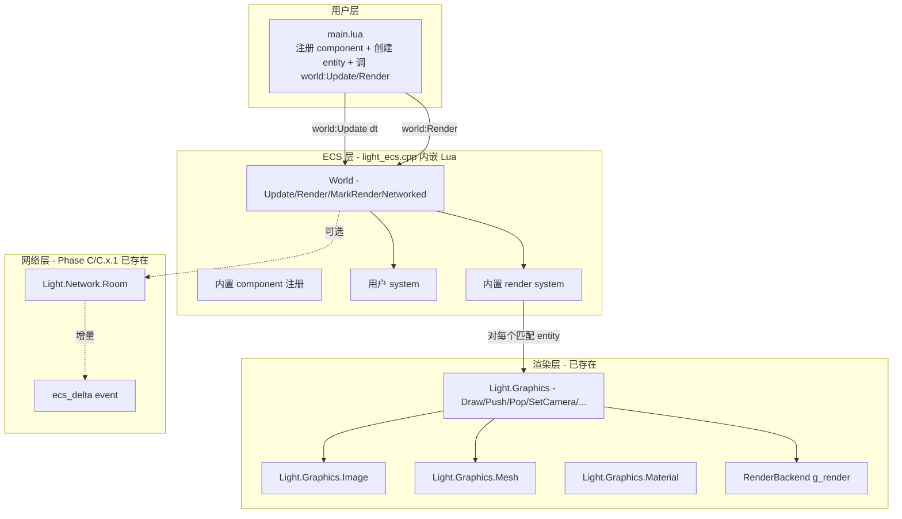
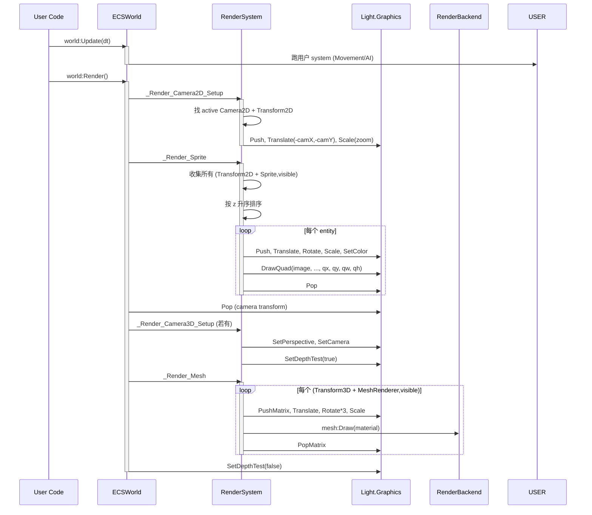
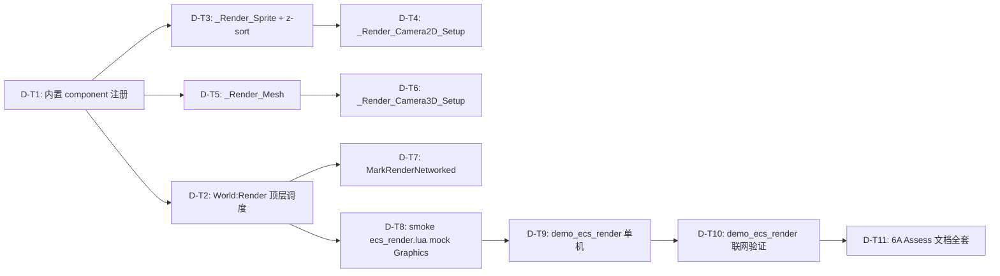

# PLAN — Phase D ECS 渲染系统 (DESIGN + TASK 合一)

> **6A 工作流 · Stage 2 Architect + Stage 3 Atomize 合并产出物**
> 等同 Phase C.x.1 PLAN_PhaseCx1.md 形态. 涵盖架构 / 接口 / 数据流 / 任务拆分 / 依赖.

---

## 1. 系统分层



---

## 2. 数据流: 一帧渲染



---

## 3. 核心 API 设计

### 3.1 内置 component 注册 (在 `luaopen_Light_ECS` 加载 g_ecsScript 后执行, Lua 侧自动调)

```lua
-- 内置注册函数 (g_ecsScript 内置)
local function _RegisterBuiltinRenderComponents()
    -- 已存在则跳过 (用户优先)
    local builtins = {
        {name='Transform2D',  schema={'x','y','z','rot','sx','sy','ox','oy'}},
        {name='Sprite',       schema={'image','color','visible','anchor','flipX','flipY','quad'}},
        {name='Camera2D',     schema={'active','zoom','viewportW','viewportH'}},
        {name='Transform3D',  schema={'x','y','z','rx','ry','rz','sx','sy','sz'}},
        {name='MeshRenderer', schema={'mesh','material','visible'}},
        {name='Camera3D',     schema={'active','fovY','aspect','nearZ','farZ',
                                       'targetX','targetY','targetZ','upX','upY','upZ'}},
    }
    for _, c in ipairs(builtins) do
        if not _registered_components[c.name] then
            Light.ECS.RegisterComponent(c.name, c.schema, {networked = false})
            _builtin_render_comps[c.name] = true  -- 记录是内置, MarkRenderNetworked 用
        end
    end
end
```

### 3.2 World:Render

```lua
function ECSWorld:Render()
    -- ============ 2D 阶段 ============
    local cam2d = self:_FindActiveCamera('Camera2D', 'Transform2D')
    if cam2d then
        local tf = cam2d:Get('Transform2D')
        local c  = cam2d:Get('Camera2D')
        local zoom = (c.zoom or 1.0)
        Light.Graphics.Push()
        -- 视图变换: 相机看向 (camX, camY), 应用 zoom
        Light.Graphics.Scale(zoom, zoom, 1)
        Light.Graphics.Translate(-(tf.x or 0), -(tf.y or 0), 0)
    end

    -- 收集 (Transform2D + Sprite,visible=true) 并按 z 升序
    local sprites = self:_CollectSprites()
    table.sort(sprites, function(a, b)
        return (a._z or 0) < (b._z or 0)
    end)
    for _, item in ipairs(sprites) do
        self:_DrawSprite(item.entity, item.tf, item.sprite)
    end

    if cam2d then Light.Graphics.Pop() end

    -- ============ 3D 阶段 ============
    local cam3d = self:_FindActiveCamera('Camera3D', 'Transform3D')
    if cam3d then
        local tf = cam3d:Get('Transform3D')
        local c  = cam3d:Get('Camera3D')
        Light.Graphics.SetPerspective(c.fovY or 60, c.aspect or 1.333, c.nearZ or 0.1, c.farZ or 1000)
        Light.Graphics.SetCamera(
            tf.x or 0, tf.y or 0, tf.z or 0,
            c.targetX or 0, c.targetY or 0, c.targetZ or 0,
            c.upX or 0, c.upY or 1, c.upZ or 0)
        Light.Graphics.SetDepthTest(true)

        for _, e in ipairs(self._entities) do
            if e:Has('Transform3D') and e:Has('MeshRenderer') then
                local mr = e:Get('MeshRenderer')
                if mr.visible ~= false and mr.mesh then
                    self:_DrawMesh(e, e:Get('Transform3D'), mr)
                end
            end
        end

        Light.Graphics.SetDepthTest(false)
    end
end
```

### 3.3 内部辅助方法

```lua
function ECSWorld:_FindActiveCamera(camComp, tfComp)
    for _, e in ipairs(self._entities) do
        if e:Has(camComp) and e:Has(tfComp) then
            local c = e:Get(camComp)
            if c.active then return e end
        end
    end
    return nil
end

function ECSWorld:_CollectSprites()
    local list = {}
    for _, e in ipairs(self._entities) do
        if e:Has('Transform2D') and e:Has('Sprite') then
            local s = e:Get('Sprite')
            if s.visible ~= false and s.image then
                local tf = e:Get('Transform2D')
                table.insert(list, {entity=e, tf=tf, sprite=s, _z=tf.z or 0})
            end
        end
    end
    return list
end

function ECSWorld:_DrawSprite(ent, tf, s)
    Light.Graphics.Push()
    Light.Graphics.Translate(tf.x or 0, tf.y or 0, 0)
    if (tf.rot or 0) ~= 0 then Light.Graphics.Rotate(tf.rot, 0, 0, 1) end
    if (tf.sx or 1) ~= 1 or (tf.sy or 1) ~= 1 then
        Light.Graphics.Scale(tf.sx or 1, tf.sy or 1, 1)
    end
    local c = s.color or {r=1,g=1,b=1,a=1}
    Light.Graphics.SetColor(c.r or 1, c.g or 1, c.b or 1, c.a or 1)

    -- anchor 计算 + flip 应用
    local img = s.image
    local iw = img.GetWidth and img:GetWidth() or 64
    local ih = img.GetHeight and img:GetHeight() or 64
    local ax = (s.anchor and s.anchor.ax) or 0
    local ay = (s.anchor and s.anchor.ay) or 0
    local drawX = -ax * iw
    local drawY = -ay * ih
    if s.flipX then Light.Graphics.Scale(-1, 1, 1); drawX = -drawX - iw end
    if s.flipY then Light.Graphics.Scale(1, -1, 1); drawY = -drawY - ih end

    -- quad 裁切支持
    local q = s.quad
    if q and (q.qw and q.qw > 0) then
        Light.Graphics.DrawQuad(img, drawX, drawY, 0, q.qx or 0, q.qy or 0, q.qw, q.qh or q.qw)
    else
        Light.Graphics.Draw(img, drawX, drawY, 0)
    end
    Light.Graphics.Pop()
end

function ECSWorld:_DrawMesh(ent, tf, mr)
    Light.Graphics.Push()
    Light.Graphics.Translate(tf.x or 0, tf.y or 0, tf.z or 0)
    if (tf.rx or 0) ~= 0 then Light.Graphics.Rotate(tf.rx, 1, 0, 0) end
    if (tf.ry or 0) ~= 0 then Light.Graphics.Rotate(tf.ry, 0, 1, 0) end
    if (tf.rz or 0) ~= 0 then Light.Graphics.Rotate(tf.rz, 0, 0, 1) end
    if (tf.sx or 1) ~= 1 or (tf.sy or 1) ~= 1 or (tf.sz or 1) ~= 1 then
        Light.Graphics.Scale(tf.sx or 1, tf.sy or 1, tf.sz or 1)
    end
    if mr.material then
        mr.mesh:Draw(mr.material)
    else
        mr.mesh:Draw(0)
    end
    Light.Graphics.Pop()
end
```

### 3.4 World:MarkRenderNetworked

```lua
function ECSWorld:MarkRenderNetworked()
    -- 把所有内置渲染 component 重新注册为 networked
    -- 必须在 NetworkSync(room) 之前调
    for name, _ in pairs(_builtin_render_comps) do
        local existing = _registered_components[name]
        if existing then
            Light.ECS.RegisterComponent(name, existing.schema, {networked = true})
        end
    end
end
```

---

## 4. 接口契约

### 4.1 World 新增 API

| 函数 | 签名 | 行为 |
|------|------|------|
| `world:Render()` | nil → nil | 跑内置 4 个 render system, 按顺序: 2D camera setup → sprite 排序 + draw → 3D camera setup → mesh draw |
| `world:MarkRenderNetworked()` | nil → nil | 重新注册 6 个内置渲染 component 为 networked=true. 用户应在 NetworkSync 前调 |

### 4.2 内置 component schema 字段类型

| Component | 字段 | 类型 | 默认 |
|-----------|------|------|------|
| Transform2D | x, y | number | 0 |
| | z | number | 0 (画家算法 sort key) |
| | rot | number | 0 (度) |
| | sx, sy | number | 1 |
| | ox, oy | number | 0 (变换原点) |
| Sprite | image | Image userdata | nil (无 image 跳过绘制) |
| | color | {r,g,b,a} | {1,1,1,1} |
| | visible | bool | true |
| | anchor | {ax,ay} | {0,0} (左上角) |
| | flipX, flipY | bool | false |
| | quad | {qx,qy,qw,qh} | nil (画整图) |
| Camera2D | active | bool | true |
| | zoom | number | 1.0 |
| | viewportW, viewportH | number | (reserved, 当前忽略) |
| Transform3D | x, y, z | number | 0 |
| | rx, ry, rz | number | 0 (度) |
| | sx, sy, sz | number | 1 |
| MeshRenderer | mesh | Mesh userdata | nil |
| | material | Material userdata | nil |
| | visible | bool | true |
| Camera3D | active | bool | true |
| | fovY | number | 60 |
| | aspect | number | 1.333 |
| | nearZ | number | 0.1 |
| | farZ | number | 1000 |
| | targetX, targetY, targetZ | number | 0 |
| | upX, upY, upZ | number | 0, 1, 0 |

### 4.3 异常处理策略

| 场景 | 行为 | 原因 |
|------|------|------|
| `Light.Graphics` 模块未加载 (server-only 进程) | `world:Render()` 跳过所有 graphics 调用 + 警告一次 | server-side simulation 不需要渲染 |
| Sprite.image == nil | 跳过该 entity 绘制, 不报错 | 用户可能延迟加载 image |
| Sprite 含 image 但 image userdata 已 __gc | `Light.Graphics.Draw` 内部判 texId=0 静默不画 | 资源生命周期 |
| 无 active Camera2D | 跳过 2D camera setup, 但仍画 sprite (按默认视图) | 允许用户不写 camera |
| 无 active Camera3D | 跳过 3D 阶段所有内容 | 3D 必须有相机 |
| Transform2D.rot 含 NaN | `Rotate(NaN)` 由 backend 静默处理 (旋转矩阵单位化) | 防御性 |
| MeshRenderer.mesh.meshId == 0 (已 Delete) | `mesh:Draw` 内部判 0 不画 | 资源生命周期 |

---

## 5. 任务拆分 (Atomize)

### 5.1 任务依赖图



### 5.2 原子任务清单

#### D-T1: 内置 component 注册

**输入契约**: 现有 `Light.ECS.RegisterComponent` API 工作正常 (Phase C/C.x.1).
**输出契约**: `_registered_components` 包含 6 个内置 entry; `_builtin_render_comps` 集合可枚举.
**实现位置**: `@e:\jinyiNew\Light\ChocoLight\src\light_ecs.cpp` 内嵌 Lua 末尾, `luaopen_Light_ECS` 返回前调一次内部 `_RegisterBuiltinRenderComponents()`.
**验收**:
- `Light.ECS.GetComponent('Transform2D')` 返回 schema 列表
- 用户已注册同名时, 内置注册跳过, 不抛错
**估时**: 1h

---

#### D-T2: World:Render 顶层调度

**输入契约**: D-T1 完成; `world._entities` 列表可访问.
**输出契约**: `world:Render()` 不抛错运行, 按顺序调用 2D camera → sprite → 3D camera → mesh 4 个阶段.
**实现**: `ECSWorld:Render` 方法; 含 `_FindActiveCamera`, `_CollectSprites` 辅助.
**验收**:
- 空 world (无任何 entity) 时 `world:Render()` 不抛错
- 只有 sprite 没有 camera 时仍能绘制 (默认视图)
**估时**: 0.5h

---

#### D-T3: _Render_Sprite + z-sort

**输入契约**: D-T1 完成.
**输出契约**: `_DrawSprite(ent, tf, s)` 对每个 entity 调 `Light.Graphics.Push/Translate/Rotate/Scale/SetColor/Draw|DrawQuad/Pop`. 排序按 `Transform2D.z` 升序.
**实现**: `_CollectSprites` + `table.sort` + `_DrawSprite`.
**关键点**:
- anchor 计算: drawX = -ax * imageWidth, drawY = -ay * imageHeight
- flipX/flipY: 调 Scale(-1, 1) / Scale(1, -1) 并补偿 translate
- quad 裁切: 有 `quad.qw > 0` 走 DrawQuad, 否则走 Draw
**验收**:
- 3 个 sprite z=1, z=3, z=2 时, draw 调用顺序是 z=1, z=2, z=3
- Sprite.visible=false 时不调 Draw
- anchor={0.5,0.5} 时 sprite 中心位于 Transform 坐标
**估时**: 1.5h

---

#### D-T4: _Render_Camera2D_Setup

**输入契约**: D-T1 完成.
**输出契约**: 找 `active=true` 的 Camera2D + Transform2D entity, 调 `Push → Scale(zoom) → Translate(-camX, -camY)`. 渲染完 sprite 后 `Pop`.
**实现**: 在 `World:Render` 中调用 `_FindActiveCamera('Camera2D', 'Transform2D')`.
**验收**:
- 相机在 (100, 200), zoom=2 时, 屏幕原点对应世界坐标 (100, 200), 1 世界单位 = 2 像素
**估时**: 0.5h

---

#### D-T5: _Render_Mesh

**输入契约**: D-T1 完成; `Light.Graphics.Mesh` userdata 可用.
**输出契约**: 对每个 (Transform3D + MeshRenderer.visible=true) entity, 调 `Push → Translate(x,y,z) → Rotate(rx,1,0,0)/Rotate(ry,0,1,0)/Rotate(rz,0,0,1) → Scale → mesh:Draw(material) → Pop`.
**验收**:
- 无 mesh.meshId 时跳过, 不抛错
- 有 material 时调 `mesh:Draw(material)`, 否则 `mesh:Draw(0)`
**估时**: 1h

---

#### D-T6: _Render_Camera3D_Setup

**输入契约**: D-T1 完成; `Light.Graphics.SetPerspective` / `SetCamera` / `SetDepthTest` 可用.
**输出契约**: 找 active Camera3D + Transform3D, 调 `SetPerspective(fovY, aspect, nearZ, farZ) → SetCamera(camPos, target, up) → SetDepthTest(true)`. Mesh 渲染完后 `SetDepthTest(false)`.
**验收**:
- 无 active Camera3D 时跳过整个 3D 阶段
**估时**: 0.5h

---

#### D-T7: MarkRenderNetworked

**输入契约**: D-T1 完成.
**输出契约**: `world:MarkRenderNetworked()` 把 `_builtin_render_comps` 中所有 component 重新注册为 `networked = true`.
**验收**:
- 调用后再 `world:NetworkSync(room) → world:Update(dt)` 时, 对 Transform2D/Sprite 等的修改会触发 `_dirty_comps` 标记
**估时**: 0.5h

---

#### D-T8: smoke ecs_render.lua (mock Graphics)

**输入契约**: D-T2~D-T7 完成.
**输出契约**: `@e:\jinyiNew\Light\scripts\smoke\ecs_render.lua` 含 30+ 断言, lightc -p 通过.
**mock 策略**: 局部替换 `Light.Graphics` 为表函数, 记录调用顺序到 `g_calls` 数组. 断言 g_calls 内容.
**测试用例**:
- D-AC1~D-AC8 全部 mock 验证
**估时**: 1.5h

---

#### D-T9: demo_ecs_render 单机

**输入契约**: D-T2~D-T7 完成.
**输出契约**: `@e:\jinyiNew\Light\samples\demo_ecs_render\main.lua` + `README.md`. 100 个 sprite 满屏跑动 + 用户键盘控制 hero.
**估时**: 1.5h

---

#### D-T10: demo_ecs_render 联网

**输入契约**: D-T9 完成; Phase C.x.1 网络层可用.
**输出契约**: demo 支持 `--server` / `--client` 双模式, server 移动 hero 同步到 client mirror world, client 调 `world:Render()` 显示.
**估时**: 1.5h

---

#### D-T11: 6A Assess 文档全套

**输出契约**: `ACCEPTANCE_PhaseD.md` + `FINAL_PhaseD.md` + `TODO_PhaseD.md`.
**估时**: 1h

---

## 6. 实施顺序 (建议)

```
切片 1 (1.5h): D-T1 (内置 component) + D-T2 (顶层 Render 调度)
切片 2 (2h):   D-T3 (Sprite system) + D-T4 (Camera2D)
              → 此时 2D 渲染端到端通, 可视化 hello world
切片 3 (1.5h): D-T5 (Mesh system) + D-T6 (Camera3D)
              → 3D 端到端通
切片 4 (0.5h): D-T7 (MarkRenderNetworked)
切片 5 (1.5h): D-T8 smoke
              → 此处 commit "feat(phase-d): ecs render core + smoke"
              → 等 CI 全绿
切片 6 (1.5h): D-T9 demo 单机
切片 7 (1.5h): D-T10 demo 联网
              → commit "feat(phase-d): demo_ecs_render + multiplayer"
切片 8 (1h):   D-T11 Assess 文档
              → commit "docs(phase-d): 6A Assess"
              → push, 收尾
```

**总计**: ~10.5h, 落在 8-12h 估算区间内.

---

## 7. 风险点与缓解

| 风险 | 概率 | 影响 | 缓解 |
|------|------|------|------|
| `Light.Graphics` 模块在 lightc -p 时不可访问 (没 g_render) | 中 | smoke 失败 | smoke 用全表 mock 替换 `Light.Graphics`, 不依赖真实模块 |
| MSVC raw string 拼接再次踩坑 | 低 | CI 失败 | 严格遵循 `)LUA" R"LUA(` 单行规则, 字节数预估 < 14KB 新增, 拼接拆点谨慎选 |
| 内置 component 与用户已注册同名冲突 | 低 | 用户语义错乱 | 内置注册前检查 `_registered_components[name]`, 已存在则跳过 + 警告 |
| `Light.Graphics.Image` API 与 demo 期望不符 (GetWidth 等) | 中 | demo 跑不通 | 实施前先 grep `light_graphics_image.cpp` 确认 Image userdata 方法签名 |
| z-sort 性能 (1000+ sprite 每帧 sort) | 低 | 大场景帧率掉 | Phase D.x.5 引入分层 / dirty list / 缓存排序 |

---

## 8. 文档版本

| 版本 | 日期 | 备注 |
|------|------|------|
| 1.0 | 2026-05-11 | Stage 2+3 合一 PLAN, 11 个原子任务, 8 个切片 |
