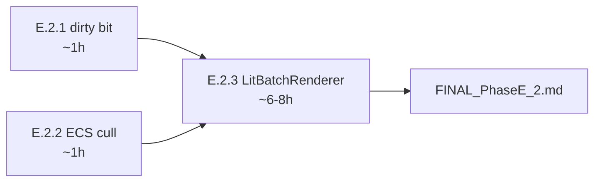

# ALIGNMENT — Phase E.2 · 2D Lit 渲染性能优化

> 6A 工作流 · 阶段 1 + 2 + 3 合并精炼
> 已沿用 Phase E.1 的"每任务一份 ACCEPTANCE + Phase 末 FINAL"的文档密度

---

## 1. 原始需求

> 用户："E.2.x"（选项 4：三项都做）

按 `FINAL_PhaseE_1.md` § 6 已知限制列出的三项 2D Lit 性能问题：

| 编号 | 问题 | 现状证据 |
|------|------|----------|
| A. dirty bit 缺失 | `GL33Backend::UploadLighting2D` 每次 lit draw 都全量 `glUniform*v ×8`，即使 `Lighting2D::State` 没变 | `@e:\jinyiNew\Light\ChocoLight\src\render_gl33.cpp:1394-1437` |
| B. 不入 batch | `Light.Graphics.DrawLit/DrawLitQuad` 主动 `BatchRenderer::Flush()` 后单独 `DrawLit2DQuad`，N 同纹理 lit sprite = N 个 draw call | `@e:\jinyiNew\Light\ChocoLight\src\light_graphics.cpp:765-855` |
| C. ECS cull 不联动 | `_UploadLights2D(cam2d)` 把所有 Light2D entity 都上传，不论是否在 viewport AABB 内 | `@e:\jinyiNew\Light\ChocoLight\src\light_ecs.cpp:881-985` |

---

## 2. 边界确认

### 2.1 范围内（IN）

- A → 任务 **E.2.1**：`Lighting2D::State::version` 单调递增 + GL33Backend 缓存 `lastUploadedVersion`
- C → 任务 **E.2.2**：ECS `_UploadLights2D(cam2d, bounds?)` 加 viewport AABB 参数，跳过不相交的 light
- B → 任务 **E.2.3**：新建 `LitBatchRenderer` + `RenderBackend::DrawLit2DBatch` 虚接口；`l_DrawLit*` 改走 batch 提交而非立即 draw

### 2.2 范围外（OUT）

| 不做 | 原因 |
|------|------|
| 加大 `MAX_LIGHTS` 上限超过 16 | shader uniform 数组硬上限；超过需改用 UBO/SSBO，工作量与本 Phase 不匹配 |
| 多 program 变体 | `programLit2D` 单 program 已能覆盖 normalMap on/off |
| HDR / 后处理 | 留给 Phase E.3 |
| 修复 `_DrawSkinnedMesh::Light.Animation` 同 `_G.Light.XXX` 陷阱 | 与本 phase 解耦，仅在 ECS Light2D 路径已修复 |
| 加真实 normalMap demo 资源 | demo 已可视化跑通，资源属内容，不阻塞 |
| LitBatchRenderer 与现有 BatchRenderer 合并 | 两者顶点格式不同（`RenderVertex` vs `RenderVertex2DLit`），合并会破坏现有 BatchRenderer 简洁性 |

---

## 3. 需求理解（对现有项目的关联）

### 3.1 现有架构关键点

| 文件 / 类 | 与本 Phase 关系 |
|-----------|-----------------|
| `Lighting2D::State` (`light_lighting2d.h:49`) | E.2.1 加 `uint32_t version`；mutator 末尾 `++version` |
| `RenderBackend::UploadLighting2D` (`render_backend.h`) | E.2.1 加 `lastUploadedVersion` 缓存；同 version 时跳过 |
| `BatchRenderer` (`batch_renderer.h/cpp`) | E.2.3 参考其 Init/Shutdown/BeginFrame/EndFrame/Flush/Submit* 模板，但**不复用代码**（顶点类型不同） |
| `light_graphics.cpp::l_DrawLit/l_DrawLitQuad` | E.2.3 改造点：从立即 `g_render->DrawLit2DQuad` 改为 `LitBatchRenderer::SubmitQuad` |
| `light_ecs.cpp::_UploadLights2D` (Lua) | E.2.2 加 `bounds` 参数；E.2.3 `Render()` 退出前调 `LitBatchRenderer::Flush` |

### 3.2 已建立的契约（不能破）

- `Lighting2D::State` 是单线程单例，POD，无析构（E.2.1 加 `version` 字段不破坏 POD 性质）
- `RenderBackend` 多后端：GL33 / Legacy / None（E.2.3 加 `DrawLit2DBatch` 必须在 Legacy/None 加 fallback 或 `SupportsLit2D() = false` 路径）
- Lua API 签名稳定：`Light.Graphics.DrawLit(image, normalMap, x, y, ...)` 行为对调用方透明
- ECS `World:Render()` 调度顺序：camera push → `_UploadLights2D` → Sprite z-sort → LitSprite z-sort → SpriteBatch → TextRenderer → camera pop（E.2.3 在 LitSprite 循环末加 `Flush`）
- smoke `lighting2d.lua` 28 段断言全 PASS（每个任务后必须保持 PASS）

---

## 4. 设计决策

### 4.1 E.2.1 — Dirty Version

```cpp
// light_lighting2d.h
struct State {
    bool     enabled      = true;
    Light    lights[16];
    int      active_count = 0;
    float    ambient[3]   = { 0, 0, 0 };
    uint32_t version      = 1;   // ★ 新增. 0 保留为 "永不匹配" 哨兵
};

// light_lighting2d.cpp 所有 mutator 末尾:
g_state.version++;

// render_gl33.cpp GL33Backend 私有字段:
uint32_t lastUploadedLighting2DVersion = 0;

// UploadLighting2D:
if (state->version == lastUploadedLighting2DVersion) {
    // 仍要 glUseProgram(programLit2D) (调用方可能切了 program), 但跳过所有 glUniform*v
    glUseProgram(programLit2D);
    return;
}
// ... 原有 SOA build + glUniform*v ...
lastUploadedLighting2DVersion = state->version;
```

**关键决策**：
- `version` 用 `uint32_t`（4B），溢出周期 ~497 天（假设每 ms 一次 update），可忽略
- `version = 0` 作为 backend `lastUploadedLighting2DVersion` 的初值哨兵 — 第一次 upload 时一定 mismatch（state version 默认 1）
- mutator 列表：`SetEnabled` / `SetAmbient` / `Add` / `Update` / `Remove` / `Clear`，共 6 个

### 4.2 E.2.2 — ECS Cull 联动

```lua
-- light_ecs.cpp::_UploadLights2D 改造:
function ECSWorld:_UploadLights2D(cam2d, bounds)
    ...
    for _, e in ipairs(self._entities) do
        local lt = e._comps.Light2D
        if lt and lt.enabled ~= false then
            local wx, wy = self:_GetWorldPos2D(e)
            local vx, vy = (wx - cx) * zoom, (wy - cy) * zoom
            local range  = (lt.range or 200) * zoom

            -- ★ NEW: 若有 bounds, 灯影响圆 (vx, vy, range) 与 bounds 不相交则跳过
            if bounds then
                local bl, br = bounds.minX, bounds.maxX
                local bt, bb = bounds.minY, bounds.maxY
                if vx + range < bl or vx - range > br or
                   vy + range < bt or vy - range > bb then
                    goto continue  -- skip, light 完全在视口外
                end
            end
            ...
        end
        ::continue::
    end
end

-- ECSWorld:Render() 调用处:
local bounds = self:_GetCameraBoundsView(cam2d)  -- view-space AABB
self:_UploadLights2D(cam2d, bounds)
```

**关键决策**：
- bounds 用 view space（与 light 转换后空间一致），节省转换
- AABB-Circle 测试用宽松（不开根号），保守正确（漏 cull 也比错 cull 安全）
- `bounds == nil` 时回退原有"上传全部"行为，向后兼容

### 4.3 E.2.3 — LitBatchRenderer

#### 接口设计（与 `BatchRenderer` 同风格，独立命名空间）

```cpp
// include/lit_batch_renderer.h
namespace LitBatchRenderer {

constexpr int MAX_QUADS_PER_BATCH    = 8192;   // RenderVertex2DLit 64B vs RenderVertex 32B, 减半
constexpr int MAX_VERTICES_PER_BATCH = MAX_QUADS_PER_BATCH * 4;
constexpr int MAX_INDICES_PER_BATCH  = MAX_QUADS_PER_BATCH * 6;

struct Stats { int drawCalls; int verticesSubmit; int batchesFull; int batchesState; };

bool Init(RenderBackend* backend);
void Shutdown();
bool IsInited();
void BeginFrame();
void EndFrame();

void SubmitQuad(const RenderVertex2DLit verts[4],
                uint32_t baseColorTex, uint32_t normalMapTex);
void Flush();
void NotifyStateChange();

const Stats& GetStats();
void ResetStats();

}
```

#### 状态切换条件（任一变化 → Flush）

- `baseColorTex` 变化
- `normalMapTex` 变化
- `Lighting2D::State::version` 变化（dirty 触发的隐式切换 — E.2.1 是 E.2.3 的前置依赖）

#### Backend 虚接口

```cpp
// render_backend.h 加:
virtual void DrawLit2DBatch(const RenderVertex2DLit* verts, int vertCount,
                             const uint32_t* indices, int idxCount,
                             uint32_t baseColorTex, uint32_t normalMapTex) {}
```

GL33Backend 实现：
- 重用 `programLit2D` / `vaoLit2D` / `vboLit2D` / `eboLit2D`
- 用动态 EBO 替代静态 `[0,1,2,0,2,3]`（因为 batch 内有多 quad）
- 单次 `UploadLighting2D(state)` + 单次 `glDrawElements(GL_TRIANGLES, idxCount, GL_UNSIGNED_INT, ...)`
- 由 dirty bit 保证不重复 upload lighting state

#### `l_DrawLit*` 改造

```cpp
// 旧:
if (BatchRenderer::IsInited()) BatchRenderer::Flush();
g_render->PushMatrix();
g_render->Translate(...);
ApplyTransform(...);
g_render->DrawLit2DQuad(verts, baseTex, normTex);
g_render->PopMatrix();

// 新:
if (BatchRenderer::IsInited()) BatchRenderer::Flush();  // 保留: 仍要先 flush 普通 sprite
// Push/Translate/ApplyTransform 不再调用; 改为在 CPU 端把 transform 烘入 verts
RenderVertex2DLit verts[4];
BakeTransformIntoVerts(verts, x, y, z, rx, ry, rz, sx, sy, sz, ox, oy, oz);
LitBatchRenderer::SubmitQuad(verts, baseTex, normTex);
```

**关键决策**：
- batch 内的 quad 不能再走 `Push/Translate/Pop` matrix stack（每个 quad 矩阵不同会破坏批） → CPU 端烘焙变换到顶点
- `RenderVertex2DLit.pos` 用 world space（既是 vertex space）； shader `vWorldPos = uModel * aPos`，`uModel = modelview` 在批渲染时是 identity 或 camera transform，由调用方在 `Push` 外预先设置
- **顺序问题**：`l_DrawLit` 与 `l_Draw` 混用时 — `l_Draw` 走 `BatchRenderer`，`l_DrawLit` 走 `LitBatchRenderer`，两个独立批；切换时 **必须** 互相 Flush，否则视觉顺序错乱

#### ECS Render() 整合点

```lua
-- World:Render() 2D 阶段末:
function ECSWorld:Render()
    ...
    for _, batch in ipairs(self:_CollectLitSprites()) do
        self:_DrawLitSprite(batch)  -- 内部走 gfx.DrawLit / DrawLitQuad → LitBatchRenderer::SubmitQuad
    end
    -- ★ NEW: 确保 batch 内残余 quad 刷出 (camera pop 之前)
    if Light.Graphics.FlushLitBatch then Light.Graphics.FlushLitBatch() end
    ...
end
```

新增 Lua API `Light.Graphics.FlushLitBatch()` (调 `LitBatchRenderer::Flush()`) 给 ECS 和高级用户用。

---

## 5. 任务拆分（阶段 3 — Atomize）



| 任务 | 输入契约 | 输出契约 | 验收 |
|------|---------|---------|------|
| **E.2.1** | `Lighting2D::State` 当前结构 + GL33Backend::UploadLighting2D 实现 | `version` 字段 + 6 处 mutator++ + GL33 缓存 `lastUploadedVersion` | smoke 加 § 16：多次 upload 同 state 跳过 / mutator 后版本递增 / `++version` 触发重传 |
| **E.2.2** | ECS `_UploadLights2D` 内嵌 Lua | 接 `bounds` 参数；AABB-Circle 不相交跳过；`bounds=nil` 向后兼容 | smoke 加 § 17：bounds 外 light 跳过 / bounds 内 light 上传 / bounds=nil 全上传 |
| **E.2.3** | E.2.1 + E.2.2 完成；`BatchRenderer` 模板 + `RenderBackend::DrawLit2DQuad` 当前实现 | `LitBatchRenderer` 模块 + `DrawLit2DBatch` 后端虚接口 + `l_DrawLit*` 改 submit + ECS Flush 整合 + Lua `Light.Graphics.FlushLitBatch` | smoke 加 § 18：同纹理 N quad 合 1 draw call / 纹理切换拆批 / dirty 触发 flush / 与普通 BatchRenderer 顺序正确 |

---

## 6. 验收标准（阶段 4 — Approve 检查清单）

| 标准 | E.2.1 | E.2.2 | E.2.3 |
|------|-------|-------|-------|
| 编译通过 (cmake Release) | ✓ | ✓ | ✓ |
| smoke `lighting2d.lua` 既有断言全 PASS | ✓ | ✓ | ✓ |
| smoke 新增段 PASS | § 16 dirty bit | § 17 cull | § 18 batch |
| 既有 smoke 不破 (`graphics.lua` / `ecs_render.lua`) | ✓ | ✓ | ✓ |
| CI 全 6 平台 ✓ | ✓ | ✓ | ✓ |
| ACCEPTANCE 文档 | ACCEPTANCE_PhaseE_2_1.md | ACCEPTANCE_PhaseE_2_2.md | ACCEPTANCE_PhaseE_2_3.md |

---

## 7. 疑问澄清

| 疑问 | 决策 | 依据 |
|------|------|------|
| `version` 是否要导出到 Lua？ | ❌ 不导出 | 调用方不需要感知；纯后端优化 |
| LitBatchRenderer 是否复用 `vaoLit2D` 等 GL handle？ | ✓ 复用 | 减少 GL state 切换，shader / VAO / EBO 配置不变，只是从单 quad 改为多 quad |
| 静态 EBO `[0,1,2,0,2,3]` 改动态会否破坏既有 `DrawLit2DQuad` 单 quad 路径？ | 保留单 quad 路径 + 加 batch 路径 | `DrawLit2DQuad`（4 顶点 + 静态 6 索引）和 `DrawLit2DBatch`（动态顶点 + 动态索引）共存，前者仅用于 backend 内部回退 / 测试 |
| 是否在 LitBatch 内 CPU 烘焙 transform？ | ✓ 是 | 否则 batch 内每 quad 矩阵不同；这是 batching 的必要前提 |
| `Light.Graphics.FlushLitBatch` 是否要公开给 Lua？ | ✓ 公开 | ECS Render() 需要，且高级用户混用 Lit/普通 sprite 时也需要 |
| 测试 batching 顺序在 headless 环境怎么做？ | mock RenderBackend 记录 draw call 序列 | smoke 已有 `ecs_render.lua` 的 mock 风格可参考 |

---

## 8. 风险与缓解

| 风险 | 缓解 |
|------|------|
| E.2.3 CPU 烘焙 transform 引入坐标 bug | 严格单元测试 + 用既有 E.1.7 demo 跑视觉对比 |
| LitBatchRenderer 与 BatchRenderer 互不感知导致顺序错乱 | `l_DrawLit*` 入口 Flush 普通 BatchRenderer；`l_Draw*` 入口 Flush LitBatchRenderer（双向同步） |
| Lighting2D mutator 调用频繁导致 version 频繁递增 | 16 灯场景每帧 mutator < 100 次，version uint32 永远不溢出 |
| MSVC raw literal 16KB 限制（light_ecs.cpp） | E.2.2 改动小 (~10 行) + 已在 E.1.6 段后；超限时再插 `)LUA" R"LUA(` 分隔符 |
