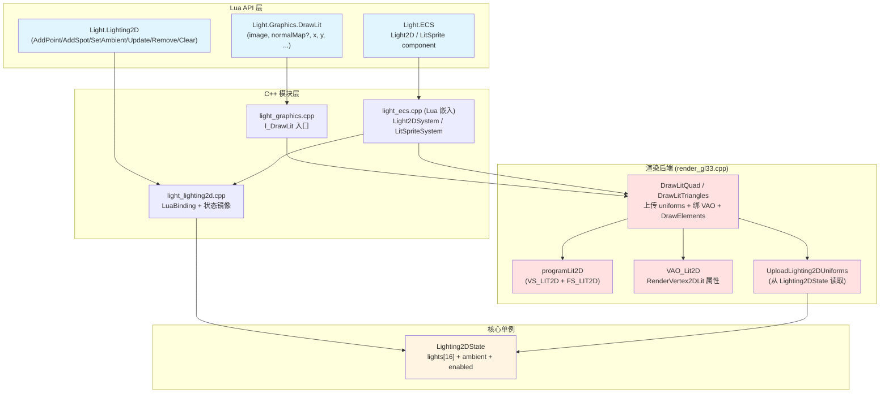
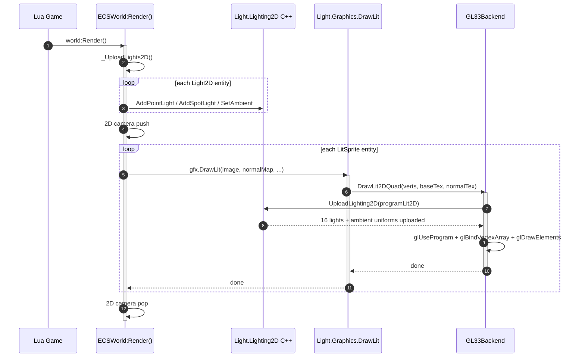
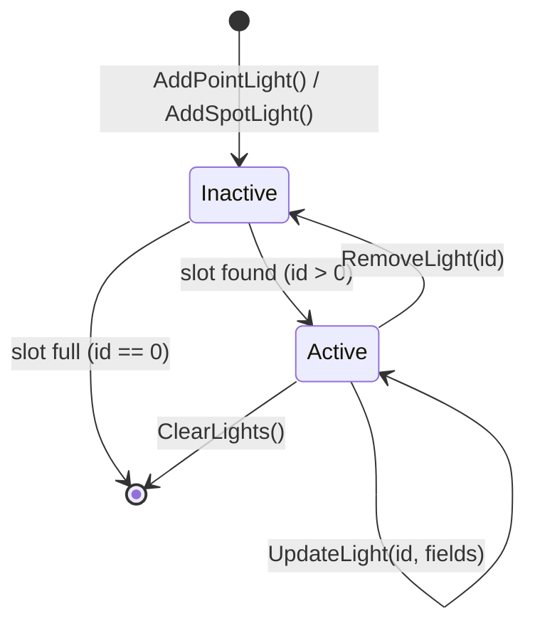

# DESIGN — Phase E.1 · 2D 灯光系统

> 6A 工作流 · 阶段 2 · 架构（Architect）
> 基于 `CONSENSUS_PhaseE.md` 的决策，详细设计 E.1 2D 灯光的系统架构与接口契约。

---

## 1. 整体架构



---

## 2. 分层设计

### 2.1 Lua API 层（用户可见）

| API | 作用 | 返回 |
|-----|------|------|
| `Light.Lighting2D.SetEnabled(bool)` | 全局启用/禁用 Lit 路径 | void |
| `Light.Lighting2D.IsEnabled()` | 查询状态 | bool |
| `Light.Lighting2D.SetAmbient(r, g, b)` | 设置环境光 | void |
| `Light.Lighting2D.GetAmbient()` | 查询环境光 | r, g, b |
| `Light.Lighting2D.AddPointLight(t)` | 添加点光；`t={x,y,color={r,g,b},range,intensity}` | lightId (1..16) or 0 |
| `Light.Lighting2D.AddSpotLight(t)` | 添加聚光；`t={x,y,dirX,dirY,color,range,innerAngle,outerAngle,intensity}` | lightId (1..16) or 0 |
| `Light.Lighting2D.UpdateLight(id, t)` | 部分字段更新 | bool |
| `Light.Lighting2D.RemoveLight(id)` | 移除 | void |
| `Light.Lighting2D.ClearLights()` | 清空所有灯 | void |
| `Light.Lighting2D.GetLightCount()` | 当前 active 灯数 | int |
| `Light.Lighting2D.GetMaxLights()` | 上限 | 16 |
| `Light.Graphics.DrawLit(image, normalMap, x, y, z, rot, sx, sy, ox, oy)` | Lit sprite 绘制 | void |
| `Light.Graphics.DrawLitQuad(image, normalMap, x, y, z, qx, qy, qw, qh)` | Lit quad 绘制 | void |

### 2.2 C++ 模块层

#### 2.2.1 `light_lighting2d.cpp`（新增）

职责：
- Lua binding（注册 `Light.Lighting2D` table）
- 管理 `Lighting2DState` 单例
- 提供 C-level helper 供 ECS 层直接访问

关键函数：
```cpp
namespace Lighting2D {
  struct Light {
    int   type;         // 0=inactive, 1=point, 2=spot, 3=ambient(单独存 ambient, 不占位)
    float pos[2];       // x, y (world space)
    float dir[2];       // dirX, dirY (normalized, spot only)
    float color[3];     // r, g, b
    float range;        // 距离衰减半径
    float intensity;    // 强度乘子
    float innerCos;     // cos(innerAngle), spot only
    float outerCos;     // cos(outerAngle), spot only
  };

  struct State {
    bool  enabled;
    Light lights[16];
    int   active_count;
    float ambient[3];
  };

  State* GetState();                    // 单例访问
  int    Add(const Light& l);           // 返回 id (1..16), 0 = 满
  bool   Update(int id, const Light& fields);
  void   Remove(int id);
  void   Clear();

  // 后端调用: 把当前 state 上传到 shader program uniforms
  void   UploadToShader(RenderBackend* backend, uint32_t programId);
}
```

#### 2.2.2 `light_graphics.cpp` 扩展

在现有 `l_Draw` / `l_DrawQuad` 旁新增 `l_DrawLit` / `l_DrawLitQuad`：

```cpp
static int l_DrawLit(lua_State* L) {
    // 1. 参数提取: image, normalMap(可选), x, y, z, rot, sx/sy, ox/oy
    // 2. 取 image texture id + normalMap texture id (normalMap=nil 时用 default flat)
    // 3. 构造 4 个 RenderVertex2DLit (pos + uv + color + normal(0,0,1) + tangent(1,0,0,1))
    // 4. g_render->DrawLitQuad(litVerts, imageTex, normalMapTex)
}
```

#### 2.2.3 `light_ecs.cpp`（Lua 嵌入层扩展）

在现有内置 component 列表中增加：

```lua
{name='Light2D', defaults={
    type='point',            -- 'point' | 'spot' | 'ambient'
    color={r=1, g=1, b=1},
    range=200, intensity=1,
    dirX=1, dirY=0,
    innerAngle=20, outerAngle=35,
    enabled=true,
}}
{name='LitSprite', defaults={
    image=nil, normalMap=nil,
    color={r=1,g=1,b=1,a=1},
    visible=true,
    anchor={ax=0, ay=0},
    quad=nil,
    flipX=false, flipY=false,
}}
```

新增 system：

```lua
-- 每帧扫描 Light2D + Transform2D → 同步到 Lighting2D C++ state
function ECSWorld:_UploadLights2D()
  Light.Lighting2D.ClearLights()
  for _, e in ipairs(self._entities) do
    local tf = e._comps.Transform2D
    local l  = e._comps.Light2D
    if tf and l and l.enabled ~= false then
      -- parent chain 计算 world pos (复用 _GetSpriteWorldAABB 部分逻辑)
      local wx, wy = self:_GetWorldPos2D(tf)
      if l.type == 'point' then
        Light.Lighting2D.AddPointLight({
          x=wx, y=wy, color=l.color,
          range=l.range, intensity=l.intensity
        })
      elseif l.type == 'spot' then
        Light.Lighting2D.AddSpotLight({
          x=wx, y=wy, dirX=l.dirX, dirY=l.dirY, color=l.color,
          range=l.range, innerAngle=l.innerAngle, outerAngle=l.outerAngle,
          intensity=l.intensity
        })
      elseif l.type == 'ambient' then
        Light.Lighting2D.SetAmbient(l.color.r, l.color.g, l.color.b)
      end
    end
  end
end

-- 渲染 LitSprite (在 Sprite 之后、SpriteBatch 之前)
function ECSWorld:_DrawLitSprite(tf, ls, gfx)
  -- 类似 _DrawSprite 但走 gfx.DrawLit 入口
end
```

Render 主循环修改：

```
world:Render()
  ├─ _UploadLights2D()                   ← 新增，在 2D camera 之前
  ├─ 2D camera push
  ├─ _DrawSprite × N                     ← 默认 sprite 不受光
  ├─ _DrawLitSprite × M                  ← 新增，受 Lighting2D 影响
  ├─ _DrawSpriteBatch × K
  ├─ _DrawText × L
  ├─ 2D camera pop
  ├─ 3D camera push + _DrawMesh
  └─ ...
```

### 2.3 渲染后端层（`render_gl33.cpp` 扩展）

#### 2.3.1 新增 shader

```glsl
// VS_LIT2D (GLES 3.0 / GL 3.3 共用模板)
layout(location=0) in vec3 aPos;
layout(location=1) in vec2 aUV;
layout(location=2) in vec4 aColor;
layout(location=3) in vec3 aNormal;
layout(location=4) in vec4 aTangent;    // xyz = tangent, w = bitangent sign

uniform mat4 uMVP;
uniform mat4 uModel;      // 2D: 2x2 scale+rot + translate (z=0)

out vec2 vUV;
out vec4 vColor;
out vec3 vWorldPos;       // 用于 light direction 计算
out mat3 vTBN;            // 切线空间矩阵

void main() {
    vec4 wp = uModel * vec4(aPos, 1.0);
    gl_Position = uMVP * vec4(aPos, 1.0);
    vUV = aUV;
    vColor = aColor;
    vWorldPos = wp.xyz;

    // 构造 TBN: 2D sprite 默认 T=(1,0,0), N=(0,0,1), B=T×N*w
    // 但我们从顶点取以允许 normal map 提供法线偏转
    vec3 N = normalize((uModel * vec4(aNormal, 0.0)).xyz);
    vec3 T = normalize((uModel * vec4(aTangent.xyz, 0.0)).xyz);
    vec3 B = cross(N, T) * aTangent.w;
    vTBN = mat3(T, B, N);
}
```

```glsl
// FS_LIT2D
precision highp float;

in vec2 vUV;
in vec4 vColor;
in vec3 vWorldPos;
in mat3 vTBN;

uniform sampler2D uTexture;        // baseColor
uniform sampler2D uNormalMap;      // 法线贴图 (RGB 0..1 → -1..1 映射)
uniform int       uHasNormalMap;   // 0 = 用默认 N=(0,0,1)

// ---- 多光 uniforms (上限 16) ----
const int  MAX_LIGHTS_2D = 16;
uniform int   uLightCount;
uniform int   uLightType[MAX_LIGHTS_2D];      // 1=point, 2=spot
uniform vec3  uLightPos[MAX_LIGHTS_2D];       // xy world pos, z ignored
uniform vec3  uLightDir[MAX_LIGHTS_2D];       // xy world dir (spot), normalized
uniform vec3  uLightColor[MAX_LIGHTS_2D];
uniform float uLightRange[MAX_LIGHTS_2D];
uniform float uLightIntensity[MAX_LIGHTS_2D];
uniform float uLightInnerCos[MAX_LIGHTS_2D];  // cos(innerAngle)
uniform float uLightOuterCos[MAX_LIGHTS_2D];  // cos(outerAngle)

uniform vec3 uAmbient;

out vec4 FragColor;

void main() {
    vec4 base = texture(uTexture, vUV) * vColor;

    // Normal (tangent space → world space)
    vec3 N;
    if (uHasNormalMap == 1) {
        vec3 nTS = texture(uNormalMap, vUV).xyz * 2.0 - 1.0;
        N = normalize(vTBN * nTS);
    } else {
        N = vTBN[2];  // 取 TBN 中的 N (世界空间)
    }

    // 聚合所有光
    vec3 lightSum = uAmbient;
    for (int i = 0; i < MAX_LIGHTS_2D; i++) {
        if (i >= uLightCount) break;
        vec2 toLight = uLightPos[i].xy - vWorldPos.xy;
        float d = length(toLight);
        if (d > uLightRange[i]) continue;
        vec3 L = vec3(toLight / max(d, 0.0001), 0.0);  // 2D: z=0
        float NdotL = max(dot(N, L), 0.0);
        float atten = pow(max(1.0 - d / uLightRange[i], 0.0), 2.0);  // 平方反比

        // Spot: cone falloff
        if (uLightType[i] == 2) {
            float cos_angle = dot(-L.xy, uLightDir[i].xy);
            float spot_f = smoothstep(uLightOuterCos[i], uLightInnerCos[i], cos_angle);
            atten *= spot_f;
        }

        lightSum += uLightColor[i] * uLightIntensity[i] * NdotL * atten;
    }

    FragColor = vec4(base.rgb * lightSum, base.a);
}
```

#### 2.3.2 RenderBackend 接口新增

在 `render_backend.h` 中：

```cpp
struct RenderVertex2DLit {
    float x, y, z;       // pos (12)
    float u, v;          // uv (8)
    float r, g, b, a;    // color (16)
    float nx, ny, nz;    // normal (12)
    float tx, ty, tz, tw; // tangent + bitangent sign (16)
};
static_assert(sizeof(RenderVertex2DLit) == 64, "...");

class RenderBackend {
  // ... 已有
  virtual bool SupportsLit2D() const { return false; }
  virtual uint32_t CreateLit2DMesh(const RenderVertex2DLit* verts, int vCount,
                                    const uint32_t* indices, int iCount) { return 0; }
  virtual void DeleteLit2DMesh(uint32_t id) {}
  virtual void DrawLit2DQuad(const RenderVertex2DLit verts[4],
                              uint32_t baseColorTex,
                              uint32_t normalMapTex /*= 0*/) {}
  virtual void DrawLit2DTriangles(const RenderVertex2DLit* verts, int count,
                                   uint32_t baseColorTex,
                                   uint32_t normalMapTex /*= 0*/) {}

  // Lighting2D uniform 上传 (GL33 使用, 由 light_lighting2d 调用)
  virtual void UploadLighting2D(int lightCount, const int* types, const float* positions,
                                 const float* directions, const float* colors,
                                 const float* ranges, const float* intensities,
                                 const float* innerCoss, const float* outerCoss,
                                 const float* ambient) {}
};
```

#### 2.3.3 GL33Backend 实现要点

```cpp
class GL33Backend : public RenderBackend {
  // 新增字段
  GLuint programLit2D = 0;
  GLuint vaoLit2D = 0;
  GLuint vboLit2D = 0;       // 动态 VBO, 按帧重填
  GLuint eboLit2D = 0;       // 静态 quad 索引 (6 个)
  GLint  locLit2D_MVP = -1;
  GLint  locLit2D_Model = -1;
  GLint  locLit2D_HasNormalMap = -1;
  GLint  locLit2D_LightCount = -1;
  // ... 各 light uniform location

  bool InitLit2D();                    // 编译 shader + 创建 VAO/VBO/EBO
  void DeinitLit2D();

  void DrawLit2DQuad(const RenderVertex2DLit verts[4],
                      uint32_t baseColorTex,
                      uint32_t normalMapTex) override {
    // 1. glUseProgram(programLit2D)
    // 2. 绑定 texture (slot 0 = base, slot 1 = normal)
    // 3. 上传 uniforms: MVP, Model, HasNormalMap (normalMapTex != 0)
    // 4. 上传 lighting2D uniforms (通过 UploadLighting2D helper)
    // 5. glBindVertexArray(vaoLit2D)
    // 6. glBindBuffer + glBufferSubData (4 vertices)
    // 7. glDrawElements(GL_TRIANGLES, 6, ...)
    // 8. 切回默认 2D shader (与 DrawMeshMaterial 一致)
  }
};
```

---

## 3. 数据流向图

### 3.1 帧内数据流



### 3.2 Light2D 生命周期



---

## 4. 异常处理策略

| 场景 | 处理 |
|------|------|
| `AddPointLight` 时 16 个 slot 已满 | 返回 id=0，Lua API 返回 `nil + "lights full"` |
| `UpdateLight(id)` id 越界或已 removed | 返回 `false`，不崩溃 |
| `DrawLit` 时 `Lighting2D` 未启用 | 默认走 forward path 但 lightCount=0（即全 ambient） |
| shader 编译失败 | GL33Backend `InitLit2D()` 返回 false，`SupportsLit2D()` 返回 false；`DrawLit` 退化为 `Draw`（发 warn log） |
| normal map texture 无效 (id=0) | shader 内 `uHasNormalMap=0`，用 default N=(0,0,1) |
| 平台不支持 GL 3.3 (Legacy) | `SupportsLit2D=false`，`DrawLit` 警告 + 退化为 `Draw` |
| ECS Light2D entity 有循环 parent | `_GetWorldPos2D` 用 visited 表保护 + 32 层 max depth（复用现有 pattern） |

---

## 5. 关键设计决策记录

### 5.1 为什么新增 `RenderVertex2DLit` 而不是扩展 `RenderVertex`？

**决策**：新增独立结构。

**理由**：
- 保持 BatchRenderer 现有合批行为不退化（9 floats 批处理效率已优化）
- Lit 路径本来就是 opt-in，单独 VAO 更清晰
- 未来可能扩展更多变体（如 unlit-normal-only / lit-no-tangent），分离设计更有弹性

### 5.2 为什么用 uniform array (16 lights) 而不是 UBO / texture?

**决策**：uniform array 16 个 light。

**理由**：
- GLES 3.0 上 uniform array（16 × 约 5 vec4 = 80 vec4）远在硬件限制内
- UBO 需要额外绑定管理，收益 < 1 ms
- 16 是 2D 典型场景上限（大部分 indie game 2-8 个光足够）
- 未来如需超过 16 可升级为 texture-based light list（Phase E.x）

### 5.3 为什么 Spot 用 cos(angle) 而不是 angle 本身？

**决策**：shader 内用 `innerCos` / `outerCos`。

**理由**：
- fragment shader 每像素计算 `dot(-L, lightDir)` 天然输出 cos
- 避免每像素 `acos()` 开销
- Lua 端 C++ binding 一次性 cos 转换（per-light-per-frame，CPU 成本可忽略）

### 5.4 为什么 ECS 层用 `LitSprite` 而不是改 `Sprite`？

**决策**：新增 `LitSprite` component。

**理由**：
- 不破坏现有 `Sprite` 行为（回归风险低）
- 用户可以逐步迁移：先全部 `Sprite`，需要灯光效果的 entity 改 `LitSprite`
- 两者在 Render loop 中并行处理，互不影响

### 5.5 为什么 2D normal 是 3D 向量 (nx,ny,nz)？

**决策**：顶点带完整 3D normal + tangent，而不是 2D (nx,ny)。

**理由**：
- 为 normal map 做准备（normal map 的 RGB 本来就是 3D 向量）
- 2D 平面 sprite 默认 N=(0,0,1)，但允许 normal map 偏转
- 未来扩展到 "2.5D" 倾斜 sprite（如等距视角）天然支持

---

## 6. 依赖关系图


---

## 7. 文件清单（预估）

### 新建

- `ChocoLight/src/light_lighting2d.cpp` — ~400 行
- `samples/demo_2d_lighting/main.lua` — ~150 行
- `samples/demo_2d_lighting/README.md` — ~50 行
- `scripts/smoke/lighting2d.lua` — ~100 行

### 修改

- `ChocoLight/include/render_backend.h` — +50 行（RenderVertex2DLit + 接口）
- `ChocoLight/src/render_gl33.cpp` — +500 行（shader + VAO + DrawLit2DQuad + InitLit2D）
- `ChocoLight/src/light_graphics.cpp` — +200 行（l_DrawLit / l_DrawLitQuad + 绑定）
- `ChocoLight/src/light_ecs.cpp` — +200 行（Light2D / LitSprite + System + Render 集成）
- `ChocoLight/CMakeLists.txt` — +1 行（加 light_lighting2d.cpp）
- `docs/api/Light_Graphics.md` — +100 行
- `docs/api/MODULE_INDEX.md` — +30 行

### E.1 子总计：~1780 行 代码 + ~180 行 文档
