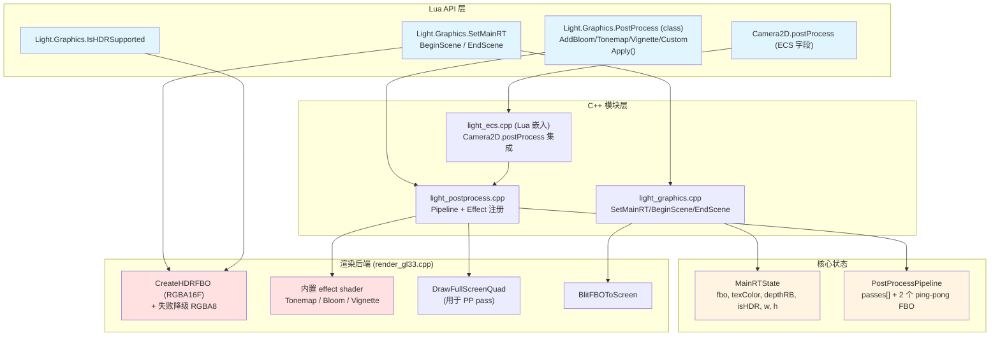
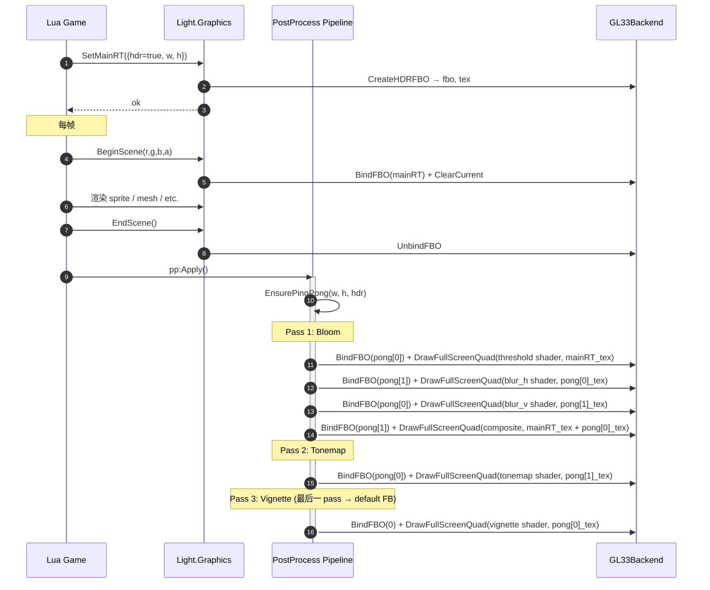
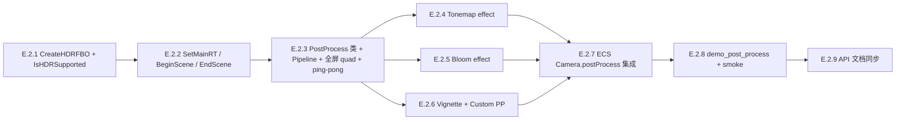

# DESIGN — Phase E.2 · 后处理栈

> 6A 工作流 · 阶段 2 · 架构（Architect）
> 基于 `CONSENSUS_PhaseE.md` 的决策，详细设计 E.2 后处理 Pipeline 与 HDR Framebuffer。

---

## 1. 整体架构



---

## 2. 分层设计

### 2.1 Lua API 层

#### 2.1.1 MainRT 与帧控制

| API | 作用 |
|-----|------|
| `Light.Graphics.SetMainRT({width, height, hdr=true})` | 创建/重建主 RT（FBO），返回 `bool success, string? err` |
| `Light.Graphics.GetMainRT()` | 返回 `{width, height, hdr, fbo, textureId}` 或 `nil` |
| `Light.Graphics.ReleaseMainRT()` | 释放主 RT，恢复直接渲染到 default FB |
| `Light.Graphics.BeginScene(r, g, b, a)` | 隐式绑 MainRT FBO + Clear（若无 MainRT，等价于不做 FBO 切换） |
| `Light.Graphics.EndScene()` | 解绑 MainRT，恢复 default FB |
| `Light.Graphics.IsHDRSupported()` | 平台是否支持 RGBA16F color attachment |

#### 2.1.2 PostProcess Pipeline

```lua
-- 创建 pipeline
local pp = Light(Light.Graphics.PostProcess):New()

-- 链式添加内置 effect (按添加顺序应用)
pp:AddBloom({threshold=1.0, intensity=0.5, blurPasses=4, spread=1.0})
pp:AddTonemap({mode='aces', exposure=1.0, gamma=2.2})    -- mode: 'reinhard' | 'aces' | 'filmic'
pp:AddVignette({radius=0.7, softness=0.4, color={0,0,0}, intensity=0.5})

-- 添加用户自定义 pass
local myShader = Light(Light.Graphics.Shader):New(vsSrc, fsSrc)
pp:AddCustom('grayscale', myShader, {uIntensity=1.0})

-- 执行 (默认 src=MainRT, dst=default FB)
pp:Apply()
-- 或显式指定 src 和 dst
pp:Apply(srcCanvas, dstCanvas)

-- 管理 pass
pp:GetPassCount()
pp:RemovePass(idx)     -- 1-indexed
pp:UpdatePass(idx, paramsTable)
pp:ClearPasses()
pp:SetEnabled(bool)
```

#### 2.1.3 ECS 集成

```lua
-- 绑定 pipeline 到 camera
camera2D._comps.Camera2D.postProcess = pp
-- world:Render() 自动在 2D camera 阶段:
-- 1. BeginScene
-- 2. 渲染所有 Sprite/LitSprite/Batch/Text
-- 3. EndScene
-- 4. pp:Apply()
```

### 2.2 C++ 模块层

#### 2.2.1 `light_postprocess.cpp`（新增）

```cpp
namespace PostProcess {
  struct Pass {
    enum Type { TONEMAP, BLOOM, VIGNETTE, CUSTOM } type;
    // 共用参数
    uint32_t shader_program;   // CUSTOM 时为用户 shader; 内置时引擎自管
    // 内置 effect 参数
    union {
      struct { int mode; float exposure, gamma; } tonemap;
      struct { float threshold, intensity, spread; int blurPasses; } bloom;
      struct { float radius, softness, intensity; float color[3]; } vignette;
    };
    // CUSTOM 时的用户参数表 (Lua ref)
    int custom_param_ref;
    bool enabled;
  };

  struct Pipeline {
    std::vector<Pass> passes;
    bool enabled;
    // ping-pong RT
    uint32_t fbo_pingpong[2] = {0, 0};
    uint32_t tex_pingpong[2] = {0, 0};
    int      pp_width = 0;
    int      pp_height = 0;
    bool     pp_is_hdr = false;
  };

  Pipeline* CreatePipeline();
  void      DestroyPipeline(Pipeline* p);
  void      EnsurePingPong(Pipeline* p, int w, int h, bool hdr);

  void Apply(Pipeline* p, uint32_t srcFBO, uint32_t srcTex, int w, int h,
              uint32_t dstFBO);  // 0 = default FB

  // 内置 effect 实现 (内部辅助)
  void ApplyTonemap(const Pass& pass, uint32_t srcTex, int w, int h);
  void ApplyBloom(Pipeline* p, const Pass& pass, uint32_t srcTex, int w, int h);
  void ApplyVignette(const Pass& pass, uint32_t srcTex, int w, int h);
  void ApplyCustom(const Pass& pass, uint32_t srcTex, int w, int h, lua_State* L);
}
```

#### 2.2.2 `light_graphics.cpp` 扩展

```cpp
// 新增全局状态
struct MainRTContext {
    uint32_t fbo;
    uint32_t texColor;
    uint32_t depthRB;
    int      width, height;
    bool     isHDR;
    bool     isActive;       // BeginScene/EndScene 之间为 true
};
static MainRTContext g_mainRT = {};

static int l_SetMainRT(lua_State* L) {
    // 1. 解析参数: width, height, hdr
    // 2. 若 g_mainRT.fbo 存在: 先 DeleteFBO
    // 3. CreateHDRFBO (hdr=true) 或 CreateFBO (hdr=false)
    // 4. 失败时返回 nil + "err"
    // 5. 成功更新 g_mainRT 状态
}

static int l_BeginScene(lua_State* L) {
    // 1. 若 g_mainRT.fbo: BindFBO(g_mainRT.fbo) + SetViewport
    // 2. ClearCurrent(r,g,b,a)
    // 3. g_mainRT.isActive = true
}

static int l_EndScene(lua_State* L) {
    // 1. UnbindFBO()
    // 2. SetViewport(0, 0, window_w, window_h)
    // 3. g_mainRT.isActive = false
}
```

#### 2.2.3 `light_ecs.cpp` 扩展

Camera2D / Camera3D 在 ECS `_RegisterBuiltinRenderComponents()` 中增加 `postProcess=nil` 字段（不强制类型，运行时检查 `pp.Apply` 方法）。

`Render()` 修改：

```lua
-- 2D camera 段
local cam2d = self:_FindActiveCamera('Camera2D', 'Transform2D')
if cam2d then
    local cc = cam2d._comps.Camera2D
    local pp = cc.postProcess
    if pp and pp.Apply and Light.Graphics.GetMainRT() then
        Light.Graphics.BeginScene(0, 0, 0, 0)
    end
    -- ... 渲染 sprite / lit sprite / batch / text
    if pp and pp.Apply and Light.Graphics.GetMainRT() then
        Light.Graphics.EndScene()
        pp:Apply()
    end
end
```

### 2.3 渲染后端层

#### 2.3.1 `CreateHDRFBO` (`render_gl33.cpp` 扩展)

```cpp
uint32_t CreateHDRFBO(int w, int h, uint32_t* outTex, uint32_t* outDepthRB) override {
    if (!hdrSupported) {
        // 自动降级到 LDR
        CC::Log(CC::LOG_WARN, "GL33: HDR not supported, fallback to RGBA8");
        return CreateFBO(w, h, outTex, outDepthRB);
    }

    GLuint tex = 0;
    glGenTextures(1, &tex);
    glBindTexture(GL_TEXTURE_2D, tex);
    glTexImage2D(GL_TEXTURE_2D, 0, GL_RGBA16F, w, h, 0, GL_RGBA, GL_HALF_FLOAT, nullptr);
    glTexParameteri(GL_TEXTURE_2D, GL_TEXTURE_MIN_FILTER, GL_LINEAR);
    glTexParameteri(GL_TEXTURE_2D, GL_TEXTURE_MAG_FILTER, GL_LINEAR);
    glTexParameteri(GL_TEXTURE_2D, GL_TEXTURE_WRAP_S, GL_CLAMP_TO_EDGE);
    glTexParameteri(GL_TEXTURE_2D, GL_TEXTURE_WRAP_T, GL_CLAMP_TO_EDGE);
    glBindTexture(GL_TEXTURE_2D, 0);

    // depth RB
    GLuint depthRB;
    glGenRenderbuffers(1, &depthRB);
    glBindRenderbuffer(GL_RENDERBUFFER, depthRB);
    glRenderbufferStorage(GL_RENDERBUFFER, GL_DEPTH_COMPONENT24, w, h);
    glBindRenderbuffer(GL_RENDERBUFFER, 0);

    // FBO
    GLuint fbo;
    glGenFramebuffers(1, &fbo);
    glBindFramebuffer(GL_FRAMEBUFFER, fbo);
    glFramebufferTexture2D(GL_FRAMEBUFFER, GL_COLOR_ATTACHMENT0, GL_TEXTURE_2D, tex, 0);
    glFramebufferRenderbuffer(GL_FRAMEBUFFER, GL_DEPTH_ATTACHMENT, GL_RENDERBUFFER, depthRB);
    GLenum status = glCheckFramebufferStatus(GL_FRAMEBUFFER);
    glBindFramebuffer(GL_FRAMEBUFFER, 0);

    if (status != GL_FRAMEBUFFER_COMPLETE) {
        glDeleteTextures(1, &tex);
        glDeleteRenderbuffers(1, &depthRB);
        glDeleteFramebuffers(1, &fbo);
        return 0;
    }
    *outTex = tex;
    *outDepthRB = depthRB;
    return fbo;
}
```

`hdrSupported` 在 GL33Backend `Init()` 中检测：

```cpp
// 桌面: GL 3.3 自带 RGBA16F
// GLES3: 需要检测 EXT_color_buffer_half_float (Android) 或自带 (iOS / Web)
hdrSupported = true;
#if defined(__EMSCRIPTEN__) || defined(__ANDROID__)
    if (!CheckExtension("GL_EXT_color_buffer_half_float") &&
        !CheckExtension("EXT_color_buffer_half_float")) {
        hdrSupported = false;
    }
#endif
```

#### 2.3.2 内置 effect shader

```glsl
// FS_TONEMAP (GLES 3.0 / GL 3.3 共用)
precision highp float;
in vec2 vUV;
out vec4 FragColor;
uniform sampler2D uInput;
uniform int   uMode;        // 0=reinhard, 1=aces, 2=filmic
uniform float uExposure;
uniform float uGamma;

vec3 Reinhard(vec3 c) { return c / (1.0 + c); }
vec3 ACES(vec3 c) {
    c *= 0.6;
    return clamp((c * (2.51 * c + 0.03)) / (c * (2.43 * c + 0.59) + 0.14), 0.0, 1.0);
}
vec3 Filmic(vec3 c) {
    c = max(vec3(0.0), c - 0.004);
    return (c * (6.2*c + 0.5)) / (c * (6.2*c + 1.7) + 0.06);
}

void main() {
    vec3 c = texture(uInput, vUV).rgb * uExposure;
    if (uMode == 0) c = Reinhard(c);
    else if (uMode == 1) c = ACES(c);
    else c = Filmic(c);
    c = pow(c, vec3(1.0 / uGamma));
    FragColor = vec4(c, 1.0);
}
```

```glsl
// FS_BLOOM_THRESHOLD (提取高光)
uniform sampler2D uInput;
uniform float uThreshold;
out vec4 FragColor;
in vec2 vUV;
void main() {
    vec3 c = texture(uInput, vUV).rgb;
    float brightness = max(c.r, max(c.g, c.b));
    FragColor = brightness > uThreshold ? vec4(c, 1.0) : vec4(0.0);
}
```

```glsl
// FS_BLOOM_BLUR (高斯模糊, 9-tap horizontal/vertical)
uniform sampler2D uInput;
uniform vec2 uDirection;       // (1,0) or (0,1)
uniform float uSpread;
out vec4 FragColor;
in vec2 vUV;
void main() {
    vec2 texel = uSpread / vec2(textureSize(uInput, 0));
    vec3 c = texture(uInput, vUV).rgb * 0.227027;
    // 9-tap gaussian weights
    c += texture(uInput, vUV + uDirection * texel * 1.0).rgb * 0.194594;
    c += texture(uInput, vUV - uDirection * texel * 1.0).rgb * 0.194594;
    c += texture(uInput, vUV + uDirection * texel * 2.0).rgb * 0.121622;
    c += texture(uInput, vUV - uDirection * texel * 2.0).rgb * 0.121622;
    c += texture(uInput, vUV + uDirection * texel * 3.0).rgb * 0.054054;
    c += texture(uInput, vUV - uDirection * texel * 3.0).rgb * 0.054054;
    c += texture(uInput, vUV + uDirection * texel * 4.0).rgb * 0.016216;
    c += texture(uInput, vUV - uDirection * texel * 4.0).rgb * 0.016216;
    FragColor = vec4(c, 1.0);
}
```

```glsl
// FS_BLOOM_COMPOSITE (合成原图 + bloom)
uniform sampler2D uOriginal;
uniform sampler2D uBloom;
uniform float uIntensity;
out vec4 FragColor;
in vec2 vUV;
void main() {
    vec3 o = texture(uOriginal, vUV).rgb;
    vec3 b = texture(uBloom, vUV).rgb;
    FragColor = vec4(o + b * uIntensity, 1.0);
}
```

```glsl
// FS_VIGNETTE
uniform sampler2D uInput;
uniform float uRadius;
uniform float uSoftness;
uniform float uIntensity;
uniform vec3 uColor;
out vec4 FragColor;
in vec2 vUV;
void main() {
    vec3 c = texture(uInput, vUV).rgb;
    vec2 d = vUV - 0.5;
    float r = length(d);
    float v = smoothstep(uRadius, uRadius - uSoftness, r);
    FragColor = vec4(mix(uColor, c, v * uIntensity + (1.0 - uIntensity)), 1.0);
}
```

#### 2.3.3 全屏 quad 渲染

后端新增 `DrawFullScreenQuad(uint32_t inputTex, uint32_t fbo)`：

```cpp
// 内部: 维护一个静态 fullscreen quad VAO (2 三角形覆盖 NDC -1..1)
// glViewport(0, 0, w, h)
// glUseProgram(currentEffectProgram)
// glActiveTexture(GL_TEXTURE0); glBindTexture(GL_TEXTURE_2D, inputTex)
// glUniform1i(uInput, 0)
// glDrawArrays(GL_TRIANGLES, 0, 6)
```

---

## 3. 数据流向图

### 3.1 帧内数据流（启用 PostProcess）



### 3.2 Pipeline ping-pong 策略

```mermaid
flowchart LR
  MainRT[MainRT] -->|Pass 1| Pong0[pong[0]]
  Pong0 -->|Pass 2| Pong1[pong[1]]
  Pong1 -->|Pass 3| Pong0Or0[pong[0] or default FB]
  Pong0Or0 -->|Pass N| LastPong[last pong]
  LastPong -->|Final pass| DefaultFB[Default FB]

  style MainRT fill:#fff4e1
  style DefaultFB fill:#e1f5e1
```

**规则**：
- N 个 pass：奇数 pass 写 pong[0]，偶数 pass 写 pong[1]
- 最后一个 pass 总是写 `dstFBO`（默认 default FB，0）
- Bloom 内部子 pass (threshold + 2×blur + composite) 算作 1 个用户 pass，内部 ping-pong

---

## 4. 异常处理策略

| 场景 | 处理 |
|------|------|
| `SetMainRT` 时 HDR 不支持 | 自动降级到 RGBA8，Lua 返回 `true, "HDR not supported, fallback to LDR"` |
| `SetMainRT` 完全失败 (FBO 不完整) | 返回 `false, "FBO incomplete"` |
| `BeginScene` 时无 MainRT | 等价 no-op（直接渲染到 default FB） |
| Pipeline `Apply` 时无 MainRT | 警告 + 跳过 Apply |
| `AddCustom` shader 编译失败 | shader_program=0，运行时 Apply 时跳过该 pass + warn |
| `AddCustom` 用户 paramsTable 不含 shader 期望 uniform | 不上传该 uniform（不报错），让 GLSL 用默认值 0 |
| Bloom blurPasses 超大 (>16) | clamp 到 16 |
| `Apply` 时 window resize 导致 w/h 变化 | `EnsurePingPong` 检测尺寸变化 → 重建 ping-pong FBO |
| Pipeline `__gc` (Lua GC) | 析构 ping-pong FBO + 释放所有 pass 资源 |

---

## 5. 关键设计决策记录

### 5.1 为什么 MainRT 是全局单例而不是每 camera 一个？

**决策**：全局单例 MainRT，多 camera 共享。

**理由**：
- 大部分场景只有 1 个 active camera
- ECS 多 camera 时本来就只渲染 active camera（`_FindActiveCamera`）
- MainRT 内存开销大（HDR 1080p ≈ 16 MB），多份开销不合理
- 未来需要多 camera 各自后处理可升级为 per-camera RT

### 5.2 为什么 ping-pong 是 2 个 FBO 而不是 N 个？

**决策**：2 个 ping-pong FBO 足够。

**理由**：
- 大部分 effect 是 single-pass：读 → 写一次
- Bloom 内部用自管理的 ping-pong（threshold → blur_h → blur_v → composite）
- 最坏情况 N pass 时仍只需 2 个 FBO 交替

### 5.3 为什么用 RGBA16F 而不是 RGB16F 或 RGBA32F？

**决策**：RGBA16F。

**理由**：
- GLES 3.0 上 RGBA16F 是 standard color-renderable format（RGB16F 不一定支持）
- 32F 内存翻倍，2D 游戏精度过剩
- alpha 通道有用于半透明物体的 alpha blending

### 5.4 为什么 Tonemap 不直接放在最后一个 pass 内？

**决策**：Tonemap 是独立 pass，可由用户决定位置。

**理由**：
- 用户可能想在 Tonemap 后再做 Vignette（暗角应在 LDR 空间作用）
- 用户可能不想 Tonemap（LDR pipeline 时跳过）
- 显式 pass 顺序更灵活

### 5.5 为什么 ECS 集成是 Camera 字段而不是独立 component？

**决策**：`Camera2D.postProcess` 字段（pipeline 引用）。

**理由**：
- PP 自然属于 camera 的渲染配置
- 多 camera 时每个 camera 可有不同 PP（虽然当前只渲染 active camera）
- 独立 `PostProcessComponent` 会引入"绑哪个 camera"的歧义

---

## 6. 依赖关系图



---

## 7. 文件清单（预估）

### 新建

- `ChocoLight/src/light_postprocess.cpp` — ~600 行
- `samples/demo_post_process/main.lua` — ~200 行
- `samples/demo_post_process/README.md` — ~60 行
- `scripts/smoke/postprocess.lua` — ~120 行

### 修改

- `ChocoLight/include/render_backend.h` — +40 行（CreateHDRFBO + 全屏 quad 接口）
- `ChocoLight/src/render_gl33.cpp` — +600 行（HDR + 内置 effect shader + DrawFullScreenQuad）
- `ChocoLight/src/light_graphics.cpp` — +250 行（SetMainRT/BeginScene/EndScene + IsHDRSupported）
- `ChocoLight/src/light_ecs.cpp` — +60 行（Camera2D.postProcess 集成）
- `ChocoLight/CMakeLists.txt` — +1 行
- `docs/api/Light_Graphics.md` — +150 行
- `docs/api/MODULE_INDEX.md` — +20 行

### E.2 子总计：~2080 行 代码 + ~230 行 文档

---

## 8. 与 E.1 的协同

- **共用 HDR FBO**：E.1 Lit sprite 输出到 HDR MainRT → E.2 PostProcess 接收 HDR 输入 → Tonemap 输出 LDR
- **共用 BeginScene/EndScene**：E.1 LitSprite 在 BeginScene/EndScene 之间渲染
- **共用 ECS Render 入口**：`world:Render()` 内部依次：BeginScene → UploadLights2D → Sprite + LitSprite + SpriteBatch + Text → EndScene → Pipeline.Apply

### 完整帧渲染时序

```
ECSWorld:Render()
├─ _FindActiveCamera Camera2D
├─ 若 Camera2D.postProcess + MainRT 存在: BeginScene
├─ camera transform push
├─ _UploadLights2D()                    [E.1]
├─ for sprite in sprites: _DrawSprite   [现有, 不受光]
├─ for ls in lit_sprites: _DrawLitSprite [E.1, 受光]
├─ for sb in sprite_batches: _DrawSpriteBatch [现有]
├─ for tr in text_renderers: _DrawText  [现有]
├─ camera transform pop
├─ 若 Camera2D.postProcess + MainRT 存在: EndScene + pp:Apply [E.2]
├─ _FindActiveCamera Camera3D (类似流程)
└─ 3D mesh / skinned mesh / morph ...
```

---

## 9. 风险缓解措施

| 风险 | 缓解 |
|------|------|
| Bloom 在低分辨率 (< 512px) blur 失真 | blurPasses 自适应（< 512 时 clamp 到 2） |
| 用户 Custom PP shader 缺 uInput uniform | 引擎自动绑 slot 0 + 设 uInput=0；无 uInput 时不影响 |
| ping-pong FBO 重建抖动 | 仅尺寸变化超过 5% 时重建（避免 1 像素抖动） |
| 多 pass 时颜色精度损失 | 全程 RGBA16F（LDR fallback 时接受精度损失） |
| Apply 时 default FB blit 未保 depth | PostProcess 默认不保 depth（depth-aware effect 推迟） |
