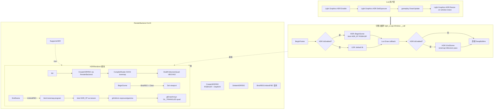

# DESIGN — Phase E.3 · HDR + Tonemapping

> 6A 工作流 · 阶段 2 · Architect

---

## 1. 整体架构



---

## 2. 模块分层

### 2.1 新建文件

| 文件 | 角色 |
|------|------|
| `include/hdr_renderer.h` | HDRRenderer 命名空间 API（与 `BatchRenderer` 同风格） |
| `src/hdr_renderer.cpp` | 实现：FBO 创建、shader 编译、fullscreen quad、BeginScene/EndScene |

### 2.2 修改文件

| 文件 | 改动 |
|------|------|
| `include/render_backend.h` | 新增虚接口 `SupportsHDR()`, `CreateHDRFBO(w, h, *outTex)`, `DeleteHDRFBO(fbo, tex)` |
| `src/render_gl33.cpp` | 实现上述 3 个虚接口（RGBA16F + Depth24 RBO） |
| `src/render_legacy.cpp` | `SupportsHDR()` 返回 false；其余 no-op |
| `src/light_ui.cpp` | `Init/Shutdown` 同 BatchRenderer 同位置；`Window_Call` 加 `BeginScene/EndScene` hook |
| `src/light_graphics.cpp` (新 namespace 文件或同源) | 实现 Lua API `Light.Graphics.HDR.*`；注册到 graphics 模块 |
| `CMakeLists.txt` | +`hdr_renderer.cpp` |
| `scripts/smoke/hdr.lua` (新建) | API surface + headless guard |
| `samples/demo_hdr/main.lua` (新建) | 视觉验收 demo |

---

## 3. 接口契约

### 3.1 RenderBackend 虚接口扩展

```cpp
// include/render_backend.h 新增 (与 SupportsLit2D 同模式)
class RenderBackend {
public:
    // ... 既有 ...

    /// HDR 能力检测（GL33 → true; Legacy → false）
    virtual bool SupportsHDR() const { return false; }

    /// 创建 HDR FBO（RGBA16F + Depth24）
    /// @return fbo id（0 = 失败）
    /// @param[out] outTex  半浮点颜色纹理 id
    /// 备注：内部 RBO 自动管理，不暴露
    virtual uint32_t CreateHDRFBO(int /*w*/, int /*h*/, uint32_t* /*outTex*/) { return 0; }

    /// 释放 HDR FBO
    virtual void DeleteHDRFBO(uint32_t /*fbo*/, uint32_t /*tex*/) {}
};
```

### 3.2 HDRRenderer 模块 API

```cpp
// include/hdr_renderer.h
namespace HDRRenderer {

/// 引擎启动时调一次（绑定 backend；不创建 RT）
bool Init(RenderBackend* backend);

/// 引擎退出时调
void Shutdown();

/// 启用 HDR：创建 RGBA16F RT；编译 shader；创建 fullscreen quad
/// @return true 成功 / false 后端不支持或资源失败
bool Enable(int w, int h);

/// 禁用 HDR：释放 RT；但 shader/quad 保留供下次启用
void Disable();

/// HDR 当前是否启用
bool IsEnabled();

/// 主循环 BeginFrame 后调（开启 HDR 时绑 HDR RT + clear）
void BeginScene();

/// 主循环 Flush 后调（unbind FBO + tonemap pass blit 到 default fb）
void EndScene();

/// 修改 RT 尺寸（窗口 resize）
bool Resize(int w, int h);

/// 曝光：linear scale on HDR color before ACES
void SetExposure(float v);
float GetExposure();

/// gamma：output sRGB encode pow(c, 1/gamma)，默认 2.2
void SetGamma(float v);
float GetGamma();

/// 当前 HDR RT 纹理 id（用户高级用法：直接采样 HDR 数据）
uint32_t GetSceneTexture();

}  // namespace HDRRenderer
```

### 3.3 Lua API（`Light.Graphics.HDR`）

| Lua 调用 | C++ 函数 | 行为 |
|----------|----------|------|
| `Light.Graphics.HDR.Enable(w, h)` → bool | `HDRRenderer::Enable` | 启用 HDR；返回是否成功 |
| `Light.Graphics.HDR.Disable()` | `HDRRenderer::Disable` | 关闭 HDR |
| `Light.Graphics.HDR.IsEnabled()` → bool | `HDRRenderer::IsEnabled` | 查询状态 |
| `Light.Graphics.HDR.IsSupported()` → bool | `g_render->SupportsHDR()` | 不需要 Enable 即可查询 |
| `Light.Graphics.HDR.Resize(w, h)` → bool | `HDRRenderer::Resize` | 重建 RT |
| `Light.Graphics.HDR.SetExposure(v)` | `HDRRenderer::SetExposure` | LDR 模式下静默忽略 |
| `Light.Graphics.HDR.GetExposure()` → number | `HDRRenderer::GetExposure` | |
| `Light.Graphics.HDR.SetGamma(v)` | `HDRRenderer::SetGamma` | |
| `Light.Graphics.HDR.GetGamma()` → number | `HDRRenderer::GetGamma` | |
| `Light.Graphics.HDR.GetSceneTexture()` → int | `HDRRenderer::GetSceneTexture` | 高级用法 |

---

## 4. 数据流

### 4.1 LDR 模式（HDR 关闭，向后兼容）

```
g_render->BeginFrame(0,0,0,1)       # 清默认 fb (RGBA8)
BatchRenderer::BeginFrame()
LitBatchRenderer::BeginFrame()
[Lua Draw] → SubmitOrDraw → 默认 fb
LitBatchRenderer::EndFrame()        # Flush 到默认 fb
BatchRenderer::EndFrame()
g_render->EndFrame()
SwapBuffers
```

### 4.2 HDR 模式

```
g_render->BeginFrame(0,0,0,1)       # 清默认 fb (虽然之后被覆盖)
HDRRenderer::BeginScene()           # ★ BindFBO(HDR_RT); ClearCurrent; SetViewport(rtW, rtH)
BatchRenderer::BeginFrame()
LitBatchRenderer::BeginFrame()
[Lua Draw] → SubmitOrDraw → HDR_RT (RGBA16F 累积线性 HDR 值)
LitBatchRenderer::EndFrame()        # Flush 到 HDR_RT
BatchRenderer::EndFrame()
HDRRenderer::EndScene()             # ★ UnbindFBO; bind tonemap_program;
                                    #   bind HDR_RT as uHDRTex; uniform exposure/gamma;
                                    #   glDrawArrays 4-vertex fullscreen quad
g_render->EndFrame()
SwapBuffers
```

### 4.3 SetCanvas 期间 HDR 行为（D10 决策）

```
[HDR.Enable(W, H) 已调]
HDRRenderer::BeginScene()           # HDR_RT 绑定
[Lua Draw 部分]
gfx.SetCanvas(userCanvas)           # ★ HDR.Pause: 切到 userCanvas FBO
[在 userCanvas 上画...]
gfx.SetCanvas(nil)                  # ★ HDR.Resume: 切回 HDR_RT
[继续 Draw 到 HDR_RT]
HDRRenderer::EndScene()             # tonemap → default fb
```

**实现**：`l_SetCanvas` 切到非 nil canvas 时记一个标志，HDR.EndScene 不重复绑定；切回 nil 时如果 HDR.IsEnabled 则 BindFBO(HDR_RT)。

---

## 5. ACES Tonemap Shader

### 5.1 Vertex shader（fullscreen quad）

```glsl
#version 330 core
layout(location = 0) in vec2 aPos;   // [-1..1]
layout(location = 1) in vec2 aUV;    // [0..1]
out vec2 vUV;
void main() {
    vUV = aUV;
    gl_Position = vec4(aPos, 0.0, 1.0);
}
```

### 5.2 Fragment shader（ACES fitted by Narkowicz）

```glsl
#version 330 core
in  vec2 vUV;
out vec4 fragColor;

uniform sampler2D uHDRTex;
uniform float uExposure;
uniform float uGamma;

// ACES fitted: https://knarkowicz.wordpress.com/2016/01/06/aces-filmic-tone-mapping-curve/
vec3 ACESFilm(vec3 x) {
    const float a = 2.51, b = 0.03, c = 2.43, d = 0.59, e = 0.14;
    return clamp((x * (a*x + b)) / (x * (c*x + d) + e), 0.0, 1.0);
}

void main() {
    vec3 hdr  = texture(uHDRTex, vUV).rgb * uExposure;
    vec3 ldr  = ACESFilm(hdr);
    vec3 srgb = pow(ldr, vec3(1.0 / uGamma));
    fragColor = vec4(srgb, 1.0);
}
```

### 5.3 Fullscreen quad 顶点数据

```cpp
// 2 个三角形, 6 顶点, 共享 VBO (不要 EBO, 简单)
static const float kFullscreenQuad[] = {
    // pos.xy      uv.xy
    -1.f, -1.f,    0.f, 0.f,
     1.f, -1.f,    1.f, 0.f,
    -1.f,  1.f,    0.f, 1.f,
    -1.f,  1.f,    0.f, 1.f,
     1.f, -1.f,    1.f, 0.f,
     1.f,  1.f,    1.f, 1.f,
};
```

---

## 6. GL33 后端实现细节

### 6.1 CreateHDRFBO

```cpp
uint32_t CreateHDRFBO(int w, int h, uint32_t* outTex) override {
    // 1. 创建 RGBA16F 颜色纹理
    GLuint tex;
    glGenTextures(1, &tex);
    glBindTexture(GL_TEXTURE_2D, tex);
    glTexImage2D(GL_TEXTURE_2D, 0, GL_RGBA16F, w, h, 0, GL_RGBA, GL_FLOAT, nullptr);
    glTexParameteri(GL_TEXTURE_2D, GL_TEXTURE_MIN_FILTER, GL_LINEAR);
    glTexParameteri(GL_TEXTURE_2D, GL_TEXTURE_MAG_FILTER, GL_LINEAR);
    glTexParameteri(GL_TEXTURE_2D, GL_TEXTURE_WRAP_S, GL_CLAMP_TO_EDGE);
    glTexParameteri(GL_TEXTURE_2D, GL_TEXTURE_WRAP_T, GL_CLAMP_TO_EDGE);
    glBindTexture(GL_TEXTURE_2D, 0);

    // 2. 创建 Depth24 RBO
    GLuint depthRB;
    glGenRenderbuffers(1, &depthRB);
    glBindRenderbuffer(GL_RENDERBUFFER, depthRB);
    glRenderbufferStorage(GL_RENDERBUFFER, GL_DEPTH_COMPONENT24, w, h);
    glBindRenderbuffer(GL_RENDERBUFFER, 0);

    // 3. 创建 FBO 并附加
    GLuint fbo;
    glGenFramebuffers(1, &fbo);
    glBindFramebuffer(GL_FRAMEBUFFER, fbo);
    glFramebufferTexture2D(GL_FRAMEBUFFER, GL_COLOR_ATTACHMENT0, GL_TEXTURE_2D, tex, 0);
    glFramebufferRenderbuffer(GL_FRAMEBUFFER, GL_DEPTH_ATTACHMENT, GL_RENDERBUFFER, depthRB);

    GLenum st = glCheckFramebufferStatus(GL_FRAMEBUFFER);
    glBindFramebuffer(GL_FRAMEBUFFER, 0);

    if (st != GL_FRAMEBUFFER_COMPLETE) {
        CC::Log(CC::LOG_ERROR, "GL33: HDR FBO incomplete (status=0x%X)", st);
        glDeleteFramebuffers(1, &fbo);
        glDeleteTextures(1, &tex);
        glDeleteRenderbuffers(1, &depthRB);
        return 0;
    }
    // depthRB 内部持有（保存在 HDRRenderer 状态中，DeleteHDRFBO 一并释放）
    // 为了接口简洁，HDRRenderer 自己 alloc depthRB 而不通过 backend
    // → 重新设计：backend 仅 alloc texture + fbo；depthRB 由 HDRRenderer 直接调 gl
    *outTex = tex;
    return fbo;
}
```

**修正**：为了让接口简洁，把 depthRB 放在 HDRRenderer 状态里。Backend `CreateHDRFBO` 只产 `fbo + tex`，HDRRenderer 自己额外调 `glGenRenderbuffers` 直接管理。但这样 backend 抽象漏了。

**最终决策**：保持 `CreateHDRFBO(w, h, *outTex)` 与现有 `CreateFBO` 一致风格但**内部封装 depthRB**，与 `DeleteHDRFBO` 配对。在 GL33 实现里用 map 记 fbo→depthRB 关系：

```cpp
std::unordered_map<uint32_t, uint32_t> g_hdrFboDepthRB;  // fbo → depthRB

uint32_t CreateHDRFBO(int w, int h, uint32_t* outTex) override {
    // ... alloc tex, depthRB, fbo ...
    g_hdrFboDepthRB[fbo] = depthRB;
    *outTex = tex;
    return fbo;
}

void DeleteHDRFBO(uint32_t fbo, uint32_t tex) override {
    if (fbo) {
        auto it = g_hdrFboDepthRB.find(fbo);
        if (it != g_hdrFboDepthRB.end()) {
            glDeleteRenderbuffers(1, &it->second);
            g_hdrFboDepthRB.erase(it);
        }
        glDeleteFramebuffers(1, &fbo);
    }
    if (tex) { GLuint t = tex; glDeleteTextures(1, &t); }
}
```

### 6.2 ACES shader 编译复用现有 `CompileShader/CreateProgram`

GL33 后端已经有 shader 编译能力（`programLit2D` 等），HDR 复用同流程。

---

## 7. 异常处理策略

| 异常 | 处理 |
|------|------|
| `Enable(w, h)` 后端不支持 | `Init` 调用时检查 `SupportsHDR()` → false 直接 return false + warn log |
| FBO incomplete | `Enable` 失败 → 释放 tex/depthRB → 返回 false |
| Shader 编译失败 | `Init` 阶段就 fail-fast；返回 false；后续 `Enable` 都失败 |
| `Resize(0, 0)` | 拒绝（w<=0 or h<=0 警告 + 返回 false） |
| `BeginScene` 调用前 `Enable` 失败 | 静默 no-op（不绑 FBO） |
| LDR 模式下 `SetExposure` | 写入内部 state，但不影响渲染 |
| Lua API 在 `Init` 失败后调用 | 静默 no-op + warn 一次 |

---

## 8. 关键技术陷阱

| # | 陷阱 | 防护 |
|---|------|------|
| **T1** | `GL_RGBA16F` 老移动 GPU 不支持 | `SupportsHDR()` 在 GL33 暂返回 true（桌面）；移动平台后续 phase 用 `GL_EXT_color_buffer_half_float` 检测 |
| **T2** | HDR RT 的 `GL_TEXTURE_2D` 默认 filter 是 `GL_NEAREST_MIPMAP_LINEAR`，会 incomplete | 显式 `GL_LINEAR` + `GL_CLAMP_TO_EDGE` |
| **T3** | tonemap pass 误开 `GL_DEPTH_TEST` 会失败 | EndScene 内 `glDisable(GL_DEPTH_TEST)`，draw 后**不**恢复（下次 BeginFrame 会重置） |
| **T4** | fullscreen quad VAO 绑定的 EBO 残留 | 不用 EBO（6 顶点 GL_TRIANGLES） |
| **T5** | tonemap shader 编译失败后 ACES 不生效但 BeginScene 仍绑 HDR RT | `Init` 失败时整个 HDR 子系统不可用 |
| **T6** | Window resize 时 HDR RT 尺寸不变 → viewport 拉伸 | Lua 调用方负责调 `HDR.Resize`；引擎不自动监听 |
| **T7** | SetCanvas 在 HDR 模式下切到 user FBO 后 EndScene 误绑 user FBO | EndScene 内先 `UnbindFBO()` 强制切到 default fb |
| **T8** | tonemap shader 内除以零（HDR 值含 NaN） | ACESFilm 的 `clamp` 保底；shader 头部对 hdr 做 `max(hdr, 0.0)` |

---

## 9. Phase E.4 Bloom 兼容性预留

Phase E.3 设计中保留以下接口，方便 Phase E.4 直接接入：

- `HDRRenderer::GetSceneTexture()` — Bloom 可读 HDR RT 做亮度 threshold
- `HDRRenderer::EndScene()` 内部留 hook，Phase E.4 可在 tonemap 前插入 bloom pass：HDR_RT → blurred_tex → composite → tonemap
- `RenderBackend::CreateHDRFBO` 公开，Phase E.4 可用同样接口创建 mipmap chain
