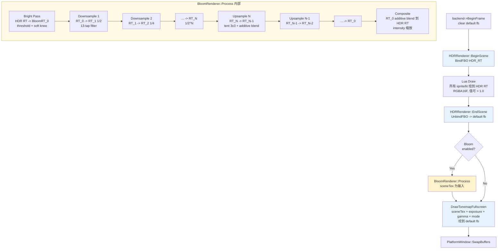
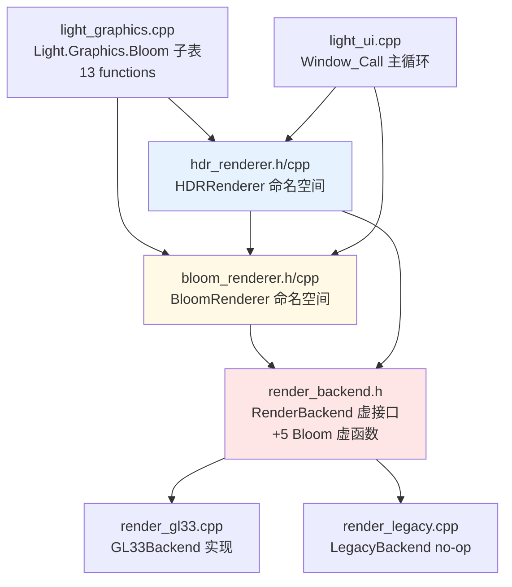

# DESIGN — Phase E.4 · Bloom 后处理

> 6A 工作流 · 阶段 2 · Architect
> 共识文档 → 系统架构 → 模块设计 → 接口规范

---

## 1. 整体架构

### 1.1 管线流程（HDR + Bloom 启用）



### 1.2 模块依赖



### 1.3 控制流（联动机制）

```
用户 Lua                  HDRRenderer               BloomRenderer
---------                 ------------              -------------
HDR.Enable(1920,1080)  →  Enable                 →  (AutoEnable=true)
                            创建 HDR RT                Enable(1920, 1080)
                            ↓                          创建 pyramid (5 级 RT)
                          返回 true                    返回 true

HDR.Resize(2560,1440)  →  Resize                 →  Resize(2560,1440)
                            重建 HDR RT                 重建 pyramid
                          返回 true

HDR.Disable()          →  Disable                →  Disable
                            释放 HDR RT                 释放 pyramid

Bloom.SetAutoEnable    →                         →  保存 flag
(false)

(之后) HDR.Enable      →  Enable                 →  (AutoEnable=false)
                            创建 HDR RT                 不启用
                          返回 true
```

---

## 2. 后端接口扩展（render_backend.h）

### 2.1 能力查询

```cpp
/// @brief 是否支持 Bloom (要求支持 HDR + multi-FBO pyramid)
virtual bool SupportsBloom() const { return false; }   // Legacy no-op
```

### 2.2 Pyramid 资源管理

```cpp
/// @brief 创建 Bloom RT pyramid
/// @param w        顶级宽 (通常 = HDR RT 宽)
/// @param h        顶级高
/// @param levels   层数 (2..8)
/// @param outFbos  [out] FBO id 数组, 容量 >= levels
/// @param outTexs  [out] texture id 数组, 容量 >= levels
/// @return         实际创建的层数 (失败 = 0; 部分失败 = 已创建数, 调用方应释放)
virtual int CreateBloomPyramid(int /*w*/, int /*h*/, int /*levels*/,
                                uint32_t* /*outFbos*/, uint32_t* /*outTexs*/) { return 0; }

/// @brief 释放 Bloom RT pyramid
virtual void DeleteBloomPyramid(uint32_t* /*fbos*/, uint32_t* /*texs*/, int /*levels*/) {}
```

### 2.3 管线 pass 接口

```cpp
/// @brief Bright Pass: HDR RT (sceneTex) → outFbo (第 0 级 bloom RT)
///        筛选亮度 > threshold 的像素 (含 soft knee), 输出 RGBA16F
/// @param sceneTex  HDR RT 纹理 id
/// @param outFbo    目标 FBO (Bloom pyramid 第 0 级)
/// @param w, h      目标 RT 大小
/// @param threshold 亮度阈值 (L > threshold 时保留)
virtual void DrawBloomBrightPass(uint32_t /*sceneTex*/, uint32_t /*outFbo*/,
                                   int /*w*/, int /*h*/, float /*threshold*/) {}

/// @brief Downsample: srcTex (上级) → dstFbo (本级), 13-tap COD AW filter
virtual void DrawBloomDownsample(uint32_t /*srcTex*/, uint32_t /*dstFbo*/,
                                   int /*dstW*/, int /*dstH*/) {}

/// @brief Upsample + additive blend: srcTex → dstFbo, tent 3x3 filter, radius 控制 UV 偏移
/// @param radius 扩散半径 [0.5, 1.0] 常用; 0 退化为简单 box; > 1 溢出
virtual void DrawBloomUpsample(uint32_t /*srcTex*/, uint32_t /*dstFbo*/,
                                 int /*dstW*/, int /*dstH*/, float /*radius*/) {}

/// @brief Final composite: bloomResultTex additive blend → hdrFbo
/// @param intensity 合成强度 (0..N), 0 = 无 bloom, 1 = 全强度, > 1 = 过亮
virtual void DrawBloomComposite(uint32_t /*bloomTex*/, uint32_t /*hdrFbo*/,
                                  int /*w*/, int /*h*/, float /*intensity*/) {}
```

### 2.4 GL33 实现要点（render_gl33.cpp）

- 复用已有 `vaoTonemap / vboTonemap`（6 顶点全屏 quad），全部 bloom pass 共用
- 4 个独立 shader program：
  - `programBloomBright`（bright pass + soft knee）
  - `programBloomDown`（13-tap downsample）
  - `programBloomUp`（tent 3x3 upsample + additive blend via hardware）
  - `programBloomComp`（final composite = 直接 additive blend，可省一个 shader，用 programBloomUp 无偏移采样）
- 每个 shader 有独立 uniform location 缓存（threshold / texel size / radius / intensity）
- `hdrFboDepthRB` map **不复用** 给 bloom（bloom RT 无需 depth，节约显存）

---

## 3. BloomRenderer 模块设计（bloom_renderer.h/cpp）

### 3.1 命名空间 API

```cpp
namespace BloomRenderer {

// ===== 生命周期 =====
void Init(RenderBackend* backend);    // HDRRenderer::Init 后调, 仅保存 backend 指针
void Shutdown();                      // 释放 pyramid + 清状态

// ===== 启停 =====
/// @brief 启用 Bloom; 创建 pyramid
/// @return 成功 true; 失败 false (backend 不支持 / OOM)
bool Enable(int w, int h);
void Disable();
bool IsEnabled();
bool IsSupported();              // backend->SupportsBloom()
bool Resize(int w, int h);       // 重建 pyramid

// ===== 自动联动 (由 HDRRenderer 调用, 不暴露 Lua) =====
/// @brief HDR.Enable 成功后的自动回调; flag = AutoEnable 时启用, 否则 no-op
void OnHDREnabled(int w, int h);
void OnHDRDisabled();
void OnHDRResized(int w, int h);
void SetAutoEnable(bool flag);
bool GetAutoEnable();

// ===== 参数 =====
void  SetThreshold(float v);     // 默认 1.0; clamp [0, inf)
float GetThreshold();
void  SetIntensity(float v);     // 默认 0.8; clamp [0, inf)
float GetIntensity();
void  SetRadius(float v);        // 默认 0.7; clamp [0, 1]
float GetRadius();
void  SetLevels(int n);          // 默认 5; clamp [2, 8]; 重建 pyramid 时生效
int   GetLevels();

// ===== 管线调用 (HDRRenderer::EndScene 前调) =====
/// @brief 执行 bloom 管线: bright pass → pyramid down/up → composite 回 hdrFbo
/// @param hdrFbo   HDR RT 的 FBO id (必须已 unbind)
/// @param hdrTex   HDR RT 颜色纹理 id
void Process(uint32_t hdrFbo, uint32_t hdrTex);

} // namespace BloomRenderer
```

### 3.2 内部状态

```cpp
namespace { struct State {
    RenderBackend* backend = nullptr;
    bool inited = false;
    bool supported = false;
    bool enabled = false;
    int  width = 0, height = 0;

    bool autoEnable = true;              // HDR.Enable 联动开关

    // pyramid 资源 (最多 8 级; CreateBloomPyramid 成功创建 actualLevels)
    static constexpr int MAX_LEVELS = 8;
    uint32_t fbos[MAX_LEVELS] = {0};
    uint32_t texs[MAX_LEVELS] = {0};
    int  actualLevels = 0;               // 实际创建成功的层数

    // 参数
    float threshold = 1.0f;
    float intensity = 0.8f;
    float radius    = 0.7f;
    int   requestedLevels = 5;           // 下次 Enable/Resize 生效
}; static State g; }
```

### 3.3 Process 内部流程

```cpp
void Process(uint32_t hdrFbo, uint32_t hdrTex) {
    if (!g.enabled || !g.backend || !g.supported) return;

    // 1. Bright Pass: HDR → RT[0]
    g.backend->DrawBloomBrightPass(hdrTex, g.fbos[0], g.width, g.height, g.threshold);

    // 2. Downsample: RT[0] -> RT[1] -> ... -> RT[N-1]
    int w = g.width / 2, h = g.height / 2;
    for (int i = 1; i < g.actualLevels; ++i) {
        g.backend->DrawBloomDownsample(g.texs[i-1], g.fbos[i], w, h);
        w = (w > 1) ? w / 2 : 1;
        h = (h > 1) ? h / 2 : 1;
    }

    // 3. Upsample + additive blend: RT[N-1] -> RT[N-2] -> ... -> RT[0]
    for (int i = g.actualLevels - 1; i > 0; --i) {
        // 从 RT[i] upsample 到 RT[i-1] 的分辨率, 加到 RT[i-1] 上 (hardware blend)
        int dstW = g.width  >> (i - 1);
        int dstH = g.height >> (i - 1);
        if (dstW < 1) dstW = 1;
        if (dstH < 1) dstH = 1;
        g.backend->DrawBloomUpsample(g.texs[i], g.fbos[i-1], dstW, dstH, g.radius);
    }

    // 4. Composite: RT[0] additive -> HDR fbo
    g.backend->DrawBloomComposite(g.texs[0], hdrFbo, g.width, g.height, g.intensity);
}
```

---

## 4. HDRRenderer 集成改动

### 4.1 Enable / Disable / Resize 回调 BloomRenderer

```cpp
// hdr_renderer.cpp::Enable (末尾)
bool Enable(int w, int h) {
    // ... 现有 HDR RT 创建逻辑 ...
    if (成功) {
        BloomRenderer::OnHDREnabled(w, h);   // 新增
    }
    return 成功;
}

void Disable() {
    BloomRenderer::OnHDRDisabled();           // 新增 (先 disable bloom)
    // ... 现有逻辑 ...
}

bool Resize(int w, int h) {
    // ... 现有 HDR RT 重建逻辑 ...
    if (成功) {
        BloomRenderer::OnHDRResized(w, h);   // 新增
    }
    return 成功;
}
```

### 4.2 EndScene 集成

```cpp
void EndScene() {
    if (!g.enabled || g.paused || !g.backend || !g.fbo || !g.sceneTex) return;

    // 1. 解绑 HDR RT, 切到 default framebuffer
    g.backend->UnbindFBO();

    // 2. Bloom 管线 (内部会 bind/unbind 各 bloom RT, 最后合成回 HDR RT)
    //    Process 内自检 IsEnabled, 未启用时 no-op
    BloomRenderer::Process(g.fbo, g.sceneTex);     // 新增

    // 3. 再次 unbind 确保 default fb 为渲染目标
    g.backend->UnbindFBO();                         // 防御性

    // 4. Tonemap + sRGB encode → default fb
    g.backend->DrawTonemapFullscreen(g.sceneTex, g.exposure, g.gamma, g.tonemap);
}
```

---

## 5. Shader 设计

### 5.1 Vertex Shader（复用 tonemap 的 VS）

无需新写；全屏 quad，全部 bloom pass 共用 `VS_TONEMAP_SOURCE`。

### 5.2 Bright Pass FS

```glsl
uniform sampler2D uHDRTex;
uniform float uThreshold;      // L > threshold 时保留

vec3 soft_knee(vec3 c, float t) {
    float L = dot(c, vec3(0.2126, 0.7152, 0.0722));   // Rec 709 luminance
    float knee = t * 0.5;                             // knee 宽度 = t/2
    float soft = clamp(L - t + knee, 0.0, 2.0 * knee);
    soft = soft * soft / (4.0 * knee + 1e-5);
    float contribution = max(L - t, soft) / max(L, 1e-5);
    return c * contribution;
}

void main() {
    vec3 hdr = texture(uHDRTex, vUV).rgb;
    FragColor = vec4(soft_knee(hdr, uThreshold), 1.0);
}
```

### 5.3 Downsample FS（13-tap COD AW）

```glsl
uniform sampler2D uSrc;
uniform vec2      uTexel;      // 1.0 / srcSize

// COD AW 13-tap: 4 个 +/-2 偏移, 4 个 +/-1 偏移, 1 个中心
vec3 sampleCOD(sampler2D t, vec2 uv, vec2 tx) {
    vec3 a = texture(t, uv + tx * vec2(-1.0, -1.0)).rgb;
    vec3 b = texture(t, uv + tx * vec2( 1.0, -1.0)).rgb;
    vec3 c = texture(t, uv + tx * vec2(-1.0,  1.0)).rgb;
    vec3 d = texture(t, uv + tx * vec2( 1.0,  1.0)).rgb;
    // 省略全部 13 tap; 完整实现见 shader 源码
    // 权重: 中心 + 4 个 0.5 + 8 个 0.125 (详见 COD AW 论文)
    return (a + b + c + d) * 0.25;  // 简化占位, 实际 shader 展开 13 tap
}

void main() {
    FragColor = vec4(sampleCOD(uSrc, vUV, uTexel), 1.0);
}
```

### 5.4 Upsample FS（tent 3x3）

```glsl
uniform sampler2D uSrc;
uniform vec2      uTexel;      // 1.0 / dstSize
uniform float     uRadius;     // 扩散半径

void main() {
    vec2 d = uTexel * uRadius;
    // tent 9-tap (3x3 + 中心权重)
    vec3 c = texture(uSrc, vUV).rgb * 4.0;
    c += texture(uSrc, vUV + vec2(-d.x,  0.0)).rgb * 2.0;
    c += texture(uSrc, vUV + vec2( d.x,  0.0)).rgb * 2.0;
    c += texture(uSrc, vUV + vec2( 0.0, -d.y)).rgb * 2.0;
    c += texture(uSrc, vUV + vec2( 0.0,  d.y)).rgb * 2.0;
    c += texture(uSrc, vUV + vec2(-d.x, -d.y)).rgb;
    c += texture(uSrc, vUV + vec2( d.x, -d.y)).rgb;
    c += texture(uSrc, vUV + vec2(-d.x,  d.y)).rgb;
    c += texture(uSrc, vUV + vec2( d.x,  d.y)).rgb;
    FragColor = vec4(c / 16.0, 1.0);
}
```

Upsample 使用 GL `glBlendFunc(GL_ONE, GL_ONE)` 硬件 blend 累加到 dst FBO，不在 shader 内做 add。

### 5.5 Composite FS（可省；复用 Upsample shader 零偏移采样）

```glsl
uniform sampler2D uSrc;
uniform float     uIntensity;

void main() {
    FragColor = vec4(texture(uSrc, vUV).rgb * uIntensity, 1.0);
}
```

合成时调用方设 `glBlendFunc(GL_ONE, GL_ONE)` → shader 输出 `bloomRT0 * intensity`，硬件 blend 加到 HDR RT。

---

## 6. Lua API 设计（light_graphics.cpp）

### 6.1 子表 `Light.Graphics.Bloom`（13 函数）

```lua
-- 生命周期
Bloom.Enable()                -- 通常不用手动调 (HDR.Enable 已联动)
Bloom.Disable()
Bloom.IsEnabled() -> boolean
Bloom.IsSupported() -> boolean
Bloom.Resize(w, h) -> boolean

-- 自动联动 flag
Bloom.SetAutoEnable(flag)     -- flag: bool
Bloom.GetAutoEnable() -> boolean

-- 参数
Bloom.SetThreshold(t)         -- 默认 1.0, clamp [0, ∞)
Bloom.GetThreshold() -> number
Bloom.SetIntensity(i)         -- 默认 0.8, clamp [0, ∞)
Bloom.GetIntensity() -> number
Bloom.SetRadius(r)            -- 默认 0.7, clamp [0, 1]
Bloom.GetRadius() -> number
Bloom.SetLevels(n)            -- 默认 5, clamp [2, 8]; 下次 Enable/Resize 生效
Bloom.GetLevels() -> number
```

### 6.2 参数范围校验策略

- 类型不对（如 `SetThreshold("x")`）：`luaL_checknumber` 抛 lua error
- 负值或超范围：静默 clamp 到合法范围（无 error；参考 `HDR.SetGamma` 风格）
- Levels 0/1：clamp 到 2；>8：clamp 到 8

---

## 7. 异常处理策略

| 场景 | 处理 |
|------|------|
| GL33 shader 编译失败 | Init 时记录 warn log，`SupportsBloom=false`，所有 API no-op |
| CreateBloomPyramid 部分失败 | DeleteBloomPyramid 释放已创建部分；Enable 返回 false |
| HDR 未启用时调 Bloom.Enable | Enable 内部直接返回 false（pyramid 大小无处依托） |
| Bloom.Process 运行中 GL error | 不 abort；继续管线（残留 GL state 由下帧 BeginFrame 重置） |
| SetLevels 改变但 pyramid 已建 | 只更新 requestedLevels；真正生效在下次 Resize/Enable |
| Bloom 启用但 HDR Disable | HDRRenderer::OnHDRDisabled → BloomRenderer::Disable |

---

## 8. 数据流（单帧视图）

```
t0: Window_Call BeginFrame
    ├─ backend->BeginFrame (clear default fb)
    ├─ HDRRenderer::BeginScene
    │  └─ backend->BindFBO(hdrFbo) + Clear(hdrRT)
    └─ Lua Draw callback (draw into hdrRT)

t1: 主循环 EndScene
    └─ HDRRenderer::EndScene
       ├─ backend->UnbindFBO             // 切回 default fb
       ├─ BloomRenderer::Process(hdrFbo, hdrTex)
       │  ├─ BrightPass:    hdrTex -> bloomFbo[0]       (bind bloomFbo[0])
       │  ├─ Downsample x4: [0]->[1]->[2]->[3]->[4]
       │  ├─ Upsample   x4: [4]->[3]->[2]->[1]->[0]    (GL blend ONE/ONE)
       │  └─ Composite:     [0] -> hdrFbo                (GL blend ONE/ONE, intensity)
       ├─ backend->UnbindFBO             // 防御性再切 default
       └─ backend->DrawTonemapFullscreen(hdrTex, ...)    // HDR(+bloom) → default fb

t2: backend->EndFrame + SwapBuffers
```

---

## 9. 与既有架构的一致性

| 维度 | E.4 方案 | 与 E.3 一致性 |
|------|---------|---------------|
| 命名空间模块 | `BloomRenderer::` | ✅ 同 `HDRRenderer::` |
| 全局状态 | `namespace { struct State; static State g; }` | ✅ |
| 后端虚接口 | 4 虚函数默认 no-op | ✅ 同 HDR 的 4 虚函数 |
| 能力查询 | `SupportsBloom() = false` | ✅ 同 `SupportsHDR` |
| Lua 子表 | `Light.Graphics.Bloom` | ✅ 同 `.HDR` |
| smoke | `scripts/smoke/bloom.lua` | ✅ 同 `hdr.lua` |
| CI 注册 | Windows runtime smoke 列表加一行 | ✅ 同 hdr 注册 |

---

## 10. 风险与降级

| 风险 | 缓解 |
|------|------|
| GLES3 驱动不支持 RGBA16F | `CreateBloomPyramid` 返回 0 → Enable 失败 → 自动降级到无 bloom HDR |
| 高分辨率 pyramid 显存 | 1080p 5 级 = 约 16MB（所有级累计）；可控；Resize 时释放再创建 |
| tent 3x3 上采样在低级数时发虚 | 默认 5 级；用户可 SetLevels(3+) 改观 |
| 用户 `Bloom.Enable()` 在 HDR 未启用时 | 直接返回 false + warn log |

---

Design 完成，进入 Atomize（任务拆分）阶段。
