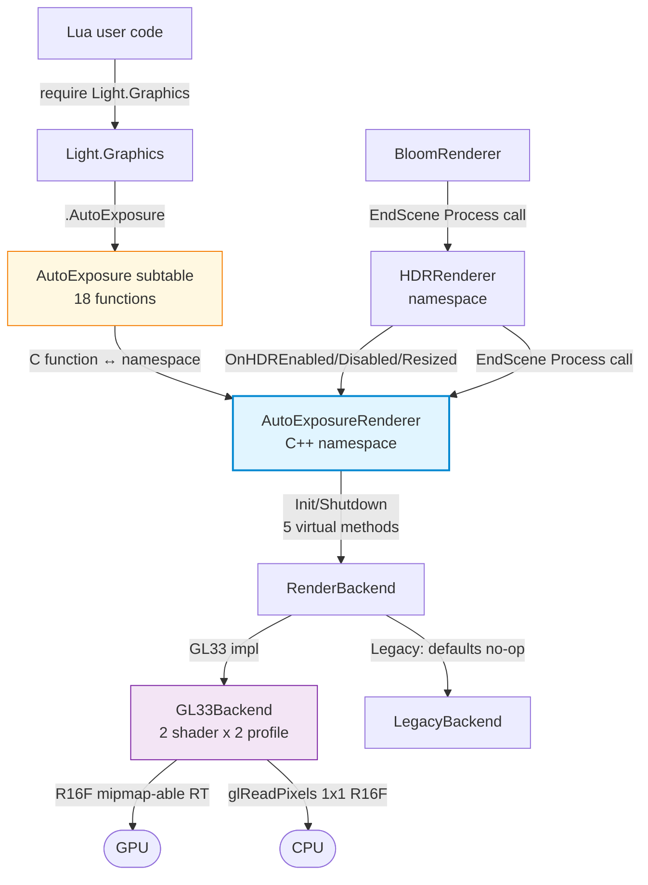
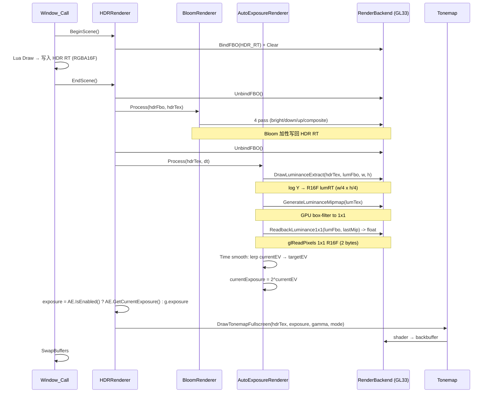
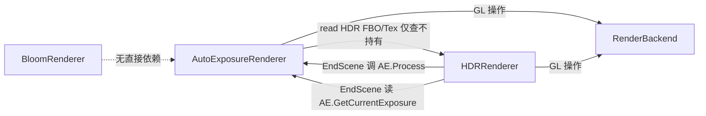

# DESIGN — Phase E.5 · Auto Exposure (Eye Adaptation)

> 6A 工作流 · 阶段 2 · Architect
> 共识文档 → 系统架构 → 模块设计 → 接口规范

---

## 1. 整体架构图



---

## 2. 数据流图（HDR + Bloom + AE 全链路）



---

## 3. 模块层次与依赖

```
┌────────────────────────────────────────────────────────┐
│           Light.Graphics  (Lua subtables)               │
│  .HDR (12 fn) / .Bloom (15 fn) / .AutoExposure (18 fn)  │
└────────────────────────────────────────────────────────┘
                          ↓
┌──────────────┐    ┌──────────────┐    ┌──────────────────┐
│ HDRRenderer  │ ←→ │ BloomRenderer│ ←→ │AutoExposureRender│
│              │    │              │    │     er (新增)     │
│ EndScene     │ →  │ Process      │ →  │ Process(hdrTex,  │
│ Set/GetExpo. │    │ OnHDREnabled │    │   dt)            │
└──────────────┘    │ OnHDRDisable.│    │ OnHDREnabled     │
       ↓             │ OnHDRResized │    │ OnHDRDisabled    │
       │             └──────────────┘    │ OnHDRResized     │
       │                                 └──────────────────┘
       ↓                                         ↓
┌────────────────────────────────────────────────────────┐
│              RenderBackend (虚接口)                      │
│  HDR (4) / Bloom (6) / AutoExposure (5 新增)            │
└────────────────────────────────────────────────────────┘
       ↓
   GL33Backend (实现) / LegacyBackend (默认 no-op)
```

### 3.1 模块依赖箭头



**注意**：Bloom 与 AE **互不依赖**。两者均挂在 `HDRRenderer::EndScene` 上，由 HDR 决定调用顺序（Bloom 先 → AE 后）。

---

## 4. 接口契约定义

### 4.1 C++ — `RenderBackend` 新增 5 虚接口（render_backend.h）

```cpp
// ==================== Phase E.5 — Auto Exposure (Eye Adaptation) ====================

/**
 * @brief 后端是否支持 Auto Exposure (R16F mipmap + readback)
 * 默认 false (Legacy); GL33Backend = true
 */
virtual bool SupportsAutoExposure() const { return false; }

/**
 * @brief 创建 luminance RT (单色 R16F, mipmap-able)
 *
 * 内部按 srcW/4, srcH/4 创建（减少 fragment 工作量）。
 *
 * @param srcW, srcH    源 HDR RT 尺寸（如 1920x1080）
 * @param outFbo, outTex  [out] FBO 与单色 R16F tex id
 * @param outW, outH    [out] 实际创建尺寸（向上 round 到 pow2 友好）
 * @return true = 成功; false = 不支持 / 资源失败
 */
virtual bool CreateLuminanceTarget(int /*srcW*/, int /*srcH*/,
                                    uint32_t* /*outFbo*/, uint32_t* /*outTex*/,
                                    int* /*outW*/, int* /*outH*/) { return false; }

virtual void DeleteLuminanceTarget(uint32_t /*fbo*/, uint32_t /*tex*/) {}

/**
 * @brief Pass 1: hdrTex 全屏 quad → lumFbo (log luminance, R16F)
 *
 * shader 流程:
 *   1. sample hdrTex.rgb
 *   2. luma = dot(rgb, vec3(0.2126, 0.7152, 0.0722))
 *   3. logLuma = log(max(luma, 0.0001))
 *   4. gl_FragColor.r = logLuma
 *
 * @param hdrTex  源 HDR RT 颜色 tex
 * @param lumFbo  目标 luminance RT FBO
 * @param w, h    lumFbo 尺寸（设 viewport 用）
 */
virtual void DrawLuminanceExtract(uint32_t /*hdrTex*/,
                                   uint32_t /*lumFbo*/,
                                   int /*w*/, int /*h*/) {}

/**
 * @brief 调用 glGenerateMipmap 让 GPU 自动算 luminance tex 的 mipmap 链
 *
 * 最后一层 (1×1) 即为全图平均 log luminance。
 * 调用前 lumTex 必须 R16F 且 GL_TEXTURE_MIN_FILTER 设为 LINEAR_MIPMAP_LINEAR 或 LINEAR。
 */
virtual void GenerateLuminanceMipmap(uint32_t /*lumTex*/) {}

/**
 * @brief 同步读 luminance RT 最后一层 mip (1×1 R16F) 到 CPU
 *
 * v1 实现: 用 glReadPixels（吃 1 frame stall, ~10us, 2 bytes/frame）。
 * v2 优化方向: PBO double-buffer 异步 readback (标 TODO)。
 *
 * @param lumFbo        luminance RT FBO
 * @param lastMipLevel  最后一层 mip 等级（log2(maxDim)）
 * @return float        log luminance value (1×1 R16F 的 R 通道); 失败返 0.0
 */
virtual float ReadbackLuminance1x1(uint32_t /*lumFbo*/, int /*lastMipLevel*/) { return 0.0f; }
```

### 4.2 C++ — `AutoExposureRenderer` namespace (auto_exposure_renderer.h)

```cpp
namespace AutoExposureRenderer {

// 生命周期 (与 BloomRenderer 同模式)
void Init(RenderBackend* backend);
void Shutdown();
bool Enable(int w, int h);
void Disable();
bool IsEnabled();
bool IsSupported();
bool Resize(int w, int h);

// HDR 联动开关 (默认 false; Bloom 默认 true，AE 默认 false 是有意区别)
void SetAutoEnable(bool flag);
bool GetAutoEnable();

// EV-based 参数 API
void  SetTargetEV(float v);      // 默认 0.0 (中灰)
float GetTargetEV();
void  SetSpeedUp(float v);       // EV/sec, 暗→亮; clamp [0.1, 20]; 默认 3.0
float GetSpeedUp();
void  SetSpeedDown(float v);     // EV/sec, 亮→暗; clamp [0.1, 20]; 默认 1.0
float GetSpeedDown();
void  SetMinEV(float v);         // 曝光下限; 默认 -8
float GetMinEV();
void  SetMaxEV(float v);         // 曝光上限; 默认 +8
float GetMaxEV();

// debug getter
float GetCurrentEV();            // 平滑后当前 EV
float GetCurrentExposure();      // = 2^GetCurrentEV()
float GetMeasuredLuminance();    // 上一帧测得 log luma

// 主循环 hook (由 HDRRenderer::EndScene 调用)
void Process(uint32_t hdrTex, float dt);

// HDR 联动 (HDRRenderer 调; Lua 不直接暴露)
void OnHDREnabled(int w, int h);
void OnHDRDisabled();
void OnHDRResized(int w, int h);

} // namespace AutoExposureRenderer
```

### 4.3 Lua — `Light.Graphics.AutoExposure` 子表

1:1 映射 C++ public API（18 函数）。挂在 `luaopen_Light_Graphics` 中，**在 `Bloom` 子表之后**。

---

## 5. 关键算法

### 5.1 GLSL Luminance Extract Shader

```glsl
// vertex (复用 fullscreen quad VAO; 与 tonemap/bloom 同)
#version 330 core
layout(location=0) in vec2 aPos;
out vec2 vUV;
void main() {
    vUV = aPos * 0.5 + 0.5;
    gl_Position = vec4(aPos, 0.0, 1.0);
}

// fragment
#version 330 core
in vec2 vUV;
uniform sampler2D uHDRTex;
out vec4 fragColor;
void main() {
    vec3 rgb = texture(uHDRTex, vUV).rgb;
    float luma = dot(rgb, vec3(0.2126, 0.7152, 0.0722));   // Rec.709
    float logLuma = log(max(luma, 0.0001));
    fragColor = vec4(logLuma, 0.0, 0.0, 0.0);              // R16F: 仅 R 通道
}
```

GLES3 版本：`#version 300 es` + `precision highp float;`。

### 5.2 CPU 端时间平滑（带双速度限速 lerp）

```cpp
// auto_exposure_renderer.cpp::Process
float logLumaMeasured = backend->ReadbackLuminance1x1(g.lumFbo, g.lastMip);
float lumaMeasured    = std::exp(logLumaMeasured);
g.measuredLuma        = logLumaMeasured;

// log avg luminance → target EV
// 公式: targetExposure = 0.18 / luma  (Reinhard key 0.18 中灰)
//        targetEV = log2(0.18 / luma) = log2(0.18) - logLuma
constexpr float LOG2_KEY = -2.473931f;  // log2(0.18)
float targetEV = LOG2_KEY - logLumaMeasured / std::log(2.0f);
targetEV       = std::clamp(targetEV, g.minEV, g.maxEV) + g.targetEV;  // user 偏移

// 限速 lerp (双速度)
float deltaEV = targetEV - g.currentEV;
float speed   = (deltaEV > 0.0f) ? g.speedUp : g.speedDown;
float step    = speed * dt;
if      (deltaEV >  step) g.currentEV += step;
else if (deltaEV < -step) g.currentEV -= step;
else                      g.currentEV = targetEV;
g.currentEV = std::clamp(g.currentEV, g.minEV, g.maxEV);

g.currentExposure = std::exp2(g.currentEV);
```

### 5.3 HDRRenderer::EndScene 集成（修改）

```cpp
void EndScene() {
    if (!g.enabled || g.paused || !g.backend || !g.fbo || !g.sceneTex) return;

    g.backend->UnbindFBO();

    BloomRenderer::Process(g.fbo, g.sceneTex);

    g.backend->UnbindFBO();

    // Phase E.5 — Auto Exposure
    static auto sLast = std::chrono::steady_clock::now();
    auto now = std::chrono::steady_clock::now();
    float dt = std::chrono::duration<float>(now - sLast).count();
    sLast = now;
    if (dt > 0.1f) dt = 0.1f;   // clamp 防大 dt 跳变
    AutoExposureRenderer::Process(g.sceneTex, dt);

    float exposure = AutoExposureRenderer::IsEnabled()
                        ? AutoExposureRenderer::GetCurrentExposure()
                        : g.exposure;
    g.backend->DrawTonemapFullscreen(g.sceneTex, exposure, g.gamma, g.tonemap);
}
```

---

## 6. 资源生命周期

| 触发 | AE 状态变化 |
|------|------------|
| `AutoExposureRenderer::Init(backend)` | 仅缓存 backend，不创建 RT |
| `Enable(w, h)` 成功 | 调 `CreateLuminanceTarget` → 缓存 `lumFbo/lumTex/lumW/lumH/lastMip`；`currentEV = targetEV`（初始无 history） |
| `Disable()` | 调 `DeleteLuminanceTarget`；零所有 GPU id |
| `Resize(w, h)` | 同尺寸 no-op；否则 `Disable + Enable` |
| `Shutdown()` | `Disable` + 解绑 backend |
| `HDR.Enable` 成功 + AE.GetAutoEnable=true | `AE.OnHDREnabled` → `AE.Enable(w, h)` |
| `HDR.Disable()` | `AE.OnHDRDisabled` → `AE.Disable()`（必须**先于** HDR RT 释放） |
| `HDR.Resize(w,h)` 成功 | `AE.OnHDRResized` → `Resize(w, h)` |

---

## 7. 异常处理策略

| 异常 | 行为 |
|------|------|
| `Init` 时 backend = nullptr | `CC::Log(WARN, "...")` + 模块 inited=false |
| `Enable` 时 backend->SupportsAutoExposure()=false | 返回 false + warn log |
| `Enable` 时 `CreateLuminanceTarget` 失败 | 清理已分配资源 + 返回 false |
| `Process` 时 enabled=false 或 hdrTex=0 | 静默 early-return |
| `ReadbackLuminance1x1` 失败（GL error） | 返回 0.0；AE 视作 luma=1 → targetEV=log2(0.18)/log(2)≈-2.47 |
| Resize 到非法尺寸 (≤0) | warn + 返回 false，AE 保持当前状态 |
| dt 异常大 (> 0.1s) | clamp 到 0.1s（防长时间挂起后跳变） |

---

## 8. 与现有架构的集成点（变更面）

| 文件 | 变更类型 | 关键改动 |
|------|----------|---------|
| `@e:\jinyiNew\Light\ChocoLight\include\render_backend.h` | 修改 | +5 虚接口 (default no-op) |
| `@e:\jinyiNew\Light\ChocoLight\src\render_gl33.cpp` | 修改 | +1 shader pair (luma extract) + 5 override impl + R16F mipmap RT 管理 |
| `@e:\jinyiNew\Light\ChocoLight\include\auto_exposure_renderer.h` | 新建 | 18 函数 + 内部 3 联动回调 |
| `@e:\jinyiNew\Light\ChocoLight\src\auto_exposure_renderer.cpp` | 新建 | State + lifecycle + Process + 时间平滑 |
| `@e:\jinyiNew\Light\ChocoLight\src\hdr_renderer.cpp` | 修改 | EndScene 在 Bloom 后插入 AE.Process + exposure 覆盖逻辑；Enable/Disable/Resize 联动 AE |
| `@e:\jinyiNew\Light\ChocoLight\src\light_ui.cpp` | 修改 | Window_Open 调 AE.Init；Window_Close 调 AE.Shutdown |
| `@e:\jinyiNew\Light\ChocoLight\CMakeLists.txt` | 修改 | +1 源文件 |
| `@e:\jinyiNew\Light\ChocoLight\src\light_graphics.cpp` | 修改 | +18 l_AutoExposure_* + ae_funcs[] + 子表挂入 luaopen_Light_Graphics |
| `@e:\jinyiNew\Light\scripts\smoke\auto_exposure.lua` | 新建 | ≥ 20 PASS |
| `@e:\jinyiNew\Light\samples\demo_auto_exposure\main.lua` | 新建 | 暗/亮场景切换 demo |
| `@e:\jinyiNew\Light\samples\demo_auto_exposure\README.md` | 新建 | — |
| `@e:\jinyiNew\Light\.github\workflows\build-templates.yml` | 修改 | `phaseE5Smoke` 注册 |

**估算行数**：C++ ~ 700 行 + Lua/CMake/YAML ~ 450 行。

---

## 9. 验收预期

| 准则 | 通过依据 |
|------|---------|
| AC-1 | 后端 5 虚接口签名稳定；Legacy 默认 no-op 不破坏构建 |
| AC-2 | AutoExposureRenderer 全 4 阶段 Process 在 disabled / 未初始化时静默 early-return |
| AC-3 | `HDR.Disable` 时 AE 先释放（防 RT 悬挂） |
| AC-4 | `SetAutoEnable(true)` 后 HDR.Enable 自动启 AE；默认 false 不自动 |
| AC-5 | EV 参数 clamp 正确：speed [0.1, 20]，minEV ≤ maxEV 强制 |
| AC-6 | Tonemap shader 接收 `2^currentEV` 作 exposure；AE 关时回归 manual SetExposure |
| AC-7 | Headless 下 Enable 安全返回 boolean；getter 全部返回合法默认值 |
| AC-8 | demo_auto_exposure 暗→亮场景 EV 平滑过渡，无瞬跳 |
| AC-9 | 6 平台 CI 全绿 + Windows runtime smoke `auto_exposure.lua` 通过 |

---

进入 **TASK_PhaseE_5.md** ✅
