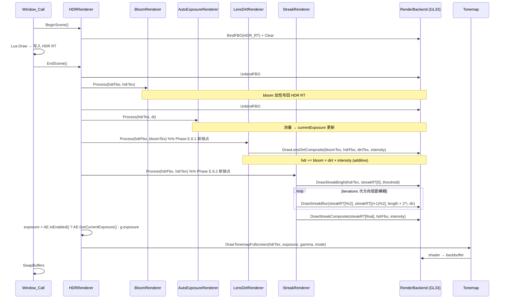

# DESIGN — Phase E.6 · Lens Dirt + Streak

> 6A 工作流 · 阶段 2 · Architect
> 共识文档 → 系统架构 → 模块设计 → 接口规范

---

## 1. 整体架构图

```mermaid
flowchart TB
    LuaUser["Lua user code"] -->|require Light.Graphics| LuaGfx[Light.Graphics]
    LuaGfx -->|.LensDirt| LuaLD[LensDirt subtable<br/>10 functions]
    LuaGfx -->|.Streak| LuaST[Streak subtable<br/>13 functions]

    LuaLD -->|C function ↔ namespace| LD[LensDirtRenderer<br/>C++ namespace]
    LuaST -->|C function ↔ namespace| ST[StreakRenderer<br/>C++ namespace]

    HDR[HDRRenderer<br/>namespace] -->|EndScene Process call| LD
    HDR -->|EndScene Process call| ST
    HDR -->|OnHDREnabled/Disabled/Resized| ST
    Bloom[BloomRenderer] -.->|hdrTex 输出 (含 bloom)| HDR

    LD -->|3 virtual methods| Backend[RenderBackend]
    ST -->|5 virtual methods| Backend
    Backend -->|GL33 impl| GL33[GL33Backend<br/>2 new shaders + ping-pong RT]
    Backend -->|Legacy: defaults no-op| Legacy[LegacyBackend]

    LD -->|fallback if no user dirt tex| WhiteTex([1x1 white tex])

    style LD fill:#fce4ec,stroke:#c2185b,stroke-width:2px
    style ST fill:#e8f5e9,stroke:#388e3c,stroke-width:2px
    style LuaLD fill:#fff8e1
    style LuaST fill:#fff8e1
    style GL33 fill:#f3e5f5
```

---

## 2. 数据流图（HDR + Bloom + AE + LensFx 全链路）



---

## 3. 模块层次

```
┌────────────────────────────────────────────────────────────────────┐
│         Light.Graphics  (Lua subtables)                             │
│  .HDR 12 / .Bloom 15 / .AutoExposure 18 / .LensDirt 10 / .Streak 13 │
└────────────────────────────────────────────────────────────────────┘
                              ↓
┌────────────┐ ┌─────────────┐ ┌──────────────┐ ┌──────────────┐ ┌──────────────┐
│HDRRenderer │ │BloomRenderer│ │AutoExposureR.│ │LensDirtRender│ │StreakRenderer│
│  EndScene──┼─┼─Process     │ │ Process      │ │ Process      │ │ Process      │
│  Set/Get   │ │ OnHDR*      │ │ OnHDR*       │ │ Set Texture  │ │ OnHDR*       │
│   Exposure │ │             │ │              │ │ Set Intens.  │ │ Set params   │
└────────────┘ └─────────────┘ └──────────────┘ └──────────────┘ └──────────────┘
                              ↓
┌────────────────────────────────────────────────────────────────────┐
│              RenderBackend (虚接口)                                  │
│  HDR (4) + Bloom (6) + AE (6) + LensDirt (3) + Streak (5)           │
└────────────────────────────────────────────────────────────────────┘
                              ↓
   GL33Backend (实现) / LegacyBackend (默认 no-op)
```

### 3.1 模块依赖

```mermaid
flowchart LR
    LD[LensDirtRenderer] -->|读 Bloom pyramid[0] tex| Bloom
    LD -->|写 hdrFbo| HDR
    ST[StreakRenderer] -->|读 hdrTex (含 bloom)| HDR
    ST -->|写 hdrFbo| HDR
    HDR -->|EndScene driver| LD
    HDR -->|EndScene driver| ST

    LD -->|可选 user dirt tex| Image[Image userdata]
```

**注意**：
- Lens Dirt 依赖 Bloom 的 `pyramid[0]` 输出（高斯柔化的 bloom）；如 Bloom 未启用，DESIGN 退化方案 = 用 hdrTex 替代（dirt × 整个 hdr 而非 bloom）。**v1 决策：要求 Bloom 启用**，未启用时 LensDirt.Process no-op。
- Streak 不依赖 Bloom（虽然两者都从亮像素提取）。

---

## 4. 接口契约定义

### 4.1 C++ — `RenderBackend` 新增 8 虚接口

```cpp
// ==================== Phase E.6 — Lens Dirt ====================

virtual bool SupportsLensDirt() const { return false; }

/**
 * @brief Lens dirt composite: hdrFbo += bloomTex × dirtTex × intensity
 *
 * 调用方需先 enable GL_BLEND with (GL_ONE, GL_ONE).
 *
 * @param bloomTex   Bloom pyramid[0] 颜色 tex
 * @param dirtTex    用户 dirt 纹理 (灰度/RGBA), 0=用 1x1 白纹理 fallback
 * @param hdrFbo     HDR RT FBO id (目标)
 * @param w, h       hdrFbo 尺寸 (设 viewport 用)
 * @param intensity  合成强度 (clamp [0, +inf))
 */
virtual void DrawLensDirtComposite(uint32_t /*bloomTex*/, uint32_t /*dirtTex*/,
                                    uint32_t /*hdrFbo*/,
                                    int /*w*/, int /*h*/, float /*intensity*/) {}

// ==================== Phase E.6 — Streak ====================

virtual bool SupportsStreak() const { return false; }

/**
 * @brief 创建 streak ping-pong RT 对 (2 个 RGBA16F + FBO, 同尺寸)
 *
 * 内部按 srcW/2, srcH/2 创建 (节省 fragment); 下限 32x32.
 *
 * @param srcW, srcH    源 HDR RT 尺寸
 * @param outFbos[2]    [out] 两个 FBO id
 * @param outTexs[2]    [out] 两个 tex id
 * @param outW, outH    [out] 实际创建尺寸
 * @return true 成功; false 失败 (会清理已分配资源)
 */
virtual bool CreateStreakTargets(int /*srcW*/, int /*srcH*/,
                                  uint32_t /*outFbos*/[2],
                                  uint32_t /*outTexs*/[2],
                                  int* /*outW*/, int* /*outH*/) { return false; }

virtual void DeleteStreakTargets(uint32_t /*fbos*/[2], uint32_t /*texs*/[2]) {}

/**
 * @brief Streak bright pass: hdrTex → outFbo (亮度阈值提取)
 *
 * v1 实现复用 Bloom programBloomBright (相同算法 + soft knee).
 */
virtual void DrawStreakBright(uint32_t /*hdrTex*/, uint32_t /*outFbo*/,
                               int /*w*/, int /*h*/, float /*threshold*/) {}

/**
 * @brief 1D 方向模糊: srcTex → dstFbo (7-tap 方向高斯)
 *
 * shader 内 normalize(direction). 步长 = direction × length.
 *
 * @param srcTex      输入 streak RT 的一侧
 * @param dstFbo      输出 streak RT 的另一侧 (ping-pong)
 * @param w, h        dst 尺寸
 * @param length      单步 UV 距离 (decoded uTexel-relative)
 * @param dirX, dirY  方向向量 (shader 内 normalize)
 */
virtual void DrawStreakBlur(uint32_t /*srcTex*/, uint32_t /*dstFbo*/,
                             int /*w*/, int /*h*/,
                             float /*length*/,
                             float /*dirX*/, float /*dirY*/) {}

/**
 * @brief 加性合成: streakTex × intensity → hdrFbo
 *
 * 调用方需先 enable GL_BLEND with (GL_ONE, GL_ONE).
 */
virtual void DrawStreakComposite(uint32_t /*streakTex*/, uint32_t /*hdrFbo*/,
                                  int /*w*/, int /*h*/, float /*intensity*/) {}
```

### 4.2 C++ — `LensDirtRenderer` namespace

```cpp
namespace LensDirtRenderer {
    void Init(RenderBackend* backend);
    void Shutdown();

    bool Enable();                 // 不需尺寸
    void Disable();
    bool IsEnabled();
    bool IsSupported();

    // HDR 联动 (内部)
    void OnHDREnabled(int w, int h);   // 仅响应 autoEnable, 不创 RT
    void OnHDRDisabled();              // 强制 Disable
    void OnHDRResized(int w, int h);   // no-op (LensDirt 无 RT)

    void SetAutoEnable(bool flag);     // 默认 false
    bool GetAutoEnable();

    /// 设置 dirt 纹理 GL id; 0 = 复位为内置 fallback (1x1 白)
    void     SetDirtTextureId(uint32_t texId);
    uint32_t GetDirtTextureId();        // 0 = fallback in use

    void  SetIntensity(float v);        // clamp [0, +inf), 默认 0.4
    float GetIntensity();

    /// 主循环 hook (HDRRenderer::EndScene 调)
    /// 需要 Bloom enabled 才有效; bloomTex=0 时静默 no-op
    void Process(uint32_t hdrFbo, uint32_t bloomTex, int w, int h);
}
```

### 4.3 C++ — `StreakRenderer` namespace

```cpp
namespace StreakRenderer {
    void Init(RenderBackend* backend);
    void Shutdown();

    bool Enable(int w, int h);
    void Disable();
    bool IsEnabled();
    bool IsSupported();
    bool Resize(int w, int h);

    // HDR 联动 (内部)
    void OnHDREnabled(int w, int h);
    void OnHDRDisabled();
    void OnHDRResized(int w, int h);

    void SetAutoEnable(bool flag);     // 默认 false
    bool GetAutoEnable();

    void  SetThreshold(float v);        // [0, +inf), 默认 1.0
    float GetThreshold();
    void  SetIntensity(float v);        // [0, +inf), 默认 0.3
    float GetIntensity();
    void  SetLength(float v);           // [0, 0.1], 默认 0.02
    float GetLength();
    void  SetDirection(float x, float y);   // shader 内 normalize, 默认 (1, 0)
    void  GetDirection(float& outX, float& outY);   // 由 Lua 多返回
    void  SetIterations(int n);         // [1, 8], 默认 5
    int   GetIterations();

    /// 主循环 hook
    void Process(uint32_t hdrFbo, uint32_t hdrTex);
}
```

### 4.4 Lua API

#### `Light.Graphics.LensDirt`（10 函数）

```lua
local LD = require('Light.Graphics').LensDirt
LD.Enable() / LD.Disable() / LD.IsEnabled() / LD.IsSupported()
LD.SetAutoEnable(flag) / LD.GetAutoEnable()
LD.SetDirtTexture(image_or_id_or_nil)   -- 接受 Image table (调 :GetTextureId()) / number / nil
LD.GetDirtTextureId() -> integer
LD.SetIntensity(v) / LD.GetIntensity()
```

#### `Light.Graphics.Streak`（13 函数）

```lua
local ST = require('Light.Graphics').Streak
ST.Enable(w, h) / ST.Disable() / ST.IsEnabled() / ST.IsSupported() / ST.Resize(w, h)
ST.SetAutoEnable(flag) / ST.GetAutoEnable()
ST.SetThreshold(v) / ST.GetThreshold()
ST.SetIntensity(v) / ST.GetIntensity()
ST.SetLength(v) / ST.GetLength()
ST.SetDirection(x, y) / ST.GetDirection() -> x, y
ST.SetIterations(n) / ST.GetIterations()
```

---

## 5. 关键算法

### 5.1 GLSL — Lens Dirt Composite

```glsl
// VS 复用 VS_TONEMAP_SOURCE
// FS:
#version 330 core
in  vec2 vUV;
out vec4 FragColor;
uniform sampler2D uBloomTex;   // slot 0
uniform sampler2D uDirtTex;    // slot 1
uniform float uIntensity;
void main() {
    vec3 bloom = texture(uBloomTex, vUV).rgb;
    vec3 dirt  = texture(uDirtTex, vUV).rgb;     // 灰度图也可
    FragColor  = vec4(bloom * dirt * uIntensity, 1.0);
}
```

### 5.2 GLSL — Streak Blur1D

```glsl
#version 330 core
in  vec2 vUV;
out vec4 FragColor;
uniform sampler2D uSrc;
uniform vec2  uTexel;
uniform float uLength;
uniform vec2  uDirection;
void main() {
    vec2 dir = normalize(uDirection) * uLength;
    // 7-tap 高斯权重 (sum = 1.0)
    vec3 c  = texture(uSrc, vUV - 3.0 * dir).rgb * 0.05
            + texture(uSrc, vUV - 2.0 * dir).rgb * 0.10
            + texture(uSrc, vUV - 1.0 * dir).rgb * 0.20
            + texture(uSrc, vUV).rgb              * 0.30
            + texture(uSrc, vUV + 1.0 * dir).rgb * 0.20
            + texture(uSrc, vUV + 2.0 * dir).rgb * 0.10
            + texture(uSrc, vUV + 3.0 * dir).rgb * 0.05;
    FragColor = vec4(c, 1.0);
}
```

### 5.3 GLSL — Streak Composite（复用 LensDirt composite shader 但 dirtTex 设为 1×1 白；v1 决策为独立 shader 或参数化复用）

**v1 决策**：独立 shader（更直接，避免 LensDirt 与 Streak 复用同一程序导致 uniform 状态污染）。

```glsl
#version 330 core
in  vec2 vUV;
out vec4 FragColor;
uniform sampler2D uSrc;
uniform float uIntensity;
void main() {
    vec3 c = texture(uSrc, vUV).rgb;
    FragColor = vec4(c * uIntensity, 1.0);
}
```

### 5.4 默认 1×1 白纹理

`InitLensDirt` 中创建：
```cpp
glGenTextures(1, &whiteTex);
glBindTexture(GL_TEXTURE_2D, whiteTex);
uint8_t pixel[4] = {255, 255, 255, 255};
glTexImage2D(GL_TEXTURE_2D, 0, GL_RGBA, 1, 1, 0, GL_RGBA, GL_UNSIGNED_BYTE, pixel);
glTexParameteri(GL_TEXTURE_2D, GL_TEXTURE_MIN_FILTER, GL_NEAREST);
glTexParameteri(GL_TEXTURE_2D, GL_TEXTURE_MAG_FILTER, GL_NEAREST);
```
`Shutdown` 释放。

### 5.5 Streak Process 算法

```cpp
void Process(uint32_t hdrFbo, uint32_t hdrTex) {
    if (!enabled || !backend || !supported) return;
    if (!hdrTex || !hdrFbo) return;
    if (!streakFbos[0] || !streakFbos[1]) return;

    // 1. Bright pass: hdrTex → streakRT[0]
    backend->DrawStreakBright(hdrTex, streakFbos[0], lumW, lumH, threshold);

    // 2. N 次 ping-pong 方向倍距模糊
    int srcIdx = 0;
    for (int i = 0; i < iterations; ++i) {
        int dstIdx = 1 - srcIdx;
        float stepLength = length * std::pow(2.0f, (float)i);   // 倍距扩展
        backend->DrawStreakBlur(streakTexs[srcIdx], streakFbos[dstIdx],
                                  lumW, lumH, stepLength,
                                  direction.x, direction.y);
        srcIdx = dstIdx;
    }

    // 3. 加性合成 streakTex[final] → hdrFbo
    backend->DrawStreakComposite(streakTexs[srcIdx], hdrFbo,
                                  hdrW, hdrH, intensity);
}
```

### 5.6 HDRRenderer::EndScene 集成（修改）

```cpp
void EndScene() {
    if (!g.enabled || g.paused || !g.backend || !g.fbo || !g.sceneTex) return;

    g.backend->UnbindFBO();

    BloomRenderer::Process(g.fbo, g.sceneTex);      // E.4

    g.backend->UnbindFBO();

    // E.5 dt + AE
    static auto sLast = std::chrono::steady_clock::now();
    auto now = std::chrono::steady_clock::now();
    float dt = std::chrono::duration<float>(now - sLast).count();
    sLast = now;
    if (dt > 0.1f) dt = 0.1f;
    AutoExposureRenderer::Process(g.sceneTex, dt);

    // E.6 — Lens Dirt 在 AE 后, Streak 在 LensDirt 后
    LensDirtRenderer::Process(g.fbo,
                              BloomRenderer::GetPyramidTopTex(),  // 新增 getter
                              g.width, g.height);
    StreakRenderer::Process(g.fbo, g.sceneTex);

    float exposure = AutoExposureRenderer::IsEnabled()
                        ? AutoExposureRenderer::GetCurrentExposure()
                        : g.exposure;
    g.backend->DrawTonemapFullscreen(g.sceneTex, exposure, g.gamma, g.tonemap);
}
```

> **依赖**：`BloomRenderer` 需新增 `GetPyramidTopTex()` 让 LensDirt 取 bloom pyramid[0] 颜色 tex。这是 Phase E.6 引入 BloomRenderer 的最小扩展。

---

## 6. 资源生命周期

| 触发 | LensDirt 状态 | Streak 状态 |
|------|--------------|-------------|
| `Init(backend)` | 缓存 backend；创建 1×1 白纹理 fallback | 缓存 backend |
| `Enable()` / `Enable(w,h)` | 仅 enabled = true（无 RT） | `CreateStreakTargets` → 缓存 fbos[2]/texs[2] |
| `Disable()` | enabled = false（保留 fallback texture） | `DeleteStreakTargets` → 重置 |
| `Resize(w,h)` | n/a | 同尺寸 no-op；否则 `Disable + Enable` |
| `Shutdown()` | Disable + 释放 fallback texture | Disable + 解绑 backend |
| `HDR.Enable` 成功 + `LD.GetAutoEnable=true` | `LD.OnHDREnabled` → `LD.Enable` | 同 LensDirt 模式 |
| `HDR.Disable()` | `LD.OnHDRDisabled` → `LD.Disable` | 同 |
| `SetDirtTexture(0/nil)` | dirtTexId = 0（运行时回归 fallback） | n/a |

---

## 7. 异常处理策略

| 异常 | 行为 |
|------|------|
| LensDirt.Process 时 bloomTex == 0 | 静默 no-op（Bloom 未启用） |
| LensDirt 启用但 dirtTex == 0 + fallback 创建失败 | warn log + Process no-op |
| Streak.Enable 时 `CreateStreakTargets` 失败 | 清理 + 返回 false |
| Streak.Process 时 streakFbos 不全 | 静默 no-op |
| `SetIterations(0)` | clamp 到 1 |
| `SetDirection(0, 0)` | shader 内 normalize 会得 NaN；Lua 端检测：长度 < 1e-6 时不更新（保留旧值） |

---

## 8. 与现有架构的集成点（变更面）

| 文件 | 变更类型 | 关键改动 |
|------|----------|---------|
| `@e:\jinyiNew\Light\ChocoLight\include\render_backend.h` | 修改 | +8 虚接口 |
| `@e:\jinyiNew\Light\ChocoLight\src\render_gl33.cpp` | 修改 | +2 shader (lens_dirt + streak_blur + streak_composite) × 2 profile + InitLensFx + 8 override |
| `@e:\jinyiNew\Light\ChocoLight\include\bloom_renderer.h` | 修改 | +1 getter `GetPyramidTopTex()` |
| `@e:\jinyiNew\Light\ChocoLight\src\bloom_renderer.cpp` | 修改 | +实现 `GetPyramidTopTex` |
| `@e:\jinyiNew\Light\ChocoLight\include\lens_dirt_renderer.h` | 新建 | 10 fn |
| `@e:\jinyiNew\Light\ChocoLight\src\lens_dirt_renderer.cpp` | 新建 | State + lifecycle + Process |
| `@e:\jinyiNew\Light\ChocoLight\include\streak_renderer.h` | 新建 | 13 fn |
| `@e:\jinyiNew\Light\ChocoLight\src\streak_renderer.cpp` | 新建 | State + lifecycle + Process |
| `@e:\jinyiNew\Light\ChocoLight\src\hdr_renderer.cpp` | 修改 | EndScene 末尾插 LD + ST Process; Enable/Disable/Resize 联动两者 |
| `@e:\jinyiNew\Light\ChocoLight\src\light_ui.cpp` | 修改 | Init/Shutdown 4 模块顺序：HDR → Bloom → AE → LensDirt → Streak |
| `@e:\jinyiNew\Light\ChocoLight\CMakeLists.txt` | 修改 | +2 源文件 |
| `@e:\jinyiNew\Light\ChocoLight\src\light_graphics.cpp` | 修改 | +23 binding + 2 funcs[] + 2 子表 |
| `@e:\jinyiNew\Light\scripts\smoke\lens_fx.lua` | 新建 | ≥ 25 PASS（合并 LensDirt + Streak） |
| `@e:\jinyiNew\Light\samples\demo_lens_fx\main.lua` | 新建 | 综合 demo |
| `@e:\jinyiNew\Light\samples\demo_lens_fx\README.md` | 新建 | — |
| `@e:\jinyiNew\Light\.github\workflows\build-templates.yml` | 修改 | `phaseE6Smoke` 注册 |

**估算**：C++ ~ 900 行 + Lua/CMake/YAML ~ 600 行。

---

## 9. 验收预期

| 准则 | 通过依据 |
|------|---------|
| AC-1 | 后端 8 虚接口签名稳定；Legacy 默认 no-op |
| AC-2 | LensDirtRenderer.Process 在 disabled / bloomTex=0 / 资源失效 时一律 early-return |
| AC-3 | StreakRenderer.Process 全 6 阶段（bright + N blur + composite）在 disabled / 资源失效 时一律 early-return |
| AC-4 | `HDR.Disable` 时 LensDirt + Streak 先释放（防 RT 悬挂） |
| AC-5 | `SetAutoEnable(true)` 后 HDR.Enable 自动启 LensDirt / Streak；默认 false 不自动 |
| AC-6 | LensDirt 启用 + 未 SetDirtTexture 时使用 1×1 白纹理 fallback，不崩 |
| AC-7 | Streak SetIterations clamp [1, 8]，SetDirection(0,0) 保留旧值 |
| AC-8 | demo_lens_fx 在 Legacy / headless 后端 API surface 探测后干净退出 |
| AC-9 | 6 平台 CI 全绿 + Windows runtime 运行 `lens_fx.lua` 通过 |

---

进入 **TASK_PhaseE_6.md** ✅
