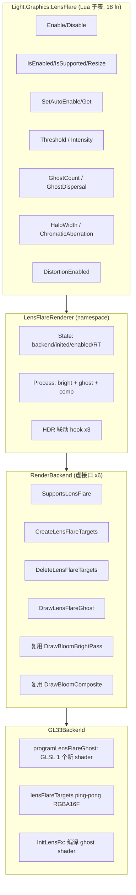
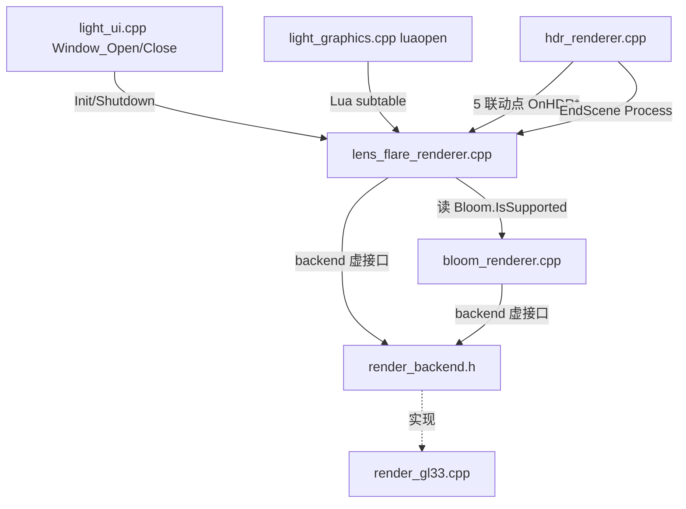

# DESIGN — Phase E.7 · Lens Flare (Ghost + Halo + Chromatic Aberration)

> 6A 工作流 · 阶段 2 · Architect
> 基于 `@e:\jinyiNew\Light\docs\Phase E 渲染管线升级\ALIGNMENT_PhaseE_7.md` 系统分层设计。

---

## 1. 整体架构



---

## 2. 数据流（Phase E.7 在 HDR.EndScene 中的位置）

```text
HDR.EndScene 内部 (HDR + Bloom + AE + LensDirt + Streak 链路之上):

    [HDR RT (RGBA16F, fbo=g.fbo, tex=g.sceneTex)]
        │
        ▼
    Bloom.Process(g.fbo, g.sceneTex)
        │   pyramid additive → HDR RT
        ▼
    AE.Process(g.sceneTex, dt)
        │   测量 luminance → currentExposure
        ▼
    LensDirt.Process(g.fbo, Bloom.GetPyramidTopTex(), w, h)
        │   bloom × dirt × intensity → HDR RT
        ▼
    Streak.Process(g.fbo, g.sceneTex)
        │   bright + N blur + composite → HDR RT
        ▼
    LensFlare.Process(g.fbo, g.sceneTex)                                    [新增]
        │   ┌───────────────────────────────────────────────────────┐
        │   │ 1. DrawBloomBrightPass(sceneTex → lfFbo[0], threshold) │  ← 复用
        │   ├───────────────────────────────────────────────────────┤
        │   │ 2. DrawLensFlareGhost(lfTex[0] → lfFbo[1],              │
        │   │     w, h, ghostCount, dispersal, haloWidth, ca, dist)  │  ← 新 shader
        │   ├───────────────────────────────────────────────────────┤
        │   │ 3. DrawBloomComposite(lfTex[1] → g.fbo,                 │
        │   │     w, h, intensity)                                     │  ← 复用
        │   └───────────────────────────────────────────────────────┘
        ▼
    DrawTonemapFullscreen(g.sceneTex, exposure, gamma, mode)
        │
        ▼
    [Backbuffer]
```

---

## 3. 模块依赖关系



---

## 4. 接口契约定义

### 4.1 RenderBackend 新增 6 虚接口

```cpp
// ==================== Phase E.7 — Lens Flare ====================

/**
 * @brief 是否支持 Lens Flare
 *   要求: Bloom 支持 (复用 bright/composite) + ghost shader 编译成功 + RGBA16F FBO 可用
 *   默认实现 (Legacy): 返回 false, 所有 LensFlare API no-op.
 */
virtual bool SupportsLensFlare() const { return false; }

/**
 * @brief 创建 lens flare ping-pong RT 对 (2 x RGBA16F + FBO, 同尺寸)
 *
 * 内部按 srcW/2, srcH/2 创建 (节省 fragment); 下限 32×32.
 * 第 0 张存 bright pass 输出; 第 1 张存 ghost+halo 输出.
 */
virtual bool CreateLensFlareTargets(int /*srcW*/, int /*srcH*/,
                                     uint32_t* /*outFbos*/,   // [2]
                                     uint32_t* /*outTexs*/,   // [2]
                                     int* /*outW*/, int* /*outH*/) { return false; }

virtual void DeleteLensFlareTargets(uint32_t* /*fbos*/, uint32_t* /*texs*/) {}

/**
 * @brief Ghost + Halo + Chromatic Aberration pass
 *
 * 输入: brightTex (已 threshold)
 * 输出: dstFbo (覆盖写, 不开 blend)
 *
 * @param ghostCount       [0, 8] 整数; 0 = 不生成 ghost
 * @param ghostDispersal   [0, 2.0] 径向缩放
 * @param haloWidth        [0, 1.0] halo 环形半径 (UV 空间)
 * @param chromaticAberration [0, 0.02] RGB 分量径向偏移
 * @param distortionEnabled bool 是否启用色差
 */
virtual void DrawLensFlareGhost(uint32_t /*brightTex*/, uint32_t /*dstFbo*/,
                                 int /*w*/, int /*h*/,
                                 int /*ghostCount*/,
                                 float /*ghostDispersal*/,
                                 float /*haloWidth*/,
                                 float /*chromaticAberration*/,
                                 bool  /*distortionEnabled*/) {}

// 注: bright pass 直接调用 backend->DrawBloomBrightPass(...) 复用 Bloom 算法
// 注: 最终 composite 直接调用 backend->DrawBloomComposite(...) 复用 Bloom 加性合成
```

### 4.2 LensFlareRenderer namespace API

```cpp
namespace LensFlareRenderer {

// 生命周期 (2 + 5 = 7 函数)
void Init(RenderBackend*);
void Shutdown();
bool Enable(int w, int h);
void Disable();
bool IsEnabled();
bool IsSupported();
bool Resize(int w, int h);

// HDR 联动 (3)
void OnHDREnabled(int w, int h);
void OnHDRDisabled();
void OnHDRResized(int w, int h);

// AutoEnable (2)
void SetAutoEnable(bool);
bool GetAutoEnable();

// 参数 Set/Get (14 = 7×2)
void  SetThreshold(float);              float GetThreshold();
void  SetIntensity(float);              float GetIntensity();
void  SetGhostCount(int);               int   GetGhostCount();
void  SetGhostDispersal(float);         float GetGhostDispersal();
void  SetHaloWidth(float);              float GetHaloWidth();
void  SetChromaticAberration(float);    float GetChromaticAberration();
void  SetDistortionEnabled(bool);       bool  GetDistortionEnabled();

// Process (1)
void Process(uint32_t hdrFbo, uint32_t hdrTex);

}
```

→ namespace API 共 **2 + 5 + 3 + 2 + 14 + 1 = 27 函数**（C++）

### 4.3 Lua API (Light.Graphics.LensFlare, 18 函数)

| Lua | C++ | 说明 |
|-----|-----|------|
| `Enable(w, h)` | `Enable(int, int)` | 返回 bool |
| `Disable()` | `Disable()` | |
| `IsEnabled()` | `IsEnabled()` | 返回 bool |
| `IsSupported()` | `IsSupported()` | 返回 bool |
| `Resize(w, h)` | `Resize(int, int)` | 返回 bool |
| `SetAutoEnable(bool)` / `GetAutoEnable()` | 同 | |
| `SetThreshold(float)` / `GetThreshold()` | 同 | clamp ≥ 0 |
| `SetIntensity(float)` / `GetIntensity()` | 同 | clamp ≥ 0 |
| `SetGhostCount(int)` / `GetGhostCount()` | 同 | clamp [0, 8] |
| `SetGhostDispersal(float)` / `GetGhostDispersal()` | 同 | clamp [0, 2.0] |
| `SetHaloWidth(float)` / `GetHaloWidth()` | 同 | clamp [0, 1.0] |
| `SetChromaticAberration(float)` / `GetChromaticAberration()` | 同 | clamp [0, 0.02] |
| `SetDistortionEnabled(bool)` / `GetDistortionEnabled()` | 同 | |

5 lifecycle + 2 autoEnable + (7 × 2 - 3 重复的 Set+Get 算 2 个统计单位) = 18 个 Lua API。

实际计数：5 + 2 + 2 + 2 + 2 + 2 + 2 + 2 = 19 → 调整为：lifecycle 5 + autoEnable 2 + Threshold 2 + Intensity 2 + GhostCount 2 + GhostDispersal 2 + HaloWidth 2 + ChromaticAberration 2 + DistortionEnabled 2 = **21 个 Lua 函数**。

> Lua API 最终数量 = **21**（ALIGNMENT 中估算 18，更精确数字 21）。

---

## 5. GL33 后端实现细节

### 5.1 GLSL Shader（lens_flare_ghost）

**Vertex shader**（全屏 quad，复用 Bloom/Streak 同款）：

```glsl
#version 330 core   // GL_DESKTOP: 330; GLES3: 300 es
out vec2 vUV;
void main() {
    vec2 p = vec2((gl_VertexID == 1) ? 3.0 : -1.0,
                  (gl_VertexID == 2) ? 3.0 : -1.0);
    gl_Position = vec4(p, 0.0, 1.0);
    vUV = p * 0.5 + 0.5;
}
```

**Fragment shader**（核心算法）：

```glsl
#version 330 core   // 或 #version 300 es

uniform sampler2D uBrightTex;
uniform int   uGhostCount;
uniform float uGhostDispersal;
uniform float uHaloWidth;
uniform float uChromaticAberration;
uniform int   uDistortionEnabled;   // 0/1

in  vec2 vUV;
out vec4 fragColor;

vec3 sampleChroma(sampler2D tex, vec2 uv, vec2 caOffset) {
    if (uDistortionEnabled == 0) {
        return texture(tex, clamp(uv, 0.001, 0.999)).rgb;
    }
    float r = texture(tex, clamp(uv + caOffset, 0.001, 0.999)).r;
    float g = texture(tex, clamp(uv,             0.001, 0.999)).g;
    float b = texture(tex, clamp(uv - caOffset, 0.001, 0.999)).b;
    return vec3(r, g, b);
}

void main() {
    // Flip UV: ghost 反向采样模拟相机内反射
    vec2 flippedUV = vec2(1.0) - vUV;
    vec2 centerVec = vec2(0.5) - vUV;

    vec3 result = vec3(0.0);

    // ========== Ghost ==========
    if (uGhostCount > 0) {
        vec2 ghostVec = (vec2(0.5) - flippedUV) * uGhostDispersal;
        vec2 caDir = normalize(ghostVec + vec2(1e-6)) * uChromaticAberration;

        for (int i = 0; i < 8; ++i) {            // 上限 8 静态循环 (GLES 兼容)
            if (i >= uGhostCount) break;
            vec2 offset = ghostVec * float(i);
            vec2 sampleUV = flippedUV + offset;

            // 中心衰减权重
            float distFromCenter = length(vec2(0.5) - sampleUV);
            float weight = pow(max(0.0, 1.0 - distFromCenter * 2.0), 4.0);

            result += sampleChroma(uBrightTex, sampleUV, caDir) * weight;
        }
    }

    // ========== Halo ==========
    if (uHaloWidth > 0.0) {
        vec2 haloVec = normalize(centerVec + vec2(1e-6)) * uHaloWidth;
        vec2 haloUV  = vUV + haloVec;
        vec2 caDir   = normalize(haloVec + vec2(1e-6)) * uChromaticAberration;

        float distFromRing = abs(length(centerVec) - uHaloWidth);
        float haloWeight   = smoothstep(0.5, 0.0, distFromRing);

        result += sampleChroma(uBrightTex, haloUV, caDir) * haloWeight;
    }

    fragColor = vec4(result, 1.0);
}
```

> **GLES 兼容**：`for (int i = 0; i < 8; ++i) { if (i >= uGhostCount) break; }` 避免动态 loop 上限。

### 5.2 GL33Backend 状态字段（追加）

```cpp
struct GL33Backend : RenderBackend {
    // ... 已有 LensDirt / Streak / Bloom 字段 ...

    // Phase E.7 — Lens Flare
    bool     lensFlareSupported   = false;
    uint32_t programLensFlareGhost = 0;
    // 注: bright pass 复用 programBloomBright; composite 复用 programBloomComposite
};
```

### 5.3 InitLensFx 追加

```cpp
void GL33Backend::InitLensFx() {
    // ... 已有 LensDirt + Streak shader 编译 ...

    // Phase E.7 — Ghost shader
    programLensFlareGhost = CompileProgram(kVSFullscreen, kFSLensFlareGhost);
    if (programLensFlareGhost == 0) {
        CC::Log(CC::LOG_WARN, "GL33Backend: lens flare ghost shader failed");
    }

    // LensFlareSupported 需要 Bloom bright/composite 都可用
    lensFlareSupported = (programLensFlareGhost != 0)
                      && (programBloomBright != 0)
                      && (programBloomComposite != 0);
}
```

### 5.4 6 虚接口实现

```cpp
bool GL33Backend::SupportsLensFlare() const override {
    return lensFlareSupported;
}

bool GL33Backend::CreateLensFlareTargets(int srcW, int srcH,
                                          uint32_t* outFbos, uint32_t* outTexs,
                                          int* outW, int* outH) override {
    // 与 CreateStreakTargets 几乎相同 (半分辨率, RGBA16F, 2 个 FBO/tex)
    // 复制实现, 仅日志改 "lens flare"
    ...
}

void GL33Backend::DeleteLensFlareTargets(uint32_t* fbos, uint32_t* texs) override {
    // 同 DeleteStreakTargets
}

void GL33Backend::DrawLensFlareGhost(uint32_t brightTex, uint32_t dstFbo,
                                      int w, int h,
                                      int ghostCount, float ghostDispersal,
                                      float haloWidth, float chromaticAberration,
                                      bool distortionEnabled) override {
    if (!lensFlareSupported) return;
    glBindFramebuffer(GL_FRAMEBUFFER, dstFbo);
    glViewport(0, 0, w, h);
    glDisable(GL_BLEND);

    glUseProgram(programLensFlareGhost);
    GLint locTex   = glGetUniformLocation(programLensFlareGhost, "uBrightTex");
    GLint locCnt   = glGetUniformLocation(programLensFlareGhost, "uGhostCount");
    GLint locDisp  = glGetUniformLocation(programLensFlareGhost, "uGhostDispersal");
    GLint locHalo  = glGetUniformLocation(programLensFlareGhost, "uHaloWidth");
    GLint locCA    = glGetUniformLocation(programLensFlareGhost, "uChromaticAberration");
    GLint locDist  = glGetUniformLocation(programLensFlareGhost, "uDistortionEnabled");

    glActiveTexture(GL_TEXTURE0);
    glBindTexture(GL_TEXTURE_2D, brightTex);
    glUniform1i(locTex,   0);
    glUniform1i(locCnt,   ghostCount);
    glUniform1f(locDisp,  ghostDispersal);
    glUniform1f(locHalo,  haloWidth);
    glUniform1f(locCA,    chromaticAberration);
    glUniform1i(locDist,  distortionEnabled ? 1 : 0);

    DrawFullscreenTriangle();
    glBindTexture(GL_TEXTURE_2D, 0);
    glBindFramebuffer(GL_FRAMEBUFFER, 0);
}
```

---

## 6. LensFlareRenderer 模块设计

### 6.1 内部状态

```cpp
struct State {
    RenderBackend* backend = nullptr;
    bool inited     = false;
    bool supported  = false;
    bool enabled    = false;
    bool autoEnable = false;     // 默认 false (同 LensDirt/Streak/AE)

    // ping-pong RT 对
    uint32_t fbos[2] = {0, 0};
    uint32_t texs[2] = {0, 0};
    int lumW = 0, lumH = 0;       // backend 实际创建尺寸
    int srcW = 0, srcH = 0;       // Enable 入参 (composite 用)

    // 参数
    float threshold           = 1.0f;
    float intensity           = 0.4f;
    int   ghostCount          = 4;
    float ghostDispersal      = 0.4f;
    float haloWidth           = 0.5f;
    float chromaticAberration = 0.005f;
    bool  distortionEnabled   = true;
};
```

### 6.2 Process 核心

```cpp
void Process(uint32_t hdrFbo, uint32_t hdrTex) {
    if (!g.enabled || !g.backend || !g.supported) return;
    if (!hdrFbo || !hdrTex) return;
    if (!g.fbos[0] || !g.fbos[1]) return;

    // 1. Bright pass: hdrTex → lfRT[0] (阈值提取, 复用 Bloom shader)
    g.backend->DrawBloomBrightPass(hdrTex, g.fbos[0], g.lumW, g.lumH, g.threshold);

    // 2. Ghost + Halo + Aberration: lfRT[0] → lfRT[1] (新 shader)
    g.backend->DrawLensFlareGhost(g.texs[0], g.fbos[1],
                                    g.lumW, g.lumH,
                                    g.ghostCount, g.ghostDispersal,
                                    g.haloWidth, g.chromaticAberration,
                                    g.distortionEnabled);

    // 3. Composite: lfRT[1] additive → hdrFbo (复用 Bloom composite)
    g.backend->DrawBloomComposite(g.texs[1], hdrFbo,
                                    g.srcW, g.srcH, g.intensity);
}
```

### 6.3 HDR 联动

```cpp
void OnHDREnabled(int w, int h) {
    if (!g.autoEnable) return;
    Enable(w, h);
}

void OnHDRDisabled() { Disable(); }

void OnHDRResized(int w, int h) {
    if (!g.enabled) return;
    Resize(w, h);
}
```

### 6.4 HDRRenderer 联动注入

```cpp
// hdr_renderer.cpp

void Enable(int w, int h) {
    ...
    BloomRenderer::OnHDREnabled(w, h);
    AutoExposureRenderer::OnHDREnabled(w, h);
    LensDirtRenderer::OnHDREnabled(w, h);
    StreakRenderer::OnHDREnabled(w, h);
    LensFlareRenderer::OnHDREnabled(w, h);      // 新增
}

void Disable() {
    ...
    LensFlareRenderer::OnHDRDisabled();         // 最先关 (管线末端)
    StreakRenderer::OnHDRDisabled();
    LensDirtRenderer::OnHDRDisabled();
    AutoExposureRenderer::OnHDRDisabled();
    BloomRenderer::OnHDRDisabled();
    ReleaseRT();
    ...
}

void EndScene() {
    ...
    LensDirtRenderer::Process(g.fbo, BloomRenderer::GetPyramidTopTex(), g.width, g.height);
    StreakRenderer::Process(g.fbo, g.sceneTex);
    LensFlareRenderer::Process(g.fbo, g.sceneTex);   // 新增 (Streak 之后)
    // Tonemap
}
```

---

## 7. 异常处理策略

| 场景 | 处理 |
|------|------|
| `LensFlareRenderer::Enable` 之前 `Init` 未调 | 返回 false + LOG_WARN |
| Backend 不支持（Legacy） | `IsSupported() = false`；`Enable()` 直接返 false |
| Bloom 不支持但 LensFlare shader 已编译 | `lensFlareSupported = false`（InitLensFx 强制约束） |
| `Enable(0, 0)` 非法尺寸 | 返 false + LOG_WARN |
| 同尺寸 Resize | 立即 return true |
| 不同尺寸 Resize | ReleaseRT → Enable(w, h) |
| 重复 Disable | no-op |
| GhostCount=0 + HaloWidth=0 | 输出全黑，不崩 |
| GhostDispersal=0 | 所有 ghost 重叠在原点 |
| ChromaticAberration=0 | RGB 不分离（DistortionEnabled 也能关） |

---

## 8. 性能预算

| 操作 | 预估开销 (1920×1080, RT=960×540) |
|------|------------------------------------|
| Bright pass | 0.2 ms (单次全屏 quad) |
| Ghost pass (count=4, distortion=on) | 0.5 ms (4×3 采样) |
| Composite | 0.2 ms (单次全屏) |
| **LensFlare 总计** | **~0.9 ms** |

→ 与 Streak 同量级，可接受。

---

## 9. 测试策略

### 9.1 单元 smoke (`scripts/smoke/lens_flare.lua`)

- 子表 + 21 函数 surface 检查
- IsSupported / IsEnabled 类型与初始 false
- AutoEnable 默认 false + round-trip
- 各参数默认值 + clamp + round-trip
- Enable(w,h) / Resize / Disable 生命周期 (headless 容错)
- 双 Disable 安全性
- GhostCount=0、HaloWidth=0、ChromaticAberration=0 边界

预计断言数 **~50**。

### 9.2 视觉 demo (`samples/demo_lens_flare/main.lua`)

- HDR 亮点阵列
- 自动启 HDR + Bloom + LensFlare
- 热键：
  - **F** 切换 LensFlare
  - **1/2** ghostCount −/+
  - **3/4** ghostDispersal −/+
  - **5/6** haloWidth −/+
  - **7/8** chromaticAberration −/+
  - **9/0** intensity −/+
  - **D** 切换 distortionEnabled
  - **R** reset 默认
  - **ESC** 退出
- OSD 显示状态 + 7 参数

### 9.3 CI 集成

`build-templates.yml` 追加：

```yaml
$phaseE7Smoke = Resolve-Path "scripts\smoke\lens_flare.lua"
...
& "$runtimeDir\light.exe" $phaseE7Smoke
if ($LASTEXITCODE -ne 0) { exit $LASTEXITCODE }
```

---

## 10. 与现有系统集成验证

| 验证项 | 方法 |
|--------|------|
| RenderBackend 二进制兼容 | 6 虚接口追加在末尾（Legacy 后端不破坏 vtable） |
| Bloom shader 复用 | `programBloomBright` 和 `programBloomComposite` 已为 public 状态字段 |
| HDR 五件套联动 | 与 Bloom/AE/LensDirt/Streak 同一 5-hook 模式 |
| Lua subtable 注册 | 在 luaopen_Light_Graphics 中 `lua_setfield(L, -2, "LensFlare")` |
| CMake | `lens_flare_renderer.cpp` 追加到现有 source list |
| Light.code-workspace | 不需变（自动发现）|

---

**Phase E.7 架构完整，6 虚接口签名稳定，shader 算法清晰，性能预算合理。准入 TASK 拆分。**
