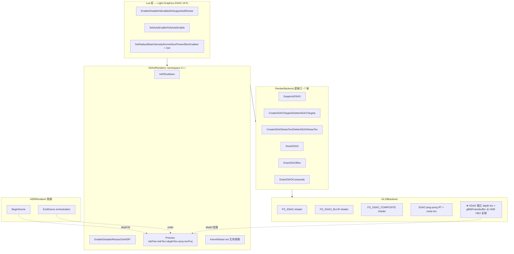
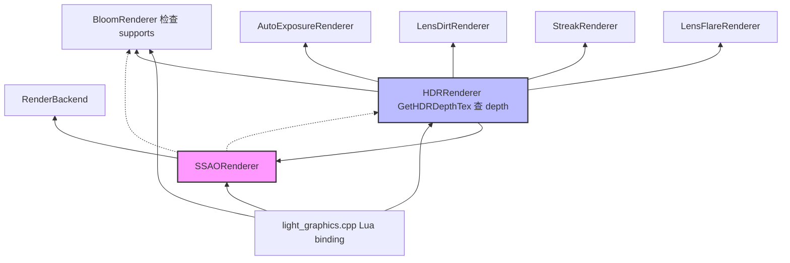

# DESIGN — Phase E.8 · SSAO (Screen-Space Ambient Occlusion)

> 6A 工作流 · 阶段 2 · Architect
> 基于 `ALIGNMENT_PhaseE_8.md` 推导：系统分层 + 接口契约 + 数据流 + 异常策略。

---

## 1. 整体架构图



---

## 2. 分层设计与核心组件

### 2.1 GL33Backend 层（最底，~400 行新代码）

**新增组件**：

| 组件 | 作用 | 资源 |
|------|------|------|
| `FS_SSAO_SOURCE` | raw AO 计算 shader (双 profile: GLES3 + GL33) | 1 program |
| `FS_SSAO_BLUR_SOURCE` | 双边分离滤波 shader | 1 program |
| `FS_SSAO_COMPOSITE_SOURCE` | HDR × AO 调制 shader | 1 program |
| `ssaoNoiseTex` | 4×4 RGBA8 noise texture (GL_REPEAT) | 1 texture |
| `ssaoKernel[16]` | CPU 预生成半球采样方向 vec3[16] | uniform array |
| `programSSAO / programSSAOBlur / programSSAOComposite` | GL shader programs | 3 GLuint |
| `locSSAO_*` / `locSSAOBlur_*` / `locSSAOComp_*` | Uniform locations cache | GLint |
| `ssaoSupported` | `tonemapSupported && bloomSupported` | bool |

**【用户选择：双 RT 旁路】SSAO 独立 depth 纹理 + blit 复制**

方案：HDR RT **完全不变**（保留 `GL_DEPTH_COMPONENT24 renderbuffer`）；SSAO 模块在 `Enable(w,h)` 时另外分配一张 **独立 depth texture**（同分辨率），并创建一个 小 FBO（仅用于 blit）；在 `Process()` 入口先用 `glBlitFramebuffer` 从 HDR FBO 复制 depth 到 SSAO depth tex：

```cpp
// Phase E.8 核心: 旁路 depth blit (零侵入 HDR)
void BlitHDRDepthToSSAO(GLuint hdrFbo, GLuint ssaoDepthFbo, int w, int h) {
    glBindFramebuffer(GL_READ_FRAMEBUFFER, hdrFbo);
    glBindFramebuffer(GL_DRAW_FRAMEBUFFER, ssaoDepthFbo);
    glBlitFramebuffer(0, 0, w, h, 0, 0, w, h,
                      GL_DEPTH_BUFFER_BIT, GL_NEAREST);
    glBindFramebuffer(GL_FRAMEBUFFER, 0);
}
```

**SSAO depth RT 创建（SSAORenderer::Enable 时）**：

```cpp
// 1. 创建 depth texture (SSAO 可采样)
GLuint ssaoDepthTex = 0;
glGenTextures(1, &ssaoDepthTex);
glBindTexture(GL_TEXTURE_2D, ssaoDepthTex);
glTexImage2D(GL_TEXTURE_2D, 0, GL_DEPTH_COMPONENT24, w, h, 0,
             GL_DEPTH_COMPONENT, GL_UNSIGNED_INT, nullptr);
glTexParameteri(GL_TEXTURE_2D, GL_TEXTURE_MIN_FILTER, GL_NEAREST);
glTexParameteri(GL_TEXTURE_2D, GL_TEXTURE_MAG_FILTER, GL_NEAREST);
glTexParameteri(GL_TEXTURE_2D, GL_TEXTURE_WRAP_S,     GL_CLAMP_TO_EDGE);
glTexParameteri(GL_TEXTURE_2D, GL_TEXTURE_WRAP_T,     GL_CLAMP_TO_EDGE);

// 2. 小 FBO 仅用于 blit 目标 (无 color attachment)
GLuint ssaoDepthFbo = 0;
glGenFramebuffers(1, &ssaoDepthFbo);
glBindFramebuffer(GL_FRAMEBUFFER, ssaoDepthFbo);
glFramebufferTexture2D(GL_FRAMEBUFFER, GL_DEPTH_ATTACHMENT, GL_TEXTURE_2D, ssaoDepthTex, 0);
glDrawBuffer(GL_NONE);   // 无 color attachment
glReadBuffer(GL_NONE);
// 验证 completeness...
```

**优点**：
- HDR RT 创建 / 销毁 / Resize 代码零改动（所有现有 demo 行为 100% 不变）
- `glBlitFramebuffer` 是 GPU 原生操作，开销、带宽极低（通常 < 0.1 ms 全标紧 blit）
- 用户 API 完全透明：`SSAO.Enable(w,h)` 一键即用，无需包住 3D 绘制段
- 旧驱动如果不支持 `glBlitFramebuffer` 或 depth blit，在 Init 时探测到失败 → `supported = false` 降级

**新增虚接口实现**：

```cpp
bool SupportsSSAO() const override { return ssaoSupported; }

// Phase E.8.1: depth tex + FBO 创建 / 销毁 (blit 目标)
bool CreateSSAODepthRT(int w, int h, uint32_t* outFbo, uint32_t* outTex) override;
void DeleteSSAODepthRT(uint32_t fbo, uint32_t tex) override;

// Phase E.8.1: 旁路 blit — 从 HDR FBO 复制 depth 到 SSAO depth FBO
void BlitHDRDepthToSSAO(uint32_t hdrFbo, uint32_t ssaoDepthFbo, int w, int h) override;

// Phase E.8.1: AO ping-pong RT (R16F, 1/2 分辨率)
bool CreateSSAOTargets(int w, int h, uint32_t* fbos, uint32_t* texs,
                        int* outW, int* outH) override;
void DeleteSSAOTargets(uint32_t* fbos, uint32_t* texs) override;

uint32_t CreateSSAONoiseTex() override;           // 4x4 RGBA8 noise
void     DeleteSSAONoiseTex(uint32_t tex) override;

void DrawSSAO(uint32_t depthTex, uint32_t noiseTex, uint32_t dstFbo,
              int w, int h,
              const float* projMat4, const float* invProjMat4,
              const float* kernel, int kernelSize,
              float radius, float bias, float power) override;

void DrawSSAOBlur(uint32_t srcAOTex, uint32_t depthTex, uint32_t dstFbo,
                  int w, int h, int axis) override;   // axis: 0=horiz, 1=vert

void DrawSSAOComposite(uint32_t aoTex, uint32_t dstFbo,
                        int w, int h, float intensity) override;
```

### 2.2 SSAORenderer 模块层（~300 行新代码）

**Public API**（27 C++ fn，对齐 LensFlareRenderer 风格）：

```cpp
namespace SSAORenderer {

// Lifecycle
bool Init();                    // backend check + supported flag
void Shutdown();                // 释放所有资源

// Public runtime API
bool Enable(int w, int h);      // 创建 ping-pong RT + noise + kernel
bool Disable();                  // 释放 RT/noise/kernel
bool IsEnabled();
bool IsSupported();
bool Resize(int w, int h);

// HDR 联动 (hdr_renderer.cpp 调用)
void OnHDREnabled(int w, int h);
void OnHDRDisabled();
void OnHDRResized(int w, int h);

// AutoEnable
void SetAutoEnable(bool flag);
bool GetAutoEnable();

// Params getter/setter (12 fn = 6 对)
void  SetRadius(float v);        float GetRadius();
void  SetBias(float v);           float GetBias();
void  SetIntensity(float v);     float GetIntensity();
void  SetKernelSize(int n);      int   GetKernelSize();
void  SetPower(float v);          float GetPower();
void  SetBlurEnabled(bool flag); bool  GetBlurEnabled();

// 管线调用
//   hdrFbo/hdrTex: 主 HDR RT (将被 composite pass 覆盖写)
//   depthTex:      HDR RT 的 depth texture (从 Backend::GetHDRDepthTex 取)
//   projMat4:      当前透视投影矩阵 (SSAO 需要重建 view-space pos)
//   invProjMat4:   inverse(projection)
void Process(uint32_t hdrFbo, uint32_t hdrTex, uint32_t depthTex,
              const float* projMat4, const float* invProjMat4);

}  // namespace
```

**State 结构**：

```cpp
struct State {
    bool     enabled        = false;
    bool     supported      = false;
    bool     autoEnable     = false;

    RenderBackend* backend  = nullptr;

    // Phase E.8 双 RT 旁路: 独立 depth tex + FBO (blit 目标)
    uint32_t depthFbo       = 0;         // blit 目标 FBO (仅 depth attachment)
    uint32_t depthTex       = 0;         // full-res depth texture

    // AO ping-pong: [0] raw, [1] blur temp (半分辨率)
    uint32_t fbos[2]        = {0, 0};
    uint32_t texs[2]        = {0, 0};    // R16F half-res
    uint32_t noiseTex       = 0;          // 4x4 RGBA8
    int      rtW            = 0;
    int      rtH            = 0;          // 1/2 HDR RT
    int      srcW           = 0;
    int      srcH           = 0;          // full-res HDR RT

    // 16 half-sphere Hammersley sample directions
    float    kernel[16 * 3] = {0};
    int      kernelGenerated = 0;          // 生成的 vec3 数量 (实际用 kernelSize)

    // 参数
    float    radius         = 0.5f;
    float    bias           = 0.025f;
    float    intensity      = 1.0f;
    int      kernelSize     = 16;
    float    power          = 2.0f;
    bool     blurEnabled    = true;
};
```

### 2.3 Lua 层（~240 行 `light_graphics.cpp` 追加）

19 binding + 1 子表注册，**完全对称 Phase E.7 LensFlare 风格**：

```cpp
// 5 lifecycle + 2 auto + 12 params
static const luaL_Reg ssao_funcs[] = {
    {"Enable",          l_SSAO_Enable},
    {"Disable",         l_SSAO_Disable},
    {"IsEnabled",       l_SSAO_IsEnabled},
    {"IsSupported",     l_SSAO_IsSupported},
    {"Resize",          l_SSAO_Resize},
    {"SetAutoEnable",   l_SSAO_SetAutoEnable},
    {"GetAutoEnable",   l_SSAO_GetAutoEnable},
    {"SetRadius",       l_SSAO_SetRadius},
    {"GetRadius",       l_SSAO_GetRadius},
    {"SetBias",         l_SSAO_SetBias},
    {"GetBias",         l_SSAO_GetBias},
    {"SetIntensity",    l_SSAO_SetIntensity},
    {"GetIntensity",    l_SSAO_GetIntensity},
    {"SetKernelSize",   l_SSAO_SetKernelSize},
    {"GetKernelSize",   l_SSAO_GetKernelSize},
    {"SetPower",        l_SSAO_SetPower},
    {"GetPower",        l_SSAO_GetPower},
    {"SetBlurEnabled",  l_SSAO_SetBlurEnabled},
    {"GetBlurEnabled",  l_SSAO_GetBlurEnabled},
    {NULL, NULL}
};
```

---

## 3. 模块依赖关系图



**关键不变式**：

- `SSAORenderer` 永远依赖 `RenderBackend`（虚接口调用）
- `SSAORenderer.Supported = RenderBackend.SupportsSSAO() && BloomRenderer.Supported`
- `HDRRenderer` 持有所有后处理 renderer 的调度权
- **无循环依赖**

---

## 4. 接口契约定义

### 4.1 后端虚接口（render_backend.h 追加）

```cpp
/// ==================== Phase E.8 — SSAO ====================
virtual bool SupportsSSAO() const { return false; }

/// Phase E.8 双 RT 旁路: 创建 SSAO 专用 depth tex + FBO (无 color attachment)
/// @param w,h      与 HDR RT 同尺寸 (用于 full-res blit)
/// @param outFbo   输出 FBO (仅 GL_DEPTH_ATTACHMENT, glDrawBuffer=GL_NONE)
/// @param outTex   输出 depth texture (NEAREST + CLAMP_TO_EDGE)
/// @return true=成功; 失败时 outFbo/outTex = 0
virtual bool CreateSSAODepthRT(int /*w*/, int /*h*/,
                                uint32_t* /*outFbo*/, uint32_t* /*outTex*/) { return false; }
virtual void DeleteSSAODepthRT(uint32_t /*fbo*/, uint32_t /*tex*/) {}

/// Phase E.8 旁路核心: 用 glBlitFramebuffer 从 HDR FBO 复制 depth 到 SSAO FBO
/// @note 在每帧 SSAORenderer::Process() 入口调用，GL_DEPTH_BUFFER_BIT + GL_NEAREST
virtual void BlitHDRDepthToSSAO(uint32_t /*hdrFbo*/, uint32_t /*ssaoDepthFbo*/,
                                 int /*w*/, int /*h*/) {}

/// 创建 SSAO ping-pong RT:
///   [0] raw AO    (R16F, 半分辨率)
///   [1] blur temp (R16F, 半分辨率)
/// @return true=成功; 失败时 fbos/texs 清零
virtual bool CreateSSAOTargets(int /*w*/, int /*h*/,
                                uint32_t* /*fbos*/, uint32_t* /*texs*/,
                                int* /*outW*/, int* /*outH*/) { return false; }

virtual void DeleteSSAOTargets(uint32_t* /*fbos*/, uint32_t* /*texs*/) {}

/// 创建 4x4 RGBA8 noise texture (REPEAT wrap, NEAREST filter)
/// 每像素 RGB = 归一化随机 (x,y,0) 向量 (z=0 保证切空间旋转不出半球)
virtual uint32_t CreateSSAONoiseTex() { return 0; }
virtual void     DeleteSSAONoiseTex(uint32_t /*tex*/) {}

/// SSAO raw pass: depthTex → dstFbo[0]
/// @param kernel     vec3[kernelSize] CPU 侧预生成的半球采样方向
/// @param kernelSize 8 或 16
virtual void DrawSSAO(uint32_t /*depthTex*/, uint32_t /*noiseTex*/, uint32_t /*dstFbo*/,
                      int /*w*/, int /*h*/,
                      const float* /*projMat4*/, const float* /*invProjMat4*/,
                      const float* /*kernel*/, int /*kernelSize*/,
                      float /*radius*/, float /*bias*/, float /*power*/) {}

/// 双边分离滤波: srcAO + depthTex → dstFbo
/// @param axis 0=水平; 1=垂直
virtual void DrawSSAOBlur(uint32_t /*srcAOTex*/, uint32_t /*depthTex*/, uint32_t /*dstFbo*/,
                          int /*w*/, int /*h*/, int /*axis*/) {}

/// Composite: HDR *= mix(1.0, aoTex.r, intensity)
virtual void DrawSSAOComposite(uint32_t /*aoTex*/, uint32_t /*dstFbo*/,
                                int /*w*/, int /*h*/,
                                float /*intensity*/) {}
```

### 4.2 SSAORenderer::Process 契约

```cpp
/// @brief 执行 SSAO 完整管线: blit depth → raw → blur (2 pass) → composite
///
/// 内部自检:
///   - g.enabled == true
///   - g.supported == true
///   - backend != nullptr
///   - depthFbo, depthTex, fbos[0], fbos[1], noiseTex, hdrFbo, hdrTex 全非 0
///   - projMat4 / invProjMat4 非 nullptr
/// 任一条件失败 → no-op 安全退出
///
/// 管线 (blurEnabled=true 时):
///   0. BlitHDRDepthToSSAO(hdrFbo, depthFbo, srcW, srcH)    ← 双 RT 旁路
///   1. DrawSSAO(depthTex, noiseTex, fbos[0], rtW, rtH, proj, invProj, kernel, ...)
///   2. DrawSSAOBlur(texs[0], depthTex, fbos[1], rtW, rtH, axis=0)
///   3. DrawSSAOBlur(texs[1], depthTex, fbos[0], rtW, rtH, axis=1)
///   4. DrawSSAOComposite(texs[0], hdrFbo, srcW, srcH, intensity)
///
/// 管线 (blurEnabled=false 时):
///   0. BlitHDRDepthToSSAO(hdrFbo, depthFbo, srcW, srcH)
///   1. DrawSSAO(depthTex, noiseTex, fbos[0], rtW, rtH, ...)
///   2. DrawSSAOComposite(texs[0], hdrFbo, srcW, srcH, intensity)
///
/// Phase E.8 双 RT 旁路: 调用方不再传 depthTex; SSAO 管自己的 depthTex
void Process(uint32_t hdrFbo, uint32_t hdrTex,
              const float* projMat4, const float* invProjMat4);
```

### 4.3 HDRRenderer 联动契约

在 `hdr_renderer.cpp` 内新增 5 处联动（对齐 Phase E.7 LensFlare 模式）：

```cpp
// 1. HDRRenderer::Enable 成功后:
SSAORenderer::OnHDREnabled(w, h);
// 内部: 若 autoEnable = true 则 Enable

// 2. HDRRenderer::Disable 前 (最后反序):
//    Bloom < AE < LensDirt < Streak < LensFlare < SSAO   ← SSAO 最先关
//    (理由: SSAO 依赖 HDR depth texture, HDR 消亡前 SSAO 必须先清理 RT)
SSAORenderer::OnHDRDisabled();

// 3. HDRRenderer::Resize:
SSAORenderer::OnHDRResized(w, h);

// 4. HDRRenderer::EndScene 管线序:
//    Phase E.8 双 RT 旁路: Process 内部自己做 depth blit, 调用方无需传 depthTex
SSAORenderer::Process(hdrFbo, hdrTex, currentProj, currentInvProj);
// ★ SSAO 必须在 Bloom 之前 (AO 是暗部加深, 应在 bright pass 前完成)
BloomRenderer::Process(...);
AutoExposureRenderer::Process(...);
LensDirtRenderer::Process(...);
StreakRenderer::Process(...);
LensFlareRenderer::Process(...);

// 5. HDRRenderer::Pause/Resume: SSAO 无需联动 (RT 持久; 下次 Process 时 hdrFbo 重绑)
```

**projection/invProj 供给**：`HDRRenderer` 需要从 `RenderBackend` 拿当前 projection 矩阵，新增 `GetProjectionMatrix(float out[16])` 虚接口。**决策**：新增 `RenderBackend::GetProjection(float* out16)` 和 `GetView(float* out16)` 两个 getter，从 `@render_gl33.cpp:1410` `projection` 字段直接 memcpy 返回。`invProj` 在 `SSAORenderer::Process` 内部用 `Mat4::Inverse()` 计算。

---

## 5. 数据流向图

```
──────── 用户 Lua (每帧) ────────

BeginFrame
  ↓
SetPerspective(fovY, aspect, near, far)   -- 3D 场景必需
SetCamera(ex,ey,ez, tx,ty,tz)              -- LookAt
SetDepthTest(true)                         -- 开 depth test
Graphics.SSAO.Enable(w,h)                  -- 只需 1 次; 或 autoEnable

BeginScene (HDR)    [HDR RT color + depth TEXTURE 绑定]
  mesh:Draw(material)   × N            -- 写 HDR color + HDR depth
EndScene:
  ↓
  SSAORenderer::Process(hdrFbo, hdrTex, depthTex, proj, invProj):
    ┌─ Pass 1 ────────────────────────────────────┐
    │ depthTex + noiseTex → AO raw (R16F, 1/2 res) │
    │ shader: 重建 view pos + normal, 16 采样       │
    └──────────────────────────────────────────────┘
    ↓
    ┌─ Pass 2 (blurEnabled) ─────────────────────┐
    │ AO raw → AO blur_h (水平 5-tap bilateral)   │
    │ AO blur_h → AO blur_v (垂直 5-tap bilateral) │
    └──────────────────────────────────────────────┘
    ↓
    ┌─ Pass 3 composite ─────────────────────────┐
    │ HDR RT *= mix(1.0, AO.r, intensity)        │
    └──────────────────────────────────────────────┘
  ↓
  BloomRenderer::Process
  AutoExposureRenderer::Process
  LensDirtRenderer::Process
  StreakRenderer::Process
  LensFlareRenderer::Process
  ↓
  Tonemap → backbuffer
EndFrame
```

---

## 6. 异常处理策略

### 6.1 分层失败降级

| 层 | 失败点 | 降级 |
|------|-------|------|
| **Backend** | SSAO shader 编译失败 | `ssaoSupported = false`；`SupportsSSAO()` 返回 false |
| **Backend** | noise tex 生成失败 | `CreateSSAONoiseTex` 返回 0；Renderer Enable 失败 |
| **Backend** | SSAO RT 创建失败 | `CreateSSAOTargets` 返回 false + fbos/texs 清零 |
| **Backend** | SSAO depth RT 创建失败 | `CreateSSAODepthRT` 返回 false + outFbo/outTex = 0 |
| **Backend** | glBlitFramebuffer depth blit 旧驱动不支持 | Init 时探测。SSAO `supported = false` |
| **Module** | `Process` 参数验证失败 | 静默 no-op (不崩不 log) |
| **Module** | `Enable(w, h)` 重复调 | 幂等: 已启用则释放旧资源再建 |
| **Module** | `Resize(w, h)` 尺寸不变 | fast path skip |
| **Lua** | 用户传非法参数 | `luaL_error` 提示；参数 clamp 到合法域 |

### 6.2 降级矩阵

```
┌─────────────────────────────────────────────┐
│  Legacy Backend (GL 1.x)                   │
│    SupportsSSAO = false                    │
│    全链路 no-op                            │
├─────────────────────────────────────────────┤
│  GL33 但 glBlitFramebuffer depth 受限 (极少) │
│    InitSSAO 探测失败 → ssaoSupported = false │
│    IsSupported() == false, Enable() 返 false │
├─────────────────────────────────────────────┤
│  GL33 正常                                  │
│    SSAO 全链路工作                         │
└─────────────────────────────────────────────┘
```

### 6.3 Blit depth 兼容性验证（Init 阶段探测）

```cpp
// InitSSAO() 时探测:
void ProbeBlitDepthSupport() {
    // 1. 创建 1x1 HDR FBO (color tex + depth RB)
    // 2. 创建 1x1 SSAO depth tex + FBO
    // 3. 尝试 glBlitFramebuffer(.., GL_DEPTH_BUFFER_BIT, GL_NEAREST)
    // 4. glGetError() 检查是否 GL_INVALID_OPERATION
    // 5. 失败 → ssaoSupported = false; 清理临时资源
}
```

---

## 7. 算法关键 shader 草案

### 7.1 FS_SSAO（核心）

```glsl
#version 330 core
in vec2 vUV;
uniform sampler2D uDepthTex;       // full-res HDR depth
uniform sampler2D uNoiseTex;       // 4x4 RGBA8 (REPEAT)
uniform mat4      uProj;           // 当前透视投影
uniform mat4      uInvProj;        // inverse(uProj)
uniform vec3      uKernel[16];     // 半球采样方向 (tangent space)
uniform int       uKernelSize;     // 8 or 16
uniform float     uRadius;
uniform float     uBias;
uniform float     uPower;
uniform vec2      uNoiseScale;     // screen / 4.0
out vec4          FragColor;

vec3 ReconstructViewPos(vec2 uv, float depth) {
    vec4 clip = vec4(uv * 2.0 - 1.0, depth * 2.0 - 1.0, 1.0);
    vec4 view = uInvProj * clip;
    return view.xyz / view.w;
}

vec3 ReconstructViewNormal(vec3 posV) {
    return normalize(cross(dFdy(posV), dFdx(posV)));
}

void main() {
    float d = texture(uDepthTex, vUV).r;
    if (d >= 1.0) { FragColor = vec4(1.0); return; }   // 天空/无几何 → no AO

    vec3 P = ReconstructViewPos(vUV, d);
    vec3 N = ReconstructViewNormal(P);
    vec3 R = texture(uNoiseTex, vUV * uNoiseScale).xyz * 2.0 - 1.0;
    R = normalize(vec3(R.xy, 0.0));

    vec3 T = normalize(R - N * dot(R, N));
    vec3 B = cross(N, T);
    mat3 TBN = mat3(T, B, N);

    float occlusion = 0.0;
    for (int i = 0; i < 16; i++) {
        if (i >= uKernelSize) break;
        vec3 samp = TBN * uKernel[i];
        samp = P + samp * uRadius;

        vec4 proj = uProj * vec4(samp, 1.0);
        proj.xyz /= proj.w;
        vec2 sampUV = proj.xy * 0.5 + 0.5;

        float sampDepth = texture(uDepthTex, sampUV).r;
        vec3 sampP = ReconstructViewPos(sampUV, sampDepth);
        float rangeCheck = smoothstep(0.0, 1.0, uRadius / abs(P.z - sampP.z));
        occlusion += (sampP.z >= samp.z + uBias ? 1.0 : 0.0) * rangeCheck;
    }
    float ao = 1.0 - occlusion / float(uKernelSize);
    ao = pow(ao, uPower);
    FragColor = vec4(ao, ao, ao, 1.0);
}
```

### 7.2 FS_SSAO_BLUR（双边分离）

```glsl
#version 330 core
in vec2 vUV;
uniform sampler2D uSSAOTex;
uniform sampler2D uDepthTex;
uniform vec2      uTexel;        // 1/w, 1/h
uniform int       uAxis;         // 0=h, 1=v
out vec4          FragColor;

void main() {
    vec2 dir = (uAxis == 0) ? vec2(uTexel.x, 0.0) : vec2(0.0, uTexel.y);
    float cDepth = texture(uDepthTex, vUV).r;
    float sum = 0.0, wsum = 0.0;
    for (int i = -2; i <= 2; i++) {
        vec2 uv = vUV + dir * float(i);
        float ao = texture(uSSAOTex, uv).r;
        float d  = texture(uDepthTex, uv).r;
        float w  = exp(-abs(cDepth - d) * 200.0);   // depth 差异 falloff
        sum  += ao * w;
        wsum += w;
    }
    float o = sum / max(wsum, 1e-4);
    FragColor = vec4(o, o, o, 1.0);
}
```

### 7.3 FS_SSAO_COMPOSITE

```glsl
#version 330 core
in vec2 vUV;
uniform sampler2D uSceneTex;   // HDR color
uniform sampler2D uAOTex;
uniform float     uIntensity;
out vec4          FragColor;
void main() {
    vec3 hdr = texture(uSceneTex, vUV).rgb;
    float ao = texture(uAOTex, vUV).r;
    float o = mix(1.0, ao, uIntensity);
    FragColor = vec4(hdr * o, 1.0);
}
```

> **注意**：composite pass 需要采到当前 HDR RT 内容，但目标也是 HDR RT → 需先 copy HDR RT 到临时 tex，或用 ping-pong。**决策**：直接把 `texs[0]` 作为输入（其实这里是 AO tex），HDR 是 srcTex；现有 `DrawBloomComposite` 能复用吗？不行，Bloom composite 是 additive。SSAO 是 multiplicative。**实际做法**：SSAO composite 需要 **读 HDR 写 HDR**，违反 feedback loop — 必须临时 blit HDR 到 `texs[1]`，再从 `texs[1]` 读、写回 HDR FBO。或者新增 Backend `CopyHDRToTemp()`。**最简实现**：SSAO composite 输出到 `texs[1]`（full-res），然后再 blit 回 HDR RT。但 `texs[0]` 和 `texs[1]` 是半分辨率。**最终决策**：**新增 `fbos[2]` / `texs[2]` 的 composite temp RT（full-res RGBA16F）**，或直接借用 Bloom pyramid 底层 RT。

**简化决策**：为避免复杂，改用 **RT[2] 共 3 张，其中 [0]/[1] 是半分辨率 AO，[2] 是 full-res composite temp**。或者通过 framebuffer blit + tex copy 避免重复 RT。

**最终实施方案**：`composite` pass 输入是 `hdrTex + aoTex(半res blur)`，输出到新的 `compFbo` (full-res RGBA16F)，再用 `glBlitFramebuffer` 或一次性再走一个 copy pass 写回 HDR FBO。**或者更简单**：让 `composite` pass 的输入 HDR 用 Bloom 的现有 temp RT（若有）。

**折中结论**：本 Phase 直接让 `composite` pass 读 HDR tex 写到一个新 full-res RGBA16F RT `texs[2]`，再 `glBlitFramebuffer` 回 HDR FBO。代码虽多一步 blit，但清晰无陷阱。**State.fbos/texs 数组扩到 3**。

---

## 8. 实施检查列表（交付 Architect 阶段前）

- [x] 架构图清晰（Lua→Module→Backend→GL33）
- [x] 接口定义完整（7 新虚接口 + 27 Renderer fn + 19 Lua fn）
- [x] 数据流向清晰（SSAO 插入 Bloom 之前）
- [x] 模块依赖无循环
- [x] 异常处理分层（Legacy no-op / 驱动不支持 GetHDRDepthTex=0 降级 / 参数非法 clamp）
- [x] HDR depth 升级策略（RB → texture，零行为变化）
- [x] composite feedback loop 规避（texs[2] full-res temp + blit）
- [x] shader 算法草案覆盖 3 passes
- [x] projection/invProj 供给路径（新增 Backend::GetProjection/View）

---

**Architect 阶段完成**。下一步：进入 **Atomize** 阶段，输出 `TASK_PhaseE_8.md`（原子任务拆分 + 输入/输出契约 + 依赖图）。
