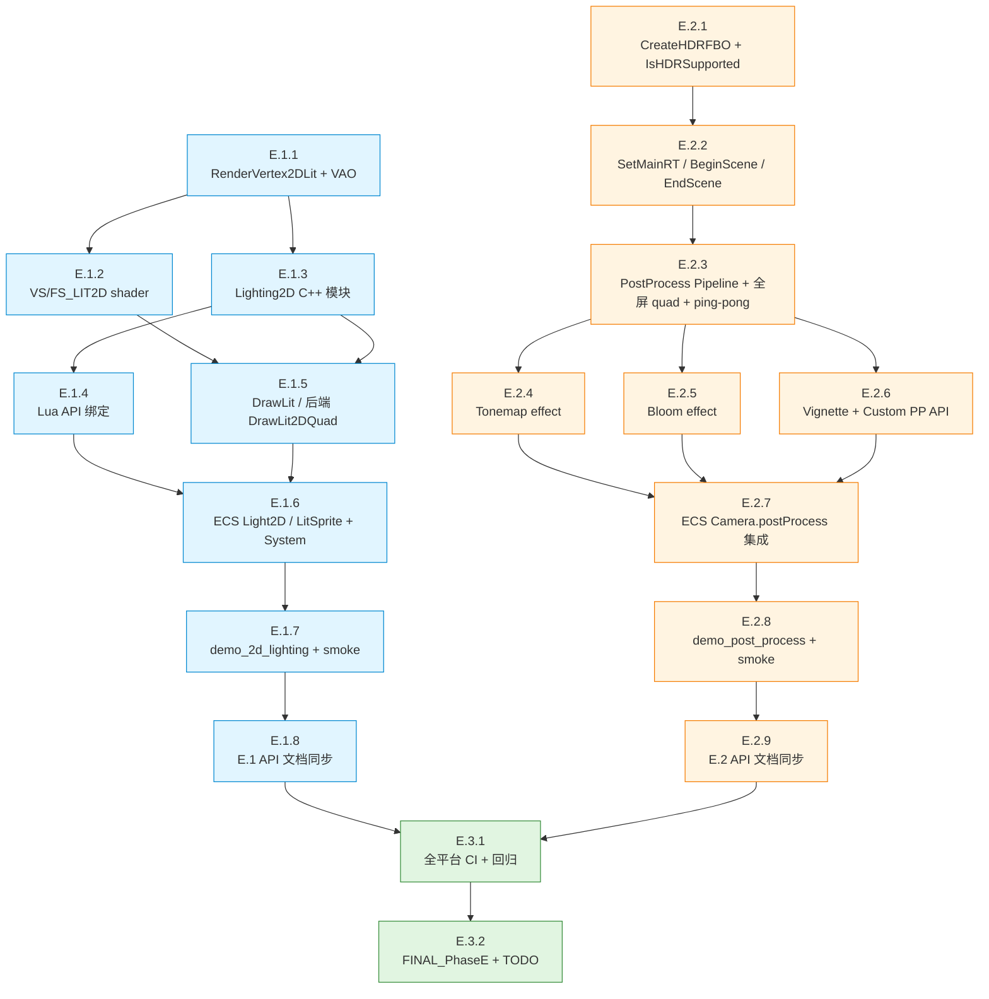

# TASK — Phase E 渲染管线升级 · 原子任务拆分

> 6A 工作流 · 阶段 3 · 原子化（Atomize）
> 基于 `DESIGN_PhaseE_1.md` / `DESIGN_PhaseE_2.md`，把任务拆分为可独立验证、低复杂度的原子任务。

---

## 1. 总体依赖图

---

## 2. 并行机会

| 可并行执行 | 说明 |
|------------|------|
| E.1 与 E.2 整体 | 仅在最后 E.27 之前不汇合，可分两条线推进 |
| E.1.2 (shader) ↔ E.1.3 (Lighting2D C++) | 都依赖 E.1.1 但互不依赖 |
| E.2.4 / E.2.5 / E.2.6 (三个 effect) | 都依赖 E.2.3，互不依赖，可并行 |

---

## 3. E.1 — 2D 灯光（原子任务）

### E.1.1 — RenderVertex2DLit + VAO 基础设施

**输入契约**
- 前置依赖：无（独立起点）
- 输入数据：`render_backend.h` 现有 `RenderVertex` 结构定义
- 环境依赖：GL 3.3 Core / GLES 3.0

**输出契约**
- 交付物：
  - `render_backend.h`：新增 `struct RenderVertex2DLit` (64 字节) + `static_assert`
  - `render_backend.h`：新增虚接口 `SupportsLit2D / CreateLit2DMesh / DrawLit2DQuad / DrawLit2DTriangles` (默认 no-op)
  - `render_gl33.cpp`：在 `GL33Backend` 类内新增 `vaoLit2D / vboLit2D / eboLit2D` 字段 + `InitLit2D()` / `DeinitLit2D()` 函数（仅创建/释放 GL 对象，shader 在 E.1.2 接入）

**实现约束**
- 64 字节 = pos(12) + uv(8) + color(16) + normal(12) + tangent(16)
- VBO 用 `GL_DYNAMIC_DRAW`（每帧重填 4 顶点）
- EBO 静态：`[0, 1, 2, 0, 2, 3]` 单 quad（更大场景由 batch 时升级）

**依赖关系**
- 后置：E.1.2 (shader), E.1.3 (模块), E.1.5 (绘制)

**验收标准**
- [ ] `static_assert(sizeof(RenderVertex2DLit) == 64)` 通过
- [ ] `GL33Backend::SupportsLit2D()` 返回 true（程序未编译前可能临时 false）
- [ ] 编译通过（无新 warning）
- [ ] 单元测试（如果有 GTest 框架）或 smoke：`RenderBackend::SupportsLit2D() == true`

**工作量估计**：~1 小时

---

### E.1.2 — VS_LIT2D + FS_LIT2D Shader

**输入契约**
- 前置依赖：E.1.1（VAO 属性 layout 已定义）
- 环境依赖：GLSL 330 core / GLSL ES 300

**输出契约**
- 交付物：
  - `render_gl33.cpp`：新增 `VS_LIT2D_SOURCE` / `FS_LIT2D_SOURCE` 字符串常量（GLES 3.0 / GL 3.3 两套版本）
  - `render_gl33.cpp`：`GL33Backend::InitLit2D()` 内编译 + link `programLit2D`
  - `render_gl33.cpp`：`GL33Backend::CompileLit2DShader()` helper（含错误日志）

**实现约束**
- Shader 必须兼容 GLES 3.0（精度限定符、`textureSize`、`smoothstep`、uniform loop）
- 16 个 light 用 uniform array
- 多 light loop 中用 `break` 在 `i >= uLightCount` 时退出（GLES 3.0 允许 uniform-bound loop）
- normal map 默认 flat (0,0,1)

**依赖关系**
- 前置：E.1.1
- 后置：E.1.5（绘制时用 programLit2D）

**验收标准**
- [ ] Init() 时编译/link 成功（无 shader error log）
- [ ] `glGetUniformLocation` 拿到所有预期 uniform：`uMVP, uModel, uTexture, uNormalMap, uHasNormalMap, uLightCount, uLightType[0..15], ..., uAmbient`
- [ ] 在不支持 GL 3.3 的 Legacy 后端上 `SupportsLit2D() == false`

**工作量估计**：~3 小时（含 shader 调试）

---

### E.1.3 — Lighting2D C++ 模块

**输入契约**
- 前置依赖：E.1.1（VAO 已就绪，不需要 shader）
- 环境依赖：Lua 5.1 / C++ 17

**输出契约**
- 交付物：
  - `ChocoLight/src/light_lighting2d.cpp`（新文件，~400 行）
  - 包含：
    - `namespace Lighting2D` 命名空间
    - `struct Light` / `struct State`
    - 单例 `State* GetState()`
    - C-level API：`Add / Update / Remove / Clear / SetAmbient`
    - `UploadToShader(RenderBackend* backend, uint32_t programId)` helper（暂时 no-op，待 E.1.5 接入）
  - `ChocoLight/CMakeLists.txt` 加 `light_lighting2d.cpp`

**实现约束**
- `Lighting2D::State` 用 16 个 `Light` 数组（POD，可栈分配）
- innerCos/outerCos 由 angle 转换得到（C++ 端一次 cos）
- 不暴露 Lua binding（E.1.4 单独做）

**依赖关系**
- 前置：E.1.1
- 后置：E.1.4 (Lua 绑定), E.1.5 (绘制时上传)

**验收标准**
- [ ] 编译通过
- [ ] 单元测试或 smoke：
  - Add 16 个 light 后第 17 个返回 0
  - Update(invalidId) 返回 false
  - Clear 后 active_count = 0

**工作量估计**：~3 小时

---

### E.1.4 — Lua API 绑定 `Light.Lighting2D`

**输入契约**
- 前置依赖：E.1.3
- 输入数据：CONSENSUS 第 2.1 节 API 表

**输出契约**
- 交付物：
  - `light_lighting2d.cpp` 末尾新增 Lua binding：
    - `l_SetEnabled / l_IsEnabled`
    - `l_SetAmbient / l_GetAmbient`
    - `l_AddPointLight / l_AddSpotLight`
    - `l_UpdateLight / l_RemoveLight / l_ClearLights`
    - `l_GetLightCount / l_GetMaxLights`
  - `luaopen_Light_Lighting2D(lua_State* L)`
  - 在 `light.cpp` 主入口注册

**实现约束**
- `AddPointLight({x, y, color={r,g,b}, range, intensity})` — 用 table 参数，缺省值有 default
- 颜色用 nested table `{r,g,b}`（与 Sprite component 风格一致）
- 返回值：失败返回 `nil`，成功返回 lightId
- 所有 API 含 `@lua_api` 注释（供文档生成）

**依赖关系**
- 前置：E.1.3
- 后置：E.1.6 (ECS 调用)

**验收标准**
- [ ] `scripts/smoke/lighting2d.lua` 可调全部 API 无错
- [ ] `Light.Lighting2D.GetMaxLights() == 16`
- [ ] Add 17 个返回 nil
- [ ] UpdateLight 部分字段更新生效

**工作量估计**：~2 小时

---

### E.1.5 — `Light.Graphics.DrawLit` + 后端 `DrawLit2DQuad`

**输入契约**
- 前置依赖：E.1.2 (shader), E.1.3 (lighting state)
- 输入数据：调用方提供 image + 可选 normalMap + transform

**输出契约**
- 交付物：
  - `render_gl33.cpp`：实现 `DrawLit2DQuad(verts, baseColorTex, normalMapTex)`
    - glUseProgram(programLit2D)
    - 绑定 texture (slot 0/1)
    - 上传 MVP/Model/HasNormalMap uniforms
    - 调 `Lighting2D::UploadToShader(this, programLit2D)`
    - glBindVertexArray + glBufferSubData + glDrawElements
    - 切回默认 2D shader（与 DrawMeshMaterial 一致）
  - `render_gl33.cpp`：补全 `Lighting2D::UploadToShader` 实现（lightType[]/lightPos[]/... uniform 上传）
  - `light_graphics.cpp`：实现 `l_DrawLit(image, normalMap, x, y, ...)` + `l_DrawLitQuad(image, normalMap, x, y, qx, qy, qw, qh)`
  - 在 `Light.Graphics` table 注册

**实现约束**
- 默认 normal (0,0,1)、tangent (1,0,0,1) — 平面 sprite
- 4 个顶点位置按 anchor 偏移计算（与现有 Draw 一致）
- normalMap 参数为 nil 时不绑定 slot 1，`uHasNormalMap=0`
- transform 参数与 `l_Draw` 完全一致（rot/sx/sy/ox/oy/skewX/skewY）

**依赖关系**
- 前置：E.1.2, E.1.3
- 后置：E.1.6, E.1.7

**验收标准**
- [ ] `Light.Graphics.DrawLit(img, nil, 100, 100)` 单 sprite 正常显示（无光时为黑色或 ambient 色）
- [ ] 添加 1 个 point light + ambient(0.2,0.2,0.2) 后 sprite 颜色合理
- [ ] 添加 normalMap 后凹凸感正确（侧光下高光偏向光源）
- [ ] 性能：1000 lit quad < 16ms（桌面）

**工作量估计**：~5 小时（含调试）

---

### E.1.6 — ECS `Light2D` / `LitSprite` Component + Systems

**输入契约**
- 前置依赖：E.1.4 (Lua API), E.1.5 (DrawLit)
- 环境依赖：`light_ecs.cpp` 现有 builtin component 注册机制

**输出契约**
- 交付物：
  - `light_ecs.cpp` 内 `_RegisterBuiltinRenderComponents`：新增 `Light2D` 和 `LitSprite` 默认值
  - `light_ecs.cpp` 内新增方法：
    - `ECSWorld:_UploadLights2D()` — 扫描所有 Light2D + Transform2D，调 `Light.Lighting2D` API
    - `ECSWorld:_GetWorldPos2D(tf)` — parent chain 累加 world position（复用 `_GetSpriteWorldAABB` 部分逻辑）
    - `ECSWorld:_DrawLitSprite(tf, ls, gfx)` — 类似 `_DrawSprite` 但走 `gfx.DrawLit`
  - `ECSWorld:Render()` 主循环：
    - 2D 阶段开始时调 `_UploadLights2D()`
    - sprite 循环之后、SpriteBatch 之前：循环渲染所有 LitSprite

**实现约束**
- Light2D enabled=false 时跳过
- Transform2D parent chain 循环引用保护（visited 表 + 32 层 max）
- 兼容现有 cull 机制（LitSprite 也走 `_FrustumCull2D` 检查）
- networking：Light2D / LitSprite 默认 networked=false（color/image 是 userdata 不可序列化）

**依赖关系**
- 前置：E.1.4, E.1.5
- 后置：E.1.7

**验收标准**
- [ ] ECS 中创建 Light2D entity + LitSprite entity，渲染正确
- [ ] Light2D 移动（修改 Transform2D.x/y）时光照位置正确跟随
- [ ] Light2D 在 parent 下移动时 world pos 累加正确
- [ ] LitSprite cull 时不上传 light（性能优化，可选）
- [ ] 不影响现有 Sprite / SpriteBatch / TextRenderer

**工作量估计**：~3 小时

---

### E.1.7 — `samples/demo_2d_lighting/` + `scripts/smoke/lighting2d.lua`

**输入契约**
- 前置依赖：E.1.6
- 输入数据：现有 `assets/bird.jpg` 等示例素材

**输出契约**
- 交付物：
  - `samples/demo_2d_lighting/main.lua`（~150 行）
    - 场景：1 个 ambient + 2 个 point + 1 个 spot
    - sprite 网格 8x6 + normalMap demo（1 个带 normalMap 的 sprite）
    - 键盘控制：1/2/3 切换光开关，鼠标移动控制 spot 方向
  - `samples/demo_2d_lighting/README.md`（~50 行）
  - `scripts/smoke/lighting2d.lua`（~100 行）
    - 测试 API 全套调用
    - 测试 16 个 light 极限
    - 测试 update / remove / clear
    - 验证 `Light.Graphics.DrawLit` API 存在
    - 验证 ECS Light2D component 工作

**实现约束**
- demo 必须遵循现有 demo 模板（优雅降级、无 GUI 阻塞、< 200 行）
- smoke 必须可在 CI 无 GPU 环境模拟运行（在 `Light.Graphics.IsHDRSupported()` false 时也通过）

**依赖关系**
- 前置：E.1.6
- 后置：E.1.8

**验收标准**
- [ ] `light samples/demo_2d_lighting/main.lua` 跑通，视觉正确
- [ ] `light scripts/smoke/lighting2d.lua` 退出码 0
- [ ] CI Windows/Linux/macOS smoke 通过

**工作量估计**：~3 小时

---

### E.1.8 — E.1 API 文档同步

**输入契约**
- 前置依赖：E.1.7
- 输入数据：`@lua_api` 注释、各 API 表

**输出契约**
- 交付物：
  - `docs/api/Light_Graphics.md` 追加 `DrawLit` / `DrawLitQuad` 说明
  - `docs/api/Light_Lighting2D.md`（新文件）—— 全套 Lighting2D API
  - `docs/api/MODULE_INDEX.md` 增 `Light.Lighting2D` 条目
  - `docs/PROJECT_SUMMARY.md` 更新 Phase E.1 完成状态

**实现约束**
- 文档风格与现有 `Light_Graphics.md` 一致
- 每 API 含：名称、参数、返回值、示例代码、平台支持矩阵

**依赖关系**
- 前置：E.1.7

**验收标准**
- [ ] 所有新 API 都在文档中
- [ ] 文档 markdown 渲染正确

**工作量估计**：~2 小时

---

## 4. E.2 — 后处理栈（原子任务）

### E.2.1 — `CreateHDRFBO` + `IsHDRSupported`

**输入契约**
- 前置依赖：无（独立起点，可与 E.1 并行）
- 环境依赖：GL 3.3 / GLES 3.0 + `GL_EXT_color_buffer_half_float` (Android/Web 检测)

**输出契约**
- 交付物：
  - `render_backend.h`：虚接口 `CreateHDRFBO(w, h, outTex, outDepthRB)` (default 调 CreateFBO) + `IsHDRSupported()` (default false)
  - `render_gl33.cpp`：
    - `GL33Backend::Init()` 内检测 `hdrSupported`（桌面默认 true，GLES 检测扩展）
    - `CreateHDRFBO()` 实现（含失败降级到 RGBA8）
    - `IsHDRSupported() override { return hdrSupported; }`
  - `light_graphics.cpp`：`l_IsHDRSupported(lua_State*)` Lua binding

**实现约束**
- 桌面：直接用 `GL_RGBA16F` + `GL_HALF_FLOAT`
- GLES：先检测扩展，不支持时 hdrSupported=false（不阻塞 Init）
- FBO 不完整时（`glCheckFramebufferStatus`）清理资源 + 返回 0

**依赖关系**
- 后置：E.2.2

**验收标准**
- [ ] 桌面 `IsHDRSupported() == true`
- [ ] Web/Android 在缺扩展时返回 false
- [ ] CreateHDRFBO 成功创建 + 解绑后 default FB 仍正常渲染

**工作量估计**：~2 小时

---

### E.2.2 — `SetMainRT / BeginScene / EndScene`

**输入契约**
- 前置依赖：E.2.1
- 环境依赖：`light_graphics.cpp` 全局 state 区域

**输出契约**
- 交付物：
  - `light_graphics.cpp`：
    - `struct MainRTContext` 全局 `g_mainRT`
    - `l_SetMainRT(L)` Lua API
    - `l_GetMainRT(L)` Lua API
    - `l_ReleaseMainRT(L)` Lua API
    - `l_BeginScene(L)` Lua API
    - `l_EndScene(L)` Lua API
    - 在 `Light.Graphics` table 注册

**实现约束**
- `SetMainRT` 重复调用：先 release 旧 RT 再创建新 RT
- `BeginScene` 时若 `g_mainRT.fbo == 0` 不报错，等价 no-op（直接渲染 default FB）
- `EndScene` 解绑 FBO 并恢复 viewport 到 window 尺寸
- 析构：Window 关闭时主动 ReleaseMainRT

**依赖关系**
- 前置：E.2.1
- 后置：E.2.3

**验收标准**
- [ ] `SetMainRT({hdr=true, w=800, h=600})` 成功
- [ ] `BeginScene + draw + EndScene` 后可直接看到 default FB 黑屏（因为内容在 MainRT 里）
- [ ] `IsHDRSupported() == false` 时降级到 LDR + Lua 返回 success 带 warning

**工作量估计**：~2 小时

---

### E.2.3 — `PostProcess` Pipeline + 全屏 quad + ping-pong RT

**输入契约**
- 前置依赖：E.2.2
- 输入数据：DESIGN_PhaseE_2.md 第 2.2.1 `Pipeline` 数据结构

**输出契约**
- 交付物：
  - `ChocoLight/src/light_postprocess.cpp`（新文件 ~400 行）
    - `namespace PostProcess` + `struct Pass` + `struct Pipeline`
    - `Pipeline* CreatePipeline()` / `DestroyPipeline()`
    - `void EnsurePingPong(Pipeline* p, int w, int h, bool hdr)` — 按需创建/重建 2 个 FBO
    - `void Apply(Pipeline*, srcFBO, srcTex, w, h, dstFBO)` — 链式遍历 pass + ping-pong
    - **暂时空 effect 实现**（E.2.4/5/6 接入）
    - `luaopen_Light_Graphics_PostProcess(L)` + 类绑定（New, AddXxx, Apply, GetPassCount, RemovePass, UpdatePass, ClearPasses, SetEnabled, __gc）
  - `render_backend.h`：新增 `DrawFullScreenQuad(uint32_t inputTex, uint32_t program)` 接口
  - `render_gl33.cpp`：实现 `DrawFullScreenQuad`（静态 fullscreen quad VAO）
  - `ChocoLight/CMakeLists.txt` 加 `light_postprocess.cpp`

**实现约束**
- ping-pong FBO 总是用 MainRT 同精度（hdr=true 时也 hdr）
- DrawFullScreenQuad 用静态 VAO（启动时一次创建）
- `Pipeline:Apply()` 默认 src=g_mainRT, dst=0 (default FB)

**依赖关系**
- 前置：E.2.2
- 后置：E.2.4, E.2.5, E.2.6

**验收标准**
- [ ] `pp = PostProcess:New()` 创建成功
- [ ] `pp:Apply()` 在无 pass 时直接 blit MainRT 到 default FB
- [ ] 编译通过

**工作量估计**：~5 小时（含 ping-pong + DrawFullScreenQuad）

---

### E.2.4 — Tonemap effect

**输入契约**
- 前置依赖：E.2.3
- 输入数据：DESIGN_PhaseE_2 第 2.3.2 `FS_TONEMAP` shader

**输出契约**
- 交付物：
  - `render_gl33.cpp`：编译 `programTonemap`（VS = 全屏 quad VS，FS = `FS_TONEMAP`）
  - `light_postprocess.cpp`：`ApplyTonemap(const Pass&, srcTex, w, h)` 实现
  - `light_postprocess.cpp`：`l_PostProcess_AddTonemap(L)` Lua 方法

**实现约束**
- mode 字符串 → int：'reinhard'=0, 'aces'=1, 'filmic'=2
- 默认参数：mode='aces', exposure=1.0, gamma=2.2

**依赖关系**
- 前置：E.2.3
- 后置：E.2.7

**验收标准**
- [ ] `pp:AddTonemap({mode='aces', exposure=1.5}):Apply()` 输出合理 LDR 颜色
- [ ] 3 种 mode 都跑通

**工作量估计**：~2 小时

---

### E.2.5 — Bloom effect

**输入契约**
- 前置依赖：E.2.3
- 输入数据：DESIGN 第 2.3.2 三个子 shader（threshold + blur + composite）

**输出契约**
- 交付物：
  - `render_gl33.cpp`：编译 `programBloomThreshold` / `programBloomBlur` / `programBloomComposite`
  - `light_postprocess.cpp`：`ApplyBloom(Pipeline*, Pass&, srcTex, w, h)` 实现：
    - threshold pass → pong[0]
    - blur_h × N pass → pong[1] ⇄ pong[0]
    - blur_v × N pass → pong[1] ⇄ pong[0]
    - composite (original + bloom) → 当前 dest
  - `light_postprocess.cpp`：`l_PostProcess_AddBloom(L)` Lua 方法

**实现约束**
- blurPasses 默认 4，clamp 到 [1, 16]
- spread 控制 blur radius
- threshold 默认 1.0（HDR）/ 0.7（LDR）
- 内部 ping-pong 用 pipeline 的 pong[0]/pong[1]

**依赖关系**
- 前置：E.2.3
- 后置：E.2.7

**验收标准**
- [ ] 一个 HDR 高光像素 (10,10,10) 输入 → 输出有模糊光晕
- [ ] blurPasses=1 vs 8 输出差异明显

**工作量估计**：~4 小时（多 pass 调试）

---

### E.2.6 — Vignette + 用户自定义 PP shader

**输入契约**
- 前置依赖：E.2.3
- 输入数据：DESIGN 第 2.3.2 `FS_VIGNETTE` shader

**输出契约**
- 交付物：
  - `render_gl33.cpp`：编译 `programVignette`
  - `light_postprocess.cpp`：
    - `ApplyVignette(Pass&, srcTex, w, h)`
    - `ApplyCustom(Pass&, srcTex, w, h, lua_State*)` — 用户 shader 路径
    - `l_PostProcess_AddVignette(L)` / `l_PostProcess_AddCustom(L)`

**实现约束**
- Vignette 默认参数：radius=0.7, softness=0.4, color=(0,0,0), intensity=0.5
- AddCustom 接受 shader instance（必须是 `Light.Graphics.Shader.New` 创建的）+ paramsTable
- 引擎自动绑 input texture (slot 0, uInput) + uResolution (vec2)
- 其他 uniform 从 paramsTable 上传（number → uniform1f, vec3 → uniform3f, ...）

**依赖关系**
- 前置：E.2.3
- 后置：E.2.7

**验收标准**
- [ ] Vignette 视觉正确（边缘渐暗）
- [ ] Custom：用 grayscale shader 测试，输出灰度图
- [ ] Custom：paramsTable 中 `uIntensity=0.5` 正确上传

**工作量估计**：~3 小时

---

### E.2.7 — ECS `Camera2D/3D.postProcess` 集成

**输入契约**
- 前置依赖：E.2.4, E.2.5, E.2.6（至少一个 effect 跑通）
- 环境依赖：`light_ecs.cpp` Camera2D/3D builtin component

**输出契约**
- 交付物：
  - `light_ecs.cpp`：
    - Camera2D / Camera3D 默认值增加 `postProcess=nil`
    - `ECSWorld:Render()` 内 2D camera 阶段：
      - 开始时若 `cc.postProcess and Light.Graphics.GetMainRT()` → `BeginScene`
      - 结束时若同条件 → `EndScene + cc.postProcess:Apply()`
    - 3D camera 类似处理

**实现约束**
- `postProcess` 字段值可能是 nil（兼容现有 demo）
- Apply 失败时 fallback 直接渲染 default FB（不崩溃）

**依赖关系**
- 前置：E.2.3+ 任一 effect
- 后置：E.2.8

**验收标准**
- [ ] Camera2D 绑 pp → 渲染走 PP 路径
- [ ] Camera2D 不绑 pp → 渲染走原路径（无回归）

**工作量估计**：~1 小时

---

### E.2.8 — `samples/demo_post_process/` + smoke

**输入契约**
- 前置依赖：E.2.7

**输出契约**
- 交付物：
  - `samples/demo_post_process/main.lua`（~200 行）
    - 场景：彩色高光球（模拟 HDR）+ pp 链 (Bloom + Tonemap + Vignette + 一个自定义 grayscale)
    - 键盘 1/2/3/4 开关各 pass
  - `samples/demo_post_process/README.md`（~60 行）
  - `scripts/smoke/postprocess.lua`（~120 行）

**实现约束**
- demo 在 HDR 不支持平台自动降级到 LDR（用 IsHDRSupported 检测）
- smoke 可在无 GPU 模拟环境通过

**依赖关系**
- 前置：E.2.7
- 后置：E.2.9

**验收标准**
- [ ] demo 跑通，视觉正确
- [ ] smoke 退出码 0

**工作量估计**：~3 小时

---

### E.2.9 — E.2 API 文档同步

**输入契约**
- 前置依赖：E.2.8

**输出契约**
- 交付物：
  - `docs/api/Light_Graphics.md` 追加 SetMainRT/BeginScene/EndScene/IsHDRSupported
  - `docs/api/Light_Graphics_PostProcess.md`（新）
  - `docs/api/MODULE_INDEX.md` 增 PostProcess 条目
  - `docs/PROJECT_SUMMARY.md` 更新 Phase E.2

**工作量估计**：~2 小时

---

## 5. E.3 — 收尾

### E.3.1 — 全平台 CI + 回归

**输入契约**
- 前置依赖：E.1.8, E.2.9

**输出契约**
- CI 通过截图：Windows/Linux/macOS/Android/iOS/Web
- 回归测试：
  - [ ] `demo_ecs_render` 无回归
  - [ ] `demo_ecs_skinned` 无回归
  - [ ] `demo_ecs_network` 无回归
  - [ ] `demo_animation` 无回归
  - [ ] `perf_benchmark` 性能不退化（1000 sprite < 16ms）
  - [ ] 现有所有 smoke 通过

**工作量估计**：~3 小时（含问题修复）

---

### E.3.2 — `FINAL_PhaseE.md` + `TODO_PhaseE.md`

**输出契约**
- `docs/Phase E 渲染管线升级/FINAL_PhaseE.md` — 总结报告
- `docs/Phase E 渲染管线升级/TODO_PhaseE.md` — 待办（如 Blur/ColorGrade 推迟、Shadow Map 推迟、2D shadow 推迟等）

**工作量估计**：~1 小时

---

## 6. 工作量汇总

| 阶段 | 任务数 | 估时（小时） |
|------|--------|--------------|
| E.1 2D 灯光 | 8 | ~22 |
| E.2 后处理 | 9 | ~24 |
| E.3 收尾 | 2 | ~4 |
| **总计** | **19** | **~50 小时** |

> 实际执行时间因 AI 协同效率会显著缩短，按 commit 节奏估计需要 4-8 个 commit / push 周期。

---

## 7. 风险登记

| ID | 风险 | 严重度 | 任务级缓解 |
|----|------|--------|------------|
| R1 | E.1.2 Lit shader GLES 兼容性 | 高 | 各平台模拟器测试；shader compile error 集中 review |
| R2 | E.1.5 BatchRenderer 副作用 | 中 | Lit 单独 VAO + glUseProgram 后切回原 program |
| R3 | E.2.1 Android/Web HDR 扩展不支持 | 中 | 优雅降级路径 + IsHDRSupported 透出 |
| R4 | E.2.3 ping-pong FBO 内存爆掉 (高分辨率) | 中 | 按 MainRT 尺寸创建，window resize 时重建 |
| R5 | E.2.5 Bloom multi-pass GPU 时间超预算 | 低 | blurPasses 自适应 + 性能 profiling |
| R6 | E.3.1 现有 demo 回归 | 高 | E.1.6 / E.2.7 ECS 改动用 if-postProcess 守卫 |

---

## 8. 验证检查清单（每个原子任务通用）

每完成一个原子任务，按下列清单逐项检查后再标记 `completed`：

- [ ] 实现的代码遵循项目代码规范（中文注释、控制流前置返回、避免冗余 clone）
- [ ] 单元测试或 smoke 添加，覆盖正常 + 边界 + 异常
- [ ] 验收标准全部通过
- [ ] 不破坏现有任何 demo / smoke
- [ ] git commit message 描述清晰（含 Phase 任务 ID）

---

## 9. 下一步：Approve 阶段

按 6A 工作流，此 TASK 文档完成后需要进入 **阶段 4 · Approve** —— 人工审查：

1. 任务计划覆盖所有需求？(对照 CONSENSUS)
2. 与前期文档一致？
3. 技术方案可行？
4. 复杂度可控？(单任务 < 5 小时)
5. 验收标准明确可执行？

通过后才进入 **阶段 5 · Automate（实现）**。
