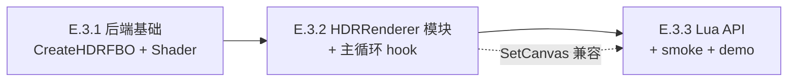

# TASK — Phase E.3 · HDR + Tonemapping

> 6A 工作流 · 阶段 3 · Atomize
> 3 个原子任务，依赖关系：E.3.1 → E.3.2 → E.3.3

---

## 任务依赖图

每个任务独立可编译、独立 smoke 验证、独立 commit。

---

## 任务 E.3.1 — RenderBackend HDR 能力 + ACES Shader

### 输入契约
- **前置**：Phase E.2 已完成，`RenderBackend` 接口稳定
- **环境**：GL33 + Legacy 双后端编译通过
- **依赖**：无（仅修改 backend 抽象层）

### 实现内容

| # | 改动 | 文件 |
|---|------|------|
| 1 | 新增 3 个虚接口：`SupportsHDR()` / `CreateHDRFBO(w, h, *outTex)` / `DeleteHDRFBO(fbo, tex)` | `@e:\jinyiNew\Light\ChocoLight\include\render_backend.h` |
| 2 | GL33 实现：`SupportsHDR` → true；`CreateHDRFBO` → 创建 RGBA16F + Depth24（内部 map 记 fbo→depthRB）；`DeleteHDRFBO` 释放 | `@e:\jinyiNew\Light\ChocoLight\src\render_gl33.cpp` |
| 3 | Legacy 实现：默认 no-op 即可（virtual 默认实现） | `@e:\jinyiNew\Light\ChocoLight\src\render_legacy.cpp`（无改动） |
| 4 | GL33 后端加 ACES tonemap shader（vs + fs）、`programTonemap` + uniform 缓存 | `@e:\jinyiNew\Light\ChocoLight\src\render_gl33.cpp` |
| 5 | GL33 后端加 fullscreen quad VBO/VAO（6 顶点，pos+uv，无 EBO） | `@e:\jinyiNew\Light\ChocoLight\src\render_gl33.cpp` |
| 6 | 新增虚接口 `DrawTonemapFullscreen(uint32_t hdrTex, float exposure, float gamma)` | `@e:\jinyiNew\Light\ChocoLight\include\render_backend.h` + GL33 实现 |

### 输出契约
- `RenderBackend::SupportsHDR()` GL33 = true，Legacy = false
- `CreateHDRFBO(W, H, &tex)` 返回有效 fbo + tex（W=800, H=600 测试）
- `DrawTonemapFullscreen(hdrTex, 1.0f, 2.2f)` 绑 tonemap program + bind hdrTex + uniform + draw 6 顶点
- Light.dll 编译通过（GL33 + Legacy）

### 验收
- 单独 build：`cmake --build` 干净通过
- 没有新 Lua API（本任务全在 C++ 层）

### 复杂度评估
- ~150 行新代码（shader 字符串 + uniform binding + VBO 初始化）
- 风险：ACES shader 编译失败 → init log + fail-fast
- 时间：0.5 天

---

## 任务 E.3.2 — HDRRenderer 模块 + 主循环 hook

### 输入契约
- **前置**：E.3.1 完成（backend 支持 HDR FBO + tonemap fullscreen）
- **环境**：Light.dll 可编译

### 实现内容

| # | 改动 | 文件 |
|---|------|------|
| 1 | 新建 `include/hdr_renderer.h` — 命名空间式 API（与 `BatchRenderer` 同风格） | 新文件 |
| 2 | 新建 `src/hdr_renderer.cpp` — `Init/Shutdown/Enable/Disable/IsEnabled/BeginScene/EndScene/Resize/SetExposure/GetExposure/SetGamma/GetGamma/GetSceneTexture` 实现 | 新文件 |
| 3 | 内部状态：`enabled`, `fbo`, `sceneTex`, `width`, `height`, `exposure`, `gamma`, `paused`（被 SetCanvas 切走时） | `hdr_renderer.cpp` 静态变量 |
| 4 | `light_ui.cpp::Window_Open` 加 `HDRRenderer::Init(g_render)` | `@e:\jinyiNew\Light\ChocoLight\src\light_ui.cpp` |
| 5 | `light_ui.cpp::Window_Call` 主循环 `BeginFrame` 后 + `LitBatch::EndFrame` 后插入 `BeginScene/EndScene` hook | `@e:\jinyiNew\Light\ChocoLight\src\light_ui.cpp` |
| 6 | `light_ui.cpp::Window_Close` 加 `HDRRenderer::Shutdown` | 同上 |
| 7 | SetCanvas 兼容：`l_SetCanvas` 切到 nil 时若 HDR enabled 自动 BindFBO(HDR RT)（其余情况由用户负责） | `@e:\jinyiNew\Light\ChocoLight\src\light_graphics.cpp` |
| 8 | CMakeLists.txt：+`hdr_renderer.cpp` | `@e:\jinyiNew\Light\ChocoLight\CMakeLists.txt` |

### 输出契约
- `HDRRenderer::Enable(W, H)` 返回 true，创建 RGBA16F RT 成功
- `HDRRenderer::IsEnabled()` 正确反映状态
- `BeginScene/EndScene` 流程：在 HDR 启用时绑 RT → 渲染 → tonemap blit
- LDR 模式（未 Enable）所有 API 静默 no-op
- 既有 smoke 零回归

### 验收
- 既有 smoke：`lighting2d.lua` / `ecs_render.lua` / `graphics.lua` 全 PASS
- 视觉：用 Lua REPL 调 `HDRRenderer::Enable(800, 600)` 后 `SetExposure(2.0)` 后画 demo，颜色应略亮但不破

### 复杂度评估
- ~200 行新代码（HDR 模块）+ ~30 行主循环 hook
- 风险：SetCanvas 路径 HDR RT 与用户 Canvas 切换
- 时间：1.5 天

---

## 任务 E.3.3 — Lua API + smoke + demo

### 输入契约
- **前置**：E.3.2 完成（HDR 模块 + 主循环 hook 就绪）
- **环境**：Light.dll 可编译，HDR 模块可用

### 实现内容

| # | 改动 | 文件 |
|---|------|------|
| 1 | 新增 9 个 Lua API（`Enable/Disable/IsEnabled/IsSupported/Resize/SetExposure/GetExposure/SetGamma/GetGamma`） | `@e:\jinyiNew\Light\ChocoLight\src\light_graphics.cpp` 或新文件 `light_graphics_hdr.cpp` |
| 2 | 注册到 `Light.Graphics.HDR` 子表 | `light_graphics.cpp::luaopen_Light_Graphics`（或独立 module） |
| 3 | smoke `scripts/smoke/hdr.lua`：≥ 6 个断言（API surface + IsSupported 一致性 + 无窗口 guard + LDR 模式 SetExposure 无效但不崩） | 新文件 |
| 4 | demo `samples/demo_hdr/main.lua`：HDR 启用 + 多个 lit sprite（颜色 > 1.0 模拟 HDR）+ slider 调 exposure + HUD 显示当前 exposure | 新文件夹 + main.lua |
| 5 | `samples/README.md` 加 demo 入口 | `@e:\jinyiNew\Light\samples\README.md` |

### 输出契约
- `Light.Graphics.HDR.Enable(800, 600)` 在 headless 失败，在窗口模式成功
- smoke 全 PASS
- demo 视觉：调 exposure 0.5 / 1.0 / 2.0 / 4.0 时整个场景变暗→正常→变亮→过亮 ACES 软切

### 验收
- smoke `hdr.lua` 全 PASS
- 既有 smoke 零回归
- demo 可启动且响应 exposure 调整

### 复杂度评估
- ~80 行 Lua API + ~60 行 smoke + ~100 行 demo
- 时间：1 天

---

## 总览

| 任务 | 复杂度 | 时间 | 关键风险 |
|------|--------|------|----------|
| E.3.1 | 中 | 0.5 天 | ACES shader 编译 / depthRB map 管理 |
| E.3.2 | 高 | 1.5 天 | 主循环 hook 顺序 / SetCanvas 兼容 |
| E.3.3 | 低 | 1 天 | demo 资源（normalMap）准备 |
| **合计** | — | **3 天** | （比 FINAL 估计的 4-5 天稍乐观） |

---

## 验证策略

### 单元层（每任务独立）
- E.3.1：`Light.dll` 编译 + GL33 backend 单独 init/cleanup 不崩
- E.3.2：headless `lighting2d.lua` smoke 不破，`HDR.Enable` 在 headless 返回 false
- E.3.3：smoke `hdr.lua` 全 PASS + demo 启动

### 集成层（Phase E.3 完成后）
- 既有 40 PASS `lighting2d.lua` 零回归
- `ecs_render.lua` / `graphics.lua` 零回归
- demo_2d_lighting（Phase E.1.7）仍可跑（LDR 模式）
- demo_hdr 可跑 + 视觉 HDR ACES 软切表现

---

## 文档交付

| 任务 | ACCEPTANCE 文档 |
|------|----------------|
| E.3.1 | `ACCEPTANCE_PhaseE_3_1.md` |
| E.3.2 | `ACCEPTANCE_PhaseE_3_2.md` |
| E.3.3 | `ACCEPTANCE_PhaseE_3_3.md` |
| 总收尾 | `FINAL_PhaseE_3.md` |
