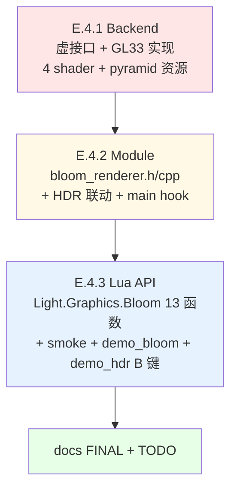

# TASK — Phase E.4 · Bloom 后处理（原子任务拆分）

> 6A 工作流 · 阶段 3 · Atomize
> 架构设计 → 拆分任务 → 明确接口 → 依赖关系

---

## 0. 任务依赖图

**特性**：严格串行，因为 E.4.2 的 `BloomRenderer::Process` 强依赖 E.4.1 的后端虚接口，E.4.3 的 Lua API 直接转发到 E.4.2 的 C++ API。

---

## 1. 原子任务 E.4.1 · Backend (shader + FBO pyramid)

### 1.1 输入契约

- **前置依赖**：Phase E.3.4 已完成（`4e0501f`），HDR RT 基础设施可用
- **输入数据**：无（从零建 Bloom backend）
- **环境依赖**：
  - `@e:\jinyiNew\Light\ChocoLight\include\render_backend.h` 已有 HDR 4 虚接口
  - `@e:\jinyiNew\Light\ChocoLight\src\render_gl33.cpp` 已有 `vaoTonemap/vboTonemap` + tonemap shader

### 1.2 输出契约

- **交付物**：
  1. `@e:\jinyiNew\Light\ChocoLight\include\render_backend.h` +5 虚函数（SupportsBloom / CreateBloomPyramid / DeleteBloomPyramid / DrawBloomBrightPass / DrawBloomDownsample / DrawBloomUpsample / DrawBloomComposite）— 注：Composite 可复用 Upsample shader 零偏移，实际 program 数 = 3 (bright + down + up)
  2. `@e:\jinyiNew\Light\ChocoLight\src\render_gl33.cpp`：
     - 新增 `VS_BLOOM_SOURCE`（可复用 `VS_TONEMAP_SOURCE` 即可，不新增）
     - 新增 `FS_BLOOM_BRIGHT_SOURCE`（bright pass + soft knee）
     - 新增 `FS_BLOOM_DOWN_SOURCE`（13-tap COD AW）
     - 新增 `FS_BLOOM_UP_SOURCE`（tent 3x3，合成模式通过 uniform `uIntensity` 在 composite 调用中复用）
     - `GL33Backend` 类内加：
       - 3 个 GLuint program（bright/down/up）
       - 每个 program 的 uniform location 缓存
       - `bool bloomSupported`
       - `std::unordered_map<uint32_t, ...>` 可省（bloom RT 无 depth）
     - `InitBloom()`：编译 shader + 缓存 location + 绑 sampler slot
     - `Shutdown()` 加释放 program
     - 实现 6 个 Bloom 虚接口
- **验收标准**：
  - [V1] `backend->SupportsBloom() == true` 在 GL33，`false` 在 Legacy
  - [V2] `CreateBloomPyramid(1920, 1080, 5, ...)` 创建 5 级 RT（W = 1920/960/480/240/120，同比）
  - [V3] `DeleteBloomPyramid` 释放所有 FBO + texture，无 GL error
  - [V4] 3 shader 编译 + link 成功（失败时 `bloomSupported = false`）
  - [V5] 各 pass draw 接口不 crash（headless 模式可跳过实际 GL）

### 1.3 实现约束

- **技术栈**：GL 3.3 Core + GL ES 3.0 shader（双份，`#if defined(__EMSCRIPTEN__) || defined(__ANDROID__) || defined(CHOCO_PLATFORM_IOS)` 分支）
- **接口规范**：同 E.3 的 HDR 虚接口风格；Legacy 后端保持默认 no-op
- **质量要求**：
  - shader 编译失败不影响其它 shader（InitBloom 独立 try-compile）
  - CreateBloomPyramid 部分失败时释放已创建部分（内存安全）
  - 不泄漏 GL state（各 pass 结束不改变 blend/depth/viewport 默认）

### 1.4 依赖关系

- **前置**：无（E.3 的 HDR RT 是独立资源，bloom pyramid 另建）
- **后置**：E.4.2 依赖 `backend->SupportsBloom / CreateBloomPyramid / Draw*` 接口
- **并行**：无（严格串行）

### 1.5 预估

- 文件改动：2 个（render_backend.h, render_gl33.cpp）
- 代码量：~400 行（3 个 shader + 4 个接口实现 + init/shutdown + uniform 缓存）
- 工作量：约 1 天

### 1.6 Commit 策略

`feat(phase-e4.1): backend Bloom pyramid + 3 shader (bright/down/up) + GL33 impl`

---

## 2. 原子任务 E.4.2 · Module (BloomRenderer + HDR 联动)

### 2.1 输入契约

- **前置依赖**：E.4.1 已 commit（`SupportsBloom / CreateBloomPyramid / Draw*` 接口可用）
- **输入数据**：backend 指针（由 HDRRenderer::Init 后的 Init 注入）
- **环境依赖**：
  - `@e:\jinyiNew\Light\ChocoLight\include\hdr_renderer.h` / `src/hdr_renderer.cpp`（需插入回调）
  - `@e:\jinyiNew\Light\ChocoLight\src\light_ui.cpp`（Init/Shutdown/主循环 hook 点）

### 2.2 输出契约

- **交付物**：
  1. `@e:\jinyiNew\Light\ChocoLight\include\bloom_renderer.h`（新建）：命名空间 API（13 函数 + 3 联动回调）
  2. `@e:\jinyiNew\Light\ChocoLight\src\bloom_renderer.cpp`（新建）：
     - State 结构体（pyramid FBO/tex 数组 + 参数 + autoEnable flag）
     - Init/Shutdown/Enable/Disable/Resize/IsEnabled/IsSupported
     - OnHDREnabled/OnHDRDisabled/OnHDRResized
     - SetAutoEnable/GetAutoEnable
     - SetThreshold/GetThreshold/SetIntensity/GetIntensity/SetRadius/GetRadius/SetLevels/GetLevels
     - `Process(hdrFbo, hdrTex)` — 完整 bloom 管线
  3. `@e:\jinyiNew\Light\ChocoLight\CMakeLists.txt` +1：bloom_renderer.cpp 加入源文件
  4. `@e:\jinyiNew\Light\ChocoLight\src\hdr_renderer.cpp`：
     - Enable 末尾调 `BloomRenderer::OnHDREnabled(w, h)`
     - Disable 前调 `BloomRenderer::OnHDRDisabled()`
     - Resize 末尾调 `BloomRenderer::OnHDRResized(w, h)`
     - EndScene 在 DrawTonemapFullscreen 前调 `BloomRenderer::Process(g.fbo, g.sceneTex)` + 二次 UnbindFBO
  5. `@e:\jinyiNew\Light\ChocoLight\src\light_ui.cpp`：
     - Window.Open：`BloomRenderer::Init(g_render)` 放在 `HDRRenderer::Init` 之后
     - Window.Close：`BloomRenderer::Shutdown()` 放在 `HDRRenderer::Shutdown()` 之前（保证 backend 可用）
- **验收标准**：
  - [V1] Light.dll 编译通过
  - [V2] 未启用 HDR 时 `BloomRenderer::Enable` 返回 false（无 pyramid 大小来源）
  - [V3] `HDR.Enable + autoEnable=true` → Bloom 自动启用
  - [V4] `HDR.Disable` → Bloom 自动禁用
  - [V5] `HDR.Resize` → Bloom pyramid 自动重建
  - [V6] `Bloom.SetAutoEnable(false)` 后，`HDR.Enable` 不拉起 Bloom
  - [V7] `Process` 在 IsEnabled=false 时 no-op（单元测试或 smoke 验证）
  - [V8] headless 模式无 crash（smoke 可跑）

### 2.3 实现约束

- **技术栈**：C++17 命名空间模块（不 class）
- **接口规范**：
  - 命名 `BloomRenderer::` 全程
  - State 放 `namespace { }` 匿名命名空间内（同 HDRRenderer）
  - 参数 clamp 范围遵循 DESIGN §6.2
- **质量要求**：
  - 所有 Set 函数立即生效（Threshold/Intensity/Radius 直写 State）
  - SetLevels 只更新 requestedLevels，下次 Enable/Resize 重建 pyramid
  - Process 内防御性检查 enabled/backend/pyramid 完整性
  - Shutdown 必须释放 pyramid（调 backend->DeleteBloomPyramid）

### 2.4 依赖关系

- **前置**：E.4.1（backend 虚接口）
- **后置**：E.4.3（Lua 直接 forward 到本模块 API）
- **并行**：无

### 2.5 预估

- 文件：5 个（2 新建 + 3 修改）
- 代码量：~350 行
- 工作量：约 0.5 天

### 2.6 Commit 策略

`feat(phase-e4.2): BloomRenderer module + HDR auto-link + main loop hook`

---

## 3. 原子任务 E.4.3 · Lua API + smoke + demo

### 3.1 输入契约

- **前置依赖**：E.4.2 已 commit（BloomRenderer 命名空间全 API 可用）
- **输入数据**：无
- **环境依赖**：
  - `@e:\jinyiNew\Light\ChocoLight\src\light_graphics.cpp`（已有 HDR 子表模式）
  - `@e:\jinyiNew\Light\scripts\smoke\hdr.lua`（smoke 风格参考）
  - `@e:\jinyiNew\Light\samples\demo_hdr\main.lua`（demo 风格参考）
  - `@e:\jinyiNew\Light\.github\workflows\build-templates.yml`（Windows runtime smoke 注册）

### 3.2 输出契约

- **交付物**：
  1. `@e:\jinyiNew\Light\ChocoLight\src\light_graphics.cpp` +150 行：
     - `#include "bloom_renderer.h"`
     - 13 个 `l_Bloom_*` C 函数
     - `static const luaL_Reg bloom_funcs[]` 13 条
     - `L_RegisterBloomSubtable(L)` → 挂到 `Light.Graphics.Bloom`
     - 在 `L_RegisterGraphicsFuncs` 或等价位置调一次
  2. `@e:\jinyiNew\Light\scripts\smoke\bloom.lua` 新建 ~200 行：
     - 子表 present / module surface (13 functions)
     - IsSupported / IsEnabled 初始态
     - AutoEnable 默认 true / 设置 false 后 HDR.Enable 不拉起 Bloom
     - 参数往返：Threshold / Intensity / Radius / Levels
     - 参数边界：负值 clamp / levels 越界 clamp
     - HDR 未启用时 Enable 返 false
     - Resize 流程
  3. `@e:\jinyiNew\Light\samples\demo_bloom\main.lua` 新建：
     - 放几个高亮 sprite（亮度 > 1.0）
     - 按键：T 切 Bloom ON/OFF / `1 2` Threshold / `3 4` Intensity / `5 6` Radius / `7 8` Levels / R 重置 / ESC 退出
     - OSD 显示全部参数
  4. `@e:\jinyiNew\Light\samples\demo_bloom\README.md` 新建：操作表 + 参数说明
  5. `@e:\jinyiNew\Light\samples\demo_hdr\main.lua` 修改：
     - 加 B 键切换 `Bloom.IsEnabled() ? Disable : Enable(width, height)`
     - OSD 加 Bloom 状态行
     - README 操作表加 B 行
  6. `@e:\jinyiNew\Light\.github\workflows\build-templates.yml`：Windows runtime smoke 注册 bloom.lua
- **验收标准**：
  - [V1] Light.dll 6 平台 CI 编译通过
  - [V2] `require("Light.Graphics").Bloom` 非 nil
  - [V3] smoke `bloom.lua` 20+ PASS，0 FAIL
  - [V4] demo_bloom 本地跑通（用户视觉验收）
  - [V5] demo_hdr B 键切换 Bloom 工作正常（本地）
  - [V6] 既有 46 smoke 零回归

### 3.3 实现约束

- **技术栈**：Lua 5.1 binding + Lua 5.1 smoke（兼容 LuaJIT）
- **接口规范**：
  - 参数校验同 HDR 风格：类型错 luaL_error；数值越界静默 clamp
  - 字符串参数无（无需大小写映射）
  - Get 函数都返回 `number` 或 `boolean`
- **质量要求**：
  - smoke 覆盖所有 13 函数 + 所有边界
  - demo 实用（按键可交互）
  - 不触碰既有 hdr_funcs 的注册顺序（Bloom 作为新子表独立）

### 3.4 依赖关系

- **前置**：E.4.2（C++ API）
- **后置**：E.4 docs（FINAL + TODO）
- **并行**：无

### 3.5 预估

- 文件：6 个（1 修改 light_graphics + 3 新建 smoke/demo + 2 修改 demo_hdr 和 CI）
- 代码量：~400 行
- 工作量：约 0.5 天

### 3.6 Commit 策略

`feat(phase-e4.3): Light.Graphics.Bloom Lua API + smoke + demo_bloom + demo_hdr B key`

---

## 4. 整体验收（E.4.1 + E.4.2 + E.4.3 完成后）

| 标准 | 验证方式 |
|------|---------|
| 6 平台 CI 绿（Windows / macOS / Linux / Android / iOS / Web） | GitHub Actions |
| Windows runtime smoke bloom.lua 全 PASS | CI log |
| 既有 46 smoke 零回归 | CI log |
| HDR + Bloom 联动（Enable/Disable/Resize）正确 | smoke + demo 本地 |
| 无内存泄漏（Shutdown 清资源） | 代码审查 + 可选 valgrind |
| 性能达标（< 0.6ms @ 1080p RTX） | demo_bloom 本地计时 |

---

## 5. 风险 / 阻塞计划

| 风险 | 缓解 |
|------|------|
| GLES3 驱动不支持 RGBA16F | 后端返 SupportsBloom=false；smoke 标记 skip；CI 仍绿 |
| E.4.1 shader 编译错复杂 | 优先双平台编译（GL33 桌面先过，GLES 再改） |
| 13-tap COD AW filter 复杂 | DESIGN 给伪代码，实施时可 vendor COD AW 论文公开实现 |
| Lua API clamp 逻辑错误 | smoke 所有边界都测，发现即修 |
| CI 注册 yml 语法错 | 先在本地 act 或 github actions 试跑 |

---

## 6. 最终交付物

完成 E.4.1 + E.4.2 + E.4.3 后追加：

- `docs/Phase E 渲染管线升级/ACCEPTANCE_PhaseE_4_1.md` — Backend 验收
- `docs/Phase E 渲染管线升级/ACCEPTANCE_PhaseE_4_2.md` — Module 验收
- `docs/Phase E 渲染管线升级/ACCEPTANCE_PhaseE_4_3.md` — Lua API 验收
- `docs/Phase E 渲染管线升级/FINAL_PhaseE_4.md` — Phase 总结
- `docs/Phase E 渲染管线升级/TODO_PhaseE_4.md` — 待办（视觉验收 + Phase E.5 建议）

---

Atomize 完成。等待 Approve 阶段用户确认。
