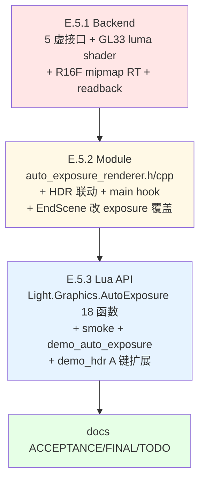

# TASK — Phase E.5 · Auto Exposure (Eye Adaptation) — 原子任务拆分

> 6A 工作流 · 阶段 3 · Atomize
> 架构设计 → 拆分任务 → 明确接口 → 依赖关系

---

## 0. 任务依赖图

**特性**：严格串行（同 Phase E.4 模式）。E.5.2 强依赖 E.5.1 虚接口；E.5.3 Lua 直接转发到 E.5.2 C++ API。

---

## 1. 原子任务 E.5.1 · Backend (luma shader + R16F mipmap RT + readback)

### 1.1 输入契约

- **前置依赖**：Phase E.4 已完成（commit `0a7fa58`，6 平台 CI 全绿）
- **输入数据**：无（新建 AE backend 资源）
- **环境依赖**：
  - `@e:\jinyiNew\Light\ChocoLight\include\render_backend.h` 已有 HDR 4 + Bloom 6 虚接口
  - `@e:\jinyiNew\Light\ChocoLight\src\render_gl33.cpp` 已有 `vaoTonemap/vboTonemap` 全屏 quad（luma extract 可复用 VS）

### 1.2 输出契约

- **交付物**：
  1. `@e:\jinyiNew\Light\ChocoLight\include\render_backend.h` +5 虚接口：
     - `virtual bool SupportsAutoExposure() const { return false; }`
     - `virtual bool CreateLuminanceTarget(int srcW, int srcH, uint32_t* outFbo, uint32_t* outTex, int* outW, int* outH) { return false; }`
     - `virtual void DeleteLuminanceTarget(uint32_t fbo, uint32_t tex) {}`
     - `virtual void DrawLuminanceExtract(uint32_t hdrTex, uint32_t lumFbo, int w, int h) {}`
     - `virtual void GenerateLuminanceMipmap(uint32_t lumTex) {}`
     - `virtual float ReadbackLuminance1x1(uint32_t lumFbo, int lastMipLevel) { return 0.0f; }`
  2. `@e:\jinyiNew\Light\ChocoLight\src\render_gl33.cpp`：
     - 新增 `FS_LUMINANCE_EXTRACT_SOURCE`（双 profile：GL33 + GLES3）
     - `GL33Backend` 类成员新增：
       - `GLuint progLumaExtract = 0;`
       - `GLint locLumaExtract_HDRTex = -1;`
       - `bool autoExposureSupported = false;`
     - 实现：
       - `InitAutoExposure()` (在 `Init()` 末尾调，与 InitBloom 同位)
       - `Shutdown()` 末尾 release `progLumaExtract`
       - 6 个 AE 虚接口 override
  3. 关键：`CreateLuminanceTarget` 内部 `srcW/4, srcH/4` 创建 R16F mipmap-able tex (`glTexStorage2D` + `glTexParameteri(GL_TEXTURE_MIN_FILTER, GL_LINEAR_MIPMAP_LINEAR)`)
  4. `ReadbackLuminance1x1` 用 `glBindFramebuffer + glReadBuffer(GL_COLOR_ATTACHMENT0) + glReadPixels(0,0,1,1,GL_RED,GL_HALF_FLOAT,...)`，注意 R16F 读出格式
- **验收标准**：
  - [V1] `SupportsAutoExposure()` GL33 = true，Legacy = false
  - [V2] `CreateLuminanceTarget(1920, 1080, ...)` 输出 480×270（向下取整 /4），lastMip = ceil(log2(max(480, 270))) = 9
  - [V3] `DeleteLuminanceTarget` 不留 GL leak
  - [V4] luma extract shader 编译失败时 `autoExposureSupported = false`，所有 AE 虚接口降级 no-op
  - [V5] `ReadbackLuminance1x1` 失败时返回 0.0（同时记录 warn log）

### 1.3 实现约束

- **技术栈**：GL 3.3 Core + GL ES 3.0 shader 双份（参考 InitBloom）
- **接口规范**：同 HDR/Bloom 虚接口风格，Legacy 后端默认 no-op
- **质量要求**：
  - shader 编译失败不影响其它已编译模块（独立 try-compile）
  - `glReadPixels(GL_HALF_FLOAT)` 需检测 `glGetError()` 防部分驱动不支持 → fallback `GL_FLOAT` 临时 buffer
  - R16F 在 GLES3 / WebGL2 默认是 _color-renderable_ 但 _not filterable_（需要 `GL_EXT_color_buffer_half_float`）；编译期检测 / 运行期 `glCheckFramebufferStatus`

### 1.4 依赖关系

- **前置**：无（E.4 已交付，HDR / Bloom RT 是独立资源）
- **后置**：E.5.2 强依赖
- **并行**：无

### 1.5 预估

- **代码量**：render_backend.h +50；render_gl33.cpp +~200（shader + InitAutoExposure + 5 override）
- **时长**：~ 1.5 小时

---

## 2. 原子任务 E.5.2 · Module (AutoExposureRenderer + HDR 联动)

### 2.1 输入契约

- **前置依赖**：E.5.1 完成（5 虚接口 + GL33 实现可用）
- **输入数据**：
  - 用户调 `AE.Enable(w, h)` 时的尺寸
  - 每帧 `HDRRenderer::EndScene` 传入的 `hdrTex` + `dt`
- **环境依赖**：
  - `chrono` (`std::chrono::steady_clock`)
  - `cmath` (`std::log`, `std::exp`, `std::exp2`)
  - `algorithm` (`std::clamp`)

### 2.2 输出契约

- **交付物**：
  1. `@e:\jinyiNew\Light\ChocoLight\include\auto_exposure_renderer.h` （新建，~150 行）：
     - 完整 18 函数 public API（与 DESIGN §4.2 一致）
     - 3 个 HDR 联动 hook (`OnHDREnabled/Disabled/Resized`)
  2. `@e:\jinyiNew\Light\ChocoLight\src\auto_exposure_renderer.cpp` （新建，~250 行）：
     - 匿名 namespace State（同 BloomRenderer 模式）：backend、inited、supported、enabled、autoEnable、lumFbo/Tex/W/H/lastMip、targetEV、speedUp/Down、minEV/maxEV、currentEV、currentExposure、measuredLuma
     - `Init/Shutdown` 同 BloomRenderer
     - `Enable/Disable/Resize`：调 backend 创建/释放 luminance RT
     - `Process(hdrTex, dt)` 实现：
       - early-return 防御（enabled + supported + backend + lumFbo + hdrTex）
       - `DrawLuminanceExtract` → lumFbo
       - `GenerateLuminanceMipmap` → lumTex
       - `ReadbackLuminance1x1` → measuredLuma
       - 时间平滑（DESIGN §5.2 公式）
       - 更新 currentEV / currentExposure
     - `OnHDREnabled/Disabled/Resized` 与 BloomRenderer 同模式
     - `SetMinEV/SetMaxEV` 内部强制 minEV ≤ maxEV（min > max 时静默 swap）
     - `SetSpeedUp/Down` clamp [0.1, 20.0]
  3. `@e:\jinyiNew\Light\ChocoLight\src\hdr_renderer.cpp` 修改：
     - `#include "auto_exposure_renderer.h"`
     - `EndScene` 在 Bloom Process 之后插入 AE.Process + exposure 覆盖逻辑（DESIGN §5.3）
     - `Enable/Disable/Resize` 加 AE 联动调用（同 Bloom 模式）
  4. `@e:\jinyiNew\Light\ChocoLight\src\light_ui.cpp` 修改：
     - Window_Open 调 `AutoExposureRenderer::Init(g_render)`（在 BloomRenderer::Init 之后）
     - Window_Close 调 `AutoExposureRenderer::Shutdown()`（在 BloomRenderer::Shutdown 之前，反向顺序）
  5. `@e:\jinyiNew\Light\ChocoLight\CMakeLists.txt` 加 `auto_exposure_renderer.cpp` 到源列表
- **验收标准**：
  - [V1] AE.Init 后 IsSupported() 反映 backend->SupportsAutoExposure()
  - [V2] AE.Enable(0,0) → 返回 false + warn log
  - [V3] AE.Enable 成功 + Disable → IsEnabled() 切换正确，无内存泄漏
  - [V4] AE 默认 autoEnable=false（与 Bloom 默认 true 区别）
  - [V5] HDR.Enable + AE.SetAutoEnable(true) + 重 HDR.Enable → AE 自动启
  - [V6] HDR.Disable → AE 先释放（指针检查通过）
  - [V7] AE.Process 内部全 guard early-return，hdrTex=0 时不崩
  - [V8] SetMinEV(10), SetMaxEV(5) → max 被设为 10 或 min 被设为 5（具体策略：以最后调用为准 swap）

### 2.3 实现约束

- **技术栈**：标准 C++17（`<chrono>` + `<algorithm>` + `<cmath>`）
- **接口规范**：完全镜像 BloomRenderer 模板
- **质量要求**：
  - State 全部 POD-style 默认初始化（无构造函数）
  - `Process` 全 ASCII 调试 log（`CC::Log(INFO, ...)`），避免 Unicode 编码问题
  - 不持有 HDR RT 引用，仅每帧通过参数传入

### 2.4 依赖关系

- **前置**：E.5.1（强）
- **后置**：E.5.3（Lua 直接转发）
- **并行**：无

### 2.5 预估

- **代码量**：~400 行（h + cpp + hdr/ui/cmake 改动）
- **时长**：~ 2 小时

---

## 3. 原子任务 E.5.3 · Lua API + smoke + demo + CI

### 3.1 输入契约

- **前置依赖**：E.5.2 完成（C++ namespace API 可用）
- **输入数据**：HDR RT 尺寸（demo 内部决定）
- **环境依赖**：
  - `@e:\jinyiNew\Light\ChocoLight\src\light_graphics.cpp` 已有 HDR + Bloom Lua 注册模板
  - `@e:\jinyiNew\Light\scripts\smoke\bloom.lua` 作 smoke 模板参考
  - `@e:\jinyiNew\Light\samples\demo_bloom\main.lua` 作 demo 模板参考

### 3.2 输出契约

- **交付物**：
  1. `@e:\jinyiNew\Light\ChocoLight\src\light_graphics.cpp` 修改：
     - `#include "auto_exposure_renderer.h"`
     - 18 个 `l_AE_*` C 函数（与 DESIGN §4.2 一一对应）
     - `ae_funcs[]` luaL_Reg 表
     - `luaopen_Light_Graphics` 内在 Bloom 子表后追加 `AutoExposure` 子表
  2. `@e:\jinyiNew\Light\scripts\smoke\auto_exposure.lua` （新建，~230 行，ASCII-only，≥ 20 PASS）：
     - 子表存在 + 18 函数 surface
     - IsSupported / IsEnabled 初始 false invariant
     - AutoEnable 默认 false（与 Bloom 默认 true 区别）+ 往返
     - TargetEV / SpeedUp / SpeedDown / MinEV / MaxEV 往返 + 边界
     - SetMinEV/MaxEV 关系不变量（min ≤ max）
     - GetCurrentEV / GetCurrentExposure / GetMeasuredLuminance 类型为 number
     - Enable/Disable lifecycle（headless tolerant: false-return OK）
     - 双 Disable 安全
     - AutoEnable + HDR.Enable 联动（条件触发，HDR 不可用时跳过）
  3. `@e:\jinyiNew\Light\samples\demo_auto_exposure\main.lua` （新建，~250 行）：
     - 两场景切换（暗 / 亮）通过按键
     - 显示当前 EV / measured luma / target EV 实时变化
     - 控制：
       - `A` : 切换 AE on/off
       - `1/2` : SpeedUp -/+ (0.5 step)
       - `3/4` : SpeedDown -/+ (0.5 step)
       - `5/6` : TargetEV -/+ (0.5 step)
       - `D` : 切换暗/亮场景模式
       - `R` : 重置默认
       - `ESC` : 退出
     - 暗场景：背景亮度 0.02，几个 0.5 亮度 sprite
     - 亮场景：背景亮度 1.0，几个 5.0 亮度 sprite
  4. `@e:\jinyiNew\Light\samples\demo_auto_exposure\README.md` （新建）：
     - 操作表 + 参数说明 + 预期视觉
  5. `@e:\jinyiNew\Light\samples\demo_hdr\main.lua` 扩展（可选）：
     - 加 `A` 键切换 AE，OSD 显示 AE 状态
  6. `@e:\jinyiNew\Light\.github\workflows\build-templates.yml` 修改：
     - 注册 `$phaseE5Smoke = Resolve-Path "scripts\smoke\auto_exposure.lua"`
     - 在 phaseE4Smoke 之后调用
- **验收标准**：
  - [V1] `require("Light.Graphics").AutoExposure` 返回 table
  - [V2] 18 函数 surface 全部 type==function
  - [V3] smoke 输出全 PASS，最终 `[OK] Phase E.5 smoke (Light.Graphics.AutoExposure): all checks passed`
  - [V4] demo_auto_exposure 在 GL33 desktop 切场景时 EV 平滑过渡（< 2s 暗→亮，< 4s 亮→暗）
  - [V5] CI 6 平台全绿，Windows runtime 执行 `auto_exposure.lua` 通过

### 3.3 实现约束

- **技术栈**：Lua 5.1（兼容旧引擎）
- **接口规范**：ASCII-only smoke（与 hdr.lua / bloom.lua 一致）
- **质量要求**：
  - smoke 完全 headless tolerant（不依赖 GL ctx；Enable false-return 时跳过 Process 验证）
  - demo 在 UI.Window 不可用时降级到 API surface print 后退出
  - Lua 错误信息用英文（避免 Windows powershell 编码问题）

### 3.4 依赖关系

- **前置**：E.5.2（强）
- **后置**：FINAL 文档
- **并行**：无

### 3.5 预估

- **代码量**：~550 行（C++ Lua bindings + Lua smoke + demo）
- **时长**：~ 2 小时

---

## 4. 全局风险点

| 风险 | 触发场景 | 缓解 |
|------|---------|------|
| **GL ES3 R16F renderable** | Android / iOS / Web 某些驱动不支持 R16F 作 color attachment | 编译期 `#ifdef` + 运行期 `glCheckFramebufferStatus` → `autoExposureSupported = false` 降级 |
| **glReadPixels GL_HALF_FLOAT** | 部分驱动只支持 GL_FLOAT 读出 R16F | fallback：用 `GL_FLOAT` 临时 buffer + 手动 truncate |
| **R16F precision underflow** | log(0.0001) ≈ -9.2 极端暗，R16F 半精度浮点 mantissa 10-bit 不足 | 测量值 clamp 到 [-12, 12]，再换算 EV |
| **PBO async 期望落差** | 用户期望 0 stall 但 v1 是同步 | TODO_PhaseE_5.md 明确说明 + 性能基线提示 |
| **EndScene 中 chrono dt 误差** | 第一帧 dt 可能巨大或 0 | clamp dt [0, 0.1]，第一帧前置 currentEV = targetEV |
| **Bloom + AE 顺序耦合** | 用户期望 AE 不含 bloom | DESIGN 已明确 AE 测量含 bloom（更符合用户视觉感知），TODO 标可选无 bloom 模式 |

---

## 5. 任务清单 (执行时 check)

### E.5.1 Backend
- [ ] `render_backend.h` +5 虚接口 (default no-op)
- [ ] `render_gl33.cpp` luma extract shader (GL33 + GLES3)
- [ ] `render_gl33.cpp::InitAutoExposure` 编译 shader + 缓存 loc
- [ ] `render_gl33.cpp::Shutdown` release program
- [ ] 6 个 override 实现 (含 CreateLuminanceTarget mipmap 设置)
- [ ] 本地 build 通过（VS 或 cmake）

### E.5.2 Module
- [ ] `auto_exposure_renderer.h` 新建（18 fn + 3 联动）
- [ ] `auto_exposure_renderer.cpp` 新建（State + Init/Shutdown/Enable/Disable/Resize/Process + 联动）
- [ ] `hdr_renderer.cpp` 改 EndScene + Enable/Disable/Resize 联动
- [ ] `light_ui.cpp` Init/Shutdown
- [ ] `CMakeLists.txt` 加源
- [ ] 本地 build 通过

### E.5.3 Lua + smoke + demo
- [ ] `light_graphics.cpp` 18 binding + ae_funcs + 子表挂入
- [ ] `scripts/smoke/auto_exposure.lua` 新建
- [ ] `samples/demo_auto_exposure/main.lua` 新建
- [ ] `samples/demo_auto_exposure/README.md` 新建
- [ ] `.github/workflows/build-templates.yml` 加 phaseE5Smoke
- [ ] CI 推送验证 6 平台

---

进入 **Approve** 阶段 ✅
