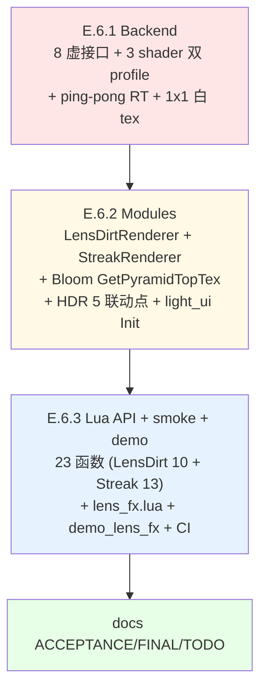

# TASK — Phase E.6 · Lens Dirt + Streak — 原子任务拆分

> 6A 工作流 · 阶段 3 · Atomize

---

## 0. 任务依赖图

严格串行（同 Phase E.4 / E.5 模式）。

---

## 1. E.6.1 · Backend (3 shader + ping-pong RT + white tex)

### 1.1 输入契约

- **前置依赖**：Phase E.5 已完成（`c61f1d5`，6 平台 CI 通过）
- **输入数据**：无
- **环境依赖**：
  - `render_backend.h` 已有 HDR/Bloom/AE 累计 16 虚接口
  - `render_gl33.cpp` 已有 `vaoTonemap/vboTonemap` + `programBloomBright`（streak bright pass 复用）

### 1.2 输出契约

- **交付物**：
  1. `render_backend.h` +8 虚接口（DESIGN §4.1）
  2. `render_gl33.cpp`：
     - 新增 shader 源（双 profile）：
       - `FS_LENS_DIRT_COMPOSITE_SOURCE`
       - `FS_STREAK_BLUR_SOURCE`
       - `FS_STREAK_COMPOSITE_SOURCE`
     - State 字段：
       - `GLuint programLensDirt = 0;`
       - `GLuint programStreakBlur = 0;`
       - `GLuint programStreakComposite = 0;`
       - `GLuint whiteTex1x1 = 0;`         // LensDirt fallback
       - `bool   lensDirtSupported = false;`
       - `bool   streakSupported   = false;`
       - `GLint  locLensDirt_BloomTex / DirtTex / Intensity = -1;`
       - `GLint  locStreakBlur_Src / Texel / Length / Direction = -1;`
       - `GLint  locStreakComposite_Src / Intensity = -1;`
     - `InitLensFx()` 在 `Init()` 末尾调（在 `InitAutoExposure` 后）
     - `Shutdown()` 释放 3 program + whiteTex1x1
     - 8 个 override：
       - `SupportsLensDirt`
       - `DrawLensDirtComposite`（dirtTex=0 时使用 whiteTex1x1）
       - `SupportsStreak`
       - `CreateStreakTargets`（RGBA16F 双 RT，无 depth；min size 32×32）
       - `DeleteStreakTargets`
       - `DrawStreakBright`（**复用 programBloomBright**，shader 不新建）
       - `DrawStreakBlur`（用 programStreakBlur）
       - `DrawStreakComposite`（用 programStreakComposite）
- **验收标准**：
  - [V1] `SupportsLensDirt() / SupportsStreak()` GL33 分别 = 编译成功 flag；Legacy = false
  - [V2] `CreateStreakTargets(1920, 1080, ...)` 输出 960×540 双 RGBA16F RT
  - [V3] `DrawLensDirtComposite` dirtTex=0 时使用 whiteTex1x1，不崩
  - [V4] `DrawStreakBright` 调用 `programBloomBright` 不破坏 Bloom 自身的 uniform 状态（每次 use 重新设 location）
  - [V5] 各 shader 编译失败时独立降级（不影响其它）

### 1.3 实现约束

- 双 profile shader（同 E.4/E.5 模式）
- programStreakBlur 在 `glLinkProgram` 后立即 `glUseProgram + glUniform1i(uSrc, 0)` 绑 sampler slot
- programLensDirt 同样：`uBloomTex` slot 0, `uDirtTex` slot 1
- `DrawLensDirtComposite` 启用 `GL_BLEND (ONE, ONE)`，绘制后还原（disable blend）
- `DrawStreakComposite` 同上
- `DrawStreakBlur` **不**启用 blend（直接覆盖写 dst）

### 1.4 依赖

- 前置：无（基于 E.5 完成的代码）
- 后置：E.6.2 强依赖

### 1.5 预估

- 代码：render_backend.h +~80；render_gl33.cpp +~340
- 时长：~ 2 小时

---

## 2. E.6.2 · Modules (LensDirtRenderer + StreakRenderer + HDR 联动)

### 2.1 输入契约

- E.6.1 完成（8 虚接口 + GL33 实现可用）

### 2.2 输出契约

- **交付物**：
  1. `bloom_renderer.h` / `.cpp`：
     - 新增 `uint32_t GetPyramidTopTex()` getter（返回 `g.texs[0]`，未启用时返回 0）
  2. `lens_dirt_renderer.h` / `.cpp` 新建：
     - State：backend, inited, supported, enabled, autoEnable, dirtTexId, intensity
     - Init/Shutdown/Enable/Disable/IsEnabled/IsSupported（无 Resize，因无 RT）
     - OnHDREnabled/Disabled/Resized
     - SetDirtTextureId(uint32_t) / GetDirtTextureId()
     - SetIntensity(float) / GetIntensity()  — clamp [0, +inf)
     - Process(hdrFbo, bloomTex, w, h)
       - early-return: !enabled / !supported / !backend / !hdrFbo / !bloomTex
       - 调 `DrawLensDirtComposite(bloomTex, dirtTexId, hdrFbo, w, h, intensity)`
  3. `streak_renderer.h` / `.cpp` 新建：
     - State：backend, inited, supported, enabled, autoEnable, fbos[2]/texs[2], lumW/H, srcW/H, threshold, intensity, length, dirX/Y, iterations
     - Init/Shutdown/Enable(w,h)/Disable/IsEnabled/IsSupported/Resize(w,h)
     - OnHDREnabled/Disabled/Resized
     - 8 个 setter/getter（DESIGN §4.3）
     - Process(hdrFbo, hdrTex)：5.5 节算法
  4. `hdr_renderer.cpp`：
     - `#include "lens_dirt_renderer.h"` + `#include "streak_renderer.h"`
     - Enable 后调：`LensDirtRenderer::OnHDREnabled(w, h)` + `StreakRenderer::OnHDREnabled(w, h)`
     - Disable 时**先调** AE → Streak → LensDirt → Bloom → ReleaseRT（保守顺序）
     - Resize 后联动 Streak（LensDirt 无尺寸不需）
     - EndScene 末尾在 AE.Process 后插：
       - `LensDirtRenderer::Process(g.fbo, BloomRenderer::GetPyramidTopTex(), g.width, g.height);`
       - `StreakRenderer::Process(g.fbo, g.sceneTex);`
  5. `light_ui.cpp`：
     - Window_Open 顺序：HDR → Bloom → AE → LensDirt → Streak ::Init
     - Window_Close 反向：Streak → LensDirt → AE → Bloom → HDR ::Shutdown
  6. `CMakeLists.txt`：+`lens_dirt_renderer.cpp` + `streak_renderer.cpp`
- **验收标准**：
  - [V1] `LensDirtRenderer.Init/Shutdown` 不崩；多次 Enable/Disable 无 GL leak
  - [V2] `StreakRenderer.Enable(0, 0)` 返 false + warn；正常尺寸成功
  - [V3] HDR.Disable 后两者均 enabled=false
  - [V4] Process 在 disabled 时 0 GL 调用（统计）
  - [V5] AutoEnable=true 后 HDR.Enable 自动启动两者

### 2.3 实现约束

- 复用 BloomRenderer / AutoExposureRenderer 的 anonymous namespace State pattern
- LensDirtRenderer 的 dirtTexId 仅持 uint32_t；不持 Image table 引用（生命周期由 Lua GC 管）

### 2.4 依赖

- 前置：E.6.1
- 后置：E.6.3

### 2.5 预估

- 代码：lens_dirt_renderer ~150 + streak_renderer ~230 + hdr/ui/cmake/bloom getter ~50 = **~430 行**
- 时长：~ 2 小时

---

## 3. E.6.3 · Lua API + smoke + demo + CI

### 3.1 输入契约

- E.6.2 完成

### 3.2 输出契约

- **交付物**：
  1. `light_graphics.cpp`：
     - 23 个 `l_LD_*` / `l_ST_*` C 函数
     - `LD.SetDirtTexture(arg)` 接受：number / table（调 `:GetTextureId()`）/ nil（设 0）
     - `ld_funcs[]` + `streak_funcs[]` luaL_Reg 表
     - `luaopen_Light_Graphics` 在 AutoExposure 子表后挂入两个新子表
  2. `scripts/smoke/lens_fx.lua` 新建（合并 ≥ 25 PASS, ASCII-only）：
     - LensDirt 子表 surface（10 函数）
     - Streak 子表 surface（13 函数）
     - 两者 IsEnabled 初始 false
     - 两者 GetAutoEnable 默认 false
     - LensDirt SetIntensity round-trip + 负值 clamp
     - LensDirt SetDirtTexture(0) / SetDirtTexture(123) / SetDirtTexture(nil) 行为
     - Streak SetThreshold/Intensity/Length/Direction/Iterations round-trip + clamp
     - Streak SetDirection(0,0) 保留旧值
     - Enable/Disable/Resize lifecycle（headless tolerant）
     - 双 Disable 安全
  3. `samples/demo_lens_fx/main.lua` 新建：
     - 启用 HDR + Bloom（基础）
     - 启用 LensDirt + Streak
     - 几个高亮 sprite 阵列
     - 控制：
       - `L` : 切换 LensDirt
       - `K` : 切换 Streak
       - `1/2` : LensDirt Intensity -/+ (0.1)
       - `3/4` : Streak Intensity -/+ (0.05)
       - `5/6` : Streak Length -/+ (0.005)
       - `7/8` : Streak Iterations -/+
       - `H/V` : Streak Direction 切换 horizontal/vertical/diagonal
       - `R` : reset 所有参数
       - `ESC` : 退出
  4. `samples/demo_lens_fx/README.md` 新建
  5. `.github/workflows/build-templates.yml`：注册 `phaseE6Smoke`
- **验收标准**：
  - [V1] `Light.Graphics.LensDirt` + `Light.Graphics.Streak` 表存在
  - [V2] 23 函数全部 type=function
  - [V3] smoke 全 PASS：`[OK] Phase E.6 smoke (Light.Graphics.LensDirt + Streak): all checks passed`
  - [V4] demo headless / Legacy 时 API surface 后干净退出
  - [V5] CI 6 平台全绿，Windows runtime 跑 lens_fx.lua 通过

### 3.3 实现约束

- ASCII-only smoke
- demo Lua 错误信息英文
- LD.SetDirtTexture 三态处理（number / table / nil）

### 3.4 依赖

- 前置：E.6.2
- 后置：FINAL 文档

### 3.5 预估

- 代码：light_graphics binding ~200 + smoke ~250 + demo ~200 + readme ~80 = **~730 行**
- 时长：~ 2.5 小时

---

## 4. 全局风险

| 风险 | 触发 | 缓解 |
|------|------|------|
| **`programBloomBright` 复用 uniform 污染** | StreakRenderer 调用 DrawStreakBright 设 threshold；下帧 Bloom 自身调用读到旧值 | 后端每次 `DrawXxx` 都 use program + 重新设全部 uniform，不依赖上一次状态 |
| **Streak ping-pong RT 资源** | OOM 或 FBO 不完整 | `CreateStreakTargets` 失败时清理已分配资源 |
| **GLES3 / WebGL2 RGBA16F renderable** | 部分驱动不支持 | 与 HDR/Bloom 同方案 (`glCheckFramebufferStatus`)，失败 → `streakSupported=false` |
| **dirtTex GL id 是否 valid** | 用户传错 GL id 导致采样错误 | shader 内 max(rgb, 0) 防御；GL_INVALID_OPERATION 不崩 |
| **SetIterations × stepLength 累计 UV 越界** | 用户设 length=0.1 + iterations=8 → max step = 12.8 UV | 不做内部 clamp（依赖 wrap mode CLAMP_TO_EDGE 即可） |

---

## 5. 任务清单

### E.6.1 Backend
- [ ] `render_backend.h` +8 虚接口
- [ ] `render_gl33.cpp` 3 shader 双 profile
- [ ] `InitLensFx` (whiteTex 1x1 + 3 program 编译)
- [ ] `Shutdown` 资源释放
- [ ] 8 override 实现

### E.6.2 Modules
- [ ] `bloom_renderer.{h,cpp}` GetPyramidTopTex
- [ ] `lens_dirt_renderer.{h,cpp}` 新建
- [ ] `streak_renderer.{h,cpp}` 新建
- [ ] `hdr_renderer.cpp` 5 联动点
- [ ] `light_ui.cpp` Init/Shutdown 顺序
- [ ] `CMakeLists.txt` +2 源

### E.6.3 Lua + smoke + demo + CI
- [ ] `light_graphics.cpp` 23 binding + 2 子表
- [ ] `scripts/smoke/lens_fx.lua`
- [ ] `samples/demo_lens_fx/main.lua` + README
- [ ] `.github/workflows/build-templates.yml`

---

进入 **Approve** 阶段 ✅
