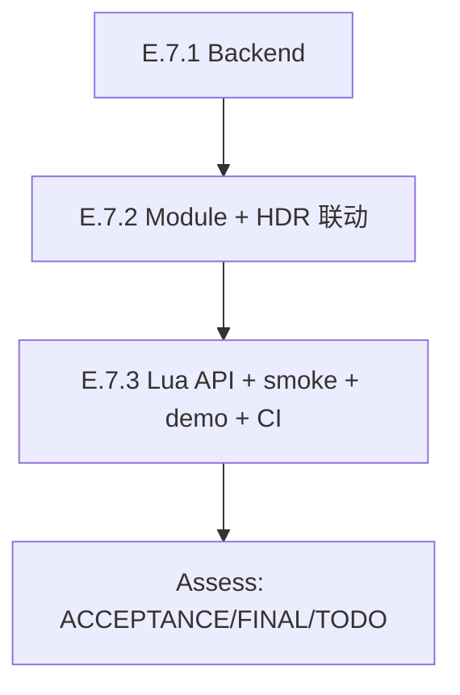

# TASK — Phase E.7 · Lens Flare (Ghost + Halo + Chromatic Aberration)

> 6A 工作流 · 阶段 3 · Atomize
> 拆分依据：`@e:\jinyiNew\Light\docs\Phase E 渲染管线升级\DESIGN_PhaseE_7.md`
> 与 Phase E.6 同 3-阶段原子任务模式，每阶段独立 CI 验证。

---

## 1. 任务依赖图

无并行任务（每个原子任务都需前一个的 commit 验证通过）。

---

## 2. 原子任务详表

### 2.1 E.7.1 — RenderBackend 虚接口 + GL33 Ghost shader + Ping-pong RT

**输入契约**：
- 前置：无（Phase E.6 已合并）
- 输入数据：`@e:\jinyiNew\Light\docs\Phase E 渲染管线升级\DESIGN_PhaseE_7.md` §4.1 + §5
- 环境：已存在 Bloom backend（`programBloomBright` / `programBloomComposite`）

**输出契约**：
- `@e:\jinyiNew\Light\ChocoLight\include\render_backend.h`: +~80 行（6 虚接口 + 注释块）
- `@e:\jinyiNew\Light\ChocoLight\src\render_gl33.cpp`: +~250 行
  - 1 个 GLSL fragment shader（双 profile）
  - InitLensFx 追加 ghost shader 编译 + `lensFlareSupported` 字段更新
  - 4 个虚接口实现（SupportsLensFlare / CreateLensFlareTargets / DeleteLensFlareTargets / DrawLensFlareGhost）
  - **bright pass 和 composite 直接复用 Bloom** → 不重复 shader 编译

**实现约束**：
- Shader GLES3 兼容（避免 `for (int i = 0; i < uGhostCount; ++i)` 动态循环上限）
- ping-pong RT 复用 Streak 的 `CreateLensFlareTargets` 内部实现（克隆 + 改日志）
- 严格遵守现有命名风格：`programLensFlareGhost`、`lfFbos[2]` 等

**质量要求**：
- Legacy 后端默认 no-op（虚接口默认实现）
- shader 编译失败时 `lensFlareSupported = false`，但不影响其他模块
- 错误信息走 `CC::Log(CC::LOG_WARN, ...)`

**依赖关系**：
- 后置：E.7.2

**独立验证**：
- 编译通过（CI 6 平台 build）
- LensFlare 暂时未在主循环调用，不影响现有功能

---

### 2.2 E.7.2 — LensFlareRenderer namespace + HDR 5 联动点

**输入契约**：
- 前置：E.7.1 已合并
- 输入数据：DESIGN §4.2 + §6

**输出契约**：
- `@e:\jinyiNew\Light\ChocoLight\include\lens_flare_renderer.h`（新建，~120 行）
- `@e:\jinyiNew\Light\ChocoLight\src\lens_flare_renderer.cpp`（新建，~230 行）
- `@e:\jinyiNew\Light\ChocoLight\src\hdr_renderer.cpp`: +~10 行（5 联动点：include + Enable + Disable + Resize + EndScene）
- `@e:\jinyiNew\Light\ChocoLight\src\light_ui.cpp`: +4 行（Init/Shutdown）
- `@e:\jinyiNew\Light\ChocoLight\CMakeLists.txt`: +1 行（追加 `lens_flare_renderer.cpp`）

**实现约束**：
- 反初始化顺序：`Shutdown` 在 light_ui.cpp 中先于 Streak/LensDirt/AE/Bloom/HDR
- Disable 顺序（hdr_renderer.cpp）：LensFlare 先关，再依次关 Streak/LensDirt/AE/Bloom，最后释放 HDR RT
- EndScene 顺序：Bloom → AE → LensDirt → Streak → **LensFlare** → Tonemap
- autoEnable 默认 false

**质量要求**：
- ping-pong RT 复用 Streak 模式（CreateLensFlareTargets + DeleteLensFlareTargets）
- Process 内部 3-stage early-return：未启用 / 资源失效 / 输入 tex=0
- 所有参数 clamp 在 C++ 侧执行（Lua 调用前不信任）

**依赖关系**：
- 前置：E.7.1
- 后置：E.7.3

**独立验证**：
- 编译通过
- light_ui.cpp 主循环 Init/Shutdown 不导致崩溃（HDR 未启用时 LensFlare.Process 全 no-op）

---

### 2.3 E.7.3 — Lua API + smoke + demo + CI

**输入契约**：
- 前置：E.7.2 已合并
- 输入数据：DESIGN §4.3

**输出契约**：
- `@e:\jinyiNew\Light\ChocoLight\src\light_graphics.cpp`: +~250 行
  - 21 个 `l_LF_*` C 函数
  - `lens_flare_funcs[]` luaL_Reg 表
  - luaopen_Light_Graphics 中追加 `LensFlare` 子表（在 `Streak` 之后）
- `@e:\jinyiNew\Light\scripts\smoke\lens_flare.lua`（新建，~280 行，**~50 断言**）
  - Section A: 子表存在 + 21 函数 surface
  - Section B: IsSupported / IsEnabled 类型 + 初始 false
  - Section C: AutoEnable 默认 false + round-trip
  - Section D: 7 参数默认值 + clamp + round-trip
  - Section E: Enable/Resize/Disable 生命周期 (headless 容错)
  - Section F: 边界（GhostCount=0、HaloWidth=0、CA=0）
- `@e:\jinyiNew\Light\samples\demo_lens_flare\main.lua`（新建，~200 行）
- `@e:\jinyiNew\Light\samples\demo_lens_flare\README.md`（新建，~110 行）
- `@e:\jinyiNew\Light\.github\workflows\build-templates.yml`: +3 行（phaseE7Smoke 注册 + 调用）

**实现约束**：
- Lua API 全 ASCII smoke（与现有 lens_fx.lua 同风格）
- demo headless 容错（UI.Window 不可用时 API surface 探测）
- Lua 端参数 clamp 边界与 C++ 一致（避免 IPC 翻墙错误）

**质量要求**：
- smoke `~50 断言` 全 headless-safe
- demo 退出时反向清理（LensFlare → Streak → Bloom → HDR）

**依赖关系**：
- 前置：E.7.2
- 后置：Assess docs

**独立验证**：
- CI Windows runtime smoke 调用 `lens_flare.lua` PASS
- 6 平台 CI 全绿

---

## 3. 进度跟踪表

| 任务 ID | 描述 | 状态 | Commit | CI |
|---------|------|------|--------|-----|
| 规划 | ALIGN + DESIGN + TASK | ⏳ 待 commit | — | — |
| E.7.1 | Backend | ⏳ pending | — | — |
| E.7.2 | Module | ⏳ pending | — | — |
| E.7.3 | Lua + smoke + demo + CI | ⏳ pending | — | — |
| Assess | ACCEPTANCE + FINAL + TODO | ⏳ pending | — | — |

---

## 4. 风险点

| 风险 | 缓解策略 |
|------|---------|
| Shader GLES3 兼容（动态 loop） | 静态上限 8 + `if (i >= count) break;` |
| RT 资源泄漏（Disable 时未 Release） | `ReleaseRT()` helper（同 Streak 模式） |
| Bloom 未启用时 LensFlare 行为 | LensFlare 自己跑 bright pass（独立 ping-pong RT，不依赖 Bloom RT）；只是复用 shader |
| 同尺寸 Resize 重建 RT | `g.srcW == w && g.srcH == h` 提前 return true |
| Lua 端 SetGhostCount 传 float | C++ `luaL_checkinteger` 强转 |

---

**Phase E.7 任务原子化完成，依赖关系清晰，每阶段可独立 CI 验证。准入 Approve → Automate 执行。**
