# TASK — Phase E.8 · SSAO (Screen-Space Ambient Occlusion)

> 6A 工作流 · 阶段 3 · Atomize
> 基于 `DESIGN_PhaseE_8.md` 拆分原子任务 + 输入/输出契约 + 依赖图。

---

## 1. 任务拆分总览

Phase E.8 按 E.7 模式拆成 **4 个子阶段 × 原子任务**：

| 阶段 | 主题 | 原子任务数 | 预估 commit |
|------|------|-----------|-----------|
| **E.8.0** | 规划 (本文档) | 3 | `docs(phase-e8): planning` |
| **E.8.1** | Backend | 6 | `feat(phase-e8.1): backend SSAO` |
| **E.8.2** | Module | 3 | `feat(phase-e8.2): SSAORenderer module` |
| **E.8.3** | Lua API + smoke + demo | 4 | `feat(phase-e8.3): Light.Graphics.SSAO Lua API` |
| **E.8.4** | Docs | 3 | `docs(phase-e8): ACCEPTANCE + FINAL + TODO` |

---

## 2. 任务依赖图

```mermaid
flowchart LR
    T0[T0 规划文档] --> T1_1

    subgraph E8_1[E.8.1 Backend]
        T1_1[T1.1 HDR depth RB->tex 升级] --> T1_2
        T1_2[T1.2 render_backend.h 7 新虚接口] --> T1_3
        T1_3[T1.3 FS_SSAO shader] --> T1_6
        T1_4[T1.4 FS_SSAO_BLUR shader]
        T1_5[T1.5 FS_SSAO_COMPOSITE shader]
        T1_2 --> T1_4
        T1_2 --> T1_5
        T1_6[T1.6 GL33 override impls + InitSSAO + Shutdown]
        T1_4 --> T1_6
        T1_5 --> T1_6
    end

    T1_6 --> T2_1

    subgraph E8_2[E.8.2 Module]
        T2_1[T2.1 lens_flare_renderer.h 风格头文件] --> T2_2
        T2_2[T2.2 ssao_renderer.cpp 实现 + kernel/noise 生成] --> T2_3
        T2_3[T2.3 hdr_renderer.cpp 5 联动点 + CMake + light_ui]
    end

    T2_3 --> T3_1

    subgraph E8_3[E.8.3 Lua + smoke + demo]
        T3_1[T3.1 light_graphics.cpp 19 binding + 子表] --> T3_2
        T3_2[T3.2 smoke ssao.lua ~50 断言] --> T3_3
        T3_3[T3.3 demo_ssao: Lua 生成 cube+plane PBR 场景] --> T3_4
        T3_4[T3.4 CI workflow phaseE8Smoke 注册]
    end

    T3_4 --> T4_1

    subgraph E8_4[E.8.4 Docs]
        T4_1[T4.1 ACCEPTANCE_PhaseE_8.md]
        T4_2[T4.2 FINAL_PhaseE_8.md]
        T4_3[T4.3 TODO_PhaseE_8.md]
    end
```



---

## 3. 原子任务详细契约

### T0 · 规划（本阶段已完成）

- **T0.1** `ALIGNMENT_PhaseE_8.md` ✅
- **T0.2** `DESIGN_PhaseE_8.md` ✅
- **T0.3** `TASK_PhaseE_8.md` ✅（本文件）

**交付物**：3 份 6A 文档（已全部完成）

---

### T1.1 · SSAO 独立 depth RT + glBlitFramebuffer 旁路【【用户选择 2026-05-12】零侵入 HDR】

| 契约 | 值 |
|------|---|
| **输入依赖** | 现有 HDR FBO 保持不变（depth RB 原封不动）|
| **输出** | 新增 `CreateSSAODepthRT(w,h, outFbo, outTex)` + `DeleteSSAODepthRT(fbo, tex)` + `BlitHDRDepthToSSAO(hdrFbo, ssaoFbo, w, h)` 三个后端虚接口实现 |
| **文件** | `@e:\jinyiNew\Light\ChocoLight\src\render_gl33.cpp` |
| **行数** | ~60 行新增（纯新增，无修改原有代码）|
| **验证** | (1) 现有 demo_hdr / demo_bloom / demo_ssao 前置的所有 3D demo 行为 **零变化**（根本未动 HDR 代码）；(2) SSAO Enable 后 `CreateSSAODepthRT` 返 true + tex id 非 0；(3) `BlitHDRDepthToSSAO` 不报 GL 错误 |
| **风险** | **低** — 原 HDR RT 零侵入；旧驱动不支持 depth blit 在 Init 阶段探测前降级 |
| **回滚策略** | 无需 — 新接口与现有代码正交，回滚只需删新增代码 |

**验收标准**：

```cpp
// 现有 HDR demo 像素完全相同 (代码未动)
// SSAO 自测:
GLuint ssaoFbo = 0, ssaoTex = 0;
backend->CreateSSAODepthRT(800, 600, &ssaoFbo, &ssaoTex);
assert(ssaoFbo != 0 && ssaoTex != 0);
backend->BlitHDRDepthToSSAO(hdrFbo, ssaoFbo, 800, 600);
assert(glGetError() == GL_NO_ERROR);   // blit 完成无错
backend->DeleteSSAODepthRT(ssaoFbo, ssaoTex);
```

---

### T1.2 · render_backend.h 新增 9 虚接口

| 契约 | 值 |
|------|---|
| **输入依赖** | T1.1 完成 |
| **输出** | 9 个 `virtual ... { ... }` 默认 no-op 虚接口（Phase E.8 专区）|
| **文件** | `@e:\jinyiNew\Light\ChocoLight\include\render_backend.h` |
| **接口清单** | (1) `SupportsSSAO` (2) `CreateSSAODepthRT` (3) `DeleteSSAODepthRT` (4) `BlitHDRDepthToSSAO` (5) `CreateSSAOTargets` (6) `DeleteSSAOTargets` (7) `CreateSSAONoiseTex` (8) `DeleteSSAONoiseTex` (9) `DrawSSAO` + (10) `DrawSSAOBlur` + (11) `DrawSSAOComposite` + (12) `GetProjection` + (13) `GetView` |
| **验证** | 编译通过；Legacy backend 不实现（默认 no-op 生效） |

---

### T1.3 · FS_SSAO shader 双 profile（GLES3 + GL33）

| 契约 | 值 |
|------|---|
| **输入依赖** | T1.2 完成 |
| **输出** | 2 份 shader 字符串（`#if defined(GLES) ... #else ... #endif`）|
| **文件** | `@e:\jinyiNew\Light\ChocoLight\src\render_gl33.cpp` |
| **核心算法** | depth 重建 view pos → ddx/ddy 重建 normal → noise 旋转 kernel → 16 采样 occlusion → pow(ao, power) |
| **验证** | 单 draw 测试：给定固定 depth tex / proj matrix，输出 AO 与参考实现（LearnOpenGL / UE 参考）差异 < 3% |

---

### T1.4 · FS_SSAO_BLUR shader 双 profile

| 契约 | 值 |
|------|---|
| **输入依赖** | T1.2 完成 |
| **输出** | 2 份 shader（separable bilateral blur, 5-tap）|
| **核心算法** | `exp(-abs(cDepth - sampDepth) * 200.0)` depth-aware 权重 |
| **验证** | 输入常量 AO → 输出 AO 几乎不变（blur ≠ darken）|

---

### T1.5 · FS_SSAO_COMPOSITE shader 双 profile

| 契约 | 值 |
|------|---|
| **输入依赖** | T1.2 完成 |
| **输出** | 2 份 shader（`hdr * mix(1.0, ao, intensity)`）|
| **验证** | intensity=0 时 AO 被忽略（输出 = hdr）；intensity=1 时完全乘 |

---

### T1.6 · GL33Backend 实现 + InitSSAO + Shutdown

| 契约 | 值 |
|------|---|
| **输入依赖** | T1.1~T1.5 全部完成 |
| **输出** | GL33Backend 完整实现 SSAO 11 虚接口（含 Blit/DepthRT）；InitLensFx 追加 3 shader 编译；Shutdown 释放 3 program + noise tex；Init 阶段探测 depth blit 支持 |
| **文件** | `@e:\jinyiNew\Light\ChocoLight\src\render_gl33.cpp` |
| **行数** | ~300 行新增 |
| **GL state 保证** | 管理 glDisable(DEPTH_TEST/SCISSOR_TEST/BLEND)；恢复 viewport；unbind VAO/texture/program |
| **验证** | smoke headless: `Light.Graphics.SSAO.IsSupported()` 返回 `true` |

---

### T2.1 · `ssao_renderer.h` 头文件

| 契约 | 值 |
|------|---|
| **输入依赖** | T1.6 完成 |
| **输出** | Public API 声明对齐 LensFlareRenderer 风格 |
| **文件** | `@e:\jinyiNew\Light\ChocoLight\include\ssao_renderer.h` （新建）|
| **行数** | ~100 行 |

---

### T2.2 · `ssao_renderer.cpp` 实现

| 契约 | 值 |
|------|---|
| **输入依赖** | T2.1 完成 |
| **输出** | State + Init/Shutdown/Enable/Disable/Resize/Process + kernel 生成（Hammersley）+ noise 生成（调 Backend）|
| **文件** | `@e:\jinyiNew\Light\ChocoLight\src\ssao_renderer.cpp` （新建）|
| **行数** | ~320 行 |
| **kernel 算法** | 16 半球采样方向，每个方向长度按 `lerp(0.1, 1.0, (i/N)²)` 分布（近密远疏）|
| **验证** | 单元级：`Enable(800,600)` 后 fbos/texs 非 0；`Disable` 后全清零 |

---

### T2.3 · HDR 5 联动点 + CMake + light_ui

| 契约 | 值 |
|------|---|
| **输入依赖** | T2.2 完成 |
| **输出** | hdr_renderer.cpp 5 处 wire-up；CMakeLists.txt 加 ssao_renderer.cpp；light_ui.cpp 加 `SSAORenderer::Init()` |
| **文件** | `@e:\jinyiNew\Light\ChocoLight\src\hdr_renderer.cpp` / `@e:\jinyiNew\Light\ChocoLight\CMakeLists.txt` / `@e:\jinyiNew\Light\ChocoLight\src\light_ui.cpp` |
| **联动序** | EndScene: SSAO.Process 在 Bloom 之前 |
| **Disable 序** | SSAO 先于 Bloom 关（反向） |
| **验证** | 编译通过；HDR.Enable + SSAO.Enable + HDR.Disable 循环无泄漏 |

---

### T3.1 · Lua binding 19 fn + 子表

| 契约 | 值 |
|------|---|
| **输入依赖** | T2.3 完成 |
| **输出** | 19 个 `l_SSAO_*` 函数 + `ssao_funcs[]` 表 + `Light.Graphics.SSAO` 子表注册 |
| **文件** | `@e:\jinyiNew\Light\ChocoLight\src\light_graphics.cpp` |
| **行数** | ~240 行 |
| **风格** | 完全对齐 Phase E.7 LensFlare binding |
| **验证** | Lua `type(Light.Graphics.SSAO.Enable) == 'function'` 等 19 断言全过 |

---

### T3.2 · smoke `ssao.lua`

| 契约 | 值 |
|------|---|
| **输入依赖** | T3.1 完成 |
| **输出** | ~250 行 Lua，≥50 断言；headless tolerant；ASCII-only |
| **文件** | `@e:\jinyiNew\Light\scripts\smoke\ssao.lua` （新建）|
| **覆盖** | Surface 19 + Initial state + Param round-trip × 6 pairs + Enable/Disable lifecycle + Boundary (kernelSize=8/16) + Param clamp |
| **验证** | CI 6/6 绿 |

---

### T3.3 · demo `demo_ssao`

| 契约 | 值 |
|------|---|
| **输入依赖** | T3.1 完成 |
| **输出** | Lua 代码生成 cube + plane mesh + PBR 材质 + 旋转相机 + T 键 toggle + 参数键位 |
| **文件** | `@e:\jinyiNew\Light\samples\demo_ssao\main.lua` + `README.md` （新建）|
| **场景** | 1 × plane (地面) + 3-5 × cube (不同高度堆叠，产生自然 AO 效果) |
| **键位** | F=SSAO toggle, 1/2=Radius, 3/4=Bias, 5/6=Intensity, 7/8=Power, B=blur toggle, K=kernel 8/16, R=reset, ESC=退出 |
| **行数** | ~300 行 Lua |

---

### T3.4 · CI workflow 注册

| 契约 | 值 |
|------|---|
| **输入依赖** | T3.2 完成 |
| **输出** | `build-templates.yml` 追加 `phaseE8Smoke` step 跑 `scripts/smoke/ssao.lua` |
| **文件** | `@e:\jinyiNew\Light\.github\workflows\build-templates.yml` |
| **行数** | +3 行 |

---

### T4.1 · ACCEPTANCE_PhaseE_8.md

| 契约 | 值 |
|------|---|
| **输出** | 完整验收报告（仿 Phase E.7 结构）|
| **内容** | 任务完成情况、CI 证据、验证 checklist、性能数据（若可测） |

### T4.2 · FINAL_PhaseE_8.md

| 契约 | 值 |
|------|---|
| **输出** | Phase E.8 交付总结 + Phase E 链路累计（7 剑客 / ~108 Lua API） |

### T4.3 · TODO_PhaseE_8.md

| 契约 | 值 |
|------|---|
| **输出** | 未尽事项（HBAO / GTAO / TAA / G-buffer normal / temporal filter / compute shader 候选）|

---

## 4. 风险登记

| # | 风险 | 概率 | 严重度 | 缓解 |
|---|------|------|--------|------|
| R1 | ~~HDR depth texture 升级破坏现有 3D demo~~ 【已消除 2026-05-12：用户选双 RT 旁路】 | 低 | 低 | HDR RT 零侵入，完全绕开 |
| R2 | GLES 3.0 某些驱动不支持 glBlitFramebuffer depth blit | 低 | 中 | Init 时探测失败则 `supported = false` 降级 |
| R3 | ddx/ddy 重建法线在某些角度精度差 | 中 | 低 | 若出现可视化问题，提供 TODO §G-buffer normal 路径 |
| R4 | SSAO composite feedback loop（读 HDR 写 HDR） | 高 | 中 | DESIGN §7 已决策：加 `texs[2]` full-res temp 中转 |
| R5 | 半分辨率 AO 放大到 full-res 有锯齿 | 中 | 低 | blur pass 已保边；若仍有则 TODO 加 upsample pass |
| R6 | CI 不同平台 depth precision 差异 | 低 | 低 | smoke headless + 部分平台 demo 可不跑视觉 |

---

## 5. 质量门控

### 进入 Automate 阶段前

- [x] 任务覆盖完整需求（5+2+12 Lua + 7 backend + 3 shader + Renderer + demo + smoke + docs）
- [x] 依赖关系无循环（T0 → T1.1 → T1.2+T1.3/4/5 → T1.6 → T2 → T3 → T4）
- [x] 每个任务都可独立验证（编译 / smoke / CI）
- [x] 复杂度评估：T1.1 高风险标记清楚，其他均中低
- [x] 风险登记 6 条

### 退出 Automate 阶段前（每个任务执行后）

- [ ] 单任务编译通过
- [ ] smoke 脚本相关断言通过
- [ ] CI 至少 Windows + Linux 绿
- [ ] 无泄漏（HDR.Enable + SSAO.Enable + 循环 1000 次 + Disable + Disable 无 OpenGL 残余）

---

**Atomize 阶段完成**。下一步：**Approve 阶段**，最终确认后进入 **Automate 阶段 E.8.1 backend**。
