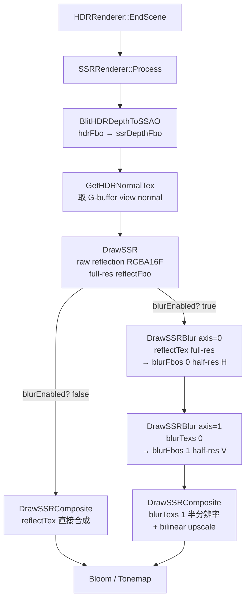
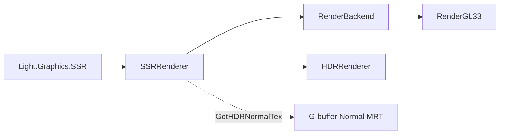

# Phase E.10 SSR Blur — 系统设计文档

> 日期：2026-05-12  
> 6A 阶段：**阶段 2 Architect**  
> 输入：CONSENSUS_PhaseE_10.md（half-res blur ping-pong 方案）

---

## 1. 整体架构

### 1.1 数据流图



### 1.2 与 Phase E.9 对比

| 维度 | Phase E.9 | Phase E.10 |
|------|-----------|-----------|
| 反射 RT | 1 个 full-res RGBA16F | 不变 |
| Blur RT | — | 2 个 half-res RGBA16F (ping-pong) |
| Process pass 数 | 2 (raw + composite) | 2 或 4（取决 BlurEnabled） |
| Lua API | 22 函数 | 24 函数 (+SetBlurRadius/GetBlurRadius) |
| Backend 接口 | 7 (含 SupportsSSR) | 9 (+CreateSSRBlurRT/DrawSSRBlur) |
| GLSL shader | 2 (raw + composite) | 3 (+FS_SSR_BLUR) |

---

## 2. 分层设计

### 2.1 层次结构

```
┌──────────────────────────────────────┐
│ Lua App                              │
│   SSR.SetBlurEnabled(true)           │
│   SSR.SetBlurRadius(2.0)             │
└──────────────────┬───────────────────┘
                   ▼
┌──────────────────────────────────────┐
│ Light.Graphics.SSR (Lua module)      │
│   l_SSR_SetBlurRadius (new)          │
│   l_SSR_GetBlurRadius (new)          │
│   l_SSR_SetBlurEnabled (existing)    │
└──────────────────┬───────────────────┘
                   ▼
┌──────────────────────────────────────┐
│ SSRRenderer (C++ module)             │
│   State += blurFbos[2] / blurTexs[2] │
│           blurW / blurH / blurRadius │
│   Enable()  分配 blur RT             │
│   Disable() 释放 blur RT             │
│   Resize()  重建 blur RT             │
│   Process() 条件执行 blur            │
└──────────────────┬───────────────────┘
                   ▼
┌──────────────────────────────────────┐
│ RenderBackend (interface)            │
│   CreateSSRBlurRT (new virtual)      │
│   DeleteSSRBlurRT (new virtual)      │
│   DrawSSRBlur (new virtual)          │
└──────────────────┬───────────────────┘
                   ▼
┌──────────────────────────────────────┐
│ RenderGL33 (concrete)                │
│   programSSRBlur (new GL program)    │
│   FS_SSR_BLUR_SOURCE (new shader)    │
│   locSSRBlur_* (uniform cache)       │
└──────────────────────────────────────┘
```

### 2.2 模块依赖关系图



无新依赖；纯增量扩展。

---

## 3. 核心组件设计

### 3.1 SSRRenderer State 扩展

```cpp
struct State {
    // === Phase E.9 既有 ===
    RenderBackend* backend = nullptr;
    bool   supported       = false;
    bool   enabled         = false;
    bool   autoEnable      = false;
    int    rtW             = 0;
    int    rtH             = 0;
    
    uint32_t depthFbo      = 0;
    uint32_t depthTex      = 0;
    uint32_t reflectFbo    = 0;
    uint32_t reflectTex    = 0;
    
    // Phase E.9 参数
    int     maxSteps       = 64;
    float   stepSize       = 0.1f;
    float   thickness      = 0.5f;
    float   maxDistance    = 50.0f;
    float   intensity      = 0.7f;
    float   edgeFade       = 0.1f;
    bool    blurEnabled    = false;
    
    // === Phase E.10 新增 ===
    uint32_t blurFbos[2]   = {0, 0};   ///< half-res ping-pong (H pass + V pass)
    uint32_t blurTexs[2]   = {0, 0};
    int      blurW         = 0;        ///< 实际 half-res 宽 (≥ 1)
    int      blurH         = 0;
    float    blurRadius    = 1.5f;     ///< texel 半径乘子, clamp [0.5, 4.0]
};
```

### 3.2 SSRRenderer 函数变更清单

| 函数 | 变更类型 | 说明 |
|------|---------|------|
| `Init` | 无变化 | 仅记 backend |
| `Shutdown` | 无变化 | Disable 已处理资源 |
| `Enable(w,h)` | **修改** | 增加 `CreateSSRBlurRT` 调用 + 失败回滚 |
| `Disable` | **修改** | 增加 `DeleteSSRBlurRT` |
| `Resize(w,h)` | **修改** | 重建 blur RT |
| `IsEnabled` / `IsSupported` | 无变化 | — |
| `OnHDREnabled/Disabled/Resized` | 无变化 | 间接走 Enable/Disable/Resize |
| `SetAutoEnable / GetAutoEnable` | 无变化 | — |
| 7 个 Phase E.9 参数 setter/getter | 无变化 | — |
| `SetBlurEnabled` | **行为升级** | no-op → 记录标志位（Process 会读） |
| `GetBlurEnabled` | 无变化 | — |
| `SetBlurRadius / GetBlurRadius` | **新增** | clamp [0.5, 4.0]，默认 1.5 |
| `GetReflectionTexId` | 无变化 | 仍返回 full-res reflectTex |
| `Process` | **修改** | 增加 blur pass 分支 |

### 3.3 Backend 接口设计

```cpp
// @ render_backend.h Phase E.9 节末追加

// ==================== Phase E.10 — SSR Blur ====================

/// 创建 half-res blur ping-pong RT (RGBA16F × 2)
/// @param wFull, hFull  full-res 输入（内部自动 max(1, w/2)）
/// @param outFbos[2]    输出 FBO 数组
/// @param outTexs[2]    输出 tex 数组（GL_LINEAR, GL_CLAMP_TO_EDGE）
/// @param outW, outH    实际 half-res 尺寸（外部读取，用于 viewport/uniform）
/// @return true=成功，失败时所有 out* 清零
virtual bool CreateSSRBlurRT(int /*wFull*/, int /*hFull*/,
                              uint32_t /*outFbos*/[2], uint32_t /*outTexs*/[2],
                              int* /*outW*/, int* /*outH*/) { return false; }
virtual void DeleteSSRBlurRT(uint32_t /*fbos*/[2], uint32_t /*texs*/[2]) {}

/// separable Gaussian blur pass: srcTex → dstFbo
/// @param srcTex  源 tex（可能 full-res 或 half-res，由 caller 控制）
/// @param dstFbo  目标 FBO
/// @param dstW, dstH  目标 RT 尺寸（uTexel 由此计算）
/// @param axis    0=horizontal, 1=vertical
/// @param radius  texel 半径乘子 [0.5, 4.0]
virtual void DrawSSRBlur(uint32_t /*srcTex*/, uint32_t /*dstFbo*/,
                          int /*dstW*/, int /*dstH*/,
                          int /*axis*/, float /*radius*/) {}
```

### 3.4 GL33 实现要点

#### shader 设计 (`FS_SSR_BLUR_SOURCE`)

```glsl
// GLES3 profile
#version 300 es
precision highp float;
precision highp sampler2D;

in  vec2 vUV;
out vec4 FragColor;

uniform sampler2D uSrcTex;
uniform vec2  uTexel;    // 1.0 / vec2(dstW, dstH)
uniform int   uAxis;     // 0=H, 1=V
uniform float uRadius;   // [0.5, 4.0]

void main() {
    // 5-tap Gaussian (sigma ≈ 1.6) weights
    const float W0 = 0.227027;   // center
    const float W1 = 0.194594;   // ±1 step
    const float W2 = 0.121622;   // ±2 step
    
    vec2 dir = (uAxis == 0)
             ? vec2(uTexel.x, 0.0)
             : vec2(0.0, uTexel.y);
    
    vec2 off1 = dir * uRadius;
    vec2 off2 = dir * uRadius * 2.0;
    
    vec4 c = texture(uSrcTex, vUV) * W0;
    c += texture(uSrcTex, vUV + off1) * W1;
    c += texture(uSrcTex, vUV - off1) * W1;
    c += texture(uSrcTex, vUV + off2) * W2;
    c += texture(uSrcTex, vUV - off2) * W2;
    
    FragColor = c;
}
```

GL 3.3 版本：把 `#version 300 es precision highp` 改为 `#version 330 core`，其他完全一致。

#### state 字段扩展（GL33Backend class）

```cpp
// Phase E.10 — SSR Blur (new)
GLuint programSSRBlur = 0;
bool   ssrBlurSupported = false;
GLint  locSSRBlur_SrcTex = -1;
GLint  locSSRBlur_Texel  = -1;
GLint  locSSRBlur_Axis   = -1;
GLint  locSSRBlur_Radius = -1;
```

#### Init / Shutdown 改动

- Init：编译 `programSSRBlur`，缓存 uniform location，绑定 sampler slot 0
- Shutdown：`glDeleteProgram(programSSRBlur)`

#### CreateSSRBlurRT 实现要点

```cpp
bool CreateSSRBlurRT(int wFull, int hFull,
                     uint32_t outFbos[2], uint32_t outTexs[2],
                     int* outW, int* outH) override {
    if (!ssrSupported || wFull <= 0 || hFull <= 0) return false;
    
    int hw = std::max(1, wFull / 2);
    int hh = std::max(1, hFull / 2);
    
    for (int i = 0; i < 2; ++i) {
        glGenFramebuffers(1, &outFbos[i]);
        glGenTextures(1, &outTexs[i]);
        glBindTexture(GL_TEXTURE_2D, outTexs[i]);
        glTexImage2D(GL_TEXTURE_2D, 0, GL_RGBA16F, hw, hh, 0, GL_RGBA, GL_HALF_FLOAT, nullptr);
        glTexParameteri(GL_TEXTURE_2D, GL_TEXTURE_MIN_FILTER, GL_LINEAR);  // bilinear 自动 upscale
        glTexParameteri(GL_TEXTURE_2D, GL_TEXTURE_MAG_FILTER, GL_LINEAR);
        glTexParameteri(GL_TEXTURE_2D, GL_TEXTURE_WRAP_S,     GL_CLAMP_TO_EDGE);
        glTexParameteri(GL_TEXTURE_2D, GL_TEXTURE_WRAP_T,     GL_CLAMP_TO_EDGE);
        
        glBindFramebuffer(GL_FRAMEBUFFER, outFbos[i]);
        glFramebufferTexture2D(GL_FRAMEBUFFER, GL_COLOR_ATTACHMENT0,
                               GL_TEXTURE_2D, outTexs[i], 0);
        
        if (glCheckFramebufferStatus(GL_FRAMEBUFFER) != GL_FRAMEBUFFER_COMPLETE) {
            // cleanup + 返回失败
            DeleteSSRBlurRT(outFbos, outTexs);
            *outW = *outH = 0;
            return false;
        }
    }
    glBindFramebuffer(GL_FRAMEBUFFER, 0);
    *outW = hw;
    *outH = hh;
    return true;
}
```

#### DrawSSRBlur 实现要点

```cpp
void DrawSSRBlur(uint32_t srcTex, uint32_t dstFbo,
                 int dstW, int dstH,
                 int axis, float radius) override {
    if (!ssrSupported || !programSSRBlur || !srcTex || !dstFbo || dstW <= 0 || dstH <= 0) return;
    
    glBindFramebuffer(GL_FRAMEBUFFER, dstFbo);
    glViewport(0, 0, dstW, dstH);
    glDisable(GL_DEPTH_TEST);
    glDisable(GL_BLEND);
    glDisable(GL_CULL_FACE);
    glDisable(GL_SCISSOR_TEST);
    
    glUseProgram(programSSRBlur);
    if (locSSRBlur_Texel  >= 0) glUniform2f(locSSRBlur_Texel,  1.0f/dstW, 1.0f/dstH);
    if (locSSRBlur_Axis   >= 0) glUniform1i(locSSRBlur_Axis,   axis ? 1 : 0);
    if (locSSRBlur_Radius >= 0) glUniform1f(locSSRBlur_Radius, radius);
    
    glActiveTexture(GL_TEXTURE0);
    glBindTexture(GL_TEXTURE_2D, srcTex);
    
    // 复用 SSR composite/SSAO blur 的 fullscreen quad 绘制（VAO + glDrawArrays(GL_TRIANGLES, 0, 3)）
    drawFullscreenTriangle();
    
    glBindTexture(GL_TEXTURE_2D, 0);
    glUseProgram(0);
    glBindFramebuffer(GL_FRAMEBUFFER, 0);
}
```

---

## 4. 接口契约

### 4.1 Lua API 契约

| 函数 | 输入 | 输出 | clamp/异常 |
|------|------|------|----------|
| `SetBlurEnabled(bool)` | 任意 → `lua_toboolean` | 0 返回值 | 无 |
| `GetBlurEnabled()` | 无 | bool | 无 |
| `SetBlurRadius(num)` | float | 0 返回值 | clamp [0.5, 4.0] |
| `GetBlurRadius()` | 无 | number | 返回当前 clamp 后值 |

### 4.2 行为契约

| 场景 | 期望行为 |
|------|---------|
| `SSR.Enable(960, 540)` 成功 | reflect RT (960×540) + blur RT (480×270) 全部分配 |
| `SetBlurEnabled(true)` 后 Process | Process 内执行 H + V 两 pass blur，composite 用 half-res blur tex |
| `SetBlurEnabled(false)` 后 Process | Process 跳过 blur，composite 用 full-res reflectTex（与 Phase E.9 相同） |
| `Resize(800, 600)` | reflect RT (800×600) + blur RT (400×300) 全部重建 |
| `Disable()` | reflect + depth + blur RT 全部释放，状态归零 |
| Legacy backend (`SupportsSSR=false`) | `Enable` 返 false，所有 blur 调用 no-op |
| half-res 分配失败 | `Enable` 返 false，回滚已分配的 reflect/depth RT |

---

## 5. 异常处理策略

| 异常 | 处理 |
|------|------|
| `CreateSSRBlurRT` 失败 | `Enable` 失败回滚 reflect + depth；返 false |
| `DrawSSRBlur` 收到 dstFbo=0 | silent skip（不影响后续 composite） |
| BlurEnabled=true 但 blurFbos[0]=0（异常状态） | Process 跳过 blur，回退到 full-res reflectTex |
| `SetBlurRadius(NaN)` | clamp 到 [0.5, 4.0]（NaN 比较返 false，最终归 1.5 默认） |
| FBO incomplete | shader log + DeleteSSRBlurRT 自清理 |

---

## 6. 测试策略

### 6.1 smoke 扩展（`scripts/smoke/ssr.lua`）

新增检查点（≥ 8 条）：

1. **Surface**：`SetBlurRadius` / `GetBlurRadius` 函数存在性（既有 22→新检查 24）
2. **Default value**：`GetBlurRadius() == 1.5`
3. **Round-trip**：`SetBlurRadius(2.5)` 后 `GetBlurRadius() ≈ 2.5`
4. **Clamp low**：`SetBlurRadius(-1)` 后 `GetBlurRadius() == 0.5`
5. **Clamp high**：`SetBlurRadius(100)` 后 `GetBlurRadius() == 4.0`
6. **Restore default**：测试结尾 `SetBlurRadius(1.5)`
7. **BlurEnabled behavior**（既有节，增加注释说明 Phase E.10 已激活）
8. **headless 兼容**：所有新检查在 `SSR.Enable` 失败的 headless 路径下仍通过

### 6.2 demo 扩展（`samples/demo_ssr/main.lua`）

新增键位：

| 键 | 作用 |
|----|------|
| `B` | 切换 BlurEnabled |
| `9` / `0` | BlurRadius -/+ （步长 0.25） |

OSD 显示 `blur=ON/OFF radius=2.50`。

### 6.3 全量回归

8 个核心渲染 smoke（ssao/hdr/bloom/lens_fx/lens_flare/auto_exposure/graphics/lighting2d）全通过。

### 6.4 CI 验证

6 平台 GitHub Actions 全 success（Linux/iOS/Web/Android/macOS/Windows）。

---

## 7. 数据流向（半分辨率 blur 关键路径）

```
1. DrawSSR:    [full-res 1920×1080] reflectFbo ← raw reflection
                                    ↓
2. DrawSSRBlur axis=0:
   src = reflectTex (1920×1080)
   dst = blurFbos[0] (960×540 half-res H-blurred)
   uTexel = (1/960, 1/540)        ★ texel 用 dst 尺寸
                                    ↓
3. DrawSSRBlur axis=1:
   src = blurTexs[0] (960×540)
   dst = blurFbos[1] (960×540 half-res HV-blurred)
   uTexel = (1/960, 1/540)
                                    ↓
4. DrawSSRComposite:
   reflectTex 参数 = blurTexs[1] (960×540)
   composite shader 内 texture(uReflectTex, vUV) 触发硬件 bilinear filter
   自动 upscale 到 full-res HDR (1920×1080)
```

**为什么 H pass 从 full-res 直接到 half-res？**

第一 pass 同时承担 downsample + horizontal blur：
- 输入：full-res reflectTex
- 输出：half-res 中间
- shader 用 `texture()` + bilinear filter，正常采样即可（GPU 自动 box filter）
- 5-tap Gaussian 在 half-res 空间做，权重不变

避免额外 downsample pass，性能更优。

---

## 8. 验证设计可行性

| 设计点 | 可行性 |
|--------|------|
| 1 个新 shader + 2 个新 backend 接口 | ✅ SSAO blur 模板已验证 |
| half-res ping-pong | ✅ Phase E.4 Bloom 已用类似 6 级 mip chain |
| BlurEnabled 行为升级 | ✅ 既有 API 不变，仅 Process 内分支 |
| 资源生命周期（Enable/Disable/Resize） | ✅ 镜像 SSAO ping-pong 模式 |
| 与 Phase E.9 backward compat | ✅ 默认 BlurEnabled=false，零行为差异 |
| smoke + demo + CI | ✅ 模板成熟，复制现有 SSR 模式 |
| Legacy backend silent fallback | ✅ default no-op virtual 已覆盖 |

---

**下一步**：进入阶段 3 Atomize → 拆分为原子任务 TASK_PhaseE_10.md
