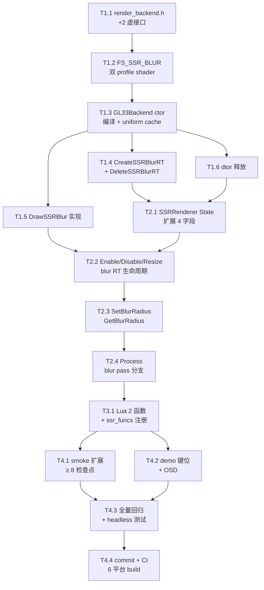

# Phase E.10 SSR Blur — 任务拆分文档（TASK）

> 日期：2026-05-12  
> 6A 阶段：**阶段 3 Atomize**  
> 输入：DESIGN_PhaseE_10.md

---

## 1. 拆分原则

- **可独立验证**：每个任务有明确输入/输出契约
- **复杂度可控**：单任务工作量 ≤ 90 min
- **依赖链清晰**：无循环依赖
- **AI 高成功率**：每个任务边界明确

---

## 2. 任务依赖图

---

## 3. 原子任务详表

### T1 — Backend 层（6 任务）

#### T1.1 — `render_backend.h` +2 虚接口
- **输入**：DESIGN §3.3 接口定义
- **输出**：在 Phase E.9 SSR 块末追加 Phase E.10 节，定义 `CreateSSRBlurRT/DeleteSSRBlurRT/DrawSSRBlur` 三个 default no-op virtual
- **验收**：头文件编译通过；Legacy backend 自动 no-op
- **工作量**：15 min

#### T1.2 — FS_SSR_BLUR shader（双 profile）
- **输入**：DESIGN §3.4 shader 代码
- **输出**：在 `render_gl33.cpp` 中 FS_SSR_COMPOSITE_SOURCE 后追加 GLES3 + GL33 两个 raw string 常量
- **验收**：shader 可独立编译（buildProgram 不返 0）
- **工作量**：20 min

#### T1.3 — GL33Backend ctor 编译 + uniform cache
- **输入**：T1.2 shader 源码
- **输出**：构造函数中加 `programSSRBlur = buildProgram(FS_SSR_BLUR_SOURCE, "SSRBlur")`；缓存 4 个 uniform location；绑定 sampler slot 0；新增字段 `ssrBlurSupported`；log 中加 SSR blur 状态
- **验收**：Init 后 `programSSRBlur != 0`；log 显示 "SSR blur: yes"
- **工作量**：20 min

#### T1.4 — CreateSSRBlurRT + DeleteSSRBlurRT
- **输入**：DESIGN §3.4 实现要点
- **输出**：在 `render_gl33.cpp` GL33Backend 类中实现 2 个 override 函数
- **验收**：传入 (960,540) 返回 (480,270)，2 个 FBO + Tex 全分配成功；FBO incomplete 时正确清理
- **工作量**：30 min

#### T1.5 — DrawSSRBlur 实现
- **输入**：DESIGN §3.4 实现要点
- **输出**：在 GL33Backend 中实现 override 函数；复用现有 fullscreen quad 绘制
- **验收**：调用后 dstFbo 内容更新；多次调用无 leak
- **工作量**：25 min

#### T1.6 — GL33Backend dtor 释放
- **输入**：T1.3 新增字段
- **输出**：`Shutdown()` 中 `glDeleteProgram(programSSRBlur)`；`ssrBlurSupported = false`
- **验收**：repeat Init/Shutdown 无 leak
- **工作量**：10 min

### T2 — SSRRenderer 模块（4 任务）

#### T2.1 — State 扩展
- **输入**：DESIGN §3.1 State 结构
- **输出**：`ssr_renderer.cpp` 内 State 加 `blurFbos[2] / blurTexs[2] / blurW / blurH / blurRadius`
- **验收**：默认初值正确（数组 0，blurRadius=1.5）
- **工作量**：10 min

#### T2.2 — Enable/Disable/Resize blur RT 生命周期
- **输入**：T1.4 backend 接口
- **输出**：
  - `Enable`：在 reflect RT 创建成功后调 `CreateSSRBlurRT`，失败则回滚已有资源
  - `Disable`：调 `DeleteSSRBlurRT`，清零 blurFbos/blurTexs/blurW/blurH
  - `Resize`：触发 Disable + Enable（或单独重建 blur RT；推荐前者保持简单）
- **验收**：Enable 后 blurW/blurH > 0；Disable 后归零；Resize 不漏资源
- **工作量**：30 min

#### T2.3 — SetBlurRadius + GetBlurRadius
- **输入**：DESIGN §3.2 函数清单
- **输出**：`ssr_renderer.h` 加 2 函数声明；`.cpp` 加实现（clamp [0.5, 4.0]）
- **验收**：边界 clamp 行为正确
- **工作量**：10 min

#### T2.4 — Process blur pass 分支
- **输入**：DESIGN §1.1 数据流图 + §7 关键路径
- **输出**：`Process` 在 `DrawSSR` 后增加判断：`if (g.blurEnabled && blurFbos[0] && blurFbos[1])` 走 2-pass blur 用 `blurTexs[1]` 作 composite 源；否则用 `reflectTex`（Phase E.9 路径）
- **验收**：BlurEnabled=true 时 4 个 GL pass；false 时 2 个 pass
- **工作量**：20 min

### T3 — Lua 绑定（1 任务）

#### T3.1 — Lua 2 函数 + ssr_funcs 注册
- **输入**：T2.3 模块层 API
- **输出**：`light_graphics.cpp` 加 `l_SSR_SetBlurRadius / l_SSR_GetBlurRadius`；在 `ssr_funcs[]` 数组中追加 2 条；更新顶部注释 "22→24"
- **验收**：编译通过；`Light.Graphics.SSR.SetBlurRadius / GetBlurRadius` 可访问
- **工作量**：15 min

### T4 — 测试 + demo + CI（4 任务）

#### T4.1 — smoke 扩展（`scripts/smoke/ssr.lua`）
- **输入**：DESIGN §6.1 检查点列表
- **输出**：在现有 38 检查点基础上追加 BlurRadius 节（≥ 6 新检查点）；更新顶部注释 "22→24" + 顶部 fns 数组加 2 名
- **验收**：本地 ssr.lua 全通过（既有 38 + 新 ≥ 6 = ≥ 44 检查点）
- **工作量**：20 min

#### T4.2 — demo 键位扩展（`samples/demo_ssr/main.lua`）
- **输入**：DESIGN §6.2 键位映射
- **输出**：增加 `B`（切 blur on/off）+ `9` / `0`（radius -/+）；OSD 加 `blur=%s radius=%.2f` 行；reset (R 键) 加 blur 默认值
- **验收**：headless probe exit 0；keybind 按预期触发
- **工作量**：15 min

#### T4.3 — 全量回归 + headless 验证
- **输入**：T3.1 + T4.1 + T4.2
- **输出**：本地编译 + 跑 8 核心渲染 smoke + ssr.lua + demo headless
- **验收**：0 error 0 new warning；8 smoke 全通过；ssr.lua 全通过；demo headless exit 0
- **工作量**：15 min

#### T4.4 — commit + CI
- **输入**：T4.3 全部本地验证
- **输出**：git commit + push + `gh run watch`
- **验收**：6 平台 CI 全 success
- **工作量**：5 min（提交）+ ~10 min（CI 等待）

---

## 4. 任务汇总

| 任务 ID | 描述 | 工作量 | 依赖 |
|---------|------|-------|------|
| T1.1 | render_backend.h +2 接口 | 15 min | — |
| T1.2 | FS_SSR_BLUR shader | 20 min | — |
| T1.3 | GL33 ctor 编译 + cache | 20 min | T1.1, T1.2 |
| T1.4 | CreateSSRBlurRT/Delete | 30 min | T1.3 |
| T1.5 | DrawSSRBlur 实现 | 25 min | T1.3 |
| T1.6 | GL33 dtor 释放 | 10 min | T1.3 |
| T2.1 | State 扩展 | 10 min | T1.1 |
| T2.2 | Enable/Disable/Resize | 30 min | T1.4, T2.1 |
| T2.3 | SetBlurRadius/Get | 10 min | T2.1 |
| T2.4 | Process blur 分支 | 20 min | T1.5, T2.2, T2.3 |
| T3.1 | Lua 2 函数 | 15 min | T2.3 |
| T4.1 | smoke 扩展 | 20 min | T3.1 |
| T4.2 | demo 键位 | 15 min | T3.1 |
| T4.3 | 全量回归 | 15 min | T4.1, T4.2 |
| T4.4 | commit + CI | 15 min | T4.3 |
| **合计** | — | **~4.5 小时** | — |

实际 AI 实施速度通常优于上述估算，预期 **~2-3 小时**完成。

---

## 5. 验收 gate 检查

| Gate | 标准 |
|------|------|
| **覆盖完整需求** | ✅ blur 算法 / RT 分辨率 / radius API / BlurEnabled 升级 / shader / 集成 / smoke / demo |
| **依赖无循环** | ✅ Mermaid 图无回边 |
| **每任务可独立验证** | ✅ 每个任务有明确验收条件 |
| **复杂度评估合理** | ✅ 单任务 ≤ 30 min |

✅ 可进入阶段 4 Approve。
