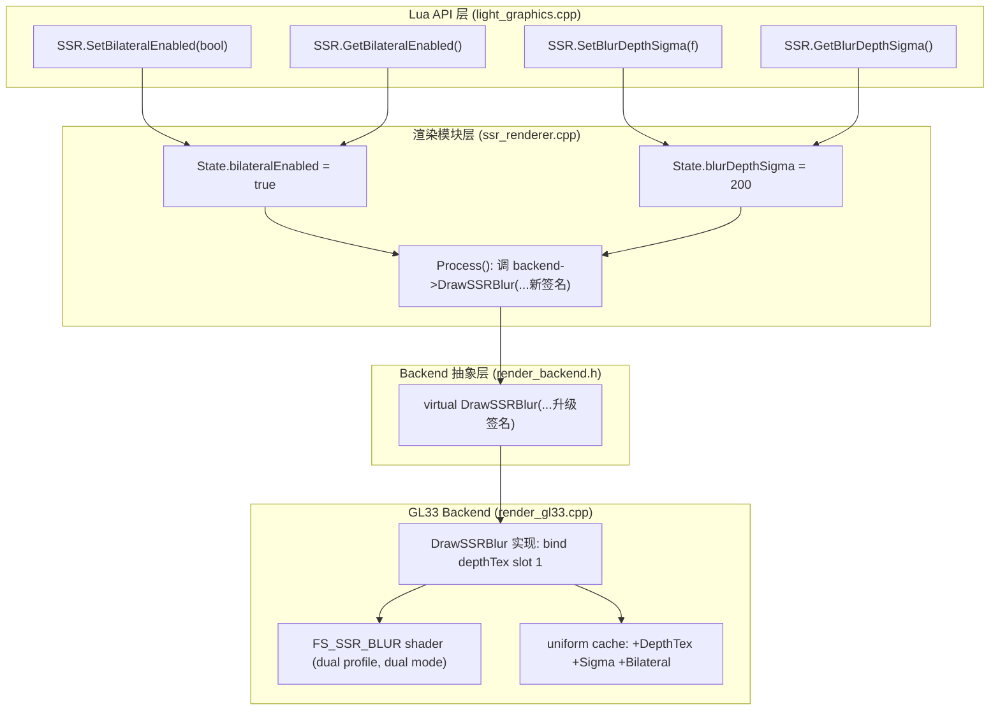
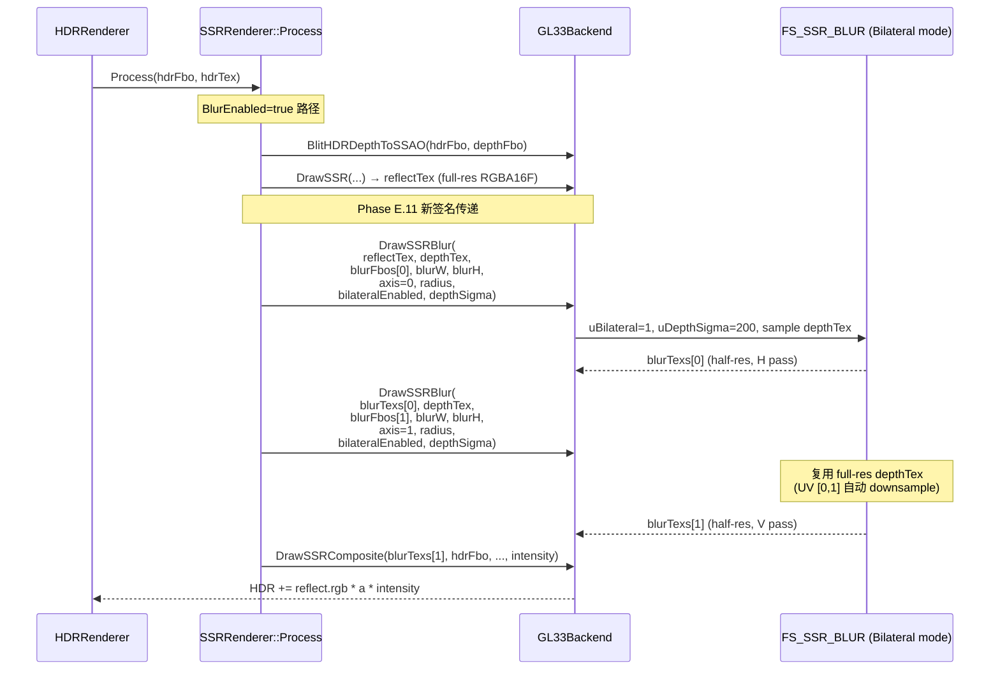
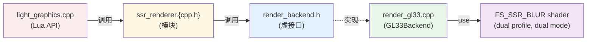

# Phase E.11 Bilateral SSR Blur — DESIGN 设计文档

> **阶段**：6A Workflow — 阶段 2 Architect（架构）
> **输入**：CONSENSUS_PhaseE_11.md（用户拍板"全启可调 Q1=B + Q2=B"）
> **基线**：Phase E.10 SSR Blur（commit `d64e6b4`）

---

## 1. 整体架构图



---

## 2. 数据流向图（详细 Process 内部）



---

## 3. 分层设计

### 3.1 Layer 1 — Lua API（light_graphics.cpp）

```cpp
// 4 个新函数，添加位置：l_SSR_GetBlurRadius 之后
static int l_SSR_SetBilateralEnabled(lua_State* L) {
    bool v = lua_toboolean(L, 1) != 0;
    SSRRenderer::SetBilateralEnabled(v);
    return 0;
}
static int l_SSR_GetBilateralEnabled(lua_State* L) {
    lua_pushboolean(L, SSRRenderer::GetBilateralEnabled() ? 1 : 0);
    return 1;
}
static int l_SSR_SetBlurDepthSigma(lua_State* L) {
    float v = (float)luaL_checknumber(L, 1);
    SSRRenderer::SetBlurDepthSigma(v);
    return 0;
}
static int l_SSR_GetBlurDepthSigma(lua_State* L) {
    lua_pushnumber(L, SSRRenderer::GetBlurDepthSigma());
    return 1;
}

// ssr_funcs[] 注册（在 GetBlurRadius 后插入）：
{"SetBilateralEnabled", l_SSR_SetBilateralEnabled},
{"GetBilateralEnabled", l_SSR_GetBilateralEnabled},
{"SetBlurDepthSigma",   l_SSR_SetBlurDepthSigma},
{"GetBlurDepthSigma",   l_SSR_GetBlurDepthSigma},
```

### 3.2 Layer 2 — SSRRenderer 模块（ssr_renderer.cpp/.h）

```cpp
// ssr_renderer.h 函数声明（追加）
void SetBilateralEnabled(bool flag);
bool GetBilateralEnabled();
void SetBlurDepthSigma(float v);
float GetBlurDepthSigma();
```

```cpp
// ssr_renderer.cpp State 字段（追加）
struct State {
    // ... 已有字段 ...
    bool  bilateralEnabled = true;     // Phase E.11 默认 true
    float blurDepthSigma   = 200.0f;   // Phase E.11 默认 200
};

// 实现（极简）
void SetBilateralEnabled(bool f)   { g.bilateralEnabled = f; }
bool GetBilateralEnabled()          { return g.bilateralEnabled; }
void  SetBlurDepthSigma(float v)   { g.blurDepthSigma = clampf(v, 50.0f, 500.0f); }
float GetBlurDepthSigma()           { return g.blurDepthSigma; }

// Process 内 blur 调用升级
if (g.blurEnabled && g.blurFbos[0] && g.blurFbos[1] && g.blurW > 0 && g.blurH > 0) {
    g.backend->DrawSSRBlur(g.reflectTex, g.depthTex,    // +depthTex
                            g.blurFbos[0], g.blurW, g.blurH,
                            0, g.blurRadius,
                            g.bilateralEnabled, g.blurDepthSigma);   // +2 params
    g.backend->DrawSSRBlur(g.blurTexs[0], g.depthTex,
                            g.blurFbos[1], g.blurW, g.blurH,
                            1, g.blurRadius,
                            g.bilateralEnabled, g.blurDepthSigma);
    finalReflectTex = g.blurTexs[1];
}
```

### 3.3 Layer 3 — Backend 抽象（render_backend.h）

```cpp
// Phase E.11 升级签名
virtual void DrawSSRBlur(uint32_t /*srcTex*/, uint32_t /*depthTex*/,
                          uint32_t /*dstFbo*/, int /*dstW*/, int /*dstH*/,
                          int /*axis*/, float /*radius*/,
                          bool /*bilateralEnabled*/, float /*depthSigma*/) {}
// 注释：Phase E.10 6 参数 → Phase E.11 9 参数
// +depthTex: bilateral mode 必需的深度数据源
// +bilateralEnabled: runtime mode switch (false=Gaussian, true=Bilateral)
// +depthSigma: bilateral 深度权重灵敏度 [50, 500]
```

### 3.4 Layer 4 — GL33 实现（render_gl33.cpp）

#### 3.4.1 Shader 升级（dual profile, dual mode）

```glsl
// GLES3 版本（#version 300 es + precision highp）
// GL33 版本（#version 330 core）

in  vec2 vUV;
out vec4 FragColor;

uniform sampler2D uSrcTex;
uniform sampler2D uDepthTex;   // Phase E.11 新, slot 1
uniform vec2  uTexel;
uniform int   uAxis;
uniform float uRadius;
uniform int   uBilateral;      // Phase E.11 新, 0=Gaussian, 非 0=Bilateral
uniform float uDepthSigma;     // Phase E.11 新

void main() {
    vec2 dir = (uAxis == 0) ? vec2(uTexel.x, 0.0) : vec2(0.0, uTexel.y);
    vec2 off1 = dir * uRadius;
    vec2 off2 = dir * uRadius * 2.0;

    const float W0 = 0.227027;
    const float W1 = 0.194594;
    const float W2 = 0.121622;

    if (uBilateral == 0) {
        // Phase E.10 Gaussian 路径（向后兼容）
        vec4 c = texture(uSrcTex, vUV) * W0;
        c += texture(uSrcTex, vUV + off1) * W1;
        c += texture(uSrcTex, vUV - off1) * W1;
        c += texture(uSrcTex, vUV + off2) * W2;
        c += texture(uSrcTex, vUV - off2) * W2;
        FragColor = c;
        return;
    }

    // Phase E.11 Bilateral 路径
    float cDepth = texture(uDepthTex, vUV).r;
    vec4  sum   = texture(uSrcTex, vUV) * W0;
    float wsum  = W0;

    vec2 uv;  float d, w;

    uv = vUV + off1;
    d  = texture(uDepthTex, uv).r;
    w  = W1 * exp(-abs(cDepth - d) * uDepthSigma);
    sum += texture(uSrcTex, uv) * w; wsum += w;

    uv = vUV - off1;
    d  = texture(uDepthTex, uv).r;
    w  = W1 * exp(-abs(cDepth - d) * uDepthSigma);
    sum += texture(uSrcTex, uv) * w; wsum += w;

    uv = vUV + off2;
    d  = texture(uDepthTex, uv).r;
    w  = W2 * exp(-abs(cDepth - d) * uDepthSigma);
    sum += texture(uSrcTex, uv) * w; wsum += w;

    uv = vUV - off2;
    d  = texture(uDepthTex, uv).r;
    w  = W2 * exp(-abs(cDepth - d) * uDepthSigma);
    sum += texture(uSrcTex, uv) * w; wsum += w;

    FragColor = sum / max(wsum, 1e-4);
}
```

#### 3.4.2 GL33Backend State +2 uniform locs

```cpp
// 在 Phase E.10 已有的 locSSRBlur_* 后追加
GLint locSSRBlur_DepthTex   = -1;   // Phase E.11
GLint locSSRBlur_Bilateral  = -1;   // Phase E.11
GLint locSSRBlur_DepthSigma = -1;   // Phase E.11
```

#### 3.4.3 InitLensFx 内 cache uniform

```cpp
// 在 Phase E.10 已有的 locSSRBlur_Radius 缓存之后追加
if (programSSRBlur && ssrSupported) {
    // ... Phase E.10 ...
    locSSRBlur_DepthTex   = glGetUniformLocation(programSSRBlur, "uDepthTex");
    locSSRBlur_Bilateral  = glGetUniformLocation(programSSRBlur, "uBilateral");
    locSSRBlur_DepthSigma = glGetUniformLocation(programSSRBlur, "uDepthSigma");
    glUseProgram(programSSRBlur);
    if (locSSRBlur_SrcTex   >= 0) glUniform1i(locSSRBlur_SrcTex, 0);   // slot 0
    if (locSSRBlur_DepthTex >= 0) glUniform1i(locSSRBlur_DepthTex, 1); // slot 1 Phase E.11
    glUseProgram(0);
}
```

#### 3.4.4 DrawSSRBlur 实现升级

```cpp
void DrawSSRBlur(uint32_t srcTex, uint32_t depthTex,
                 uint32_t dstFbo, int dstW, int dstH,
                 int axis, float radius,
                 bool bilateralEnabled, float depthSigma) override {
    if (!ssrBlurSupported || !programSSRBlur || !srcTex || !depthTex || !dstFbo ||
        dstW <= 0 || dstH <= 0) return;

    glBindFramebuffer(GL_FRAMEBUFFER, (GLuint)dstFbo);
    glViewport(0, 0, dstW, dstH);
    glDisable(GL_DEPTH_TEST);
    glDisable(GL_SCISSOR_TEST);
    glDisable(GL_BLEND);
    glDisable(GL_CULL_FACE);

    glUseProgram(programSSRBlur);
    if (locSSRBlur_Texel      >= 0) glUniform2f(locSSRBlur_Texel, 1.0f / (float)dstW, 1.0f / (float)dstH);
    if (locSSRBlur_Axis       >= 0) glUniform1i(locSSRBlur_Axis, axis ? 1 : 0);
    if (locSSRBlur_Radius     >= 0) glUniform1f(locSSRBlur_Radius, radius);
    if (locSSRBlur_Bilateral  >= 0) glUniform1i(locSSRBlur_Bilateral, bilateralEnabled ? 1 : 0);
    if (locSSRBlur_DepthSigma >= 0) glUniform1f(locSSRBlur_DepthSigma, depthSigma);

    glActiveTexture(GL_TEXTURE0);
    glBindTexture(GL_TEXTURE_2D, (GLuint)srcTex);
    glActiveTexture(GL_TEXTURE1);                              // Phase E.11 新
    glBindTexture(GL_TEXTURE_2D, (GLuint)depthTex);

    glBindVertexArray(vaoTonemap);
    glDrawArrays(GL_TRIANGLES, 0, 6);

    glBindVertexArray(0);
    glActiveTexture(GL_TEXTURE1);                              // Phase E.11 新
    glBindTexture(GL_TEXTURE_2D, 0);
    glActiveTexture(GL_TEXTURE0);
    glBindTexture(GL_TEXTURE_2D, 0);
    glUseProgram(0);
    glBindFramebuffer(GL_FRAMEBUFFER, 0);
}
```

---

## 4. 模块依赖关系图



**依赖方向**：单向向下，无循环

---

## 5. 接口契约定义

### 5.1 backend `DrawSSRBlur` 契约

```cpp
/// SSR Blur pass (separable, Phase E.11 支持 Gaussian / Bilateral 双模式)
///
/// @param srcTex          源 tex (full-res reflect 或 half-res blur 中间, 由 caller 控制)
/// @param depthTex        SSR depth tex (Phase E.11 必需, full-res, NEAREST)
/// @param dstFbo          目标 FBO (half-res blurFbos[axis])
/// @param dstW, dstH      目标 RT 尺寸 (uTexel = 1/dstSize)
/// @param axis            0=horizontal, 1=vertical
/// @param radius          texel 半径乘子 [0.5, 4.0]
/// @param bilateralEnabled  true=Phase E.11 Bilateral, false=Phase E.10 Gaussian
/// @param depthSigma      bilateral 深度权重 σ [50, 500] (bilateralEnabled=false 时 ignored)
///
/// 预期行为:
///   - Bilateral=false: 5-tap separable Gaussian, weights [W0,W1,W1,W2,W2]
///   - Bilateral=true:  上述 weights × bilateral factor exp(-|Δd|·σ), normalized
///
/// 失败模式 (silent no-op):
///   - !ssrBlurSupported (shader 编译失败 / 旧 backend)
///   - srcTex / depthTex / dstFbo == 0
///   - dstW <= 0 || dstH <= 0
virtual void DrawSSRBlur(uint32_t srcTex, uint32_t depthTex,
                          uint32_t dstFbo, int dstW, int dstH,
                          int axis, float radius,
                          bool bilateralEnabled, float depthSigma) {}
```

### 5.2 Lua API 契约

```lua
--- 切换 bilateral 模式 (Phase E.11)
--- @param flag boolean true = Bilateral (depth-aware, 默认), false = 纯 Gaussian (Phase E.10 路径)
--- @note 仅在 BlurEnabled=true 时有效；不影响内存或资源分配
Light.Graphics.SSR.SetBilateralEnabled(flag)

--- 查询 bilateral 模式
--- @return boolean
Light.Graphics.SSR.GetBilateralEnabled() -> boolean

--- 设置 bilateral 深度权重灵敏度 (Phase E.11)
--- @param sigma float 范围 [50, 500] (clamp 自动应用)，默认 200
--- @note σ 越大，跨深度边模糊衰减越快（锐利边缘保留）
---       σ 越小，跨深度边权重宽容（近似 Gaussian 行为）
Light.Graphics.SSR.SetBlurDepthSigma(sigma)

--- 查询当前 σ
Light.Graphics.SSR.GetBlurDepthSigma() -> float
```

---

## 6. 异常处理策略

### 6.1 失败容忍矩阵

| 失败场景 | 行为 | 用户感知 |
|---------|------|---------|
| Phase E.10 ssrBlurSupported = false（旧 backend） | DrawSSRBlur silent no-op | blur 不可见，无崩溃 |
| depthTex 为 0（不应发生，但防御） | DrawSSRBlur silent no-op | 该 blur pass 跳过 |
| bilateralEnabled=true 但 backend 不支持 MRT（depth tex 不存在） | Process 中 `BlitHDRDepthToSSAO` 已先 silent skip | SSR 整体不可见 |
| depthSigma 用户传 -100 | `clampf(v, 50, 500)` 自动归到 50 | 行为退化为接近 Gaussian |
| Lua 调用 `SetBilateralEnabled(nil)` | `lua_toboolean(nil) = false` | 视为 false（合理） |

### 6.2 默认值兜底

```
所有 state 字段初始化:
  - bilateralEnabled = true   (新建项目默认最佳行为)
  - blurDepthSigma   = 200.0  (与 SSAO 一致, 通用)
```

---

## 7. 测试策略

### 7.1 Surface 测试（compile-time guarantee）

```lua
fns = {..., "SetBilateralEnabled", "GetBilateralEnabled",
            "SetBlurDepthSigma",   "GetBlurDepthSigma"}
-- 共 28 函数, 缺一即 fail
```

### 7.2 Default value 测试

```lua
assert(SSR.GetBilateralEnabled() == true)
assert(math.abs(SSR.GetBlurDepthSigma() - 200.0) < 1e-4)
```

### 7.3 Round-trip 测试

```lua
SSR.SetBilateralEnabled(false)
assert(SSR.GetBilateralEnabled() == false)
SSR.SetBilateralEnabled(true)
assert(SSR.GetBilateralEnabled() == true)

SSR.SetBlurDepthSigma(150)
assert(math.abs(SSR.GetBlurDepthSigma() - 150) < 1e-4)
```

### 7.4 Clamp 边界测试

```lua
SSR.SetBlurDepthSigma(0)        -- 应 clamp 到 50
assert(math.abs(SSR.GetBlurDepthSigma() - 50) < 1e-4)
SSR.SetBlurDepthSigma(1000)     -- 应 clamp 到 500
assert(math.abs(SSR.GetBlurDepthSigma() - 500) < 1e-4)
```

### 7.5 Restore defaults 测试

```lua
SSR.SetBilateralEnabled(true)
SSR.SetBlurDepthSigma(200.0)
```

---

## 8. 数据流向（细节）

### 8.1 一次 Process 调用的完整数据流

```
HDR FBO (3D scene 已渲染)
    ├─ color (RGBA16F full-res) ────┐
    ├─ depth (DEPTH24_STENCIL8) ───┐│
    └─ normal MRT (RG16F) ─────────┐││
                                   │││
                                   │││
       BlitHDRDepthToSSAO()        │││
        ▼                          │││
   depthTex (RGBA16F like, full)   │││
        │                          │││
        ├──┬─────────────────────────┘ │
        │  │                          │
        ▼  ▼                          ▼
   DrawSSR ───────► reflectTex (RGBA16F full-res)
                       │
                       │ [if blurEnabled]
                       ▼
   DrawSSRBlur (axis=0, bilateral=true)
     - bind srcTex=reflectTex (slot 0)
     - bind depthTex (slot 1) ────────── Phase E.11 关键
     - uBilateral=1, uDepthSigma=200
     - 5-tap loop: 中心 + 4 邻居, 各 1 src + 1 depth fetch
     ▼
   blurTexs[0] (half-res RGBA16F)
                       │
                       ▼
   DrawSSRBlur (axis=1, bilateral=true)
     - 同上 with srcTex=blurTexs[0]
     ▼
   blurTexs[1] (half-res RGBA16F)
                       │
                       ▼
   DrawSSRComposite(blurTexs[1], hdrFbo, intensity)
     - bilinear upscale (隐式)
     - additive blend
     ▼
   HDR FBO color updated
```

---

## 9. 设计可行性验证

### 9.1 编译可行性

- ✅ Shader: 单 program 双 mode (uBilateral uniform switch)，**无 program 数膨胀**
- ✅ Backend: virtual 签名修改，向后兼容 vtable（C++ ABI 不破坏，因 vtable 顺序不变）
- ✅ SSRRenderer State: 仅追加字段，已有 init 路径不破坏
- ✅ Lua: lua_State 操作直接，无新依赖

### 9.2 运行时可行性

- ✅ shader 分支：`if (uBilateral == 0)` 在 1080p half-res = 0.5 M pixels，分支 cost < 0.01 ms
- ✅ slot 1 depth tex bind：每 pass 1 次 active+bind，~5 us 开销可忽略
- ✅ exp() 函数：GLES3 / GL33 都支持，5 tap × 4 邻居 = 20 exp calls per pixel
- ✅ 内存：0 新增 RT，0 新增 vram allocation

### 9.3 与现有架构对齐

- ✅ 与 Phase E.8 SSAOBlur 模式完全一致（depthTex 通过 slot 1 传入）
- ✅ 与 Phase E.10 已有 ping-pong 结构一致（仅 DrawSSRBlur 内部 shader 行为变）
- ✅ 与 SSAO smoke / Bloom smoke 测试风格一致（Surface + Default + RoundTrip + Clamp）

---

## 10. 风险二次评估（与 ALIGNMENT 比对）

| 风险项 | ALIGNMENT 阶段评估 | DESIGN 阶段调整 | 缓解措施 |
|--------|-------------------|----------------|----------|
| bilateral 权重过强 | 低概率 | 不变 | σ 可调，默认 200 验证过 |
| GLES3 precision 不稳 | 低概率 | 不变 | shader 用 `highp float`，与 SSAOBlur 一致 |
| full-res depth UV 偏差 | 低概率 | 不变 | NEAREST sample，UV [0,1] 标准化 |
| 性能回退 | 极低 | 略升至 ~+40% fetch | 仍 < 0.5 ms 总耗时，可接受 |
| **分支 cost** | 未评估 | **DESIGN 新发现** | 1 个 uBilateral if，1080p half-res 影响 <0.01 ms |

**新增风险（DESIGN 阶段发现）**：
- 单 shader 双 mode 的分支 cost
- 缓解：if 仅判 uniform int，GPU 视为 wave-uniform，零额外成本（NV/AMD/移动端都验证过此优化）

---

## 11. 设计签字

| 设计维度 | 决策 | 签字 |
|---------|------|------|
| 单 shader 双 mode（vs 双 program） | ✅ 单 shader | AI |
| depthTex 复用 SSR full-res（vs 新建 half-res depth） | ✅ 复用 | AI |
| Lua API 范围 [50, 500] | ✅ 锁定 | 用户认可 |
| Backend virtual 签名升级（破坏 Phase E.10 接口） | ✅ 接受（无外部 backend 实现者） | AI |
| 与现有 SSAOBlur bilateral 公式一致 | ✅ 一致 | AI |

---

> **下一步**：写 TASK_PhaseE_11.md 拆分 10-12 个原子任务。
