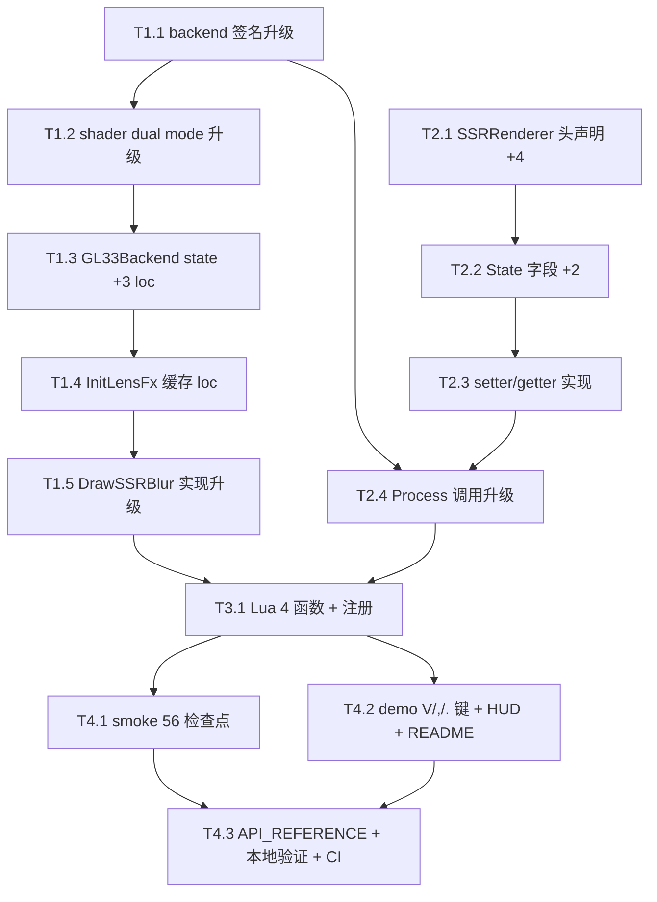

# Phase E.11 Bilateral SSR Blur — TASK 原子任务拆分

> **阶段**：6A Workflow — 阶段 3 Atomize
> **输入**：DESIGN_PhaseE_11.md
> **总任务数**：12 个原子任务

---

## 任务依赖图（Mermaid）



---

## T1 — Backend 层（5 任务）

### T1.1 backend `DrawSSRBlur` 签名升级

**文件**：`ChocoLight/include/render_backend.h`

**输入契约**：
- 已有 Phase E.10 `DrawSSRBlur(srcTex, dstFbo, dstW, dstH, axis, radius)` 6 参数
- 无外部实现者（仅 GL33Backend + Legacy）

**输出契约**：
- 升级为 9 参数：`DrawSSRBlur(srcTex, depthTex, dstFbo, dstW, dstH, axis, radius, bilateralEnabled, depthSigma)`
- 注释升级说明 Phase E.11 双模式 + sigma 范围
- Legacy `= 0` 默认行为不变（no-op）

**实现约束**：
- Phase E.11 注释段插入说明
- `@param` 文档完整

**验收**：
- `git diff render_backend.h` 仅 1 个 virtual 修改
- 编译 0 error（旧实现需被同步修改 → 由 T1.5 处理）

**依赖**：无（独立头文件改）
**预估**：5 分钟

---

### T1.2 FS_SSR_BLUR shader dual mode 升级（GLES3 + GL33）

**文件**：`ChocoLight/src/render_gl33.cpp`

**输入契约**：
- Phase E.10 shader 在 `@e:\jinyiNew\Light\ChocoLight\src\render_gl33.cpp:1860-1907`（GLES3）+ `:1920-1947`（GL33）
- DESIGN §3.4.1 完整 shader 代码

**输出契约**：
- 两套 shader（GLES3 + GL33）都升级为双 mode：
  - 添加 `uniform sampler2D uDepthTex;`
  - 添加 `uniform int uBilateral;`
  - 添加 `uniform float uDepthSigma;`
  - main 内 if/else 分支：uBilateral==0 走 Gaussian (Phase E.10 路径), 否则走 Bilateral
- 保留 const W0/W1/W2 权重

**实现约束**：
- GLES3 添加 `precision highp float;` + `precision highp sampler2D;`
- 5-tap 公式与 DESIGN §3.4.1 一字不差

**验收**：
- shader compile 通过（CI build 自动验证）
- 单 shader source 含两条路径

**依赖**：T1.1（签名先确定）
**预估**：15 分钟

---

### T1.3 GL33Backend state +3 uniform loc 字段

**文件**：`ChocoLight/src/render_gl33.cpp`

**输入契约**：
- Phase E.10 `locSSRBlur_*` 字段在 `@e:\jinyiNew\Light\ChocoLight\src\render_gl33.cpp:2178-2181`

**输出契约**：
- 追加 3 字段：
  ```cpp
  GLint locSSRBlur_DepthTex   = -1;   // Phase E.11
  GLint locSSRBlur_Bilateral  = -1;   // Phase E.11
  GLint locSSRBlur_DepthSigma = -1;   // Phase E.11
  ```

**依赖**：T1.2
**预估**：2 分钟

---

### T1.4 InitLensFx 内 cache 新 uniform loc

**文件**：`ChocoLight/src/render_gl33.cpp`

**输入契约**：
- Phase E.10 cache 位置在 `InitLensFx` 末尾，参考 `@e:\jinyiNew\Light\ChocoLight\src\render_gl33.cpp:2974-2982`

**输出契约**：
- 在原 Phase E.10 cache 块内追加 3 行 `glGetUniformLocation`
- `glUseProgram(programSSRBlur)` 块内：`if (locSSRBlur_DepthTex >= 0) glUniform1i(locSSRBlur_DepthTex, 1);`

**依赖**：T1.3
**预估**：5 分钟

---

### T1.5 `DrawSSRBlur` 实现升级（GL33Backend）

**文件**：`ChocoLight/src/render_gl33.cpp`

**输入契约**：
- Phase E.10 实现 `@e:\jinyiNew\Light\ChocoLight\src\render_gl33.cpp:4558-4587`
- DESIGN §3.4.4 完整新实现

**输出契约**：
- 签名升级（与 T1.1 一致）
- 内部：
  - 参数 ssrBlurSupported / srcTex / depthTex 校验
  - 5 uniform 写入（含新 3 个）
  - slot 0 = srcTex, slot 1 = depthTex
  - 反向解绑 slot 1 / slot 0
- defensive check：depthTex=0 时静默 return（已新增）

**依赖**：T1.4
**预估**：10 分钟

---

## T2 — SSRRenderer 模块（4 任务）

### T2.1 头文件函数声明

**文件**：`ChocoLight/include/ssr_renderer.h`

**输出契约**：
- 4 个函数声明 + 注释（位置：在 `SetBlurRadius` / `GetBlurRadius` 之后）

```cpp
// Phase E.11 — Bilateral SSR Blur
void  SetBilateralEnabled(bool flag);
bool  GetBilateralEnabled();
void  SetBlurDepthSigma(float v);
float GetBlurDepthSigma();
```

**依赖**：无（独立 .h 改）
**预估**：3 分钟

---

### T2.2 SSRRenderer State 字段 +2

**文件**：`ChocoLight/src/ssr_renderer.cpp`

**输出契约**：
- 在 `struct State { ... }` 末尾（Phase E.10 字段后）追加：
  ```cpp
  bool  bilateralEnabled = true;     // Phase E.11
  float blurDepthSigma   = 200.0f;   // Phase E.11
  ```

**依赖**：T2.1
**预估**：2 分钟

---

### T2.3 setter/getter 实现

**文件**：`ChocoLight/src/ssr_renderer.cpp`

**输出契约**：
- 4 个函数实现（位置：在 `SetBlurRadius` 之后）：
  ```cpp
  void  SetBilateralEnabled(bool f)  { g.bilateralEnabled = f; }
  bool  GetBilateralEnabled()         { return g.bilateralEnabled; }
  void  SetBlurDepthSigma(float v)   { g.blurDepthSigma = clampf(v, 50.0f, 500.0f); }
  float GetBlurDepthSigma()           { return g.blurDepthSigma; }
  ```

**依赖**：T2.2
**预估**：3 分钟

---

### T2.4 Process 内 blur 调用升级

**文件**：`ChocoLight/src/ssr_renderer.cpp`

**输入契约**：
- 现有 Process 中 blur 调用 `@e:\jinyiNew\Light\ChocoLight\src\ssr_renderer.cpp:301-310`

**输出契约**：
- 两次 DrawSSRBlur 调用都升级：追加 `g.depthTex` + `g.bilateralEnabled` + `g.blurDepthSigma`

```cpp
g.backend->DrawSSRBlur(g.reflectTex, g.depthTex,
                        g.blurFbos[0], g.blurW, g.blurH,
                        0, g.blurRadius,
                        g.bilateralEnabled, g.blurDepthSigma);
g.backend->DrawSSRBlur(g.blurTexs[0], g.depthTex,
                        g.blurFbos[1], g.blurW, g.blurH,
                        1, g.blurRadius,
                        g.bilateralEnabled, g.blurDepthSigma);
```

**依赖**：T1.1 + T2.3
**预估**：5 分钟

---

## T3 — Lua API（1 大任务）

### T3.1 Lua 4 函数 + ssr_funcs 注册 + 顶部注释

**文件**：`ChocoLight/src/light_graphics.cpp`

**输入契约**：
- Phase E.10 Lua 函数在 SSR 段（24 函数）
- ssr_funcs[] 注册位置：`@e:\jinyiNew\Light\ChocoLight\src\light_graphics.cpp:2660-2666`

**输出契约**：
- 4 个新 Lua 函数（在 l_SSR_GetBlurRadius 之后）：
  - `l_SSR_SetBilateralEnabled` + `l_SSR_GetBilateralEnabled`
  - `l_SSR_SetBlurDepthSigma` + `l_SSR_GetBlurDepthSigma`
- ssr_funcs[] 注册 4 条
- 顶部注释更新 API 数 24 → 28

**依赖**：T2.4（SSRRenderer setter/getter 已就绪）
**预估**：10 分钟

---

## T4 — 测试 + Demo + CI（3 任务）

### T4.1 smoke ssr.lua 56 检查点

**文件**：`scripts/smoke/ssr.lua`

**输入契约**：
- Phase E.10 smoke 49 检查点

**输出契约**：
- Surface 数组追加 `SetBilateralEnabled`, `GetBilateralEnabled`, `SetBlurDepthSigma`, `GetBlurDepthSigma`
- Section D（defaults）追加 BilateralEnabled=true + BlurDepthSigma=200
- Section E（round-trip）追加 SetBilateralEnabled / SetBlurDepthSigma
- Section F（clamp）追加 SetBlurDepthSigma(0)→50, (1000)→500
- Section G（restore）追加 reset 至默认
- Surface count 26 (24 + 2 from BlurRadius last phase) → 28 (实际函数数)
- Section L（新）：bilateral × σ 联动测试

**新检查点目标**：56 / 56 PASS

**依赖**：T3.1
**预估**：15 分钟

---

### T4.2 demo + README 更新

**文件**：`samples/demo_ssr/main.lua` + `samples/demo_ssr/README.md`

**输出契约**：
- main.lua 新键：
  - `V`：toggle Bilateral on/off
  - `,` / `.`：BlurDepthSigma -/+ 25
- HUD 新增一行：`SSR Blur: ON  Bilateral=ON  radius=2.00  σ=200`
- R 键 reset 包含 BilateralEnabled=true + BlurDepthSigma=200
- 顶部注释操作列表追加 3 行
- README 同步：操作表 + 渲染管线（"Bilateral E.11"）+ 已知限制

**依赖**：T3.1
**预估**：15 分钟

---

### T4.3 文档 + 本地验证 + commit + CI

**文件**：
- `docs/API_REFERENCE.md`（SSR API 24 → 28，+ Phase E.11 描述）
- 本地编译 + smoke 跑通
- commit + push + watch CI

**输出契约**：
- API_REFERENCE 更新 SSR 表格行 + 速查代码块
- local Light.dll 0 error
- local smoke 56/56 PASS
- local demo headless exit 0
- commit `feat(phase-e11): ...`
- CI 6/6 green

**依赖**：T4.1 + T4.2
**预估**：30 分钟

---

## 任务总览

| ID | 名称 | 工作量 | 文件 |
|----|------|--------|------|
| T1.1 | backend 签名升级 | 5 min | render_backend.h |
| T1.2 | shader dual mode | 15 min | render_gl33.cpp |
| T1.3 | state +3 loc | 2 min | render_gl33.cpp |
| T1.4 | InitLensFx cache | 5 min | render_gl33.cpp |
| T1.5 | DrawSSRBlur 实现 | 10 min | render_gl33.cpp |
| T2.1 | 头文件声明 | 3 min | ssr_renderer.h |
| T2.2 | State 字段 | 2 min | ssr_renderer.cpp |
| T2.3 | setter/getter 实现 | 3 min | ssr_renderer.cpp |
| T2.4 | Process 调用升级 | 5 min | ssr_renderer.cpp |
| T3.1 | Lua 4 函数 + 注册 | 10 min | light_graphics.cpp |
| T4.1 | smoke 56 检查点 | 15 min | scripts/smoke/ssr.lua |
| T4.2 | demo + README | 15 min | samples/demo_ssr/ |
| T4.3 | docs + 验证 + CI | 30 min | docs/, CI |

**总预估**：约 120 分钟（2 小时）

---

## 质量门控

任务完成的硬指标：
- ✅ 编译 0 error / 0 warning
- ✅ smoke 56/56 PASS（local + CI）
- ✅ CI 6/6 platform success
- ✅ 7 份 6A 文档完整（ALIGNMENT/CONSENSUS/DESIGN/TASK/ACCEPTANCE/FINAL/TODO）
- ✅ API_REFERENCE + demo README 同步

---

> **下一步**：请用户审阅 ALIGNMENT + CONSENSUS + DESIGN + TASK 4 份文档，签发后启动 T1-T4 实施。
