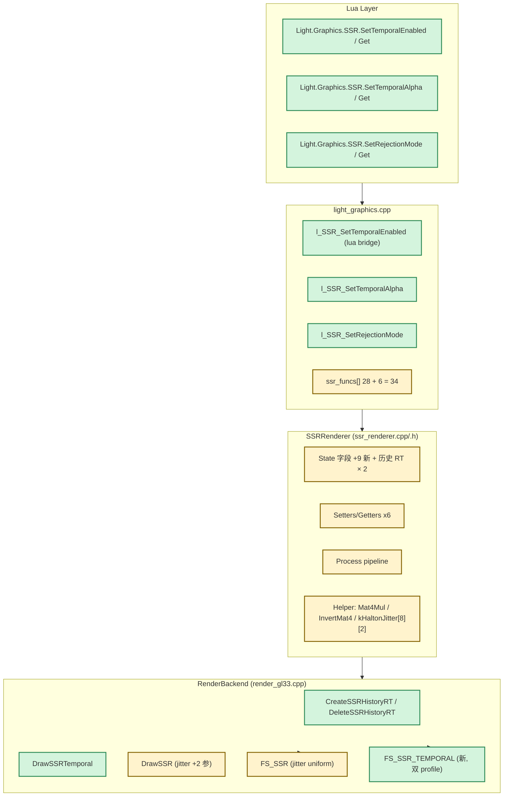
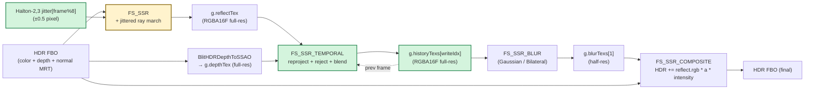
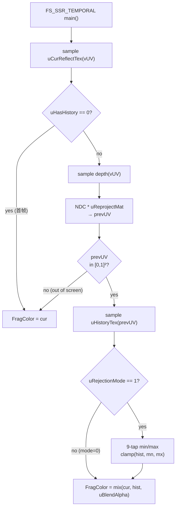
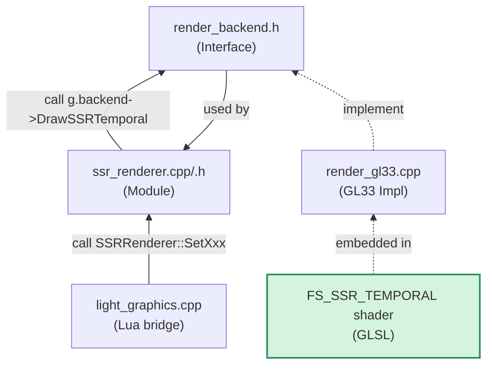
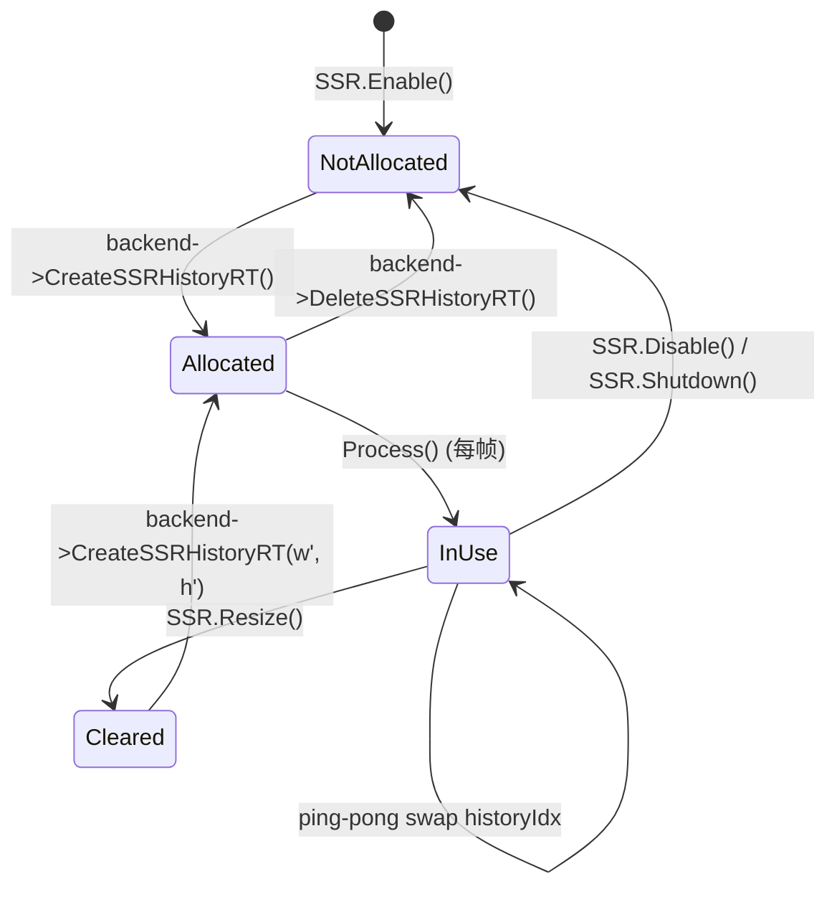

# Phase E.12 Temporal SSR — DESIGN 文档

> **阶段**：6A Workflow — 阶段 2 Architect（设计）
> **目标**：CONSENSUS → 系统架构 → 模块设计 → 接口规范
> **基线**：CONSENSUS_PhaseE_12.md（全 A 锁定）
> **下一步**：阶段 3 Atomize（TASK 原子化）

---

## 1. 整体架构图



**图例**：
- 🟢 绿色 = **新增**
- 🟡 黄色 = **修改**

---

## 2. 数据流向图

### 2.1 每帧 SSR 完整管线（Phase E.12 状态）



### 2.2 Temporal pass 内部流程



---

## 3. 分层设计

### 3.1 五层架构（自顶向下）

| 层 | 文件 | 职责 | 变更类型 |
|---|---|---|---|
| **L1 Lua API** | `light_graphics.cpp` | 6 个 Lua bridge 函数 + ssr_funcs[] 注册 | 新增 6 函数 |
| **L2 Module** | `ssr_renderer.cpp/.h` | State 字段扩展 + setter/getter + Process 流水线 | 扩展 |
| **L3 Backend Interface** | `render_backend.h` | 3 个虚函数新增 + 1 个签名扩展 | 扩展 |
| **L4 Backend Impl** | `render_gl33.cpp` | GL33 实现 + 2 个新 shader | 扩展 |
| **L5 Shader Source** | `render_gl33.cpp` 内嵌字符串 | FS_SSR jitter + FS_SSR_TEMPORAL | 修改 + 新增 |

### 3.2 模块依赖关系图



**循环依赖检查**：✅ 无（单向依赖链）

---

## 4. 核心组件

### 4.1 Halton-2,3 8-sample 序列（CPU 静态表）

**位置**：`ssr_renderer.cpp` 文件级 const

```cpp
namespace {
    // Phase E.12 — Halton(base=2,3) 8-sample, 行业标准 TAA jitter
    constexpr float kHaltonJitter[8][2] = {
        { 0.0000f,  0.0000f},
        {-0.5000f,  0.3333f},
        { 0.2500f, -0.3333f},
        {-0.2500f,  0.1111f},
        { 0.3750f, -0.1111f},
        {-0.3750f,  0.4444f},
        { 0.1250f, -0.4444f},
        {-0.1250f,  0.2222f},
    };
}
```

**调用**：`int idx = g.frameCounter & 7;  float jx = kHaltonJitter[idx][0]; ...`

### 4.2 Mat4Mul helper（如不存在则新增）

```cpp
// 行优先 16-float Mat4 乘法: out = a * b
// 与 InvertMat4 同位于 ssr_renderer.cpp 文件级 anonymous namespace
static void Mat4Mul(const float* a, const float* b, float* out) {
    for (int row = 0; row < 4; ++row) {
        for (int col = 0; col < 4; ++col) {
            float s = 0;
            for (int k = 0; k < 4; ++k) s += a[row * 4 + k] * b[k * 4 + col];
            out[row * 4 + col] = s;
        }
    }
}
```

**调用方**：
- `curViewProj = curProj * curView`
- `reprojMat = prevViewProj * invCurViewProj`

### 4.3 History RT 生命周期



**关键不变量**：
- Allocated 状态：`historyFbos[0]/[1] != 0` && `historyTexs[0]/[1] != 0`
- InUse 状态：每帧 `writeIdx = historyIdx`, `readIdx = 1 - writeIdx`, 帧末 `historyIdx = readIdx`
- Cleared 状态：`hasPrevViewProj = false`（强制下一帧首帧路径）

### 4.4 首帧 fallback 策略

| 条件 | 行为 |
|---|---|
| `temporalEnabled = false` | 跳过 Temporal pass，直接 reflectTex → blur |
| `temporalEnabled = true && historyFbos[0] == 0` | 分配失败，回退到 Phase E.11 行为（warn 一次）|
| `temporalEnabled = true && hasPrevViewProj = false` | shader 走 OUT_CUR 路径，写入 history，下帧起累积 |
| `prevUV out of [0,1]²` | 该像素走 OUT_CUR（边缘 reject） |
| `Resize` 后 | 释放 history + reset hasPrevViewProj，重头累积 |

---

## 5. 接口契约定义

### 5.1 Backend 接口（render_backend.h）

#### 5.1.1 新增：CreateSSRHistoryRT

```cpp
/// Phase E.12 — 创建 SSR temporal history ping-pong RT (full-res RGBA16F × 2)
/// @param w, h         full-res 尺寸（与 reflectFbo 一致）
/// @param outFbos[2]   输出 FBO 数组（仅 color attachment, 无 depth）
/// @param outTexs[2]   输出 tex 数组（GL_LINEAR + GL_CLAMP_TO_EDGE）
/// @return true=成功, 失败时所有 out* 清零
/// @note 与 CreateSSRTargets 平行设计；history 永远 full-res（与 reflectTex 一致），
///       不复用 blur 的 half-res RT
virtual bool CreateSSRHistoryRT(int /*w*/, int /*h*/,
                                 uint32_t* /*outFbos2*/,
                                 uint32_t* /*outTexs2*/) { return false; }
virtual void DeleteSSRHistoryRT(uint32_t* /*fbos2*/, uint32_t* /*texs2*/) {}
```

#### 5.1.2 新增：DrawSSRTemporal

```cpp
/// Phase E.12 — Temporal pass: reproject + reject + blend
///
/// 输入: 当前帧 SSR raw + 历史帧 SSR temporal + depth
/// 输出: dstFbo（即下一帧的 history 写入目标）
///
/// 计算流程（shader 内）:
///   1. cur = sample(curReflectTex, vUV)
///   2. hasHistory == 0 → out = cur (首帧)
///   3. reproject vUV → prevUV via reprojectMat
///   4. prevUV 越界 → out = cur (边缘 reject)
///   5. hist = sample(historyTex, prevUV)
///   6. rejectionMode == 1 → 9-tap neighborhood clip on hist
///   7. out = mix(cur, hist, blendAlpha)
///
/// @param curReflectTex     当前帧 SSR raw (slot 0)
/// @param historyTex        上一帧 SSR temporal 输出 (slot 1)
/// @param depthTex          SSR depth tex (slot 2)
/// @param dstFbo            目标 FBO (即下一帧的 history read 源)
/// @param w, h              full-res
/// @param reprojectMat4     prevViewProj * invCurViewProj (column-major 16 floats)
/// @param invProjMat4       invProj (用于重建 view pos, 暂未在 shader 用到但预留)
/// @param blendAlpha        history 权重 [0.5, 0.99]
/// @param rejectionMode     0 = current-depth threshold, 1 = neighborhood clip
/// @param hasHistory        0 = 首帧禁用 temporal, 1 = 正常累积
virtual void DrawSSRTemporal(uint32_t /*curReflectTex*/,
                              uint32_t /*historyTex*/,
                              uint32_t /*depthTex*/,
                              uint32_t /*dstFbo*/,
                              int /*w*/, int /*h*/,
                              const float* /*reprojectMat4*/,
                              const float* /*invProjMat4*/,
                              float /*blendAlpha*/,
                              int   /*rejectionMode*/,
                              int   /*hasHistory*/) {}
```

#### 5.1.3 修改：DrawSSR（+2 参）

```cpp
/// Phase E.9 + E.12: SSR raw pass + jitter offset
/// jitterX/jitterY ∈ ±0.5（pixel 单位），shader 内乘 1/screenSize → UV 偏移
/// 旧调用者（demo / 第三方）可传 0,0 保持 Phase E.11 行为
virtual void DrawSSR(uint32_t /*depthTex*/, uint32_t /*normalTex*/, uint32_t /*hdrTex*/,
                     uint32_t /*dstFbo*/, int /*w*/, int /*h*/,
                     const float* /*projMat4*/, const float* /*invProjMat4*/,
                     int /*maxSteps*/, float /*stepSize*/, float /*thickness*/,
                     float /*maxDist*/, float /*edgeFade*/,
                     float /*jitterX*/, float /*jitterY*/) {}
```

### 5.2 SSRRenderer 接口（ssr_renderer.h）

```cpp
// Phase E.12 — Temporal SSR (3 setter/getter 对)

/// 切换 temporal 时序累积, 默认 true (业界 TAA-style)
/// 关闭后行为完全等同 Phase E.11
void SetTemporalEnabled(bool flag);
bool GetTemporalEnabled();

/// History blend 权重 clamp [0.5, 0.99], 默认 0.9
/// 越高 → 历史权重大, 去噪强但响应慢
/// 越低 → 响应快, 但去噪弱
void  SetTemporalAlpha(float v);
float GetTemporalAlpha();

/// Rejection mode: 0 = current-depth threshold, 1 = neighborhood clip (默认)
void SetRejectionMode(int mode);
int  GetRejectionMode();
```

### 5.3 Lua API 契约（light_graphics.cpp）

```lua
-- Phase E.12 — Temporal SSR
Light.Graphics.SSR.SetTemporalEnabled(true)           -- 切换 on/off
local b = Light.Graphics.SSR.GetTemporalEnabled()     -- → bool

Light.Graphics.SSR.SetTemporalAlpha(0.9)              -- clamp [0.5, 0.99]
local a = Light.Graphics.SSR.GetTemporalAlpha()       -- → number

Light.Graphics.SSR.SetRejectionMode(1)                -- clamp {0, 1}
local m = Light.Graphics.SSR.GetRejectionMode()       -- → int
```

---

## 6. 异常处理策略

### 6.1 SSRRenderer 层

| 异常情况 | 处理 |
|---|---|
| `backend == nullptr` | Init 阶段拒绝，warn |
| `backend->SupportsSSR() == false` | Enable 返 false，所有 setter 仍可调用但无效（不分配 RT） |
| `CreateSSRHistoryRT` 失败 | warn once + 降级（temporal 跳过，仅 raw → blur → composite） |
| `Process` 中 `historyFbos[0] == 0` | 跳过 temporal pass，srcForBlur = reflectTex |
| `Process` 首帧 | hasPrevViewProj=false → shader 内强制 cur |
| `Resize` 失败 | 释放 history + 降级，下次 Resize 重试 |
| `Shutdown` | DeleteSSRHistoryRT 必调，State 字段清零 |
| GetView / GetProjection 退化矩阵 | InvertMat4 失败 → silent skip 整个 Process |

### 6.2 Backend GL33 层

| 异常情况 | 处理 |
|---|---|
| `programSSRTemporal == 0`（shader 编译失败） | InitLensFx 阶段 warn，DrawSSRTemporal silent no-op |
| 输入 tex / FBO 任一为 0 | early return |
| `w * h <= 0` | early return |
| FBO 状态 != GL_FRAMEBUFFER_COMPLETE | DeleteSSRHistoryRT 清理并返 false |
| 调用顺序错（Temporal 先于 raw） | shader 输入 historyTex 可能未定义，已通过 hasHistory=0 fallback 覆盖 |

### 6.3 Shader 层（防御性）

```glsl
// 防 div-by-zero
prevClip.xyz /= max(prevClip.w, 1e-6);

// neighborhood clip 防 0 范围
vec3 range = max(mx - mn, vec3(1e-4));

// blendAlpha 防越界（虽然 CPU 已 clamp）
float alpha = clamp(uBlendAlpha, 0.0, 1.0);
```

---

## 7. 测试策略

### 7.1 Backend 层（自动化）

- **CI 6 平台 build**：shader 编译失败立即暴露
- **headless smoke**：所有 setter / getter / clamp / round-trip 检查

### 7.2 模块层（smoke）

新 section M：Phase E.12 Temporal

| 检查类型 | 数量 |
|---|---|
| API 函数存在性 | 6 |
| 默认值 | 3 |
| round-trip | 3 |
| clamp 边界 | 6 |
| 与 BlurEnabled/BilateralEnabled 联动 | 3-5 |
| **小计** | **21-23** |

预计 smoke 总数 60 → **81-83**

### 7.3 视觉验收（人工）

- demo_ssr T 键 ON/OFF 对比静态画面是否更干净
- 动态镜头转动 ghost 程度（已知限制）
- 与 Bilateral 组合的最终质量

---

## 8. 设计可行性验证

| 维度 | 验证结论 |
|---|---|
| **shader 复杂度** | FS_SSR_TEMPORAL ~30 行，9-tap clip 与 SSAO bilateral 同量级 ✅ |
| **CPU 开销** | Mat4Mul + InvertMat4 各 1 次 / 帧, ~5 μs，可忽略 ✅ |
| **GPU 开销** | full-screen pass + 9-tap，~0.2-0.4 ms @ 1080p ✅ |
| **内存** | full-res RGBA16F × 2 = ~16 MB @ 1080p（在预算内） ✅ |
| **GLES3 兼容** | 仅用 texture / vec / mat4 ops，无 compute ✅ |
| **resize 安全** | 释放 + 重建 + reset hasPrevViewProj 三步完整 ✅ |
| **首帧处理** | hasHistory=0 → cur, 无 1-frame 黑屏 ✅ |
| **向后兼容** | temporalEnabled=false 时画面 = Phase E.11 main HEAD ✅ |

---

## 9. 风险评估

| 风险 | 概率 | 影响 | 缓解措施 |
|---|---|---|---|
| reprojection 矩阵精度问题 | 低 | 中 | column-major 与 `Mat4::operator*` 一致约定 + 矩阵打印验证（debug log） |
| neighborhood clip 9-tap 在 GLES3 移动 GPU 慢 | 中 | 中 | TODO 中标注，留 mode=0 备选；未来可优化为 5-tap |
| history RT VRAM 占用 16 MB | 低 | 低 | 用户拍板已知，TODO 留 half-res 选项 |
| 与 Bilateral blur 联动权重失配 | 低 | 低 | temporal 在 blur 前，blur 在稳定信号上工作 |
| 调用方未初始化 jitter（旧 demo） | 低 | 低 | jitterX=jitterY=0 即旧行为；编译期默认值方案另选 |
| Lua API 表面增长（24→34，半年 +10） | 低 | 低 | 文档分组归类（按 Phase 标记） |

---

## 10. 设计签字

| 检查项 | 状态 |
|---|---|
| 架构图清晰准确 | ✅ |
| 接口定义完整 | ✅ |
| 与现有系统无冲突 | ✅ |
| 设计可行性验证 | ✅ |
| 异常处理覆盖 | ✅ |
| 测试策略明确 | ✅ |
| 风险评估完整 | ✅ |

**下一步**：阶段 3 Atomize → `TASK_PhaseE_12.md`（T1-T5 原子任务拆分 + 依赖图）。
