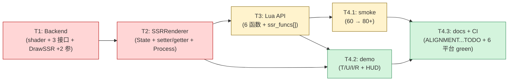

# Phase E.12 Temporal SSR — TASK 文档

> **阶段**：6A Workflow — 阶段 3 Atomize（原子化）
> **目标**：DESIGN → 拆分任务 → 明确接口 → 依赖关系
> **基线**：DESIGN_PhaseE_12.md
> **下一步**：阶段 4 Approve

---

## 1. 任务依赖图



**关键路径**：T1 → T2 → T3 → T4.1 → T4.3（约 5 节点串行）。
**并行机会**：T4.2 可与 T4.1 并行；T4.3 文档可与 T4.1 同步起草。

---

## 2. 任务详述

### T1 — Backend（render_backend.h + render_gl33.cpp）

**优先级**：🔴 高（关键路径起点）
**预估工时**：4-6 h

#### T1.1 接口扩展（render_backend.h）

**输入契约**：
- CONSENSUS §5.1 + DESIGN §5.1 接口签名定义

**变更**：
| 项 | 行为 |
|---|---|
| 新增 `CreateSSRHistoryRT` 虚函数 | 默认返 false |
| 新增 `DeleteSSRHistoryRT` 虚函数 | 默认 no-op |
| 新增 `DrawSSRTemporal` 虚函数 | 默认 no-op |
| 修改 `DrawSSR` 签名 | +2 参 jitterX, jitterY |

**接口规范**：与 DESIGN §5.1 完全对齐。

**输出契约**：
- `render_backend.h` 编译通过
- 旧代码（如 ssr_renderer.cpp 现状）保持调用旧 `DrawSSR` 不通过 → 需 T2 同步更新

#### T1.2 GL33 shader 升级（render_gl33.cpp）

**变更点**：

1. **修改 `FS_SSR_SOURCE` 字符串（GLES3 + GL33 双 profile）**

加入 jitter uniform：
```glsl
uniform vec2 uJitterOffset;  // UV 空间偏移, backend 由 ±0.5 pixel / RT size 转换
```

ray march 起点 UV 加 offset：
```glsl
// 原: vec2 uv = vUV;
vec2 uv = vUV + uJitterOffset;
```

2. **新增 `FS_SSR_TEMPORAL_SOURCE_GLES3` 和 `FS_SSR_TEMPORAL_SOURCE_GL33` 字符串**

完整 shader 见 CONSENSUS §3.2 主流程。

#### T1.3 GL33Backend 类成员追加

```cpp
// 在 SSR 字段附近（既有 programSSR / programSSRComposite / programSSRBlur 之后）
GLuint programSSRTemporal       = 0;
GLint  locSSRTemporal_CurRefl   = -1;
GLint  locSSRTemporal_History   = -1;
GLint  locSSRTemporal_DepthTex  = -1;
GLint  locSSRTemporal_ReprojMat = -1;
GLint  locSSRTemporal_InvProj   = -1;
GLint  locSSRTemporal_Texel     = -1;
GLint  locSSRTemporal_Alpha     = -1;
GLint  locSSRTemporal_RejMode   = -1;
GLint  locSSRTemporal_HasHist   = -1;

// 还需在 FS_SSR uniform 缓存中加：
GLint  locSSR_JitterOffset      = -1;
```

#### T1.4 InitLensFx 中编译 FS_SSR_TEMPORAL + 缓存 loc

```cpp
programSSRTemporal = buildProgram(FS_SSR_TEMPORAL_SOURCE, "SSRTemporal");
if (programSSRTemporal) {
    locSSRTemporal_CurRefl   = glGetUniformLocation(programSSRTemporal, "uCurReflectTex");
    locSSRTemporal_History   = glGetUniformLocation(programSSRTemporal, "uHistoryTex");
    // ... 其他 loc
    glUseProgram(programSSRTemporal);
    if (locSSRTemporal_CurRefl  >= 0) glUniform1i(locSSRTemporal_CurRefl,  0);
    if (locSSRTemporal_History  >= 0) glUniform1i(locSSRTemporal_History,  1);
    if (locSSRTemporal_DepthTex >= 0) glUniform1i(locSSRTemporal_DepthTex, 2);
    glUseProgram(0);
}
// 同步缓存 FS_SSR.uJitterOffset:
locSSR_JitterOffset = glGetUniformLocation(programSSR, "uJitterOffset");
```

#### T1.5 实现 3 个新虚函数 + 1 个签名修改

- `CreateSSRHistoryRT` ：参考 `CreateSSRTargets` 模式，分配 2 个 FBO+Tex（RGBA16F, LINEAR, CLAMP_TO_EDGE）
- `DeleteSSRHistoryRT`：参考 `DeleteSSRTargets`
- `DrawSSRTemporal`：参考 `DrawSSAOBlur` + `DrawSSRComposite`，绑定 3 个 tex slot，set uniforms，full-screen 三角形
- `DrawSSR`：在原实现末尾加 `glUniform2f(locSSR_JitterOffset, jitterX / w, jitterY / h)`

#### T1.6 Shutdown 清理

```cpp
if (programSSRTemporal) { glDeleteProgram(programSSRTemporal); programSSRTemporal = 0; }
```

**验收标准**：
- [ ] CI 6 平台 build success
- [ ] FS_SSR_TEMPORAL shader 编译日志无 error
- [ ] 旧 DrawSSR 调用方编译失败立刻暴露（提示 T2 跟进）

---

### T2 — SSRRenderer Module（ssr_renderer.cpp + ssr_renderer.h）

**优先级**：🔴 高
**预估工时**：3-5 h
**依赖**：T1 完成

#### T2.1 头文件扩展（ssr_renderer.h）

```cpp
// Phase E.12 — Temporal SSR (在 BilateralEnabled / BlurDepthSigma 之后)
void SetTemporalEnabled(bool flag);
bool GetTemporalEnabled();
void  SetTemporalAlpha(float v);
float GetTemporalAlpha();
void SetRejectionMode(int mode);
int  GetRejectionMode();
```

#### T2.2 State 字段追加（ssr_renderer.cpp）

```cpp
// Phase E.12 — Temporal SSR
bool      temporalEnabled  = true;
float     temporalAlpha    = 0.9f;
int       rejectionMode    = 1;
uint32_t  historyFbos[2]   = {0, 0};
uint32_t  historyTexs[2]   = {0, 0};
int       historyIdx       = 0;
float     prevViewProj[16] = {0};
bool      hasPrevViewProj  = false;
uint64_t  frameCounter     = 0;
```

#### T2.3 Helper 实现（文件级 anonymous namespace）

- 检查 `InvertMat4` 已存在
- 新增 `Mat4Mul`（DESIGN §4.2）
- 新增 `kHaltonJitter[8][2]`（DESIGN §4.1）

#### T2.4 Setters/Getters 实现（6 函数）

clamp 规则：
- `temporalAlpha` clamp `[0.5, 0.99]`
- `rejectionMode` clamp `{0, 1}`（`mode = (mode == 0) ? 0 : 1`）

#### T2.5 Enable() 扩展 — 分配 history RT

```cpp
bool Enable(int w, int h) {
    // ... 现有 SSR raw RT 分配 ...

    // Phase E.12 — 分配 history (full-res RGBA16F × 2)
    if (g.temporalEnabled && g.backend->SupportsSSR()) {
        if (!g.backend->CreateSSRHistoryRT(w, h, g.historyFbos, g.historyTexs)) {
            CC::Log(CC::LOG_WARN, "SSRRenderer::Enable: history RT 分配失败, temporal 降级");
            g.historyFbos[0] = g.historyFbos[1] = 0;
            g.historyTexs[0] = g.historyTexs[1] = 0;
        }
    }
    g.historyIdx = 0;
    g.hasPrevViewProj = false;
    g.frameCounter = 0;
    // ...
}
```

#### T2.6 Disable() / Resize() / Shutdown() 同步

释放 history RT + reset 状态。

#### T2.7 Process() 流水线插入

按 DESIGN §2.1 数据流图 + CONSENSUS §5.3 代码草图实施。关键步骤：

1. 取 view + projection → 计算 curViewProj + invCurProj
2. 计算 jitter（仅 temporalEnabled 时）
3. 调 `DrawSSR(..., jitterX, jitterY)`
4. 如果 temporal 启用且 history 已分配：
   - 计算 reprojMat = prevViewProj * invCurViewProj
   - 调 `DrawSSRTemporal(...)`
   - swap historyIdx, 缓存 prevViewProj, 设 hasPrevViewProj=true
   - srcForBlur 指向 historyTexs[writeIdx]
5. 否则 srcForBlur = reflectTex
6. blur（Phase E.10/E.11，用 srcForBlur 作输入）
7. composite
8. `g.frameCounter++`

**关键**：blur pass 的 `srcTex` 参数必须改为 `srcForBlur`，不再硬编码 `g.reflectTex`。

**验收标准**：
- [ ] CI 6 平台 build success
- [ ] temporalEnabled=false 时画面 = Phase E.11 main HEAD（向后兼容）
- [ ] resize 后无 crash
- [ ] disable→enable 无 crash

---

### T3 — Lua API（light_graphics.cpp）

**优先级**：🟡 中
**预估工时**：1-2 h
**依赖**：T2 完成

#### T3.1 实现 6 个 Lua bridge 函数

参考 Phase E.11 的 `l_SSR_SetBilateralEnabled` / `l_SSR_GetBilateralEnabled` 等同款模式。

#### T3.2 ssr_funcs[] 注册

在 `Set/GetBlurDepthSigma` 之后追加：
```cpp
{"SetTemporalEnabled", l_SSR_SetTemporalEnabled},
{"GetTemporalEnabled", l_SSR_GetTemporalEnabled},
{"SetTemporalAlpha",   l_SSR_SetTemporalAlpha},
{"GetTemporalAlpha",   l_SSR_GetTemporalAlpha},
{"SetRejectionMode",   l_SSR_SetRejectionMode},
{"GetRejectionMode",   l_SSR_GetRejectionMode},
```

#### T3.3 文件顶部 API 数注释更新

```
SSR API 数: 28 → 34（Phase E.12 Temporal +6）
```

**验收标准**：
- [ ] CI 6 平台 build success
- [ ] Lua 端能调用所有 6 函数，类型正确

---

### T4.1 — smoke 扩展（scripts/smoke/ssr.lua）

**优先级**：🟡 中
**预估工时**：1-2 h
**依赖**：T3 完成

#### 新增 section M（Phase E.12 Temporal）

**默认值检查**（3）：
```lua
ASSERT_EQ(Light.Graphics.SSR.GetTemporalEnabled(), true,  "M1 default temporalEnabled")
ASSERT_FLOAT_EQ(Light.Graphics.SSR.GetTemporalAlpha(), 0.9, 1e-4, "M2 default temporalAlpha")
ASSERT_EQ(Light.Graphics.SSR.GetRejectionMode(), 1, "M3 default rejectionMode")
```

**round-trip**（3）：set 不同值 → get 一致

**clamp 边界**（6）：
- alpha < 0.5 → clamp 0.5
- alpha > 0.99 → clamp 0.99
- mode = -1 → clamp 0 或 1
- mode = 2 → clamp 1
- 验证 set 内部已 clamp

**API 函数存在性**（6）：`type() == 'function'`

**联动**（3）：
- temporalEnabled + blurEnabled + bilateralEnabled 任意组合 SSR.Enable 不 crash
- Disable → Enable round-trip
- Resize 1080p → 720p → 1080p

**预计 60 + 21 = 81 检查点**。

**验收标准**：
- [ ] Windows runtime smoke `[Phase E.12] 通过 N / 失败 0`

---

### T4.2 — Demo（samples/demo_ssr/main.lua + README.md）

**优先级**：🟢 低
**预估工时**：1 h
**依赖**：T3 完成

#### 新键位（main.lua）

| 键 | 操作 |
|---|---|
| `T` | toggle TemporalEnabled |
| `U` | TemporalAlpha −= 0.02 |
| `I` | TemporalAlpha += 0.02 |
| `R` | toggle RejectionMode (0 ⇌ 1) |
| `H` (扩展) | reset 包括新参数 |

#### HUD 行扩展

```
Temporal: ON | alpha 0.90 | reject 1
```

#### README.md 同步

- 操作表新增 T/U/I/R 键
- 默认参数表新增 TemporalEnabled=true, TemporalAlpha=0.9, RejectionMode=1
- 已知限制补充："动态物体反射 ghost（reverse-reproj 限制）"

**验收标准**：
- [ ] demo 启动无错
- [ ] 键位响应正常

---

### T4.3 — 文档 + CI（docs/Phase E.12 + docs/API_REFERENCE.md）

**优先级**：🟢 低
**预估工时**：2-3 h（含 ACCEPTANCE/FINAL/TODO 编写）
**依赖**：T4.1 + T4.2 完成

#### 文档清单

| 文件 | 状态 |
|---|---|
| `ALIGNMENT_PhaseE_12.md` | ✅ 已就绪 |
| `CONSENSUS_PhaseE_12.md` | ✅ 已就绪 |
| `DESIGN_PhaseE_12.md` | ✅ 已就绪 |
| `TASK_PhaseE_12.md` | ✅ 本文件 |
| `ACCEPTANCE_PhaseE_12.md` | 阶段 6 编写 |
| `FINAL_PhaseE_12.md` | 阶段 6 编写 |
| `TODO_PhaseE_12.md` | 阶段 6 编写 |

#### API_REFERENCE.md 更新

- SSR 函数数 28 → 34
- 新增 6 函数速查代码块
- 文档链接更新

#### CI 验证

- commit → push → 监控 6 平台 build + Windows runtime smoke
- 期望 `commit XXX run YYY 6/6 success` + `[Phase E.12] 通过 N / 失败 0`

**验收标准**：
- [ ] 7 件文档全到位
- [ ] CI 全绿
- [ ] commit message 清洁（按 conventional commit）

---

## 3. 预估工时

| 任务 | 预估 |
|---|---|
| T1 Backend | 4-6 h |
| T2 SSRRenderer | 3-5 h |
| T3 Lua API | 1-2 h |
| T4.1 smoke | 1-2 h |
| T4.2 demo | 1 h |
| T4.3 docs + CI | 2-3 h |
| **合计** | **12-19 h（1.5-2.5 工作日）** |

**与原始预估对照**（用户 "3-5 天工时"）：在乐观区间内 ✅

---

## 4. 质量门控

每个任务完成立即验证：

| 验证项 | 通过条件 |
|---|---|
| T1 编译 | render_backend.h + render_gl33.cpp 0 error |
| T2 编译 | ssr_renderer.cpp + ssr_renderer.h 0 error |
| T3 编译 | light_graphics.cpp 0 error |
| T4.1 smoke | Windows runtime PASS |
| T4.2 demo | 启动无错 + 键位响应 |
| T4.3 CI | 6/6 green |

任一不过 → 立即修复，不进入下一任务。

---

## 5. 风险评估（任务级）

| 任务 | 风险 | 缓解 |
|---|---|---|
| T1 shader | GLES3 移动 GPU 编译失败 | 严格双 profile + CI 验证 |
| T1 接口扩展 | DrawSSR 旧调用方编译失败 | 立即在 T2 中同步 |
| T2 矩阵推导 | reprojection 数值错误 | debug log 矩阵打印验证（首次） |
| T2 history ping-pong | swap 逻辑错导致读写同一 RT | 明确 writeIdx=historyIdx, readIdx=1-historyIdx 不变量 |
| T3 Lua bridge | clamp 写错 | smoke clamp 测试覆盖 |
| T4.1 smoke 数 | 与文档对应不齐 | 末尾打印 "通过 N / 失败 0"  |
| T4.3 CI | 某平台特有失败 | 监控 + 单独 retrigger |

---

## 6. 任务总览

```
Phase E.12 Temporal SSR
├── T1 Backend [4-6h]
│   ├── T1.1 render_backend.h 接口扩展
│   ├── T1.2 FS_SSR + FS_SSR_TEMPORAL shader
│   ├── T1.3 GL33Backend 成员追加
│   ├── T1.4 InitLensFx 编译 + uniform loc
│   ├── T1.5 实现 3 新虚函数 + DrawSSR +2 参
│   └── T1.6 Shutdown 清理
├── T2 SSRRenderer [3-5h]
│   ├── T2.1 头文件 6 函数声明
│   ├── T2.2 State 字段扩展（9 字段 + 1 数组）
│   ├── T2.3 helper（Mat4Mul + Halton 表）
│   ├── T2.4 setter/getter 实现
│   ├── T2.5 Enable() 分配 history RT
│   ├── T2.6 Disable/Resize/Shutdown 释放
│   └── T2.7 Process() 流水线插入
├── T3 Lua API [1-2h]
│   ├── T3.1 实现 6 bridge 函数
│   ├── T3.2 ssr_funcs[] 注册
│   └── T3.3 顶部注释更新
├── T4.1 smoke [1-2h]
│   └── section M 新增 21 检查点
├── T4.2 demo [1h]
│   ├── main.lua T/U/I/R 键位
│   ├── HUD 扩展
│   └── README.md 同步
└── T4.3 docs + CI [2-3h]
    ├── ACCEPTANCE/FINAL/TODO 编写
    ├── API_REFERENCE.md 更新
    └── commit + push + 监控 CI
```

---

## 7. 用户操作指引

| 阶段 | 用户需做 |
|---|---|
| Approve | 审查本 TASK 是否对齐预期 |
| Automate 期间 | 无需介入，按节奏继续 |
| 真机视觉验收（T4.3 后 TODO） | 真机跑 demo_ssr，观察 T 键 ON/OFF 视觉差异 |
| Phase E.13 / E.14 规划 | TODO 文档提供候选清单 |

---

## 8. 文档导航

- ALIGNMENT：`docs/Phase E.12 Temporal SSR/ALIGNMENT_PhaseE_12.md`
- CONSENSUS：`docs/Phase E.12 Temporal SSR/CONSENSUS_PhaseE_12.md`
- DESIGN：`docs/Phase E.12 Temporal SSR/DESIGN_PhaseE_12.md`
- TASK（本文件）
- ACCEPTANCE / FINAL / TODO：阶段 6 阶段编写
- API_REFERENCE：`docs/API_REFERENCE.md`

---

**下一步**：阶段 4 Approve — 用户审查 TASK → 进入实施。
