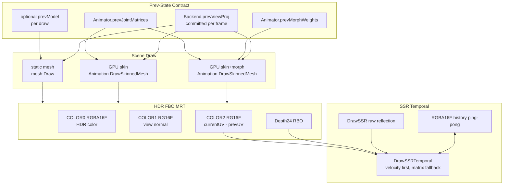
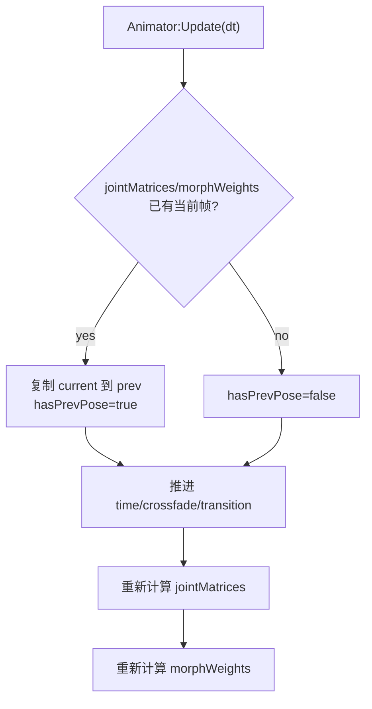

# Phase E.13 Motion Vector Velocity — DESIGN 文档

> **阶段**：6A Workflow — 阶段 2 Architect（设计）
> **目标**：ALIGNMENT → 系统架构 → 模块设计 → 接口规范
> **基线**：ALIGNMENT_PhaseE_13.md
> **状态**：规划草案，尚未实现

---

## 1. 设计总览

E.13 的核心是新增一张 velocity buffer。它像给屏幕上每个像素保存一个“小箭头”：这个像素当前在 `uv`，上一帧应该去 `uv - velocity` 找历史颜色。

当前 E.12 Temporal SSR 使用矩阵 + depth 重建上一帧位置。这对纯相机运动有效，但动态物体会猜错。E.13 把动态物体自身的移动、骨骼动画、morph 变形也写进 velocity，从而让 history 采样更贴近真实上一帧。

---

## 2. 整体架构图



---

## 3. HDR FBO 资源布局

### 3.1 Attachment 设计

| Attachment | 格式 | filter | wrap | 说明 |
|---|---|---|---|---|
| COLOR_ATTACHMENT0 | `RGBA16F` | LINEAR | CLAMP_TO_EDGE | HDR scene color |
| COLOR_ATTACHMENT1 | `RG16F` | NEAREST | CLAMP_TO_EDGE | view-space normal encoded |
| COLOR_ATTACHMENT2 | `RG16F` | NEAREST | CLAMP_TO_EDGE | screen-space velocity |
| DEPTH_ATTACHMENT | `DEPTH_COMPONENT24` RBO | - | - | depth blit source |

`RG16F` velocity 在 1920×1080 下约 8MB。相比 `RGBA16F` 少一半带宽，足够保存屏幕空间 UV delta。

### 3.2 velocity 编码

| 字段 | 含义 |
|---|---|
| R | `currentUV.x - previousUV.x` |
| G | `currentUV.y - previousUV.y` |

约定：

- `previousUV = currentUV - velocity`。
- 无有效上一帧时写 `(0, 0)`，同时 SSR 通过 `hasHistory=0` 或 validity 逻辑拒绝历史。
- velocity 是 UV 空间，不是像素空间；shader 内不再除以分辨率。

---

## 4. RenderBackend 接口设计

### 4.1 HDR velocity attachment

建议扩展现有 HDR 接口，保持旧调用兼容：

```cpp
virtual uint32_t CreateHDRFBO(int w, int h,
                              uint32_t* outColorTex,
                              uint32_t* outNormalTex = nullptr,
                              uint32_t* outVelocityTex = nullptr) { return 0; }

virtual uint32_t GetHDRVelocityTex(uint32_t fbo) const { return 0; }
```

GL33 新增内部映射：

| map | 用途 |
|---|---|
| `hdrFboDepthRB` | 已存在，管理 depth RBO |
| `hdrFboNormalTex` | 已存在，管理 normal RT |
| `hdrFboVelocityTex` | 新增，管理 velocity RT |

`DeleteHDRFBO` 释放 FBO 时同步释放 velocity texture。

### 4.2 per-frame previous camera state

新增后端帧级 velocity 状态：

```cpp
virtual void BeginVelocityFrame() {}
virtual void CommitVelocityFrame() {}
virtual void ResetVelocityHistory() {}
```

语义：

| 方法 | 调用点 | 行为 |
|---|---|---|
| `BeginVelocityFrame` | `HDRRenderer::BeginScene` | 清理临时 per-draw prev state，不提交当前相机 |
| `CommitVelocityFrame` | `HDRRenderer::EndScene` 在后处理前 | 将本帧 latest `projection * view` 作为下一帧 prevViewProj |
| `ResetVelocityHistory` | HDR enable/resize/disable、SSR history reset | 标记下一帧 prev camera invalid |

### 4.3 ordinary mesh previous model

普通 mesh 当前通过矩阵栈提供 model。为了避免后端按 draw order 猜上一帧，使用显式 per-draw 契约：

```cpp
virtual void SetNextPreviousModelMatrix(const float* prevModelMat4) {}
```

语义：

- 只影响下一次 `DrawMesh` / `DrawMeshMaterial`。
- draw 后自动清空。
- `nullptr` 表示没有 object prev model，shader 使用当前 model 作为 previous model，仅保留 camera motion velocity。

Lua 层建议扩展 `mesh:Draw([textureId|material], [prevModelMat4])`。

### 4.4 GPU skin / morph previous state

扩展 GPU skin draw 接口：

```cpp
virtual void DrawSkinnedMeshMaterial(uint32_t meshId, const MaterialDesc* desc,
                                     const float* jointMatrices, int jointCount,
                                     const float* prevJointMatrices = nullptr,
                                     int prevJointCount = 0) {}

virtual void DrawSkinnedMorphMeshMaterial(uint32_t meshId, const MaterialDesc* desc,
                                          const float* jointMatrices, int jointCount,
                                          const float* morphWeights, int morphTargetCount,
                                          const float* prevJointMatrices = nullptr,
                                          int prevJointCount = 0,
                                          const float* prevMorphWeights = nullptr,
                                          int prevMorphTargetCount = 0) {}
```

约定：

- `prevJointMatrices == nullptr` 或 count 不匹配时，prev=cur，表示仅保留 camera motion。
- `prevMorphWeights == nullptr` 时，prev morph = current morph。
- 这些矩阵在 Animation 模块中已经可按 `modelMat * jointMat` 烘焙后传给 backend。

---

## 5. Shader 设计

### 5.1 static mesh

新增 vertex varyings：

```glsl
out vec4 vCurClip;
out vec4 vPrevClip;
```

新增 uniforms：

```glsl
uniform mat4 uPrevViewProj;
uniform mat4 uPrevModel;
uniform int  uHasVelocityHistory;
```

核心计算：

```glsl
vec4 worldCur  = uModel * vec4(aPos, 1.0);
vec4 worldPrev = uPrevModel * vec4(aPos, 1.0);
gl_Position = uMVP * vec4(aPos, 1.0);
vCurClip  = gl_Position;
vPrevClip = uPrevViewProj * worldPrev;
```

fragment 输出：

```glsl
layout(location = 2) out vec2 FragVelocity;

vec2 ClipToUV(vec4 p) {
    vec2 ndc = p.xy / max(abs(p.w), 1e-6);
    return ndc * 0.5 + 0.5;
}

vec2 curUV  = ClipToUV(vCurClip);
vec2 prevUV = ClipToUV(vPrevClip);
FragVelocity = (uHasVelocityHistory == 1) ? (curUV - prevUV) : vec2(0.0);
```

### 5.2 GPU skin

当前 `uJointMats` 计算 current skinned position。新增 `uPrevJointMats`，用同一顶点权重计算 previous skinned position。

```glsl
mat4 curBlend  = Σ(weight[i] * uJointMats[joint[i]]);
mat4 prevBlend = Σ(weight[i] * uPrevJointMats[joint[i]]);

vec4 curPos  = curBlend  * vec4(aPos, 1.0);
vec4 prevPos = prevBlend * vec4(aPos, 1.0);

gl_Position = uCurViewProj * curPos;
vCurClip    = gl_Position;
vPrevClip   = uPrevViewProj * prevPos;
```

当前 Animation GPU 路径已把 `modelMat * jointMatrix` 前乘进 joint palette，因此 shader 中 `curPos/prevPos` 可视作 world position。

### 5.3 GPU skin + morph

morph 路径需要分别计算 current morphed vertex 和 previous morphed vertex：

```glsl
vec3 curMorphed  = aPos + Σ(uMorphWeights[i]     * delta[i]);
vec3 prevMorphed = aPos + Σ(uPrevMorphWeights[i] * delta[i]);

vec4 curPos  = curBlend  * vec4(curMorphed, 1.0);
vec4 prevPos = prevBlend * vec4(prevMorphed, 1.0);
```

normal 仍按当前帧输出到 normal MRT；velocity 只需要 position。

---

## 6. Animator prev-state 设计

### 6.1 新增状态

`Animator` 新增：

| 字段 | 含义 |
|---|---|
| `prevJointMatrices` | 上一次 `Update` 后的 jointMatrices 快照 |
| `prevMorphWeights` | 上一次 `Update` 后的 morphWeights 快照 |
| `hasPrevPose` | 是否有可用上一帧 pose |

### 6.2 Update 流程



关键点：

- 第一帧没有 prev pose，写 zero/object fallback。
- `SetCurrentTime` 这类时间跳变应清 `hasPrevPose=false`，避免瞬移产生大 velocity。
- crossfade / transition 立即切换时也应清或降级 prev pose。

### 6.3 Animation.DrawSkinnedMesh API

保持旧签名兼容，新增第 5 个可选参数：

```lua
Animation.DrawSkinnedMesh(mesh, animator, transform_mat4_or_nil, material_or_nil, prev_transform_mat4_or_nil)
```

语义：

| 参数情况 | velocity 表现 |
|---|---|
| 有 prev pose + 有 prev transform | 完整 object + animation velocity |
| 有 prev pose + 无 prev transform | 动画 velocity + camera velocity |
| 无 prev pose | camera-only velocity |

---

## 7. SSR Temporal 接入

### 7.1 接口扩展

`DrawSSRTemporal` 建议新增 velocity texture 参数：

```cpp
virtual void DrawSSRTemporal(uint32_t curReflectTex,
                             uint32_t historyTex,
                             uint32_t depthTex,
                             uint32_t velocityTex,
                             uint32_t dstFbo,
                             int w, int h,
                             const float* reprojectMat4,
                             const float* invProjMat4,
                             float blendAlpha,
                             int rejectionMode,
                             int hasHistory) {}
```

### 7.2 shader 采样逻辑

```glsl
vec2 prevUV;
if (uHasVelocityTex == 1) {
    vec2 vel = texture(uVelocityTex, vUV).rg;
    prevUV = vUV - vel;
} else {
    prevUV = ReprojectWithDepth(vUV, depth, uReprojectMat);
}
```

### 7.3 rejection 策略

保留 E.12 rejection mode：

| mode | 行为 |
|---|---|
| 0 | current-depth threshold heuristic |
| 1 | neighborhood AABB clip |

E.13 增加统一 validity 条件：

- `hasHistory == 0` → 输出 current。
- `prevUV` 越界 → 输出 current。
- `abs(velocity)` 超过阈值 → 降低 history 权重或输出 current。
- `velocityTex == 0` → 回退 E.12 矩阵重投影。

---

## 8. 生命周期与回退

| 场景 | 行为 |
|---|---|
| HDR Enable | 创建 velocity RT，调用 `ResetVelocityHistory` |
| HDR Resize | 重建 velocity RT，SSR history reset |
| HDR Disable | 删除 velocity RT，清 prev camera state |
| 首帧 | velocity 写 0；SSR `hasHistory=0` |
| user shader | 不保证写 velocity；SSR 走局部 fallback / rejection |
| SetCanvas(userFbo) | 不写 HDR velocity；恢复 HDR 后继续正常路径 |
| CPU skin/morph | 首版退化为 camera-only 或 baked mesh 近似，不作为完整 velocity 验收项 |

---

## 9. 文件影响范围

| 文件 | 变更职责 |
|---|---|
| `ChocoLight/include/render_backend.h` | velocity RT、prev model、skin/morph prev-state、SSR Temporal 参数接口 |
| `ChocoLight/src/render_gl33.cpp` | HDR MRT 3 attachment、shader 输出 velocity、velocity map 管理、SSR velocity sampling |
| `ChocoLight/include/hdr_renderer.h` | 可选暴露 `GetVelocityTexture` 查询 |
| `ChocoLight/src/hdr_renderer.cpp` | 创建 velocity RT、Begin/Commit velocity frame、EndScene 传 velocityTex 给 SSR |
| `ChocoLight/src/ssr_renderer.cpp` | `Process` 查询 velocityTex 并传给 temporal pass |
| `ChocoLight/include/ssr_renderer.h` | 注释更新 temporal velocity 路径 |
| `ChocoLight/src/light_graphics_mesh.cpp` | `mesh:Draw(..., prevModelMat4)` 可选参数 |
| `ChocoLight/src/light_animation.cpp` | Animator prev pose 缓存，DrawSkinnedMesh 可选 prev transform |
| `scripts/smoke/ssr.lua` | API/参数静态 smoke 覆盖 |
| `samples/demo_ssr/main.lua` | 增加动态物体 velocity 对比开关或 HUD |
| `docs/api/*` | 更新 Mesh / Animation / SSR 文档 |

---

## 10. 设计自检

| 检查项 | 结果 |
|---|---|
| 与现有 HDR MRT 对齐 | 是，沿用 `CreateHDRFBO` 与 backend map 管理模式 |
| 与 E.12 Temporal SSR 兼容 | 是，velocityTex 缺失时保留矩阵 fallback |
| 避免 draw-order 猜测 | 是，通过显式 prevModel 与 Animator prev pose |
| 覆盖完整 velocity 主线 | 是，static / GPU skin / GPU morph 都有设计 |
| 不过度承诺 CPU fallback | 是，明确退化范围 |
| 粗糙度感知边界清晰 | 是，列为 E.13.x 后续设计 |
