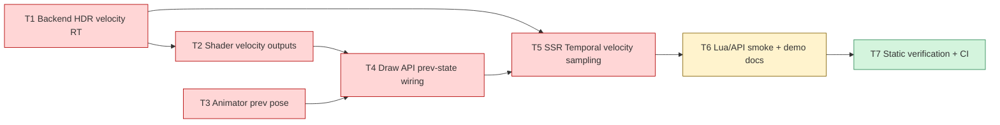

# Phase E.13 Motion Vector Velocity — TASK 文档

> **阶段**：6A Workflow — 阶段 3 Atomize（原子化）
> **目标**：DESIGN → 拆分任务 → 明确接口 → 依赖关系
> **基线**：DESIGN_PhaseE_13.md
> **状态**：规划草案，尚未实现

---

## 1. 任务依赖图



**关键路径**：T1 → T2/T3 → T4 → T5 → T6 → T7。

---

## 2. 原子任务详述

### T1 — Backend HDR velocity RT

**优先级**：高

**文件**：

| 类型 | 路径 |
|---|---|
| Modify | `ChocoLight/include/render_backend.h` |
| Modify | `ChocoLight/src/render_gl33.cpp` |
| Modify | `ChocoLight/src/hdr_renderer.cpp` |
| Optional | `ChocoLight/include/hdr_renderer.h` |

**输入契约**：

- DESIGN §3 velocity attachment 格式。
- 现有 `CreateHDRFBO` 已支持 optional normal MRT。

**输出契约**：

- `CreateHDRFBO` 可选创建 `outVelocityTex`。
- GL33 FBO 使用 3 个 color attachments：0 color、1 normal、2 velocity。
- `GetHDRVelocityTex(fbo)` 返回 velocity texture id，缺失返回 0。
- `DeleteHDRFBO` 同步释放 velocity texture。

**验收标准**：

- 所有旧 `CreateHDRFBO` 调用仍可编译。
- HDR Enable 失败时已创建的 color/normal/velocity/depth 都能清理。
- `glDrawBuffers` 在 velocity 可用时设置为 3 attachments。

---

### T2 — 默认 shader velocity outputs

**优先级**：高

**文件**：

| 类型 | 路径 |
|---|---|
| Modify | `ChocoLight/src/render_gl33.cpp` |

**输入契约**：

- T1 已提供 velocity attachment。
- DESIGN §5 static / skin / morph shader 设计。

**输出契约**：

- PBR / Unlit fragment shader 新增 `layout(location=2)` velocity 输出。
- static mesh shader 计算 current clip 与 previous clip。
- GPU skin shader 使用 current/prev joint palette 计算 velocity。
- GPU skin+morph shader 使用 current/prev joint palette + morph weights 计算 velocity。
- GLES3 与 GL33 profile 同步更新。

**验收标准**：

- `uHasVelocityHistory=0` 时 velocity 输出 `(0,0)`。
- prev-state 缺失时 object velocity 退化，不产生 NaN / Inf。
- normal MRT 原有输出语义保持不变。

---

### T3 — Animator prev pose cache

**优先级**：高

**文件**：

| 类型 | 路径 |
|---|---|
| Modify | `ChocoLight/src/light_animation.cpp` |
| Modify | `docs/api/Light_Animation.md` |

**输入契约**：

- 当前 `Animator` 已有 `jointMatrices`、`morphWeights`、`prevTime`。
- DESIGN §6 prev pose 状态。

**输出契约**：

- `Animator` 保存 `prevJointMatrices`、`prevMorphWeights`、`hasPrevPose`。
- `Animator:Update(dt)` 在推进前复制上一帧 current pose。
- `SetCurrentTime`、立即 transition、明显时间跳变清 `hasPrevPose`。
- `DrawSkinnedMesh` 能取得 prev pose 并传给 GPU backend。

**验收标准**：

- 第一帧没有 prev pose。
- 正常连续 `Update(dt)` 后有 prev pose。
- 手动 seek 不会产生巨大错误 velocity。

---

### T4 — Draw API prev-state wiring

**优先级**：高

**文件**：

| 类型 | 路径 |
|---|---|
| Modify | `ChocoLight/include/render_backend.h` |
| Modify | `ChocoLight/src/render_gl33.cpp` |
| Modify | `ChocoLight/src/light_graphics_mesh.cpp` |
| Modify | `ChocoLight/src/light_animation.cpp` |
| Modify | `docs/api/Light_Graphics.md` |
| Modify | `docs/api/Light_Animation.md` |

**输入契约**：

- T2 shader uniforms 已定义。
- T3 Animator prev pose 已可用。

**输出契约**：

- `SetNextPreviousModelMatrix(prevModel)` 只影响下一次 ordinary mesh draw。
- `mesh:Draw([textureId|material], [prevModelMat4])` 支持可选 prev model。
- `Animation.DrawSkinnedMesh(mesh, animator, transform, material, prevTransform)` 支持可选 prev transform。
- skin/morph backend draw 接口传入 previous joint/morph 数据。

**验收标准**：

- 旧 Lua 调用不变。
- 错误 prev matrix table 返回明确 Lua 错误。
- next-prev-model draw 后自动清空，避免污染下一次 draw。

---

### T5 — SSR Temporal velocity sampling

**优先级**：高

**文件**：

| 类型 | 路径 |
|---|---|
| Modify | `ChocoLight/include/render_backend.h` |
| Modify | `ChocoLight/src/render_gl33.cpp` |
| Modify | `ChocoLight/include/ssr_renderer.h` |
| Modify | `ChocoLight/src/ssr_renderer.cpp` |
| Modify | `ChocoLight/src/hdr_renderer.cpp` |

**输入契约**：

- T1 能查询 `velocityTex`。
- T2/T4 能写入 velocity。
- E.12 Temporal SSR history/reprojection 已存在。

**输出契约**：

- `DrawSSRTemporal` 接收 `velocityTex`。
- shader 有 `uVelocityTex` 与 `uHasVelocityTex`。
- 有 velocity 时使用 `prevUV = vUV - velocity`。
- 无 velocity 时保留 E.12 depth matrix reprojection。
- rejection 处理 prevUV 越界、速度过大、history invalid。

**验收标准**：

- velocityTex=0 与 E.12 行为一致。
- `hasHistory=0` 不采样 history。
- dynamic velocity 路径不破坏 blur/composite 顺序。

---

### T6 — Lua smoke / demo / docs

**优先级**：中

**文件**：

| 类型 | 路径 |
|---|---|
| Modify | `scripts/smoke/ssr.lua` |
| Modify | `samples/demo_ssr/main.lua` |
| Modify | `docs/api/Light_Animation.md` |
| Modify | `docs/api/Light_Graphics.md` |
| Create/Modify | `docs/Phase E.13 Motion Vector Velocity/ACCEPTANCE_PhaseE_13.md` |
| Create/Modify | `docs/Phase E.13 Motion Vector Velocity/TODO_PhaseE_13.md` |
| Create/Modify | `docs/Phase E.13 Motion Vector Velocity/FINAL_PhaseE_13.md` |

**输入契约**：

- T4/T5 API 已稳定。

**输出契约**：

- smoke 覆盖新增 Lua API 或新增可选参数兼容性。
- demo 提供动态物体对比说明，至少 HUD 显示 velocity temporal 状态。
- API 文档描述 prev transform / prev model 的使用方式。
- TODO 明确真机视觉验收、CPU fallback 精确 velocity、roughness-aware 后续项。

**验收标准**：

- Lua 旧调用不报错。
- 新参数路径有最小静态覆盖。
- 文档无“完整支持 CPU skin velocity”等过度承诺。

---

### T7 — Static verification + CI

**优先级**：中

**文件**：

| 类型 | 路径 |
|---|---|
| Verify | 全仓库相关改动 |

**输入契约**：

- T1-T6 已完成。
- 仍遵守“不本地 CMake build / 不本地 runtime smoke”的约束，除非用户另行确认。

**推荐验证**：

```powershell
git diff --check
.\lightc.exe -p scripts\smoke\ssr.lua
.\lightc.exe -p samples\demo_ssr\main.lua
```

如本机无 `lightc.exe` 或用户继续禁止本地运行，则改为静态审查 + CI。

**CI 验收**：

- Windows / Linux / macOS / Android / iOS / Web build 全绿。
- Windows runtime smoke 通过。
- 文档记录 CI run id 与结论。

---

## 3. 建议提交拆分

| Commit | 内容 |
|---|---|
| `docs: add Phase E.13 velocity planning` | 本轮 ALIGNMENT/DESIGN/TASK |
| `feat: add HDR velocity buffer backend plumbing` | T1 |
| `feat: write velocity from 3D shaders` | T2 |
| `feat: track previous animation pose for velocity` | T3 |
| `feat: wire previous transforms into velocity draws` | T4 |
| `feat: use velocity buffer in temporal SSR` | T5 |
| `test: cover SSR velocity API and demo` | T6 |
| `docs: finalize Phase E.13 acceptance` | T7 文档收尾 |

---

## 4. 阶段风险清单

| 风险 | 处理策略 |
|---|---|
| shader 双 profile 漏改 | 每次改 GL33 shader 时同步搜索 GLES3 对应字符串 |
| optional 参数破坏旧 Lua 调用 | 所有新增参数必须 `lua_isnoneornil` 兼容 |
| prev pose 初始化错误 | 首帧强制 `hasPrevPose=false` |
| large velocity 导致 history 拉花 | Temporal shader 加 magnitude clamp / current fallback |
| velocity attachment 不可用 | SSR 保留 E.12 matrix reprojection fallback |
| user shader 不写 velocity | 文档明确限制；默认路径优先覆盖 |

---

## 5. 当前审批结论

- E.13 范围：完整 velocity buffer。
- 架构路线：混合路线。
- 当前动作：仅完成规划文档，不进入实现。
