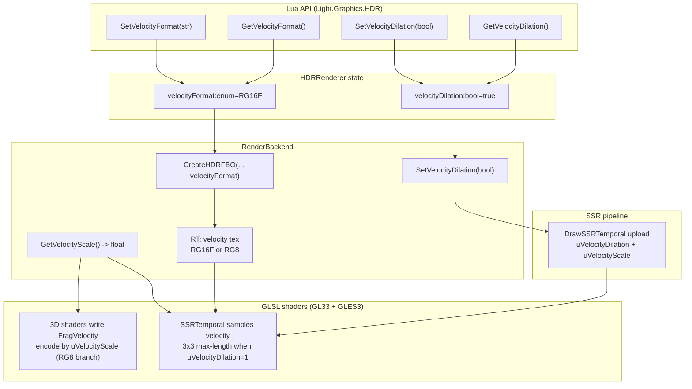

# Phase E.14 Velocity Dilation + RG8 Format — DESIGN 文档

> **阶段**：6A Workflow — 阶段 2 Architect（设计）
> **目标**：ALIGNMENT → 系统架构 → 模块设计 → 接口规范
> **基线**：`ALIGNMENT_PhaseE_14.md`，main HEAD `9f32401`
> **状态**：规划草案，尚未实现

---

## 1. 设计总览

Phase E.14 在 Phase E.13 velocity buffer 之上做两类**侵入性最小**的增量：

1. **存储侧**：velocity texture 的 internalFormat 从单一 `GL_RG16F` 变为「默认 RG16F，可选 RG8」运行时切换
2. **采样侧**：SSRTemporal shader 内 inline 3x3 max-length dilation，由 `uVelocityDilation` uniform gating

外部 API 增加 4 个 Lua getter/setter（挂在 `Light.Graphics.HDR` 子表），其余调用 100% 兼容。

---

## 2. 整体架构图



---

## 3. 数据流：velocity 写入与消费

### 3.1 写入路径（4 个 3D shader × 2 profile）

```
顶点 shader (vCurClip, vPrevClip 已就位; Phase E.13 落地)
   │
   ▼
片段 shader FragVelocity 输出 (location=2)
   │
   ├─ 若 RG16F 模式 (默认)
   │     FragVelocity = curUV - prevUV;            // raw, [-1, +1] 理论范围
   │
   └─ 若 RG8 模式
         vec2 raw = curUV - prevUV;
         FragVelocity = clamp(raw / (2.0 * uVelocityScale) + 0.5, 0.0, 1.0);
         // 编码: raw ∈ [-uVelocityScale, +uVelocityScale] → [0, 1] UNORM
```

`uVelocityScale` 是 fragment shader 端 uniform，**RG16F 模式下不参与计算**（驱动会优化掉无用 uniform）。

### 3.2 消费路径（SSRTemporal shader）

```
当前像素 vUV
   │
   ├─ 若 uVelocityDilation == 0
   │     vec2 v = DecodeVelocity(texture(uVelocityTex, vUV).rg);
   │
   └─ 若 uVelocityDilation == 1
         3x3 邻域采样, 选 dot(v,v) 最大的那个 v:
         for dy in [-1,1] for dx in [-1,1]:
            vec2 v = DecodeVelocity(texture(uVelocityTex, vUV + vec2(dx,dy)*uTexel).rg);
            if (dot(v,v) > bestLen) bestV = v;
   │
   ▼
prevUV = vUV - v;
prevColor = texture(uHistoryTex, prevUV);
```

### 3.3 DecodeVelocity 助手

```glsl
vec2 DecodeVelocity(vec2 raw) {
#ifdef VELOCITY_FORMAT_RG8
    return (raw - 0.5) * (2.0 * uVelocityScale);
#else
    return raw;  // RG16F 直接是 UV delta
#endif
}
```

**`VELOCITY_FORMAT_RG8` 由 program build 时的 `#define` 注入**，避免运行期分支。两份 SSRTemporal program 各编译一次（一份 RG16F 一份 RG8），切换 format 时切 program。

---

## 4. RenderBackend 接口设计

### 4.1 `CreateHDRFBO` 签名扩展

```cpp
// 旧 (Phase E.13)
virtual uint32_t CreateHDRFBO(int w, int h, uint32_t* outTex,
                              uint32_t* outNormalTex = nullptr,
                              uint32_t* outVelocityTex = nullptr) = 0;

// 新 (Phase E.14)
enum class VelocityFormat : uint8_t {
    RG16F = 0,   // 默认, 8MB/1080p, 16-bit float, 无 scale
    RG8   = 1    // 可选, 2MB/1080p, 8-bit UNORM, 用 uVelocityScale 编码
};

virtual uint32_t CreateHDRFBO(int w, int h, uint32_t* outTex,
                              uint32_t* outNormalTex = nullptr,
                              uint32_t* outVelocityTex = nullptr,
                              VelocityFormat velocityFormat = VelocityFormat::RG16F) = 0;
```

旧调用 100% 兼容（默认参数）。GL33 backend 内根据 `velocityFormat` 切换 `glTexImage2D(... GL_RG16F vs GL_RG8 ...)`。

### 4.2 新增接口（最小集）

```cpp
class RenderBackend {
public:
    // ... 既有接口 ...

    // Phase E.14: dilation 状态 (默认 true)
    virtual void SetVelocityDilation(bool enabled) {}
    virtual bool GetVelocityDilation() const { return true; }

    // Phase E.14: 当前 velocityScale (RG8 模式下 shader 用)
    virtual float GetVelocityScale() const { return 0.25f; }
};
```

GL33 实现持有这两个字段并通过 `SSRTemporal` draw / 3D shader draw 上传到 uniform。

### 4.3 删除路径

`DeleteHDRFBO` 不变（已通过 `hdrFboVelocityTex[fbo]` map 自动释放）。

---

## 5. HDRRenderer state + 切换协议

### 5.1 state 扩展

```cpp
struct State {
    // ... 既有 ...
    bool                  velocityDilation = true;            // 默认 ON
    VelocityFormat        velocityFormat   = VelocityFormat::RG16F;
};
```

### 5.2 API

```cpp
// hdr_renderer.h (namespace HDRRenderer)
void  SetVelocityDilation(bool on);
bool  GetVelocityDilation();
bool  SetVelocityFormat(VelocityFormat fmt);   // 触发 RT 重建; 失败返回 false
VelocityFormat GetVelocityFormat();
```

### 5.3 SetVelocityFormat 实施流程

```
SetVelocityFormat(newFormat):
    if (newFormat == g.velocityFormat) return true;
    g.velocityFormat = newFormat;
    if (!g.enabled) return true;           // 未启 HDR, 仅记状态
    int w = g.width, h = g.height;
    ReleaseRT();                            // 释放旧 velocity tex
    if (!CreateRT(w, h)) {                  // 用新 format 重建
        g.enabled = false;
        return false;
    }
    backend->ResetVelocityHistory();        // 防止 history 与新 format 不匹配
    return true;
```

`CreateRT` 内部需要拿到 `g.velocityFormat` 透传给 `backend->CreateHDRFBO`。

### 5.4 SetVelocityDilation 实施流程

```
SetVelocityDilation(on):
    g.velocityDilation = on;
    if (backend) backend->SetVelocityDilation(on);
```

不需要重建 RT；仅切 SSRTemporal draw 时 uniform 值。

---

## 6. SSRRenderer 接入

`SSRRenderer::Process` 调 `DrawSSRTemporal` 时把新参数透传：

```cpp
// 当前 (Phase E.13)
backend->DrawSSRTemporal(reflect, history, depth, velocity,
                         dstFbo, w, h, reprojMat, invProj,
                         blendAlpha, rejectionMode, hasHistory);

// 新 (Phase E.14)
backend->DrawSSRTemporal(reflect, history, depth, velocity,
                         dstFbo, w, h, reprojMat, invProj,
                         blendAlpha, rejectionMode, hasHistory,
                         /*velocityDilation=*/backend->GetVelocityDilation(),
                         /*velocityScale=*/backend->GetVelocityScale());
```

`DrawSSRTemporal` 签名扩展两个 trailing 参数，带默认值保留向后兼容（C++ 侧）：

```cpp
virtual void DrawSSRTemporal(uint32_t curReflect, uint32_t history, uint32_t depth,
                             uint32_t velocity, uint32_t dstFbo, int w, int h,
                             const float* reprojectMat, const float* invProj,
                             float blendAlpha, int rejectionMode, bool hasHistory,
                             bool velocityDilation = true,
                             float velocityScale   = 0.25f) = 0;
```

---

## 7. GL33 backend 内部资源

### 7.1 SSRTemporal program 双编译

```cpp
GLuint programSSRTemporal_RG16F = 0;
GLuint programSSRTemporal_RG8   = 0;

// uniform location cache 也变两套
struct SSRTemporalLocs {
    GLint curReflect = -1, history = -1, depth = -1, velocity = -1;
    GLint reprojMat = -1, invProj = -1, texel = -1;
    GLint blendAlpha = -1, rejectionMode = -1, hasHistory = -1;
    GLint hasVelocityTex = -1, velocityDilation = -1, velocityScale = -1;
};
SSRTemporalLocs locsRG16F;
SSRTemporalLocs locsRG8;
```

`DrawSSRTemporal` 内根据当前 `velocityFormat` 选 program。

### 7.2 3D shader velocity 编码

4 个 3D shader × 2 profile 在头部插入 `#define VELOCITY_FORMAT_RG8 0|1`，编译 8 份 program 太重。**替代方案**：3D shader 内不走分支，统一写 raw `curUV - prevUV`；编码工作交给 framebuffer texture 的 internalFormat：

| internalFormat | 写入行为 |
|---|---|
| `GL_RG16F` | shader 写 `curUV - prevUV` 直接存储（理论范围 [-1, 1]，实际 < 0.05） |
| `GL_RG8` UNORM | shader 写 `(curUV - prevUV) / (2 * uVelocityScale) + 0.5`，存为 [0, 1] |

这意味着 3D shader **需要知道当前 velocity format**。最简方案：3D shader 不区分，永远写 raw `curUV - prevUV`；GL33 backend 在切到 RG8 format 时**全局重编译这 4 个 shader**，注入 `#define VELOCITY_FORMAT_RG8`。

实施权衡：

| 方案 | 内存 | 编译次数 | 风险 |
|------|------|----------|------|
| 双编译保存 | +program 数 ×2 | 启动时一次性 | 启动慢，但运行时零成本 |
| **运行时按需重编译** | 仅当前 format 的 program | 切 format 时 N 次 | 实现简单，切 format 卡顿 |

**采用「运行时按需重编译」**：切 format 是低频操作（用户在选项菜单触发），单次 shader 编译 < 100ms 可接受。Phase E.13 的 program 缓存机制无需重构。

### 7.3 编译时宏注入

GLSL `#version` 之后立即插入 `#define VELOCITY_FORMAT_RG8 1`（RG8 模式）或不插入（RG16F 模式）。3D shader fragment 末尾：

```glsl
#if VELOCITY_FORMAT_RG8
    if (uHasVelocityHistory == 1) {
        vec2 v = curUV - prevUV;
        FragVelocity = clamp(v / (2.0 * uVelocityScale) + 0.5, 0.0, 1.0);
    } else {
        FragVelocity = vec2(0.5);    // [0,1] 中心点表示零速度
    }
#else
    if (uHasVelocityHistory == 1) {
        FragVelocity = curUV - prevUV;
    } else {
        FragVelocity = vec2(0.0);
    }
#endif
```

SSRTemporal shader 同理 `#ifdef VELOCITY_FORMAT_RG8` 切 DecodeVelocity 行为。

---

## 8. Lua 绑定

### 8.1 接口列表

`ChocoLight/src/light_graphics_hdr.cpp` 新增（已假设此文件存在，否则放在 `light_graphics.cpp` HDR 子表）：

| Lua 函数 | C 函数 | 返回 |
|---|---|---|
| `HDR.SetVelocityDilation(bool)` | `l_HDR_SetVelocityDilation` | `true` 或 `nil + err` |
| `HDR.GetVelocityDilation()` | `l_HDR_GetVelocityDilation` | `bool` |
| `HDR.SetVelocityFormat(string)` | `l_HDR_SetVelocityFormat` | `true` 或 `nil + err` |
| `HDR.GetVelocityFormat()` | `l_HDR_GetVelocityFormat` | `"rg16f"` 或 `"rg8"` |

### 8.2 错误处理约定

- `SetVelocityDilation`：非 bool 入参 → `nil, "expect boolean"`
- `SetVelocityFormat`：非 string 或不是 `"rg16f"/"rg8"` → `nil, "expect 'rg16f' or 'rg8'"`
- `SetVelocityFormat` 在 `g.enabled == false` 时仍接受，但只更新 state；下次 `Enable` 时生效

### 8.3 与现有 HDR 子表同模式

参考 Phase E.13 后已有的 `HDR.Enable/Disable/IsEnabled`，在同一注册块新增 4 个条目。

---

## 9. 异常处理与降级

| 场景 | 行为 |
|---|---|
| GL3.3 driver 不支持 `GL_RG8` color render | 退化为 RG16F + warning log，SetVelocityFormat 返回 false |
| `velocityScale` 上传失败（uniform location = -1） | 静默跳过；该 program 不参与 RG8 编码（通常意味着 RG8 program 编译失败） |
| `SetVelocityFormat` 重建 RT 失败 | HDR 禁用，state 回退到旧 format（与 `Enable` 失败处理一致） |
| `SetVelocityDilation` 在 backend 缺失时 | 仅更新 state，下次 `Enable` 时生效 |
| Lua 端在 HDR 未初始化时 query | `Get*` 返回当前 state（默认值），不抛错 |

---

## 10. 兼容性矩阵

| 旧调用 / 旧脚本 | Phase E.14 行为 |
|---|---|
| `HDR.Enable(w, h)` | 走默认 RG16F + dilation ON，与 E.13 视觉一致或略好（dilation 减弱边缘 halo） |
| Phase E.12 demo（无 velocity tex 路径） | 不受影响，fallback 到 matrix reproject |
| `mesh:Draw(...)` 各种形式 | 不受影响，velocity 写入照旧 |
| Phase AW GPU skin / AX morph | 不受影响 |
| `SSR.SetTemporalEnabled(...)` 等 | 不受影响 |

---

## 11. 性能预估

| 项 | RG16F + dilation OFF | RG16F + dilation ON | RG8 + dilation OFF | RG8 + dilation ON |
|---|---|---|---|---|
| 1080p velocity tex VRAM | 8 MB | 8 MB | 2 MB | 2 MB |
| SSRTemporal fragment ALU | baseline | +9 tex fetch / pixel | baseline + decode | +9 tex fetch + decode / pixel |
| Frame time impact | 0 | 估计 < 0.3ms @ 1080p（与 Bloom 9-tap 同量级） | 0 | < 0.3ms |
| 视觉差异 | E.13 baseline | 边缘 halo 减弱 | 精度损失约 2px @ 1080p | 边缘 halo 减弱 + 精度损失 |

---

## 12. 设计决策摘要

| 决策 | 选择 | 替代方案 | 理由 |
|------|------|----------|------|
| dilation 实施位置 | SSRTemporal shader inline | 独立 dilation pass | 当前唯一消费者；零新 RT |
| dilation kernel | 3x3 max-length | 5x5 / cross | TAA classic；性能/质量 sweet spot |
| RG8 编码 | UNORM + bias/scale | SNORM | GL3.3/ES3 兼容性最好 |
| `kVelocityScale` | 0.25（固定） | 自适应 / Lua 可调 | 简单；覆盖 90% 场景 |
| format 切换实施 | ReleaseRT + CreateRT | 双 RT 并存 | 切换是低频；省 VRAM |
| 3D shader format 分支 | 编译时宏（按需重编译） | 双 program 启动编译 | 内存友好；切 format 时 < 100ms 卡顿可接受 |
| Lua API 表面 | 4 个 HDR 子表函数 | 全局函数 / 新 namespace | 与 E.13 同模式，降低用户学习成本 |
| dilation 默认 | ON | OFF | 视觉增量，性能 < 0.3ms |
| format 默认 | RG16F | RG8 | 保护既有视觉无回归 |

---

## 13. 与下一阶段衔接

设计就绪后进入 **6A 阶段 3 Atomize**，将本设计拆为原子任务 T1~T7，每个任务有独立的输入/输出契约与验收标准，写入 `TASK_PhaseE_14.md`。
