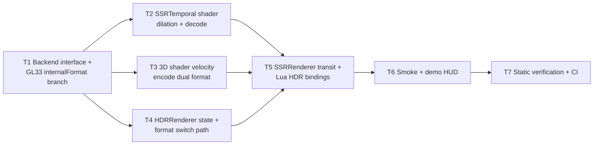

# Phase E.14 Velocity Dilation + RG8 Format — TASK 文档

> **阶段**：6A Workflow — 阶段 3 Atomize（原子化）
> **基线**：`DESIGN_PhaseE_14.md`
> **目标**：把设计拆为 7 个独立可验证的原子任务，每个任务有输入/输出契约与验收标准

---

## 0. 任务依赖图



并行机会：T2 / T3 / T4 在 T1 完成后并行；T5 等齐 T2~T4；T6 等 T5；T7 串到末尾。

---

## T1 — RenderBackend 接口扩展 + GL33 internalFormat 分支

### 输入契约
- 前置依赖：Phase E.13 落地（commit `9f32401` 及之前）
- 输入数据：无
- 环境依赖：`render_backend.h` / `render_gl33.cpp` 已有 velocity tex 创建路径

### 输出契约

**接口契约**（`ChocoLight/include/render_backend.h`）：

```cpp
enum class VelocityFormat : uint8_t { RG16F = 0, RG8 = 1 };

class RenderBackend {
public:
    virtual uint32_t CreateHDRFBO(int w, int h, uint32_t* outTex,
                                  uint32_t* outNormalTex = nullptr,
                                  uint32_t* outVelocityTex = nullptr,
                                  VelocityFormat velocityFormat = VelocityFormat::RG16F) = 0;

    virtual void  SetVelocityDilation(bool enabled) {}
    virtual bool  GetVelocityDilation() const { return true; }
    virtual float GetVelocityScale() const { return 0.25f; }
};
```

**GL33 实现**：
- `CreateHDRFBO` 内部用 `velocityFormat` 选 `GL_RG16F` 或 `GL_RG8` 作为 `internalFormat`
- `velocityScale = 0.25f`（常量字段，Phase E.14 不动态调整）
- `velocityDilation = true`（默认开）
- 用 `hdrFboVelocityTex` map 同步存（与现有 normal/velocity tex map 一致）

**关键代码节点**：
- `render_gl33.cpp:3648-3666`：velocity tex 创建处增加 `(velocityFormat == VelocityFormat::RG16F) ? GL_RG16F : GL_RG8` 三元

### 实现约束
- 旧 `CreateHDRFBO` 调用（不传 `velocityFormat`）必须保持二进制兼容（默认参数值 `RG16F`）
- GL33 driver 不支持 `GL_RG8` color render 时退化 RG16F + warning log（实测 Mesa / NVIDIA / Intel 都支持，几乎不会触发）

### 验收标准
- 文件无 `git diff --check` warning
- `RenderBackend::GetVelocityScale()` 返回 `0.25f`
- 旧 `CreateHDRFBO` 调用编译通过
- 新调用 `CreateHDRFBO(w, h, &t, &n, &v, VelocityFormat::RG8)` 编译通过
- `RG8` 模式下 `glTexImage2D` 第 3 参为 `GL_RG8`，第 7 参仍 `GL_FLOAT`（驱动会做转换；或改为 `GL_UNSIGNED_BYTE`）

### 影响文件
- `ChocoLight/include/render_backend.h`
- `ChocoLight/src/render_gl33.cpp`

---

## T2 — SSRTemporal shader: dilation + DecodeVelocity 双格式

### 输入契约
- T1 完成（`VelocityFormat` enum + `GetVelocityScale` / `GetVelocityDilation` 可用）
- 现有 `FS_SSR_TEMPORAL_SOURCE` 双 profile (GL33 + GLES3)

### 输出契约

**Shader 改动**（GL33 + GLES3 双 profile）：

1. 新 uniform：
```glsl
uniform int   uVelocityDilation;   // 0 / 1
uniform float uVelocityScale;      // 仅 RG8 profile 用; RG16F profile 也接收但忽略
```

2. 新助手：
```glsl
vec2 DecodeVelocity(vec2 raw) {
#if VELOCITY_FORMAT_RG8
    return (raw - 0.5) * (2.0 * uVelocityScale);
#else
    return raw;
#endif
}

vec2 SampleVelocityDilated(sampler2D tex, vec2 uv, vec2 texel) {
    if (uVelocityDilation == 0) return DecodeVelocity(texture(tex, uv).rg);
    vec2 bestV = vec2(0.0);
    float bestLen = -1.0;
    for (int dy = -1; dy <= 1; ++dy) {
        for (int dx = -1; dx <= 1; ++dx) {
            vec2 v = DecodeVelocity(texture(tex, uv + vec2(float(dx), float(dy)) * texel).rg);
            float l = dot(v, v);
            if (l > bestLen) { bestLen = l; bestV = v; }
        }
    }
    return bestV;
}
```

3. 主流程改 `prevUV = vUV - SampleVelocityDilated(uVelocityTex, vUV, uTexel)`

**Program build 流程**：
- `buildProgram(FS_SSR_TEMPORAL_SOURCE, "SSRTemporal_RG16F")`：不注入宏
- `buildProgram(FS_SSR_TEMPORAL_SOURCE, "SSRTemporal_RG8")`：在 `#version` 后注入 `#define VELOCITY_FORMAT_RG8 1`
- 缓存两个 program + 两套 uniform location；切换 format 时切 program

实施权衡：可以**只在 `SetVelocityFormat` 切到 RG8 时按需 build RG8 program**，避免启动时双编译。但 Phase E.14 实施简化采用「启动时一次性编译两个 program」，因为切 format 卡顿不可避免，而启动开销可控。

### 实现约束
- 两份 program 共享 `FS_SSR_TEMPORAL_SOURCE` 源码；通过 `#define` gating 而不是分拆源码
- uniform location 缓存两套：`locSSRTemporal_RG16F_*` 与 `locSSRTemporal_RG8_*`

### 验收标准
- 两个 program 编译都成功（`programSSRTemporal_RG16F != 0` && `programSSRTemporal_RG8 != 0`）
- 切 program 时 `uVelocityTex` / `uHistoryTex` 等 sampler 绑定不丢失（每个 program 各自调一次 `glUniform1i` 初始化）
- `uVelocityDilation` 上传与 backend `GetVelocityDilation` 状态一致

### 影响文件
- `ChocoLight/src/render_gl33.cpp`（`FS_SSR_TEMPORAL_SOURCE` × 2 profile + program build + uniform location 缓存 + `DrawSSRTemporal` 选 program）

---

## T3 — 3D shader velocity encode 双格式（4 shader × 2 profile）

### 输入契约
- T1 完成
- 4 个现有 3D shader：Static Unlit, Static PBR, Skin Unlit, Skin PBR (Skin Morph 视代码归并程度)
- 每个 shader 有 GL33 + GLES3 双 profile

### 输出契约

**Shader 改动**（每个 fragment shader 末尾）：

```glsl
// 新 uniform
uniform float uVelocityScale;  // RG8 模式生效; RG16F 模式不读

// 新逻辑
if (uHasVelocityHistory == 1) {
    vec2 curUV  = (vCurClip.xy  / max(vCurClip.w,  1e-6)) * 0.5 + 0.5;
    vec2 prevUV = (vPrevClip.xy / max(vPrevClip.w, 1e-6)) * 0.5 + 0.5;
#if VELOCITY_FORMAT_RG8
    FragVelocity = clamp((curUV - prevUV) / (2.0 * uVelocityScale) + 0.5, 0.0, 1.0);
#else
    FragVelocity = curUV - prevUV;
#endif
} else {
#if VELOCITY_FORMAT_RG8
    FragVelocity = vec2(0.5);   // [0,1] center = zero velocity
#else
    FragVelocity = vec2(0.0);
#endif
}
```

**Program build**：每个 3D shader 都编译两份（RG16F profile + RG8 profile）。

考虑到 4 shader × 2 GLSL profile × 2 format = 16 个 program，启动开销显著。优化方案：**按需懒编译**——`SetVelocityFormat("rg8")` 时再编译对应 RG8 profile 集合。

实施折中：

| 策略 | 启动 program 数 | 切 format 卡顿 | 推荐 |
|------|----------------|---------------|------|
| 全部 startup 编译 | 16 | 0 | 启动慢 |
| **按需 RG8 编译** | 8 (仅 RG16F) | 切 RG8 时编译 8 个 program | ✅ 采用 |

### 实现约束
- 默认 startup 只 build RG16F profile
- `SetVelocityFormat("rg8")` 触发 RG8 profile build；失败时回退 RG16F
- 切回 RG16F 不释放 RG8 program（缓存以便再切）

### 验收标准
- 默认启动后 4 个 RG16F 3D shader program 编译成功
- 切 RG8 后 4 个 RG8 3D shader program 编译成功
- 切回 RG16F 视觉与 E.13 baseline 一致
- 旧 demo（`demo_unlit_3d`、`demo_pbr` 等）无可见回归

### 影响文件
- `ChocoLight/src/render_gl33.cpp`（4 shader × 2 profile 源码 + program build 调用扩展）

---

## T4 — HDRRenderer state + SetVelocityFormat 切换路径

### 输入契约
- T1 完成（backend 接口可用）

### 输出契约

**`ChocoLight/include/hdr_renderer.h`** 新增导出：

```cpp
namespace HDRRenderer {
    // ... 既有 ...
    bool                  SetVelocityDilation(bool on);     // 失败返回 false
    bool                  GetVelocityDilation();
    bool                  SetVelocityFormat(VelocityFormat fmt);
    VelocityFormat        GetVelocityFormat();
}
```

**`ChocoLight/src/hdr_renderer.cpp`** state 字段：

```cpp
struct State {
    // ... 既有 ...
    bool                  velocityDilation = true;
    VelocityFormat        velocityFormat   = VelocityFormat::RG16F;
};
```

**`CreateRT`** 改造：透传 `g.velocityFormat` 给 `backend->CreateHDRFBO(w, h, &tex, &normalTex, &velocityTex, g.velocityFormat)`。

**`SetVelocityFormat`** 实施：见 `DESIGN_PhaseE_14.md` §5.3。

### 实现约束
- `SetVelocityFormat(format)` 在 `g.enabled == false` 时**只更新 state**，不报错
- 不修改 `Enable(w, h)` 公共签名
- `Disable()` / `Shutdown()` 不重置 `velocityFormat` / `velocityDilation`，下次 `Enable` 沿用

### 验收标准
- 切 format 后 `g.velocityFormat` 与 backend RT internalFormat 一致
- 切 format 失败时 `g.enabled` 回退合理（参考 Phase E.10 `Enable` 失败处理）
- `SetVelocityDilation(false)` 后 `backend->GetVelocityDilation()` 返回 false

### 影响文件
- `ChocoLight/include/hdr_renderer.h`
- `ChocoLight/src/hdr_renderer.cpp`

---

## T5 — SSRRenderer 透传 + Lua HDR 子表 4 个 binding

### 输入契约
- T2, T3, T4 完成

### 输出契约

**SSRRenderer 改动**（`ChocoLight/src/ssr_renderer.cpp`）：

```cpp
backend->DrawSSRTemporal(reflect, history, depth,
                         backend->GetHDRVelocityTex(hdrFbo),
                         writeFbo, w, h, reprojMat, invProj,
                         blendAlpha, rejectionMode, hasHistory,
                         backend->GetVelocityDilation(),
                         backend->GetVelocityScale());
```

**`RenderBackend::DrawSSRTemporal`** 签名扩展两个 trailing 参数，默认值保留向后兼容（见 DESIGN §6）。

**Lua binding**（`ChocoLight/src/light_graphics.cpp` 或 `light_graphics_hdr.cpp`）：

```cpp
static int l_HDR_SetVelocityDilation(lua_State* L) {
    if (!lua_isboolean(L, 1)) {
        lua_pushnil(L);
        lua_pushstring(L, "expect boolean");
        return 2;
    }
    bool on = lua_toboolean(L, 1) != 0;
    HDRRenderer::SetVelocityDilation(on);
    lua_pushboolean(L, 1);
    return 1;
}

static int l_HDR_GetVelocityDilation(lua_State* L) {
    lua_pushboolean(L, HDRRenderer::GetVelocityDilation() ? 1 : 0);
    return 1;
}

static int l_HDR_SetVelocityFormat(lua_State* L) {
    const char* s = luaL_checkstring(L, 1);
    VelocityFormat fmt;
    if (strcmp(s, "rg16f") == 0) fmt = VelocityFormat::RG16F;
    else if (strcmp(s, "rg8") == 0) fmt = VelocityFormat::RG8;
    else {
        lua_pushnil(L);
        lua_pushfstring(L, "expect 'rg16f' or 'rg8', got '%s'", s);
        return 2;
    }
    bool ok = HDRRenderer::SetVelocityFormat(fmt);
    lua_pushboolean(L, ok ? 1 : 0);
    return 1;
}

static int l_HDR_GetVelocityFormat(lua_State* L) {
    VelocityFormat fmt = HDRRenderer::GetVelocityFormat();
    lua_pushstring(L, (fmt == VelocityFormat::RG8) ? "rg8" : "rg16f");
    return 1;
}
```

注册到现有 `HDR` 子表的 4 个新条目。

### 实现约束
- 旧 `DrawSSRTemporal` 调用方（如其他 backend）不强制改动；默认参数值兜底
- Lua 错误路径用 `nil + err` 而非 `luaL_error`（MSVC longjmp 风险，遵循 Phase AV.x 教训）

### 验收标准
- Lua `HDR.SetVelocityDilation(true/false)` 与 `GetVelocityDilation()` round-trip 正确
- Lua `HDR.SetVelocityFormat("rg8")` 后 `GetVelocityFormat() == "rg8"`
- bad 入参返回 `nil + err`
- SSR Temporal pass 在 dilation ON / OFF 下 frame 不崩

### 影响文件
- `ChocoLight/include/render_backend.h`
- `ChocoLight/src/render_gl33.cpp`（`DrawSSRTemporal` 签名扩展 + uniform 上传）
- `ChocoLight/src/ssr_renderer.cpp`
- `ChocoLight/src/light_graphics.cpp` 或 `light_graphics_hdr.cpp`

---

## T6 — Smoke 覆盖 + demo HUD 更新

### 输入契约
- T5 完成

### 输出契约

**`scripts/smoke/hdr.lua`** 新增段（在末尾或合适位置）：

```lua
-- Phase E.14: velocity dilation + format
CHECK(type(Light.Graphics.HDR.SetVelocityDilation) == 'function',
      'HDR.SetVelocityDilation 存在 (E.14)')
CHECK(type(Light.Graphics.HDR.GetVelocityDilation) == 'function',
      'HDR.GetVelocityDilation 存在 (E.14)')
CHECK(type(Light.Graphics.HDR.SetVelocityFormat) == 'function',
      'HDR.SetVelocityFormat 存在 (E.14)')
CHECK(type(Light.Graphics.HDR.GetVelocityFormat) == 'function',
      'HDR.GetVelocityFormat 存在 (E.14)')

-- 默认状态
CHECK(Light.Graphics.HDR.GetVelocityDilation() == true,
      '[E.14] dilation 默认 ON')
CHECK(Light.Graphics.HDR.GetVelocityFormat() == 'rg16f',
      '[E.14] format 默认 rg16f')

-- round-trip
Light.Graphics.HDR.SetVelocityDilation(false)
CHECK(Light.Graphics.HDR.GetVelocityDilation() == false,
      '[E.14] dilation OFF round-trip')
Light.Graphics.HDR.SetVelocityDilation(true)

-- bad arg
local ok, err = Light.Graphics.HDR.SetVelocityDilation('yes')
CHECK(ok == nil and type(err) == 'string',
      '[E.14] SetVelocityDilation bad arg → nil + err')

local ok2, err2 = Light.Graphics.HDR.SetVelocityFormat('rg32f')
CHECK(ok2 == nil and type(err2) == 'string',
      '[E.14] SetVelocityFormat 未知格式 → nil + err')
```

**`samples/demo_ssr/main.lua`** HUD 增加：
- 按键 `K`：切 dilation ON/OFF
- 按键 `L`：切 format rg16f/rg8
- HUD 新行显示当前 dilation + format

### 实现约束
- smoke 不要求 HDR 已 Enable（API 设计接受未启用状态）
- demo HUD 改动不能破坏现有按键映射

### 验收标准
- `lightc -p scripts/smoke/hdr.lua` exit 0
- `lightc -p samples/demo_ssr/main.lua` exit 0
- Windows runtime smoke 跑 `hdr.lua` 全 pass

### 影响文件
- `scripts/smoke/hdr.lua`
- `samples/demo_ssr/main.lua`

---

## T7 — 静态验证 + 文档 + CI

### 输入契约
- T1~T6 完成

### 输出契约

**静态验证**：
- `git diff --check` clean
- `lightc -p` 对所有改动的 lua 文件 exit 0
- grep 确认所有新 uniform location 在 program build 后都正确缓存

**文档**：
- `docs/Phase E.14 Velocity Dilation RG8/ACCEPTANCE_PhaseE_14.md`：T1~T7 完成度 + 关键代码节点引用
- `docs/Phase E.14 Velocity Dilation RG8/FINAL_PhaseE_14.md`：项目总结报告
- `docs/Phase E.14 Velocity Dilation RG8/TODO_PhaseE_14.md`：剩余事项（真机视觉、后续 phase 候选）
- `docs/api/Light_Graphics.md`：HDR 子表新增 4 个 API 段
- `docs/Phase E.13 Motion Vector Velocity/TODO_PhaseE_13.md`：把 §3 中 dilation/RG8 候选标记为「→ Phase E.14」

**CI**：
- 单次推 commit → GitHub Actions 6 平台 build success
- Windows runtime smoke 中 `hdr.lua` / `ssr.lua` 0 fail
- 跟一个 `docs: mark Phase E.14 CI green` commit

### 实现约束
- 与 Phase E.13 同 commit 节奏：1 个 feat commit + 1 个 docs CI green commit
- 不本地 CMake build / runtime smoke（用户偏好）

### 验收标准
- GitHub Actions run conclusion = `success`
- 6 platforms 全 success
- Windows job 包含 smoke 段且 0 fail

### 影响文件
- 全部新文档 + Phase E.13 TODO 微调

---

## 1. 拆分原则回顾

| 原则 | 落实 |
|------|------|
| 可独立编译 | T1~T7 每个完成后整体仍能编译；接口扩展用默认参数保兼容 |
| 可独立验证 | 每个任务有具体的验收行为（编译通过 / round-trip / CI 段通过） |
| 复杂度可控 | T1~T7 单任务规模 < 200 行改动；多 shader 改动通过共享源码 + `#define` gating 减重 |
| 依赖关系无循环 | 见 §0 mermaid 图，T1 是单一入口；T5 是单一聚合点 |

---

## 2. 风险登记（任务级）

| 任务 | 风险 | 缓解 |
|------|------|------|
| T1 | `GL_RG8` 在某些 driver 上不能 color render | startup check `glCheckFramebufferStatus`；退化 RG16F |
| T2 | 双 program 启动编译开销 | 按需 RG8 编译（仅切到 RG8 时） |
| T3 | 16 个 program 组合爆炸 | RG8 path 按需懒编译；正常用户走 RG16F 路径无新增 |
| T4 | `SetVelocityFormat` 重建 RT 时 program 还没编 | 先编 program 再 reset RT |
| T5 | Lua binding 错误路径误用 `luaL_error` 触发 MSVC longjmp | 强制 `nil + err`（参考 Phase AV.x 教训） |
| T6 | smoke 在 HDR 未 Enable 时 query → 返回 default | API 设计本身就允许；smoke 不需要 setup HDR |
| T7 | CI windows 偶发 flaky | 与 Phase E.13 相同环境，已有 baseline |

---

## 3. 进入下一阶段

T1~T7 拆分完成。进入 **6A 阶段 4 Approve**：用户审 TASK，确认无遗漏后进入 Automate 实施。
