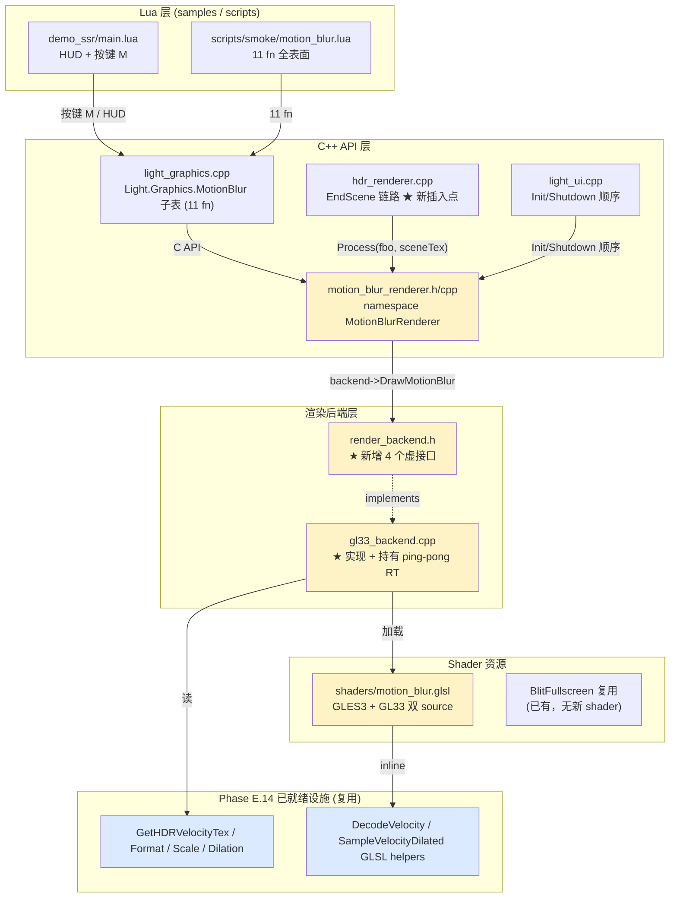
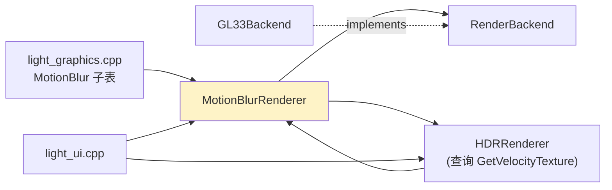
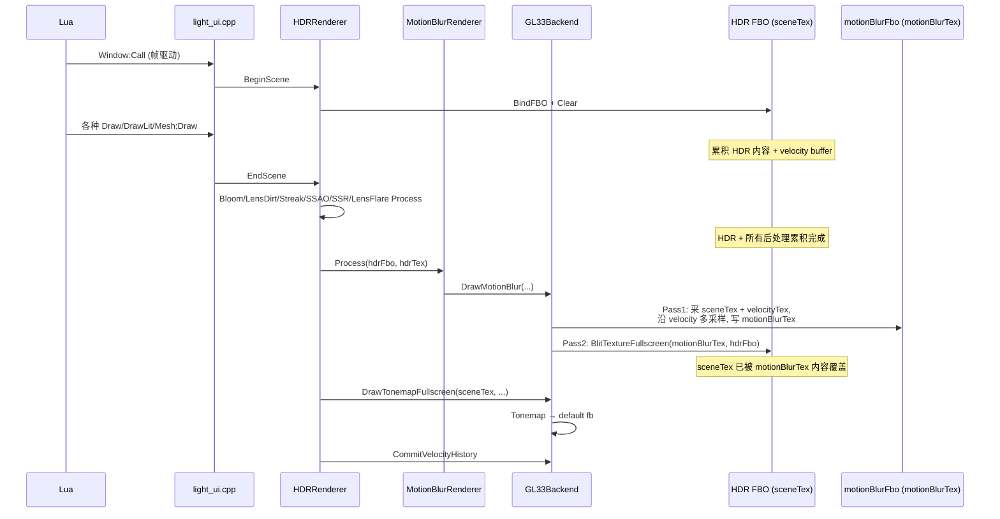
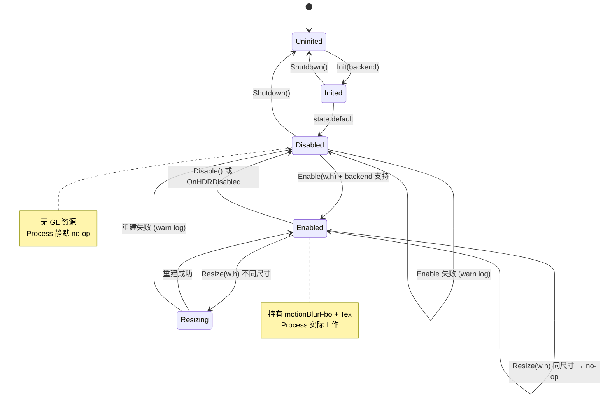

# Phase E.15 Velocity-driven Motion Blur — DESIGN 架构设计

> **承接**：`ALIGNMENT_PhaseE_15.md`（10/10 决策已拍板，含 E3 软限屏幕对角线 30%）
> **目标读者**：Phase E.15 实施者（Atomize 阶段拆任务时直接照此文档执行）

---

## 1. 整体架构

### 1.1 模块视图（C4 Container 级）



**变更面积总览**：
- **新增**：`motion_blur_renderer.h/cpp` + `motion_blur.glsl` (GL33 + GLES3) + `motion_blur.lua` smoke + `MotionBlur` Lua 子表
- **改动**：`render_backend.h` (4 虚接口) + `gl33_backend.cpp` (实现 + 字段 + shader 加载) + `hdr_renderer.cpp` (EndScene 加 1 行) + `light_ui.cpp` (Init/Shutdown 加 2 行) + `light_graphics.cpp` (子表注册) + `samples/demo_ssr/main.lua` (按键 M)
- **不动**：Phase E.13 / E.14 velocity 写入路径、HDR 16 函数、其他后处理 module

### 1.2 模块依赖关系



**循环依赖检查**：HDR ↔ MotionBlur 是双向交互（HDR 在 EndScene 调 MotionBlur::Process；MotionBlur 内部用 HDR::GetVelocityTexture），但都是函数调用，无 header 循环依赖（MBR header 仅前向声明 RenderBackend）。

---

## 2. 数据流（关键时序）

### 2.1 帧渲染时序



**关键不变量**：
- `MB::Process` 完成后，`hdrFbo / sceneTex` 必须包含 motion-blurred 结果（替换原内容）
- `sceneTex` 的 GL id 不变（ping-pong 通过 blit 完成，HDRRenderer 抽象不破）
- 不污染 velocity buffer（只读）

### 2.2 资源生命周期时序

```mermaid
sequenceDiagram
    participant Lua
    participant LG as light_graphics
    participant MB as MotionBlurRenderer
    participant HDR as HDRRenderer
    participant Backend as GL33Backend

    Note over Lua,Backend: 启动阶段
    Lua->>LG: require Light.Graphics
    LG->>Backend: Init (含 motion_blur shader 编译)
    Note over Backend: 编译失败 → SupportsMotionBlur=false
    LG->>HDR: Init(backend)
    LG->>MB: Init(backend)
    Note over MB: 缓存 backend; 不分配 RT

    Note over Lua,Backend: HDR 启用
    Lua->>HDR: HDR.Enable(1280, 720)
    HDR->>Backend: CreateHDRFBO
    HDR->>MB: OnHDREnabled(1280, 720)
    Note over MB: autoEnable=false → no-op

    Note over Lua,Backend: MotionBlur 显式启用
    Lua->>MB: MotionBlur.Enable(1280, 720)
    MB->>Backend: CreateMotionBlurRT(1280, 720, &fbo, &tex)
    Note over Backend: 创建 RGBA16F motionBlurFbo / Tex

    Note over Lua,Backend: 调参（不重建）
    Lua->>MB: SetStrength(1.5)
    Lua->>MB: SetSampleCount(16)
    Note over MB: 仅修改 state，无 GL 操作

    Note over Lua,Backend: 关闭顺序（与启动反序）
    Lua->>HDR: HDR.Disable
    HDR->>MB: OnHDRDisabled
    Note over MB: 强制 Disable + DeleteMotionBlurRT
    Lua->>UI: 进程退出
    UI->>MB: Shutdown
    UI->>HDR: Shutdown
```

---

## 3. RenderBackend 接口契约

### 3.1 4 个新虚接口（add to `render_backend.h`）

```cpp
// ==================== Phase E.15 — Motion Blur ====================
// 后端是否支持 motion blur (GL33 = true, Legacy = false)
virtual bool SupportsMotionBlur() const { return false; }

// 创建独立的 RGBA16F ping-pong RT，供 motion blur 第一 pass 输出
// @return 0 = 失败；非 0 = fbo id（同时写出 outTex）
virtual uint32_t CreateMotionBlurRT(int w, int h, uint32_t* outTex) { (void)w; (void)h; if (outTex) *outTex = 0; return 0; }

// 释放 motion blur RT（fbo + tex）
virtual void DeleteMotionBlurRT(uint32_t fbo, uint32_t tex) { (void)fbo; (void)tex; }

// 执行完整的 2-pass motion blur:
//   Pass1: bind motionBlurFbo → 采 sceneTex + velocityTex，沿 velocity 多采样 → 写 motionBlurTex
//   Pass2: bind dstFbo → blit motionBlurTex → 覆盖 sceneTex
// @param sceneTex      输入 HDR scene 颜色 tex（HDR + 所有后处理）
// @param velocityTex   输入 velocity buffer (RG16F / RG8)
// @param motionBlurFbo MotionBlurRenderer 持有的 ping-pong fbo
// @param motionBlurTex 同上 tex
// @param dstFbo        HDR fbo（输出目标，sceneTex 所属 fbo）
// @param w, h          分辨率
// @param strength      [0, 4]
// @param sampleCount   [1, 32]
virtual void DrawMotionBlur(uint32_t sceneTex, uint32_t velocityTex,
                             uint32_t motionBlurFbo, uint32_t motionBlurTex,
                             uint32_t dstFbo,
                             int w, int h,
                             float strength, int sampleCount) {
    (void)sceneTex; (void)velocityTex; (void)motionBlurFbo; (void)motionBlurTex;
    (void)dstFbo; (void)w; (void)h; (void)strength; (void)sampleCount;
}
```

### 3.2 默认实现策略

- 基类默认 `SupportsMotionBlur=false`、其余 no-op，**Legacy 后端无需任何代码即可静默不启用**
- 仅 `GL33Backend` override 4 个虚函数
- 与 Phase E.14 `SetVelocityDilation` 等接口一致：`virtual + 默认 no-op`

### 3.3 velocity format / scale / dilation 由谁提供？

**直接复用 Phase E.14**：
- `DrawMotionBlur` 内部从 `this->GetActiveVelocityFormat() / GetVelocityScale() / GetVelocityDilation()` 取值上传 shader uniform
- 不增加 `DrawMotionBlur` 参数面，与 `DrawSSRTemporal` 第二版风格一致

---

## 4. GL33Backend 实现要点

### 4.1 新增字段

```cpp
class GL33Backend : public RenderBackend {
    // ... 现有字段
    // Phase E.15 — Motion blur shader + ping-pong RT 资源池
    GLuint motionBlurProgram_ = 0;       // shader 编译产物
    GLuint motionBlurVao_     = 0;       // 全屏 quad VAO（可复用现有 fullscreenVao_）
    // 注：ping-pong fbo / tex 由 MotionBlurRenderer 持有，backend 不缓存
    bool   motionBlurSupported_ = false; // shader 编译成功才置 true
};
```

### 4.2 shader 加载（与 Bloom/LensFlare 同模式）

```cpp
bool GL33Backend::Init() {
    // ... 现有
    // Phase E.15 — Motion blur shader (失败不致命，仅 SupportsMotionBlur=false)
    motionBlurProgram_ = CompileProgramFromSource(motion_blur_vs_src,
                                                    motion_blur_fs_src);
    motionBlurSupported_ = (motionBlurProgram_ != 0);
    if (!motionBlurSupported_) {
        CC::Log(CC::LOG_WARN, "GL33Backend: motion blur shader compile failed, motion blur disabled");
    }
    return true;
}

void GL33Backend::Shutdown() {
    if (motionBlurProgram_) { glDeleteProgram(motionBlurProgram_); motionBlurProgram_ = 0; }
    // ... 现有
}

bool GL33Backend::SupportsMotionBlur() const { return motionBlurSupported_; }
```

### 4.3 CreateMotionBlurRT 实现

```cpp
uint32_t GL33Backend::CreateMotionBlurRT(int w, int h, uint32_t* outTex) {
    if (w <= 0 || h <= 0 || !outTex) return 0;
    GLuint fbo = 0, tex = 0;
    glGenFramebuffers(1, &fbo);
    glGenTextures(1, &tex);

    glBindTexture(GL_TEXTURE_2D, tex);
    glTexImage2D(GL_TEXTURE_2D, 0, GL_RGBA16F, w, h, 0, GL_RGBA, GL_FLOAT, nullptr);
    glTexParameteri(GL_TEXTURE_2D, GL_TEXTURE_MIN_FILTER, GL_LINEAR);
    glTexParameteri(GL_TEXTURE_2D, GL_TEXTURE_MAG_FILTER, GL_LINEAR);
    glTexParameteri(GL_TEXTURE_2D, GL_TEXTURE_WRAP_S,     GL_CLAMP_TO_EDGE);
    glTexParameteri(GL_TEXTURE_2D, GL_TEXTURE_WRAP_T,     GL_CLAMP_TO_EDGE);

    glBindFramebuffer(GL_FRAMEBUFFER, fbo);
    glFramebufferTexture2D(GL_FRAMEBUFFER, GL_COLOR_ATTACHMENT0, GL_TEXTURE_2D, tex, 0);
    if (glCheckFramebufferStatus(GL_FRAMEBUFFER) != GL_FRAMEBUFFER_COMPLETE) {
        glDeleteFramebuffers(1, &fbo);
        glDeleteTextures(1, &tex);
        glBindFramebuffer(GL_FRAMEBUFFER, 0);
        return 0;
    }
    glBindFramebuffer(GL_FRAMEBUFFER, 0);
    *outTex = tex;
    return fbo;
}
```

### 4.4 DrawMotionBlur 实现要点

```cpp
void GL33Backend::DrawMotionBlur(...) {
    if (!motionBlurSupported_ || !sceneTex || !velocityTex ||
        !motionBlurFbo || !motionBlurTex || !dstFbo) return;

    // ===== Pass1: scene+velocity → motionBlurTex =====
    glBindFramebuffer(GL_FRAMEBUFFER, motionBlurFbo);
    glViewport(0, 0, w, h);
    glDisable(GL_BLEND);
    glDisable(GL_DEPTH_TEST);
    glUseProgram(motionBlurProgram_);
    // 上传 uniform: uSceneTex, uVelocityTex, uTexelSize, uStrength, uSampleCount,
    //              uVelocityFormat, uVelocityScale, uDilation
    UploadMotionBlurUniforms(sceneTex, velocityTex, w, h, strength, sampleCount);
    glBindVertexArray(fullscreenVao_);
    glDrawArrays(GL_TRIANGLES, 0, 3);  // 全屏三角形

    // ===== Pass2: motionBlurTex → dstFbo (blit 覆盖) =====
    BlitTextureFullscreen(motionBlurTex, dstFbo, w, h);
    // 复用现有 BlitTextureFullscreen 或 glBlitFramebuffer

    glBindFramebuffer(GL_FRAMEBUFFER, 0);
}
```

**Pass2 实现选择**：
- **优先**：复用现有 `glBlitFramebuffer(motionBlurFbo → dstFbo, GL_COLOR_BUFFER_BIT, GL_NEAREST)`（最快，无 shader）
- **备用**：用现有 `DrawTextureFullscreen` shader（如 backend 已有 blit shader）

实施时检查 `gl33_backend.cpp` 是否有现成 `BlitFBOToFBO` / `BlitTextureFullscreen`，无则用 `glBlitFramebuffer`。

---

## 5. MotionBlurRenderer 命名空间设计

### 5.1 头文件骨架

```cpp
// motion_blur_renderer.h
#pragma once
#include <cstdint>
class RenderBackend;

namespace MotionBlurRenderer {

// 生命周期
void Init(RenderBackend* backend);
void Shutdown();

// Enable / Disable
bool Enable(int w, int h);
void Disable();
bool IsEnabled();
bool IsSupported();
bool Resize(int w, int h);

// HDR 联动 (内部 API，hdr_renderer.cpp 调)
void OnHDREnabled(int w, int h);
void OnHDRDisabled();
void OnHDRResized(int w, int h);

void SetAutoEnable(bool flag);   // 默认 false
bool GetAutoEnable();

// 参数
void  SetStrength(float v);      // clamp [0, 4]，默认 1.0
float GetStrength();

void SetSampleCount(int n);      // clamp [1, 32]，默认 8
int  GetSampleCount();

// 管线 hook (hdr_renderer.cpp::EndScene 调)
void Process(uint32_t hdrFbo, uint32_t hdrTex);

} // namespace
```

### 5.2 Process 实现

```cpp
void Process(uint32_t hdrFbo, uint32_t hdrTex) {
    if (!g.enabled || !g.backend || !hdrFbo || !hdrTex) return;
    uint32_t velocityTex = HDRRenderer::GetVelocityTexture();
    if (!velocityTex) return;  // velocity buffer 不可用，silent skip

    g.backend->DrawMotionBlur(hdrTex, velocityTex,
                               g.fbo, g.tex,         // ping-pong RT
                               hdrFbo,               // 输出目标 = HDR fbo（覆盖 sceneTex）
                               g.width, g.height,
                               g.strength, g.sampleCount);
}
```

**架构净化**：MotionBlurRenderer **本身不做 GL 调用**，全部转发给 `backend->DrawMotionBlur`。这是与 SSAO/Bloom/LensFlare 一致的「纯壳模块」模式。

---

## 6. GLSL Shader 设计

### 6.1 顶点着色器（共用全屏三角形）

```glsl
// motion_blur.vs (GL33)
#version 330 core
out vec2 vUV;
void main() {
    // 大三角形覆盖屏幕（标准 fullscreen trick）
    vec2 pos = vec2((gl_VertexID & 2) << 1, gl_VertexID & 2) - 1.0;
    vUV = pos * 0.5 + 0.5;
    gl_Position = vec4(pos, 0.0, 1.0);
}
```

GLES3 版本：`#version 300 es` + `precision highp float;` 头。

### 6.2 片段着色器（核心 motion blur 算法）

```glsl
// motion_blur.fs (GL33)
#version 330 core
uniform sampler2D uSceneTex;       // HDR + 所有后处理累积
uniform sampler2D uVelocityTex;    // RG16F / RG8 velocity
uniform vec2  uTexelSize;          // 1.0 / vec2(width, height)
uniform float uStrength;           // [0, 4]
uniform int   uSampleCount;        // [1, 32]
uniform int   uVelocityFormat;     // 0=RG16F, 1=RG8
uniform float uVelocityScale;      // RG8 解码 scale (默认 0.25)
uniform int   uDilation;           // 0/1

in  vec2 vUV;
out vec4 fragColor;

// Phase E.14 复用 ====
vec2 DecodeVelocity(vec2 raw) {
    if (uVelocityFormat == 1) {
        return (raw - 0.5) * 2.0 * uVelocityScale;  // RG8 UNORM → signed
    }
    return raw;  // RG16F 直读
}

vec2 SampleVelocityDilated(vec2 uv) {
    if (uDilation == 1) {
        // 3x3 max-length 邻域 (与 SSRTemporal 同)
        vec2  maxV = vec2(0.0);
        float maxLen2 = 0.0;
        for (int dy = -1; dy <= 1; ++dy) {
            for (int dx = -1; dx <= 1; ++dx) {
                vec2 v = DecodeVelocity(
                    texture(uVelocityTex, uv + vec2(dx, dy) * uTexelSize).rg);
                float len2 = dot(v, v);
                if (len2 > maxLen2) { maxLen2 = len2; maxV = v; }
            }
        }
        return maxV;
    }
    return DecodeVelocity(texture(uVelocityTex, uv).rg);
}

void main() {
    // === 1. 取 velocity 并应用 strength ===
    vec2 vel = SampleVelocityDilated(vUV) * uStrength;

    // === 2. E3 软限：max blur distance = 屏幕对角线 30% (UV 空间) ===
    // UV 空间对角线长度 = sqrt(2)；30% = 0.4243
    const float kMaxBlurUV = 0.4243;
    float velLen = length(vel);
    if (velLen > kMaxBlurUV) {
        vel *= kMaxBlurUV / velLen;
    }

    // === 3. 沿 -velocity 方向均匀采样 ===
    int   count    = clamp(uSampleCount, 1, 32);
    float countInv = 1.0 / float(max(count - 1, 1));  // 防 count=1 div0
    vec3  sum      = vec3(0.0);
    for (int i = 0; i < 32; ++i) {     // GL3.3 const loop bound
        if (i >= count) break;
        float t = float(i) * countInv;            // [0, 1]
        vec2  uv = vUV - vel * t;
        sum += texture(uSceneTex, uv).rgb;
    }
    fragColor = vec4(sum / float(count), 1.0);
}
```

### 6.3 设计要点

- **`SampleVelocityDilated` 完整复用 SSRTemporal**：保证两个 module 视觉一致
- **E3 软限内联在 shader**：常量 `kMaxBlurUV = 0.4243` ≈ `sqrt(2) × 0.3`
- **采样数 GL3.3 兼容**：`for (int i = 0; i < 32; ++i) if (i >= count) break;`（GL3.3 不支持运行时 loop bound）
- **count=1 防御**：`max(count - 1, 1)` 防 div0；count=1 时所有 t=0，等价无 blur
- **均匀采样**：t ∈ [0, 1] 等距分布；i=0 → t=0（当前 UV），i=count-1 → t=1（上一帧 UV）

### 6.4 GLES3 版本差异

```glsl
#version 300 es
precision highp float;
precision highp sampler2D;
// 其余完全相同
```

---

## 7. Lua API 设计（11 函数子表）

### 7.1 `Light.Graphics.MotionBlur` 子表函数索引

| # | 函数 | 类型 | 默认值 | 范围 |
|---|------|------|--------|------|
| 1 | `Enable(w, h)` | `(int, int) -> boolean` | — | — |
| 2 | `Disable()` | `() -> void` | — | — |
| 3 | `IsEnabled()` | `() -> boolean` | — | — |
| 4 | `IsSupported()` | `() -> boolean` | — | — |
| 5 | `Resize(w, h)` | `(int, int) -> boolean` | — | — |
| 6 | `SetAutoEnable(flag)` | `(boolean) -> void` | `false` | — |
| 7 | `GetAutoEnable()` | `() -> boolean` | — | — |
| 8 | `SetStrength(v)` | `(number) -> void` | `1.0` | `[0, 4]` clamp |
| 9 | `GetStrength()` | `() -> number` | — | — |
| 10 | `SetSampleCount(n)` | `(integer) -> void` | `8` | `[1, 32]` clamp |
| 11 | `GetSampleCount()` | `() -> integer` | — | — |

### 7.2 错误约定

- **Enable/Resize**：`backend 不支持` / `参数 ≤ 0` → 返 `false`（不抛错）
- **SetStrength/SetSampleCount**：超范围 → 静默 clamp（与 Bloom 一致）
- **类型错**：用 `luaL_checknumber/checkinteger`，让 lua_State 抛错（与 Bloom 一致；Phase E.14 nil+err 仅用于复杂参数如格式枚举）

### 7.3 注册位置（light_graphics.cpp）

在 `LensFlare` 子表注册之后追加 `MotionBlur` 子表，挂到 `Light.Graphics.MotionBlur`。

---

## 8. 集成点

### 8.1 `light_ui.cpp` Init/Shutdown 顺序

**Init**（在 SSR 之后）：
```cpp
SSRRenderer::Init(g_render);
MotionBlurRenderer::Init(g_render);   // ★ Phase E.15
```

**Shutdown**（反序，在 SSR 之前）：
```cpp
MotionBlurRenderer::Shutdown();        // ★ Phase E.15
SSRRenderer::Shutdown();
```

### 8.2 `hdr_renderer.cpp::EndScene` 链路

```cpp
LensFlareRenderer::Process(g.fbo, g.sceneTex);
// ★ Phase E.15 — Motion Blur (LensFlare 之后, Tonemap 之前)
MotionBlurRenderer::Process(g.fbo, g.sceneTex);
g.backend->DrawTonemapFullscreen(g.sceneTex, exposure, g.gamma, g.tonemap);
```

### 8.3 `hdr_renderer.cpp::Enable / Disable / Resize` 联动

```cpp
// Enable 末尾追加:
MotionBlurRenderer::OnHDREnabled(w, h);

// Disable 头部追加 (在 SSRRenderer::OnHDRDisabled 之前):
MotionBlurRenderer::OnHDRDisabled();

// Resize 联动追加:
MotionBlurRenderer::OnHDRResized(w, h);
```

---

## 9. 资源生命周期 + 状态机



---

## 10. 测试策略

### 10.1 静态验证

- **C++ 编译**：6 平台（Windows/macOS/Linux/Android/iOS/Web）—— GitHub Actions
- **Lua 语法**：`lightc -p scripts/smoke/motion_blur.lua` + `lightc -p samples/demo_ssr/main.lua`

### 10.2 Smoke 用例（`scripts/smoke/motion_blur.lua`）

```
§1 子表存在性 (1 fn)
   - assert type(Light.Graphics.MotionBlur) == "table"
§2 11 个函数表面 (11 fn)
   - 逐个 assert type(Light.Graphics.MotionBlur[name]) == "function"
§3 默认值 round-trip (3 sub)
   - GetAutoEnable() == false
   - GetStrength()   == 1.0
   - GetSampleCount() == 8
§4 Enable/Disable cycle (4 sub)
   - IsSupported() 真值检查
   - Enable(640, 480) → IsEnabled() = true
   - Resize(800, 600) 不抛错
   - Disable() → IsEnabled() = false
§5 Set*/Get* round-trip (4 sub)
   - SetAutoEnable(true) → GetAutoEnable() == true
   - SetStrength(2.5)    → GetStrength()    == 2.5
   - SetSampleCount(16)  → GetSampleCount() == 16
   - SetAutoEnable(false) ... 复位
§6 clamp 行为 (4 sub)
   - SetStrength(-1)  → 0
   - SetStrength(99)  → 4
   - SetSampleCount(0)→ 1
   - SetSampleCount(99)→ 32
```

### 10.3 Demo（`samples/demo_ssr/main.lua`）

- 按键 **M**：toggle MotionBlur ON/OFF（先 Enable HDR 再 MotionBlur）
- HUD 行追加：`MotionBlur: ON/OFF | strength=X.XX | samples=N`
- 与 K（dilation）/ L（format）按键并列；保持现有 demo 完整流程

### 10.4 视觉验收（用户侧真机）

| 场景 | 验收标准 |
|------|---------|
| 静止相机 + 静止物体 + MB ON | 无 blur 伪影 |
| 静止相机 + 物体 mesh:Draw 传 prevModel | 物体方向性 blur |
| 移动相机 SetView 改变 | 全屏切线方向 blur |
| 快速切换 RG16F ↔ RG8（按 L） | blur 长度近似（RG8 在 540px 饱和） |
| 关闭 dilation（按 K） | 物体边缘 blur 撕裂略增 |

---

## 11. 性能预算

### 11.1 1080p 默认 8 采样

| 操作 | 估算成本 |
|------|---------|
| Pass1 fullscreen shader | 1080p × 8 sample × 2 tex fetch = 16.6M tex fetches ≈ 0.5 ms |
| Pass2 glBlitFramebuffer | 1080p RGBA16F blit ≈ 0.2 ms |
| **总计** | **~0.7 ms** |

### 11.2 高负载（16 采样 + dilation ON）

| 操作 | 估算成本 |
|------|---------|
| Pass1 + dilation 9-tap | 1080p × 16 sample + 9 dilation tap = 25M+ fetches ≈ 1.0 ms |
| Pass2 blit | 0.2 ms |
| **总计** | **~1.2 ms** |

### 11.3 VRAM

- motionBlurFbo + Tex (RGBA16F @ 1080p) = **8 MB**
- 与 HDR sceneTex 同量级

---

## 12. 异常处理矩阵

| 场景 | 行为 |
|------|------|
| backend 不支持 motion blur (Legacy) | `IsSupported()=false`；`Enable` 返 false + warn log |
| Init 未调用就 Enable | warn log + 返 false |
| Enable 时 w/h ≤ 0 | warn log + 返 false |
| `motionBlurFbo` 创建失败（FBO 不完整 / OOM） | 返 false + 清理半成品 |
| HDR 未 Enable 但 MotionBlur Enable | 允许（state 持有），但 Process 因 hdrTex=0 silent skip |
| `velocityTex == 0`（HDR 后端不支持 velocity） | Process silent skip |
| dstFbo == 0 | Process silent skip |
| Disable 之后再 Enable | 走完整 Disable + Enable 路径 |
| 重复 Enable 同尺寸 | no-op 返 true |
| 重复 Enable 不同尺寸 | 走 Disable + Enable（释放旧 RT） |
| Shader 编译失败 | `motionBlurSupported_=false`；运行时 `Enable` 永远返 false |
| GL context 丢失 | （未来）需要 backend 通知 module Reload；当前 phase 不处理 |

---

## 13. 与现有 Phase 的兼容性

| 现有 Phase | 兼容性 | 验证 |
|-----------|--------|------|
| **Phase E.13** Motion vector velocity | ✅ 复用 velocity buffer，未改写入路径 | 旧 demo 视觉无变化 |
| **Phase E.14** Velocity dilation + RG8 | ✅ 复用 dilation 开关、format/scale 解码 | 切 RG8 + dilation 各 4 组合应正常 |
| **Phase E.9** SSR | ✅ 时序上 SSR 先于 MotionBlur，互不干扰 | 反射结果被 motion blur 模糊（正常预期） |
| **Phase E.7** LensFlare | ✅ LensFlare 先于 MotionBlur | LensFlare 也会被模糊（按设计意图）|
| **Phase E.4** Bloom | ✅ Bloom additive 先合并，再统一 motion blur | Bloom 高亮区被拖尾 |
| HDR 16 函数 API surface | ✅ 不改 | `hdr.lua` smoke 不动 |

---

## 14. DESIGN 完成判据

- [x] 模块视图 + 依赖图清晰
- [x] 数据流时序无歧义
- [x] 4 个 backend 接口完全签名
- [x] GLSL 算法完整（含 E3 软限内联）
- [x] 11 函数 Lua API 完全签名
- [x] 集成点 3 处明确
- [x] 状态机 + 异常矩阵完整
- [x] 性能 / VRAM 预算估算
- [x] 与现有 Phase 兼容性矩阵

→ 进入 Atomize 阶段拆任务（`TASK_PhaseE_15.md`）。
