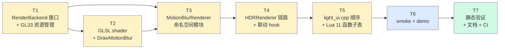
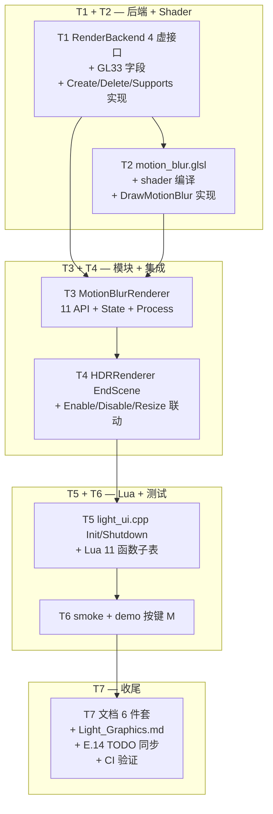

# Phase E.15 Velocity-driven Motion Blur — TASK 任务拆分

> **承接**：`DESIGN_PhaseE_15.md`（架构 + GLSL + 集成点已明确）
> **目标读者**：Automate 阶段实施者（按依赖顺序逐个执行）

---

## 任务总览

7 个原子任务，按依赖关系顺序执行。每个任务都有明确输入/输出契约 + 验收点。



**关键路径**：T1 → T2 → T3 → T4 → T5 → T6 → T7（无并行）。

---

## T1 — RenderBackend 4 虚接口 + GL33 资源管理

### 输入契约

- 前置依赖：无（基线 = main 分支 commit `d145566`）
- 输入数据：`render_backend.h` 现有结构、`gl33_backend.h/cpp` 现有 shader 编译框架
- 环境依赖：无（不依赖前序任务）

### 输出契约

#### 1. `render_backend.h` 新增 4 个虚接口

```cpp
// Phase E.15 — Motion Blur
virtual bool     SupportsMotionBlur() const { return false; }
virtual uint32_t CreateMotionBlurRT(int w, int h, uint32_t* outTex) {
    (void)w; (void)h; if (outTex) *outTex = 0; return 0;
}
virtual void     DeleteMotionBlurRT(uint32_t fbo, uint32_t tex) { (void)fbo; (void)tex; }
virtual void     DrawMotionBlur(uint32_t sceneTex, uint32_t velocityTex,
                                 uint32_t motionBlurFbo, uint32_t motionBlurTex,
                                 uint32_t dstFbo,
                                 int w, int h,
                                 float strength, int sampleCount) {
    (void)sceneTex; (void)velocityTex; (void)motionBlurFbo; (void)motionBlurTex;
    (void)dstFbo; (void)w; (void)h; (void)strength; (void)sampleCount;
}
```

#### 2. `gl33_backend.h` 新增字段

```cpp
GLuint motionBlurProgram_   = 0;
bool   motionBlurSupported_ = false;
// 注：fullscreenVao_ 复用现有
```

#### 3. `gl33_backend.cpp` 实现 `SupportsMotionBlur` / `CreateMotionBlurRT` / `DeleteMotionBlurRT`

- `SupportsMotionBlur` 返回 `motionBlurSupported_`
- `CreateMotionBlurRT` 创建 RGBA16F FBO + Tex（参考 `DESIGN §4.3`）
- `DeleteMotionBlurRT` 释放
- `Shutdown` 清理 `motionBlurProgram_`

`DrawMotionBlur` 留空 stub（T2 填充），但保证签名匹配。

### 实现约束

- **不改** Phase E.14 接口
- **不改** Legacy backend（默认实现自动 no-op）
- VS / FS 源代码字符串占位为 `// TODO T2`，shader 编译尝试可在 T2 之前先返回 false（编译跳过）

### 验收标准

- [ ] CMake 编译通过（C++ 层）
- [ ] `SupportsMotionBlur()` 返 false（无 shader）
- [ ] `CreateMotionBlurRT(0, 0, ...)` 返 0
- [ ] `CreateMotionBlurRT(640, 480, &tex)` 返非 0 fbo + 非 0 tex（用 ad-hoc 测试或先放 T6）

### 后置任务

- T2（DrawMotionBlur 实现 + shader）
- T3（MotionBlurRenderer 调 Create/DeleteMotionBlurRT）

---

## T2 — GLSL Shader + DrawMotionBlur 实现

### 输入契约

- 前置依赖：T1 完成（`motionBlurProgram_` 字段、`fullscreenVao_` 已在）
- 输入数据：`DESIGN §6` GLSL 全文 + `DESIGN §4.4` Pass1/Pass2 流程
- 环境依赖：`SSRTemporal` 已有的 GLES3/GL33 双 source 模式参考

### 输出契约

#### 1. `gl33_backend.cpp` 内 `motion_blur_vs_src` / `motion_blur_fs_src` 字符串常量

- VS：fullscreen 三角形（参考现有 `tonemap_vs_src` 或 `bloom_*_vs_src`）
- FS：完整实现 `DESIGN §6.2`，含：
  - `DecodeVelocity` + `SampleVelocityDilated` 复用
  - E3 软限 `kMaxBlurUV = 0.4243`
  - GL3.3 兼容的 const-bound for + early break

#### 2. `gl33_backend.cpp::Init` 编译 shader

```cpp
motionBlurProgram_ = CompileProgramFromSource(motion_blur_vs_src, motion_blur_fs_src);
motionBlurSupported_ = (motionBlurProgram_ != 0);
if (!motionBlurSupported_) CC::Log(CC::LOG_WARN, "...");
```

#### 3. `gl33_backend.cpp::DrawMotionBlur` 完整实现

- Pass1: bind motionBlurFbo → 绑 program → 上传 9 个 uniform → 全屏三角 draw
- Pass2: `glBlitFramebuffer(motionBlurFbo → dstFbo)` 或复用现有 blit shader
- 状态恢复：unbind FBO、glUseProgram(0)、active tex unit 复位

#### 4. `UploadMotionBlurUniforms` 辅助函数（私有 helper）

上传：`uSceneTex` (unit 0) / `uVelocityTex` (unit 1) / `uTexelSize` / `uStrength` / `uSampleCount` / `uVelocityFormat` / `uVelocityScale` / `uDilation`。

后 3 个从 `this->GetActiveVelocityFormat() / GetVelocityScale() / GetVelocityDilation()` 取。

### 实现约束

- shader 必须 **同时支持 GLES3 (`#version 300 es`) 和 GL3.3 (`#version 330 core`)**：参考 `ssr_temporal` shader 双 source 写法（运行时按 `IsGLES3()` 选择源）
- shader 编译失败 → `motionBlurSupported_=false`，不致命，仅 warn log
- `DrawMotionBlur` 先做 sanity check（`motionBlurSupported_` + 5 个 id 都非 0），任一为 0 → silent return
- Pass2 优先 `glBlitFramebuffer`（无 shader 开销）；如果尺寸 / 格式不兼容则回落 fullscreen blit shader

### 验收标准

- [ ] `motionBlurSupported_ == true` 在桌面 GL3.3 启动
- [ ] `DrawMotionBlur` 调用不崩溃（即便 mockup 输入也可能视觉错但无 GL error）
- [ ] `glGetError()` 在 Draw 前后无 error（用 RenderDoc / debug 日志验证）

### 后置任务

- T3（MotionBlurRenderer::Process 调 DrawMotionBlur）

---

## T3 — MotionBlurRenderer 命名空间模块

### 输入契约

- 前置依赖：T1 + T2 完成（backend 4 个接口可用）
- 输入数据：`DESIGN §5` 头文件骨架 + `DESIGN §9` 状态机
- 环境依赖：`HDRRenderer::GetVelocityTexture` 已有

### 输出契约

#### 1. 新文件 `ChocoLight/include/motion_blur_renderer.h`

完整命名空间声明（11 个 API + 4 个内部 hook + Init/Shutdown）。模板参考 `bloom_renderer.h`。

#### 2. 新文件 `ChocoLight/src/motion_blur_renderer.cpp`

- 内部 `State` struct：
  ```cpp
  struct State {
      RenderBackend* backend     = nullptr;
      bool           inited      = false;
      bool           supported   = false;
      bool           enabled     = false;
      bool           autoEnable  = false;     // 默认 false
      uint32_t       fbo         = 0;
      uint32_t       tex         = 0;
      int            width       = 0;
      int            height      = 0;
      float          strength    = 1.0f;       // [0, 4]
      int            sampleCount = 8;          // [1, 32]
  };
  ```

- 实现 11 个 namespace API + 4 个内部 hook：
  - `Init(backend)` / `Shutdown()`
  - `Enable(w, h)` / `Disable()` / `IsEnabled()` / `IsSupported()` / `Resize(w, h)`
  - `OnHDREnabled(w, h)` / `OnHDRDisabled()` / `OnHDRResized(w, h)`
  - `SetAutoEnable / GetAutoEnable`
  - `SetStrength` (clamp [0, 4]) / `GetStrength`
  - `SetSampleCount` (clamp [1, 32]) / `GetSampleCount`
  - `Process(hdrFbo, hdrTex)` 转发到 `backend->DrawMotionBlur(...)`

#### 3. 内部不做 GL 调用（纯壳模式）

所有 GL 操作通过 `backend->Create/Delete/DrawMotionBlur`。模块本身只管理 state。

### 实现约束

- 与 `BloomRenderer` 风格 1:1 对齐（Bloom 是最近的命名空间模块参考）
- Process 内防御 5 个值（`enabled / backend / hdrFbo / hdrTex / velocityTex`），任一无效 silent skip
- Enable 失败时清理半成品（参考 `BloomRenderer::Enable`）

### 验收标准

- [ ] 编译通过
- [ ] `Init` + `Enable(640, 480)` + `IsEnabled() == true` + `Disable` + `Shutdown` 流畅完成
- [ ] `SetStrength(-1) / SetStrength(99)` 后 `GetStrength() ∈ [0, 4]`
- [ ] `SetSampleCount(0) / SetSampleCount(99)` 后 `GetSampleCount() ∈ [1, 32]`

### 后置任务

- T4（HDR 链路 + 联动 hook）

---

## T4 — HDRRenderer 链路集成 + 联动 hook

### 输入契约

- 前置依赖：T3 完成（MotionBlurRenderer 全 API 可用）
- 输入数据：`DESIGN §8.2 / §8.3` 集成点

### 输出契约

#### 1. `hdr_renderer.cpp` 顶部 `#include "motion_blur_renderer.h"`

#### 2. `EndScene` 加 1 行（在 `LensFlareRenderer::Process` 之后、`DrawTonemapFullscreen` 之前）

```cpp
LensFlareRenderer::Process(g.fbo, g.sceneTex);

// ★ Phase E.15 — Motion Blur (LensFlare 之后, Tonemap 之前)
MotionBlurRenderer::Process(g.fbo, g.sceneTex);

g.backend->DrawTonemapFullscreen(g.sceneTex, exposure, g.gamma, g.tonemap);
```

#### 3. `Enable` 末尾加 1 行（在 `SSRRenderer::OnHDREnabled` 之后）

```cpp
SSRRenderer::OnHDREnabled(w, h);
MotionBlurRenderer::OnHDREnabled(w, h);  // ★ Phase E.15
```

#### 4. `Disable` 头部加 1 行（在 `SSRRenderer::OnHDRDisabled` 之前）

```cpp
MotionBlurRenderer::OnHDRDisabled();      // ★ Phase E.15
SSRRenderer::OnHDRDisabled();
```

#### 5. `Resize` 加 1 行（在 `SSRRenderer::OnHDRResized` 之后）

```cpp
SSRRenderer::OnHDRResized(w, h);
MotionBlurRenderer::OnHDRResized(w, h);   // ★ Phase E.15
```

### 实现约束

- 顺序严格：MotionBlur 在 LensFlare **之后**，Tonemap **之前**
- Init/Disable 顺序对称（先关后开 / 后建先释放）
- 不动其他后处理 module 顺序

### 验收标准

- [ ] 编译通过
- [ ] HDR.Disable 时 MotionBlur 也被关闭（`MotionBlur.IsEnabled() == false`）
- [ ] HDR.Resize 时 MotionBlur RT 跟随重建

### 后置任务

- T5（light_ui.cpp 顺序 + Lua binding）

---

## T5 — light_ui.cpp 顺序 + Lua 11 函数子表

### 输入契约

- 前置依赖：T4 完成（HDR 链路已工作）
- 输入数据：`DESIGN §7` Lua API + `DESIGN §8.1` Init/Shutdown 顺序

### 输出契约

#### 1. `light_ui.cpp` Init 加 1 行

```cpp
SSRRenderer::Init(g_render);
MotionBlurRenderer::Init(g_render);   // ★ Phase E.15
```

#### 2. `light_ui.cpp` Shutdown 加 1 行（反序）

```cpp
MotionBlurRenderer::Shutdown();        // ★ Phase E.15
SSRRenderer::Shutdown();
```

#### 3. `light_graphics.cpp` 顶部 `#include "motion_blur_renderer.h"`

#### 4. `light_graphics.cpp` 新增 11 个 `l_MB_*` 静态函数

参考 `l_Bloom_*` 风格。具体：

| Lua 函数 | C++ 实现要点 |
|----------|-------------|
| `Enable(w, h)` | `luaL_checkinteger × 2` → `pushboolean` |
| `Disable()` | 直接调 + return 0 |
| `IsEnabled()` | `pushboolean` |
| `IsSupported()` | `pushboolean` |
| `Resize(w, h)` | 同 Enable |
| `SetAutoEnable(flag)` | `luaL_checkany + lua_toboolean` |
| `GetAutoEnable()` | `pushboolean` |
| `SetStrength(v)` | `luaL_checknumber` → `(float)v` |
| `GetStrength()` | `pushnumber` |
| `SetSampleCount(n)` | `luaL_checkinteger` → `(int)n` |
| `GetSampleCount()` | `pushinteger` |

#### 5. 新增 `mb_funcs[]` luaL_Reg 表（11 项）

#### 6. 在 `luaopen_Light_Graphics` 末尾（LensFlare 子表注册之后）注册 MotionBlur 子表

参考 LensFlare 子表注册位置 + 风格。

### 实现约束

- 错误约定：`luaL_check*` 类型错让 Lua 抛错（与 Bloom 一致），不引入 nil+err 复杂返回
- `SetStrength` / `SetSampleCount` 不在 Lua 层 clamp，让 C++ 层 clamp（逻辑集中）

### 验收标准

- [ ] 编译通过
- [ ] `Light.Graphics.MotionBlur` 类型为 `table`
- [ ] 11 个函数全部 `type(...) == "function"`
- [ ] 默认值 round-trip（`GetAutoEnable()=false / GetStrength()=1.0 / GetSampleCount()=8`）

### 后置任务

- T6（smoke + demo）

---

## T6 — Smoke 用例 + Demo 按键集成

### 输入契约

- 前置依赖：T5 完成（Lua 子表全部可调）
- 输入数据：`DESIGN §10` 测试策略

### 输出契约

#### 1. 新文件 `scripts/smoke/motion_blur.lua`

完整覆盖（参考 `hdr.lua` Phase E.14 §8 风格）：

```
§1 子表存在性
§2 11 个函数表面 (assert all are functions)
§3 默认值 round-trip
§4 Enable/Disable cycle (含 IsSupported 检查)
§5 Set*/Get* round-trip
§6 clamp 行为 (strength + sampleCount 越界)
```

测试程序结构与 `hdr.lua` 完全一致，包括 `__SMOKE_OK__ / __SMOKE_FAIL__` 计数 + 末尾 `print` 总结。

#### 2. `samples/demo_ssr/main.lua` 改造

- 新按键 **M**：toggle `Light.Graphics.MotionBlur.Enable / Disable`
  - 第一次按时如果 HDR 未启用，先 print warn 不动
  - 切换后调 `Light.Graphics.MotionBlur.IsEnabled` 同步本地状态
- HUD 行追加（在 K/L 行之后）：
  ```
  MotionBlur: ON | strength=1.00 | samples=8
  MotionBlur: OFF
  ```
- 不破坏现有 K/L 按键功能

### 实现约束

- smoke 总文件 ≤ 100 行（参考 hdr.lua §8 ~50 行的密度）
- demo 改动局部，不修改原有 SSR / HDR 流程

### 验收标准

- [ ] `lightc -p scripts/smoke/motion_blur.lua` 0 错误
- [ ] `lightc -p samples/demo_ssr/main.lua` 0 错误
- [ ] CI runtime smoke `motion_blur.lua` 0 fail（执行后产生 `__SMOKE_OK__` 计数）

### 后置任务

- T7（静态验证 + 文档 + CI）

---

## T7 — 静态验证 + 6 件套文档 + CI

### 输入契约

- 前置依赖：T1 ~ T6 全部完成
- 输入数据：所有改动已就绪

### 输出契约

#### 1. 静态验证

- `lightc -p` 全部 lua 文件 0 错误
- 本地 `git diff --check` 无空白错误

#### 2. 6 件套文档

| 文档 | 状态 |
|------|------|
| `ALIGNMENT_PhaseE_15.md` | ✅ 已写 |
| `DESIGN_PhaseE_15.md` | ✅ 已写 |
| `TASK_PhaseE_15.md` | ✅ 当前文件 |
| `ACCEPTANCE_PhaseE_15.md` | ⏳ T7 写 |
| `FINAL_PhaseE_15.md` | ⏳ T7 写 |
| `TODO_PhaseE_15.md` | ⏳ T7 写 |

#### 3. 同步更新 `docs/api/Light_Graphics.md`

追加 `Light.Graphics.MotionBlur` 子表段（11 个 API 中文文档，参考 Phase E.14 HDR 子表段风格）。

#### 4. 同步更新 `docs/Phase E.14 Velocity Dilation RG8/TODO_PhaseE_14.md`

§3 后续候选清单中标记 "velocity-driven motion blur" → Phase E.15 已完成。

#### 5. Commit + Push

- Commit message：`feat: add Phase E.15 velocity-driven motion blur (per-pixel linear, 11 fn Lua API)`
- Push 触发 GitHub Actions CI（6 平台 build + Windows runtime smoke）

#### 6. CI 监控

- 等 CI 完成后回归确认 6/6 success
- 失败则修复后再 push

### 验收标准

- [ ] CI run 6/6 success
- [ ] Windows runtime smoke 0 fail（含 `motion_blur.lua`）
- [ ] 4 个 Phase E.14/15 docs 4 件套就位
- [ ] `Light_Graphics.md` MotionBlur 段 11 函数齐全

### 后置任务

- 无（关闭 phase；用户做真机视觉验收）

---

## 依赖图（详细）



---

## 风险与缓解（任务级）

| 风险 | 影响任务 | 缓解 |
|------|---------|------|
| GLES3 / GL33 双 source 兼容性 | T2 | 完整复用 SSRTemporal 的双 source 模式（已验证可行） |
| `glBlitFramebuffer` 在某些驱动上对 RGBA16F 不支持 | T2 Pass2 | 备用方案：fullscreen blit shader（成本 +0.1ms） |
| `motionBlurFbo` 创建失败（极端 OOM） | T1 / T3 | Enable 返 false + warn log，进 Disabled 状态 |
| Phase E.14 dilation/format 切换在 Process 里没正确同步 | T2 / T3 | DrawMotionBlur 内每次都从 `backend->Get*` 取最新值 |
| HDR 未 Enable 但 MotionBlur Enable 调用 | T3 | Process 内 hdrTex == 0 防御 silent skip |
| Lua 子表注册位置错误（覆盖现有） | T5 | 在 LensFlare 之后追加，参考现有顺序 |
| smoke 失败但 CI 不捕获 | T6 / T7 | smoke 末尾 `assert(__SMOKE_FAIL__ == 0, ...)` 让 lua 退出码非 0 |

---

## 进度追踪（Automate 阶段更新）

| Task | 状态 | 备注 |
|------|------|------|
| T1 | ⏳ pending | RenderBackend 4 接口 + GL33 资源管理 |
| T2 | ⏳ pending | shader + DrawMotionBlur |
| T3 | ⏳ pending | MotionBlurRenderer 命名空间 |
| T4 | ⏳ pending | HDR 链路 + 联动 |
| T5 | ⏳ pending | light_ui + Lua 11 函数 |
| T6 | ⏳ pending | smoke + demo |
| T7 | ⏳ pending | 文档 + CI |

→ 进入 Approve 阶段，确认拍板后开始 Automate。
