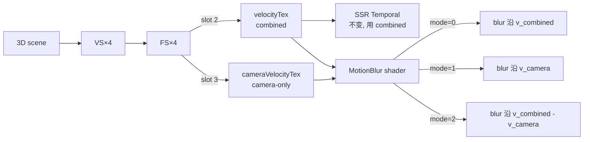
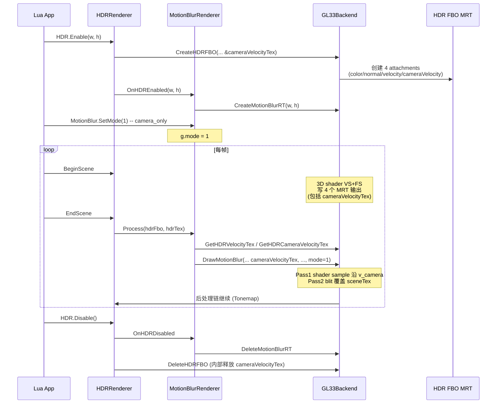

# Phase E.16 Camera-only Motion Blur — DESIGN

> 6A 工作流 · 阶段 2 · Architect
> 拍板基线：ALIGNMENT_PhaseE_16.md A1 双 RT 方案

---

## 1. 概览

### 1.1 数学推导

设 `pos` 为顶点 model-space 位置：

```
curWorldPos     = curM × pos                                    // 当前世界位置
prevWorldPos    = prevM × pos                                   // 上一帧世界位置
curClip         = curVP × curWorldPos       = curMVP × pos      // 已有 (gl_Position)
prevClip        = prevVP × prevWorldPos     = prevVP × prevM × pos  // 已有 (combined)
prevClipCamera  = prevVP × curWorldPos      = prevVP × curM × pos   // ★ 新增 (camera-only)

v_combined = (curClip.xy/w − prevClip.xy/w)        ← 已有 FragVelocity (slot 2)
v_camera   = (curClip.xy/w − prevClipCamera.xy/w)  ← ★ 新增 FragCameraVelocity (slot 3)
v_object   = v_combined − v_camera                  ← shader 内做减法（mode=2）
```

### 1.2 RT 拓扑（Phase E.16 后）

```
HDR FBO (单 FBO，5 attachments)
  ├ COLOR_ATTACHMENT0 (RGBA16F) sceneTex          ← Phase E.3
  ├ COLOR_ATTACHMENT1 (RG16F)   normalTex         ← Phase E.8
  ├ COLOR_ATTACHMENT2 (RG/RG16F or RG8) velocityTex          ← Phase E.13/14 (combined)
  ├ COLOR_ATTACHMENT3 (RG/RG16F or RG8) cameraVelocityTex    ← ★ Phase E.16 (camera-only)
  └ DEPTH_ATTACHMENT  (Depth24 RBO)

GL_MAX_DRAW_BUFFERS 标准最低 ≥ 8 (GL3.3 / GLES3.0)，4 远在范围内。
```

### 1.3 数据流（mode 切换）



---

## 2. RenderBackend 接口扩展（`render_backend.h`）

### 2.1 CreateHDRFBO 签名扩展

**改动策略**：追加 1 个尾部参数 `outCameraVelocityTex`，默认 `nullptr`。所有调用处仅 HDRRenderer 一处，且会一起改。

```cpp
/// Phase E.16: outCameraVelocityTex (可选) - camera-only velocity (slot 3)
///   传 nullptr = 不创建 (零回归)
///   非 nullptr = 与 outVelocityTex 同格式同尺寸，存 v_camera
virtual uint32_t CreateHDRFBO(int w, int h,
                               uint32_t* outTex,
                               uint32_t* outNormalTex = nullptr,
                               uint32_t* outVelocityTex = nullptr,
                               VelocityFormat velocityFormat = VelocityFormat::RG16F,
                               uint32_t* outCameraVelocityTex = nullptr) = 0;
```

### 2.2 新增查询接口

```cpp
/// Phase E.16 — 查询 HDR FBO 关联的 cameraVelocityTex (slot 3)
/// 不存在时返回 0 (HDRRenderer 用 ResetVelocityHistory 联动)
virtual uint32_t GetHDRCameraVelocityTex(uint32_t /*fbo*/) const { return 0; }
```

### 2.3 DrawMotionBlur 签名扩展

```cpp
/// Phase E.16: + cameraVelocityTex (mode=1/2 用), + mode (0/1/2)
virtual void DrawMotionBlur(uint32_t sceneTex,
                            uint32_t velocityTex,                  // combined (mode=0/2 用)
                            uint32_t cameraVelocityTex,            // ★ E.16: camera-only (mode=1/2 用; 0 时忽略)
                            uint32_t motionBlurFbo,
                            uint32_t motionBlurTex,
                            uint32_t dstFbo,
                            int w, int h,
                            float strength, int sampleCount,
                            int mode) = 0;                          // ★ E.16: 0=combined, 1=camera, 2=object
```

### 2.4 DeleteHDRFBO 不变

`hdrFboCameraVelocityTex` map 在 GL33Backend 内部维护，DeleteHDRFBO 内部查询并释放（与 `hdrFboVelocityTex` 模式相同），接口签名零变化。

---

## 3. GL33Backend 实现（`render_gl33.cpp`）

### 3.1 字段新增

```cpp
// Phase E.16 — camera-only velocity tex (slot 3 of HDR FBO MRT)
std::unordered_map<uint32_t, uint32_t> hdrFboCameraVelocityTex;

// Phase E.15 → E.16 扩展: 多 1 个 sampler + 1 个 mode uniform
GLint locMB_CameraVelocityTex = -1;     // ★ E.16
GLint locMB_Mode              = -1;     // ★ E.16
```

### 3.2 CreateHDRFBO 实现扩展

```cpp
uint32_t CreateHDRFBO(int w, int h, uint32_t* outTex,
                      uint32_t* outNormalTex,
                      uint32_t* outVelocityTex,
                      VelocityFormat velocityFormat,
                      uint32_t* outCameraVelocityTex) override {
    // ... 现有逻辑（创建 colorTex, normalTex, velocityTex, depthRB） ...

    // ★ Phase E.16: cameraVelocityTex (与 velocityTex 同格式同尺寸)
    GLuint cameraVelocityTex = 0;
    if (outCameraVelocityTex) {
        glGenTextures(1, &cameraVelocityTex);
        if (!cameraVelocityTex) { /* 回滚释放 + return 0 */ }
        glBindTexture(GL_TEXTURE_2D, cameraVelocityTex);
        if (velocityFormat == VelocityFormat::RG8) {
            glTexImage2D(GL_TEXTURE_2D, 0, GL_RG8, w, h, 0, GL_RG, GL_UNSIGNED_BYTE, nullptr);
        } else {
            glTexImage2D(GL_TEXTURE_2D, 0, GL_RG16F, w, h, 0, GL_RG, GL_FLOAT, nullptr);
        }
        // 同 velocityTex 的 NEAREST + CLAMP_TO_EDGE 设置
        // ...
    }

    // FBO attach + drawBuffers 调整
    if (cameraVelocityTex) {
        glFramebufferTexture2D(GL_FRAMEBUFFER, GL_COLOR_ATTACHMENT3,
                                GL_TEXTURE_2D, cameraVelocityTex, 0);
    }

    // drawBuffers 矩阵: 4 个 attachments 时
    if (normalTex && velocityTex && cameraVelocityTex) {
        const GLenum drawBufs[4] = {
            GL_COLOR_ATTACHMENT0, GL_COLOR_ATTACHMENT1,
            GL_COLOR_ATTACHMENT2, GL_COLOR_ATTACHMENT3
        };
        glDrawBuffers(4, drawBufs);
    }
    // 其他组合保持现状（cameraVelocityTex 必须搭配 velocityTex；
    // HDRRenderer 总是同时请求或同时不请求）

    // 记录 map
    if (cameraVelocityTex) {
        hdrFboCameraVelocityTex[fbo] = cameraVelocityTex;
        *outCameraVelocityTex = cameraVelocityTex;
    }
    // ... 现有 return 逻辑 ...
}
```

### 3.3 DeleteHDRFBO 联动

```cpp
auto itCV = hdrFboCameraVelocityTex.find(fbo);
if (itCV != hdrFboCameraVelocityTex.end()) {
    GLuint t = itCV->second;
    if (t) glDeleteTextures(1, &t);
    hdrFboCameraVelocityTex.erase(itCV);
}
```

### 3.4 GetHDRCameraVelocityTex

```cpp
uint32_t GetHDRCameraVelocityTex(uint32_t fbo) const override {
    auto it = hdrFboCameraVelocityTex.find(fbo);
    return (it != hdrFboCameraVelocityTex.end()) ? it->second : 0;
}
```

---

## 4. 3D Shader 改动（VS×4 + FS×4，GLES3 + GL33 双 source = 16 处）

### 4.1 VS 改动模式（unlit / PBR / skin / morph）

每个 VS 加 1 个 varying + 1 行计算：

**示例：unlit VS（GLES3 版本）**

```glsl
// ... 现有 in / uniform / out ...
out vec4 vCurClip;
out vec4 vPrevClip;
out vec4 vPrevClipCameraOnly;  // ★ Phase E.16

void main() {
    // ... 现有逻辑 ...
    vCurClip            = gl_Position;                                    // = uMVP × pos
    vPrevClip           = uPrevViewProj * (uPrevModel * vec4(aPos, 1.0)); // 已有
    vPrevClipCameraOnly = uPrevViewProj * (uModel    * vec4(aPos, 1.0)); // ★ 新增
}
```

**Skin VS / Morph VS**：vPrevClipCameraOnly 用「**当前** joints 蒙皮后的位置」，与 vPrevClip 用「**上一帧** joints 蒙皮后的位置」对应：

```glsl
// skin VS: 在 prevSkinnedPos 计算之外，复用 curSkinnedPos (=经 uJointMats 蒙皮的 pos)
vec4 curSkinnedPos = /* 已计算用于 gl_Position 的位置 */;
vec4 prevSkinnedPos = /* 已计算用于 vPrevClip 的位置 */;
vCurClip            = gl_Position;
vPrevClip           = uPrevViewProj * (uPrevModel * prevSkinnedPos);
vPrevClipCameraOnly = uPrevViewProj * (uModel    * curSkinnedPos);   // ★ 用 cur joints
```

**关键点**：camera-only 路径假设「物体没动」→ 用 cur model + cur joints；只有 viewProj 切到 prev。

### 4.2 FS 改动模式（unlit / PBR / skin / morph）

每个 FS 加 1 个 layout output + 1 段 encode：

```glsl
in vec4 vCurClip;
in vec4 vPrevClip;
in vec4 vPrevClipCameraOnly;  // ★

layout(location=0) out vec4 FragColor;
layout(location=1) out vec2 FragNormal;
layout(location=2) out vec2 FragVelocity;
layout(location=3) out vec2 FragCameraVelocity;  // ★ Phase E.16

void main() {
    // ... 现有 base color / lighting / normal 输出 ...

    if (uHasVelocityHistory == 1) {
        // 已有: combined velocity
        vec2 curUV  = vCurClip.xy  / max(vCurClip.w,  1e-6) * 0.5 + 0.5;
        vec2 prevUV = vPrevClip.xy / max(vPrevClip.w, 1e-6) * 0.5 + 0.5;
        vec2 raw    = curUV - prevUV;
        FragVelocity = (uVelocityFormat == 1)
            ? clamp(raw / (2.0 * uVelocityScale) + 0.5, 0.0, 1.0)
            : raw;

        // ★ Phase E.16: camera-only velocity
        vec2 prevUVCam = vPrevClipCameraOnly.xy / max(vPrevClipCameraOnly.w, 1e-6) * 0.5 + 0.5;
        vec2 rawCam    = curUV - prevUVCam;
        FragCameraVelocity = (uVelocityFormat == 1)
            ? clamp(rawCam / (2.0 * uVelocityScale) + 0.5, 0.0, 1.0)
            : rawCam;
    } else {
        FragVelocity       = (uVelocityFormat == 1) ? vec2(0.5) : vec2(0.0);
        FragCameraVelocity = (uVelocityFormat == 1) ? vec2(0.5) : vec2(0.0);
    }
}
```

**改动量**：每 FS +6 行（1 layout + 5 行 if/else 内的 encode），共 8 个 FS 一致改。

### 4.3 改动文件位置（已 grep 锁定）

| Shader | GLES3 行号 | GL33 行号 |
|--------|-----------|----------|
| VS_UNLIT3D     | ~120-145 | ~470-500 |
| VS_PBR3D       | ~150-195 | ~500-545 |
| VS_UNLIT3D_SKIN| ~200-270 | ~550-615 |
| VS_PBR3D_SKIN  | ~200-270 | ~550-615 |
| FS_UNLIT3D     | ~280-320 | ~630-670 |
| FS_PBR3D       | ~360-470 | ~700-815 |

实际改动定位精确到 `FragVelocity` 和 `vPrevClip` 行就近插入。

---

## 5. UploadVelocityUniforms（无需扩展）

现有 uniform 已经满足：
- `uPrevViewProj` ✓
- `uPrevModel` ✓ (combined 路径用)
- `uModel` ✓ (camera-only 路径用，已有)
- `uMVP` ✓ (gl_Position 用，已有)

**结论**：`render_gl33.cpp:2889-2908 UploadVelocityUniforms` **不需改动**。Phase E.16 完全在 shader 端实现，CPU 上传 0 增量。

---

## 6. MotionBlur Shader 扩展（FS_MOTION_BLUR_SOURCE，GLES3 + GL33 双 source）

### 6.1 完整新版本（GLES3 示例）

```glsl
#version 300 es
precision highp float;
precision highp sampler2D;
in  vec2 vUV;
out vec4 FragColor;

uniform sampler2D uSceneTex;
uniform sampler2D uVelocityTex;          // combined
uniform sampler2D uCameraVelocityTex;    // ★ Phase E.16: camera-only
uniform vec2  uTexel;
uniform float uStrength;
uniform int   uSampleCount;
uniform int   uVelocityDilation;
uniform int   uVelocityFormat;
uniform float uVelocityScale;
uniform int   uMode;                     // ★ 0=combined, 1=camera, 2=object

vec2 DecodeVelocity(vec2 raw) {
    return (uVelocityFormat == 1) ? ((raw - 0.5) * (2.0 * uVelocityScale)) : raw;
}

// 通用 dilated sampler，传入纹理参数（指针不行，直接 inline 或宏化）
// GLSL 不支持 sampler 作函数参数（GLES3 受限），用 #define 宏复制 2 套：
vec2 SampleVelocityDilated(vec2 uv) {
    if (uVelocityDilation == 0) return DecodeVelocity(texture(uVelocityTex, uv).rg);
    vec2 bestV = vec2(0.0);
    float bestLen = -1.0;
    for (int dy = -1; dy <= 1; ++dy) {
        for (int dx = -1; dx <= 1; ++dx) {
            vec2 v = DecodeVelocity(texture(uVelocityTex, uv + vec2(float(dx), float(dy)) * uTexel).rg);
            float l = dot(v, v);
            if (l > bestLen) { bestLen = l; bestV = v; }
        }
    }
    return bestV;
}

vec2 SampleCameraVelocityDilated(vec2 uv) {
    if (uVelocityDilation == 0) return DecodeVelocity(texture(uCameraVelocityTex, uv).rg);
    vec2 bestV = vec2(0.0);
    float bestLen = -1.0;
    for (int dy = -1; dy <= 1; ++dy) {
        for (int dx = -1; dx <= 1; ++dx) {
            vec2 v = DecodeVelocity(texture(uCameraVelocityTex, uv + vec2(float(dx), float(dy)) * uTexel).rg);
            float l = dot(v, v);
            if (l > bestLen) { bestLen = l; bestV = v; }
        }
    }
    return bestV;
}

void main() {
    // Phase E.16: 按 mode 选 velocity source
    vec2 vel;
    if (uMode == 0) {
        vel = SampleVelocityDilated(vUV);                     // combined
    } else if (uMode == 1) {
        vel = SampleCameraVelocityDilated(vUV);               // camera-only
    } else {
        vel = SampleVelocityDilated(vUV) - SampleCameraVelocityDilated(vUV);  // object-only
    }
    vel *= uStrength;

    // E3 软限（不变）
    const float kMaxBlurUV = 0.4243;
    float velLen = length(vel);
    if (velLen > kMaxBlurUV) vel *= (kMaxBlurUV / velLen);

    int   count    = clamp(uSampleCount, 1, 32);
    float countInv = 1.0 / float(max(count - 1, 1));
    vec3  sum      = vec3(0.0);
    const int kMaxSamples = 32;
    for (int i = 0; i < kMaxSamples; ++i) {
        if (i >= count) break;
        float t  = float(i) * countInv;
        vec2  uv = vUV - vel * t;
        sum += texture(uSceneTex, uv).rgb;
    }
    FragColor = vec4(sum / float(count), 1.0);
}
```

GL33 版本与 GLES3 完全一致（去掉 precision 标）。

### 6.2 性能开销

| 项 | mode=0 | mode=1 | mode=2 |
|---|--------|--------|--------|
| velocity 采样次数（dilation ON） | 9 | 9 | **18** |
| 性能 vs Phase E.15 | 100% | 100% | **~110%**（多 1 套 9-tap 邻域） |

**预算**：mode=2 时多约 0.05 ms @ 1080p（dilation 9-tap × 1 次额外采样）。可接受。

### 6.3 mode=2 优化路径（备选，不在本期）

可在 dilation 函数里内联两个 sampler 同时取，省 1 次循环。本期先用直观写法，等性能数据再决定。

---

## 7. DrawMotionBlur 实现扩展

### 7.1 GL33 实现（render_gl33.cpp ~6294-6399 区段扩展）

```cpp
void DrawMotionBlur(uint32_t sceneTex, uint32_t velocityTex,
                    uint32_t cameraVelocityTex,  // ★ E.16
                    uint32_t motionBlurFbo, uint32_t motionBlurTex,
                    uint32_t dstFbo,
                    int w, int h,
                    float strength, int sampleCount,
                    int mode) override {  // ★ E.16
    if (!motionBlurSupported || !programMotionBlur || !sceneTex
        || !velocityTex || !motionBlurFbo || !motionBlurTex || !dstFbo
        || w <= 0 || h <= 0) return;

    // mode=1/2 但 cameraVelocityTex 缺失 → silent fallback combined (mode=0)
    int safeMode = mode;
    if ((mode == 1 || mode == 2) && cameraVelocityTex == 0) {
        safeMode = 0;
    }

    // Pass1: shader 写 motionBlurTex
    glBindFramebuffer(GL_FRAMEBUFFER, (GLuint)motionBlurFbo);
    glViewport(0, 0, w, h);
    glDisable(GL_DEPTH_TEST);
    glDisable(GL_BLEND);
    glDisable(GL_CULL_FACE);

    glUseProgram(programMotionBlur);
    if (locMB_Texel    >= 0) glUniform2f(locMB_Texel, 1.0f / w, 1.0f / h);
    if (locMB_Strength >= 0) glUniform1f(locMB_Strength, strength);
    if (locMB_SampleCount >= 0) glUniform1i(locMB_SampleCount, sampleCount);
    if (locMB_VelocityDilation >= 0) glUniform1i(locMB_VelocityDilation, velocityDilation_ ? 1 : 0);
    if (locMB_VelocityFormat   >= 0) glUniform1i(locMB_VelocityFormat,
        (activeVelocityFormat_ == VelocityFormat::RG8) ? 1 : 0);
    if (locMB_VelocityScale    >= 0) glUniform1f(locMB_VelocityScale, kVelocityScaleDefault);
    if (locMB_Mode             >= 0) glUniform1i(locMB_Mode, safeMode);  // ★ E.16

    glActiveTexture(GL_TEXTURE0);
    glBindTexture(GL_TEXTURE_2D, (GLuint)sceneTex);
    glActiveTexture(GL_TEXTURE1);
    glBindTexture(GL_TEXTURE_2D, (GLuint)velocityTex);
    // ★ E.16: slot 2 = cameraVelocityTex (mode=0 时 driver 仍要求有效绑定)
    glActiveTexture(GL_TEXTURE2);
    glBindTexture(GL_TEXTURE_2D,
        cameraVelocityTex ? (GLuint)cameraVelocityTex : (GLuint)velocityTex);  // 占位

    glBindVertexArray(vaoTonemap);
    glDrawArrays(GL_TRIANGLES, 0, 6);
    glBindVertexArray(0);

    // 解绑
    glActiveTexture(GL_TEXTURE2); glBindTexture(GL_TEXTURE_2D, 0);
    glActiveTexture(GL_TEXTURE1); glBindTexture(GL_TEXTURE_2D, 0);
    glActiveTexture(GL_TEXTURE0); glBindTexture(GL_TEXTURE_2D, 0);
    glUseProgram(0);

    // Pass2: blit motionBlurTex → dstFbo (覆盖 sceneTex)
    // ... 现有 glBlitFramebuffer 逻辑不变 ...
}
```

### 7.2 sampler binding 注意事项

- slot 0: sceneTex
- slot 1: velocityTex (combined)
- **slot 2: cameraVelocityTex** ★ E.16（mode=0 时仍需有效绑定，driver 不允许空 sampler，回退绑 velocityTex 占位）

需要在 Init 时 setup uniform sampler 默认 unit:
```cpp
glUseProgram(programMotionBlur);
glUniform1i(locMB_SceneTex,           0);
glUniform1i(locMB_VelocityTex,        1);
glUniform1i(locMB_CameraVelocityTex,  2);  // ★ E.16
glUseProgram(0);
```

---

## 8. MotionBlurRenderer 扩展（`motion_blur_renderer.cpp`）

### 8.1 State 字段新增

```cpp
struct State {
    // ... 现有字段 ...
    int mode = 0;  // ★ Phase E.16: 0=combined, 1=camera_only, 2=object_only
};
```

### 8.2 Process 调用扩展

```cpp
void Process(uint32_t hdrFbo, uint32_t hdrTex) {
    if (!g.enabled || !g.backend || !hdrFbo || !hdrTex) return;
    if (!g.fbo || !g.tex) return;

    uint32_t velocityTex       = g.backend->GetHDRVelocityTex(hdrFbo);
    uint32_t cameraVelocityTex = g.backend->GetHDRCameraVelocityTex(hdrFbo);  // ★ E.16
    if (!velocityTex) return;

    g.backend->DrawMotionBlur(hdrTex, velocityTex,
                              cameraVelocityTex,                  // ★
                              g.fbo, g.tex, hdrFbo,
                              g.backend->GetCurrentRTW(),         // 既有用法
                              g.backend->GetCurrentRTH(),
                              g.strength, g.sampleCount,
                              g.mode);                            // ★
}
```

### 8.3 SetMode / GetMode

```cpp
void SetMode(int m) { g.mode = (m < 0) ? 0 : (m > 2 ? 2 : m); }
int  GetMode()       { return g.mode; }
```

clamp 到 `[0, 2]`，超界静默饱和（与 `SetSampleCount` clamp 一致）。

---

## 9. HDRRenderer 集成（`hdr_renderer.cpp`）

### 9.1 State 扩展（如需缓存 cameraVelocityTex id 给查询）

实际上不需要额外字段 — backend 内部 map 已经管理。HDRRenderer 只需在 `CreateRT` 调用时多传一个 outCameraVelocityTex 指针。

```cpp
bool CreateRT(int w, int h) {
    if (!g.backend) return false;
    if (w <= 0 || h <= 0) return false;
    uint32_t tex = 0, normalTex = 0, velocityTex = 0;
    uint32_t cameraVelocityTex = 0;  // ★ E.16
    uint32_t fbo = g.backend->CreateHDRFBO(w, h, &tex, &normalTex, &velocityTex,
                                            g.velocityFormat,
                                            &cameraVelocityTex);  // ★
    if (!fbo || !tex) {
        if (fbo || tex) g.backend->DeleteHDRFBO(fbo, tex);
        return false;
    }
    g.fbo = fbo;
    g.sceneTex = tex;
    g.width = w;
    g.height = h;
    g.backend->ResetVelocityHistory();
    g.backend->SetVelocityDilation(g.velocityDilation);
    return true;
}
```

### 9.2 EndScene 不变

MotionBlurRenderer::Process 内部自己取 cameraVelocityTex，HDRRenderer 不需感知。

---

## 10. Lua API 扩展（`light_graphics.cpp`）

### 10.1 新增 2 个绑定

```cpp
/// @lua_api Light.Graphics.MotionBlur.SetMode
/// @param m integer 0=combined, 1=camera_only, 2=object_only (clamp [0, 2])
static int l_MB_SetMode(lua_State* L) {
    MotionBlurRenderer::SetMode((int)luaL_checkinteger(L, 1));
    return 0;
}

static int l_MB_GetMode(lua_State* L) {
    lua_pushinteger(L, (lua_Integer)MotionBlurRenderer::GetMode());
    return 1;
}
```

### 10.2 mb_funcs[] 注册新增 2 项

```cpp
static const luaL_Reg mb_funcs[] = {
    // ... 现有 11 项 ...
    // Phase E.16 — mode (1 对)
    {"SetMode", l_MB_SetMode},
    {"GetMode", l_MB_GetMode},
    {NULL, NULL}
};
```

API 总数 11 → 13。

---

## 11. smoke 测试增量（`scripts/smoke/motion_blur.lua`）

### 11.1 新增段（在「Set/Get round-trip」之后插入）

```lua
-- ============================================================
-- 7) Mode round-trip + clamp (Phase E.16)
-- ============================================================

-- 默认 mode = 0
local mode0 = MB.GetMode()
if math.floor(mode0 + 0.5) ~= 0 then
    fail("Default GetMode() must be 0 (combined), got " .. tostring(mode0))
end
pass("GetMode() default = 0 (combined)")

-- round-trip 1, 2
MB.SetMode(1)
if math.floor(MB.GetMode() + 0.5) ~= 1 then
    fail("SetMode(1) round-trip failed")
end
MB.SetMode(2)
if math.floor(MB.GetMode() + 0.5) ~= 2 then
    fail("SetMode(2) round-trip failed")
end
pass("SetMode / GetMode round-trip ok (1, 2)")

-- clamp 下界
MB.SetMode(-1)
if math.floor(MB.GetMode() + 0.5) ~= 0 then
    fail("SetMode(-1) should clamp to 0, got " .. tostring(MB.GetMode()))
end
pass("SetMode clamp lower bound (0)")

-- clamp 上界
MB.SetMode(99)
if math.floor(MB.GetMode() + 0.5) ~= 2 then
    fail("SetMode(99) should clamp to 2, got " .. tostring(MB.GetMode()))
end
pass("SetMode clamp upper bound (2)")

MB.SetMode(0)  -- 复位
```

surface check 段也要更新 fn_names：
```lua
local fn_names = {
    "Enable", "Disable", "IsEnabled", "IsSupported", "Resize",
    "SetAutoEnable", "GetAutoEnable",
    "SetStrength", "GetStrength",
    "SetSampleCount", "GetSampleCount",
    "SetMode", "GetMode",  -- ★ Phase E.16
}
```

API 总数 surface check 11 → 13，期望 PASS 行更新。

---

## 12. demo 增量（`samples/demo_ssr/main.lua`）

### 12.1 N 键切换 mode

```lua
-- Phase E.16 — N: 循环切 mode (combined → camera_only → object_only → combined)
if MotionBlur and keyTap('n') then
    local cur = MotionBlur.GetMode()
    local nxt = (cur + 1) % 3
    MotionBlur.SetMode(nxt)
    local names = {"combined", "camera_only", "object_only"}
    print('[demo] MotionBlur Mode ' .. names[cur+1] .. ' -> ' .. names[nxt+1])
end
```

### 12.2 HUD 显示 mode

```lua
if MotionBlur then
    local modeNames = {"combined", "camera_only", "object_only"}
    local mode = MotionBlur.GetMode()
    line(string.format('MotionBlur: %s | mode=%d (%s) | strength=%.2f | samples=%d',
        MotionBlur.IsEnabled() and 'ON' or 'OFF',
        mode, modeNames[mode+1],
        MotionBlur.GetStrength(),
        MotionBlur.GetSampleCount()))
end
```

### 12.3 Keys 提示更新

```
'Keys: F=SSR B=Blur V=Bilateral T=Temporal 9/0=radius ,/.=sigma U/I=alpha N=reject K=Dilation L=Format M=MotionBlur N=Mode R=reset ESC'
```

冲突注意：当前 N 已用于 SSR rejection mode 切换。改用其他键 — 用 **`;`** 或者 **`B`**（Bloom 没用过）。看下其他键的占用：

```
F=SSR B=Blur V=Bilateral T=Temporal 9/0=radius ,/.=sigma U/I=alpha N=reject K=Dilation L=Format M=MotionBlur R=reset
```

`;` 不冲突。**用 `;` 切 MotionBlur Mode**。

---

## 13. 数据流时序图



---

## 14. 错误处理 / 边界

| 情境 | 行为 |
|------|------|
| HDR 未启用 → MotionBlur.Process | silent skip（与 Phase E.15 一致） |
| Mode=1/2 但 cameraVelocityTex 缺失（旧 backend / 创建失败） | silent fallback 到 mode=0（combined）。**不打 warning log**（避免每帧刷屏） |
| SetMode(-1 / 99) | clamp 到 [0, 2] |
| Lua 类型错（SetMode("foo")） | luaL_checkinteger 抛 lua error（与 Bloom/SSR 一致） |
| RG8 + 极端运动 | 编码 clamp 到 [0, 1]，shader 解码可能截断；与 Phase E.14 combined 路径同行为 |
| 4 个 attachment FBO_INCOMPLETE | CreateHDRFBO 已有完整回滚（释放 4 张 tex + RBO + FBO） |

---

## 15. 性能预算（1080p）

| 项 | Phase E.15 基线 | Phase E.16 mode=0 | Phase E.16 mode=1 | Phase E.16 mode=2 |
|----|---------------|------------------|------------------|------------------|
| 3D shader FS 多 1 次 encode | 0 | +极小 | +极小 | +极小 |
| MotionBlur Pass1 9-tap dilation | 0.5 ms | 0.5 ms | 0.5 ms | **~0.55 ms** (多 1 套 sampler) |
| MotionBlur Pass2 blit | 0.2 ms | 0.2 ms | 0.2 ms | 0.2 ms |
| VRAM 增量 | 0 | +1 MB (RG8) / +4 MB (RG16F) | 同 | 同 |

**总评估**：Phase E.16 整体增量 < 0.1 ms / 1080p。可忽略。

---

## 16. 与现有系统兼容性

| 现有 Phase | 兼容性 | 验证 |
|----------|--------|------|
| Phase E.13 motion vector 写入路径 | ✅ 4 VS×2 加 1 行；4 FS×2 加 1 段 encode | hdr.lua / 现有 demo 行为不变 |
| Phase E.14 dilation + RG16F/RG8 | ✅ cameraVelocityTex 完全跟随 combined 格式 | smoke 默认值检查 |
| Phase E.15 MotionBlur 11 fn API | ✅ 默认 mode=0 与原行为完全一致 | smoke 默认值 + Enable cycle |
| Phase E.12 SSR Temporal | ✅ 不动，依旧用 combined velocity | ssr.lua smoke |
| Bloom / LensDirt / SSAO 等其他后处理 | ✅ 完全不动 | 16 个 phase smoke |
| `demo_hdr / demo_ssao / demo_bloom` 等其他 demo | ✅ 仅 demo_ssr 加 1 个按键 | 老 demo 继续工作 |

---

## 17. 实施总览

| 文件 | 改动类型 | 行数 |
|------|--------|------|
| `ChocoLight/include/render_backend.h` | 改 | +30（CreateHDRFBO 签名 + GetHDRCameraVelocityTex + DrawMotionBlur 签名） |
| `ChocoLight/src/render_gl33.cpp` | 改 | +180（字段 + 4 VS×2 + 4 FS×2 + CreateHDRFBO 扩展 + DeleteHDRFBO 联动 + GetHDRCameraVelocityTex + DrawMotionBlur 扩展 + MotionBlur shader mode 切换） |
| `ChocoLight/src/hdr_renderer.cpp` | 改 | +6（CreateRT 加 outCameraVelocityTex 参数） |
| `ChocoLight/src/motion_blur_renderer.cpp` | 改 | +30（mode 字段 + SetMode/GetMode + Process 调用扩展） |
| `ChocoLight/include/motion_blur_renderer.h` | 改 | +6（SetMode/GetMode 声明） |
| `ChocoLight/src/light_graphics.cpp` | 改 | +25（2 个 l_MB_* + mb_funcs[] 增 2 条） |
| `scripts/smoke/motion_blur.lua` | 改 | +50（surface 加 2 名 + mode 测试段 5 PASS） |
| `samples/demo_ssr/main.lua` | 改 | +18（N 或 ; 键切 mode + HUD 行扩展） |
| **总代码增量** | | **~345 行** |

文档：6A 5 件套 ALIGNMENT/DESIGN/TASK/ACCEPTANCE/FINAL/TODO + Light_Graphics.md MotionBlur 段更新 mode → ~+1500 行文档。

---

## 18. 推进确认

DESIGN 完成。下一步：进入 **Atomize** 阶段，把上述实施总览拆成 `T1~T?` 原子任务（依赖图 + 验收标准 + 风险矩阵）。
