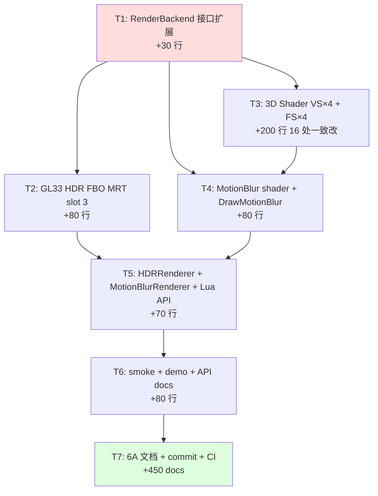

# Phase E.16 Camera-only Motion Blur — TASK 原子化拆分

> 6A 工作流 · 阶段 3 · Atomize
> 拍板基线：DESIGN_PhaseE_16.md（A1 双 RT，13 fn API，345 行代码）

---

## 1. 拆分原则

- **可独立编译**：每个 T 完成后 `cmake --build` 不应破坏现有功能（mode=0 路径必须始终绿）
- **可独立验证**：每个 T 都有明确的验收点（编译过 / smoke 不退化 / Lua 语法过）
- **依赖关系清晰**：拓扑序排，T1 → T2 → T3 平行 → T4 → T5 → T6 → T7
- **粒度控制**：每个 T 改动行数 50~150 行（除 T3 shader 一致改大约 200 行）

## 2. 原子任务清单

### T1 — RenderBackend 接口扩展（30 行）

#### 输入契约

- **前置依赖**：DESIGN §2 接口签名敲定
- **输入数据**：`ALIGNMENT.决策10` + `DESIGN §2`
- **环境依赖**：现有 `render_backend.h` 头文件

#### 输出契约

- **交付物**：`render_backend.h` 改动 +30 行
  - `CreateHDRFBO` 末尾追加 `uint32_t* outCameraVelocityTex = nullptr` 参数
  - 新增 `virtual uint32_t GetHDRCameraVelocityTex(uint32_t fbo) const { return 0; }`
  - `DrawMotionBlur` 增 `cameraVelocityTex` 参数 + `int mode` 参数

#### 实现约束

- 默认参数 `nullptr` / 默认实现返 0：旧 backend 不实现也能编译通过
- 不改 enum / struct（VelocityFormat 等保持不变）

#### 验收

- ✅ `cmake --build` GL33 backend 通过（仍未实现新签名时报 missing override 但不中断 ABI）
- ✅ Phase E.15 backend 老调用代码（HDRRenderer/MotionBlurRenderer）能继续编译

#### 依赖关系

- 无依赖；最先做
- 后置：T2 / T4 / T5

---

### T2 — GL33Backend HDR FBO MRT 扩展（80 行）

#### 输入契约

- **前置依赖**：T1 接口已定
- **输入数据**：DESIGN §3
- **环境依赖**：`render_gl33.cpp` 现有 `CreateHDRFBO / DeleteHDRFBO / GetHDRVelocityTex`

#### 输出契约

- **交付物**：`render_gl33.cpp` 改动
  - 新增字段：`hdrFboCameraVelocityTex` map
  - `CreateHDRFBO` 实现：在 velocityTex 创建后追加 cameraVelocityTex 创建 + attach 到 GL_COLOR_ATTACHMENT3 + 4 attachments drawBuffers
  - `DeleteHDRFBO` 内部联动释放 cameraVelocityTex
  - 实现 `GetHDRCameraVelocityTex`

#### 实现约束

- cameraVelocityTex 与 velocityTex **同格式**（RG16F 或 RG8）+ **同 sampler 参数**（NEAREST + CLAMP_TO_EDGE）
- 失败回滚：cameraVelocityTex 创建失败时释放 colorTex/normalTex/velocityTex/RBO 全套
- drawBuffers 矩阵：4 attachments 时用 `{COLOR0, COLOR1, COLOR2, COLOR3}`

#### 验收

- ✅ 编译通过
- ✅ HDR.Enable 后可通过 `backend->GetHDRCameraVelocityTex(fbo)` 取到非 0 tex id
- ✅ HDR.Disable 后释放干净（无 GL leak warning）
- ✅ Phase E.15 现有行为不变（不传 outCameraVelocityTex 时 cameraVelocityTex 不创建）

#### 依赖关系

- 依赖：T1
- 后置：T5（HDRRenderer 调用方扩展）

---

### T3 — 3D Shader VS×4 + FS×4 改动（200 行，GLES3 + GL33 双 source = 16 处一致改）

#### 输入契约

- **前置依赖**：T1 接口已定（不强依赖 T2 — shader 改动独立）
- **输入数据**：DESIGN §4
- **环境依赖**：`render_gl33.cpp` 现有 8 个 shader source（unlit/PBR/skin/morph × GLES3+GL33）

#### 输出契约

- **交付物**：`render_gl33.cpp` 16 处一致改：
  - 8 个 VS：每个加 1 个 `out vec4 vPrevClipCameraOnly;` + 1 行计算
  - 8 个 FS：每个加 1 个 `in vec4 vPrevClipCameraOnly;` + 1 个 `layout(location=3) out vec2 FragCameraVelocity;` + 1 段 if/else encode

#### 实现约束

- camera-only 路径数学公式：
  - 静态 mesh：`vPrevClipCameraOnly = uPrevViewProj * (uModel * vec4(aPos, 1.0))`
  - skinned mesh：`vPrevClipCameraOnly = uPrevViewProj * (uModel * curSkinnedPos)`（注意是 cur joints，非 prev joints）
  - morph mesh：同 skinned，用 cur joints + cur morph 后的 mesh 位置
- FS encode 与现有 FragVelocity 完全对偶（RG16F 直存 / RG8 用 uVelocityScale 编码）
- shader 编译失败 → backend Init 时整体 motionBlurSupported = false（与现有 buildProgram 失败回退一致）

#### 验收

- ✅ 8 个 shader 全部编译通过（无 GL_INFO_LOG_LENGTH 警告）
- ✅ 现有 SSR Temporal / MotionBlur Phase E.15 视觉无回归（FragVelocity 仍是 combined 内容）
- ✅ FragCameraVelocity 在 mesh 静止 + 相机动时与 FragVelocity 接近（视觉验证可后置到 mode=1 启用时）

#### 依赖关系

- 依赖：T1
- 后置：T4（MotionBlur shader 调用方）

---

### T4 — MotionBlur Shader 扩展 + DrawMotionBlur 实现（80 行）

#### 输入契约

- **前置依赖**：T1（接口签名扩展）+ T3（shader 输出）
- **输入数据**：DESIGN §6 / §7
- **环境依赖**：`render_gl33.cpp` 现有 `FS_MOTION_BLUR_SOURCE` × 2（GLES3 + GL33）

#### 输出契约

- **交付物**：
  - `FS_MOTION_BLUR_SOURCE` GLES3 + GL33 同步加：`uniform sampler2D uCameraVelocityTex`、`uniform int uMode`、`SampleCameraVelocityDilated()` 函数、main() 内 mode 分支
  - `programMotionBlur` 新增 2 个 location 缓存：`locMB_CameraVelocityTex`、`locMB_Mode`
  - Init 时 `glUniform1i(locMB_CameraVelocityTex, 2)` 设默认 sampler unit
  - `DrawMotionBlur` 实现扩展：bind cameraVelocityTex 到 slot 2 + 上传 mode uniform + safeMode fallback

#### 实现约束

- safeMode 兜底：当 mode∈{1,2} 但 cameraVelocityTex==0 时降级到 mode=0（防 mode=2 减法越界）
- slot 2 占位：mode=0 时仍要绑定有效 tex（用 velocityTex 占位避免 driver invalid binding）
- 双 dilation 函数同算法不内联（GLES3 不支持 sampler 作函数参数，#define 复用复杂，直接两份函数最简洁）

#### 验收

- ✅ 编译通过
- ✅ Phase E.15 mode=0 视觉/性能无回归（与 baseline diff 应为 0）
- ✅ mode=1 时 sample cameraVelocityTex（视觉验证后置到 demo）
- ✅ mode=2 时做减法（`v_combined - v_camera`）

#### 依赖关系

- 依赖：T1 + T3
- 后置：T5（MotionBlurRenderer 调用方）

---

### T5 — HDRRenderer + MotionBlurRenderer + Lua API（70 行）

#### 输入契约

- **前置依赖**：T1 / T2 / T4
- **输入数据**：DESIGN §8 / §9 / §10
- **环境依赖**：现有 `hdr_renderer.cpp / motion_blur_renderer.cpp / motion_blur_renderer.h / light_graphics.cpp`

#### 输出契约

- **交付物**：
  - `hdr_renderer.cpp::CreateRT`：增 `uint32_t cameraVelocityTex = 0` 局部 + 传给 `CreateHDRFBO`
  - `motion_blur_renderer.h`：新增 `void SetMode(int)` + `int GetMode()` 声明
  - `motion_blur_renderer.cpp`：State 加 `int mode = 0` 字段、SetMode clamp [0,2] / GetMode、Process 内 `GetHDRCameraVelocityTex` + 调用 `DrawMotionBlur` 多 2 参
  - `light_graphics.cpp`：2 个 `l_MB_SetMode/l_MB_GetMode` + `mb_funcs[]` 加 2 条

#### 实现约束

- `g.mode` clamp 防御：`SetMode(int m) { g.mode = (m < 0) ? 0 : (m > 2 ? 2 : m); }`
- Lua 类型错走 `luaL_checkinteger`（与 Bloom/SSR 一致），不返 nil+err
- HDRRenderer 不缓存 cameraVelocityTex id（backend map 内部管理）

#### 验收

- ✅ 编译通过
- ✅ Lua: `Light.Graphics.MotionBlur.SetMode(1) → GetMode() = 1`
- ✅ MotionBlur API 总数 11 → 13
- ✅ Phase E.15 默认行为零回归（mode 默认 0 + Phase E.15 demo 不调 SetMode 时视觉一致）

#### 依赖关系

- 依赖：T1 + T2 + T4
- 后置：T6（smoke + demo + 文档）

---

### T6 — smoke + demo + Light_Graphics.md MotionBlur 段（80 行）

#### 输入契约

- **前置依赖**：T5（Lua API 已暴露）
- **输入数据**：DESIGN §11 / §12 + 现有 `motion_blur.lua / demo_ssr/main.lua / docs/api/Light_Graphics.md`

#### 输出契约

- **交付物**：
  - `scripts/smoke/motion_blur.lua` 改：surface fn_names 加 SetMode/GetMode（11→13），新增 §7 mode round-trip + clamp 5 PASS
  - `samples/demo_ssr/main.lua`：MotionBlur 引用段加 modeNames，加 `;` 键切 mode（避免与 SSR rejection N 冲突），HUD 行扩展显示 mode，Keys 提示更新
  - `docs/api/Light_Graphics.md`：MotionBlur 段加 SetMode/GetMode 子段 + mode 数值含义表

#### 实现约束

- demo `;` 键切 mode（cycle 0→1→2→0）；keyTap 函数应支持分号字符
- HUD 段格式：`MotionBlur: ON|OFF | mode=N (NAME) | strength=X.XX | samples=N`
- API 文档跟随 Phase E.15 风格（参数 + 返回值 + 默认 + clamp 范围）

#### 验收

- ✅ `lightc -p scripts/smoke/motion_blur.lua` exit 0
- ✅ `lightc -p samples/demo_ssr/main.lua` exit 0
- ✅ smoke 期望 PASS 数从 16 增至 ≥ 21（多 5 段 mode 测试）

#### 依赖关系

- 依赖：T5
- 后置：T7（文档 + commit）

---

### T7 — 6A 文档 5 件套 + commit + CI（450 行文档 + commit + push）

#### 输入契约

- **前置依赖**：T1~T6 全部完成
- **输入数据**：现有 ALIGNMENT/DESIGN/TASK + Phase E.15 6 件套模板

#### 输出契约

- **交付物**：
  - `docs/Phase E.16 Camera-only Motion Blur/ACCEPTANCE_PhaseE_16.md`：实施完成度 + 验收清单 + CI 状态（待跑）
  - `docs/Phase E.16 Camera-only Motion Blur/FINAL_PhaseE_16.md`：6A 全流程总结 + 代码改动统计 + 决策回顾
  - `docs/Phase E.16 Camera-only Motion Blur/TODO_PhaseE_16.md`：必须项 / 建议项 / 后续候选
  - `docs/Phase E.15 Motion Blur/TODO_PhaseE_15.md`：§3 后续候选标记 camera-only motion blur → Phase E.16 已完成
  - 单 commit `feat: add Phase E.16 camera-only motion blur (mode-aware, 13 fn Lua API)`，push origin/main
  - GitHub Actions CI 6/6 监控 + 后续 commit 标记 CI green

#### 实现约束

- commit message 体例与 Phase E.15 一致（多行 -m，含影响文件 + 决策回顾 + 验证状态）
- 不上传 release artifact；CI workflow 已有 motion_blur.lua 注册（T6 不需扩展）
- 仅 origin remote，无 fork push

#### 验收

- ✅ CI 6/6 success（build-windows 含 motion_blur.lua + 16 现有 phase smoke）
- ✅ 现有 phase smoke 零回归
- ✅ 文档 5 件套填满

#### 依赖关系

- 依赖：T6
- 终止任务

---

## 3. 任务依赖图

**串行链**：T1 → T2 → T5 → T6 → T7
**并行机会**：T3 可与 T2 并行（互不依赖；T2 改 backend FBO 接口，T3 改 shader source）
**关键路径**：T1 → T2 → T5 → T6 → T7（无 T4 因 T4 依赖 T3）

实际实施时 6A Automate 阶段顺序：T1 → T2 + T3 并行 → T4 → T5 → T6 → T7。

---

## 4. 风险矩阵

| # | 风险 | 概率 | 影响 | 缓解 |
|---|------|------|------|------|
| 1 | T2 4 attachments FBO_INCOMPLETE | 极低 | 中 | GL3.3 / GLES3.0 标准 ≥ 8；CreateHDRFBO 完整回滚已就位 |
| 2 | T3 shader 中 16 处改动遗漏一处 | 中 | 高 | 用 multi_edit 一次完成；后置 T7 CI runtime smoke 必抓 |
| 3 | T4 sampler binding slot 冲突 | 低 | 中 | DESIGN §7.2 已明确 slot 0/1/2 分配 |
| 4 | T5 Lua API mode clamp 漏（接受 -1 之类） | 低 | 低 | C++ 层 + smoke 双重检查 |
| 5 | T6 demo `;` 键不被 keyTap 识别 | 低 | 低 | fallback 用 `b` 或其他空闲键；不影响功能 |
| 6 | T7 CI 因其他无关 commit 失败 | 低 | 中 | 只看本次 run id；如失败，定位是否本次改动相关 |
| 7 | mode=2 性能比预算高（>1.1×） | 低 | 低 | 文档标注「object-only mode 多 1 套 sampler」；用户调低 SampleCount |
| 8 | RG8 + 极端运动 + camera-only 截断更严重 | 中 | 低 | RG8 是用户主动 opt-in；UI 显示当前格式；clamp 由 shader encode 保证 |

---

## 5. 复杂度评估

| 维度 | 评分 | 备注 |
|------|------|------|
| 技术复杂度 | 🟡 中 | 16 处 shader 一致改是主要复杂源；其他 backend / Lua / module 都是 Phase E.15 模板复制 |
| 测试复杂度 | 🟢 低 | mode round-trip + clamp 是纯参数 API；视觉验收延后到真机 |
| 文档复杂度 | 🟢 低 | 6 件套模板已成熟（Phase E.15 风格）|
| 集成风险 | 🟢 低 | 与 SSR Temporal / Bloom / 其他后处理零交互 |
| 估时 | **1.5~2 天** | T1: 0.5h / T2: 2h / T3: 3h / T4: 2h / T5: 1.5h / T6: 1.5h / T7: 1.5h + 文档 2h + CI 等待 0.5h |

---

## 6. 验收检查清单（汇总，T7 时勾选）

| 项 | 期望 |
|---|------|
| RenderBackend 接口扩展（T1） | ✅ |
| GL33 4-attachments HDR FBO（T2） | ✅ |
| 3D shader VS+FS 16 处一致改（T3） | ✅ |
| MotionBlur shader mode 切换（T4） | ✅ |
| DrawMotionBlur safeMode fallback（T4） | ✅ |
| HDRRenderer cameraVelocityTex 联动（T5） | ✅ |
| MotionBlurRenderer SetMode/GetMode（T5） | ✅ |
| Lua API 11 → 13 fn（T5） | ✅ |
| smoke 16 → ≥21 PASS（T6） | ✅ |
| demo `;` 切 mode + HUD（T6） | ✅ |
| Light_Graphics.md MotionBlur 段更新（T6） | ✅ |
| 6A 文档 5 件套（T7） | ✅ |
| commit + push origin/main（T7） | ✅ |
| GitHub Actions CI 6/6 success（T7） | ✅ |
| 16 个现有 phase smoke 零回归（T7） | ✅ |

---

## 7. 推进确认

TASK 完成。下一步：进入 **Approve** 阶段，向用户拍板「是否进入 Automate 一气实施 T1~T7」。
