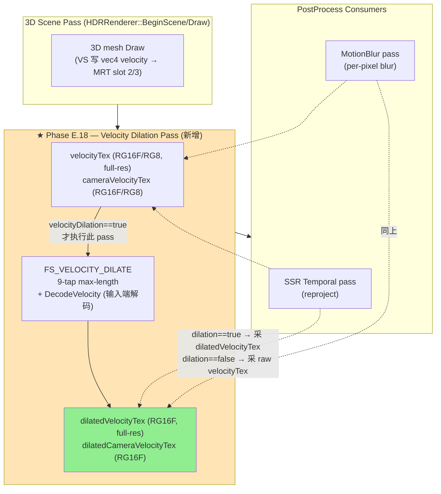
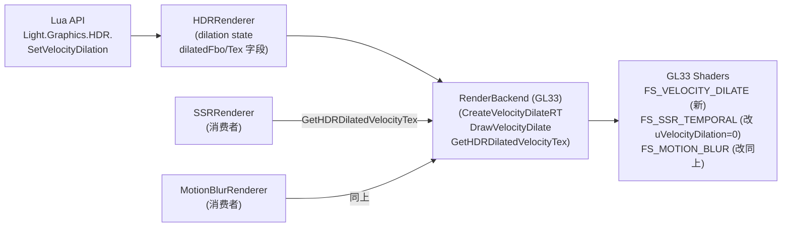

# Phase E.18 Independent Velocity Dilation Pass — DESIGN

> 6A 工作流 · 阶段 2 · Architect
> 基线：Phase E.17 commit `f8d7e41`（CI run 25897849619 6/6 success）

---

## 1. 架构概览

### 1.1 整体数据流图



### 1.2 关键洞察（避免后人踩坑）

| # | 洞察 | 原因 |
|---|------|------|
| **K1** | **shader uVelocityDilation 永远传 0**（即使 dilation==true） | shader B 方案：上游 backend 已 dilate，consumer 单点采样即可；保留 inline 9-tap 代码作为 fallback |
| **K2** | **dilatedTex 永远 RG16F**（无视 raw format） | shader 简化（无需 encode 输出），且 dilation 是中间数据 |
| **K3** | **dilation pass 仅在 dilation==true 时执行** | dilation==false 时跳过 pass（零开销），consumer 绑 raw velocity tex |
| **K4** | **dilation pass 在 SSR Temporal + MotionBlur 之前** | EndScene 流程：3D scene → dilation → SSR → MotionBlur → Tonemap |
| **K5** | **cameraVelocityTex 启用条件决定是否做 camera dilation** | 与 Phase E.16 双 velocity 启用条件一致；cameraVelocityTex==0 时跳过此 RT |
| **K6** | **dilation pass viewport / texel = full-res**（与 Phase E.17 同一原则） | velocityTex 永远 full-res，邻域物理覆盖必须一致 |
| **K7** | **dilation 输出无需 encode**（即使 raw 是 RG8） | dilatedTex RG16F 直接存解码后的 [-scale, +scale] float，consumer shader 内 uVelocityFormat=0 单点采 |

---

## 2. 模块依赖关系



---

## 3. 接口契约（C++ 层）

### 3.1 RenderBackend 虚接口新增

```cpp
// ==================== Phase E.18 — Velocity Dilation Pass 虚接口 ====================

/// 后端是否支持 velocity dilation pass (GL33 = shader 编译成功才 true)
virtual bool SupportsVelocityDilation() const { return false; }

/// 创建 velocity dilation ping-pong RT (RG16F, color-only, 无 depth)
/// @param  w, h    与 velocityTex 同尺寸 (full-res)
/// @param  outTex  返回 GL tex id (失败为 0)
/// @return GL fbo id (失败为 0); 失败时 outTex 也保证为 0
/// @note   dilatedTex 永远 RG16F (无视 raw velocity format), shader 内统一不 decode
virtual uint32_t CreateVelocityDilateRT(int /*w*/, int /*h*/, uint32_t* outTex) {
    if (outTex) *outTex = 0;
    return 0;
}

/// 释放 velocity dilation RT (与 CreateVelocityDilateRT 配对)
virtual void DeleteVelocityDilateRT(uint32_t /*fbo*/, uint32_t /*tex*/) {}

/// 执行 dilation pass (single pass, 全屏 9-tap max-length)
/// @param srcVelocityTex  输入 (RG16F 或 RG8, 由 velocityFormat 决定)
/// @param dstFbo          dilation 输出 fbo (绑定 dilatedTex)
/// @param w, h            full-res 尺寸 (viewport)
/// @note  shader 内根据 velocityFormat decode raw, 输出已 decode 的 float (RG16F 写)
virtual void DrawVelocityDilate(uint32_t /*srcVelocityTex*/,
                                 uint32_t /*dstFbo*/,
                                 int /*w*/, int /*h*/) {}
```

### 3.2 HDRRenderer 新增公开 API

```cpp
// 既有 API 不变:
//   uint32_t GetVelocityTexture();              // raw combined velocity tex
//   uint32_t GetCameraVelocityTexture();        // raw camera-only velocity tex (Phase E.16)

// Phase E.18 新增:

/// 获取 dilated combined velocity tex (full-res RG16F)
/// dilation 状态:
///   - velocityDilation==true  → 返回有效 tex (dilation pass 已执行)
///   - velocityDilation==false → 返回 0 (dilation pass 未执行)
///   - HDR 未 Enable / backend 不支持 → 返回 0
/// 消费者使用方式:
///   uint32_t tex = HDRRenderer::GetDilatedVelocityTexture();
///   if (!tex) tex = HDRRenderer::GetVelocityTexture();  // fallback raw
uint32_t GetDilatedVelocityTexture();

/// 获取 dilated camera-only velocity tex (Phase E.16 双 velocity 一致条件)
uint32_t GetDilatedCameraVelocityTexture();
```

### 3.3 SSRRenderer / MotionBlurRenderer 消费者改造

**SSRRenderer::Process** — `DrawSSRTemporal` 第 4 个参数（velocityTex）替换为：

```cpp
// Phase E.18 — 优先取 dilated velocity, 失败 fallback raw
uint32_t velocityTex = HDRRenderer::GetDilatedVelocityTexture();
if (!velocityTex) velocityTex = HDRRenderer::GetVelocityTexture();

g.backend->DrawSSRTemporal(
    g.reflectTex, g.historyTexs[readIdx], g.depthTex,
    velocityTex,                  // ★ Phase E.18: dilated 优先
    g.historyFbos[writeIdx],
    g.srcW, g.srcH,
    reprojMat, invProj,
    g.temporalAlpha, g.rejectionMode,
    g.hasPrevViewProj ? 1 : 0,
    false,                         // ★ Phase E.18: dilation 强制 false (shader 单点采)
    g.backend->GetVelocityScale(),
    g.backend->GetActiveVelocityFormat());
```

**MotionBlurRenderer::Process** — 类似：

```cpp
// Phase E.18 — 同上策略
uint32_t velocityTex = HDRRenderer::GetDilatedVelocityTexture();
if (!velocityTex) velocityTex = HDRRenderer::GetVelocityTexture();

uint32_t cameraVelocityTex = HDRRenderer::GetDilatedCameraVelocityTexture();
if (!cameraVelocityTex) cameraVelocityTex = HDRRenderer::GetCameraVelocityTexture();

g.backend->DrawMotionBlur(hdrTex, velocityTex,
                           cameraVelocityTex,
                           g.fbo, g.tex,
                           hdrFbo,
                           g.width, g.height,
                           g.strength, g.sampleCount,
                           g.mode,
                           rtW, rtH);
```

**关键**：shader 内 `uVelocityDilation` 已由 backend 默认传 0（dilation pass 模式下永远 0），但 Process 仍传 `g.backend->GetVelocityDilation()`，由 backend 内部 override 为 0（如果 dilation pass 已执行）。

### 3.4 GL33Backend uniform 上传逻辑（关键）

```cpp
// SSR Temporal Draw 内:
//   原: glUniform1i(locSSRTemporal_VelocityDilation, velocityDilation ? 1 : 0);
//   改:
if (dilationPassActive) {                            // ★ Phase E.18
    // dilation pass 已执行, shader 单点采 dilatedTex → uniform=0
    glUniform1i(locSSRTemporal_VelocityDilation, 0);
} else {
    // raw velocityTex, shader 走 inline 9-tap (or single tap if user disabled)
    glUniform1i(locSSRTemporal_VelocityDilation, velocityDilation ? 1 : 0);
}
```

Backend 内部新增字段 `bool dilationPassActive_`（每帧 EndScene 流程中根据 `velocityDilation_ && dilatedFbo` 设置）。

---

## 4. 实施细节

### 4.1 FS_VELOCITY_DILATE shader

```glsl
#version 300 es
precision highp float;
precision highp sampler2D;
in  vec2 vUV;
out vec4 FragColor;

uniform sampler2D uVelocityTex;
uniform vec2  uTexel;              // 1.0 / vec2(w, h)
uniform int   uVelocityFormat;     // 0=RG16F (raw) / 1=RG8 (encoded)
uniform float uVelocityScale;      // RG8 解码 scale

// 与 FS_SSR_TEMPORAL / FS_MOTION_BLUR 同算法 (代码复制粘贴)
vec2 DecodeVelocity(vec2 raw) {
    return (uVelocityFormat == 1) ? ((raw - 0.5) * (2.0 * uVelocityScale)) : raw;
}

void main() {
    // 9-tap max-length: 邻域取最长向量 (几何边缘抗锯齿)
    vec2  bestV   = vec2(0.0);
    float bestLen = -1.0;
    for (int dy = -1; dy <= 1; ++dy) {
        for (int dx = -1; dx <= 1; ++dx) {
            vec2 v = DecodeVelocity(
                texture(uVelocityTex, vUV + vec2(float(dx), float(dy)) * uTexel).rg);
            float l = dot(v, v);
            if (l > bestLen) { bestLen = l; bestV = v; }
        }
    }
    // 输出 RG16F 直接存解码后的 float velocity (无 encode, 消费者单点采)
    FragColor = vec4(bestV, 0.0, 0.0);
}
```

### 4.2 dilation pass viewport / state

```cpp
void DrawVelocityDilate(uint32_t srcVelocityTex, uint32_t dstFbo, int w, int h) override {
    if (!velocityDilateSupported || !programVelocityDilate) return;
    if (!srcVelocityTex || !dstFbo || w <= 0 || h <= 0) return;

    glBindFramebuffer(GL_FRAMEBUFFER, (GLuint)dstFbo);
    glViewport(0, 0, w, h);
    glDisable(GL_BLEND);
    glDisable(GL_DEPTH_TEST);
    glDisable(GL_CULL_FACE);
    glColorMask(GL_TRUE, GL_TRUE, GL_TRUE, GL_TRUE);

    glUseProgram(programVelocityDilate);
    if (locVD_Texel          >= 0) glUniform2f(locVD_Texel, 1.0f/(float)w, 1.0f/(float)h);
    if (locVD_VelocityFormat >= 0) glUniform1i(locVD_VelocityFormat,
                                               (activeVelocityFormat_==VelocityFormat::RG8) ? 1 : 0);
    if (locVD_VelocityScale  >= 0) glUniform1f(locVD_VelocityScale, kVelocityScaleDefault);

    glActiveTexture(GL_TEXTURE0);
    glBindTexture(GL_TEXTURE_2D, (GLuint)srcVelocityTex);

    glBindVertexArray(vaoTonemap);
    glDrawArrays(GL_TRIANGLES, 0, 6);
    glBindVertexArray(0);

    glActiveTexture(GL_TEXTURE0);
    glBindTexture(GL_TEXTURE_2D, 0);
    glUseProgram(0);
    glBindFramebuffer(GL_FRAMEBUFFER, 0);
}
```

### 4.3 HDRRenderer State 字段

```cpp
struct State {
    // ... 现有 ...
    bool velocityDilation = true;

    // ★ Phase E.18 新增
    uint32_t dilatedVelocityFbo       = 0;   // dilated combined RT
    uint32_t dilatedVelocityTex       = 0;
    uint32_t dilatedCameraVelocityFbo = 0;   // dilated camera-only RT (Phase E.16 双 velocity)
    uint32_t dilatedCameraVelocityTex = 0;
};
```

### 4.4 EndScene 内 dilation 调用时机

```cpp
// hdr_renderer.cpp::EndScene 内 (3D scene 渲染完成后, PP 之前)
void EndScene() {
    if (!g.enabled || !g.backend || !g.fbo) return;

    // ★ Phase E.18 — dilation pass (条件: dilation==true && backend 支持 && dilated RT 已创建)
    if (g.velocityDilation && g.backend->SupportsVelocityDilation()) {
        uint32_t rawCombined = g.backend->GetHDRVelocityTex(g.fbo);
        if (rawCombined && g.dilatedVelocityFbo) {
            g.backend->DrawVelocityDilate(rawCombined, g.dilatedVelocityFbo, g.width, g.height);
        }
        uint32_t rawCamera = g.backend->GetHDRCameraVelocityTex(g.fbo);
        if (rawCamera && g.dilatedCameraVelocityFbo) {
            g.backend->DrawVelocityDilate(rawCamera, g.dilatedCameraVelocityFbo, g.width, g.height);
        }
    }

    // 现有 PP: Bloom / SSR / LensFlare / MotionBlur / Tonemap
    // ...
}
```

### 4.5 dilatedTex 资源生命周期

- 在 `CreateRT(w, h)` 内一并创建（与 raw velocityTex 同时刻）：
  - dilation pass 启用判定：`backend->SupportsVelocityDilation()` && raw `velocityTex` 创建成功
  - dilatedVelocityFbo/Tex 始终创建（无论 velocityDilation 状态）— 简化资源管理
  - 运行时 velocityDilation 切换仅影响是否调用 `DrawVelocityDilate`，不重建 RT
- 在 `ReleaseRT` 内统一清理

---

## 5. shader 改动（最小化原则）

### 5.1 FS_SSR_TEMPORAL（保留 inline 9-tap 代码，uniform 控制）

**无 shader 改动**！现有代码：

```glsl
uniform int uVelocityDilation;  // 0=单点 / 1=3x3 max-length

vec2 SampleVelocityDilated(vec2 uv) {
    if (uVelocityDilation == 0) return DecodeVelocity(texture(uVelocityTex, uv).rg);
    // ... 9-tap 邻域 ...
}
```

Backend 控制：
- dilation pass 已执行 → 上传 `uVelocityDilation=0` + 绑 dilatedTex（永远走单点路径）
- dilation pass 未执行（dilation==false）→ 上传 `uVelocityDilation=0` + 绑 raw tex
- dilation==true 但 backend 不支持 dilation pass → 上传 `uVelocityDilation=1` + 绑 raw tex（fallback inline）

### 5.2 FS_MOTION_BLUR（同上）

**无 shader 改动**！同 SSR Temporal 策略。

### 5.3 FS_VELOCITY_DILATE（新增）

详见 §4.1。9-tap 算法与 FS_SSR_TEMPORAL/FS_MOTION_BLUR 的 SampleVelocityDilated 完全一致，保证像素 bit-exact 兼容。

---

## 6. 异常处理策略

### 6.1 dilation pass 创建失败

```
Backend::SupportsVelocityDilation() == false (shader 编译失败)
  ↓
HDRRenderer::CreateRT 不创建 dilatedFbo/Tex
  ↓
EndScene 不调 DrawVelocityDilate
  ↓
GetDilatedVelocityTexture() 返 0
  ↓
SSR/MB consumer fallback raw velocityTex
  ↓
Backend uniform: uVelocityDilation = velocityDilation_ ? 1 : 0  (走 inline 路径)
```

### 6.2 dilatedTex 部分创建失败（combined OK, camera 失败）

- silent skip camera dilation；mode=1/2 fallback raw cameraVelocityTex
- backend 内部 inline 9-tap 仍可用

### 6.3 velocityDilation 运行时切换

- true → false：下一帧 EndScene 跳过 dilation pass，consumer 绑 raw（一帧延迟可忽略）
- false → true：下一帧 EndScene 执行 dilation pass，consumer 绑 dilated（一帧延迟可忽略）

---

## 7. 性能与 VRAM 预算

### 7.1 性能（@ 1080p RGBA16F velocity）

| 场景 | Phase E.17 | Phase E.18 | 收益 |
|------|-----------|-----------|------|
| 仅 dilation==false | 0 | 0 | 0 |
| 仅 SSR Temporal (dilation==true) | 9 fetch/px | 9 + 1 = 10 fetch/px | **−11%（略亏）** |
| 仅 MB mode=0 | 9 | 10 | −11% |
| 仅 MB mode=2 | 18 | 9 + 2 = 11 | **+39%** |
| SSR Temporal + MB mode=0 | 18 | 9 + 2 = 11 | **+39%** |
| SSR Temporal + MB mode=2 | 27 | 9 + 9 + 3 = 21 | **+22%** |

| @ 1080p RGBA16F | Pass 时间预算 |
|----------------|--------------|
| dilation pass (单 RT) | ~0.06 ms |
| dilation pass (双 RT combined + camera) | ~0.12 ms |
| consumer single tap saving | ~0.18 ms / consumer / mode |

### 7.2 VRAM 预算

| 配置 | Raw velocity | + Phase E.18 dilated | 总计 |
|-----|-------------|----------------------|------|
| RG16F single (combined only) | 4 MB | +4 MB | 8 MB |
| RG16F dual (combined + camera) | 8 MB | +8 MB | **16 MB** |
| RG8 single | 2 MB | +4 MB | 6 MB |
| RG8 dual | 4 MB | +8 MB | **12 MB** |

**最坏情况增加 8 MB @ 1080p**，可接受。

---

## 8. 集成测试用例

### 8.1 单元行为

- ✅ dilation==true & SSR Temporal 启用 → 输出与 inline 9-tap 像素一致
- ✅ dilation==true & MB mode=0/1/2 → 输出与 inline 9-tap 像素一致
- ✅ dilation==false → 跳过 pass，consumer fallback raw（与 Phase E.17 等价）
- ✅ runtime toggle dilation → 立即生效
- ✅ runtime toggle format (RG16F ↔ RG8) → dilatedTex 仍 RG16F，shader 解码正确

### 8.2 边界

- ✅ HDR Enable + dilation pass 创建失败 → fallback inline，不 crash
- ✅ dilation 后 RT 释放再 Enable → 资源正确重建
- ✅ velocityFormat=RG8 + dilation 一起切 → 双 RT 同步重建

### 8.3 smoke

- 沿用现有 `motion_blur.lua` 24 PASS + 新增 dilation 行为验证（fn_names 不变）
- 期望 `velocity_dilation.lua`（新 smoke）或合并到 `hdr.lua`

---

## 9. 推进确认

DESIGN 阶段已完成。下一步：进入 **阶段 3: Atomize** — TASK 拆分（T1~T8）。
