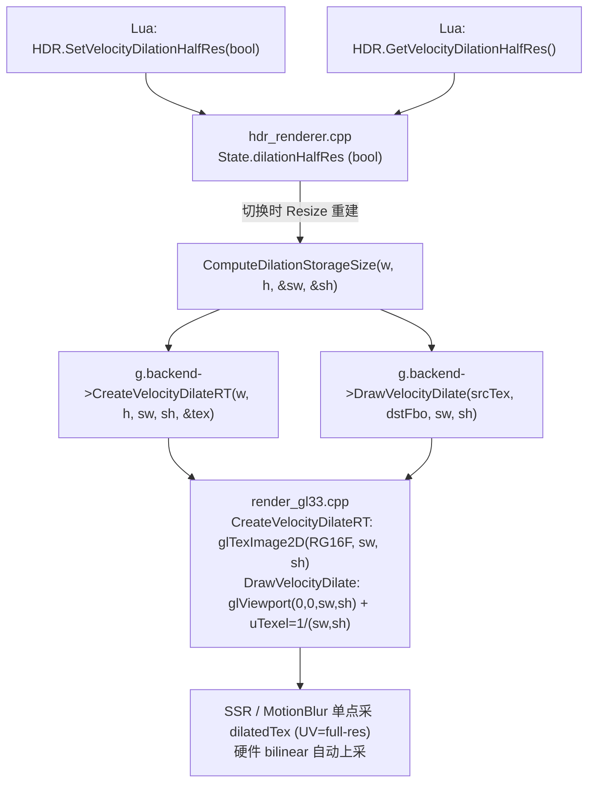

# Phase E.18.1 Velocity Dilation Half-Resolution — DESIGN

> 6A 工作流 · 阶段 2 · Architect
> 上游：ALIGNMENT_PhaseE_18_1.md

---

## 1. 整体架构



---

## 2. 数据流

### 2.1 创建时序（HDR.SetVelocityDilationHalfRes(true) 调用后）

```
1. Lua: HDR.SetVelocityDilationHalfRes(true)
        ↓
2. HDRRenderer::SetVelocityDilationHalfRes(bool):
   - g.dilationHalfRes = true
   - 若已 Enable: 重新调 CreateRT(w, h) 重建 dilated RT
        ↓
3. CreateRT 内 dilation RT 创建分支:
   - sw, sh = ComputeDilationStorageSize(w, h)  // halfRes=true → ((w+1)/2, (h+1)/2)
   - g.backend->CreateVelocityDilateRT(w, h, sw, sh, &dilatedTex)
   - g.backend->CreateVelocityDilateRT(w, h, sw, sh, &dilatedCamTex) // 若 cameraVelocityTex 存在
        ↓
4. Backend: glTexImage2D(GL_RG16F, sw, sh) → dilatedTex 半分辨率
```

### 2.2 渲染时序（每帧 EndScene）

```
1. HDRRenderer::EndScene:
   - sw, sh = ComputeDilationStorageSize(g.width, g.height)
   - g.backend->DrawVelocityDilate(rawCombined, g.dilatedVelocityFbo, sw, sh)
   - g.backend->DrawVelocityDilate(rawCamera,   g.dilatedCameraVelocityFbo, sw, sh)
        ↓
2. Backend DrawVelocityDilate(srcTex, dstFbo, sw, sh):
   - glViewport(0, 0, sw, sh)                   // 半分辨率 fragment 数
   - uTexel = (1.0/sw, 1.0/sh)                  // 邻域物理覆盖 = 2 raw px / texel × 3 = 6 raw px
   - 绑 src raw velocity (full-res) 到 slot 0
   - 全屏三角 → fragment shader 内 9-tap max-length 写入 dilatedTex (half-res)
        ↓
3. Consumer (SSR/MotionBlur::Process):
   - 单点采 dilatedTex (full-res 屏幕 UV)
   - 硬件 GL_LINEAR + CLAMP_TO_EDGE 自动 bilinear 上采
   - shader 内 uVelocityDilation = 0 (dilationPassActive_ 强制)
```

---

## 3. 接口变更对比

### 3.1 `render_backend.h`

#### 接口 1: `CreateVelocityDilateRT`

```diff
- virtual uint32_t CreateVelocityDilateRT(int w, int h, uint32_t* outTex) {
-     (void)w; (void)h; (void)outTex; return 0;
- }
+ /// Phase E.18.1: w/h = logical (传给 HDRRenderer 比对), sw/sh = storage (实际 RT 尺寸)
+ /// halfRes=true 时 sw=((w+1)/2), sh=((h+1)/2); halfRes=false 时 sw=w, sh=h
+ /// 调用方负责计算 sw/sh; backend 仅按 sw/sh 创建 RT
+ virtual uint32_t CreateVelocityDilateRT(int w, int h, int sw, int sh, uint32_t* outTex) {
+     (void)w; (void)h; (void)sw; (void)sh; (void)outTex; return 0;
+ }
```

> **签名变更说明**：增加 sw/sh 参数；w/h 保留用于未来扩展（如内部 logical→storage 转换的 sanity check），当前 backend 仅用 sw/sh

#### 接口 2: `DrawVelocityDilate`

```diff
- virtual void DrawVelocityDilate(uint32_t srcVelocityTex, uint32_t dstFbo, int w, int h) {
-     (void)srcVelocityTex; (void)dstFbo; (void)w; (void)h;
- }
+ /// Phase E.18.1: sw/sh = storage size (dilatedTex 实际尺寸 = dstFbo 的 viewport 尺寸)
+ /// uTexel = 1.0/(sw, sh) — 半分辨率时邻域物理覆盖 = 6 raw 像素 (max-filter 鲁棒)
+ virtual void DrawVelocityDilate(uint32_t srcVelocityTex, uint32_t dstFbo, int sw, int sh) {
+     (void)srcVelocityTex; (void)dstFbo; (void)sw; (void)sh;
+ }
```

> **签名变更说明**：参数名 w/h 改为 sw/sh（语义明确），数量不变

### 3.2 `render_gl33.cpp`

```diff
  // CreateVelocityDilateRT 实现
- uint32_t CreateVelocityDilateRT(int w, int h, uint32_t* outTex) override {
-     if (outTex) *outTex = 0;
-     if (!velocityDilateSupported || w <= 0 || h <= 0 || !outTex) return 0;
-     ...
-     glTexImage2D(GL_TEXTURE_2D, 0, GL_RG16F, w, h, 0, GL_RG, GL_FLOAT, nullptr);
+ uint32_t CreateVelocityDilateRT(int w, int h, int sw, int sh, uint32_t* outTex) override {
+     (void)w; (void)h;   // logical 当前未使用 (保留用于未来 sanity check)
+     if (outTex) *outTex = 0;
+     if (!velocityDilateSupported || sw <= 0 || sh <= 0 || !outTex) return 0;
+     ...
+     glTexImage2D(GL_TEXTURE_2D, 0, GL_RG16F, sw, sh, 0, GL_RG, GL_FLOAT, nullptr);
  }

  // DrawVelocityDilate 实现
- void DrawVelocityDilate(uint32_t srcVelocityTex, uint32_t dstFbo, int w, int h) override {
-     ...
-     glViewport(0, 0, w, h);
-     glUniform2f(locVDilate_Texel, 1.0f/w, 1.0f/h);
+ void DrawVelocityDilate(uint32_t srcVelocityTex, uint32_t dstFbo, int sw, int sh) override {
+     ...
+     glViewport(0, 0, sw, sh);
+     glUniform2f(locVDilate_Texel, 1.0f/sw, 1.0f/sh);
  }
```

### 3.3 `hdr_renderer.h`

新增 2 个 public API：

```diff
  bool   SetVelocityDilation(bool on);
  bool   GetVelocityDilation();

+ /// Phase E.18.1 — dilation pass 半分辨率开关 (默认 false / full-res)
+ /// halfRes=true: dilatedTex 尺寸 = ((W+1)/2, (H+1)/2), VRAM -75% / perf +4×
+ /// 仅在 dilation pass 启用时有意义 (SetVelocityDilation(true) + backend 支持)
+ /// 切换时若已 Enable → 立即重建 dilated RT
+ bool   SetVelocityDilationHalfRes(bool on);
+ bool   GetVelocityDilationHalfRes();
```

### 3.4 `hdr_renderer.cpp`

State 新字段：

```cpp
struct State {
    ...
    // Phase E.18.1 — dilation pass 半分辨率开关 (默认 false)
    bool           dilationHalfRes = false;
    ...
};
```

新增内部辅助：

```cpp
/// Phase E.18.1: 计算 dilation pass 实际 RT 存储尺寸 (与 motion blur halfRes 同模式)
static inline void ComputeDilationStorageSize(int w, int h, int& sw, int& sh) {
    if (g.dilationHalfRes) {
        sw = (w + 1) / 2;
        sh = (h + 1) / 2;
    } else {
        sw = w;
        sh = h;
    }
}
```

CreateRT 内调用扩展：

```cpp
if (g.backend->SupportsVelocityDilation() && velocityTex) {
    int dsw = 0, dsh = 0;
    ComputeDilationStorageSize(w, h, dsw, dsh);

    uint32_t dilatedTex = 0;
    const uint32_t dilatedFbo = g.backend->CreateVelocityDilateRT(w, h, dsw, dsh, &dilatedTex);
    ...
    if (cameraVelocityTex) {
        uint32_t dilatedCamTex = 0;
        const uint32_t dilatedCamFbo = g.backend->CreateVelocityDilateRT(w, h, dsw, dsh, &dilatedCamTex);
        ...
    }
}
```

EndScene 内调用扩展：

```cpp
if (g.velocityDilation && g.backend->SupportsVelocityDilation()) {
    int dsw = 0, dsh = 0;
    ComputeDilationStorageSize(g.width, g.height, dsw, dsh);
    const uint32_t rawCombined = g.backend->GetHDRVelocityTex(g.fbo);
    if (rawCombined && g.dilatedVelocityFbo) {
        g.backend->DrawVelocityDilate(rawCombined, g.dilatedVelocityFbo, dsw, dsh);
        ...
    }
    ...
}
```

新增 Set/Get：

```cpp
bool SetVelocityDilationHalfRes(bool on) {
    if (g.dilationHalfRes == on) return true;       // no-op
    g.dilationHalfRes = on;
    // 若已 Enable，立即重建 dilated RT (释放旧 RT + 新 sw/sh 重建)
    if (g.inited && g.fbo && g.width > 0 && g.height > 0) {
        // 仅释放并重建 dilation RT 部分，无需重建 HDR FBO
        ReleaseDilationRT();
        RebuildDilationRT(g.width, g.height);
    }
    return true;
}

bool GetVelocityDilationHalfRes() { return g.dilationHalfRes; }
```

> **重要**：为避免重建整个 HDR FBO（HDR scene tex / normal tex / velocity MRT 全部重建），新增两个内部辅助 `ReleaseDilationRT()` / `RebuildDilationRT()` 仅处理 dilation 部分。

### 3.5 `light_graphics.cpp` Lua 绑定

新增 2 个 Lua 函数：

```cpp
/// @lua_api Light.Graphics.HDR.SetVelocityDilationHalfRes
/// @brief Phase E.18.1 — dilation pass 半分辨率开关 (VRAM -75%)
/// @param on boolean true=半分辨率 / false=全分辨率(默认)
/// @return boolean true 设置成功 / nil, string 入参非 boolean
static int l_HDR_SetVelocityDilationHalfRes(lua_State* L) {
    if (!lua_isboolean(L, 1)) {
        lua_pushnil(L);
        lua_pushstring(L, "SetVelocityDilationHalfRes: expect boolean");
        return 2;
    }
    bool on = lua_toboolean(L, 1) != 0;
    HDRRenderer::SetVelocityDilationHalfRes(on);
    lua_pushboolean(L, 1);
    return 1;
}

static int l_HDR_GetVelocityDilationHalfRes(lua_State* L) {
    lua_pushboolean(L, HDRRenderer::GetVelocityDilationHalfRes() ? 1 : 0);
    return 1;
}
```

注册表加 2 项：

```cpp
{"SetVelocityDilationHalfRes", l_HDR_SetVelocityDilationHalfRes},
{"GetVelocityDilationHalfRes", l_HDR_GetVelocityDilationHalfRes},
```

---

## 4. 关键算法说明

### 4.1 9-tap 邻域物理覆盖

shader 内的 9-tap 循环（不变）：

```glsl
vec2 maxVel = vec2(0.0);
float maxLen2 = 0.0;
for (int dy = -1; dy <= 1; ++dy) {
    for (int dx = -1; dx <= 1; ++dx) {
        vec2 uv = vUv + vec2(dx, dy) * uTexel;
        vec2 v  = DecodeVelocity(texture(uSrcVelocityTex, uv).rg);
        float l2 = dot(v, v);
        if (l2 > maxLen2) { maxLen2 = l2; maxVel = v; }
    }
}
fragColor = vec4(maxVel, 0.0, 0.0);
```

**uTexel 选择影响物理覆盖**：

| uTexel 值 | dx ∈ {-1,0,1} 步长 (raw px) | 9-tap 覆盖 (raw px) |
|-----------|----------------------------|---------------------|
| `1/(fullW, fullH)` | 1 raw px | 3×3 raw px |
| `1/(halfW, halfH)` = `2/(fullW, fullH)` | 2 raw px | 6×6 raw px (本任务选用) |

**max-filter 正确性**：取最长 velocity 不会引入错误，仅扩大覆盖（max(a, b) ≥ max(a)）；过度扩散会让 motion blur 略外溢，但 SSR Temporal/Motion Blur 本身就是低频处理。

### 4.2 半分辨率 viewport + raw velocity 采样

- `glViewport(0, 0, sw, sh)` → fragment count = sw × sh（25% of full-res）
- src raw velocityTex 仍是 full-res（`GL_LINEAR` 过滤）
- fragment shader 内 `vUv = (gl_FragCoord.xy + 0.5) / vec2(sw, sh)` → 屏幕空间 UV [0, 1]
- 采样 raw velocity 时，UV [0, 1] 对应 raw full-res 全幅，硬件 bilinear 自动 sub-pixel 采样

### 4.3 Consumer 上采

```glsl
// SSR Temporal / Motion Blur shader 内 (Phase E.18 既有)
vec2 vel = texture(uVelocityTex, screenUv).rg;  // dilatedTex 半分辨率, screenUv 是 full-res 屏幕 UV
```

`GL_LINEAR + GL_CLAMP_TO_EDGE` 自动从半分辨率 dilatedTex 双线性上采到 full-res 屏幕坐标。max-filter 输出已经是分块均匀的，上采误差影响极小。

---

## 5. 异常处理策略

| 异常场景 | 处理 |
|---------|------|
| backend 不支持 dilation pass | `CreateVelocityDilateRT` 返 0 → dilatedFbo=0 → EndScene 跳过 → consumer fallback raw |
| FBO 不完整 (奇数小分辨率半分辨率为 0) | `CreateVelocityDilateRT` 返 0 → 同上 fallback |
| dilation OFF 时 halfRes=true | dilatedFbo 未创建 → halfRes 字段无效（日志不报错） |
| 切换 halfRes 时 dilation 已 OFF | dilatedFbo=0 → ReleaseDilationRT() / RebuildDilationRT() 均 no-op |

---

## 6. 验收测试矩阵

| 测试场景 | 期望结果 |
|---------|---------|
| 默认状态 (Lua 不调) | `GetVelocityDilationHalfRes()=false` |
| `SetVelocityDilationHalfRes(true)` | 返 true; `GetVelocityDilationHalfRes()=true` |
| `SetVelocityDilationHalfRes(1)` 类型错 | 返 nil + "SetVelocityDilationHalfRes: expect boolean" |
| Enable HDR + dilation ON + halfRes ON 切换 | dilated RT 自动重建 (log 输出半分辨率尺寸) |
| Enable HDR + dilation OFF + halfRes 切换 | 无 RT 重建 (dilated RT 不存在), 状态保留 |
| Smoke test 全部 PASS | 24 个 motion_blur smoke 不破坏 |
| CI 6/6 平台 | success |

---

## 7. 与 Phase E.17 motion blur halfRes 的对比

| 维度 | Phase E.17 (motion blur) | Phase E.18.1 (dilation) |
|------|--------------------------|-------------------------|
| RT 角色 | output (写入端) | output (写入端) |
| 半分辨率公式 | `((W+1)/2, (H+1)/2)` | `((W+1)/2, (H+1)/2)` ✓ 同 |
| viewport | half-res | half-res ✓ 同 |
| uTexel | full-res (`1/(W,H)`) | **half-res** (`1/(sw,sh)`) ★ 不同 |
| consumer 上采 | tonemap blit bilinear | shader texture() bilinear ✓ 同 |
| 默认值 | false | false ✓ 同 |
| 切换重建 | 立即 Resize | 立即 ReleaseDilation + Rebuild ✓ 同 |
| 视觉差异 | 极轻微 (上采模糊 < 1px) | 略广覆盖 (max-filter 自动扩) |

**uTexel 不同的原因**：motion blur 的 reconstruction filter 需要按 full-res 屏幕步长采样，与输出 RT 尺寸无关；dilation 的 max-filter 邻域物理覆盖与输出 texel 间距相关（"邻域"的语义是 dilated tex 的相邻位置）。

---

## 8. 总结

- 接口扩展简洁：2 个 backend 接口加 sw/sh，1 对 Lua API
- 默认 false 零回归保障
- 与 Phase E.17 motion blur halfRes 路径高度一致
- 关键决策点（uTexel 用半分辨率纹素）已明确论证
- consumer 路径零改动
