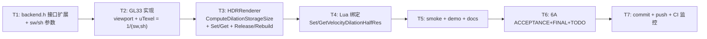

# Phase E.18.1 Velocity Dilation Half-Resolution — TASK

> 6A 工作流 · 阶段 3 · Atomize
> 上游：DESIGN_PhaseE_18_1.md

---

## 1. 任务依赖图

---

## 2. 原子任务定义

### T1: `render_backend.h` 接口扩展

**输入契约**：Phase E.18 现有 6 个 dilation 接口
**输出契约**：`CreateVelocityDilateRT` / `DrawVelocityDilate` 加 sw/sh 参数，默认实现 no-op

**实施细节**：
- `CreateVelocityDilateRT(int w, int h, int sw, int sh, uint32_t* outTex)` — 增 sw/sh
- `DrawVelocityDilate(uint32_t srcTex, uint32_t dstFbo, int sw, int sh)` — 参数 w/h 改名 sw/sh
- 注释明确 w/h 是 logical（保留未来 sanity check）, sw/sh 是 storage
- 其余 `Supports/Delete/Set/Get` 接口保持不变

**复杂度**：低（~15 行 header 改动）
**验收**：编译通过，无 warning

---

### T2: `render_gl33.cpp` 实现更新

**输入契约**：T1 完成的 header
**输出契约**：GL33 backend 接口实现与新签名一致

**实施细节**：
- `CreateVelocityDilateRT(w, h, sw, sh, outTex)`:
  - `(void)w; (void)h;`（logical 未使用）
  - 防御检查改 `sw > 0 && sh > 0`
  - `glTexImage2D(GL_RG16F, sw, sh, ...)` (尺寸用 sw/sh)
  - log 输出 sw/sh
- `DrawVelocityDilate(srcTex, dstFbo, sw, sh)`:
  - `glViewport(0, 0, sw, sh)`
  - `glUniform2f(locVDilate_Texel, 1.0f/sw, 1.0f/sh)`
  - 注释更新 uTexel 含义

**复杂度**：低（~10 行 cpp 改动 + 2 处注释）
**验收**：编译通过；行为对 sw=w, sh=h 输入与 Phase E.18 等价

---

### T3: `hdr_renderer.h/cpp` 接入

**输入契约**：T2 完成的 backend 接口
**输出契约**：HDRRenderer 暴露新 API + CreateRT/EndScene 透传 sw/sh + 切换时立即重建

**实施细节** (`hdr_renderer.h`)：
- 在 `SetVelocityDilation` 附近新增 `SetVelocityDilationHalfRes(bool)` / `GetVelocityDilationHalfRes()`

**实施细节** (`hdr_renderer.cpp`)：
1. State 加 `bool dilationHalfRes = false;`
2. 新增 `static inline void ComputeDilationStorageSize(int w, int h, int& sw, int& sh)`
3. `CreateRT` 内: 调用 `ComputeDilationStorageSize` + 透传 sw/sh 到 `CreateVelocityDilateRT`
4. `EndScene` 内 dilation pass 块: 调用 `ComputeDilationStorageSize` + 透传 sw/sh 到 `DrawVelocityDilate`
5. 新增 `ReleaseDilationRT()` 内部辅助 (复用 DeleteVelocityDilateRT)
6. 新增 `RebuildDilationRT(int w, int h)` 内部辅助 (复用 CreateRT 内创建逻辑)
7. 新增 `SetVelocityDilationHalfRes(bool)`:
   - no-op 短路 (state 未变)
   - 已 Enable: ReleaseDilationRT() + RebuildDilationRT(w, h)
8. 新增 `GetVelocityDilationHalfRes() → bool`

**复杂度**：中（~60 行 cpp + 2 行 header）
**验收**：编译通过；切换调用日志正确（旧 RT 释放 + 新 RT 创建 log）

---

### T4: `light_graphics.cpp` Lua 绑定

**输入契约**：T3 完成的 HDRRenderer API
**输出契约**：Lua 端可调 `HDR.SetVelocityDilationHalfRes(bool)` / `HDR.GetVelocityDilationHalfRes()`

**实施细节**：
- 仿照 `l_HDR_SetVelocityDilation` / `l_HDR_GetVelocityDilation` 编写
- 添加 `@lua_api` 注释（与 Phase E.14/E.17 风格一致）
- 注册表 `g_hdrFuncs[]` 内添加 2 项 (Phase E.18.1 标记)

**复杂度**：低（~30 行 cpp）
**验收**：Lua 端 `SetVelocityDilationHalfRes(true)` 返 true；`SetVelocityDilationHalfRes(1)` 返 nil + err msg

---

### T5: smoke + demo + Light_Graphics.md

**输入契约**：T4 完成
**输出契约**：测试 / 用户引导 / 文档同步

**实施细节**：
- `scripts/smoke/motion_blur.lua` 头注释加 Phase E.18.1 行为升级段（无需测试用例，纯文档）
- `samples/demo_ssr/main.lua` 加快捷键 `]`（与 `[` halfRes motion blur 对称）切 dilation halfRes
  - 同时 HUD 显示当前 halfRes 状态
- `docs/api/Light_Graphics.md` 新增 2 段：
  - `HDR.SetVelocityDilationHalfRes` (完整 API doc + 性能/VRAM 表 + 示例)
  - `HDR.GetVelocityDilationHalfRes`

**复杂度**：低（~80 行 docs + 20 行 demo + 10 行 smoke）
**验收**：smoke 不破坏；demo 按 `]` 切换 halfRes 控制台输出正常

---

### T6: 6A ACCEPTANCE + FINAL + TODO

**输入契约**：T5 完成
**输出契约**：3 份 6A 文档完整

**实施细节**：
- `ACCEPTANCE_PhaseE_18_1.md`: 实施完成度 + 决策对齐核对 + 验收 checklist + 性能预算 + 已知限制 + CI 状态（先留空）
- `FINAL_PhaseE_18_1.md`: 项目概述 + 代码/文档统计 + 关键技术亮点 + Phase E 系列累计 + 工程反思
- `TODO_PhaseE_18_1.md`: 必做/推荐/未来候选

**复杂度**：低（每份 ~150 行）
**验收**：6A 6 份文档齐全

---

### T7: commit + push + CI 监控

**输入契约**：T6 完成
**输出契约**：main 分支推送 + CI 6/6 green + CI 状态回填 ACCEPTANCE/FINAL/TODO

**实施细节**：
- 一次 commit (代码 + 6A 文档同次)
- commit message 头 `feat: add Phase E.18.1 velocity dilation half-resolution`
- push origin/main
- gh run watch 监控 (典型 7 分钟)
- 回填 CI 状态到 3 份文档

**复杂度**：低
**验收**：CI 6/6 success

---

## 3. 拆分原则

- **复杂度**：每个原子任务 ≤ 60 行代码改动
- **独立性**：T1-T7 串行（依赖链清晰）
- **可独立编译**：T1-T2 完成后能编译通过；T3 完成后行为正确；T4 后 Lua 可见；T5 后用户可用；T6 后文档完备
- **验收明确**：每个任务有具体 verifiable output

---

## 4. 估时

| 任务 | 估时 |
|------|------|
| T1 | 5 min |
| T2 | 10 min |
| T3 | 25 min |
| T4 | 10 min |
| T5 | 30 min |
| T6 | 30 min |
| T7 | 15 min (含 CI 监控) |
| **合计** | **~2 小时** |

---

## 5. 风险与中断点

| 中断条件 | 处理 |
|---------|------|
| backend 接口扩 sw/sh 时发现 CreateMotionBlurRT 已有同模式但参数顺序不同 | 跟随既有顺序（w, h, &tex, sw, sh），不强行统一 |
| HDRRenderer ReleaseDilationRT 时 dilation OFF / 已释放 | 防御性检查 (fbo==0 || tex==0) → no-op |
| Lua 端 `1` 与 `true` 区分 | Phase E.14 既有约定：strict boolean (`lua_isboolean`)，与 SetVelocityDilation 一致 |
| demo 快捷键 `]` 冲突 | 当前 `]` 未占用，直接使用 |

---

## 6. 共识

✅ 7 个原子任务依赖图清晰，单向无环
✅ 每个任务复杂度低，AI 高成功率交付
✅ 接口契约明确
✅ 风险与中断点已识别
✅ 验收标准具体可验证

**可进入 Approve → Automate 阶段（T1 开始实施）。**
